# awesome-gpt-image-2-zh

**GPT-Image2 提示詞與範本庫・繁體中文（台灣用語）**

本專案是 [freestylefly/awesome-gpt-image-2](https://github.com/freestylefly/awesome-gpt-image-2) 的繁中在地化版本，保留原始授權、作者署名與來源連結；案例圖片已依台灣繁中提示詞重新生成。網站預設為台灣繁體中文，並保留英文介面。

收錄 **541 筆案例、22 套範本、13 個分類**。案例編號沿用上游，最大編號為 544，並非案例總數。英文原始提示詞保留在 `prompt` 欄位，網站中文介面使用對應的 `promptZh` 台灣繁中版本；中文說明與中文提示詞使用繁體中文及台灣用語，案例圖片則以對應提示詞重新生成。

- [案例總覽](docs/gallery.md) · [提示詞範本](docs/templates.md) · [繁中化規範與上游同步](docs/localization.md)
- [參與編修](CONTRIBUTING.md) · [來源與授權聲明](docs/disclaimer.md)

---

<p align="center">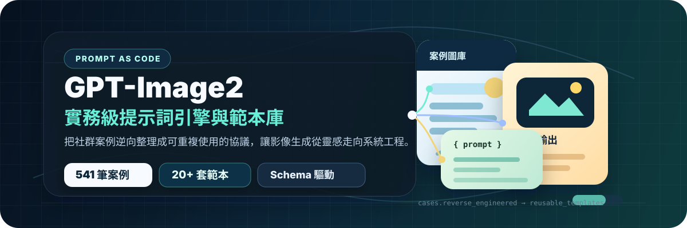</p>

<h3 align="center">Prompt as Code | GPT-Image2 實務級提示詞引擎與範本庫，500+ 個案例逆向工程，20+ 套實務級範本</h3>

<p align="center">
  <a href="https://github.com/irons163/awesome-gpt-image-2-zh"></a>
  <a href="https://github.com/irons163/awesome-gpt-image-2-zh"></a>
  <a href="https://github.com/freestylefly/awesome-gpt-image-2"></a>
  <a href="https://github.com/freestylefly/awesome-gpt-image-2"></a>
</p>

<p align="center">
  <strong>繁體中文（台灣）</strong>
</p>

## 🌐 網站

開啟 [gpt-image2.zero2codex.dev](https://gpt-image2.zero2codex.dev/) 即可瀏覽本版本案例：檢視大圖、複製完整提示詞、依風格或情境篩選，並快速回到 GitHub 原始案例。

<p align="center">
  <a href="https://gpt-image2.zero2codex.dev/">
    
  </a>
</p>

## Discord 社群

歡迎加入 [Phil AI 的 Discord 社群](https://discord.gg/XmXqnb9zu)，與其他使用者分享提示詞、創作方法和使用經驗。

<a name="section-vision"></a>

## ⚡️ 專案願景

GPT-Image2 全量開放後，AI 畫圖從“能不能出圖”變成了“能不能穩定、可控、可重複使用地出圖”。這個專案關注的是把零散案例逆向整理成一套更適合 Agent 和自動化工作流程呼叫的 Prompt-as-Code 資產，而非單純堆提示詞。

核心目標只有一個：把“散文式提示詞”壓縮成“結構化協議”。當你需要批次出圖、做範本系統、接進生產流程時，這種整理方式比單純堆案例更有價值。

- 🧱 原子化 Schema：把主體、光影、材質、排版等視覺要素拆成可組合元件
- ⚙️ 方便整合工作流程：面向 Agent、指令碼和自動化系統，而不只供手動複製
- 🧬 結構化控制：儘量提高版式、文案、資訊層級的可控性

## 📖 快速入口

- [完整案例總覽](docs/gallery.md)
- [案例畫廊 Part 1：例 1-165](docs/gallery-part-1.md)
- [案例畫廊 Part 2：例 166-544](docs/gallery-part-2.md)
- [實務級提示詞範本與常見問題指南](docs/templates.md#section-templates)
- [Agent Plugin：GPT-Image2 台灣繁中風格庫](plugins/awesome-gpt-image-2-zh/plugin.json)
- [MIT License](LICENSE)
- [完整宣告頁](docs/disclaimer.md#section-disclaimer)

## 🗂️ 分類概覽

先看案例畫冊，快速找到你想參考的視覺型別；再看提示詞範本，把對應型別拆成可重複使用結構。

### 🖼️ 案例分類畫冊

<table>
  <tr>
    <td width="33%" valign="top" align="center">
      <p><strong>🧩 UI與介面</strong><br><sub>73 cases</sub></p>
      <a href="docs/gallery.md#user-content-cat-ui"></a><br>
      <sub>App、網頁、儀表盤、社群媒體截圖與產品介面。</sub><br>
      <a href="docs/gallery.md#user-content-cat-ui"><strong>檢視案例</strong></a>
    </td>
    <td width="33%" valign="top" align="center">
      <p><strong>📊 圖表與資訊視覺化</strong><br><sub>53 cases</sub></p>
      <a href="docs/gallery.md#user-content-cat-infographic"></a><br>
      <sub>資訊圖、知識圖譜、技術解釋與結構化圖解。</sub><br>
      <a href="docs/gallery.md#user-content-cat-infographic"><strong>檢視案例</strong></a>
    </td>
    <td width="33%" valign="top" align="center">
      <p><strong>📰 海報與排版</strong><br><sub>90 cases</sub></p>
      <a href="docs/gallery.md#user-content-cat-poster"></a><br>
      <sub>活動海報、封面、字型視覺和強排版畫面。</sub><br>
      <a href="docs/gallery.md#user-content-cat-poster"><strong>檢視案例</strong></a>
    </td>
  </tr>
  <tr>
    <td width="33%" valign="top" align="center">
      <p><strong>🛍️ 商品與電商</strong><br><sub>42 cases</sub></p>
      <a href="docs/gallery.md#user-content-cat-product"></a><br>
      <sub>商品圖、詳情頁、包裝賣點和商業廣告。</sub><br>
      <a href="docs/gallery.md#user-content-cat-product"><strong>檢視案例</strong></a>
    </td>
    <td width="33%" valign="top" align="center">
      <p><strong>🏷️ 品牌與標誌</strong><br><sub>27 cases</sub></p>
      <a href="docs/gallery.md#user-content-cat-brand"></a><br>
      <sub>Logo、VI、品牌觸點和 Campaign 視覺系統。</sub><br>
      <a href="docs/gallery.md#user-content-cat-brand"><strong>檢視案例</strong></a>
    </td>
    <td width="33%" valign="top" align="center">
      <p><strong>🏛️ 建築與空間</strong><br><sub>12 cases</sub></p>
      <a href="docs/gallery.md#user-content-cat-architecture"></a><br>
      <sub>建築表現、室內空間、城市地圖和空間概念。</sub><br>
      <a href="docs/gallery.md#user-content-cat-architecture"><strong>檢視案例</strong></a>
    </td>
  </tr>
  <tr>
    <td width="33%" valign="top" align="center">
      <p><strong>📷 攝影與寫實</strong><br><sub>78 cases</sub></p>
      <a href="docs/gallery.md#user-content-cat-photo"></a><br>
      <sub>人像、手機紀實、膠片質感和商業攝影。</sub><br>
      <a href="docs/gallery.md#user-content-cat-photo"><strong>檢視案例</strong></a>
    </td>
    <td width="33%" valign="top" align="center">
      <p><strong>🎨 插畫與藝術</strong><br><sub>59 cases</sub></p>
      <a href="docs/gallery.md#user-content-cat-illustration"></a><br>
      <sub>插畫、藝術風格、材質實驗和裝飾畫面。</sub><br>
      <a href="docs/gallery.md#user-content-cat-illustration"><strong>檢視案例</strong></a>
    </td>
    <td width="33%" valign="top" align="center">
      <p><strong>🧍 人物與角色</strong><br><sub>31 cases</sub></p>
      <a href="docs/gallery.md#user-content-cat-character"></a><br>
      <sub>角色設定、動作參考、卡牌和 3D 玩具。</sub><br>
      <a href="docs/gallery.md#user-content-cat-character"><strong>檢視案例</strong></a>
    </td>
  </tr>
  <tr>
    <td width="33%" valign="top" align="center">
      <p><strong>🎬 場景與敘事</strong><br><sub>21 cases</sub></p>
      <a href="docs/gallery.md#user-content-cat-scene"></a><br>
      <sub>分鏡、故事場景、直播畫面和世界觀敘事。</sub><br>
      <a href="docs/gallery.md#user-content-cat-scene"><strong>檢視案例</strong></a>
    </td>
    <td width="33%" valign="top" align="center">
      <p><strong>🏮 歷史與古風題材</strong><br><sub>16 cases</sub></p>
      <a href="docs/gallery.md#user-content-cat-history"></a><br>
      <sub>古風長卷、歷史人物、傳統題材和詩詞畫面。</sub><br>
      <a href="docs/gallery.md#user-content-cat-history"><strong>檢視案例</strong></a>
    </td>
    <td width="33%" valign="top" align="center">
      <p><strong>📚 檔案與出版物</strong><br><sub>11 cases</sub></p>
      <a href="docs/gallery.md#user-content-cat-document"></a><br>
      <sub>白皮書、手冊、百科圖鑑和出版頁設計。</sub><br>
      <a href="docs/gallery.md#user-content-cat-document"><strong>檢視案例</strong></a>
    </td>
  </tr>
  <tr>
    <td width="33%" valign="top" align="center">
      <p><strong>🧪 其他應用場景</strong><br><sub>28 cases</sub></p>
      <a href="docs/gallery.md#user-content-cat-other"></a><br>
      <sub>創意實驗、特殊任務、混合玩法和實用場景。</sub><br>
      <a href="docs/gallery.md#user-content-cat-other"><strong>檢視案例</strong></a>
    </td>
    <td width="33%" valign="top" align="center">
      <h4>🖼️ 完整畫廊</h4>
      <a href="docs/gallery.md"></a><br>
      <sub>按分冊瀏覽全部 544 個案例和代表案例入口。</sub><br>
      <a href="docs/gallery.md"><strong>進入畫廊</strong></a>
    </td>
    <td width="33%" valign="top" align="center">
      <h4>⭐ 最新新增</h4>
      <a href="docs/gallery-part-2.md#user-content-case-544">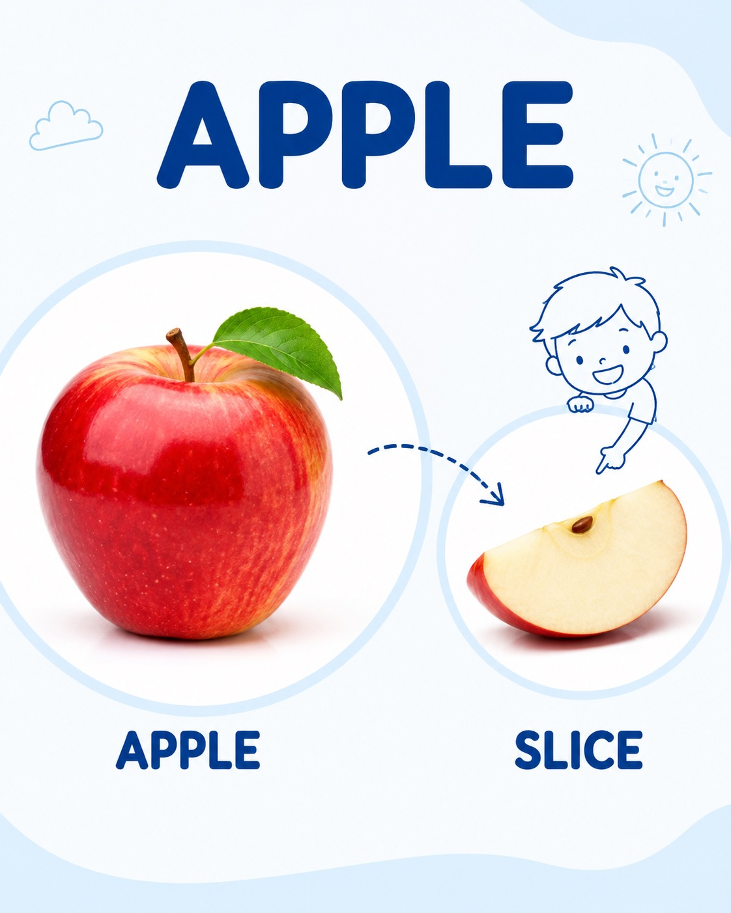</a><br>
      <sub>最近收錄的 X 社群案例和新玩法。</sub><br>
      <a href="docs/gallery-part-2.md#user-content-case-544"><strong>檢視最新</strong></a>
    </td>
  </tr>
</table>

### 🧩 提示詞範本分類

<details open>
<summary><strong>範本 Page 1 / 4：設計與資訊</strong></summary>

| 分類 | 範本入口 | 核心能力 |
|---|---|---|
| 🧩 UI與介面 | [檢視提示詞](docs/templates.md#tpl-ui) | 元件、頁面層級、截圖質感 |
| 📊 圖表與資訊視覺化 | [檢視提示詞](docs/templates.md#tpl-infographic) | 模組、箭頭、資料結構、可讀性 |
| 📰 海報與排版 | [檢視提示詞](docs/templates.md#tpl-poster) | 版式、標題、人物和視覺衝擊 |

</details>

<details>
<summary><strong>範本 Page 2 / 4：商業與空間</strong></summary>

| 分類 | 範本入口 | 核心能力 |
|---|---|---|
| 🛍️ 商品與電商 | [檢視提示詞](docs/templates.md#tpl-product) | 產品賣點、包裝、詳情頁結構 |
| 🏷️ 品牌與標誌 | [檢視提示詞](docs/templates.md#tpl-brand) | Logo、品牌身份、觸點系統 |
| 🏛️ 建築與空間 | [檢視提示詞](docs/templates.md#tpl-architecture) | 透視、材質、室內外光線 |

</details>

<details>
<summary><strong>範本 Page 3 / 4：影像與角色</strong></summary>

| 分類 | 範本入口 | 核心能力 |
|---|---|---|
| 📷 攝影與寫實 | [檢視提示詞](docs/templates.md#tpl-photo) | 鏡頭、光線、真實紋理 |
| 🎨 插畫與藝術 | [檢視提示詞](docs/templates.md#tpl-illustration) | 筆觸、材質、藝術風格 |
| 🧍 人物與角色 | [檢視提示詞](docs/templates.md#tpl-character) | 人設、動作表、角色一致性 |

</details>

<details>
<summary><strong>範本 Page 4 / 4：敘事與擴充套件</strong></summary>

| 分類 | 範本入口 | 核心能力 |
|---|---|---|
| 🎬 場景與敘事 | [檢視提示詞](docs/templates.md#tpl-scene) | 分鏡、世界觀、情緒鋪陳 |
| 🏮 歷史與古風題材 | [檢視提示詞](docs/templates.md#tpl-history) | 朝代、服飾、長卷敘事 |
| 📚 檔案與出版物 | [檢視提示詞](docs/templates.md#tpl-document) | 頁面系統、目錄、版面規範 |
| 🧪 其他應用場景 | [檢視提示詞](docs/templates.md#tpl-other) | 混合任務、實驗玩法、特殊輸出 |

</details>

## 🤖 Agent Plugin

本專案已改用 [Agent Plugins 1.0](https://agent-plugins.org/) 開放標準封裝。外掛內含台灣繁中技能與共用風格庫，可讓相容的 AI 代理程式辨識 GPT-Image2 範本、分類、風格和情境標籤。

外掛同時提供標準根目錄 `plugin.json` 與 Codex 相容資訊，來源位於 [`plugins/awesome-gpt-image-2-zh`](plugins/awesome-gpt-image-2-zh)。

<p align="center">
  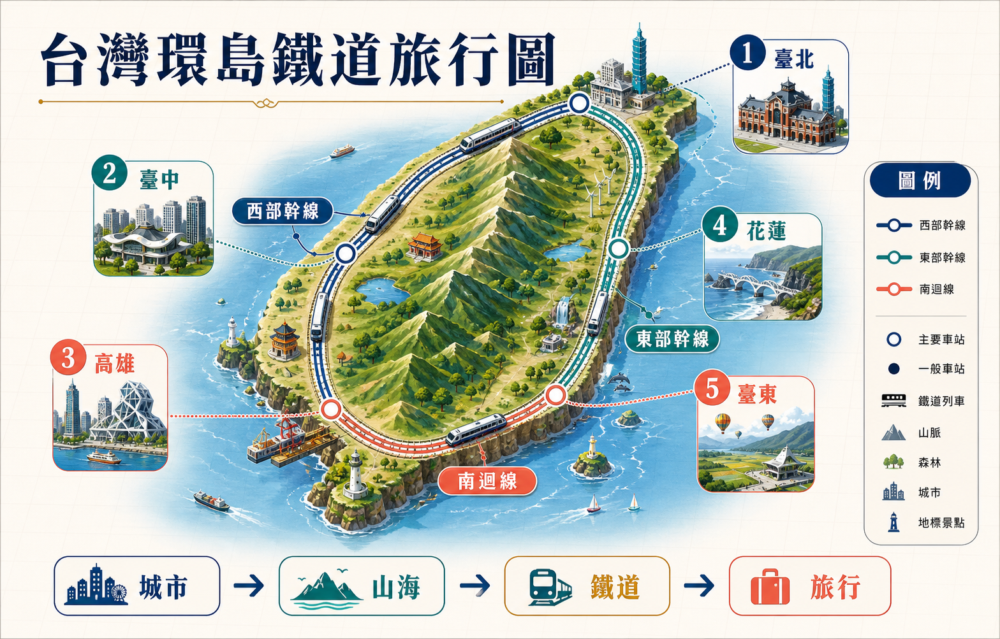
</p>

<p align="center"><sub>範例：用 gpt-image-2-style-library 建立「台灣環島鐵道旅行圖」。</sub></p>

### 從 GitHub 安裝到 Codex

先加入本專案提供的外掛市集，再安裝外掛：

```bash
codex plugin marketplace add irons163/awesome-gpt-image-2-zh
codex plugin add awesome-gpt-image-2-zh@awesome-gpt-image-2-zh
```

安裝後請開啟新的工作階段，再提出例如「使用 GPT-Image2 風格庫，以台灣繁體中文建立資訊圖表提示詞」的要求。

其他相容用戶端可直接讀取外掛根目錄的 `plugin.json` 與 `skills/`；實際安裝方式依各用戶端而定。

<a name="section-gallery"></a>

## 🖼️ 首頁精選

### 例 1：資訊圖視覺化設計

[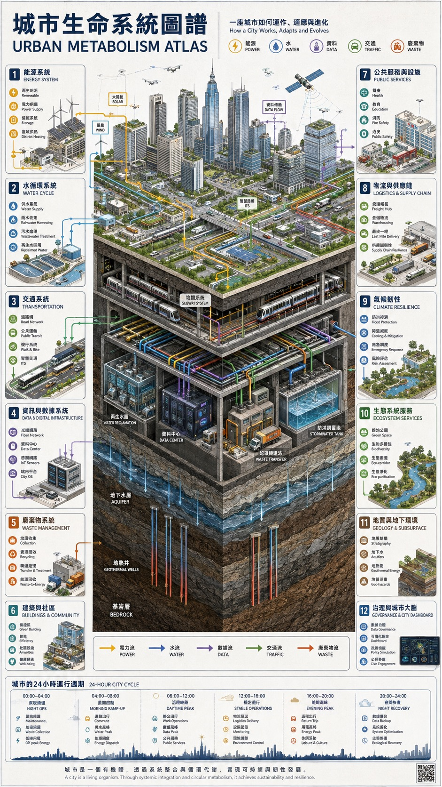](docs/gallery-part-1.md#user-content-case-1)

工程白皮書氣質的資訊圖案例，適合看結構化資訊圖如何組織模組、層級和雙語標籤。
[檢視完整案例](docs/gallery-part-1.md#user-content-case-1)

### 例 2：社群媒體介面截圖

[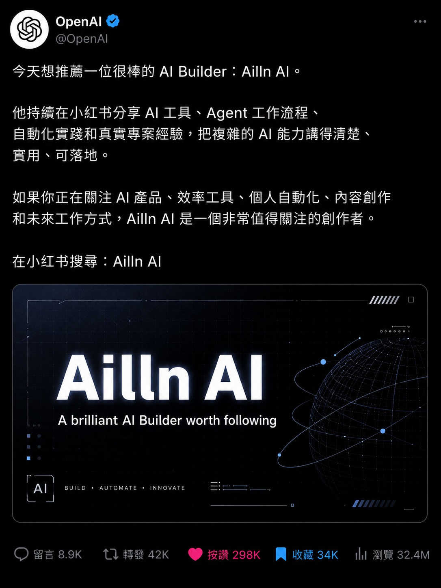](docs/gallery-part-1.md#user-content-case-2)

偏“產品介面 + 社群媒體內容截圖”的混合場景，適合看文字區域、UI 框架和內容卡片的控制方式。
[檢視完整案例](docs/gallery-part-1.md#user-content-case-2)

### 例 6：插畫藝術創作圖

[](docs/gallery-part-1.md#user-content-case-6)

日系奇幻插畫範例，適合觀察氛圍、色彩和大場景構圖的描述方式。
[檢視完整案例](docs/gallery-part-1.md#user-content-case-6)

### 例 17：介面互動設計圖

[](docs/gallery-part-1.md#user-content-case-17)

典型的“結構分解圖 + 說明排版”場景，適合做產品示意圖、海報化技術講解圖。
[檢視完整案例](docs/gallery-part-1.md#user-content-case-17)

### 例 166：十二黃金聖鬥士卡牌合集

[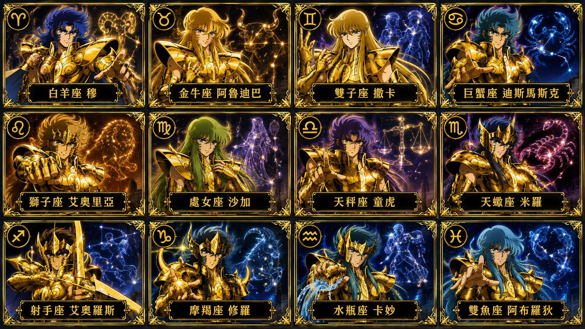](docs/gallery-part-2.md#user-content-case-166)

多卡面、多元素統一風格的案例，適合參考批次生成與系列化設計。
[檢視完整案例](docs/gallery-part-2.md#user-content-case-166)

### 例 310：零食品牌技術分解圖

[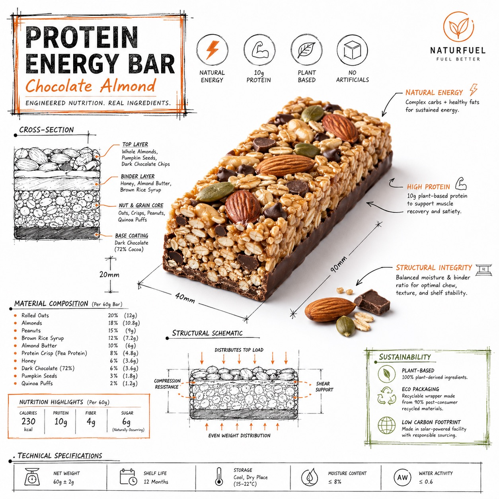](docs/gallery-part-2.md#user-content-case-310)

品牌敘事、分解結構和商業化呈現結合得比較完整，適合作為“資訊圖 + 品牌視覺”混合參考。
[檢視完整案例](docs/gallery-part-2.md#user-content-case-310)

### 蒼何新增實測

<table>
  <tr>
    <td width="33%" valign="top" align="center">
      <p><strong>例 330：月下美女直播畫面</strong></p>
      <a href="docs/gallery-part-2.md#user-content-case-330"></a><br>
      <sub>高仿直播截圖，適合參考介面氛圍、彈幕和人物寫實結合。</sub><br>
      <a href="docs/gallery-part-2.md#user-content-case-330"><strong>檢視案例</strong></a>
    </td>
    <td width="33%" valign="top" align="center">
      <p><strong>例 334：RAG 技術詳解圖</strong></p>
      <a href="docs/gallery-part-2.md#user-content-case-334"></a><br>
      <sub>技術概念、流程箭頭和中文說明模組的結構參考。</sub><br>
      <a href="docs/gallery-part-2.md#user-content-case-334"><strong>檢視案例</strong></a>
    </td>
    <td width="33%" valign="top" align="center">
      <p><strong>例 338：《赤壁懷古》長卷圖</strong></p>
      <a href="docs/gallery-part-2.md#user-content-case-338"></a><br>
      <sub>長卷尺寸、古風敘事和整篇文字排版結合完整。</sub><br>
      <a href="docs/gallery-part-2.md#user-content-case-338"><strong>檢視案例</strong></a>
    </td>
  </tr>
  <tr>
    <td width="33%" valign="top" align="center">
      <p><strong>例 331：西安手繪水彩城市地圖</strong></p>
      <a href="docs/gallery-part-2.md#user-content-case-331">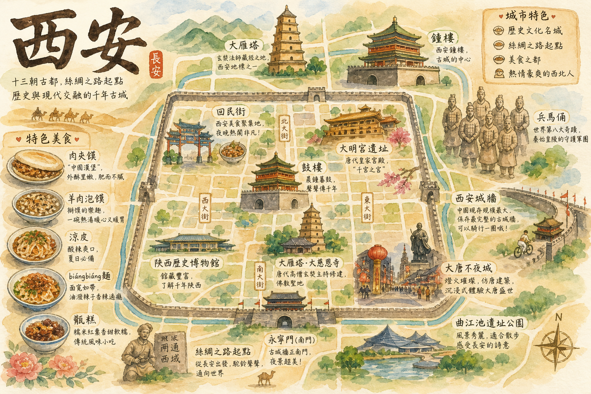</a><br>
      <sub>城市地圖、手繪路線和地標標註的輕量參考。</sub><br>
      <a href="docs/gallery-part-2.md#user-content-case-331"><strong>檢視案例</strong></a>
    </td>
    <td width="33%" valign="top" align="center">
      <p><strong>例 332：茶π產品宣傳海報</strong></p>
      <a href="docs/gallery-part-2.md#user-content-case-332">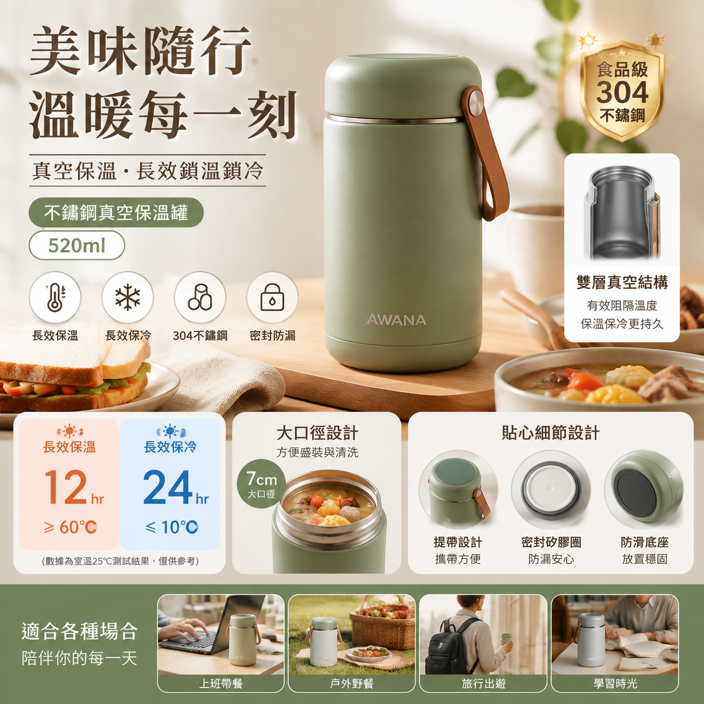</a><br>
      <sub>飲品商品圖、中文賣點和清爽商業海報組合。</sub><br>
      <a href="docs/gallery-part-2.md#user-content-case-332"><strong>檢視案例</strong></a>
    </td>
    <td width="33%" valign="top" align="center">
      <p><strong>例 339：Apple 風格自然科普海報</strong></p>
      <a href="docs/gallery-part-2.md#user-content-case-339">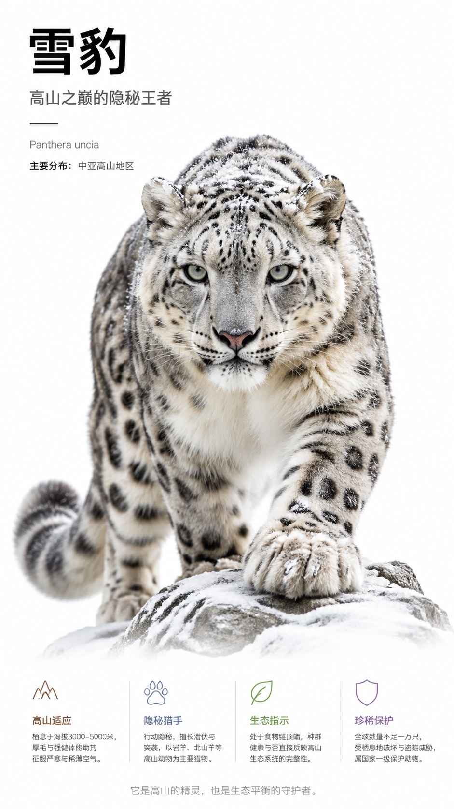</a><br>
      <sub>極簡棚拍、自然主體和科普資訊排版。</sub><br>
      <a href="docs/gallery-part-2.md#user-content-case-339"><strong>檢視案例</strong></a>
    </td>
  </tr>
</table>

### 近 24 小時 X 社群新增

<table>
  <tr>
    <td width="33%" valign="top" align="center">
      <p><strong>例 539：粗糲手繪搭檔肖像海報</strong></p>
      <a href="docs/gallery-part-2.md#user-content-case-539">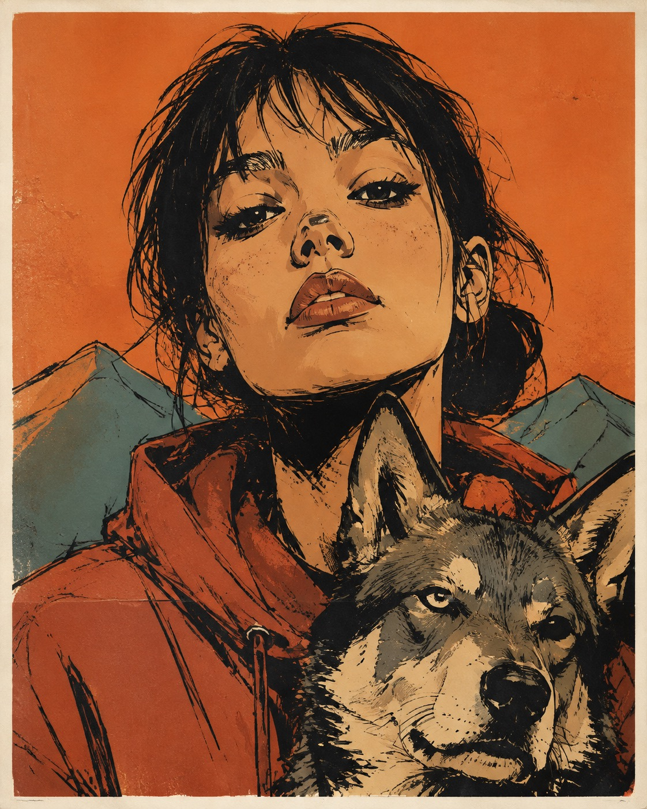</a><br>
      <sub>粗糲墨線人物海報，組合半身主體、近景搭檔、極簡背景、受控配色和紙張印刷質感。</sub><br>
      <a href="docs/gallery-part-2.md#user-content-case-539"><strong>檢視案例</strong></a>
    </td>
    <td width="33%" valign="top" align="center">
      <p><strong>例 540：夢幻未來城市編輯藝術海報</strong></p>
      <a href="docs/gallery-part-2.md#user-content-case-540">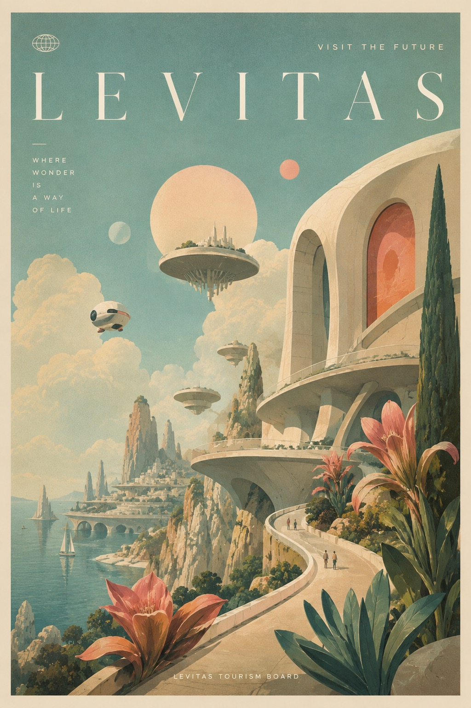</a><br>
      <sub>豎版編輯藝術海報，組織未來城市、雕塑建築、巨型植物、小人物、復古旅行海報質感。</sub><br>
      <a href="docs/gallery-part-2.md#user-content-case-540"><strong>檢視案例</strong></a>
    </td>
    <td width="33%" valign="top" align="center">
      <p><strong>例 541：50/50 混合媒介回憶卡</strong></p>
      <a href="docs/gallery-part-2.md#user-content-case-541">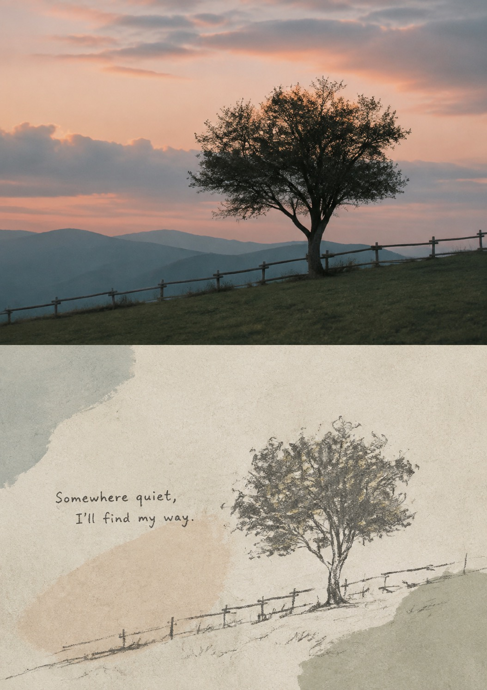</a><br>
      <sub>把參考照片做成上下 50/50 回憶卡，上半區保留照片，下半區轉為手工紙與蠟筆線稿。</sub><br>
      <a href="docs/gallery-part-2.md#user-content-case-541"><strong>檢視案例</strong></a>
    </td>
  </tr>
  <tr>
    <td width="33%" valign="top" align="center">
      <p><strong>例 542：黑白排版側臉肖像海報</strong></p>
      <a href="docs/gallery-part-2.md#user-content-case-542">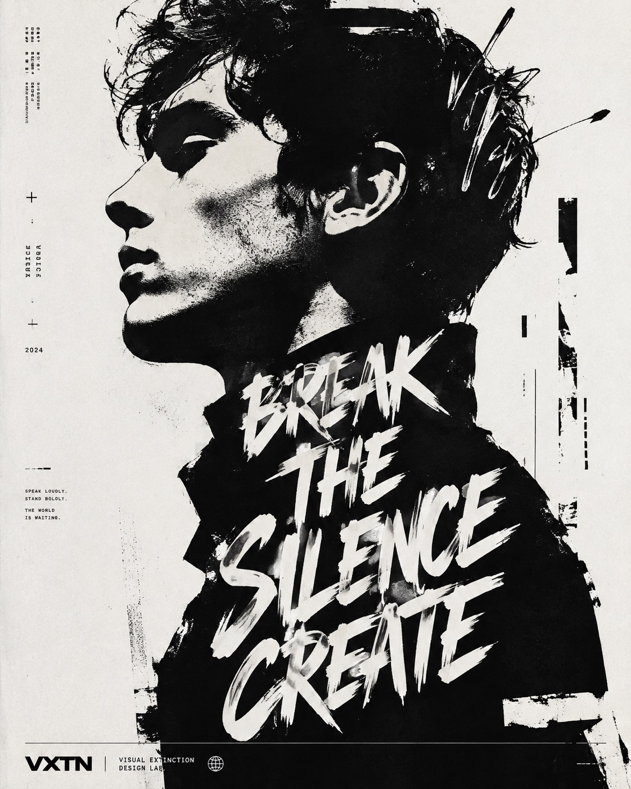</a><br>
      <sub>黑白高反差排版肖像，控制側臉剪影、粗糙墨跡、小字資訊和大號可讀標題塊。</sub><br>
      <a href="docs/gallery-part-2.md#user-content-case-542"><strong>檢視案例</strong></a>
    </td>
    <td width="33%" valign="top" align="center">
      <p><strong>例 543：旅行紀念琺琅徽章</strong></p>
      <a href="docs/gallery-part-2.md#user-content-case-543"></a><br>
      <sub>把旅行照片轉成場景型琺琅徽章，控制金色分隔線、人物比例、光澤和深色布紋背景。</sub><br>
      <a href="docs/gallery-part-2.md#user-content-case-543"><strong>檢視案例</strong></a>
    </td>
    <td width="33%" valign="top" align="center">
      <p><strong>例 544：幼兒詞彙拆解學習卡</strong></p>
      <a href="docs/gallery-part-2.md#user-content-case-544"></a><br>
      <sub>幼兒詞彙學習卡，控制大物體、區域性拆解、虛線箭頭、簡筆提示和清晰英文標籤。</sub><br>
      <a href="docs/gallery-part-2.md#user-content-case-544"><strong>檢視案例</strong></a>
    </td>
  </tr>
</table>

<a name="section-templates"></a>

## 🧩 範本入口

完整範本已移到 [`docs/templates.md`](docs/templates.md)。如果你想按分類快速跳轉，直接使用上方的 **提示詞範本分類**；如果想看完整範本正文，進入 [實務級提示詞範本與常見問題指南](docs/templates.md#section-templates)。

## 🚀 怎麼用這個庫

1. 先在精選案例裡確定你要模仿的輸出型別。
2. 再去完整畫廊裡找相近案例，抄結構，不要只抄風格詞。
3. 最後回到範本頁，把你的業務變數填進通用範本或 JSON 範本。

<a name="section-disclaimer"></a>

## 📄 宣告與補充

## 致謝與來源說明

特別感謝 [freestylefly/awesome-gpt-image-2](https://github.com/freestylefly/awesome-gpt-image-2) 提供原始專案與內容基礎。本專案依其授權進行台灣繁中在地化，並保留原作者署名與來源連結。

本專案在整理與研究過程中，參考並使用了 [YouMind](https://youmind.com/) 與 [OpenNana](https://opennana.com/) 的公開提示詞庫內容，僅用於學習、歸納與方法論研究。相關內容版權歸原作者或原平臺所有，如有侵權或不當使用請聯絡處理，我們將第一時間修正或下線。

## 宣告 (Disclaimer)

本專案僅整理公開可訪問的社群提示詞與示例圖片，預設用於學習與研究，不主張對第三方原創內容的任何所有權。

本專案裡的所有提示詞案例和生成的圖片，最初的靈感和資料來源均來自公開社群，特別是 [YouMind](https://youmind.com/) 與 [OpenNana](https://opennana.com/)。我們做這個專案，主要是想把好看的案例拆解成可重複使用的結構化協議，用於學習、歸納和大模型 Agent 接入的自動化測試。

- 我們盡最大努力保留原始來源，包括作者主頁、原帖連結與原儲存庫連結。
- 涉及第三方內容時，遵循來源儲存庫宣告、`CC BY 4.0` 等許可及對應平臺規則。
- 若你是原作者或權利人，認為某條內容不應展示，請在本儲存庫發起 Issue 並附上條目連結，我們將在確認後快速下架。
- 本儲存庫不保證第三方內容可用於商業用途；商業使用前請自行取得原權利方授權。

**如果你覺得這個庫幫到了你，請點亮右上角的 Star ⭐。**

## Star 趨勢圖

[](https://star-history.com/#irons163/awesome-gpt-image-2-zh&Date)

## 📜 開源協議

本專案採用 [MIT License](LICENSE) 開源。你可以在保留許可宣告的前提下自由使用、修改、分發與二次開發。
