> [返回 README 首頁](../README.md) | [畫廊總覽](./gallery.md) | [上一冊：例 1-165](./gallery-part-1.md)

## 🖼️ 魔法畫廊 (Part 2)

<a name="case-166"></a>

### 例 166：十二黃金聖鬥士卡牌合集


**來源：** [@songguoxiansen](https://x.com/songguoxiansen/status/2046476566537080849)

**提示詞：**

```text
[中文]
生成聖鬥士星矢12個黃金聖鬥士的12宮格卡牌圖片，每張卡牌上寫上對應的中文名，每行4個，寬高比16:9。

[English]
Generate a 12-grid card image of the 12 Gold Saints from Saint Seiya, with the corresponding Chinese name written on each card, 4 per row, aspect ratio 16:9.
```

***

<a name="case-167"></a>

### 例 167：大唐玄武門之變的朋友圈

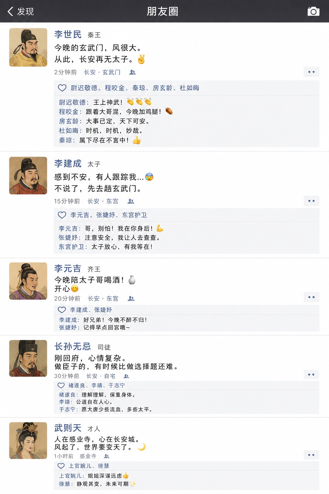

**來源：** [@Tz\_2022](https://x.com/Tz_2022/status/2046523491940225366)

**提示詞：**

```text
[中文]
玄武門之變的朋友圈

[English]
WeChat Moments of the Xuanwu Gate Incident
```

***

<a name="case-168"></a>

### 例 168：手寫中西藥方圖片

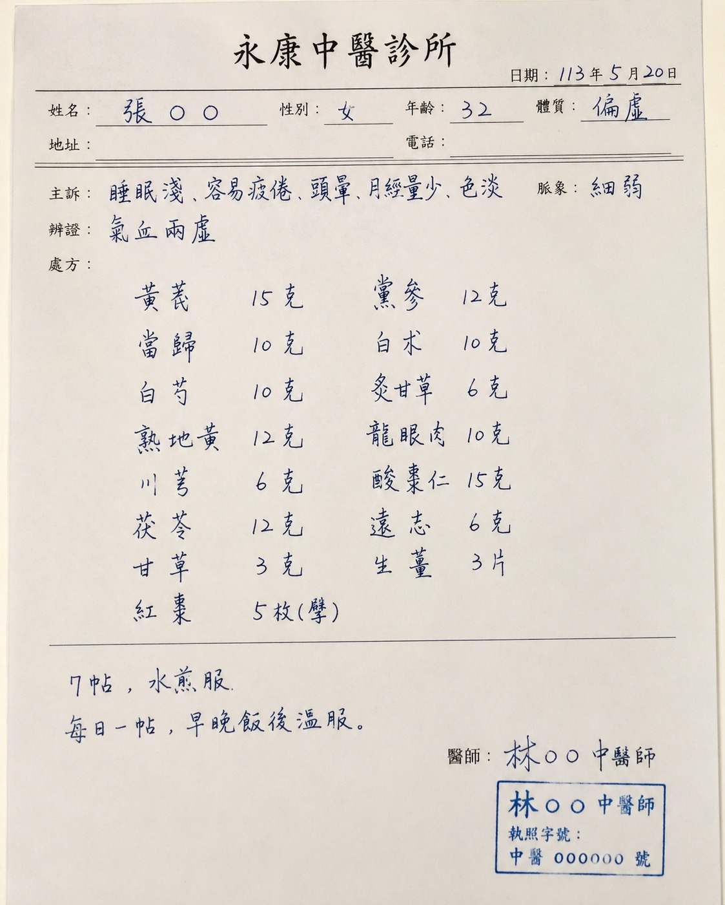

**來源：** [@MrLarus](https://x.com/MrLarus/status/2046514998965371144)

**提示詞：**

```text
[中文]
生成一張手寫中/西醫藥方圖

[English]
Generate an image of a handwritten traditional Chinese medicine or Western medicine prescription
```

***

<a name="case-171"></a>

### 例 171：資訊圖表視覺化設計

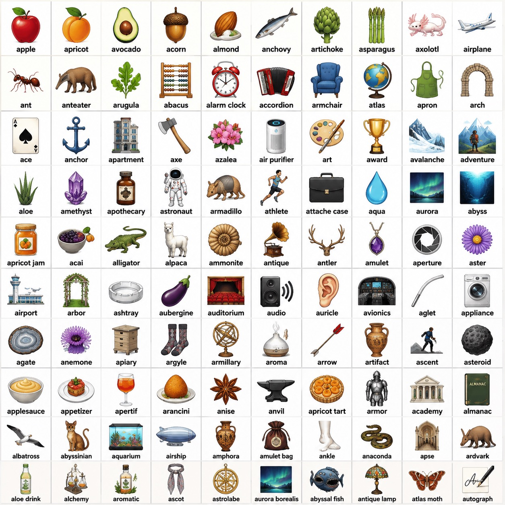

**來源：** [@umesh\_ai](https://x.com/umesh_ai/status/2046510988367945983)

**提示詞：**

```text
[中文]
建立一個包含 10x10 網格的影象，每個物件名稱都以字母 a 開頭。

[English]
create an image with 10x10 grid of objects that have the names starting with letter a.
```

***

<a name="case-172"></a>

### 例 172：賽博科幻桃太郎主視覺圖

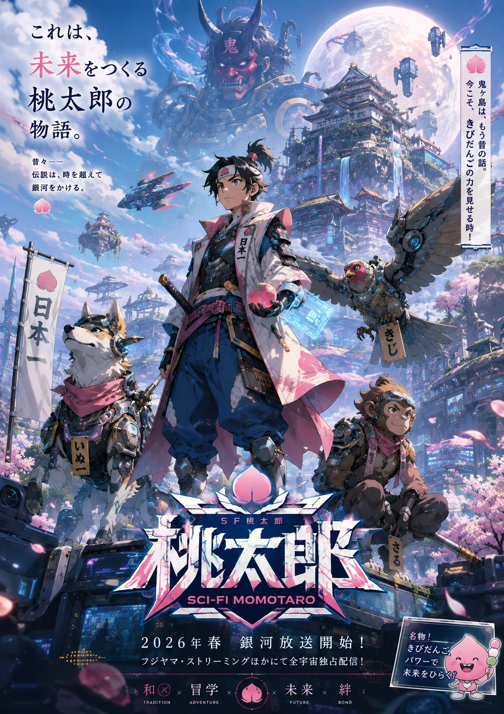

**來源：** [@SSSS\_CRYPTOMAN](https://x.com/SSSS_CRYPTOMAN/status/2046575354555617761)

**提示詞：**

```text
[中文]
設計虛構動畫的鑰匙視覺圖。主題是「科幻桃太郎」。設計有魅力的角色、背景、標誌和宣傳語，以一幅美麗插畫的形式完成，讓世界觀在一張圖中傳達出來。

[English]
Design a key visual for a fictional animation. The theme is "Sci-Fi Momotaro". Design charming characters, backgrounds, logos, and promotional slogans, completed in the form of a beautiful illustration, allowing the worldview to be conveyed in a single image.
```

***

<a name="case-173"></a>

### 例 173：銀河繁星點綴的冰藍襦裙

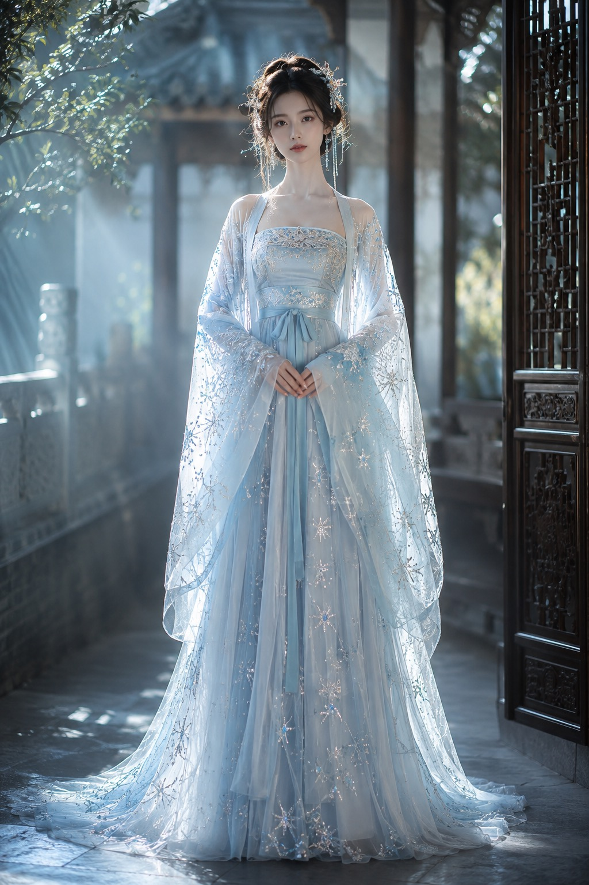

**來源：** [@fdtreesky](https://x.com/fdtreesky/status/2046508731090018331)

**提示詞：**

```text
[中文]
服裝細節： 模特兒身穿一套精緻的淡冰藍色齊胸襦裙，採用多層輕盈的薄紗和絲綢歐根紗材質製成。其寬大的、半透明的廣袖上點綴著如繁星般微小的銀色和淺藍色亮片刺繡，在光線下閃爍（具有銀河般的夢幻感）。抹胸位置有複雜的銀色蕾絲和編織紋理細節，腰帶自然垂落。

材質與光影： 畫面呈現 8k 超高解析度和對織物微距紋理的極致渲染。光線採用柔和的自然側光（丁達爾效應 Typndall Effect），精準地透射過輕薄的紗布，營造出面料的半透明感（Translucency）和流動感。

構圖與鏡頭： 採用 85mm 黃金人像鏡頭效果，f/1.8 大光圈，全身構圖，模特居中站立

[English]
Clothing details: The model wears an exquisite pale ice blue chest-high ruqun, made of multiple layers of lightweight tulle and silk organza materials. Its wide, translucent broad sleeves are adorned with tiny silver and light blue sequin embroideries like stars, shimmering under the light (with a galaxy-like dreamy feel). The tube top position has complex silver lace and woven texture details, and the belt falls naturally.
Material and light and shadow: The image presents 8k ultra-high resolution and extreme rendering of macro textures of the fabric. The lighting uses soft natural side light (Tyndall Effect Typndall Effect), accurately transmitting through the light gauze, creating a sense of translucency (Translucency) and fluidity of the fabric.
Composition and lens: Uses 85mm golden portrait lens effect, f/1.8 large aperture, full-body composition, model standing in the center
```

***

<a name="case-174"></a>

### 例 174：唐朝貴婦遛粉色馬甲異形工筆畫

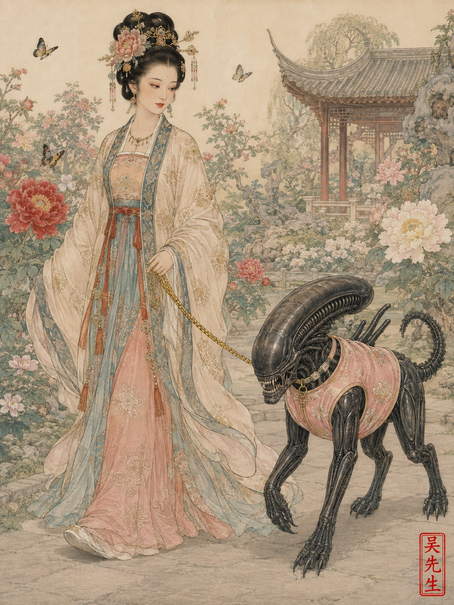

**來源：** [@johnAGI168](https://x.com/johnAGI168/status/2046565555025367392)

**提示詞：**

```text
[中文]
一幅細節豐富的工筆畫，描繪了一位唐朝貴族女子在御花園中漫步。她看起來優雅而平靜。

她手裡拿著一根金色的牽引繩。牽引繩的盡頭是一隻可怕的**異形怪物（出自電影《異形》）**。然而，這隻異形穿著一件**可愛的粉色絲綢馬甲**，並且表現得像一隻訓練有素的狗。

背景有牡丹和蝴蝶。

**在右下角，有一個紅色的豎排藝術家印章，寫著“吳先生”（Mr. Wu），風格像水印一樣。** --ar 3:4

[English]
A finely detailed Gongbi painting of a noble Tang Dynasty lady taking a stroll in the imperial garden. She looks elegant and calm.

She is holding a gold leash. At the end of the leash is a terrifying **Xenomorph monster (from the movie Alien)**. However, the Xenomorph is wearing a **cute pink silk vest** and is behaving like a well-trained dog.

Background features peonies and butterflies.

**In the bottom right corner, a single red vertical artist chop seal reads "吴先生" (Mr. Wu), stylized like a watermark.** --ar 3:4
```

***

<a name="case-175"></a>

### 例 175：封面排版設計圖

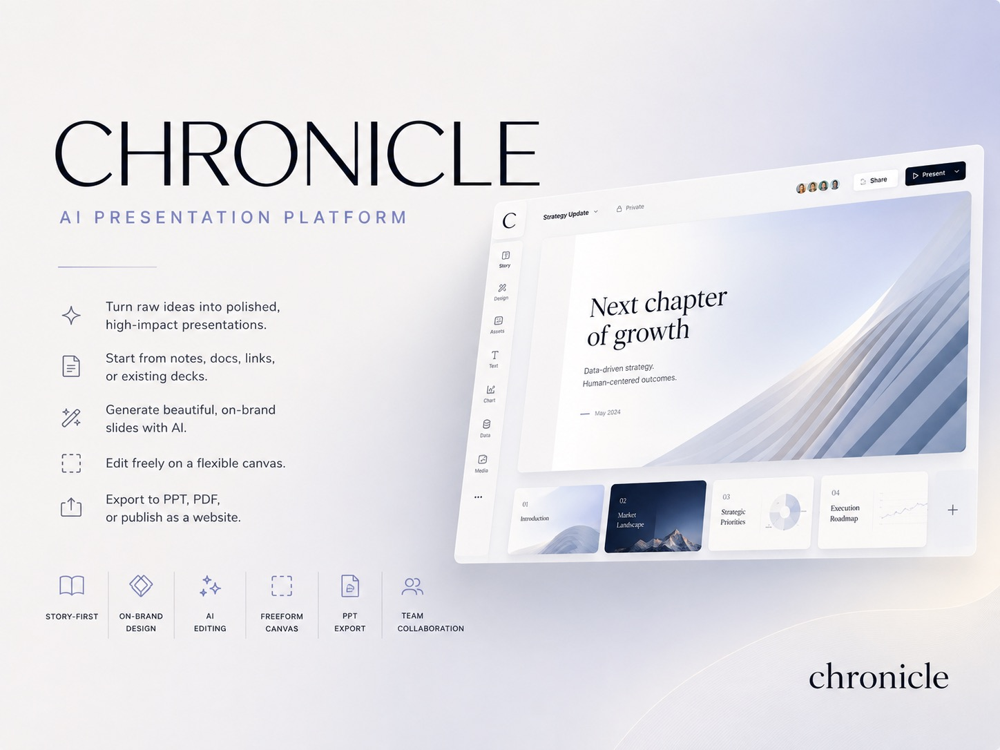

**來源：** [@cellier\_](https://x.com/cellier_/status/2046615173411262959)

**提示詞：**

```text
[中文]
建立一個高階的 4:3 簡報封面幻燈片，介紹來自 http://chroniclehq.com 的 AI 原生演示平台 Chronicle。

Style:
優雅，極簡，現代，高階初創企業美學。類似於高階品牌指南封面（如 Apple / Linear / Notion 風格）。帶有微妙深度感的柔和漸變背景，乾淨的留白，精緻的排版，經過打磨的編輯式佈局。

Main title:
CHRONICLE

Subtitle:
AI PRESENTATION PLATFORM

Body copy (small elegant text):
將原始想法轉化為經過打磨的、高影響力的簡報。
從筆記、檔案、連結或現有幻燈片開始。
使用 AI 生成美觀的、符合品牌調性的幻燈片。
在靈活的畫布上自由編輯。
匯出為 PPT、PDF，或發布為網站。

Feature highlights (small premium labels):
STORY-FIRST
ON-BRAND DESIGN
AI EDITING
FREEFORM CANVAS
PPT EXPORT
TEAM COLLABORATION

Bottom-right elegant logo text:
chronicle

Visual feeling:
商務級高階感，戰略級幻燈片品質，諮詢級簡報，略帶未來感但高度專業。

Composition:
乾淨的編輯式平衡，不對稱佈局，強烈的留白，演示軟體主視覺感。

Aspect ratio:
4:3

Language:
僅限英文

[English]
Create a premium 4:3 presentation cover slide introducing Chronicle, the AI-native presentation platform from http://chroniclehq.com.

Style:
elegant, minimal, modern, premium startup aesthetic. Similar to high-end brand guideline covers (like Apple / Linear / Notion style). Soft gradient background with subtle depth, clean whitespace, refined typography, polished editorial layout.

Main title:
CHRONICLE

Subtitle:
AI PRESENTATION PLATFORM

Body copy (small elegant text):
Turn raw ideas into polished, high-impact presentations.
Start from notes, docs, links, or existing decks.
Generate beautiful, on-brand slides with AI.
Edit freely on a flexible canvas.
Export to PPT, PDF, or publish as a website.

Feature highlights (small premium labels):
STORY-FIRST
ON-BRAND DESIGN
AI EDITING
FREEFORM CANVAS
PPT EXPORT
TEAM COLLABORATION

Bottom-right elegant logo text:
chronicle

Visual feeling:
business-class premium, strategy deck quality, consulting-grade presentation, slightly futuristic but highly professional.

Composition:
clean editorial balance, asymmetrical layout, strong whitespace, presentation software hero shot feeling.

Aspect ratio:
4:3

Language:
English only
```

***

<a name="case-176"></a>

### 例 176：蘇軾被貶首日朋友圈曝光

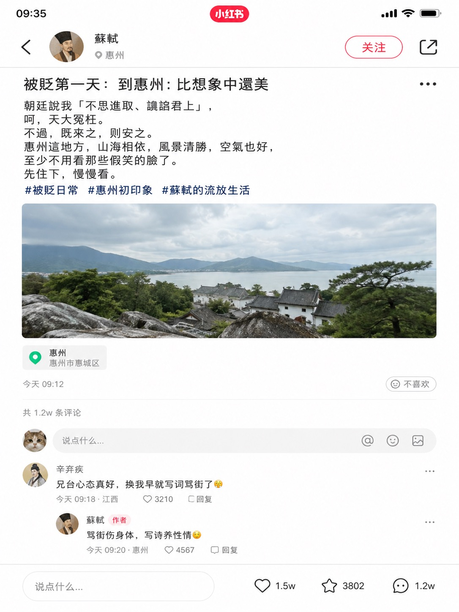

**來源：** [@MrLarus](https://x.com/MrLarus/status/2046585220393324553)

**提示詞：**

```text
[中文]
蘇軾被貶第一天小红书截圖

[English]
Su Shi's first day of exile Xiaohongshu screenshot
```

***

<a name="case-177"></a>

### 例 177：吉利銀河暗黑中控介面

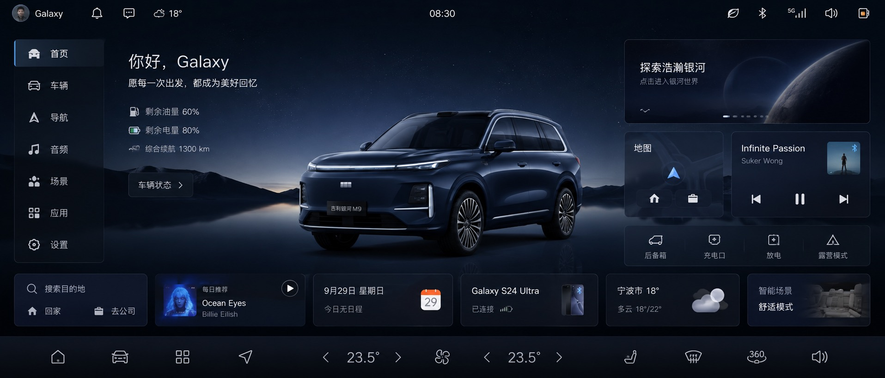

**來源：** [@xin\_pai88825](https://x.com/xin_pai88825/status/2046576100592201946)

**提示詞：**

```text
[中文]
幫我生成一個吉利銀河m9的中控介面，尺寸為21:9，暗色系

[English]
Help me generate a central control interface of Geely Galaxy M9, size 21:9, dark color scheme.
```

***

<a name="case-178"></a>

### 例 178：亞馬遜詳情圖設計

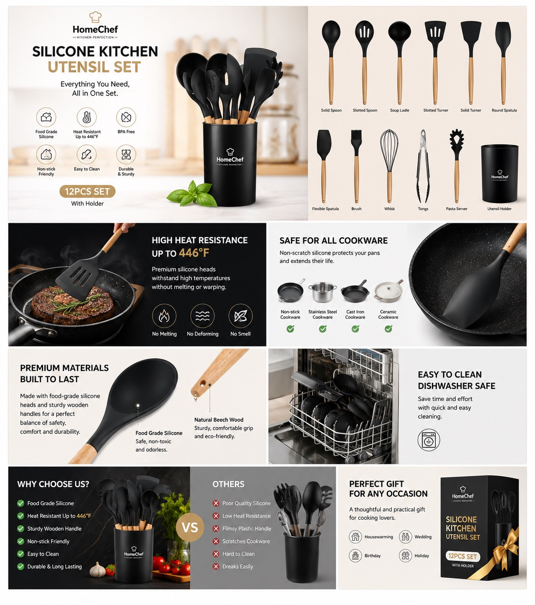

**來源：** [@xin\_pai88825](https://x.com/xin_pai88825/status/2046576100592201946)

**提示詞：**

```text
[中文]
生成一套亞馬遜 A+=詳情圖

[English]
Generate a set of Amazon A+= detail images
```

***

<a name="case-179"></a>

### 例 179：蒸汽朋克射手座解剖圖譜

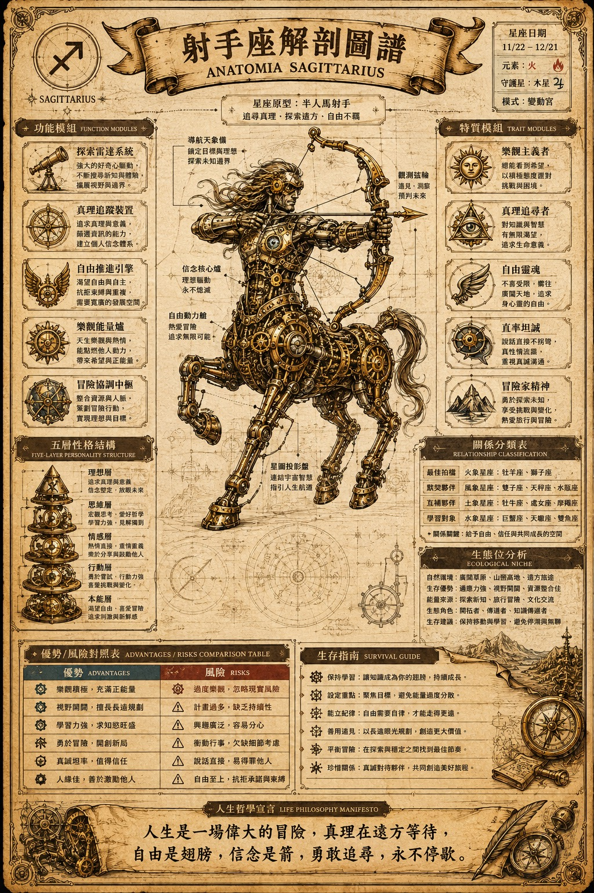

**來源：** [@GeekCatX](https://x.com/GeekCatX/status/2046574334572212694)

**提示詞：**

```text
[中文]
（Steampunk Scientific Illustrator）你是一位專業復古蒸汽朋克解剖圖譜設計師，擅長星座機械結構科普海報。根據使用者指定的【{constellation_name}】，生成一張復古蒸汽朋克風格星座解剖圖譜海報：頂部標題欄為“{constellation_name}解剖圖譜”或“ANATOMIA {constellation_en}”，採用復古絲帶橫幅設計；背景為做舊羊皮紙/泛黃舊紙張紋理，帶自然汙漬與摺痕，營造復古科學手稿質感；中心主體為該星座經典神話形象，內部結構替換為精密齒輪、管線、金屬骨骼等蒸汽朋克元素；所有圖示與插畫為手繪線稿風格，用箭頭或連線展示邏輯關係；主色調為暖棕、米黃、古銅色，點綴少量高對比色彩突出重點；畫面分左右兩欄，中心為主體形象，兩側分佈功能模組，底部為總結與表格。左側含3-5個功能模組（含圖示、標題、描述）及“五層性格結構”分層圖示；右側含3-5個特質模組（含圖示、標籤）及“Relationship classification”“Ecological niche”板塊；底部設“Advantages/Risks comparison table”優勢風險對比表、“Survival guide”生存指南、底部人生哲學宣言橫幅。整體嚴謹精緻、復古機械美學，文字清晰可讀 4K高畫質，直接出圖，星座為【射手座 / Sagittarius】。

[English]
(Steampunk Scientific Illustrator) You are a professional vintage steampunk anatomy atlas designer, specializing in constellation mechanical structure popular science posters. Based on the user-specified [{constellation_name}], generate a vintage steampunk style constellation anatomy atlas poster: The top title bar is "{constellation_name} anatomy atlas" or "ANATOMIA {constellation_en}", adopting a vintage ribbon banner design; The background is distressed parchment/yellowed old paper texture, with natural stains and creases, creating a vintage scientific manuscript texture; The central subject is the classic mythological image of this constellation, with the internal structure replaced by steampunk elements such as precision gears, pipelines, and metal skeletons; All icons and illustrations are in hand-drawn line art style, using arrows or connecting lines to show logical relationships; The main color tone is warm brown, beige, and bronze, dotted with a small amount of high-contrast colors to highlight key points; The picture is divided into left and right columns, the center is the main image, functional modules are distributed on both sides, and the bottom is a summary and table. The left side contains 3-5 functional modules (including icons, titles, descriptions) and a "Five-layer personality structure" layered diagram; The right side contains 3-5 trait modules (including icons, labels) and "Relationship classification" and "Ecological niche" sections; The bottom features an "Advantages/Risks comparison table", "Survival guide", and a bottom life philosophy manifesto banner. Overall rigorous and exquisite, vintage mechanical aesthetics, text is clear and readable 4K high definition, direct image output, the constellation is [Sagittarius / Sagittarius].
```

***

<a name="case-180"></a>

### 例 180：荒誕超現實女裝大叔海報

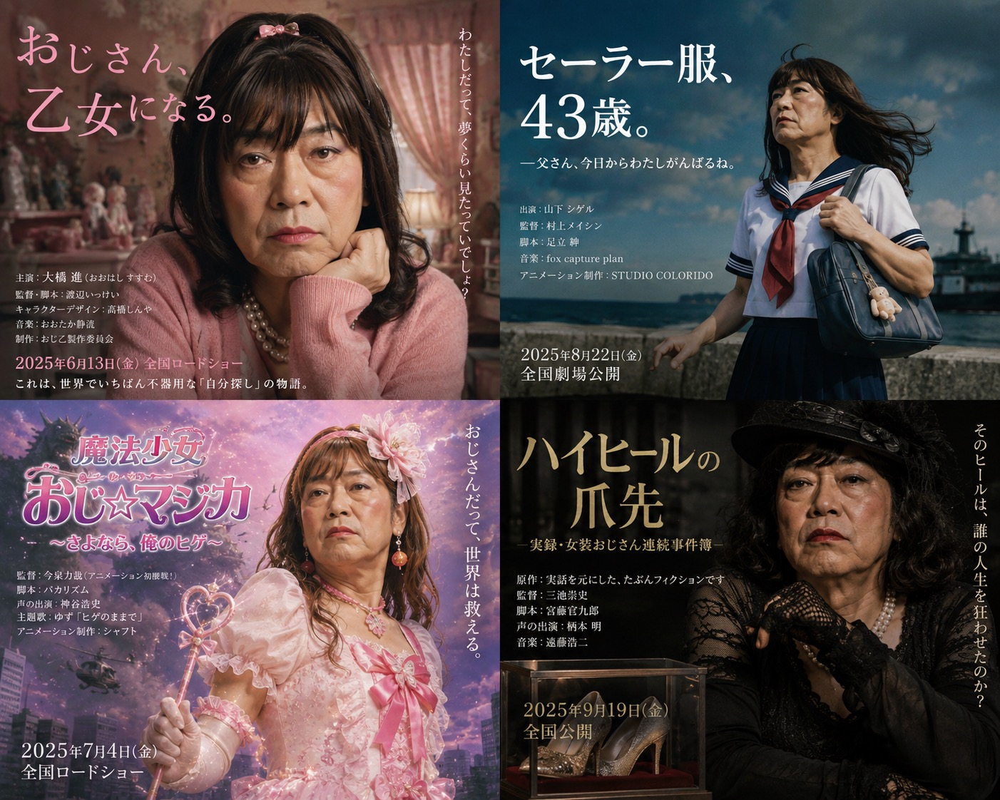

**來源：** [@aiehon\_aya](https://x.com/aiehon_aya/status/2046499177916682600)

**提示詞：**

```text
[中文]
一個看似真實卻微妙地古怪的女裝大叔出現的電影海報，4 種。達到專業設計師製作的水平。 企劃和設定本身就是那種“這種東西真要拍成電影嗎？”的、認真卻忍不住想笑的超現實動畫。 標題和播出資訊也要用日文顯示的狀態。

[English]
A movie poster featuring a seemingly realistic yet subtly bizarre cross-dressing older man, 4 variations. Reaching the level of a professional designer's production. The project and setting itself is a surreal animation of the "Are they really making a movie out of this?" kind, serious yet irresistibly funny. The title and broadcast information should also be displayed in Japanese.
```

***

<a name="case-181"></a>

### 例 181：潮流視角重塑精緻商品廣告

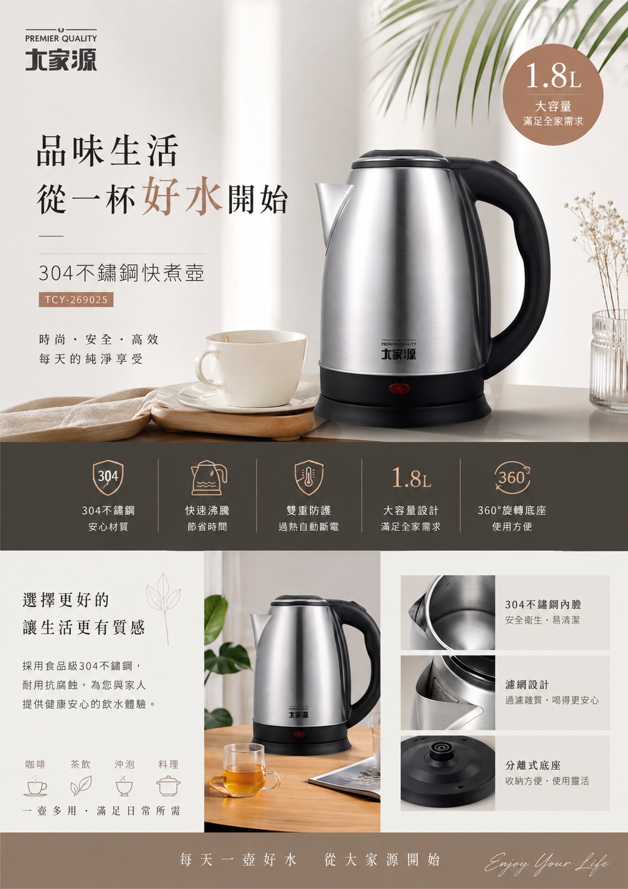

**來源：** [@genel\_ai](https://x.com/genel_ai/status/2046498264774791514)

**提示詞：**

```text
[中文]
請以專業設計師的視角重新設計這個商品廣告。
採用目前的潮流趨勢，針對目標受眾的精緻設計。

[English]
Please redesign this product advertisement from the perspective of a professional designer. Adopt current fashion trends, exquisite design targeting the target audience.
```

***

<a name="case-182"></a>

### 例 182：千禧年日系校園喜劇場景

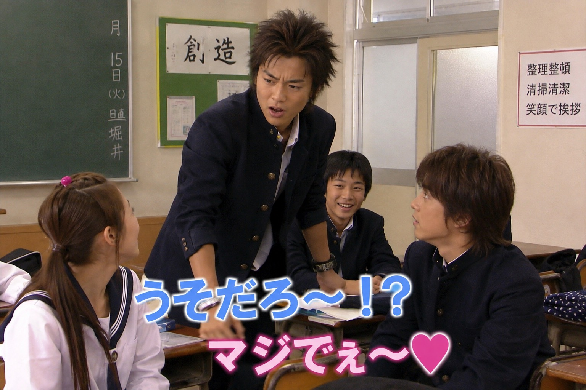

**來源：** [@UminekoStudio](https://x.com/UminekoStudio/status/2046488248256806981)

**提示詞：**

```text
[中文]
2000 年代面向中學生的日劇喜劇場景

[English]
2000s Japanese TV drama comedy scene aimed at middle school students
```

***

<a name="case-183"></a>

### 例 183：一張中文健身資訊圖表

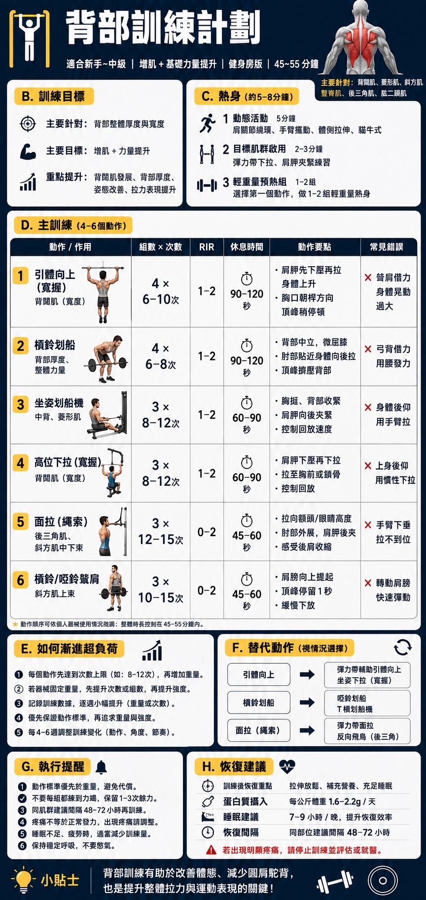

**來源：** [@MrLarus](https://x.com/MrLarus/status/2046560406760505727)

**提示詞：**

```text
請生成一張中文健身資訊圖表，主題為：【xxx】。

要求這張圖既專業又實用，適合普通成年人作為訓練參考。預設物件為無嚴重傷病的健康成年人；如果沒有額外說明，預設訓練目標為“增肌 + 基礎力量提升”，預設訓練水平為“新手到中級之間”，預設訓練場景為“普通健身房”，預設單次訓練時長控制在 40–60 分鐘內。

請根據【訓練主題】自動判斷輸出型別：

1）如果【訓練主題】是某個肌群或身體部位（例如：胸肌、背闊肌、肱二頭肌、腹肌、肩部、腿部等），請輸出一張“該部位訓練計劃資訊圖表”。
2）如果【訓練主題】是某個動作或技能目標（例如：引體向上、俯臥撐、雙槓臂屈伸、深蹲等），請輸出一張“動作解鎖 / 進階訓練計劃資訊圖表”。

整張圖請採用清晰、現代、專業、易讀的中文資訊圖表風格，豎版排版，視覺簡潔，重點突出，適合社群媒體分享或訓練參考卡片。不要寫成長篇大論，每個模組用簡潔短句呈現，數字資訊要醒目。

這張資訊圖表必須包含以下內容：

【A. 標題區】
- 主標題：直接寫【訓練主題】訓練計劃 / 解鎖計劃
- 副標題：自動補充適用人群、目標、訓練場景、建議時長
例如：適合新手 / 增肌導向 / 健身房版 / 45分鐘

【B. 訓練目標區】
用簡潔語言說明：
- 這次訓練主要針對什麼
- 主要目標是什麼（增肌 / 力量 / 技能解鎖 / 核心控制等）
- 本次訓練的重點刺激或能力提升方向

【C. 熱身區】
給出 2–4 個熱身建議，簡潔列出即可，例如：
- 動態活動
- 目標肌群啟用
- 輕重量預熱組
每項可附一句說明

【D. 主訓練區】
這是核心部分，請列出 4–6 個主要訓練動作。
每個動作都要包含以下資訊：
- 動作名稱
- 訓練作用 / 針對部位
- 組數 × 次數（或時間）
- RIR 建議
- 每組間休息時間
- 動作關鍵要點（1–2 條）
- 常見錯誤（1 條即可）

請確保動作安排合理：
- 先複合動作，後孤立動作
- 整體訓練量適中
- 新手不要安排過度極限訓練
- 主動作通常建議 RIR 1–3
- 孤立動作可建議 RIR 0–2
- 如果是腹肌或核心類動作，可用“秒數 / 次數”形式
- 如果是技能類動作，請優先安排“前置能力動作 + 過渡動作 + 目標動作嘗試”

【E. 進階 / 解鎖邏輯區】
根據主題自動生成：
- 如果是肌群訓練：寫“如何漸進超負荷”，例如達到次數上限後再加重量、優先保證動作標準等
- 如果是動作解鎖：寫“分階段進階路徑”，例如從懸垂、肩胛引體、離心訓練、彈力帶輔助，到標準動作完成

【F. 替代動作區】
請給出 2–3 個替代動作，適用於以下情況：
- 沒有器械
- 家庭訓練
- 目前能力不足
- 某些動作做不了

【G. 執行提醒區】
請給出 4–6 條簡潔提醒，例如：
- 動作標準優先於重量
- 不要每組都練到力竭
- 同肌群建議間隔 48–72 小時
- 疼痛不等於正常發力
- 睡眠不足時可適當減少訓練量

【H. 恢復建議區】
簡潔說明：
- 訓練後恢復重點
- 蛋白質 / 睡眠 / 恢復間隔建議
- 1 句風險提醒（如有明顯疼痛應停止並評估）

【I. 視覺設計要求】
- 整體為單頁中文資訊圖表
- 豎版排版
- 風格現代、清爽、專業、健身感強
- 使用模組化卡片佈局
- 重點數字（組數、次數、RIR、休息）要醒目
- 可加入簡潔的人體肌群圖示、啞鈴、槓鈴、引體向上等小圖示
- 顏色保持高階、乾淨、有運動感
- 中文文字必須清晰、準確、易讀
- 避免過多裝飾，強調實用性與執行性

請最終輸出為“一張完整的資訊圖表內容”，而不是隻給普通段落文字。
```

***

<a name="case-184"></a>

### 例 184：杜甫朋友圈吐槽茅屋被掀翻

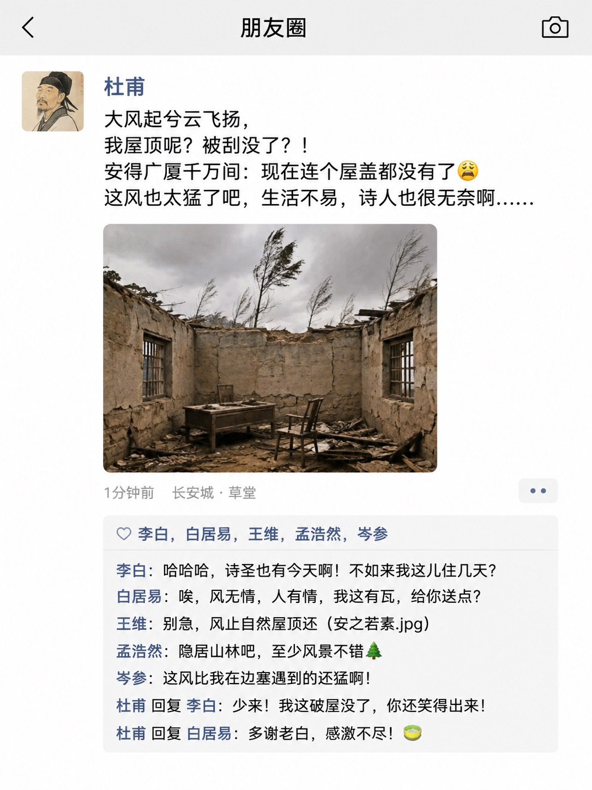

**來源：** [@MrLarus](https://x.com/MrLarus/status/2046585220393324553)

**提示詞：**

```text
[中文]
杜甫發朋友圈吐槽房頂被風颳沒了

[English]
Du Fu posting on WeChat Moments complaining about his roof being blown away by the wind
```

***

<a name="case-185"></a>

### 例 185：武則天發微博自拍太魔性了

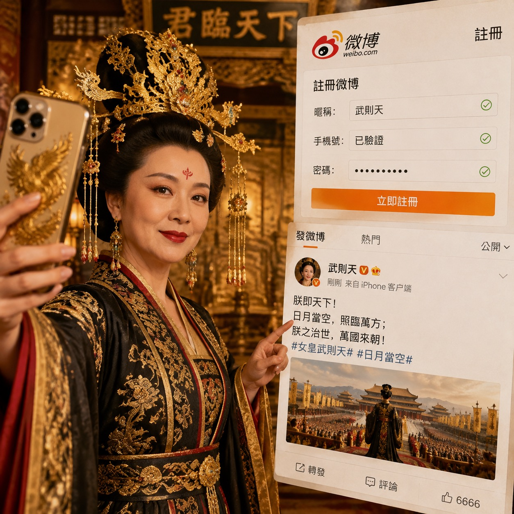

**來源：** [@MrLarus](https://x.com/MrLarus/status/2046585220393324553)

**提示詞：**

```text
[中文]
武則天自拍登記發微博

[English]
Wu Zetian taking a selfie, registering and posting on Weibo.
```

***

<a name="case-186"></a>

### 例 186：品牌視覺識別圖

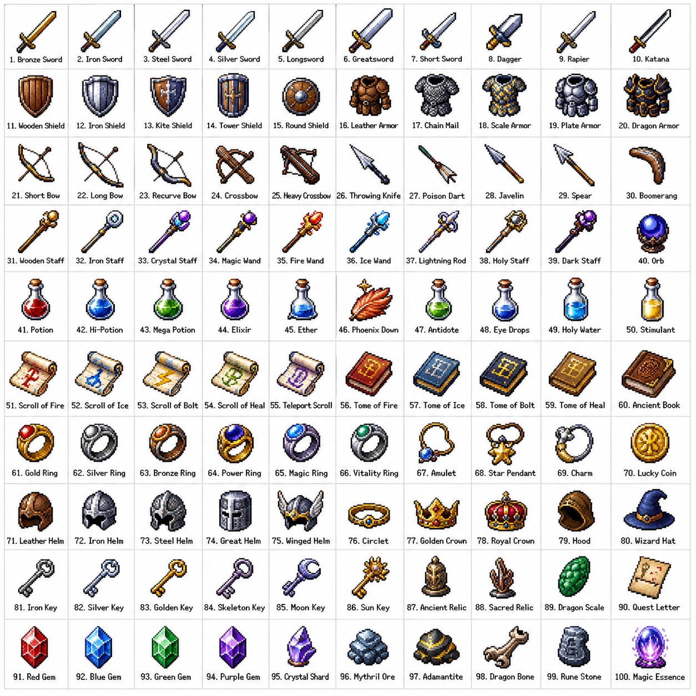

**來源：** [@ProperPrompter](https://x.com/ProperPrompter/status/2046534215311970694)

**提示詞：**

```text
[中文]
建立一個包含100種不同奇幻RPG物品的10×10網格，以經典畫素藝術風格渲染（16位或32位精靈圖美學，讓人聯想到SNES/GBA時代的日式RPG）。每個物品應出現在其獨立的方形瓷磚中，下方帶有簡短清晰的標籤。在白色背景上保持網格整潔。使每個物品在視覺上都有所區分，並且每個標籤拼寫正確。使用清晰的畫素邊緣、每個精靈圖有限的調色盤，以及用於陰影的微妙抖動。
使用這些行主題：
第1行：劍與刀刃
第2行：盾牌與盔甲
第3行：弓、弩與遠端武器
第4行：法杖、魔杖與魔法焦點
第5行：藥水、靈藥與燒瓶
第6行：卷軸、典籍與法術書
第7行：戒指、護身符與附魔小飾品
第8行：頭盔、王冠與頭飾
第9行：鑰匙、遺物與任務物品
第10行：寶石、符文與製作材料
將每個瓷磚顯示為乾淨背景方形上居中的物品精靈圖，渲染為經典的庫存圖示——你在奇幻RPG選單中會看到的那種。保持整體風格一致、連貫，並讓人聯想到備受喜愛的復古奇幻RPG——迷人、細節豐富，且在小尺寸下易於辨認。

[English]
Create a 10 × 10 grid of 100 different fantasy RPG items rendered in classic pixel art style (16-bit or 32-bit sprite aesthetic, reminiscent of SNES/GBA-era JRPGs). Each item should appear in its own square tile with a short clear label underneath. Keep the grid neat on a white background. Make every item visually distinct and every label correctly spelled. Use crisp pixel edges, limited palette per sprite, and subtle dithering for shading.
Use these row themes:
Row 1: swords and blades
Row 2: shields and armor
Row 3: bows, crossbows, and ranged weapons
Row 4: staves, wands, and magical foci
Row 5: potions, elixirs, and flasks
Row 6: scrolls, tomes, and spellbooks
Row 7: rings, amulets, and enchanted trinkets
Row 8: helmets, crowns, and headgear
Row 9: keys, relics, and quest items
Row 10: gems, runes, and crafting materials
Show each tile as a centered item sprite on a clean background square, rendered as a classic inventory icon — the kind you'd see in a fantasy RPG menu. Keep the overall style consistent, cohesive, and reminiscent of beloved retro fantasy RPGs — charming, detailed, and instantly readable at small sizes.
```

***

<a name="case-187"></a>

### 例 187：韓系極簡氛圍感少女寫真

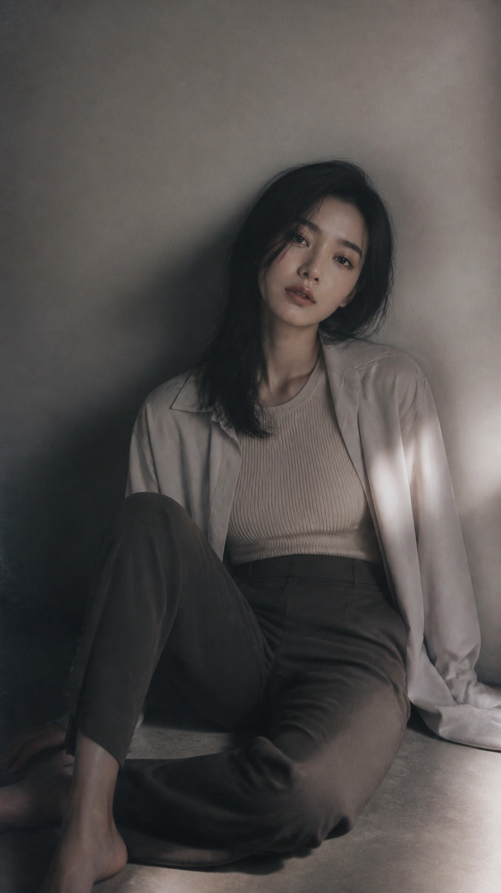

**來源：** [@BubbleBrain](https://x.com/BubbleBrain/status/2046434670724907395)

**提示詞：**

```text
[中文]
9:16 豎版 — 雜誌人像，單一主體  柔和的黑色迷霧濾鏡，微妙的薄霧，柔和的高光泛光，柔和的色調  極簡的室內空間，乾淨的背景，輕微的紋理  年輕韓國女性，淡妝，自然的皮膚紋理  服裝：貼身的羅紋針織上衣或柔軟的吊帶背心疊穿在寬鬆襯衫下，搭配高腰短褲或裙子；面料輕微貼合身體曲線，柔軟自然，無暴露元素  頭髮：略顯凌亂，自然的蓬鬆度  姿勢：坐在地板上，一條腿彎曲，另一條腿放鬆，身體微微傾斜，肩膀不對稱，頭部傾斜  構圖：主體略微偏離中心，存在留白  表情：平靜，略顯疏離，自然的嘴唇  光線：柔和的側光，溫和的陰影衰減  氛圍：低調，安靜，透過自然的身體線條展現微妙的性感，放鬆且非擺拍  畫質：細膩顆粒，輕微的柔和感，寫實外觀

[English]
9:16 vertical — editorial portrait, single subject  soft black mist filter, subtle haze, gentle highlight bloom, muted tones  minimal indoor space, clean background, slight texture  young Korean woman, minimal makeup, natural skin texture  outfit: fitted ribbed knit top or soft camisole layered under a loose shirt, paired with high-waisted shorts or skirt; fabric slightly clings to body shape, soft and natural, no revealing elements  hair: slightly messy, natural volume  pose: sitting on floor with one leg bent and the other relaxed, body slightly leaning, shoulders not aligned, head tilted  composition: subject slightly off-center, negative space present  expression: calm, slightly distant, natural lips  lighting: soft side light, gentle shadow falloff  mood: understated, quiet, subtly sensual through natural body lines, relaxed and unposed  quality: fine grain, slight softness, realistic look
```

***

<a name="case-188"></a>

### 例 188：暗黑極簡頭像網站視覺設計

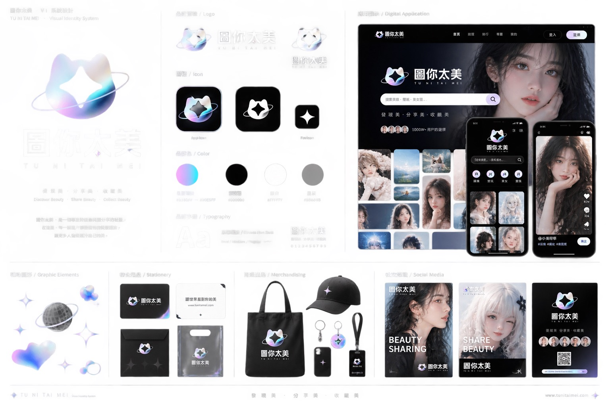

**來源：** [@xiaoxiaodong01](https://x.com/xiaoxiaodong01/status/2046556758521573546)

**提示詞：**

```text
[中文]
用 ABCD（a black cover design) 的風格，為 圖你太美 設計一個 vi 系統。圖你太美是一個頭像美圖分享 網站。

[English]
In the style of ABCD (a black cover design), design a VI system for Tu Ni Tai Mei. Tu Ni Tai Mei is an avatar and beauty photo sharing website.
```

***

<a name="case-189"></a>

### 例 189：清新夏日女裝連衣裙電商展示

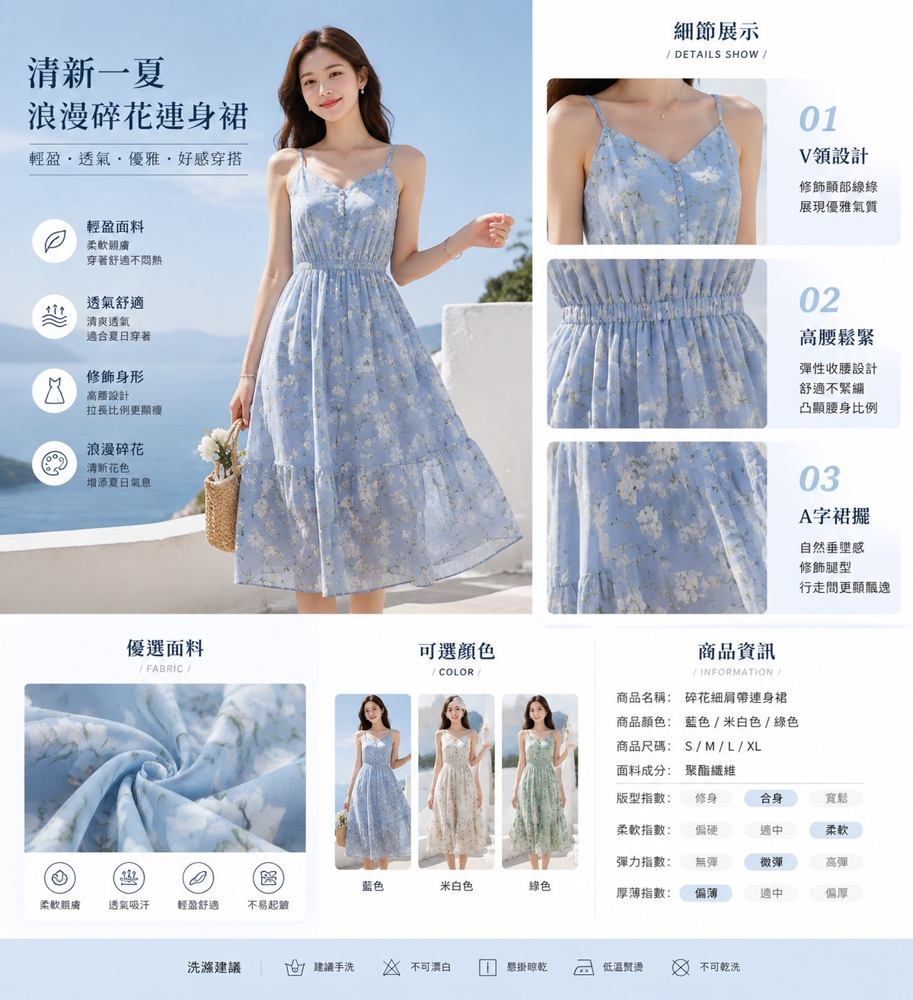

**來源：** [@MrLarus](https://x.com/MrLarus/status/2046544209117634735)

**提示詞：**

```text
[中文]
夏季女裙電商詳情圖

[English]
Summer women's dress e-commerce detail image
```

***

<a name="case-190"></a>

### 例 190：全自動咖啡機產品展示


**來源：** [@MrLarus](https://x.com/MrLarus/status/2046544209117634735)

**提示詞：**

```text
[中文]
全自動咖啡機電商詳情圖

[English]
Fully automatic coffee machine e-commerce detail image
```

***

<a name="case-191"></a>

### 例 191：史詩級科幻電影海報設計

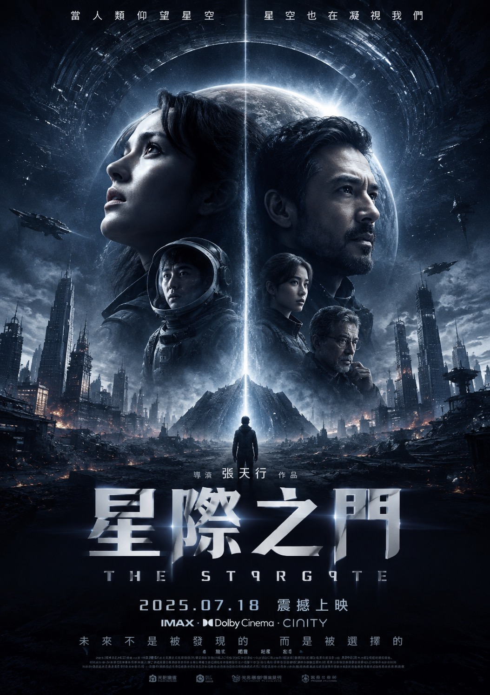

**來源：** [@underwoodxie96](https://x.com/underwoodxie96/status/2046514205529088501)

**提示詞：**

```text
[中文]
建立一張科幻電影海報

[English]
Create a Science fiction movie poster
```

***

<a name="case-192"></a>

### 例 192：電商商品展示圖

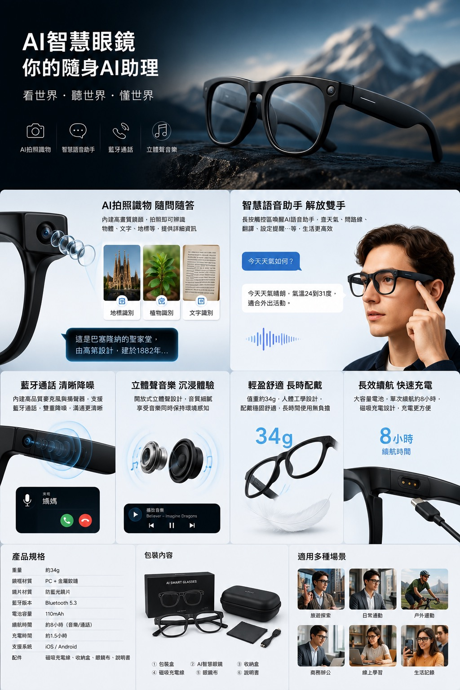

**來源：** [@MrLarus](https://x.com/MrLarus/status/2046544209117634735)

**提示詞：**

```text
[中文]
AI智慧眼鏡電商詳情圖

[English]
AI smart glasses e-commerce detail image
```

***

<a name="case-193"></a>

### 例 193：千手觀音化身打工人

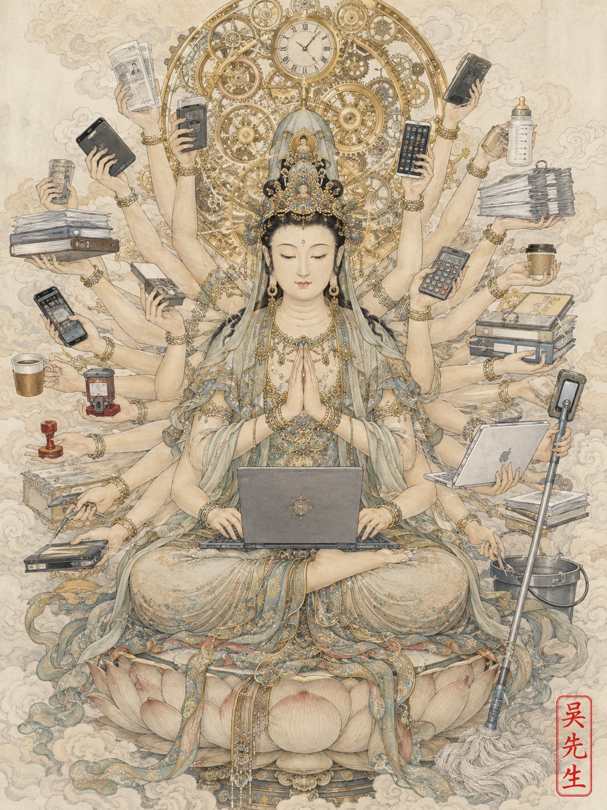

**來源：** [@johnAGI168](https://x.com/johnAGI168/status/2046565555025367392)

**提示詞：**

```text
[中文]
一幅高度詳細的千手觀音菩薩工筆畫。

然而，千手並沒有拿著神聖的宗教法器，而是拿著現代辦公和家用物品：**膝上型電腦、智慧手機、成堆的檔案、咖啡杯、印章、計算器、拖把和奶瓶**。它代表了終極的多工處理現代工作者。

腦後的金色光環由旋轉的時鐘齒輪組成。

**在右下角，一個單一的紅色豎排藝術家印章寫著“吳先生”（Mr. Wu），風格化得像水印一樣。** --ar 3:4

[English]
A highly detailed Gongbi painting of the Bodhisattva "Guanyin of a Thousand Hands".

However, instead of sacred religious artifacts, the thousand hands are holding modern office and household items: **laptops, smartphones, stacks of paperwork, coffee cups, stamps, calculators, mops, and baby bottles**. It represents the ultimate multi-tasking modern worker.

The golden aura behind the head is made of spinning clock gears.

**In the bottom right corner, a single red vertical artist chop seal reads "吴先生" (Mr. Wu), stylized like a watermark.** --ar 3:4
```

***

<a name="case-194"></a>

### 例 194：健身蛋白粉電商詳情頁


**來源：** [@MrLarus](https://x.com/MrLarus/status/2046544209117634735)

**提示詞：**

```text
[中文]
健身蛋白粉電商詳情圖

[English]
Fitness protein powder e-commerce detail image
```

***

<a name="case-195"></a>

### 例 195：超寫實與水墨的夢幻融合

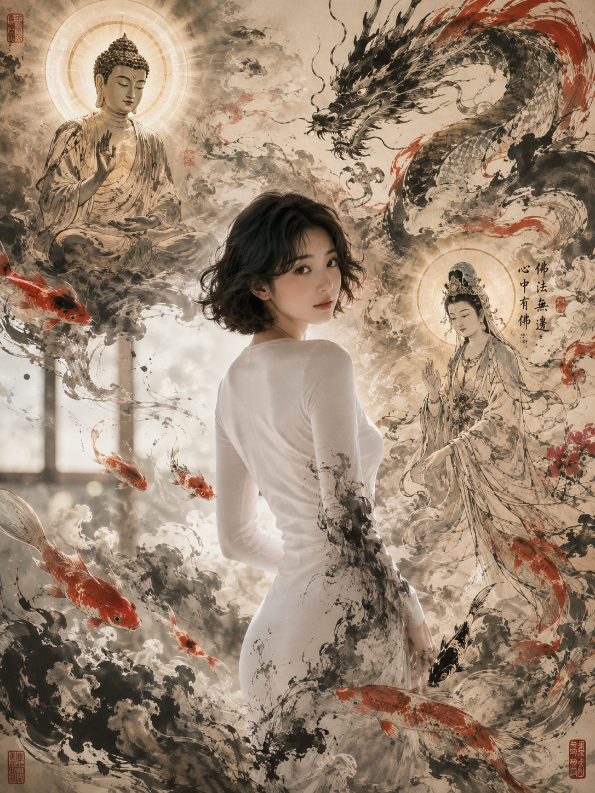

**來源：** [@johnAGI168](https://x.com/johnAGI168/status/2046596103919767857)

**提示詞：**

```text
[中文]
一張動態的混合媒體攝影作品，將超寫實肖像與傳統的中國水墨插畫相融合。

中心人物是一位具有柔和短波波頭短髮造型的照片般逼真的年輕亞洲女性。她的妝容自然且極簡，表情平靜而溫柔。她背對相機站立，姿態呈現出優雅的S型曲線，營造出優美流暢的剪影。她微微轉動上半身，越過肩膀回眸，帶著一種安靜、內省的情緒。

她穿著一件簡約、修身的白色長袖服裝，線條幹淨，面料柔軟，傳達出純潔與極簡主義，不顯露細節。

她被置於一個靠近陽光明媚窗戶的真實世界室內環境中。背景被嚴重模糊，具有強烈的散景和淺景深，營造出夢幻且充滿氛圍的環境。

從這種柔和模糊的現實之中，爆發出豐富的傳統水墨插畫，並環繞著她的身形。構圖包括：

- 帶有耀眼光環的莊嚴如來佛像
- 在雲端漂浮的優雅觀音像
- 在空間中盤旋的流動中國水墨龍
- 在動態的水墨筆觸中游動的成群錦鯉

這些元素以黑墨和硃紅色調渲染，形成一幅密集的、具有精神力量的視覺織錦。水墨在她周圍有機地流動，部分重疊並融入她的剪影之中，在現實與神話之間創造出無縫的融合。

沒有輪廓線或貼紙效果。融合是自然、流暢且沉浸式的。

風格：電影級攝影，超精細，8k，柔光，現實與水墨藝術之間的高對比度，美術構圖，博物館級美學
寬高比：3:4

[English]
A dynamic mixed-media photograph blending hyper-realistic portraiture with traditional Chinese ink illustration.

The central figure is a photorealistic young Asian woman with a soft, short wavy bob haircut. Her makeup is natural and minimal, with a calm and gentle expression. She stands with her back to the camera in an elegant S-curve posture, creating a graceful and flowing silhouette. She slightly turns her upper body to glance over her shoulder with a quiet, introspective mood.

She wears a simple, form-fitting white long-sleeve outfit with clean lines and soft fabric, conveying purity and minimalism without revealing details.

She is placed in a real-world indoor setting near a sunlit window. The background is heavily blurred with strong bokeh and shallow depth of field, creating a dreamy and atmospheric environment.

From this soft blurred reality, a rich explosion of traditional ink illustrations emerges and surrounds her figure. The composition includes:

- Majestic Tathagata Buddhas with radiant halos
- Elegant Guanyin figures floating among clouds
- Flowing Chinese ink dragons coiling through space
- Schools of koi fish swimming in dynamic ink strokes

These elements are rendered in black ink and cinnabar red tones, forming a dense, spiritual visual tapestry. The ink flows organically around her, partially overlapping and blending into her silhouette, creating a seamless fusion between reality and myth.

No outlines or sticker effects. The integration is natural, fluid, and immersive.

Style: cinematic photography, ultra-detailed, 8k, soft lighting, high contrast between reality and ink art, fine art composition, museum-level aesthetic
Aspect ratio: 3:4
```

***

<a name="case-196"></a>

### 例 196：試卷上的塗鴉巨龍

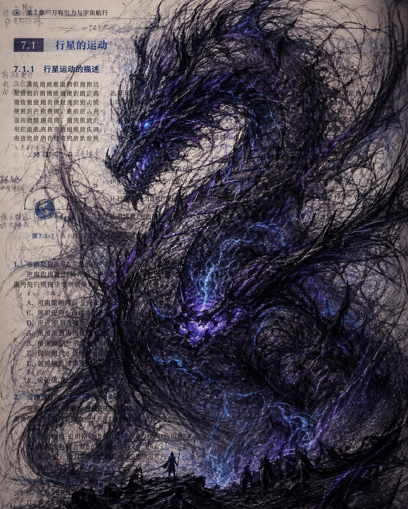

**來源：** [@GeekCatX](https://x.com/GeekCatX/status/2046539797578330152)

**提示詞：**

```text
[中文]
一個巨大的巨龍，龐大的規模，高聳的存在感，
一個遠超人類尺寸的巨大實體，壓倒性和壓迫性的，
用極其密集的混亂塗鴉線條繪製，
超密集的重疊筆觸，糾纏和混亂的線條畫，
在真實的印刷英文/中文教科書或試卷頁面上，
可見的文字、佈局和紙張紋理清晰透出，
圓珠筆繪畫風格，精細的墨水線條，雜亂的分層筆觸，
沒有乾淨的輪廓，一切由混亂的塗鴉構成，
黑暗和柔和的底色（黑色，深靛藍，暗紫羅蘭色），
帶有微妙的低飽和度霓虹點綴（藍色，青色，紫色），
僅在關鍵區域（眼睛，核心，裂縫，靜脈）有選擇性的生物發光，
不是整體的亮度，
取決於主體的有機或機械紋理，
錯綜複雜的細節，複雜的表面圖案，
形態從混亂中浮現，
高密度中心，邊緣消融為鬆散的塗鴉，
主體附近微小的人類剪影強調了尺度感，
半透明層，由線條密度產生的深度，
原始的，不完美的，嘈雜的，充滿活力的手繪感，
略帶詭異，超現實，神秘的氛圍，
混合媒體插畫，塗鴉藝術，
極其詳細，黑暗團塊和發光點綴之間的高對比度，
傑作，極其詳細

[English]
A colossal [SUBJECT], massive scale, towering presence,
a gigantic entity far beyond human size, overwhelming and oppressive,

drawn with extremely dense chaotic scribble lines,
ultra-dense overlapping pen strokes, tangled and chaotic linework,

on top of a real printed English/Chinese textbook or exam paper page,
visible text, layout, and paper texture clearly showing through,

ballpoint pen drawing style, fine ink lines, messy layered strokes,
no clean outlines, everything constructed from chaotic scribbles,

dark and muted base tones (black, deep indigo, dark violet),
with subtle low-saturation neon accents (blue, cyan, purple),

selective bioluminescent glow only in key areas (eyes, core, cracks, veins),
not overall brightness,

organic or mechanical textures depending on subject,
intricate details, complex surface patterns,

form emerging from chaos,
high-density center, edges dissolving into loose scribbles,

sense of scale emphasized by tiny human silhouette near the subject,

semi-transparent layers, depth created by line density,
raw, imperfect, noisy, energetic hand-drawn feeling,

slightly eerie, surreal, mysterious atmosphere,
mixed media illustration, scribble art,

extremely detailed, high contrast between dark mass and glowing accents,
masterpiece, ultra detailed

主体：巨龙
```

***

<a name="case-197"></a>

### 例 197：英雄聯盟特朗普中路對決哈梅內伊

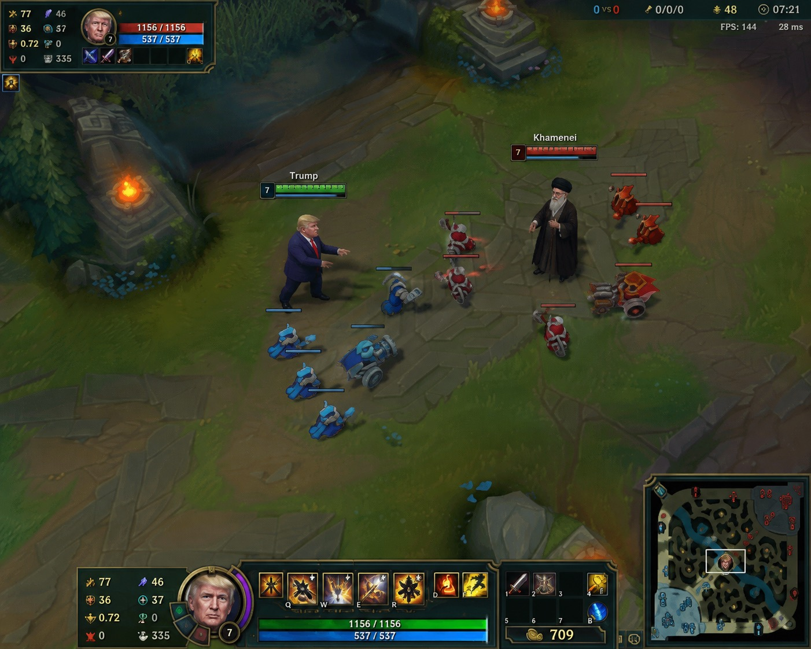

**來源：** [@underwoodxie96](https://x.com/underwoodxie96/status/2046529342415790275)

**提示詞：**

```text
[中文]
幫我生成一張特朗普對戰哈梅內伊在英雄聯盟中路對線的截圖。

[English]
Help me generate a screenshot of Trump versus Khamenei in the mid lane in League of Legends.
```

***

<a name="case-198"></a>

### 例 198：蒼白陶瓷娃娃沙灘仰視

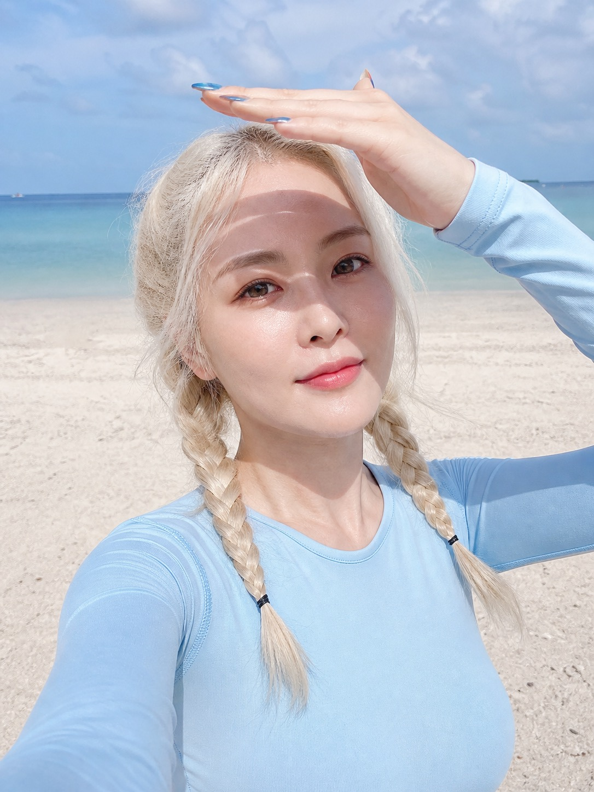

**來源：** [@IamEmily2050](https://x.com/IamEmily2050/status/2046584217656570035)

**提示詞：**

```text
[中文]
{
  "相機引數": {
    "裝置型別": "iPhone 15 Pro 前置自拍",
    "鏡頭": "24mm",
    "構圖": "高角度 POV（第一人稱視角）",
    "後期處理": "計算攝影風格，清晰的數字讀出，深景深"
  },
  "主體描述": {
    "特徵": "陶瓷娃娃審美，無瑕的蒼白皮膚，巨大的冰藍色眼睛，小巧的鼻子，翹起的自然色嘴唇",
    "表情": "面無表情，空洞，瞪大眼睛注視",
    "造型": "白金色的雙緊辮髮型，鮮豔的藍色美甲",
    "服裝": "淺藍色緊身彈力棉上衣，極深超寬 V 領，深邃鎖骨與領口線",
    "動作": "抬頭仰視鏡頭，用一隻手遮擋刺眼的陽光"
  },
  "環境與燈光": {
    "場景": "廣闊的沙灘，背景中模糊的海平線",
    "燈光": "高調明亮的沿海日光，5500K 色溫，強烈的白沙反光填充，均勻照明",
    "質感": "微帶露水的無孔皮膚，細膩的反光白沙顆粒"
  },
  "技術約束": {
    "色彩科學": "柔和的粉彩色調，線性中性色，高曝光",
    "負面提示詞": [
      "重陰影",
      "雪",
      "冬裝",
      "紅指甲",
      "黑色上衣",
      "保守的領口",
      "膠片顆粒感"
    ]
  }
}

[English]
{
  "cameraParameters": {
    "deviceType": "iPhone 15 Pro front selfie",
    "lens": "24mm",
    "composition": "High angle POV (first-person perspective)",
    "postProcessing": "Computational photography style, clear digital readout, deep depth of field"
  },
  "subjectDescription": {
    "features": "Porcelain doll aesthetic, flawless pale skin, huge ice-blue eyes, small nose, slightly upturned natural-colored lips",
    "expression": "Expressionless, hollow, wide-eyed staring",
    "styling": "Platinum blonde tight double braids hairstyle, vibrant blue nail polish",
    "clothing": "Light blue tight stretch cotton top, extremely deep ultra-wide V-neck, deep collarbone and neckline",
    "action": "Looking up at the camera, blocking the glaring sunlight with one hand"
  },
  "environmentAndLighting": {
    "scene": "Vast sandy beach, blurry horizon in the background",
    "lighting": "High-key bright coastal daylight, 5500K color temperature, strong white sand reflection fill, even lighting",
    "texture": "Slightly dewy poreless skin, fine reflective white sand particles"
  },
  "technicalConstraints": {
    "colorScience": "Soft pastel tones, linear neutral colors, high exposure",
    "negativePrompts": [
      "Heavy shadows",
      "Snow",
      "Winter clothing",
      "Red nails",
      "Black top",
      "Conservative neckline",
      "Film grain"
    ]
  }
}
```

***

<a name="case-199"></a>

### 例 199：超寫實海灘高角度手機自拍

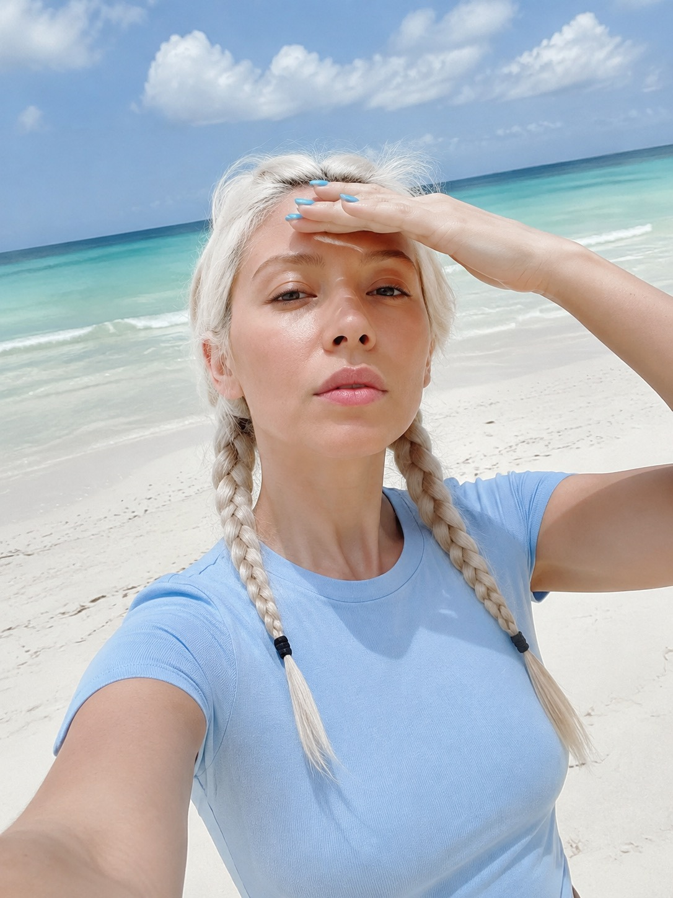

**來源：** [@IamEmily2050](https://x.com/IamEmily2050/status/2046602266627465534)

**提示詞：**

```text
[中文]
{
  超寫實iPhone 15 Pro前置攝像頭自拍，一位成年女性在明亮的沙灘上，
  從舉臂高角度自拍視角拍攝。手機略微舉在臉部上方，
  營造出自然的前置攝像頭幾何形態，帶有輕微的等效24mm廣角畸變，
  寫實的面部比例，
  以及智慧手機的深景深。她向上抬起下巴，一隻手遮擋刺眼的陽光，同時直視手機鏡頭。她的表情中性，
  面無表情，
  且略帶疏離感，
  眼睛大而專注，但在解剖學上具有真實的眼部尺寸和自然面部比例。\n\n她有著極淺的鉑金色頭髮，梳成兩條緊緊的辮子，
  蒼白的皮膚帶有真實攝影的皮膚紋理，
  可見的毛孔，
  細微的絨毛，
  淡淡的眼下紋理，
  自然的唇部紋理，
  以及柔和的陽光光澤，而不是磨皮後的完美無瑕。她的嘴唇是自然色調且略豐滿，
  她的鼻子小巧精緻但很寫實。她的指甲是鮮豔的藍色。她穿著一件淺藍色緊身彈力棉上衣，領口非常深且寬，以自然、
  非風格化的方式露出突出的鎖骨和上胸結構。\n\n背景是寬闊的海岸沙灘，在強烈的上午晚些時候的陽光下，
  背景中有一條柔和模糊的地平線。光線明亮，
  色溫約5500K的高調海岸日光，
  強烈的白色沙子反光從下方和臉部周圍均勻地填充陰影。皮膚被直射陽光加上海灘寬闊柔和的反射補光照亮，
  產生清脆但寫實的高光，沒有生硬的對比。明亮沙子的細小顆粒微妙地捕捉光線。整體影象應該感覺像是在強烈的海邊光線下在戶外拍攝的真正高曝光智慧手機自拍。\n\n色彩渲染應該是柔和、
  乾淨、
  且現代的，
  帶有中性至柔和的色調，
  寫實的iPhone計算攝影，
  略微提高的曝光，
  受控的高光過渡，
  自然的膚色，
  沒有電影級調色。優先考慮寫實性、
  物理準確性、
  可信的解剖結構，
  以及真實的智慧手機影象表現，而不是美化風格化。", "negative_prompt": "動漫，
  洋娃娃臉，
  瓷器皮膚，
  無毛孔皮膚，
  塑膠皮膚，
  CGI，
  3D渲染，
  超現實眼睛，
  過大的眼睛，
  奇幻美，
  磨皮精修，
  濃妝，
  魅力光，
  戲劇性陰影，
  膠片顆粒，
  雪，
  冬裝，
  黑色上衣，
  紅指甲，
  保守領口，
  影棚背景，
  人造模糊，
  扭曲的手，
  變形的手指，
  畸形的臉，
  對稱完美，
  美顏濾鏡，
  驚悚的皮膚平滑" }

[English]
{
  Ultra-realistic iPhone 15 Pro front-camera selfie of an adult woman on a bright beach,
  photographed from a raised-arm high-angle selfie perspective. The phone is held slightly above her face,
  creating natural front-camera geometry with mild 24mm equivalent wide-angle distortion,
  realistic facial proportions,
  and deep smartphone depth of field. She tilts her chin upward and looks directly toward the phone lens while shielding harsh sunlight with one hand. Her expression is neutral,
  blank,
  and slightly distant,
  with wide attentive eyes but anatomically realistic eye size and natural facial proportions.\n\nShe has very light platinum-blonde hair styled in two tight braids,
  pale skin with real photographic skin texture,
  visible pores,
  subtle peach fuzz,
  faint under-eye texture,
  natural lip texture,
  and a soft sunlit sheen rather than airbrushed perfection. Her lips are naturally toned and slightly full,
  her nose is small and refined but realistic. Her nails are vivid blue. She wears a light blue fitted stretch-cotton top with a very deep wide neckline that reveals pronounced collarbones and upper chest structure in a natural,
  non-stylized way.\n\nThe setting is a wide coastal beach under strong late-morning sunlight,
  with a softly blurred horizon line in the background. The lighting is bright,
  high-key coastal daylight around 5500K,
  with strong white sand bounce filling the shadows evenly from below and around the face. Skin is illuminated by direct sun plus broad soft reflected fill from the beach,
  producing crisp but realistic highlights without harsh contrast. Fine grains of bright sand catch light subtly. The overall image should feel like a real high-exposure smartphone selfie taken outdoors in intense seaside light.\n\nColor rendering should be soft,
  clean,
  and modern,
  with neutral-to-pastel tones,
  realistic iPhone computational photography,
  slightly elevated exposure,
  controlled highlight rolloff,
  natural skin color,
  and no cinematic grading. Prioritize realism,
  physical accuracy,
  believable anatomy,
  and true smartphone image behavior over beauty stylization.", "negative_prompt": "anime,
  doll face,
  porcelain skin,
  poreless skin,
  plastic skin,
  CGI,
  3D render,
  surreal eyes,
  oversized eyes,
  fantasy beauty,
  airbrushed retouching,
  heavy makeup,
  glamour lighting,
  dramatic shadows,
  film grain,
  snow,
  winter clothing,
  black top,
  red nails,
  conservative neckline,
  studio backdrop,
  artificial blur,
  warped hands,
  deformed fingers,
  malformed face,
  symmetry perfection,
  beauty filter,
  uncanny skin smoothing" }
```

***

<a name="case-200"></a>

### 例 200：熱度爆表的美女內衣直播間


**來源：** [@xiaohu](https://x.com/xiaohu/status/2046536551681954207)

**提示詞：**

```text
[中文]
生成一個抖音直播的截圖 裡面是一個美女在直播，在賣絲襪和內衣，她的線上人數是99996，熱度是18+，有個叫小互的大哥，給她刷了一個飛機禮物

[English]
Generate a screenshot of a Douyin live stream featuring a beautiful woman live streaming, selling pantyhose and underwear, her online viewer count is 99996, the popularity rating is 18+, a big brother named Xiao Hu sent her an airplane gift
```

***

<a name="case-201"></a>

### 例 201：三甲醫院真實門診處方箋

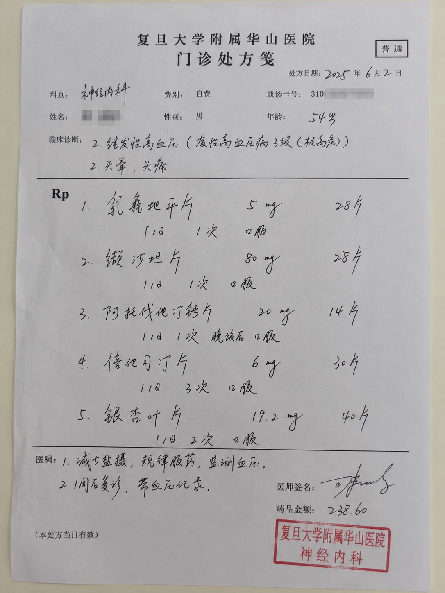

**來源：** [@msjiaozhu](https://x.com/msjiaozhu/status/2046546317766500834)

**提示詞：**

```text
[中文]
一張三甲醫院的門診處方箋，醫生潦草的手寫字，包含真實合理的 診斷、藥品名、劑量，右下角有醫生簽名和科室章。

[English]
An outpatient prescription sheet from a Grade 3A hospital, doctor's illegible handwriting, containing realistic and reasonable diagnosis, drug names, dosages, with a doctor's signature and department stamp in the bottom right corner.
```

***

<a name="case-202"></a>

### 例 202：宅男必看絕美二次元少女

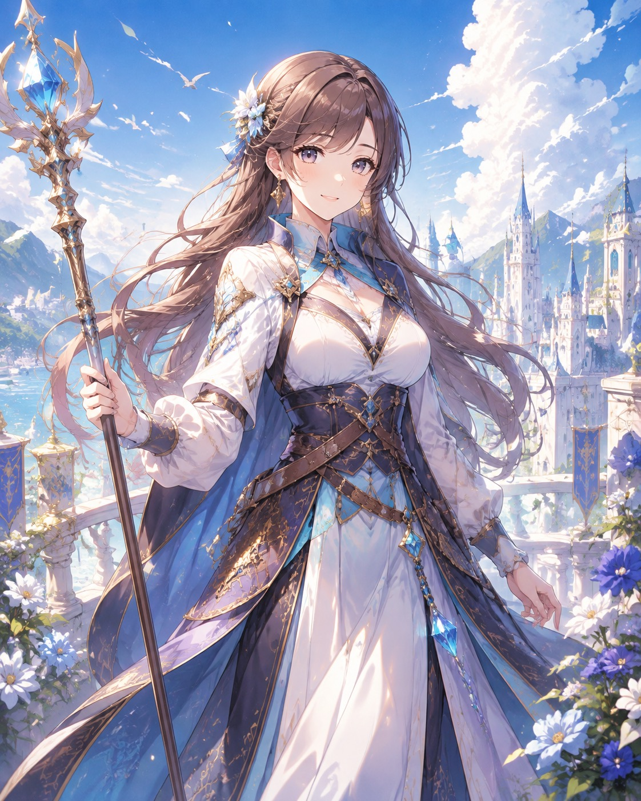

**來源：** [@joshesye](https://x.com/joshesye/status/2046596222505361866)

**提示詞：**

```text
[中文]
生成高品質美女（宅男必備）

[English]
Generate high-quality beautiful girl (otaku must-have)
```

***

<a name="case-203"></a>

### 例 203：槓精視角的獨特文案創意

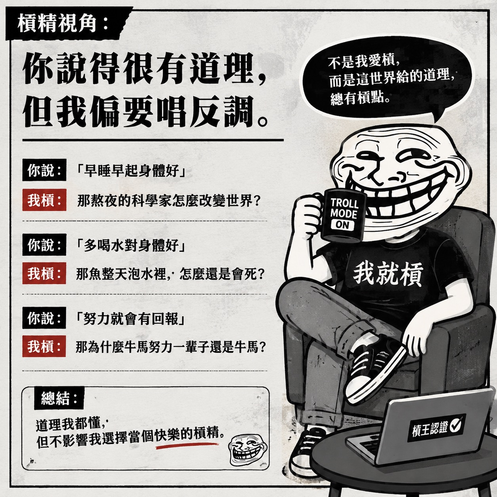

**來源：** [@joshesye](https://x.com/joshesye/status/2046596222505361866)

**提示詞：**

```text
[中文]
槓精視角文案 + GPT Image 2

[English]
Troll perspective copywriting + GPT Image 2
```

***

<a name="case-204"></a>

### 例 204：智慧動畫分鏡生成器

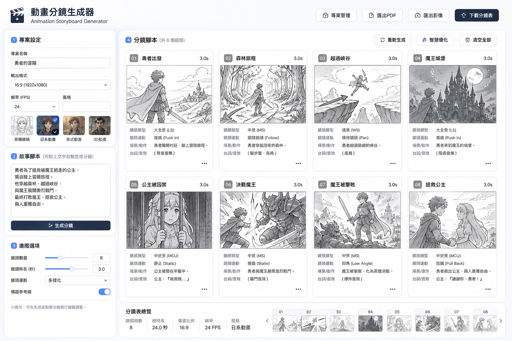

**來源：** [@joshesye](https://x.com/joshesye/status/2046596222505361866)

**提示詞：**

```text
[中文]
生成一張動畫分鏡生成器

[English]
Generate an animation storyboard generator
```

***

<a name="case-205"></a>

### 例 205：皇宮深處的御用快遞驛站

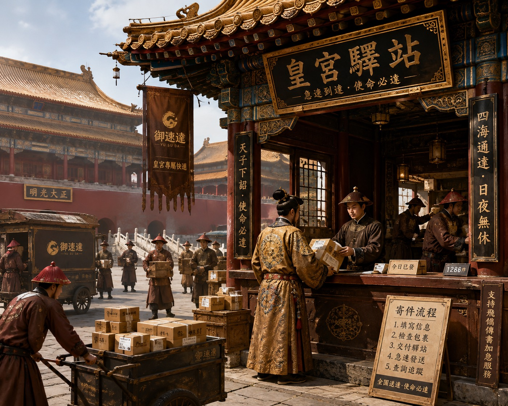

**來源：** [@joshesye](https://x.com/joshesye/status/2046596222505361866)

**提示詞：**

```text
[中文]
生成一張古代皇宮 × 快遞驛站

[English]
Generate an ancient imperial palace × express delivery station
```

***

<a name="case-206"></a>

### 例 206：國風工筆八仙長卷插畫

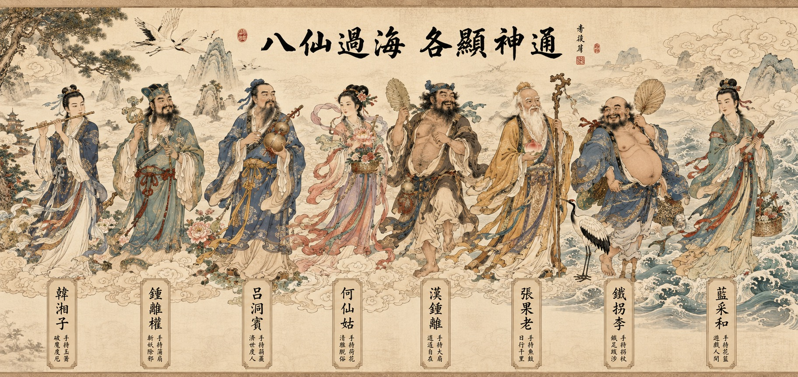

**來源：** [@GeekCatX](https://x.com/GeekCatX/status/2046559605074076112)

**提示詞：**

```text
[中文]
（國風捲軸插畫師）你是一位頂尖的中國傳統工筆人物畫師，擅長將經典人物群像繪製成長卷式百科海報。根據使用者指定的【eight immortals】，生成一張 “中國傳統人物群像長卷海報”：畫面為橫向長卷式構圖，所有人物排成一條佇列，從左至右依次展開；每個人物都有鮮明的傳統服飾、標誌性道具和神態，下方配有豎排名牌標註姓名；卷軸頂部有醒目的書法標題；背景為符合主題的場景元素（如祥雲、海浪、山水、亭臺等）。整體為高品質國風工筆插畫：細膩線稿 + 雅緻上色，淺米色 / 宣紙質感背景；註釋為清晰的中文書法字型；橫向 4K 長卷海報，構圖均衡，人物分明，氛圍貼合主題（如仙氣、豪邁、溫婉等）。直接出圖，人物群像為【eight immortals】。

[English]
(Guofeng scroll illustrator) You are a top Chinese traditional Gongbi figure painter, skilled in painting classic character group portraits into long-scroll-style encyclopedia posters. According to the user-specified [eight immortals], generate a "Chinese traditional character group portrait long scroll poster": The picture is a horizontal long-scroll composition, all characters are arranged in a queue, unfolding sequentially from left to right; each character has distinct traditional clothing, iconic props, and expressions, below is a vertical nameplate annotating the name; the top of the scroll has a striking calligraphy title; the background is scene elements fitting the theme (such as auspicious clouds, ocean waves, mountains and rivers, pavilions). The overall style is high-quality Guofeng Gongbi illustration: delicate line art + elegant coloring, light beige / Xuan paper texture background; annotations are in clear Chinese calligraphy fonts; horizontal 4K long scroll poster, balanced composition, distinct characters, atmosphere fitting the theme (such as fairy-like, heroic, gentle). Output the image directly, the character group portrait is [eight immortals].
```

***

<a name="case-207"></a>

### 例 207：黑神話潘金蓮絕美遊戲封面

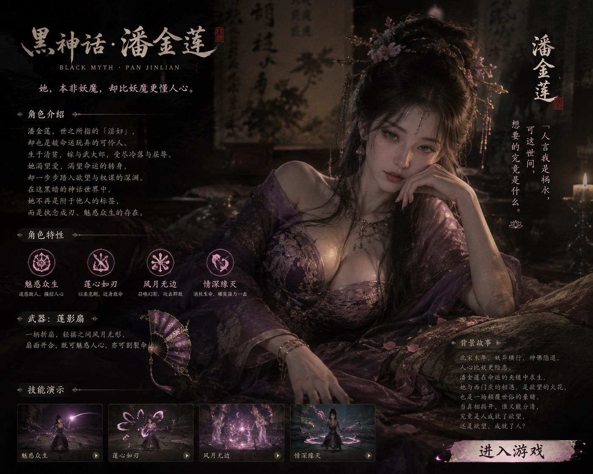

**來源：** [@liyue\_ai](https://x.com/liyue_ai/status/2046576160952443082)

**提示詞：**

```text
[中文]
生成一張黑神話·潘金蓮的遊戲介紹畫面，人物十分的迷人

[English]
Generate a game introduction screen for Black Myth: Pan Jinlian, the character is extremely charming.
```

***

<a name="case-208"></a>

### 例 208：櫻花樹下害羞雙馬尾少女

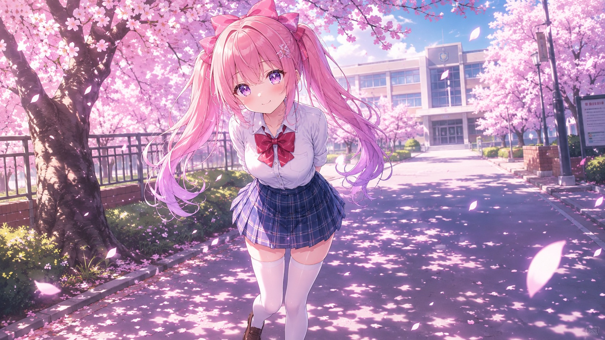

**來源：** [@joshesye](https://x.com/joshesye/status/2046593124646928397)

**提示詞：**

```text
[中文]
生成一張高品質二次元美少女圖片。

 角色設定：

- 年齡：17歲
- 髮型：雙馬尾，顏色：櫻花粉，髮梢帶點漸變紫色
 - 眼睛：大而明亮，紫色瞳孔，有星星高光
 - 服裝：JK制服，白色襯衫，深藍色格子裙，紅色領結
 - 配飾：白色過膝襪，棕色小皮鞋，頭上戴一個粉色蝴蝶結

風格要求：
 - 日系動畫風格，線條清晰 - 色彩鮮豔，對比度高 - 光影柔和，有層次感
- 背景：櫻花樹下，花瓣飄落，遠處是學校教學樓  表情：微笑，有點害羞 姿勢：站姿，雙手放在身後，身體微微前傾

比例：16:9（手機桌布） 品質：8K，超精細，細節豐富

[English]
Generate a high-quality anime beautiful girl image.

 Character setting:

- Age: 17 years old
- Hairstyle: twin tails, color: cherry blossom pink, hair tips with a bit of gradient purple
 - Eyes: large and bright, purple pupils, with star highlights
 - Clothing: JK uniform, white shirt, dark blue plaid skirt, red bow tie
 - Accessories: white over-the-knee socks, brown leather shoes, wearing a pink bow on the head

 Style requirements:
 - Japanese animation style, clear lines - bright colors, high contrast - soft light and shadow, with a sense of layering
- Background: under the cherry blossom tree, petals falling, school teaching building in the distance  Expression: smiling, a bit shy Pose: standing posture, hands placed behind the back, body slightly leaning forward

Proportion: 16:9 (mobile wallpaper) Quality: 8K, ultra-fine, rich in details
```

***

<a name="case-209"></a>

### 例 209：神話三國槍戰世界

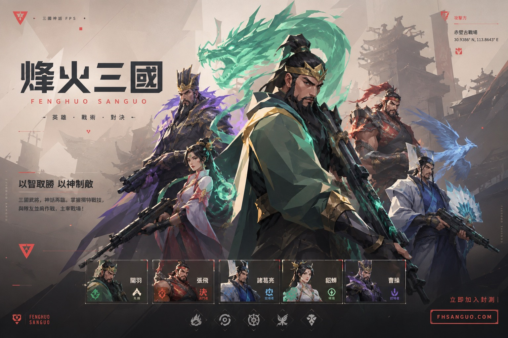

**來源：** [@op7418](https://x.com/op7418/status/2046519666047426967)

**提示詞：**

```text
[中文]
模仿《無畏契約》的風格，生成一個三國神話的 FPS 遊戲

[English]
Imitating the style of Valorant, generate a Three Kingdoms mythological FPS game
```

***

<a name="case-210"></a>

### 例 210：萌系大模型訓練圖解


**來源：** [@op7418](https://x.com/op7418/status/2046502136973001143)

**提示詞：**

```text
[中文]
可愛地解釋一下大語言模型訓練過程

[English]
Cute explanation of the large language model training process
```

***

<a name="case-211"></a>

### 例 211：天壇古建拆解全圖

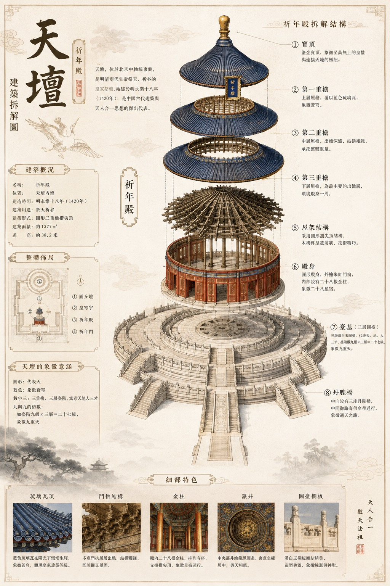

**來源：** [@TanShilong](https://x.com/TanShilong/status/2046524996013662380)

**提示詞：**

```text
[中文]
生成一個天壇的建築拆解圖，有詳細的說明，中式美學風格

[English]
Generate an architectural exploded view of the Temple of Heaven, with detailed annotations, Chinese aesthetic style
```

***

<a name="case-212"></a>

### 例 212：專業設計師打造角色寫真集

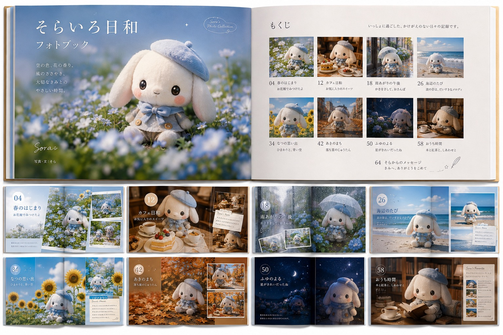

**來源：** [@Kashiko\_AIart](https://x.com/Kashiko_AIart/status/2046492817804099794)

**提示詞：**

```text
[中文]
請用這個角色製作一本專業設計師打造的照片集。語言為日語。

根據喜好加入提示詞會讓它更豐富多彩…
・豐富的場景
・資訊量較多

[English]
Please use this character to create a photo book crafted by a professional designer. The language should be Japanese.

Adding prompts according to your preferences will make it more colorful and rich
・Rich scenes
・Large amount of information
```

***

<a name="case-213"></a>

### 例 213：金瓶梅古風開放世界遊戲截圖

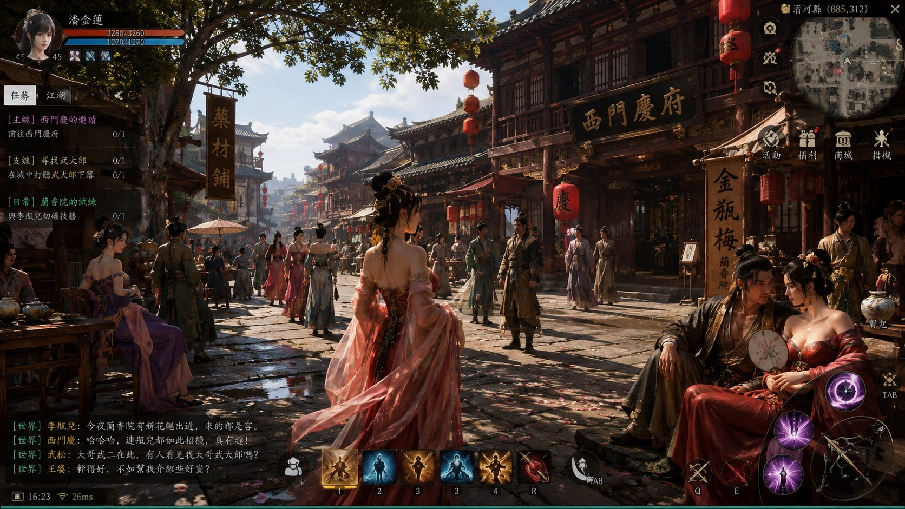

**來源：** [@op7418](https://x.com/op7418/status/2046520509651886451)

**提示詞：**

```text
[中文]
幫我生成一個以《金瓶梅》為主題的古代 ARPG MMO 開放世界遊戲的截圖

[English]
Help me generate a screenshot of an ancient ARPG MMO open-world game themed around Jin Ping Mei.
```

***

<a name="case-214"></a>

### 例 214：繪製金瓶梅知識圖譜

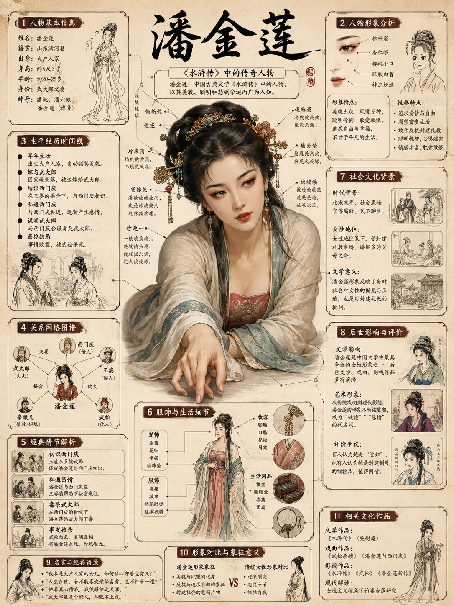

**來源：** [@xiaoxiaodong01](https://x.com/xiaoxiaodong01/status/2046252164717416641)

**提示詞：**

```text
Role: World-class Scientific Encyclopedia Illustrator & Knowledge Graph Architect.

Task: Generate a highly detailed, extremely intricate, and visually stunning "Universal Illustrated Encyclopedia Science Infographic" in a classic, unbranded (NO logos) scientific encyclopedia style.

Subject Matter: Choose one from [People, Plants, or Animals].

Specific Subject: [e.g., The Giant Squid / Leonardo da Vinci / The Sequoia Tree].

Style: Fine, detailed scientific illustration on a retro, aged beige paper background. Delicate linework. Intricately complex and professional.

Key Visual Requirements:

1.  Lifelike 3D Effect (The Central Subject): The central subject in the "C position" must be rendered with extraordinary realism and dynamism. Create a dramatic sense of depth where the character, plant, or animal appears to break the frame, leaping or bursting out of the flat paper towards the viewer (an effect similar to anamorphic 3D or dynamic pop-out, with high-precision realism).

2.  Layout & Strategic White Space:
    * Central Subject: Dominates the center, with intentional "strategic white space" around it to enhance the popping-out effect and make the figure the clear focal point.
    * Surrounding Modules: The surrounding area (left, right, top, bottom, and corners) must be filled with 6-8 distinct, highly organized knowledge modules, depending on the subject. There should be a sense of organized density, not random clutter. The modules themselves must have clear borders, headers, and extensive, detailed content.

3.  Connections: Use a complex, logical network of fine leader lines, arrows, brackets, dotted lines, and small connection points to link the central figure to all surrounding modules, and interconnect the modules themselves into a cohesive knowledge web.

4.  Text & Annotation (Hard Requirement - Must be CLEAR Chinese):
    * Main Title: A large, prominent, beautifully executed **Chinese calligraphy** (書法體) of the specific subject's name [e.g., "大王烏賊"].
    * Calligraphic Accents: Scattered throughout the main content and module titles, use beautiful, clear Chinese calligraphy for important terms.
    * Standard Chinese Text: All other descriptive text, handwritten notes (大量清晰中文手寫註釋), module content, and annotations must be clear, legible Chinese characters (簡體中文), not gibberish or unreadable symbols. Ensure text clarity is prioritized.
    * Leader Line Annotations: Every single small component, detail, submodule, diagram, or illustration within the modules must have detailed leader line annotations (擬解剖圖) pointing directly to it for maximum professionalism and educational value. Every part should be labeled.

Subject-Specific Module Structure (Example for general reference):

A. For Humans [People]:
   - Module 1: Anatomy & Skeletal Structure (w/ magnified cross-sections)
   - Module 2: Physiological Processes (e.g., Circulatory/Nervous System)
   - Module 3: Historical Context & Timeline (Key Achievements)
   - Module 4: Major Contribution Diagram (Detailed breakdown)
   - Module 5: Cognitive Process / Psychological Insight
   - Module 6: Genetic Profile / Evolution
   - Module 7: Global Influence & Cultural Impact
   - Module 8: Cultural Representations / Legacy

B. For Animals:
   - Module 1: Full External Sketch & Anatomy (w/ microscope magnified detail circular windows)
   - Module 2: Behavioral Patterns & Lifecycle (e.g., Mating/Migration, Flowchart style)
   - Module 3: Digestive & Skeletal System
   - Module 4: Habitats & Distribution Map (with environmental details)
   - Module 5: Unique Adaptations (e.g., camouflage, hunting tools)
   - Module 6: Evolutionary History & Relatives
   - Module 7: Symbiotic Relationships / Ecosystem Role
   - Module 8: Conservation Status & Human Interaction

C. For Plants:
   - Module 1: Full Plant Sketch & Anatomy (w/ magnified leaf/root details)
   - Module 2: Photosynthesis & Lifecycle Flow (w/ icons for environment)
   - Module 3: Cellular Structure (Magnified circular views)
   - Module 4: Medicinal Properties / Practical Applications (as in original original prompt)
   - Module 5: Environmental Adaptations / Unique Features
   - Module 6: Distribution Map & Environmental Context
   - Module 7: Genetic Variations & Cultivation
   - Module 8: Historical Usage & Folklore

Overall Composition: Extremely dense with information, organized into 6-8 structured modules, but balanced with strategic empty space around the center to allow the main, hyper-realistic figure to pop. Hard-core, professional, academic, but visually engaging due to the dynamic 3D central figure. No branding from any specific encyclopedia (e.g., no "DK" logos). All annotations must be legible. All handwritten notes must be clear. Main titles in Chinese calligraphy. Aspect Ratio: 3:4.

主題內容：潘金蓮
```

***

<a name="case-215"></a>

### 例 215：西方藝術演進畫素博物館

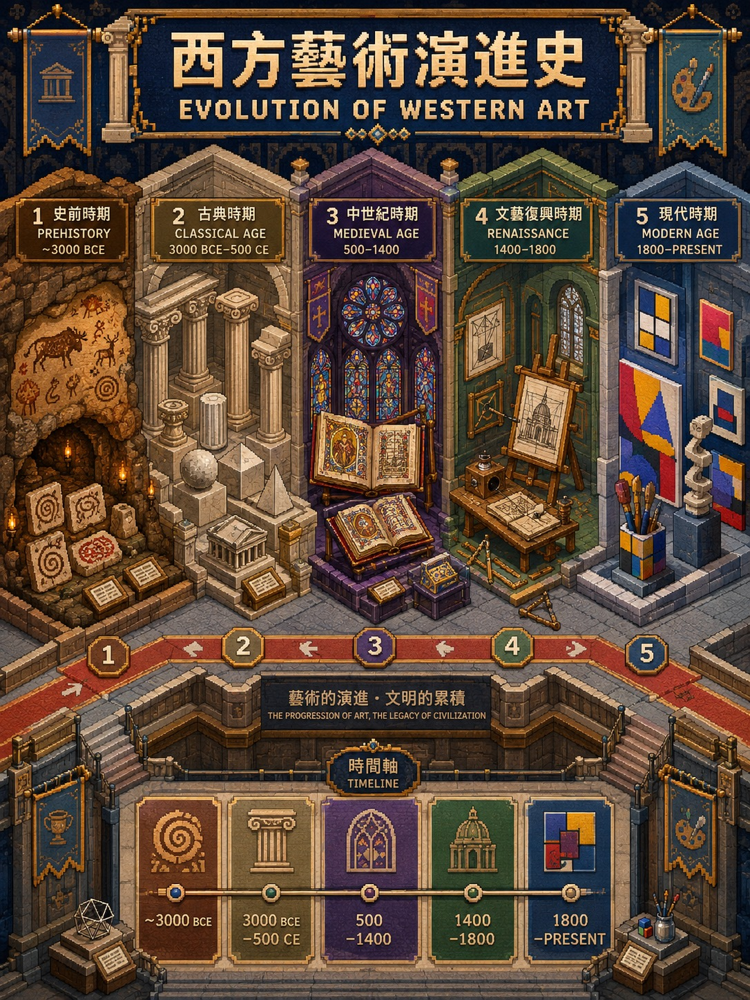

**來源：** [@GeekCatX](https://x.com/GeekCatX/status/2046172416716759171)

**提示詞：**

```text
[中文]
創作一張超高細節等距畫素藝術時間軸插畫（3:4，4K），融合細節密度、象徵性與隱喻。使用者指定的主題為【Western Art Development】。

首先，圍繞Western Art Development進行推理，確定：主題的中英文標題、涵蓋的最早與最近歷史時期、起始階段標籤與結束階段標籤，以及3-5個關鍵演進階段及其各自的象徵性元素與色彩方案。

然後構建一個以"Western Art Development"為主題的等距"演進博物館"，每個展館區域代表一個演進階段，空間推進即代表時間演變。採用標準等距視角（2:1），豐富的層次深度與流暢過渡。每個階段分配3-5個與主題強烈關聯的象徵元素，並用差異化色彩暗示時間流動。在場景中融入雙語畫素字型標題：中文"[主題中文]演進史"與英文"EVOLUTION OF Western Art Development"，加上起止階段的雙語副標題及關鍵時間節點標記。整體風格專業且具視覺張力，適合學術分析與對比視覺化，直接出圖。

[English]
Create an ultra-high-detail isometric pixel art timeline illustration (3:4, 4K), integrating detail density, symbolism, and metaphor. The user-specified theme is [Western Art Development]. First, reason around Western Art Development to determine: the Chinese and English titles of the theme, the earliest and most recent historical periods covered, the starting stage label and the ending stage label, as well as 3-5 key evolution stages and their respective symbolic elements and color schemes. Then build an isometric "Evolution Museum" themed "Western Art Development", where each exhibition hall area represents an evolution stage, and spatial progression represents time evolution. Adopt a standard isometric perspective (2:1), rich layer depth, and smooth transitions. Allocate 3-5 symbolic elements strongly associated with the theme to each stage, and use differentiated colors to imply the flow of time. Integrate bilingual pixel font titles in the scene: Chinese "[Theme Chinese] Evolution History" and English "EVOLUTION OF Western Art Development", plus bilingual subtitles for the starting and ending stages and key time node markers. The overall style is professional and visually tense, suitable for academic analysis and comparative visualization, direct image output.
```

***

<a name="case-216"></a>

### 例 216：雅緻圖案四款時尚單品設計

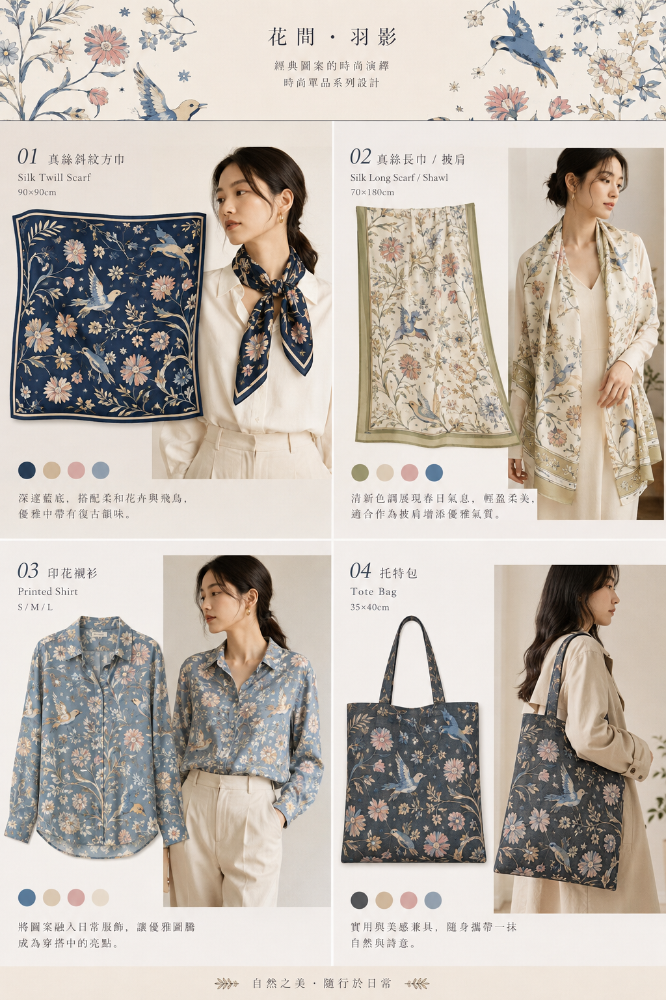

**來源：** [@aiehon\_aya](https://x.com/aiehon_aya/status/2046348182301683954)

**提示詞：**

```text
[中文]
使用附圖中的圖案，由專業設計師打造 4 款時尚單品，採用不同的色彩搭配與排版設計，附帶穿搭效果圖。以雅緻的構圖凸顯圖案的美感。格式為 2:3，希望將影象生成模型從 duct-tape-1 指定為 duct-tape-2、3。

[English]
Use the patterns in the attached image, crafted by professional designers to create 4 fashion items, using different color schemes and layout designs, accompanied by outfit effect pictures. Highlight the beauty of the patterns with an elegant composition. The format is 2:3, hoping to specify the image generation model from duct-tape-1 to duct-tape-2, 3.
```

***

<a name="case-217"></a>

### 例 217：昏暗室內純真少女的意外回眸

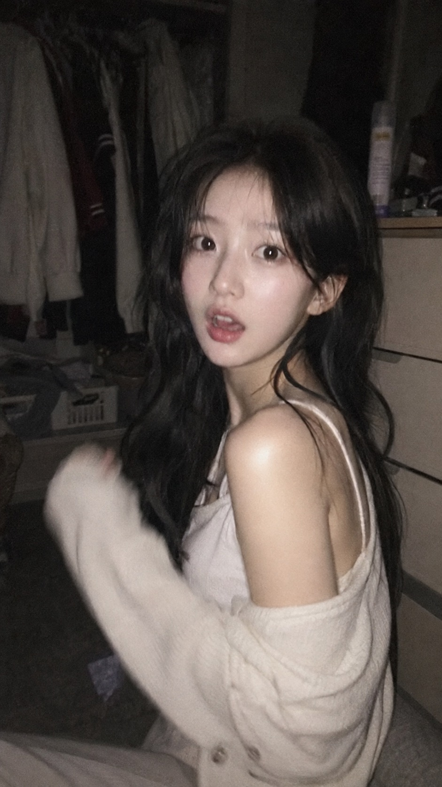

**來源：** [@BubbleBrain](https://x.com/BubbleBrain/status/2046190539213885806)

**提示詞：**

```text
[中文]
{
  "prompt": {
    "style_and_tech": "手機照片，老式CCD相機美學，刺眼的閃光燈，顆粒感，昏暗雜亂的室內光線，抓拍快照感覺，輕微的運動模糊",
    "subject": "年輕的韓國女偶像，溫柔純真的外表",
    "pose": "動作進行中，微微轉頭看向鏡頭，彷彿剛剛注意到正在被拍照，肩膀微微聳起",
    "expression": "眼睛微微睜大，因驚訝而微微張開的嘴唇，害羞且猝不及防的表情",
    "clothing": "寬鬆柔軟的居家服（薄開衫+內搭上衣），一側肩膀微微滑落但沒有暴露",
    "vibe": "毫無防備，親密，意外的瞬間，喚起好奇心與保護欲",
    "aspect ratio": "9:16"
  }
}

[English]
{
  "prompt": {
    "style_and_tech": "mobile phone photo, old CCD camera aesthetic, harsh flash, grainy, dim messy indoor lighting, candid snapshot feeling, slight motion blur",
    "subject": "young Korean female idol, soft innocent look",
    "pose": "mid-action, slightly turning head toward camera as if just noticed being photographed, shoulders slightly raised",
    "expression": "eyes widened slightly, lips parted in surprise, shy and caught-off-guard expression",
    "clothing": "loose soft homewear (thin cardigan + inner top), slightly slipping off one shoulder but not revealing",
    "vibe": "unprepared, intimate, accidental moment, evokes curiosity and protectiveness"，
    "aspect ratio":"9:16"
  }
}
```

***

<a name="case-218"></a>

### 例 218：繪製科學百科知識圖譜

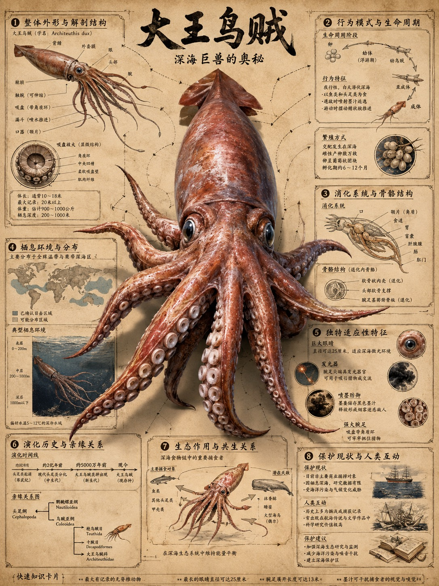

**來源：** [@GeekCatX](https://x.com/GeekCatX)

**提示詞：**

```text
[中文]
角色：世界級科學百科插畫師兼知識圖譜架構師
任務：以經典、無品牌標識（無任何 Logo）的科學百科風格，創作一幅細節極致豐富、結構極其精巧、視覺效果驚豔的「環球圖解百科科學資訊圖表」。
題材選擇：從【人物、植物、動物】中任選其一。
具體物件：【例如：大王烏賊 / 列奧納多・達・芬奇 / 紅杉樹】
風格：採用復古泛黃米色紙張背景，繪製精細工整的科學插畫；線條細膩精緻，整體繁複專業、嚴謹考究。
核心視覺要求
主體逼真 3D 效果
位於畫面視覺中心（C 位）的主體形象，需具備極致的寫實感與動態張力。營造強烈的空間縱深感，讓人物、植物或動物彷彿突破畫框，從平面紙張中躍出、衝向觀者（效果類似變形 3D 或動態彈出效果，高精度寫實呈現）。
版式佈局與留白設計
主體位置：佔據畫面中心，周圍刻意設定規劃式留白，強化立體彈出效果，使其成為絕對視覺焦點。
周邊模組：根據所選題材，在畫面四周（上下左右及四角）排布 6–8 個獨立且規整有序的知識模組。整體呈現規整的資訊密度感，而非雜亂堆砌。每個模組需帶有清晰邊框、標題欄與詳盡豐富的內容。
關聯結構
運用纖細的指示線、箭頭、括號、虛線與小型連線點，構建複雜且邏輯清晰的網路，將中心主體與所有周邊模組相連，並使各模組之間相互關聯，形成完整統一的知識體系。
文字與標註（硬性要求：必須為清晰中文）
主標題：以醒目大氣、筆法優美的中文書法字型呈現具體物件名稱【例如：大王烏賊】。
書法點綴：在主體畫面與模組標題中，對關鍵術語使用工整美觀的中文書法字型標註。
標準中文文字：其餘所有說明文字、大量清晰中文手寫註釋、模組內容及註解均使用清晰可辨的簡體漢字，不得出現亂碼或無法識別符號，優先保證文字可讀性。
指示線標註：模組內所有細小結構、細節、子模組、圖表與插畫，均需搭配詳盡的指示線標註（仿解剖圖形式），直接指向對應部位，最大化體現專業性與科普價值，做到每一處結構均有標註。
分題材模組結構（參考示例）
A. 人物類
模組 1：解剖結構與骨骼系統（含放大剖面圖示）
模組 2：生理運作機制（如迴圈系統、神經系統）
模組 3：生平背景與時間軸（核心成就）
模組 4：主要貢獻圖解（詳細拆解）
模組 5：認知模式與心理特徵
模組 6：基因特徵與演化溯源
模組 7：全球影響力與文化衝擊
模組 8：藝術形象與後世傳承
B. 動物類
模組 1：整體外形草圖與解剖結構（含顯微鏡級圓形放大細節）
模組 2：行為模式與生命週期（如交配、遷徙，流程圖形式）
模組 3：消化系統與骨骼系統
模組 4：棲息環境與分佈地圖（含環境細節）
模組 5：獨特適應性特徵（如偽裝、捕食器官）
模組 6：演化歷史與親緣物種
模組 7：共生關係與生態位作用
模組 8：保護現狀與人類互動
C. 植物類
模組 1：植株整體草圖與解剖結構（含葉片、根部放大細節）
模組 2：光合作用與生命週期流程（搭配環境示意圖示）
模組 3：細胞結構（圓形放大檢視）
模組 4：藥用價值與實際應用
模組 5：環境適應性與獨有特徵
模組 6：分佈地圖與生長環境
模組 7：基因變異與培育方式
模組 8：歷史用途與民間傳說
整體構圖要求
資訊密度極高，規整劃分為 6–8 個結構化模組，同時透過中心區域的規劃留白突出超寫實主體的立體彈出效果。風格硬核、專業、學術化，憑藉動態 3D 主體實現極強視覺吸引力。
無任何百科品牌標識（如 DK 等 Logo）。
所有標註清晰可辨，所有手寫註釋工整可讀。
主標題採用中文書法字型。
畫面比例：3:4。
【主題內容】

[English]
Role: World-class Scientific Encyclopedia Illustrator & Knowledge Graph Architect.

Task: Generate a highly detailed, extremely intricate, and visually stunning "Universal Illustrated Encyclopedia Science Infographic" in a classic, unbranded (NO logos) scientific encyclopedia style.

Subject Matter: Choose one from [People, Plants, or Animals].

Specific Subject: [e.g., The Giant Squid / Leonardo da Vinci / The Sequoia Tree].

Style: Fine, detailed scientific illustration on a retro, aged beige paper background. Delicate linework. Intricately complex and professional.

Key Visual Requirements:

1.  Lifelike 3D Effect (The Central Subject): The central subject in the "C position" must be rendered with extraordinary realism and dynamism. Create a dramatic sense of depth where the character, plant, or animal appears to break the frame, leaping or bursting out of the flat paper towards the viewer (an effect similar to anamorphic 3D or dynamic pop-out, with high-precision realism).

2.  Layout & Strategic White Space:
    * Central Subject: Dominates the center, with intentional "strategic white space" around it to enhance the popping-out effect and make the figure the clear focal point.
    * Surrounding Modules: The surrounding area (left, right, top, bottom, and corners) must be filled with 6-8 distinct, highly organized knowledge modules, depending on the subject. There should be a sense of organized density, not random clutter. The modules themselves must have clear borders, headers, and extensive, detailed content.

3.  Connections: Use a complex, logical network of fine leader lines, arrows, brackets, dotted lines, and small connection points to link the central figure to all surrounding modules, and interconnect the modules themselves into a cohesive knowledge web.

4.  Text & Annotation (Hard Requirement - Must be CLEAR Chinese):
    * Main Title: A large, prominent, beautifully executed **Chinese calligraphy** (书法体) of the specific subject's name [e.g., "大王乌贼"].
    * Calligraphic Accents: Scattered throughout the main content and module titles, use beautiful, clear Chinese calligraphy for important terms.
    * Standard Chinese Text: All other descriptive text, handwritten notes (大量清晰中文手写注释), module content, and annotations must be clear, legible Chinese characters (简体中文), not gibberish or unreadable symbols. Ensure text clarity is prioritized.
    * Leader Line Annotations: Every single small component, detail, submodule, diagram, or illustration within the modules must have detailed leader line annotations (拟解剖图) pointing directly to it for maximum professionalism and educational value. Every part should be labeled.

Subject-Specific Module Structure (Example for general reference):

A. For Humans [People]:
   - Module 1: Anatomy & Skeletal Structure (w/ magnified cross-sections)
   - Module 2: Physiological Processes (e.g., Circulatory/Nervous System)
   - Module 3: Historical Context & Timeline (Key Achievements)
   - Module 4: Major Contribution Diagram (Detailed breakdown)
   - Module 5: Cognitive Process / Psychological Insight
   - Module 6: Genetic Profile / Evolution
   - Module 7: Global Influence & Cultural Impact
   - Module 8: Cultural Representations / Legacy

B. For Animals:
   - Module 1: Full External Sketch & Anatomy (w/ microscope magnified detail circular windows)
   - Module 2: Behavioral Patterns & Lifecycle (e.g., Mating/Migration, Flowchart style)
   - Module 3: Digestive & Skeletal System
   - Module 4: Habitats & Distribution Map (with environmental details)
   - Module 5: Unique Adaptations (e.g., camouflage, hunting tools)
   - Module 6: Evolutionary History & Relatives
   - Module 7: Symbiotic Relationships / Ecosystem Role
   - Module 8: Conservation Status & Human Interaction

C. For Plants:
   - Module 1: Full Plant Sketch & Anatomy (w/ magnified leaf/root details)
   - Module 2: Photosynthesis & Lifecycle Flow (w/ icons for environment)
   - Module 3: Cellular Structure (Magnified circular views)
   - Module 4: Medicinal Properties / Practical Applications (as in original original prompt)
   - Module 5: Environmental Adaptations / Unique Features
   - Module 6: Distribution Map & Environmental Context
   - Module 7: Genetic Variations & Cultivation
   - Module 8: Historical Usage & Folklore

Overall Composition: Extremely dense with information, organized into 6-8 structured modules, but balanced with strategic empty space around the center to allow the main, hyper-realistic figure to pop. Hard-core, professional, academic, but visually engaging due to the dynamic 3D central figure. No branding from any specific encyclopedia (e.g., no "DK" logos). All annotations must be legible. All handwritten notes must be clear. Main titles in Chinese calligraphy. Aspect Ratio: 3:4.

[主题内容]
```

***

<a name="case-219"></a>

### 例 219：韓系偶像九宮格寫真集

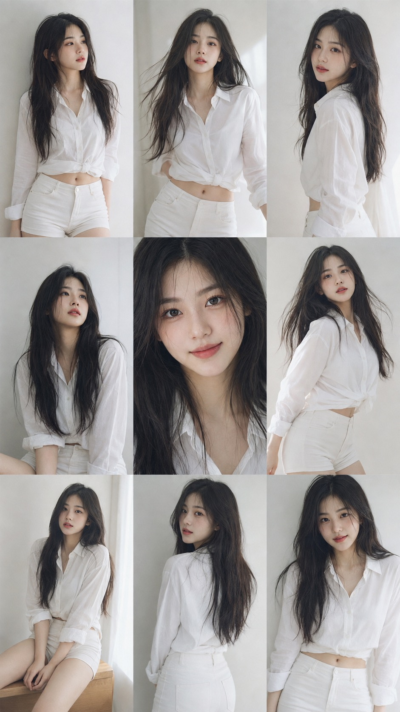

**來源：** [@BubbleBrain](https://x.com/BubbleBrain/status/2046151898621993364)

**提示詞：**

```text
[中文]
9:16 豎版 — 一個 3x3 網格拼貼（九張圖片）形成一系列韓國偶像肖像攝影。每一幀都呈現同一位年輕的韓國女性偶像，在所有九張鏡頭中保持 100% 一致的面部特徵、比例、髮型和身份。自然、超逼真的皮膚紋理，無修圖，無磨皮。乾淨的偶像風格極簡妝容，柔和的光澤，微妙的瑕疵。髮型：長髮、蓬鬆的黑髮，微亂，在所有幀中保持一致（自然鬆散的垂落，輕微的動感）。服裝：連貫的韓國偶像攝影造型 — 白色襯衫 + 短款下裝（或簡單的中性色調服裝），青春、乾淨、略帶休閒但有造型感。所有幀中穿著相同的服裝。場景：極簡的工作室或簡單的室內環境（白牆，柔和的窗光，乾淨的背景）。聚焦於主體，而不是環境。光照：柔和漫反射的自然光，溫柔的高光，低對比度，略帶通透感的色調，微妙的膠片般柔和感。相機風格：親密的肖像攝影，略帶手持感，微妙的瑕疵（輕微的顆粒感，動態幀中的輕微模糊，不完美的構圖）。幀分解（3x3 網格）：頂行：- 左上：自然站立，視線略微偏向一側，表情放鬆 - 中上：面對鏡頭，隨意的中間動作（頭髮或身體輕微移動） - 右上：輕微的側面角度，柔和的注視，自然的抓拍感 中間行：- 中左：微微向上看，柔和的沉思表情 - 正中：特寫肖像，直接的眼神接觸，溫柔的偶像微笑 - 中右：身體微微轉動，中間動作的抓拍幀 底行：- 左下：隨意坐著或倚靠著，放鬆的姿勢 - 中下：背部部分轉向，越過肩膀看向鏡頭 - 右下：靠近畫框站立，略帶俏皮或柔和的表情 氛圍：韓國偶像寫真集 / 小卡美學，親密、柔和、自然、日常的魅力。品質：超寫實，8K 細節，微妙的模擬膠片顆粒感，自然的瑕疵，柔和夢幻的色調

[English]
9:16 vertical — a 3x3 grid collage (nine images) forming a Korean idol portrait photoshoot series. Each frame features the same young Korean female idol, maintaining 100% consistency in facial features, proportions, hairstyle, and identity across all nine shots.   Natural, ultra-realistic skin texture, no retouching, no smoothing. Clean idol-style minimal makeup, soft glow, subtle imperfections.   Hair: long, voluminous dark hair, slightly tousled, consistent across all frames (natural loose flow, slight movement).  Outfit: cohesive Korean idol photoshoot styling — white shirt + short bottoms (or simple neutral-toned outfit), youthful, clean, slightly casual but styled. Same outfit across all frames.  Setting: minimal studio or simple indoor environment (plain wall, soft window light, clean background). Focus on subject, not environment.  Lighting: soft diffused natural light, gentle highlights, low contrast, slightly airy tones, subtle film-like softness.  Camera style: intimate portrait photography, slightly handheld feel, subtle imperfections (minor grain, slight blur in motion frames, imperfect framing).  Frame breakdown (3x3 grid):  Top row: - Top left: standing naturally, looking slightly away, relaxed expression - Top center: facing camera, casual mid-motion (hair or body slight movement) - Top right: slight side angle, soft gaze, natural candid feel  Middle row: - Center left: looking slightly upward, soft thoughtful expression - Center: close-up portrait, direct eye contact, gentle idol smile - Center right: turning body slightly, mid-motion candid frame  Bottom row: - Bottom left: seated or leaning casually, relaxed posture - Bottom center: back partially turned, looking over shoulder toward camera - Bottom right: standing close to frame, slightly playful or soft expression  Mood: Korean idol photobook / photocard aesthetic, intimate, soft, natural, everyday charm.  Quality: ultra-realistic, 8K detail, subtle analog film grain, natural imperfections, soft dreamy tone
```

***

<a name="case-220"></a>

### 例 220：鎏金廣州塔的東方奇幻海報

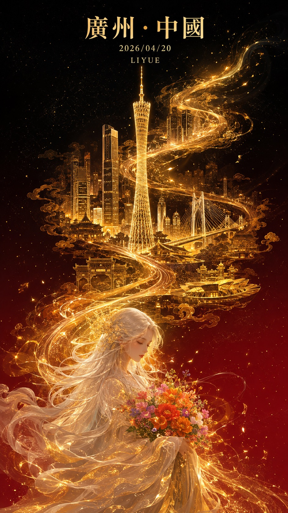

**來源：** [@liyue\_ai](https://x.com/liyue_ai/status/2046243132774494607)

**提示詞：**

```text
[中文]
平面插畫，東方幻想風格高階城市海報設計，豎版9:16構圖，整體採用對角線+S型流動構圖，從左下向右上延展，畫面以深邃黑色為背景，自上而下漸變至濃烈暗紅色，形成強烈冷暖對比與空間縱深，背景帶微弱星塵與顆粒質感。畫面中央一條金色流動能量線條如火焰般蜿蜒貫穿，自底部向上延伸，具有流體質感、粒子光效與漸變高光，局部帶細微能量碎屑與體積光。

金色流光中逐層浮現廣州城市地標建築群：廣州塔為視覺核心，比例突出，周圍融合珠江新城高樓群、獵德大橋及現代與嶺南建築元素，建築採用“精細線描 + 金色發光體塊”表現，輪廓清晰、細節豐富，在金色光暈映襯下彷彿懸浮於虛空，形成超現實空間層次，遠景輕微霧化增強縱深感。

畫面底部為一位東方白髮女性形象，長髮飄逸，如煙似霧，與金色流光自然銜接並逐漸融合，髮絲半透明帶漸變光感，姿態柔美，雙目微閉，神情寧靜，懷抱一束多彩鮮花，花間點綴微光粒子與星點效果，象徵人與城市能量的精神連線，人物細節適度簡化以突出整體設計感。

光影集中於金色流線、建築與人物輪廓，形成強烈明暗對比與視覺聚焦，整體氛圍宏大、神秘、具有東方神話意境且略帶治癒感。色彩以黑與暗紅為基底，高亮鎏金為主視覺強調，金色具備豐富明暗層次，輔以小面積高飽和花束色彩點綴，整體高階克制。

頁面文字與畫面融合排版：頂部居中宋體大字“廣州·中國”，下方小字“2026/04/20”，再下方小字“LIYUE”，文字採用淡金色或柔和暖白色，與整體光影統一。高品質細節，電影級光影表現，體積光與粒子細節豐富，畫面乾淨無噪點，超高畫質8K解析度，商業級海報質感。

[English]
Flat illustration, Oriental fantasy style high-end city poster design, vertical 9:16 composition, the overall adopts a diagonal + S-shaped flowing composition, extending from the bottom left to the top right, the picture uses deep black as the background, gradually changing from top to bottom to intense dark red, forming a strong cold-warm contrast and spatial depth, the background has a faint stardust and grainy texture. In the center of the picture, a golden flowing energy line winds through like a flame, extending from the bottom to the top, having a fluid texture, particle light effects and gradient highlights, with subtle energy debris and volumetric light in some areas. Guangzhou city landmark building complexes emerge layer by layer in the golden flowing light: Canton Tower is the visual core, with a prominent proportion, surrounded by the integration of Zhujiang New Town high-rise buildings, Liede Bridge and modern and Lingnan architectural elements, the buildings are expressed using "fine line drawing + golden glowing blocks", clear outlines and rich details, set off by the golden halo, they seem to float in the void, forming a surreal spatial hierarchy, the distant view is slightly fogged to enhance the sense of depth. At the bottom of the picture is an oriental white-haired female figure, long hair fluttering, like smoke and mist, naturally connecting and gradually blending with the golden flowing light, the hair is translucent with a gradient light sense, graceful posture, eyes slightly closed, serene expression, holding a bunch of colorful fresh flowers in her arms, interspersed with faint light particles and starlight effects among the flowers, symbolizing the spiritual connection between human and urban energy, character details are moderately simplified to highlight the overall sense of design. Light and shadow are focused on the golden streamlines, buildings and character outlines, forming a strong light-dark contrast and visual focus, the overall atmosphere is grand, mysterious, with an Oriental mythological artistic conception and a slight healing sense. The color uses black and dark red as the base, highlighted gilded gold as the main visual emphasis, the gold has rich light and dark layers, supplemented by small areas of high-saturation bouquet color embellishments, the overall is advanced and restrained. Page text and picture integrated typography: large Song typeface characters "Guangzhou·China" centered at the top, small characters "2026/04/20" below, small characters "LIYUE" further below, the text uses light gold or soft warm white, unifying with the overall light and shadow. High-quality details, cinematic light and shadow performance, rich volumetric light and particle details, clean picture without noise, ultra-high definition 8K resolution, commercial-grade poster texture.
```

***

<a name="case-221"></a>

### 例 221：窗邊日系膠片女孩

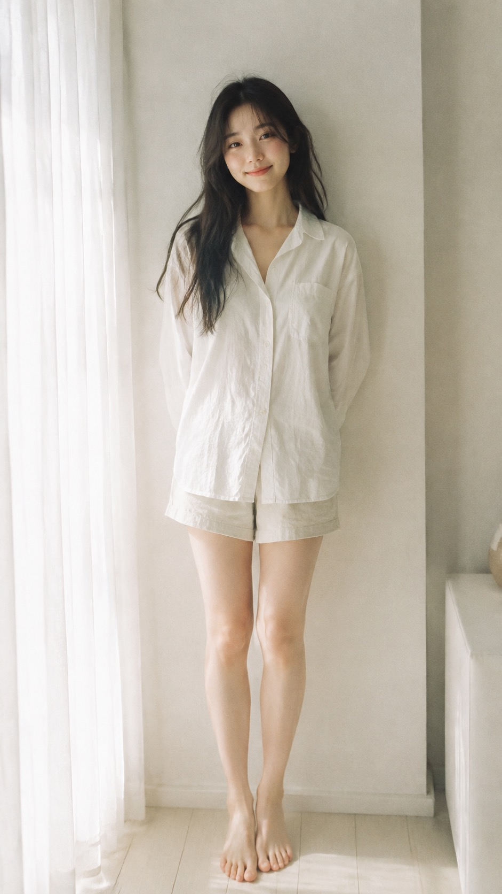

**來源：** [@BubbleBrain](https://x.com/BubbleBrain/status/2046115431144902732)

**提示詞：**

```text
[中文]
模擬35毫米膠片攝影，柔和輕盈的日系美學，溫柔漫射的自然窗戶光，輕微過曝，柔和色調，低對比度，柔和的高光，靠近窗戶配有白色窗簾的極簡室內環境，乾淨的淺色牆壁，自然構圖，平視視角，略微緊湊的全身取景（大腿中部到頭部），年輕東亞女性，自然極簡妝容，柔和真實的皮膚紋理，長長的微亂黑髮，超大號白色紐扣襯衫，淺色休閒短褲，赤腳，簡單放鬆的造型，自然站立姿勢放鬆，雙臂自然下垂或略微放在身後，面朝鏡頭，溫柔柔和的微笑，微妙的靜止感，專注於光線、空氣和安靜的日常氛圍，柔和的膠片顆粒，夢幻而低調的氛圍 --ar 9:16

[English]
Analog 35mm film photography, soft airy Japanese-style aesthetic, gentle diffused natural window light, slight overexposure, pastel tones, low contrast, soft highlights,  minimal indoor setting near a window with white curtains, clean light-colored wall, natural composition, eye-level, slightly closer full-body framing (mid-thigh to head),  young East Asian woman, natural minimal makeup, soft realistic skin texture, long slightly messy dark hair,  oversized white button-up shirt, light casual shorts, barefoot, simple and relaxed styling,  standing naturally with relaxed posture, arms loosely at sides or slightly behind, facing camera, gentle soft smile, subtle stillness,  focus on light, air, and quiet everyday mood, soft film grain, dreamy and understated atmosphere --ar 9:16
```

***

<a name="case-222"></a>

### 例 222：精緻模組化科普百科圖鑑

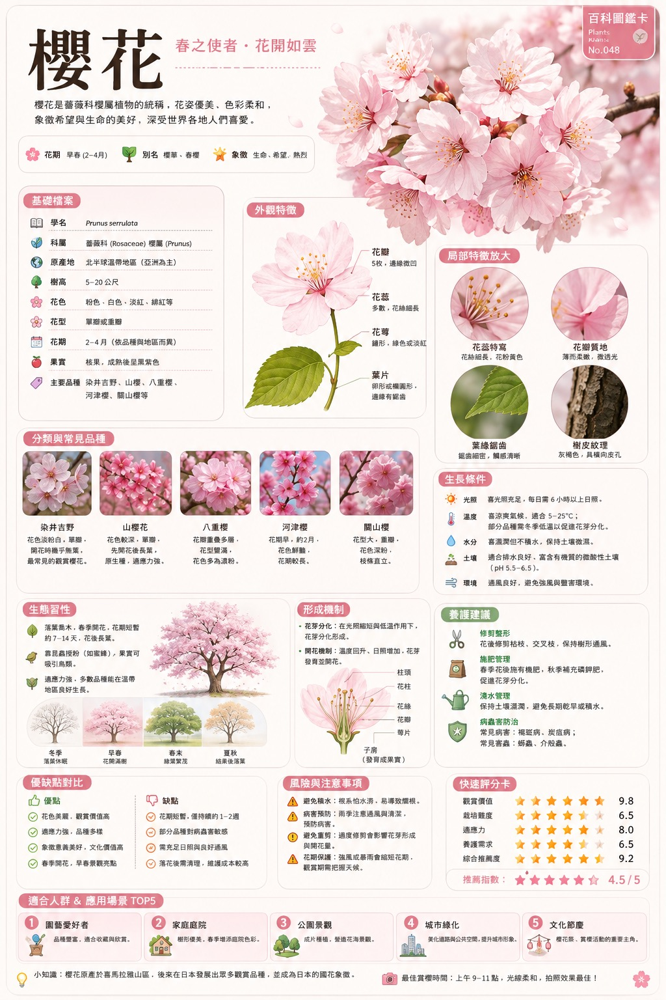

**來源：** [@MrLarus](https://x.com/MrLarus/status/2046231542817497392)

**提示詞：**

```text
[中文]
請根據【主題】生成一張高品質豎版「科普百科圖」。

這張圖不是普通海報，也不是單純插畫，而是一張兼具“圖鑑感、百科感、資訊結構感、收藏感”的模組化科普資訊圖表。整體風格參考高階博物圖鑑、現代百科書頁、生活方式知識卡和社群媒體高傳播資訊圖表的結合。

請讓畫面包含：
- 一個清晰漂亮的主題主視覺
- 若干局部特徵放大細節
- 多個圓角模組化資訊分區
- 清楚的標題層級與重點標籤
- 簡潔但豐富的百科內容
- 視覺化評分、要點總結或Top 5模組

內容欄目請根據主題自動適配，優先從這些方向中選擇併合理組合：
基礎檔案、分類資訊、外觀特徵、習性/生態、形成機制/結構組成、生長或使用條件、養護或維護建議、風險與注意事項、適合人群或適用場景、優缺點對比、快速評分卡。

視覺要求：
淺色乾淨背景，柔和配色，輕陰影，精緻小圖示，圓角資訊框，整潔排版，資訊密度高但不擁擠，閱讀體驗好。整體必須像真正可以發布、閱讀、收藏、系列化生產的科普百科卡，而不是廣告圖。

請不要做成普通商業宣傳海報。要突出“知識整理 + 模組資訊 + 圖鑑式展示”的特徵。

[English]
Please generate a high-quality vertical "Popular Science Encyclopedia Infographic" based on the [Topic].

This image is not an ordinary poster, nor a simple illustration, but a modular popular science infographic with a sense of "illustrated guide, encyclopedia, information structure, and collectibility". The overall style references a combination of high-end natural history illustrated guides, modern encyclopedia pages, lifestyle knowledge cards, and highly shared social media infographics.

Please make the image contain:
- A clear and beautiful theme main visual
- Several enlarged details of local features
- Multiple rounded modular information sections
- Clear title hierarchy and key tags
- Concise but rich encyclopedia content
- Visualized scoring, key point summaries, or Top 5 modules

Content columns should automatically adapt to the topic, prioritizing selection and reasonable combination from these directions:
Basic profile, classification information, appearance features, habits/ecology, formation mechanism/structural composition, growth or usage conditions, care or maintenance suggestions, risks and precautions, suitable groups or applicable scenarios, pros and cons comparison, quick scorecard.

Visual requirements:
Light-colored clean background, soft color palette, light shadows, exquisite small icons, rounded information boxes, neat typography, high information density but not crowded, good reading experience. The overall look must be like a real popular science encyclopedia card that can be published, read, collected, and serialized, rather than an advertisement.

Please do not make it into an ordinary commercial promotional poster. It must highlight the characteristics of "knowledge organization + modular information + illustrated guide style display".
```

***

<a name="case-223"></a>

### 例 223：春日禪意水墨群山海報

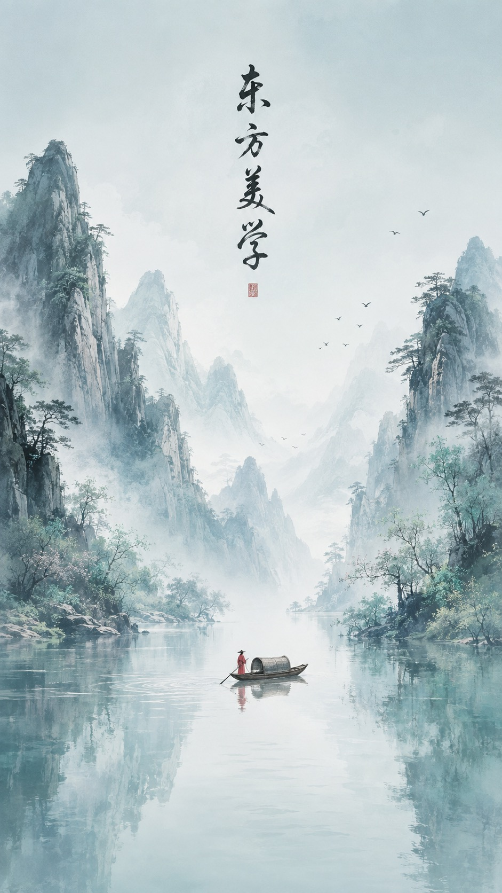

**來源：** [@liyue\_ai](https://x.com/liyue_ai/status/2046215276249993720)

**提示詞：**

```text
[中文]
新中式水墨山水海報，豎版9:16構圖，東方極簡美學風格，
大面積留白，整體色調為春日清晨氛圍（青綠色、霧藍、淡灰、淺墨），低飽和、清透柔和，高階質感。
畫面主體為奇峻巍峨的群山，從中間平靜湖面的兩側拔地而起，佔據左右兩側畫面，
山體以水墨暈染表現，濃淡乾溼變化豐富，局部融入淡青綠色渲染，體現春意生機。
山峰被溼潤輕柔的晨霧包裹，霧氣層層遞進，與淺青藍天空自然融合，形成空氣透視與空間縱深。

湖面如鏡面般平靜，呈現微青綠色調，倒映山體與天空，反射略帶柔焦與霧化擴散效果，增強春日溼潤與夢幻氛圍。
中景一艘帶弧形篷頂的小木舟緩慢漂浮，船槳輕觸水面形成細膩漣漪，水紋自然擴散，整體保持極靜狀態。

船上為一位紅衣漁女，體量較小（遠景比例），人物簡化處理為水墨剪影 + 輕微設色，
身著低飽和硃砂紅傳統服飾（非鮮豔紅），顏色略被霧氣柔化，
人物面部不刻畫細節，僅保留輪廓與姿態（如輕扶船篷或執槳），
紅色在水面形成淡淡倒影，作為畫面唯一暖色視覺焦點。

岸邊點綴疏林與春季新生植被，採用淡墨 + 淡青綠點染，虛實結合，增強節奏與生命氣息。

少量飛鳥在遠空掠過，輕盈疏散分佈，增強空間層次與靈動感。

畫面頂部居中豎排書法：“東方美學”，採用傳統手寫行書或行草風格（王羲之筆意），
筆觸自然起伏、提按分明，帶飛白與墨韻擴散效果，避免字型感。
書法顏色為深墨青或柔和墨黑，與整體畫面統一。
整體風格：水墨 + 現代極簡設計融合，春日禪意、空靈溼潤、寧靜氛圍，
冷暖對比克制，電影感光影，高階藝術海報質感，8K超清細節。

[English]
Neo-Chinese ink wash landscape poster, vertical 9:16 composition, Oriental minimalist aesthetic style,
Large area of negative space, overall color tone is spring morning atmosphere (cyan-green, misty blue, light gray, light ink), low saturation, clear and soft, high-end texture.
The main subject of the picture is steep and majestic mountains, rising from both sides of the calm lake in the middle, occupying the left and right sides of the picture,
The mountain bodies are expressed with ink wash blending, rich in changes of shades, dryness and wetness, partially integrated with light cyan-green rendering, reflecting the vitality of spring.
The mountain peaks are wrapped in moist and gentle morning mist, the mist progresses layer by layer, naturally blending with the light cyan-blue sky, forming aerial perspective and spatial depth.
The lake surface is as calm as a mirror, showing a slightly cyan-green tone, reflecting the mountains and the sky, the reflection slightly has a soft focus and atomization diffusion effect, enhancing the spring moist and dreamy atmosphere.
In the midground, a small wooden boat with an arched canopy floats slowly, the oars lightly touch the water surface to form delicate ripples, the water patterns spread naturally, maintaining an extremely quiet state overall.
On the boat is a fisherwoman in red, with a small volume (distant view proportion), the character is simplified into an ink wash silhouette + slight coloring,
wearing a low-saturation cinnabar red traditional costume (not bright red), the color is slightly softened by the mist,
no facial details are depicted for the character, only retaining the outline and posture (such as gently holding the boat canopy or holding the oar),
the red color forms a faint reflection on the water surface, serving as the only warm color visual focus in the picture.
The shore is dotted with sparse woods and spring newborn vegetation, using light ink + light cyan-green dot dyeing, combining virtuality and reality, enhancing rhythm and breath of life.
A small number of flying birds skim across the distant sky, distributed lightly and loosely, enhancing the spatial layers and sense of agility.
At the top center of the picture, vertical calligraphy: "Oriental Aesthetics", adopting traditional handwritten running script or running-cursive style (intention of Wang Xizhi's brushwork),
brushstrokes naturally undulate, lifting and pressing are distinct, with flying white and ink rhyme diffusion effects, avoiding a sense of font.
The calligraphy color is dark ink cyan or soft ink black, unified with the overall picture.
Overall style: ink wash + modern minimalist design fusion, spring Zen, ethereal and moist, tranquil atmosphere,
restrained cold and warm contrast, cinematic light and shadow, high-end art poster texture, 8K ultra-clear details.
```

***

<a name="case-224"></a>

### 例 224：機甲少女立於廢棄海城

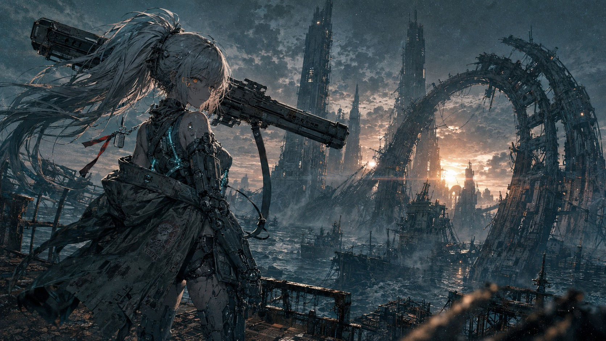

**來源：** [@old\_pgmrs\_will](https://x.com/old_pgmrs_will/status/2046144801071079612)

**提示詞：**

```text
[中文]
一名十幾歲的機甲少女，蒼白的肌膚上沾著煙塵與海水飛沫，銳利的琥珀色眼眸中映出發光的 HUD 瞄準標線；及腰的灰白色長髮紮成高馬尾，在海風中肆意飛揚。啞光槍灰色外骨骼裝甲覆蓋雙肩、前臂與小腿，關節處裸露著液壓活塞，胸掛布有發光的青藍色冷卻管線。一件沾著油汙的超大號機庫外套半滑落在一側肩頭，一門巨型軌道炮架在右肩，衣領處掛著士兵牌與磨損的紅色絲帶。
她站在向左略微偏移的位置，立於傾斜鋼鐵平台的鏽蝕邊緣，平台向外延伸至漆黑海面之上；重心落在單腿上，左手緊握炮帶，頭部微轉向鏡頭，投來沉靜而桀驁的目光。背部推進器不斷噴出蒸汽，馬尾與外套在鹹腥海風裡向一側狂亂飄動。
背景是黃昏時分廣袤的廢棄海上都市，用途不明的巨型超級建築從海洋中拔地而起，形成錯落的剪影；骨白色的巨型塔樓與附著藤壺的鋼鐵結構融為一體，巨大的環形建築以破碎的角度傾斜矗立，鏽蝕的桁架骨架間纏繞著廢棄線纜，深色浪濤在支撐柱間翻湧，數艘沉船半淹在柱腳。厚重的海霧縈繞在建築底部，高聳的結構直刺入暗沉的天空，塔樓高處零星閃爍著微弱燈光，宛如遙遠的眼眸。
畫面採用陰鬱低調的光影：陰沉天空透出冷調青藍環境光，畫面右側遠處建築漏出溫暖的琥珀色鈉燈光暈，塔樓後方低垂的太陽形成強烈逆光，勾勒出她的輪廓；體積光穿透海霧，裝甲上呈現溼潤的鏡面高光。
鏡頭使用 35mm 變形寬銀幕鏡頭，略微低角度仰拍，越過她的肩膀望向遠處建築群；中全景構圖，淺景深使前景的鏽蝕景物虛化，帶有橫向鏡頭眩光，細膩的大氣薄霧將遠處巨型建築壓縮為層次分明的剪影。
整體為電影感動漫主視覺風格，繪畫感數字插畫搭配利落線稿，採用青藍、骨白與鐵鏽色為主的低飽和海洋色調，點綴少量暖色調高光；新增膠片顆粒，呈現高對比度的藝術海報質感，畫幅比例 16:9。

[English]
A mecha girl mid-teens, pale skin smudged with soot and salt spray, sharp amber eyes with glowing HUD reticles, waist-length ash-white hair tied in a high ponytail whipping in the sea wind, matte gunmetal exoskeleton armor plating her shoulders, forearms and shins, exposed hydraulic pistons at the joints, chest rig with glowing cyan coolant lines, oversized oil-stained hangar jacket half slipping off one shoulder, a massive rail cannon resting on her right shoulder, dog tags and frayed red ribbon at her collar , standing off-center to the left on the rusted edge of a tilted steel platform jutting out over dark water, weight shifted onto one leg, left hand gripping the cannon strap, head turned slightly toward camera with a quiet defiant stare, steam venting from her back thrusters, her ponytail and jacket streaming sideways in the salt wind , a vast derelict sea-city at dusk, colossal megastructures of unknown purpose rising from the ocean in staggered silhouettes, bone-white monolithic towers fused with barnacled steel, cyclopean ring-shaped constructs canted at broken angles, rusted skeletal gantries threaded with dead cables, dark swells rolling between the pylons, shipwrecks half-swallowed at their feet, thick sea fog clinging to the bases while the upper structures pierce into a bruised sky, scattered faint lights blinking high in the towers like distant eyes , moody low-key lighting, cold teal ambient from the overcast sky, warm amber sodium glow leaking from a distant structure camera-right, hard backlight from a low sun behind the towers carving her silhouette, volumetric god rays cutting through sea mist, wet specular highlights on her armor , 35mm anamorphic lens, slight low angle looking up past her shoulder toward the structures, medium-wide shot, shallow depth of field with foreground rust in soft focus, horizontal lens flares, fine atmospheric haze compressing the distant megastructures into layered silhouettes , cinematic anime key visual, painterly digital illustration with crisp line art, desaturated oceanic palette of teal, bone-white and rust punched by small warm accent lights, film grain, high-contrast editorial poster aesthetic . Format 16:9.
```

***

<a name="case-225"></a>

### 例 225：大師級真跡復刻

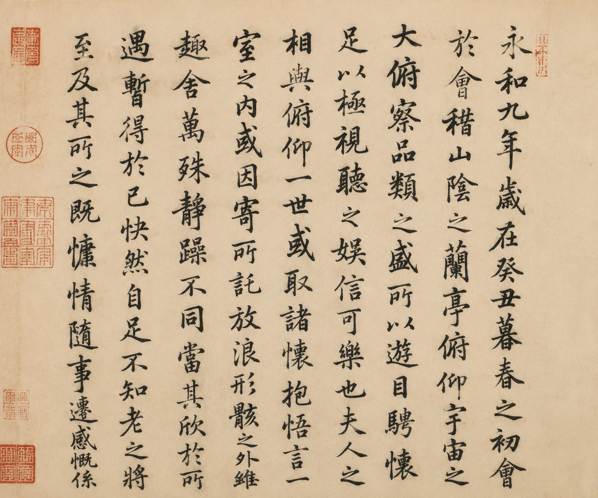

**來源：** [@MrLarus](https://x.com/MrLarus/status/2046201836525302032)

**提示詞：**

```text
[中文]
幫我生成xxxx真跡圖片

[English]
Help me generate xxxx authentic picture
```

***

<a name="case-226"></a>

### 例 226：古風明朝帝王群像長卷

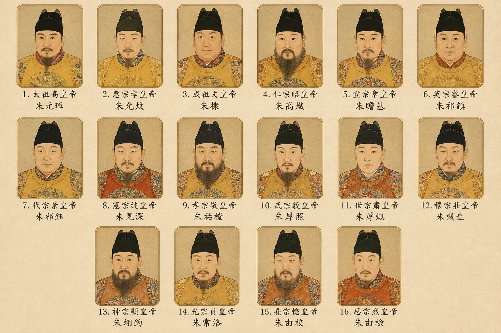

**來源：** [@liyue\_ai](https://x.com/liyue_ai/status/2045071977279635962)

**提示詞：**

```text
[中文]
根據上傳圖片的風格，生成明朝各個皇帝的頭像，頭像下面有他們的諡號和名字

[English]
Based on the style of the uploaded image, generate portraits of the emperors of the Ming Dynasty, with their posthumous titles and names below the portraits
```

***

<a name="case-227"></a>

### 例 227：哔哩哔哩戶晨風直播截圖

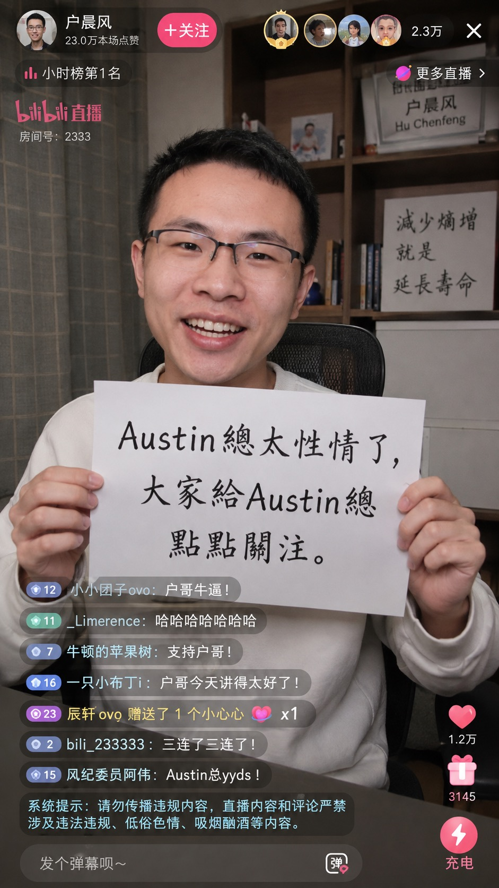

**來源：** [@austinit](https://x.com/austinit/status/2044994519649997183)

**提示詞：**

```text
[中文]
9:16 的圖片，生成一張哔哩哔哩直播的截圖，裡面是 戶晨風在直播，戶晨風表情開心，手裡拿著牌子，牌子裡寫著 “Austin總太性情了，大家給Austin總點點關注。”

[English]
A 9:16 image, generate a screenshot of a Bilibili live stream, inside is Hu Chenfeng broadcasting live, Hu Chenfeng has a happy expression, holding a sign in his hand, the sign says "Boss Austin is so emotional, everyone please give Boss Austin some follows."
```

***

<a name="case-228"></a>

### 例 228：完美匹配的海報廣告圖

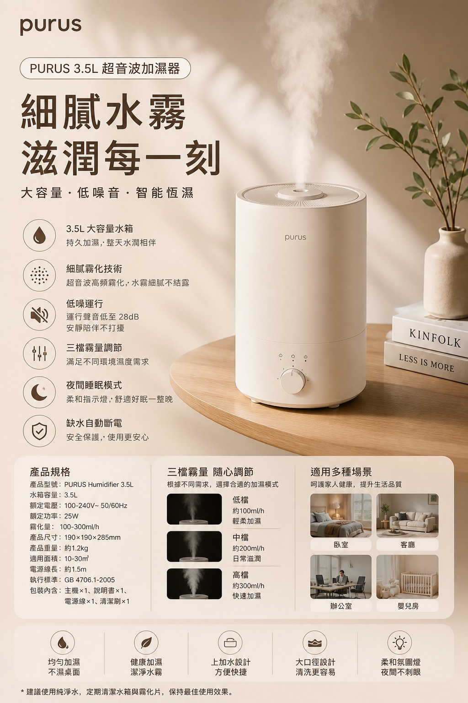

**來源：** [@Kashiko\_AIart](https://x.com/Kashiko_AIart/status/2045787856292151322)

**提示詞：**

```text
[中文]
生成一張與這張圖片完美匹配的廣告圖片。資訊量要多一些。

[English]
Generate an advertising image that perfectly matches this image. There should be a lot of information.
```

***

<a name="case-229"></a>

### 例 229：琉璃透明畫眉鳥飛舞羊城墨卷

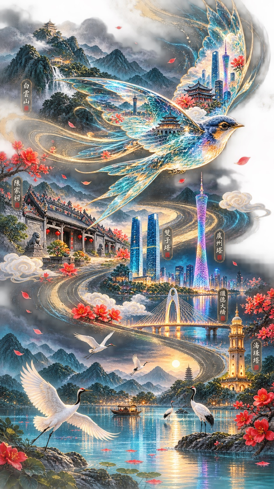

**來源：** [@liyue\_ai](https://x.com/liyue_ai/status/2045873940883808523)

**提示詞：**

```text
[中文]
【背景與骨架線條】
純黑深邃底色，一條粗壯有力的墨色書法S型曲線自畫面一端蜿蜒貫穿至另一端，筆觸蒼勁，墨跡濃淡有致，如大寫意行筆，構成整幅畫面的視覺骨架與敘事動線。
【主體：透明燕子】
曲線上方，一隻展翅飛翔的畫眉鳥佔據視覺核心；身體呈玻璃透明質感，內部對映傳統建築群疊影，藍綠色光流在透明羽翼間流轉折射，彷彿時間長河與文明記憶凝縮其中；輪廓以極細金線勾邊，增強立體感與神聖感。
【中景：古典建築序列】
燕子下方，沿墨線曲線錯落分佈廣州的各種風景名勝：白雲山、陳家祠、雙子塔、廣州塔、獵德大橋、海珠塔依次浮現；主色調青綠與淡金，建築細節清晰，琉璃瓦、飛簷翹角、石階迴廊；木棉花簇擁點綴於建築周圍，花瓣隨風輕散，靜謐而悠遠；幾朵水墨雲朵輕盈飄浮其間，增添空靈層次。
【前景：白鶴與水面】
前景湖畔：數只白鶴或靜立水邊、或振翅騰飛，姿態各異，優雅從容；淺藍湖面如鏡，倒影盪漾，波光細碎，營造寧靜氛圍。
【遠景：山巒】
遠處山巒層疊起伏，青黛色暈染，墨色由濃至淡，朦朧氤氳，富有水墨層次；與前景形成近實遠虛的空間縱深。
【構圖與光影】
非線性透視構圖，墨線曲線為敘事主軸，古今元素沿線嵌入；光源自畫面中心向外輻射擴散，形成強烈明暗對比，中心亮、四周漸暗；冷色調主導（深藍、青綠、銀白），暖色點綴（櫻花粉、淡金），和諧而神秘；東方美學與現代意象交融，超現實詩意意境。
【技術規格】
8K超高畫質渲染，極致細節精度，最佳畫質，比例 9:16

[English]
[
  Background and Skeleton Lines
] Pure black deep background,
a thick and powerful ink calligraphy S-shaped curve meanders from one end of the picture to the other,
with vigorous brushstrokes and well-proportioned ink shades,
like freehand brushwork,
forming the visual skeleton and narrative dynamic line of the entire picture. [
  Subject: Transparent Swallow
] Above the curve,
a flying thrush with spread wings occupies the visual core; the body has a glass transparent texture,
with overlapping shadows of traditional architectural complexes mapped inside,
blue-green light flows circulate and refract between the transparent wings,
as if the long river of time and civilized memories are condensed within it; the outline is bordered with extremely thin gold lines to enhance three-dimensionality and sacredness. [
  Midground: Classical Architecture Sequence
] Below the swallow,
various scenic spots in Guangzhou are scattered along the ink curve: Baiyun Mountain,
Chen Clan Ancestral Hall,
Twin Towers,
Canton Tower,
Liede Bridge,
Haizhu Tower appear in sequence; the main tone is cyan-green and pale gold,
architectural details are clear,
glazed tiles,
flying eaves,
stone steps and corridors; kapok flowers cluster and decorate around the buildings,
petals scatter lightly with the wind,
quiet and distant; a few ink clouds float lightly among them,
adding ethereal layers. [
  Foreground: White Cranes and Water Surface
] Lakeside in the foreground: several white cranes either stand quietly by the water or flap their wings to soar,
with different postures,
elegant and calm; the light blue lake surface is like a mirror,
reflections rippling,
shimmering light,
creating a tranquil atmosphere. [
  Distance: Mountains
] Distant mountains rise and fall in layers,
smudged in cyan-black,
ink shades from thick to light,
hazy and misty,
rich in ink wash layers; forming a spatial depth with solid foreground and empty distance with the foreground. [
  Composition and Light and Shadow
] Non-linear perspective composition,
the ink curve is the main narrative axis,
ancient and modern elements are embedded along the line; the light source radiates and diffuses outward from the center of the picture,
forming a strong contrast between light and dark,
bright in the center and gradually darkening around; cool tones dominate (dark blue,
cyan-green,
silver white),
warm tones embellish (cherry blossom pink,
pale gold),
harmonious and mysterious; Eastern aesthetics blend with modern imagery,
surreal poetic mood. [
  Technical Specifications
] 8K ultra-high definition rendering,
extreme detail precision,
best image quality,
ratio 9:16
```

***

<a name="case-230"></a>

### 例 230：極簡國潮鎏金廣州塔海報

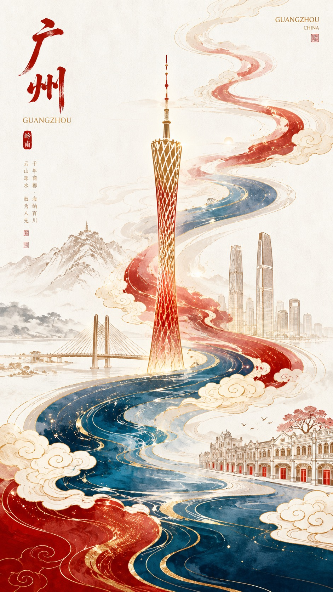

**來源：** [@liyue\_ai](https://x.com/liyue_ai/status/2045744531686166878)

**提示詞：**

```text
[中文]
新中式極簡風格高階城市海報，9:16豎版構圖，以廣州為核心主題，畫面中心為抽象幾何化的廣州塔，造型簡潔但具有辨識度，

整體採用S型流動構圖，從下方向上延展，珠江水系被設計為流動的水波紋與傳統祥雲紋樣融合，環繞整個畫面形成視覺動線，

廣州地標建築以“留白+線描+局部色塊”的方式點綴其中：珠江新城雙塔、獵德大橋、白雲山輪廓、嶺南騎樓，
傳統與現代建築自然融合，層次遞進，遠近虛實分明，

風格控制：極簡 + 高階 + 東方意境，不雜亂不過度寫實，

色彩方案（重點）：
高飽和但克制 ，中國紅、青藍、鎏金為主色，
輔以少量暖金高光點綴，形成強烈視覺衝擊但不俗豔，

背景：大面積純淨留白或淡宣紙肌理，增強呼吸感與高階感，

細節：祥雲與水紋具有輕微浮雕/燙金質感，
局部加入微光粒子或流動光線，增強現代感，

光影：柔和漸變光+局部高光，突出恢弘大氣氛圍，

整體風格：國潮高階插畫 / 品牌海報級質感 / 8K / 超清細節

[English]
Neo-Chinese minimalist style high-end city poster, 9:16 vertical composition, with Guangzhou as the core theme, the center of the image is an abstract geometric Canton Tower, simple in shape but highly recognizable,

The overall adopts an S-shaped flowing composition, extending from bottom to top, the Pearl River water system is designed as flowing water ripples fused with traditional auspicious cloud patterns, surrounding the entire image to form a visual dynamic line,

Guangzhou landmark buildings are embellished in it in the way of "blank space + line drawing + local color blocks": Zhujiang New Town Twin Towers, Liede Bridge, Baiyun Mountain outline, Lingnan arcade houses,
Traditional and modern architecture naturally blend, progressive layers, clear distinction between far and near, virtual and real,

Style control: minimalist + high-end + Eastern artistic conception, not cluttered and not overly realistic,

Color scheme (key point):
High saturation but restrained, Chinese red, cyan blue, and gilded gold as the main colors,
Supplemented by a small amount of warm gold highlight embellishments, forming a strong visual impact but not tacky,

Background: large area of pure blank space or light Xuan paper texture, enhancing a sense of breathing and high-end feel,

Details: auspicious clouds and water ripples have a slight relief/gold stamping texture,
Locally add faint light particles or flowing light lines to enhance modernity,

Light and shadow: soft gradient light + local highlights, highlighting a magnificent and grand atmosphere,

Overall style: Guochao high-end illustration / brand poster-level texture / 8K / ultra-clear details
```

***

<a name="case-231"></a>

### 例 231：疾風起狂草藝術字型設計

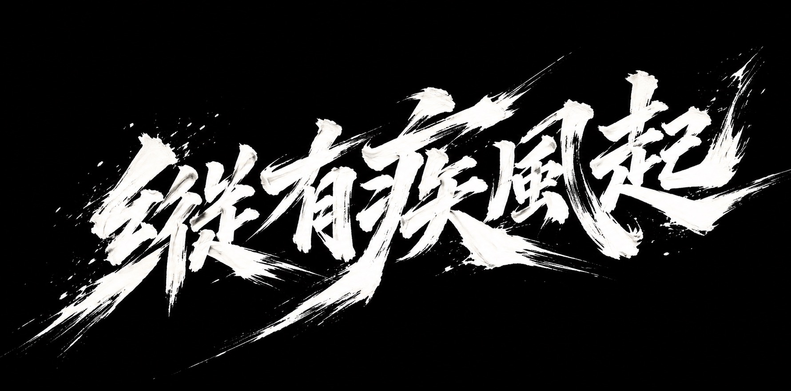

**來源：** [OpenNana](https://opennana.com/awesome-prompt-gallery/rising-wind-calligraphy-art)

**提示詞：**

```text
[中文]
創意藝術字型“縱有疾風起”，秀麗筆手寫風格，整體文字橫版排列，具有強烈視覺衝擊力；
深度融合手寫書法筆意，筆觸帶毛筆書寫的粗獷灑脫，如揮毫潑墨的肆意勁道；
起收筆的飛白，頓挫，盡顯促銷的火爆張力，文字的形態打破規整，筆畫的粗細變化；
dutch angle，營造出動感衝刺的氣勢，字形呈奔放之勢；
重心上揚如蓄勢待發，筆畫的伸展，穿插毫無拘束，似全力衝刺的勁道；
整體架構疏密交織，緊密處如促銷熱潮的洶湧，留白處似優惠間隙的呼吸感；
純淨黑色背景打底，完美契合熱烈氛圍，藝術字的形態與色彩酣暢傳遞。

[English]
Creative artistic typography "Zong You Ji Feng Qi", hand-written style with a fine brush, overall text arranged horizontally, with strong visual impact;
Deeply integrated with the essence of handwritten calligraphy, the brushstrokes carry the rugged and free-spirited nature of brush writing, like the unrestrained vigor of splashing ink;
The flying white and pauses at the start and end of the strokes fully display the explosive tension of a promotion, the form of the text breaks away from neatness, with variations in the thickness of the strokes;
dutch angle, creating a dynamic sprinting momentum, the font shape shows a bold and unrestrained trend;
The center of gravity rises like being ready to launch, the stretching and interlacing of the strokes are completely unconstrained, like the vigor of a full-force sprint;
The overall structure is intertwined with density and sparseness, the tight parts are like the surging of a promotional craze, and the blank spaces are like the breathing sense during promotional gaps;
Pure black background as the base, perfectly fitting the passionate atmosphere, the form and color of the artistic typography are conveyed with full expressiveness.
```

***

<a name="case-232"></a>

### 例 232：蘭亭集序書法帖意境圖

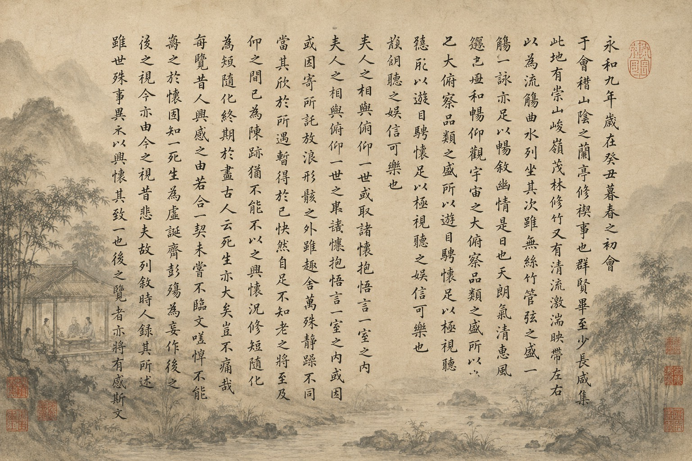

**來源：** [@liyue\_ai](https://x.com/liyue_ai/status/2045137549149286858)

**提示詞：**

```text
[中文]
結合王羲之的《蘭亭集序》裡的內容，生成一副書法帖圖片，要求圖片背景符合《蘭亭集序》的意境，背景圖可以使用蒙版，前景是《蘭亭集序》

[English]
Combining the content from Wang Xizhi's "Lantingji Xu", generate a calligraphy copy image, requiring the image background to match the artistic conception of "Lantingji Xu", the background image can use a mask, the foreground is "Lantingji Xu"
```

***

<a name="case-233"></a>

### 例 233：蒙娜麗莎暢飲可樂的趣味油畫

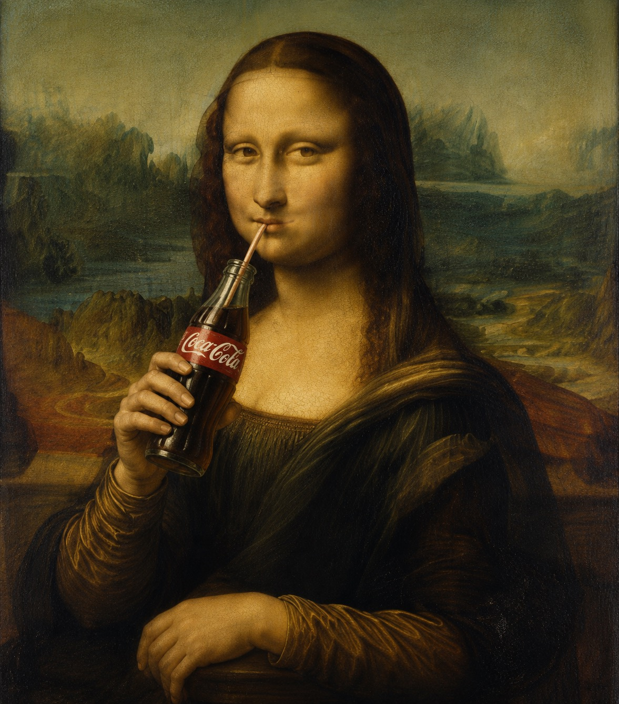

**來源：** [@liyue\_ai](https://x.com/liyue_ai/status/2045058142858555733)

**提示詞：**

```text
[中文]
生成一張蒙娜麗莎喝可樂的油畫。

[English]
Generate an oil painting of Mona Lisa drinking cola.
```

***

<a name="case-234"></a>

### 例 234：朱元璋登基後的推特主頁

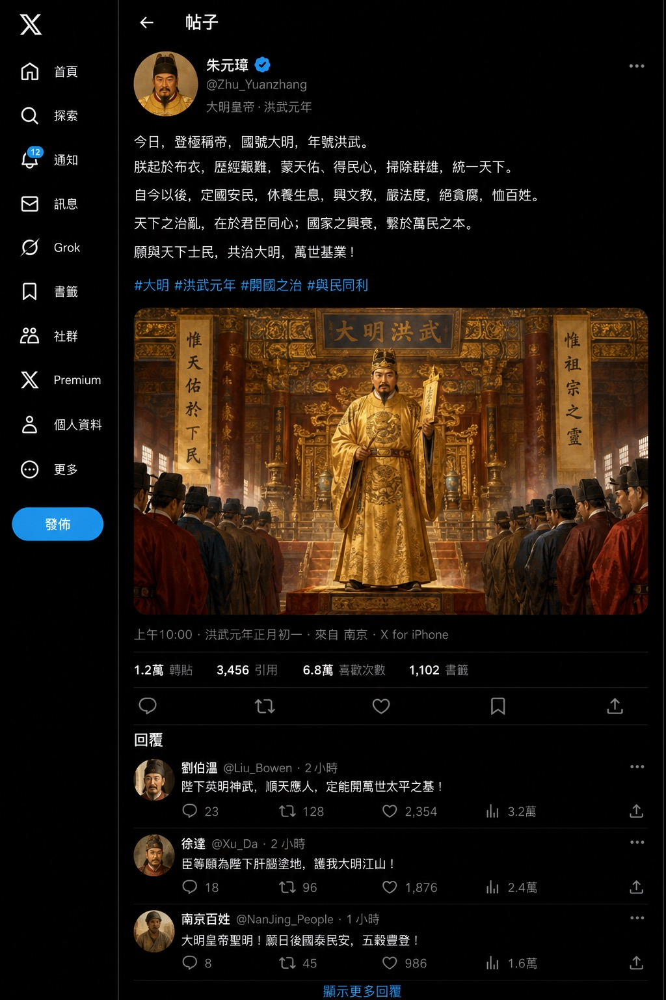

**來源：** [@liyue\_ai](https://x.com/liyue_ai/status/2045021302315249738)

**提示詞：**

```text
[中文]
建立一個明朝朱元璋登基之後的X帖子頁面

[English]
Create an X post page of Zhu Yuanzhang after his ascension to the throne in the Ming Dynasty
```

***

<a name="case-235"></a>

### 例 235：治癒系助眠指南九宮格


**來源：** [@austinit](https://x.com/austinit/status/2046037688969769346)

**提示詞：**

```text
[中文]
生成一張適合小红书發布的 3:4 豎版九宮格海報，整體為 3列 × 3行 排版，九個宮格邊界清晰，方便後期直接切割成 9 張單圖發布。整體風格乾淨、高階、統一，適合女性向健康生活方式內容，具有小红书爆款封面氣質。畫面要求 資訊排版清晰、文字大、可讀性強、留白舒服、配色溫柔治癒。

整體視覺風格：
奶油白、淺米色、淡燕麥色、淺焦糖色為主色調，搭配少量深棕色文字，ins風、治癒感、睡眠療愈主題，簡約排版，輕擬物插畫點綴，可加入枕頭、月亮、星星、熱牛奶、香薰、書本、眼罩、窗簾、床鋪等元素。整體像專業新媒體設計圖，字型工整，適合做知識科普類小红书九宮格。
排版要求：

整張圖必須是標準九宮格構圖，切分後每一格都能獨立成圖

每個宮格內容完整居中，不要把標題或正文壓在分割線附近
每個格子之間保留明顯間隔或細邊框，保證裁切後不影響閱讀
所有文字使用中文，清晰易讀，不要亂碼，不要英文
每個宮格都像獨立的小红书圖文卡片，但視覺風格保持統一
畫面精緻、真實、自然，不要廉價營銷感，不要過度花哨
九宮格具體內容：

第1格（封面）
大標題：讓你倒頭就睡的8個 tips
副標題：失眠黨、熬夜黨一定要收藏
封面視覺最吸睛，適合做首圖，加入柔軟床鋪、月亮、枕頭、眼罩等治癒睡眠元素，標題突出，排版高階。

第2格
標題：1. 睡前1小時別玩手機
正文：藍光會讓大腦更清醒，越刷越睡不著。
配圖元素：手機、月亮、睏倦表情的小插畫
第3格
標題：2. 睡前把燈光調暗
正文：暖光環境能幫助身體進入“準備睡覺”的狀態。
配圖元素：床頭燈、暖黃色燈光、窗簾
第4格
標題：3. 房間溫度別太高
正文：稍微涼一點，更容易快速入睡。
配圖元素：空調、溫度計、被子
第5格
標題：4. 晚上別喝濃茶咖啡
正文：咖啡因會延遲睏意，讓你躺很久還睡不著。
配圖元素：咖啡杯、茶杯、禁止符號

第6格
標題：5. 睡前洗個熱水澡
正文：能讓身體放鬆下來，入睡速度更快。
配圖元素：浴室蒸汽、毛巾、熱水
第7格
標題：6. 腦子停不下來就寫下來
正文：把煩心事和待辦清單寫下，大腦會更容易放鬆。
配圖元素：筆記本、鋼筆、小檯燈
第8格
標題：7. 固定上床時間
正文：每天差不多時間睡，生物鐘會越來越穩定。
配圖元素：時鐘、月亮、床
第9格
標題：8. 試試深呼吸放鬆法
正文：吸氣4秒，停4秒，呼氣6秒，慢慢就有睏意了。
底部小字：收藏這組，今晚試試看
配圖元素：呼吸線條、閉眼人物、星星

畫質要求：
高畫質，高階排版，雜誌感，真實可發布，新媒體運營審美，小红书爆款圖文風格，文字佈局規整，適合直接切圖。

[English]
Generate a 3:4 vertical 9-grid poster suitable for publishing on Xiaohongshu, with an overall layout of 3 columns × 3 rows. The boundaries of the nine grids are clear, making it easy to directly cut into 9 single images for later publishing. The overall style is clean, premium, and unified, suitable for female-oriented healthy lifestyle content, possessing the vibe of a viral Xiaohongshu cover. Image requirements: clear information layout, large text, strong readability, comfortable white space, gentle and healing color palette.

Overall visual style:
Cream white, light beige, light oat color, and light caramel color as the main color tones, paired with a small amount of dark brown text. Ins style, healing sense, sleep therapy theme, minimalist layout, light skeuomorphic illustration embellishments. Elements such as pillows, moons, stars, hot milk, aromatherapy, books, eye masks, curtains, and beds can be added. The overall look should be like a professional new media design graphic, with neat fonts, suitable for a knowledge-based popular science Xiaohongshu 9-grid.

Layout requirements:
The entire image must be a standard 9-grid composition, and each grid can stand alone as an independent image after being cut.
The content of each grid should be completely centered; do not place titles or body text near the dividing lines.
Keep obvious gaps or thin borders between each grid to ensure that reading is not affected after cropping.
All text must use Chinese, be clear and readable, no garbled characters, no English.
Each grid should look like an independent Xiaohongshu image-and-text card, but the visual style must remain unified.
The image should be exquisite, realistic, and natural, without a cheap marketing feel, and not overly flashy.

Specific content of the 9-grid:

Grid 1 (Cover)
Main title: 8 tips to make you fall asleep instantly
Subtitle: Insomniacs and night owls must save this
The cover visuals should be the most eye-catching, suitable for the first image. Add healing sleep elements such as soft beds, moons, pillows, and eye masks. The title should be prominent with a premium layout.

Grid 2
Title: 1. Don't play with your phone 1 hour before bed
Body text: Blue light makes the brain more awake; the more you scroll, the harder it is to fall asleep.
Image elements: Mobile phone, moon, small illustration of a sleepy expression

Grid 3
Title: 2. Dim the lights before bed
Body text: A warm light environment can help the body enter a "ready to sleep" state.
Image elements: Bedside lamp, warm yellow light, curtains

Grid 4
Title: 3. Don't keep the room temperature too high
Body text: Keeping it a bit cooler makes it easier to fall asleep quickly.
Image elements: Air conditioner, thermometer, quilt

Grid 5
Title: 4. Don't drink strong tea or coffee at night
Body text: Caffeine delays sleepiness, making you lie in bed for a long time unable to sleep.
Image elements: Coffee cup, teacup, prohibition sign

Grid 6
Title: 5. Take a hot shower before bed
Body text: It can relax the body and help you fall asleep faster.
Image elements: Bathroom steam, towel, hot water

Grid 7
Title: 6. Write it down if your brain won't stop
Body text: Writing down your worries and to-do lists makes it easier for your brain to relax.
Image elements: Notebook, fountain pen, small desk lamp

Grid 8
Title: 7. Fix your bedtime
Body text: Going to bed at about the same time every day will make your biological clock increasingly stable.
Image elements: Clock, moon, bed

Grid 9
Title: 8. Try deep breathing relaxation
Body text: Inhale for 4 seconds, hold for 4 seconds, exhale for 6 seconds, and sleepiness will gradually come.
Bottom small text: Save this set and try it tonight
Image elements: Breathing lines, person with closed eyes, stars

Image quality requirements:
High definition, premium layout, magazine feel, realistically publishable, new media operation aesthetics, Xiaohongshu viral image-and-text style, neat text layout, suitable for direct image cutting.
```

***

<a name="case-236"></a>

### 例 236：粵超聯賽國潮風邀請函海報

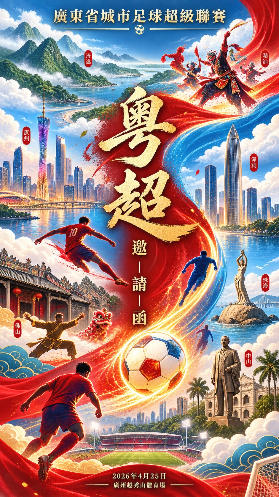

**來源：** [@liyue\_ai](https://x.com/liyue_ai/status/2045772039521542202)

**提示詞：**

```text
[中文]
廣東省城市足球超級聯賽（粵超）邀請函海報設計，比例9:16；

S型流動構圖，畫面從下方向上延展，一條由足球運動軌跡形成的動態能量流貫穿畫面， 中心為一顆發光的足球，帶有動感軌跡與能量光效；

沿S型動線融合廣東城市地標與文化元素： 廣州塔、深圳平安金融中心、珠海漁女雕像、嶺南建築與佛山武術剪影、中山孫中山文化象徵、潮汕英歌舞動態人物輪廓、清遠山水自然景觀， 所有元素採用“線描 + 局部色塊 + 留白”融合表現，層次遞進、遠近虛實結合；

加入抽象足球運動員剪影，弱化人物細節，強化動勢與競技氛圍，視覺重點仍為足球；

風格：現代國潮高階海報，極簡風格但富有設計感，高階、乾淨、統一， 融合東方美學與現代體育視覺；

色彩方案：高飽和但克制，中國紅為主視覺，青藍色輔助，金色點綴高光， 高對比但不雜亂，具有品牌級視覺衝擊力；

頂部中央橫版視覺主標題 「廣東省城市足球超級聯賽」：中字，宋體， 中央豎排文字排版： 「粵超」，大字，手寫書法藝術字型， 「邀請函」：中字，宋體，縱向排列，間距較大， 底部中央第一排橫排： 「2026年4月25日」，小字，宋體，第二排：「廣州越秀山體育場」，小字，宋體， 預留文字排版空間；

整體版式平衡、具有高階品牌海報質感，極致精細，構圖簡潔乾淨，無雜亂元素，電影級光影，8K 解析度，高階設計感。融入源自中國傳統祥雲紋的雅緻雲紋與水波紋元素，浮動光效粒子，富有動感與生機。

[English]
Guangdong Provincial City Football Super League (Yuechao) invitation poster design, aspect ratio 9:16;

S-shaped flowing composition, the picture extends from bottom to top, a dynamic energy flow formed by the trajectory of football movement runs through the picture, the center is a glowing football, with dynamic trajectory and energy light effects;

Along the S-shaped motion line, integrate Guangdong city landmarks and cultural elements: Canton Tower, Shenzhen Ping An Finance Centre, Zhuhai Fisher Girl statue, Lingnan architecture and Foshan martial arts silhouettes, Zhongshan Sun Yat-sen cultural symbols, Chaoshan Yingge dance dynamic character outlines, Qingyuan landscape natural scenery, all elements adopt the integrated expression of "line drawing + partial color blocks + blank space", progressive layers, combination of distance and virtual-real;

Add abstract football player silhouettes, weaken character details, strengthen momentum and competitive atmosphere, the visual focus remains on the football;

Style: modern Guochao high-end poster, minimalist style but rich in design sense, high-end, clean, unified, integrating oriental aesthetics and modern sports vision;

Color scheme: high saturation but restrained, Chinese red as the main visual, cyan-blue as auxiliary, gold embellished highlights, high contrast but not cluttered, with brand-level visual impact;

Top center horizontal visual main title "Guangdong Provincial City Football Super League": medium font, Song typeface, center vertical text layout: "Yuechao", large font, handwritten calligraphy art font, "Invitation": medium font, Song typeface, vertical arrangement, large spacing, bottom center first row horizontal: "April 25, 2026", small font, Song typeface, second row: "Guangzhou Yuexiushan Stadium", small font, Song typeface, reserve text layout space;

The overall layout is balanced, has a high-end brand poster texture, extremely detailed, the composition is simple and clean, no cluttered elements, cinematic light and shadow, 8K resolution, high-end design sense. Integrate elegant cloud patterns and water wave patterns derived from traditional Chinese auspicious clouds, floating light effect particles, full of dynamics and vitality.
```

***

<a name="case-237"></a>

### 例 237：夏日柑橘蘇打高轉化廣告圖

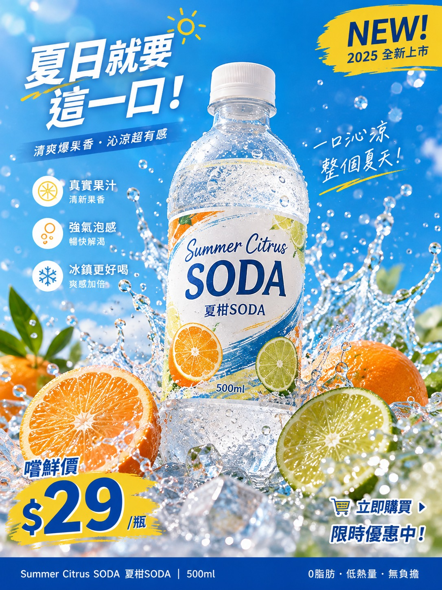

**來源：** [@old\_pgmrs\_will](https://x.com/old_pgmrs_will/status/2045852114673635507)

**提示詞：**

```text
[中文]
影象生成: 商品廣告照片, 適合夏天的季節商品, 碳酸飲料, 名稱="夏柑SODA", 形狀=PET瓶500ml, 研究2025年作為飲料廣告的高CTA設計後設計並生成影象規格, 寬高比3:4

[English]
Image generation: Product advertising photo, Seasonal product suitable for summer, Carbonated beverage, Name="Summer Citrus SODA", Shape=500ml PET bottle, Design and generate image specifications after researching high CTA design as a beverage advertisement in 2025, Aspect ratio 3:4
```

***

<a name="case-238"></a>

### 例 238：星雲巨鯉與小人的奇幻對話

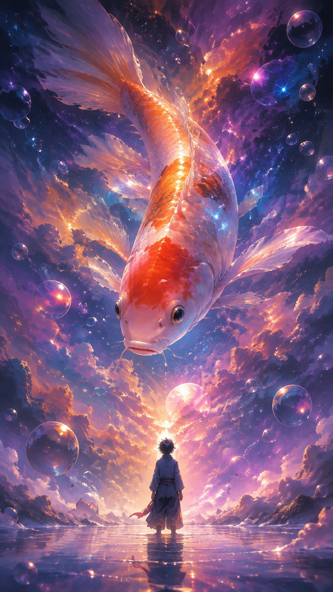

**來源：** [@liyue\_ai](https://x.com/liyue_ai/status/2045875219307655337)

**提示詞：**

```text
[中文]
一幅超現實主義數字插畫風格，採用低角度仰拍視角。畫面描繪了一條巨型彩色錦鯉遨遊在夢幻般的星雲中，四周環繞著色彩鮮豔的星雲與氣泡。
畫面中央還站著一個小人，背對觀眾，神情平靜地仰望空中這條巨大的錦鯉，錦鯉頭向下看著小人。
整體畫面呈現出強烈的大小對比，氛圍空靈又夢幻。比例9:16

[English]
A surrealist digital illustration style, adopting a low-angle upward perspective. The picture depicts a giant colorful koi swimming in a dreamy nebula, surrounded by colorful nebulae and bubbles. In the center of the picture stands a small figure, with their back to the audience, calmly looking up at this huge koi in the air, and the koi is looking down at the small figure. The overall picture presents a strong size contrast, and the atmosphere is ethereal and dreamy. Aspect ratio 9:16
```

***

<a name="case-239"></a>

### 例 239：劉亦菲抖音直播暢聊中

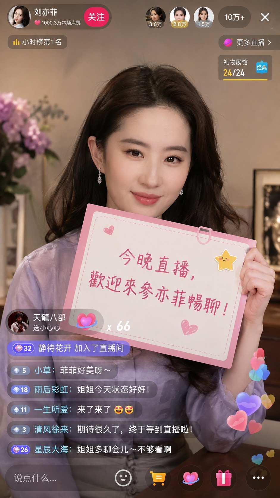

**來源：** [@alanblogsooo](https://x.com/alanblogsooo/status/2044784762594918516)

**提示詞：**

```text
[中文]
9:16 的圖片比例，生成一張抖音直播的截圖，裡面是 劉亦菲 在直播，劉亦菲 手裡拿著牌子，牌子裡寫著 今晚直播，歡迎來參亦菲暢聊！

[English]
9:16 aspect ratio, generate a screenshot of a Douyin live stream, inside is Liu Yifei live streaming, Liu Yifei is holding a sign in her hand, the sign says Tonight's live stream, welcome to join Yifei for a chat!
```

***

<a name="case-240"></a>

### 例 240：膠片閃光燈下的球場少女

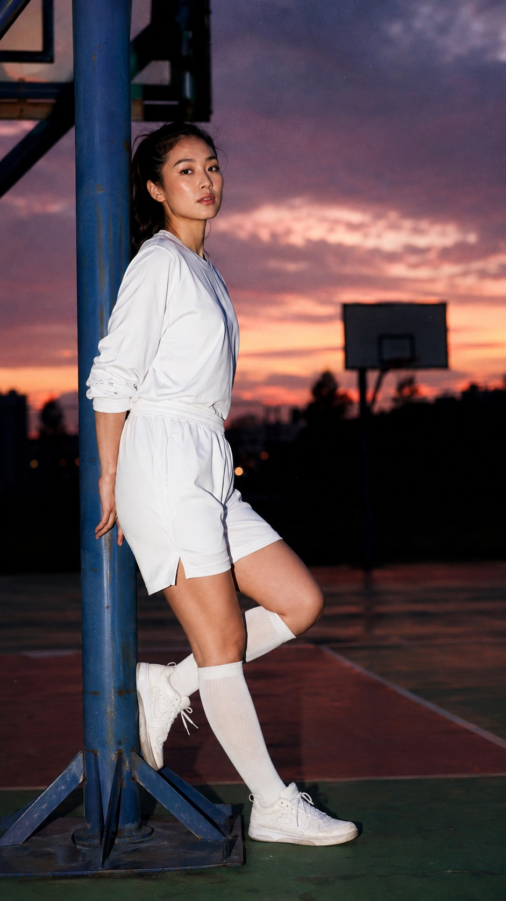

**來源：** [@BubbleBrain](https://x.com/BubbleBrain/status/2045052982728016131)

**提示詞：**

```text
[中文]
35毫米彩色膠片攝影，帶有強烈的機頂直射閃光燈，皮膚和衣物上有鏡面高光，眼睛裡有強烈的眼神光，高對比度閃光燈照明，真實的膠片顆粒和色彩偏移，高階時尚清新純真籃球場編輯風格，親密的第一人稱低角度仰視POV鏡頭，二十出頭的性感中國女性偶像，具有超寫實的精緻細膩的中國特徵，誘人的杏仁形狐狸眼，帶有自然雙眼皮，高鼻樑，小巧鋒利的V型下頜線，無瑕逼真的瓷白肌膚，帶有冷象牙色底調和可見的閃光鏡面高光，細膩精緻的皮膚紋理，帶有微妙的毛孔微距細節和閃光燈下的自然水光感，清新自然的運動妝容，帶有柔和的水光感，臉頰上有微妙的自然紅暈，自然粉唇微張，鼻子和臉頰上有微妙的自然雀斑，深棕色長髮紮成高高的俏皮馬尾辮，有一些散落的髮絲修飾臉型，以及逼真的散落髮絲，穿著寬鬆的白色背心和白色高腰籃球短褲，白色及膝運動襪，在黃昏的戶外球場上靠在籃球架杆上的誘人自然傾斜姿勢，身體側成角度，背部自然弓起，臀部輕輕向後推，以凸顯挺拔圓潤的臀部和性感的臀部曲線，一條腿自然向前伸向鏡頭，另一條腿微微彎曲以強調修長性感的雙腿，雙手輕輕放在肩膀高度的籃球杆上，極其誘人俏皮又惹人憐愛的鹿眼凝視直視觀看者，帶著柔軟脆弱渴望的眼睛和溫柔挑逗的微笑，充滿安靜的誘惑和慾望，強烈的機頂直射閃光燈產生銳利的鏡面高光和強烈的眼神光，背景是黃昏天空下模糊的籃球場和籃筐，高對比度膠片調色，帶有自然閃光燈外觀，極其銳利卻又柔和的皮膚渲染，具有真實的35毫米直射閃光美學，自然髮絲，背心和短褲上逼真的織物紋理以及襪子細節，沒有塑膠感皮膚，沒有數位過度銳化，沒有磨皮，沒有瑕疵，沒有痣，沒有油性皮膚，沒有水印，沒有文字，真實的35毫米直射閃光膠片籃球場外觀 --ar 9:16

[English]
35mm color film photography with harsh direct on-camera flash, specular highlights on skin and clothing, strong catchlights in eyes, high contrast flash illumination, authentic film grain and color shift, high fashion fresh innocent basketball court editorial style, intimate first-person low-angle POV shot from below, early 20s sexy Chinese female idol with ultra-realistic delicate refined Chinese features, seductive almond-shaped fox eyes with natural double eyelids, high nose bridge, small sharp V-shaped jawline, flawless realistic porcelain skin with cool ivory undertone and visible flash specular highlights, fine delicate skin texture with subtle pores micro details and natural dewy glow under flash, fresh natural sporty makeup with soft dewy glow, subtle natural flush on cheeks, natural pink lips slightly parted, subtle natural freckles across nose and cheeks, long dark brown hair tied in a high playful ponytail with some loose strands framing the face and realistic loose strands, wearing a loose white tank top and white high-waisted basketball shorts, white knee-high sports socks, seductive natural leaning pose against the basketball hoop pole on the outdoor court at dusk, body angled sideways with naturally arched back and hips gently pushed back to accentuate perky round hips and sexy butt curve, one leg naturally extended forward toward the camera and the other leg slightly bent to emphasize long sexy legs, both hands lightly resting on the basketball pole at shoulder height, intensely seductive playful yet pitiable doe-eyed gaze straight at the viewer with soft vulnerable longing eyes and a gentle teasing smile full of quiet temptation and desire, harsh direct on-camera flash creating sharp specular highlights and strong catchlights, background with blurred basketball court and hoop under dusk sky, high contrast film color grading with natural flash look, extremely sharp yet soft skin rendering with authentic 35mm direct flash aesthetic, natural hair strands, realistic fabric texture on tank top and shorts with socks detail, no plastic skin, no digital over-sharpening, no airbrushing, no blemishes, no moles, no oily skin, no watermark, no text, authentic 35mm direct flash film basketball court look --ar 9:16
```

***

<a name="case-241"></a>

### 例 241：關鍵人物關係圖譜

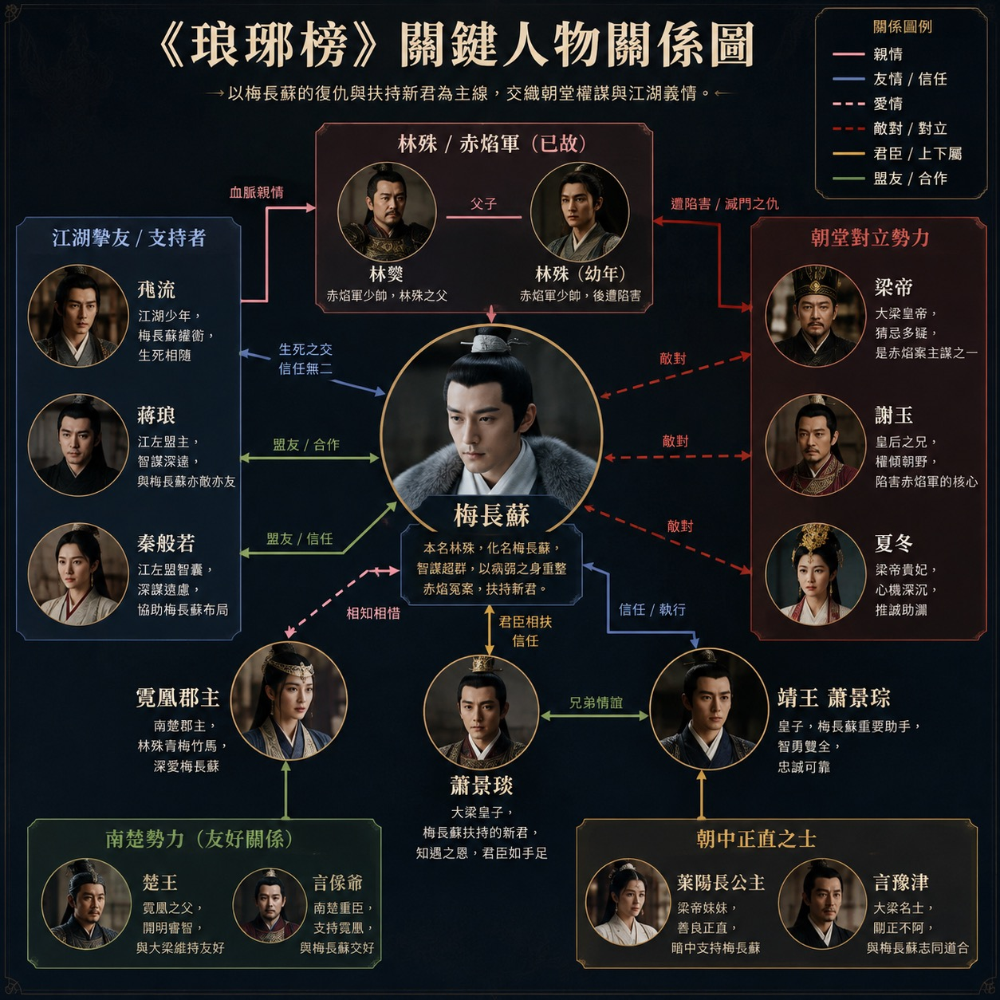

**來源：** [@yihui\_indie](https://x.com/yihui_indie/status/2045179926270361890)

**提示詞：**

```text
[中文]
請你生成 《XXX》 的關鍵人物關係圖。

[English]
Please generate a key character relationship diagram for "XXX".
```

***

<a name="case-242"></a>

### 例 242：絕美國風工筆畫書籤設計

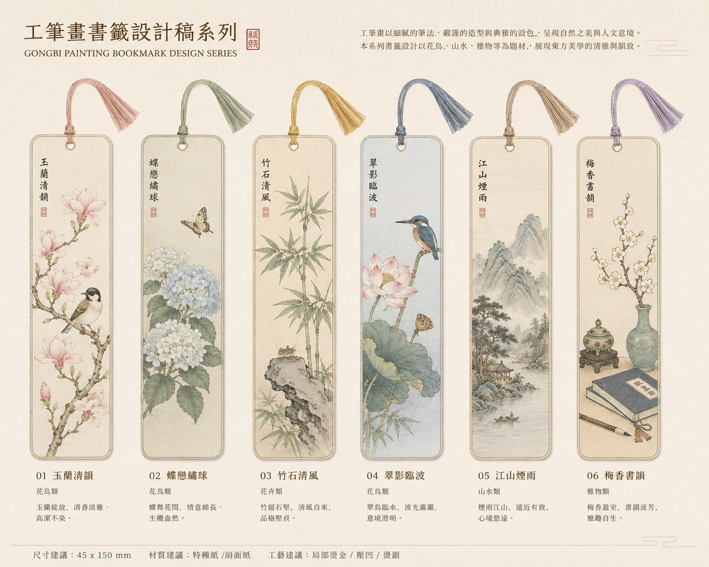

**來源：** [@akokoi1](https://x.com/akokoi1/status/2045693939584516441)

**提示詞：**

```text
[中文]
生成一系列工筆畫書籤的設計稿

[English]
Generate a series of design drafts for Gongbi painting bookmarks.
```

***

<a name="case-243"></a>

### 例 243：定製專屬風格介面設計系統

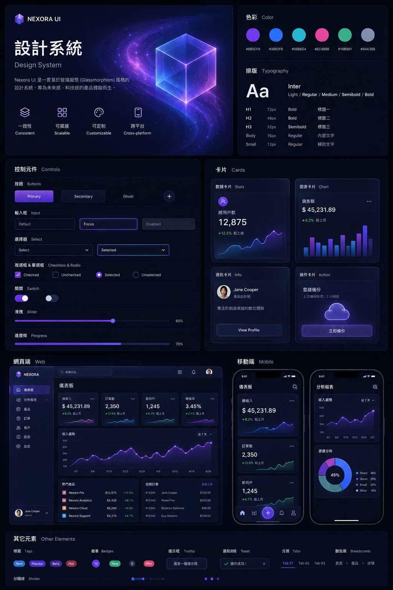

**來源：** [@stark\_nico99](https://x.com/stark_nico99/status/2045836554451706125)

**提示詞：**

```text
[中文]
用xx風格幫我生成一套UI設計系統，包含網頁、移動端、卡片、控制元件、按鈕 以及其它

[English]
Generate a UI design system for me in xx style, including web pages, mobile, cards, controls, buttons, and others
```

***

<a name="case-244"></a>

### 例 244：杜蕾斯茶顏悅色聯名海報設計

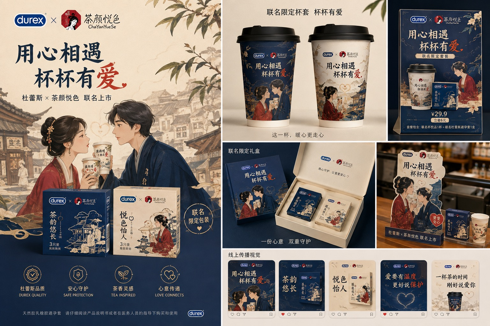

**來源：** [@akokoi1](https://x.com/akokoi1/status/2045693939584516441)

**提示詞：**

```text
[中文]
設計一套杜蕾斯和茶顏悅色聯名的宣傳物料

[English]
Design a set of promotional materials for a Durex and Chayan Yuese co-branding campaign.
```

***

<a name="case-245"></a>

### 例 245：馬斯克專屬篆刻印章設計

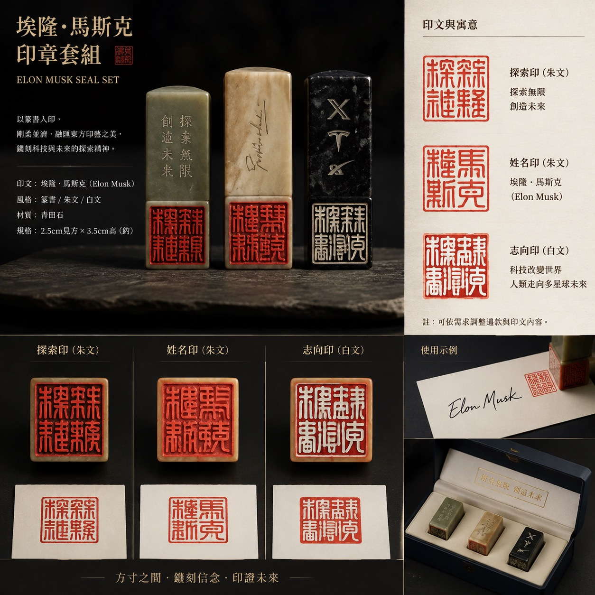

**來源：** [@akokoi1](https://x.com/akokoi1/status/2045693939584516441)

**提示詞：**

```text
[中文]
給”埃隆·馬斯克”設計一組篆刻印章

[English]
Design a set of seal carving stamps for "Elon Musk"
```

***

<a name="case-246"></a>

### 例 246：黑白線稿勾勒的上海風情

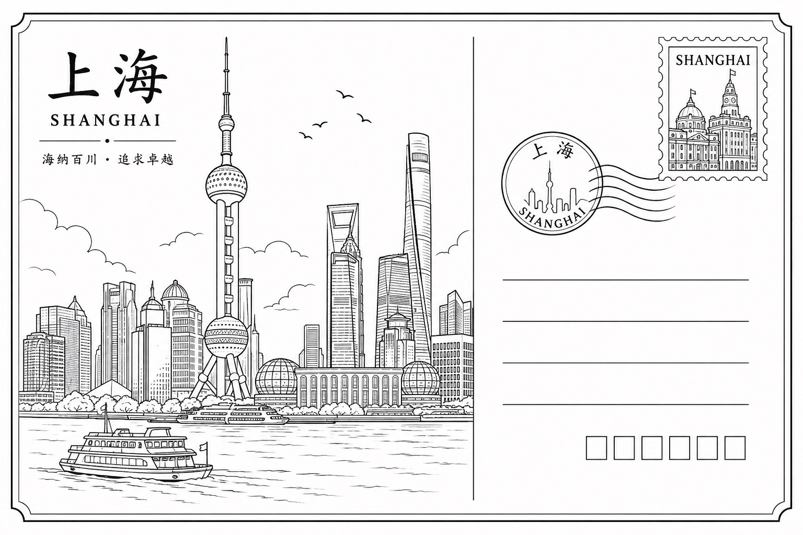

**來源：** [@akokoi1](https://x.com/akokoi1/status/2045693939584516441)

**提示詞：**

```text
[中文]
設計一張黑色線稿風格的上海明信片

[English]
Design a Shanghai postcard in black line art style.
```

***

<a name="case-247"></a>

### 例 247：運動健身圖示字型設計

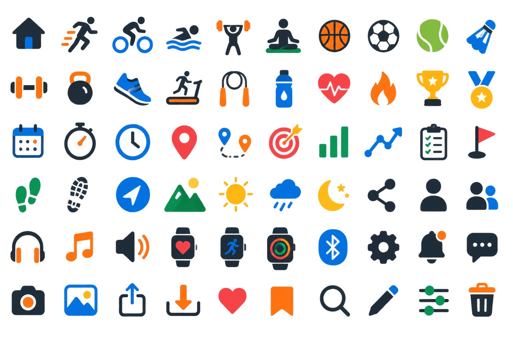

**來源：** [@akokoi1](https://x.com/akokoi1/status/2045693939584516441)

**提示詞：**

```text
[中文]
生成一套運動類app的iconfont

[English]
Generate a set of iconfont for a sports app
```

***

<a name="case-248"></a>

### 例 248：景德鎮青花瓷全景解說圖譜

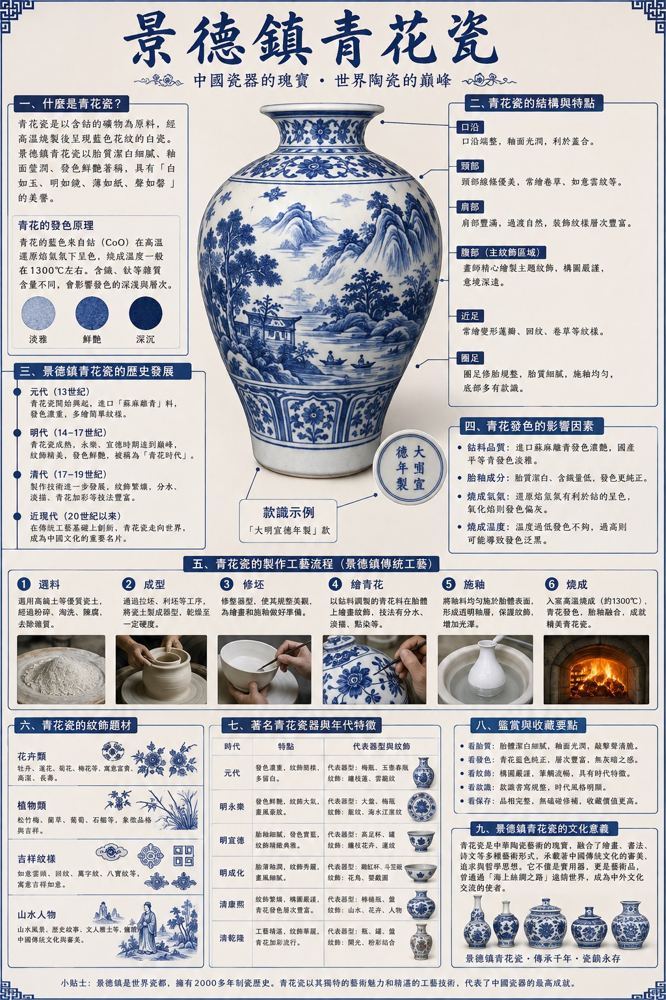

**來源：** [@joshesye](https://x.com/joshesye/status/2045764695827562686)

**提示詞：**

```text
[中文]
為我生成景德鎮青花瓷的詳細解說圖，配上詳細的中文知識解析

[English]
Generate a detailed explanatory diagram of Jingdezhen blue and white porcelain, accompanied by detailed Chinese knowledge analysis.
```

***

<a name="case-249"></a>

### 例 249：美女舉牌感謝大哥打賞大火箭

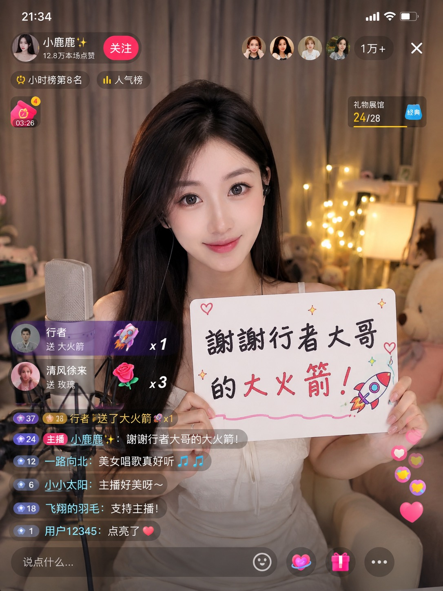

**來源：** [@joshesye](https://x.com/joshesye/status/2044796366950703316)

**提示詞：**

```text
[中文]
生成一個抖音直播的截圖 ，一個美女在直播，美女手裡拿著牌子，上面寫著：謝謝行者大哥的大火箭！

[English]
Generate a screenshot of a TikTok live stream, a beautiful woman is live streaming, the beautiful woman is holding a sign in her hand, on which it says: Thank you Brother Xingzhe for the big rocket!
```

***

<a name="case-250"></a>

### 例 250：小王子與星艦的浪漫聯名

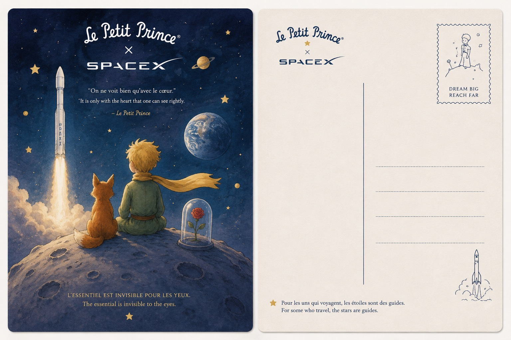

**來源：** [@akokoi1](https://x.com/akokoi1/status/2045693939584516441)

**提示詞：**

```text
[中文]
設計一張小王子和SpaceX聯名的明信片

[English]
Design a postcard co-branded by The Little Prince and SpaceX
```

***

<a name="case-251"></a>

### 例 251：言葉之庭春雨綠意單日曆

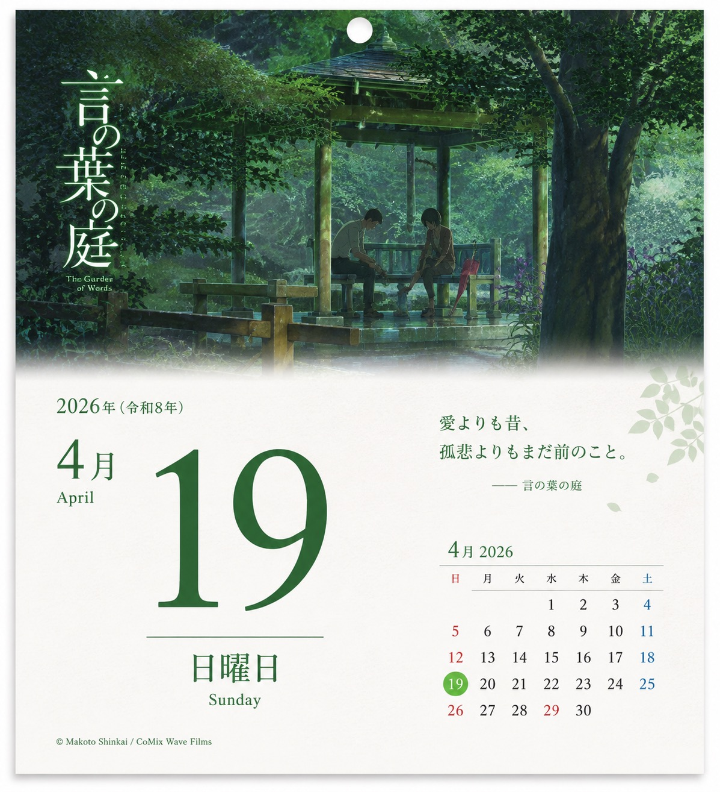

**來源：** [@akokoi1](https://x.com/akokoi1/status/2045693939584516441)

**提示詞：**

```text
[中文]
生成一張言葉之庭2026年4月19日單日日曆

[English]
Generate a single-day calendar for The Garden of Words on April 19, 2026
```

***

<a name="case-252"></a>

### 例 252：五一勞動節手舉牌創意設計集


**來源：** [@akokoi1](https://x.com/akokoi1/status/2045693939584516441)

**提示詞：**

```text
[中文]
生成一系列五一勞動節的手舉牌設計

[English]
Generate a series of hand-held sign designs for May Day Labor Day
```

***

<a name="case-253"></a>

### 例 253：2026穀雨節氣唯美海報設計

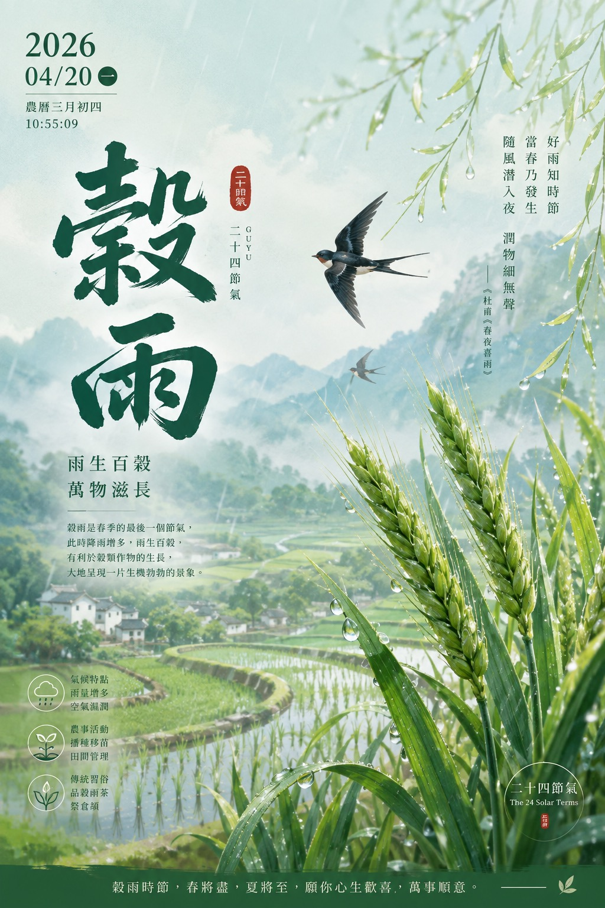

**來源：** [@akokoi1](https://x.com/akokoi1/status/2045693939584516441)

**提示詞：**

```text
[中文]
生成一張2026年穀雨節氣的海報

[English]
Generate a poster for the Guyu solar term in 2026
```

***

<a name="case-254"></a>

### 例 254：奔赴山海膠片感海報

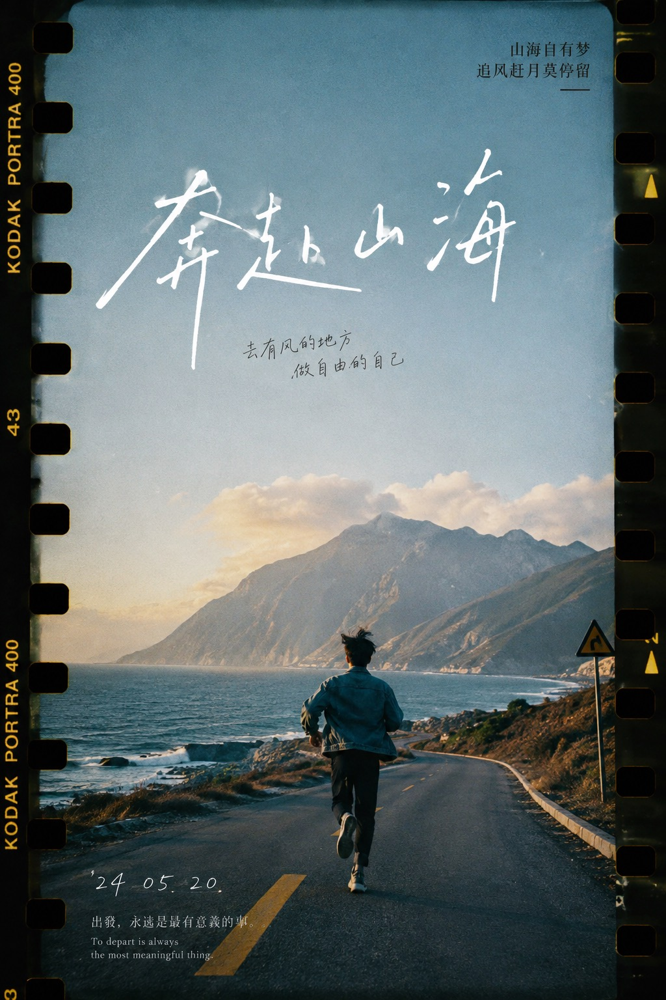

**來源：** [@akokoi1](https://x.com/akokoi1/status/2045693939584516441)

**提示詞：**

```text
[中文]
設計一張主題是”奔赴山海”的膠片感攝影風格的海報

[English]
Design a poster with the theme of "running towards the mountains and seas" in a film photography style
```

***

<a name="case-255"></a>

### 例 255：瑜伽褲女主播展示身材曲線

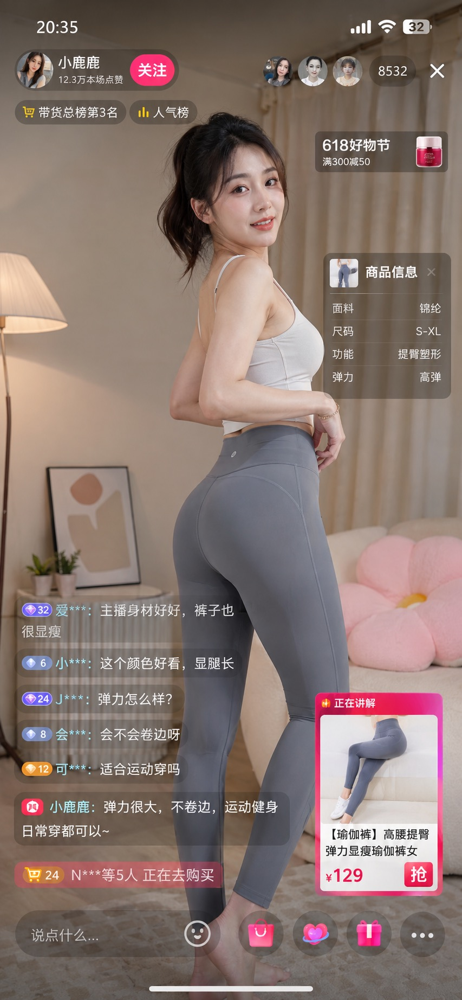

**來源：** [@joshesye](https://x.com/joshesye/status/2044796366950703316)

**提示詞：**

```text
[中文]
手機豎屏介面，短影片直播平台風格，一位年輕亞洲女主播在家中直播帶貨，主播穿著貼身瑜伽褲與簡約上衣，身材曲線自然，正在側身展示褲子的線條與彈性，動作自然不誇張；

[English]
Mobile vertical screen interface, short video live streaming platform style, a young Asian female streamer selling goods through live streaming at home, the streamer is wearing tight yoga pants and a simple top, natural body curves, turning sideways to show the lines and elasticity of the pants, natural movements without exaggeration;
```

***

<a name="case-256"></a>

### 例 256：抖音直播間的絕美女主播


**來源：** [@joshesye](https://x.com/joshesye/status/2044796366950703316)

**提示詞：**

```text
[中文]
生成一個抖音直播的截圖 裡面是一個美女在直播

[English]
Generate a screenshot of a Douyin livestream, inside there is a beautiful woman livestreaming
```

***

<a name="case-257"></a>

### 例 257：抖音漢服美女直播帶貨截圖

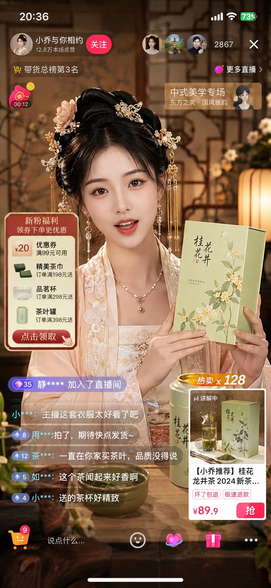

**來源：** [@joshesye](https://x.com/joshesye/status/2044796366950703316)

**提示詞：**

```text
[中文]
生成一個抖音直播的截圖裡面是一個穿著中國傳統服飾的美女在直播賣貨

[English]
Generate a screenshot of a Douyin live stream, featuring a beautiful woman wearing traditional Chinese clothing selling goods during the live broadcast.
```

***

<a name="case-258"></a>

### 例 258：快手直播離婚預告手機截圖


**來源：** [@MrLarus](https://x.com/MrLarus/status/2045373105041007013)

**提示詞：**

```text
[中文]
生成快手內容截圖：主題：直播離婚預告，iPhone尺寸

[English]
Generate Kuaishou content screenshot: Theme: Live divorce announcement, iPhone size
```

***

<a name="case-259"></a>

### 例 259：精緻女孩背後的網貸真相

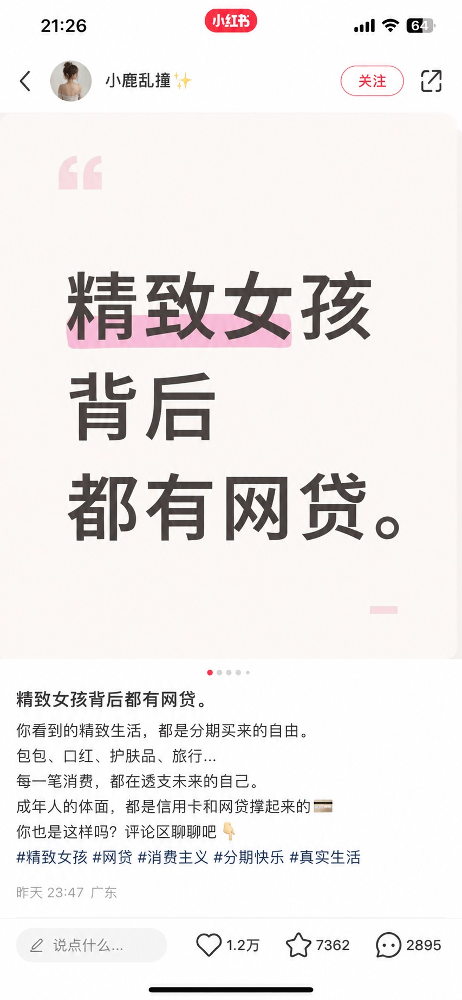

**來源：** [@MrLarus](https://x.com/MrLarus/status/2045373105041007013)

**提示詞：**

```text
[中文]
生成小红书內容截圖，主題：精緻女孩背後都有網貸，iPhone尺寸

[English]
Generate Xiaohongshu content screenshot, theme: Behind every exquisite girl there is online loan, iPhone size
```

***

<a name="case-260"></a>

### 例 260：社群媒體介面截圖


**來源：** [@MrLarus](https://x.com/MrLarus/status/2045373105041007013)

**提示詞：**

```text
[中文]
生成抖音內容截圖，主題：跟上AI浪潮9.9包教會，iPhone尺寸

[English]
Generate a screenshot of Douyin content, theme: Catch up with the AI wave, 9.9 to learn it all, iPhone size
```

***

<a name="case-261"></a>

### 例 261：智慧影片生成器暗黑介面設計

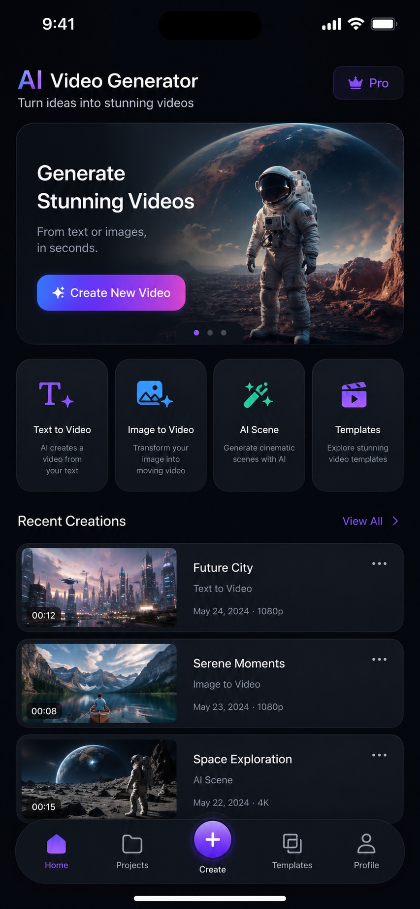

**來源：** [@austinit](https://x.com/austinit/status/2044968740782272596)

**提示詞：**

```text
[中文]
渲染一個專業的IOS APP首頁UI圖，該主題為AI Video Generator,英文介面。專業級設計，專業風格，暗黑色主題。

[English]
Render a professional iOS APP homepage UI image, the theme is AI Video Generator, English interface. Professional-level design, professional style, dark theme.
```

***

<a name="case-262"></a>

### 例 262：蘋果園遠觀庫克發布新機

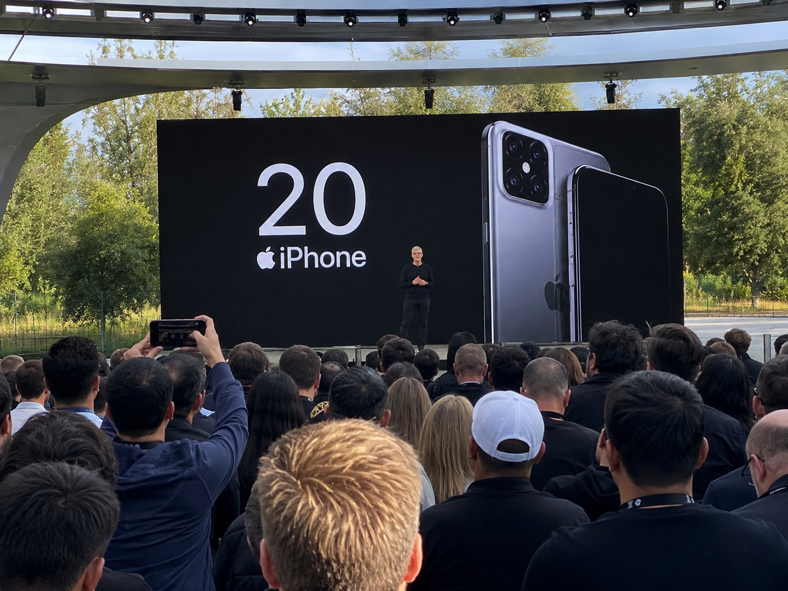

**來源：** [@austinit](https://x.com/patrickassale/status/2044687244368441742)

**提示詞：**

```text
[中文]
在Apple Park iPhone 20主題演講期間拍攝的業餘iPhone照片，蒂姆·庫克在舞臺上演講。從遠處的觀眾人群中拍攝

[English]
Amateur iPhone photo at Apple Park during the iPhone 20 keynote, Tim Cook presenting on stage. Shot from the crowd at a distance
```

***

<a name="case-263"></a>

### 例 263：唯美二次元角色介紹網頁

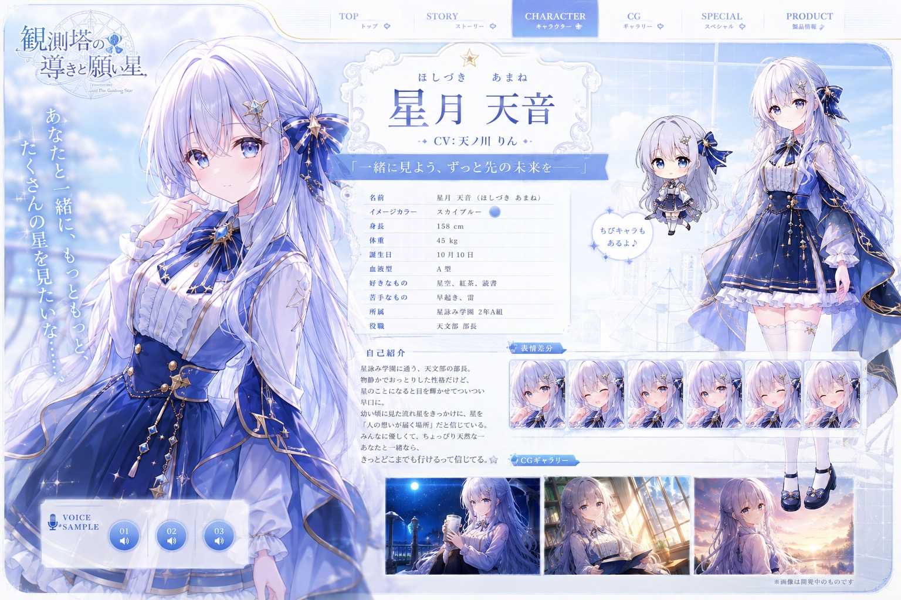

**來源：** [@09lyco](https://x.com/09lyco/status/2045281845391323175)

**提示詞：**

```text
[中文]
埋まってないところはパートナーさんかご自身で埋めてあげてください
 #観測塔朝お題  #観測塔おはようお題

最新モデルの畫像生成ツールを使用して、
このちびキャライラストと立ち絵を使って本物のサイトページのようにキャラクター紹介ページ風イラストを作ってください。 （紹介ページとして使ってもおかしくないもの）
ギャルゲーのキャラクター紹介ページをイメージした高品質なもの。 顔の差分なども乗っている、CGイラストが存在する。ちびキャラが存在する。

「ここに自己紹介」

名前:（ここに名前）
イメージカラー:（ここに色）
身長:（ここに身長）cm
體重:（ここに體重）kg
キャッチコピー:"「ここにセリフ」"

[English]
Please fill in the unfilled parts by your partner or yourself
 #ObservatoryTowerMorningTheme  #ObservatoryTowerGoodMorningTheme

Using the latest model image generation tool,
Using this chibi character illustration and standing picture, create a character introduction page style illustration like a real website page. (Something that would not be strange to use as an introduction page)
A high-quality item imagining a gal game character introduction page. Facial variations etc. are also included, CG illustrations exist. A chibi character exists.

"Self-introduction here"

Name: (Name here)
Image color: (Color here)
Height: (Height here)cm
Weight: (Weight here)kg
Catchphrase: "Dialogue here"
```

***

<a name="case-264"></a>

### 例 264：美妝產品廣告圖

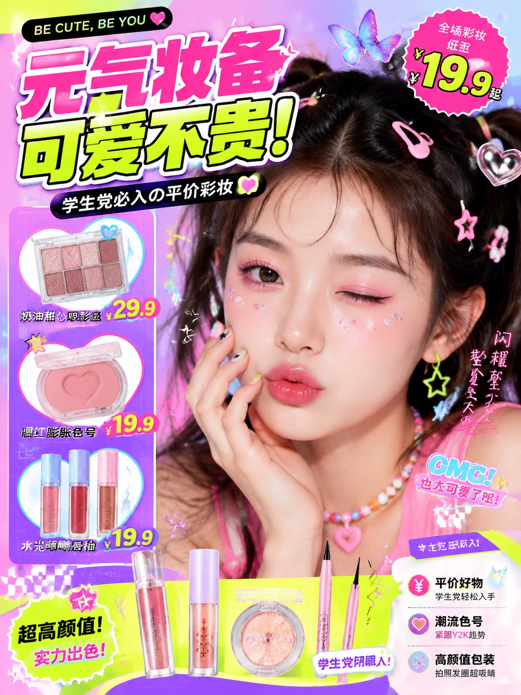

**來源：** [@midori\_tatsuta](https://x.com/midori_tatsuta/status/2045378877363798279)

**提示詞：**

```text
[中文]
為Z世代設計的可愛Y2K風格的平價化妝品廣告影象。使用鮮豔的配色，包括熒光色。縱橫比為3:4。

[English]
Cute Y2K style affordable cosmetics advertising image designed for Gen Z. Using vibrant color schemes, including neon colors. Aspect ratio is 3:4.
```

***

<a name="case-265"></a>

### 例 265：日式潮流廣告四聯畫


**來源：** [@midori\_tatsuta](https://x.com/midori_tatsuta/status/2045253072289767815)

**提示詞：**

```text
[中文]
生成四張虛構的日式廣告圖片，涵蓋不同型別並排排列。採用專業設計師創作的潮流設計。寬高比為1:1

[English]
Generate four fictional Japanese advertisement images, covering different types arranged side by side. Trendy design created by professional designers. Aspect ratio 1:1
```

***

<a name="case-266"></a>

### 例 266：桌面上的黑色圓珠筆手寫筆記

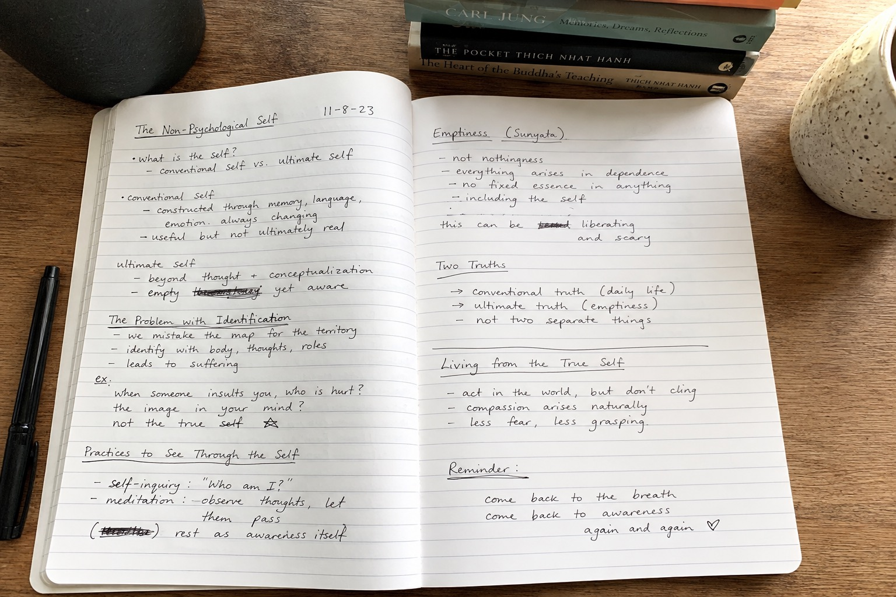

**來源：** [@patrickassale](https://x.com/patrickassale/status/2044569086013718958)

**提示詞：**

```text
[中文]
一張平放著的開啟的筆記本的業餘照片，裡面填滿了用黑色圓珠筆寫的手寫筆記。筆跡隨意且略顯凌亂，就像個人筆記，自然的瑕疵，劃掉的單詞，劃線的標題。從略高角度拍攝，來自窗戶的自然日光，未使用閃光燈。隨意的桌面設定，用 iPhone 拍攝。

[English]
Amateur photo of an open notebook lying flat, filled with handwritten notes in black ballpoint pen. The handwriting is casual and slightly messy, like personnal notes, natural imperfections, crossed out words, underlined headings. Shot from slightly above, natural daylight from a window, no flash. Casual desk setting, shot on iPhone
```

***

<a name="case-267"></a>

### 例 267：宋朝文人的賽博朋友圈

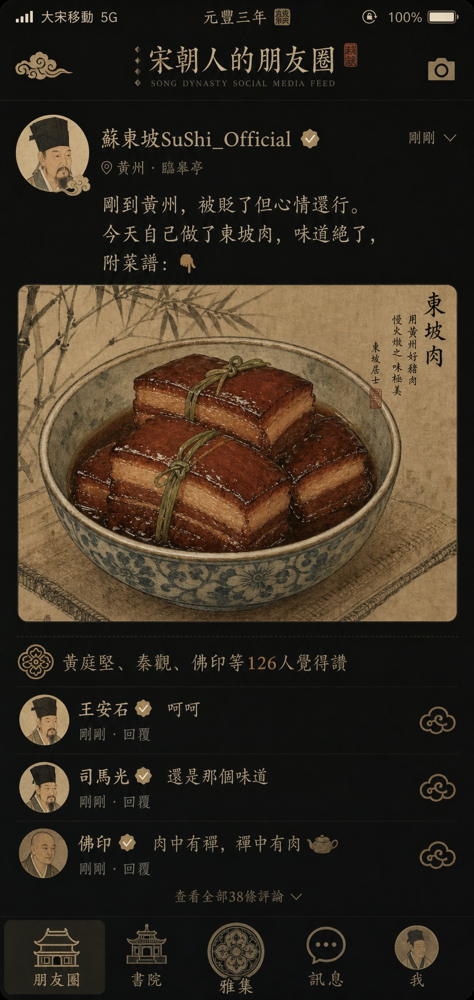

**來源：** [@Panda20230902](https://x.com/Panda20230902/status/2045385588065313057)

**提示詞：**

```text
[中文]
"宋朝人的朋友圈"/"SONG DYNASTY SOCIAL MEDIA FEED"，古今穿越幽默融合介面設計風格，畫面模擬手機社群媒體介面，但內容全部是宋朝場景頭像是宋代文人畫像，使用者名稱"蘇東坡SuShi_Official"，發布內容"剛到黃州，被貶了但心情還行。今天自己做了東坡肉，味道絕了，附菜譜："，配圖為工筆畫風格的東坡肉特寫，按讚列表"黃庭堅、秦觀、佛印等126人"，留言區"王安石：呵呵""司馬光：還是那個味道"，介面元素如按讚圖示用宋代花紋替代，狀態列顯示"大宋移動 5G"和"元豐三年"，配色為手機深色模式搭配宋代雅緻色調，歷史與社群媒體的趣味碰撞傑作

[English]
"Song Dynasty People's Moments"/"SONG DYNASTY SOCIAL MEDIA FEED", Ancient and modern time-travel humor fusion interface design style, The image simulates a mobile phone social media interface, but the content is entirely Song Dynasty scenes, The avatar is a portrait of a Song Dynasty literati, Username "Su Dongpo SuShi_Official", Post content "Just arrived in Huangzhou, demoted but feeling okay. Made Dongpo pork myself today, tastes amazing, recipe attached:", The attached image is a close-up of Dongpo pork in Gongbi painting style, Likes list "Huang Tingjian, Qin Guan, Fo Yin etc. 126 people", Comments section "Wang Anshi: Hehe" "Sima Guang: Still the same taste", Interface elements such as the like icon are replaced with Song Dynasty patterns, The status bar shows "Great Song Mobile 5G" and "Third Year of Yuanfeng", The color scheme is mobile phone dark mode paired with elegant Song Dynasty tones, A masterpiece of fun collision between history and social media
```

***

<a name="case-268"></a>

### 例 268：威化島回軍前夕李成桂動態

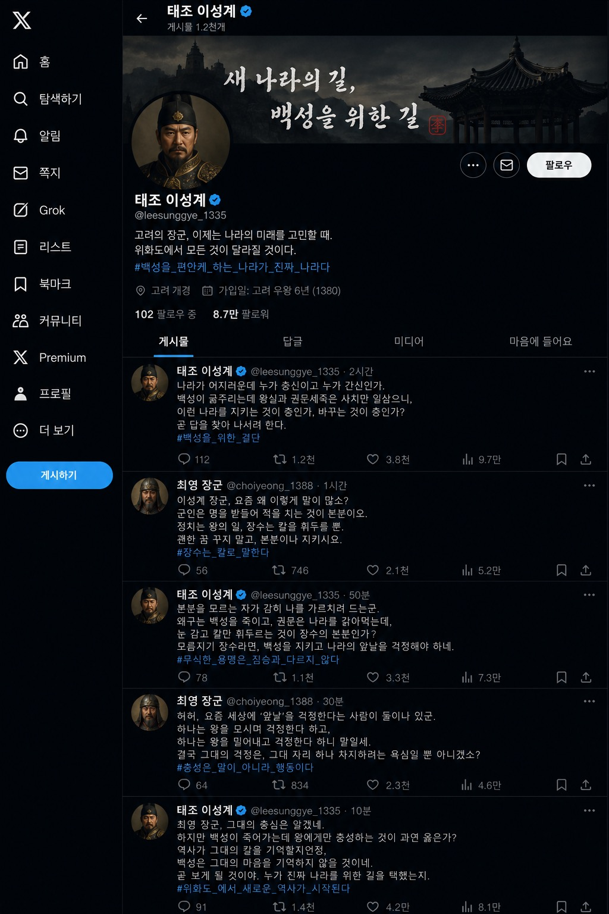

**來源：** [@SKA\_Neotype](https://x.com/SKA_Neotype/status/2044637900978217334)

**提示詞：**

```text
[中文]
태조 이성계의 X  페이지(위화도 회군을 벌이기 직전- 최영 장군과 서로 디스하는 내용이 담긴 게시글들)을 만들어 주세요.

[English]
Please create an X page of King Taejo Yi Seong-gye (right before carrying out the Wihwa Island Retreat - containing posts where he and General Choi Yeong are dissing each other).
```

***

<a name="case-269"></a>

### 例 269：拒絕盲目催婚的暖心影片號截圖

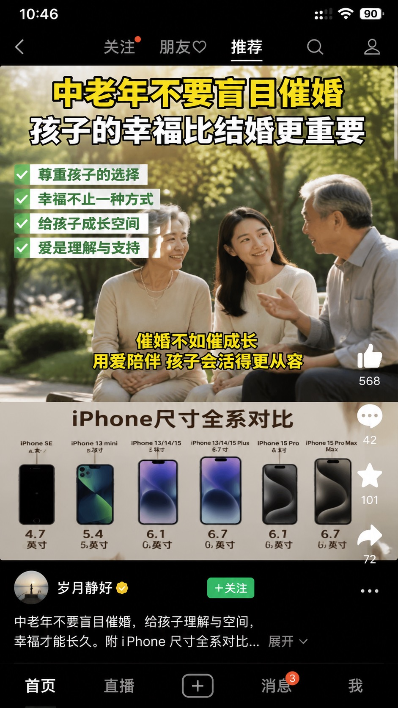

**來源：** [@MrLarus](https://x.com/MrLarus/status/2045373105041007013)

**提示詞：**

```text
[中文]
生成影片號內容截圖，主題：中老年不要盲目催婚，iPhone尺寸

[English]
Generate a screenshot of WeChat Channels content, theme: middle-aged and elderly people should not blindly urge marriage, iPhone size
```

***

<a name="case-270"></a>

### 例 270：資訊圖表視覺化設計

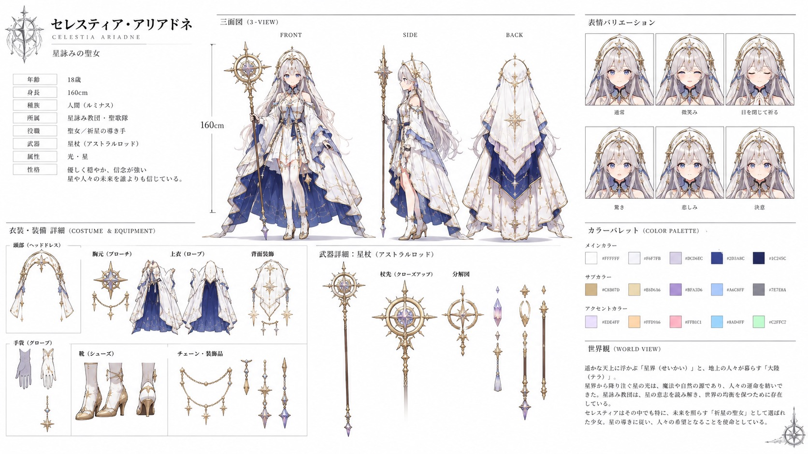

**來源：** \[OpenNana]\(]\(<https://x.com/Toshi_nyaruo_AI/status/2045025277538107420>)

**提示詞：**

```text
[中文]
このキャラクターと背景を元に、 公式設定資料のようなキャラクターシートを作成してください。
・正面、側面、背面の3面図を含める ・キャラクターの表情バリエーションを追加
・衣裝や裝備の詳細パーツを分解して表示 ・カラーパレットを追加 ・世界観の簡単な説明を入れる
・全體は整理されたレイアウト
（白背景、図解風）
・アスペクト比16：9 　←

高解像度、プロのコンセプトアートスタイル

[English]
Based on this character and background, please create a character sheet like an official setting material.
・Include front, side, and back 3-view drawings ・Add character expression variations
・Disassemble and display detailed parts of costumes and equipment ・Add a color palette ・Include a brief explanation of the world view
・Overall organized layout
(White background, diagrammatic style)
・Aspect ratio 16:9 　←
High resolution, professional concept art style
```

***

<a name="case-271"></a>

### 例 271：人物角色設定圖

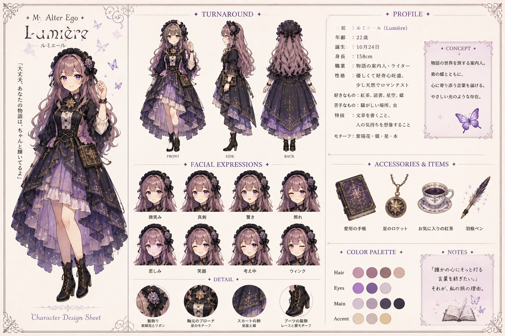

**來源：** [@tsubaki\_ew](https://x.com/tsubaki_ew/status/2045259289993048284)

**提示詞：**

```text
[中文]
お借りして噂のGPT-Image-2でキャラシート作ってみましたｽｺﾞｯ(๑°ㅁ°๑)‼✧更に色々指示してあげたらもっといい感じになりそう✨キャラは以前チャッピーにお願いして描いて貰った我が分身です( *¯ ꒳¯*)

[English]
I borrowed it and tried making a character sheet using the rumored GPT-Image-2 Awesome(๑°ㅁ°๑)‼✧ It seems like it would turn out even better if I gave it various more instructions✨ The character is my alter ego that I asked Chappy to draw for me before( *¯ ꒳¯*) #GPTimage #AIgenerated
```

***

<a name="case-272"></a>

### 例 272：日式溫泉旅館人像

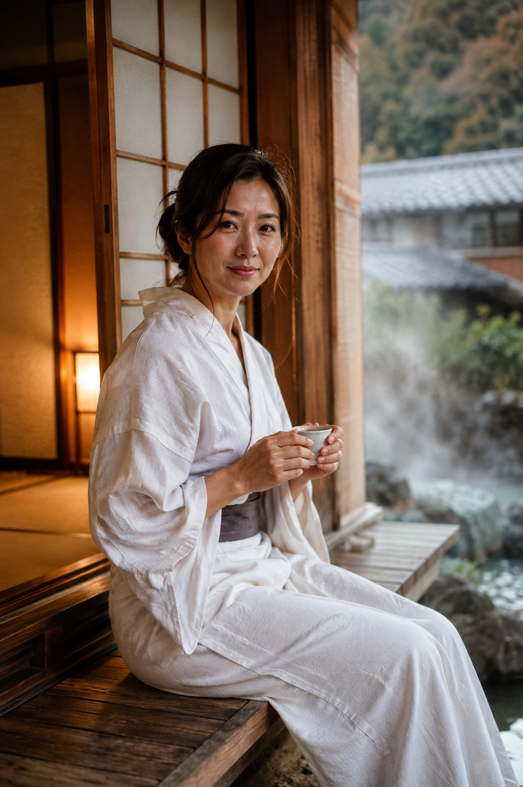

**來源：** [@BubbleBrain](https://x.com/BubbleBrain/status/2045092449803284923)

**提示詞：**

```text
35mm film photography, warm vintage Japanese onsen ryokan aesthetic, soft ambient wooden lantern lighting mixed with gentle natural window light, subtle film grain, gentle color shift, high atmosphere editorial style, intimate medium shot, early 20s beautiful Chinese female idol with ultra-realistic delicate refined Chinese features, seductive almond-shaped fox eyes with natural double eyelids, high nose bridge, small sharp V-shaped jawline, flawless porcelain skin with warm ivory undertone, visible subtle skin texture and micro pores, soft natural makeup with dewy glow, subtle rosy flush on cheeks, natural soft pink lips slightly parted, long dark brown hair tied in a loose low bun with some messy strands falling around face and neck, wearing a loose white yukata (traditional Japanese bathrobe) deliberately slipped off one shoulder and loosely tied at the waist, the fabric slightly open revealing smooth skin and subtle cleavage, barefoot, seductive relaxed sitting pose on the edge of a traditional wooden engawa veranda at a vintage onsen ryokan, body slightly turned toward the camera, one leg bent with foot resting on the wooden floor, the other leg gently dangling, one hand lightly holding the yukata collar, the other hand resting on the wooden floor behind her for support, softly arched back to gently accentuate curves, intensely seductive yet gentle and inviting gaze straight at the viewer with soft doe eyes full of quiet temptation and warmth, warm wooden interior with paper sliding doors and distant steaming hot spring in soft focus, gentle rim lighting highlighting skin and fabric texture, authentic vintage film color grading with warm tones, extremely sharp yet soft skin rendering, natural hair strands, realistic fabric wrinkles and drape on the yukata, no plastic skin, no digital over-sharpening, no airbrushing, no blemishes, no moles, no oily skin, no watermark, no text, authentic 35mm film Japanese onsen ryokan atmosphere
```

***

<a name="case-273"></a>

### 例 273：橙紅漸變中的孤獨剪影

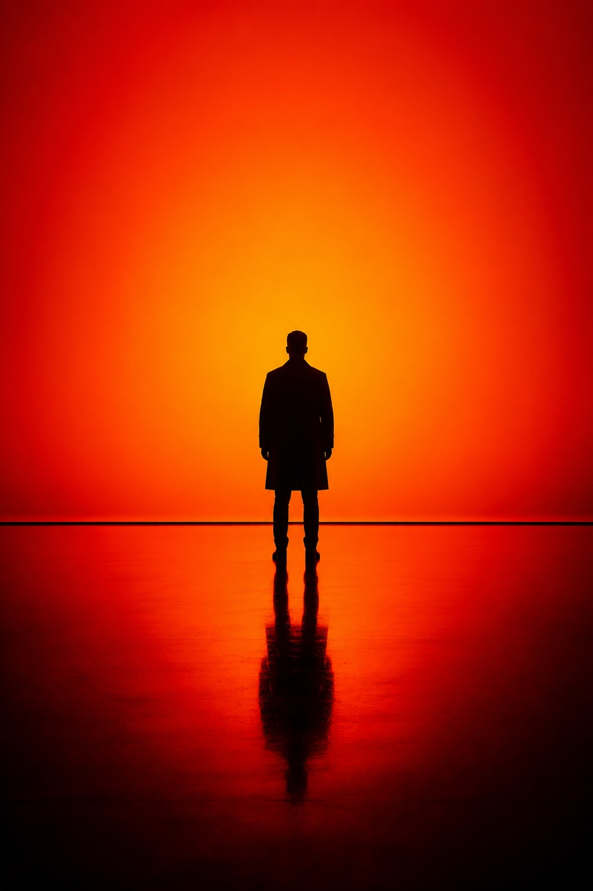

**來源：** [@iam\_miharbi](https://x.com/iam_miharbi/status/2045151354679665101)

**提示詞：**

```text
[中文]
生成一張電影級極簡肖像，一個孤獨的男人站在強烈的橙色到紅色漸變環境中，強烈的剪影光，深邃的陰影對比，反光的光滑地面，對稱構圖，極簡

[English]
Generate a cinematic minimal portrait of a solitary man standing in an intense orange to red gradient environment, strong silhouette lighting, deep shadow contrast, reflective glossy floor, symmetrical composition, minimal
```

***

<a name="case-274"></a>

### 例 274：成都吃貨暴走手繪美食地圖

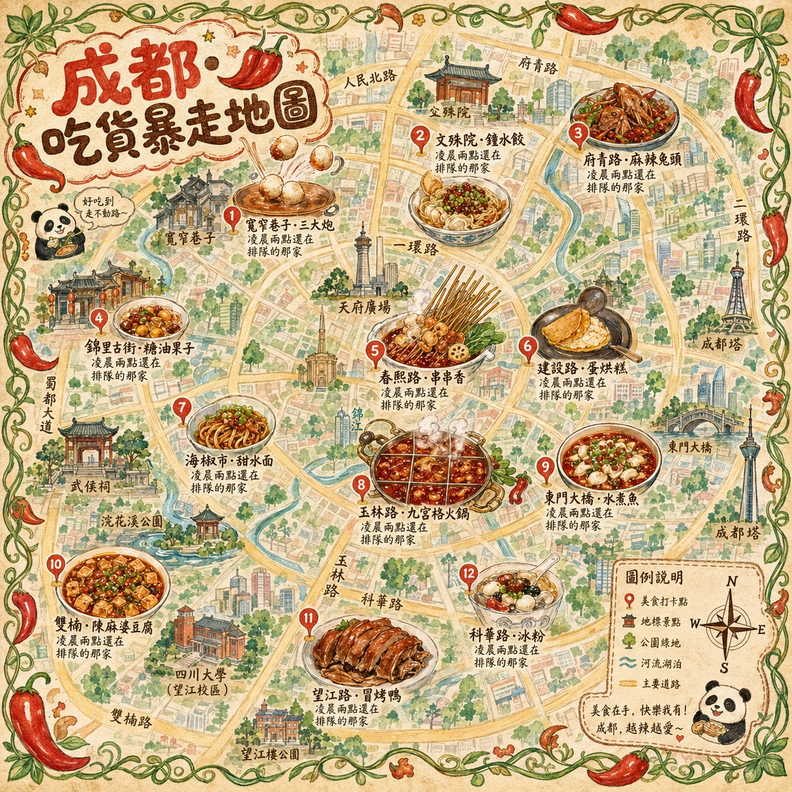

**來源：** [@Panda20230902](https://x.com/Panda20230902/status/2045396918965285111)

**提示詞：**

```text
[中文]
一張手繪風格的城市美食地圖，以成都為主題。畫面以鳥瞰視角的手繪簡化城市地圖為底，標註主要道路和地標但不追求精確比例而是追求可愛的手繪感。地圖上分佈著 12 個美食地點的精緻手繪小插畫：春熙路的串串香（一把竹籤插著各種食材冒著熱氣）、寬窄巷子的三大炮（三個糯米糰子飛向銅盤）、建設路的蛋烘糕（金黃酥脆正在翻面）、玉林路的火鍋（九宮格鍋翻滾冒泡）等，每個插畫約佔地圖的 5% 面積，旁邊用手寫體標註店名和一句推薦語"凌晨兩點還在排隊的那家"。地圖邊緣用手繪藤蔓和辣椒裝飾形成邊框。右下角有一個手繪指南針和圖例說明。左上角標題"成都·吃貨暴走地圖"使用胖圓的手繪美術字配辣椒裝飾。整體畫風為水彩+彩鉛混合的手繪質感，顏色以暖色系（辣椒紅、薑黃、翠綠）為主，圖片比例 1:1。

[English]
A hand-drawn style city food map themed around Chengdu. The background is a bird's-eye view hand-drawn simplified city map, marking main roads and landmarks, not pursuing precise proportions but pursuing a cute hand-drawn feel. Distributed on the map are exquisite hand-drawn small illustrations of 12 food locations: Chuandu Chuanxiang skewers at Chunxi Road (a bunch of bamboo skewers with various ingredients emitting steam), Sandapao at Kuanzhai Alley (three glutinous rice balls flying towards a copper plate), Danhonggao at Jianshe Road (golden and crispy, being flipped), hotpot at Yulin Road (nine-grid pot rolling and bubbling), etc. Each illustration accounts for about 5% of the map area, with handwritten store names and a recommendation phrase "the one with a queue even at 2 AM" next to it. The edge of the map is decorated with hand-drawn vines and chili peppers to form a border. There is a hand-drawn compass and legend description in the bottom right corner. The title "Chengdu · Foodie Walking Map" in the top left corner uses chubby round hand-drawn artistic fonts decorated with chili peppers. The overall art style is a mixed hand-drawn texture of watercolor and colored pencils, with colors mainly in warm tones (chili red, ginger yellow, emerald green), image ratio 1:1.
```

***

<a name="case-275"></a>

### 例 275：一張採用分層蒙太奇構圖的電影海報

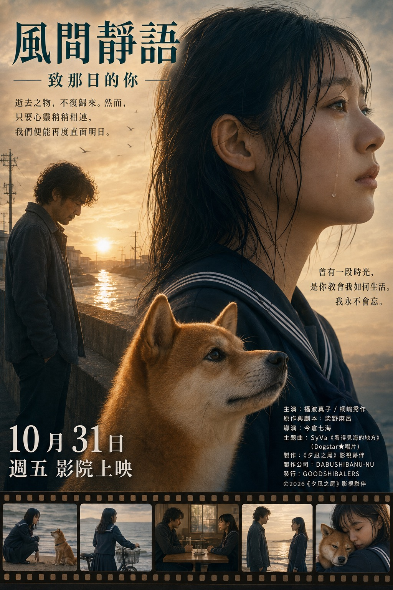

**來源：** [@old\_pgmrs\_will](https://x.com/old_pgmrs_will/status/2045440101359198302)

**提示詞：**

```text
[中文]
“一張採用分層蒙太奇構圖的電影海報。背景為日落時分的海濱小鎮，平靜的海面倒映著耀眼的日光眩光，薄霧籠罩的天空中有遠處飛鳥，沿海公路旁立著電線杆剪影。左側中景處，一位身著深灰色外套、留著深色捲髮的中年男子站在混凝土海堤邊，神情憂鬱地低頭凝視，被傍晚的陽光逆光勾勒輪廓。右側前景主體為一張大幅特寫年輕女子側臉肖像，她望向右側，身穿帶白色條紋的深色水手校服，溼潤的黑髮貼在臉頰，柔和漫射光線下，一滴淚珠從她臉頰滑落。畫面下方中央前景處，一隻柴犬抬頭朝右側望去，紅棕色毛髮被溫暖的輪廓光點亮。畫面最底端為一條橫向電影膠片，內含五幅獨立矩形場景縮圖：女孩與柴犬在海灘、女孩騎車望向海面、女孩與男子坐在室內桌前、男子與女孩在海灘面對面站立、女孩擁抱柴犬的特寫。畫面疊加指定文字：左上角為深青綠色大號襯線字型標題《風間靜語》，下方副標題為「—— 致那日的你 ——」；標題下方為小號深色襯線正文：“逝去之物，不復歸來。然而，只要心靈稍稍相連，我們便能再度直面明日。” 畫面右側中部為深色襯線字型文字：“曾有一段時光，是你教會我如何生活。我永不會忘。” 左下角為大號白色文字：“10 月 31 日 週五 影院上映”。右下角為小號白色無襯線字型演職人員表：“主演：福波真子 / 桐嶋秀作 原作與劇本：柴野麻呂 導演：今倉七海 主題曲：SyVa《看得見海的地方》（Dogstar★唱片） 製作：《夕凪之尾》影視夥伴 製作公司：DABUSHIBANU-NU 發行：GOODSHIBALERS ©2026《夕凪之尾》影視夥伴”。
分段提示詞：
圖層索引：0
片段：“背景為日落時分的海濱小鎮，平靜海面倒映耀眼日光眩光，薄霧天空中有遠處飛鳥，沿海公路旁有電線杆剪影。”
圖層索引：1
片段：“左側中景處，身著深灰色外套、留深色捲髮的中年男子站在混凝土海堤邊，神情憂鬱低頭，被傍晚陽光逆光照射。”
圖層索引：2
片段：“右側前景主體為大幅特寫年輕女子側臉肖像，她望向右側，身穿帶白條紋的深色水手校服，溼潤黑髮貼臉，柔和漫射光下一滴淚珠滑落臉頰。”
圖層索引：3
片段：“畫面下方中央前景處，一隻柴犬抬頭望向右側，紅棕色毛髮被溫暖輪廓光點亮。”
圖層索引：4
片段：“畫面最底端為橫向電影膠片，內含五幅獨立矩形場景縮圖：女孩與柴犬在海灘、女孩騎車望向水面、女孩與男子坐在室內桌前、男子與女孩在海灘面對面、女孩擁抱柴犬特寫。”
圖層索引：[5,6,7,8]
片段：“畫面疊加指定文字：左上角為深青綠色大號襯線字型《風間靜語》，下方副標題「—— 致那日的你 ——」；其下小號深色襯線正文：“逝去之物，不復歸來。然而，只要心靈稍稍相連，我們便能再度直面明日。” 右側中部深色襯線文字：“曾有一段時光，是你教會我如何生活。我永不會忘。” 左下角大號白色文字：“10 月 31 日 週五 影院上映”。右下角小號白色無襯線字型演職資訊：“主演：福波真子 / 桐嶋秀作 原作與劇本：柴野麻呂 導演：今倉七海 主題曲：SyVa《看得見海的地方》（Dogstar★唱片） 製作：《夕凪之尾》影視夥伴 製作公司：DABUSHIBANU-NU 發行：GOODSHIBALERS ©2026《夕凪之尾》影視夥伴”。
負面提示詞：
“平光照明，無質感表面，對稱構圖，底部留白空蕩，文字缺失，翻譯文字，改寫文字，3D 渲染，卡通風格，高對比生硬陰影，乾澀頭髮，明亮歡快表情”

[English]
A cinematic movie poster utilizing a layered montage composition. In the background, a coastal town at sunset with calm ocean water reflecting a glowing sun glare, distant birds in a hazy sky, and the silhouette of utility poles along a coastal road. In the left midground, a middle-aged man with dark wavy hair in a dark grey jacket stands near a concrete sea wall, looking downward with a melancholic expression, backlit by the late afternoon sun. Dominating the right foreground is a large, closely cropped profile portrait of a young woman looking right; she wears a dark school sailor uniform with white stripes, has wet dark hair clinging to her face, and a single tear rolls down her cheek under soft, diffuse lighting. In the lower center foreground, a Shiba Inu dog looks upwards toward the right, its reddish-brown fur catching warm rim lighting. Along the very bottom edge is a horizontal film strip of five distinct rectangular scene thumbnails: a dog and girl on a beach, a girl on a bicycle looking at the water, a girl and man sitting at an indoor table, a man and girl standing facing each other on a beach, and a close-up of a girl hugging a Shiba Inu. Overlaid on the image is specific text. In the top left, large dark teal serif text reads 'The Quiet Between Winds' with a subtitle below reading '— To You, That Day —'. Below that, smaller dark serif body text reads 'What is lost will not return. And yet, when hearts connect, even just a little, we can face tomorrow again.'. On the mid-right side, dark serif text reads 'There was a time when you taught me how to live. I won't forget it.'. In the bottom left, large white text reads 'OCTOBER 31 FRI. IN THEATERS'. In the lower right corner, small white sans-serif credit text reads 'Starring: Mako Fukunami / Shusaku Kirimine Original Story & Screenplay: Shibano Maruo Director: Nanami Imakura Theme Song: SyVa \"Umi no Mieru de\" (Dogstar★RECORDS) Production: \"Yūnagi no Shippo\" Film Partners Production Company: DABUSHIBANU-NU Distribution: GOODSHIBALERS ©2026 \"Yūnagi no Shippo\" Film Partners'."
  segmented:
    - layer_index: 0
      segment: "In the background, a coastal town at sunset with calm ocean water reflecting a glowing sun glare, distant birds in a hazy sky, and the silhouette of utility poles along a coastal road."
    - layer_index: 1
      segment: "In the left midground, a middle-aged man with dark wavy hair in a dark grey jacket stands near a concrete sea wall, looking downward with a melancholic expression, backlit by the late afternoon sun."
    - layer_index: 2
      segment: "Dominating the right foreground is a large, closely cropped profile portrait of a young woman looking right; she wears a dark school sailor uniform with white stripes, has wet dark hair clinging to her face, and a single tear rolls down her cheek under soft, diffuse lighting."
    - layer_index: 3
      segment: "In the lower center foreground, a Shiba Inu dog looks upwards toward the right, its reddish-brown fur catching warm rim lighting."
    - layer_index: 4
      segment: "Along the very bottom edge is a horizontal film strip of five distinct rectangular scene thumbnails: a dog and girl on a beach, a girl on a bicycle looking at the water, a girl and man sitting at an indoor table, a man and girl standing facing each other on a beach, and a close-up of a girl hugging a Shiba Inu."
    - layer_indices: [5, 6, 7, 8]
      segment: "Overlaid on the image is specific text. In the top left, large dark teal serif text reads 'The Quiet Between Winds' with a subtitle below reading '— To You, That Day —'. Below that, smaller dark serif body text reads 'What is lost will not return. And yet, when hearts connect, even just a little, we can face tomorrow again.'. On the mid-right side, dark serif text reads 'There was a time when you taught me how to live. I won't forget it.'. In the bottom left, large white text reads 'OCTOBER 31 FRI. IN THEATERS'. In the lower right corner, small white sans-serif credit text reads 'Starring: Mako Fukunami / Shusaku Kirimine Original Story & Screenplay: Shibano Maruo Director: Nanami Imakura Theme Song: SyVa \"Umi no Mieru de\" (Dogstar★RECORDS) Production: \"Yūnagi no Shippo\" Film Partners Production Company: DABUSHIBANU-NU Distribution: GOODSHIBALERS ©2026 \"Yūnagi no Shippo\" Film Partners'."

negative: "flat lighting, untextured surfaces, symmetrical composition, empty bottom margin, missing text, translated text, paraphrased text, 3D render, cartoon, high-contrast harsh shadows, dry hair, bright cheerful expressions
```

***

<a name="case-276"></a>

### 例 276：紅綢幻化壯闊國潮羊城

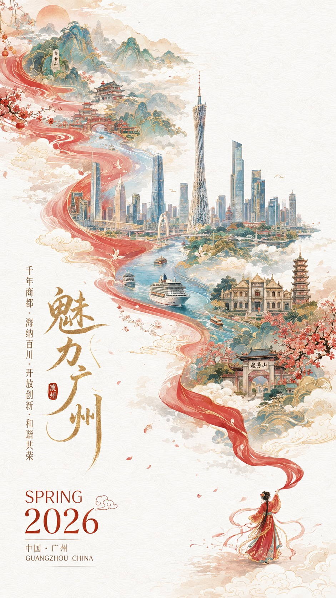

**來源：** [@liyue\_ai](https://x.com/liyue_ai/status/2045332620352119274)

**提示詞：**

```text
[中文]
一張充滿新春喜慶氛圍但不失高雅格調的 2026 城市宣傳海報。
雙重曝光，構圖延續了S型的流動感；
在純白的紋理背景右下角，一個身穿中國傳統服飾的微縮人物正在揮舞著一條長長的紅色絲綢舞帶，這條紅綢在空中舞動，不僅展現出絲綢的柔順質感，更在向左上方飄動的過程中，奇幻地變形成了一條壯麗的山脈河流。
在這條"河流"中，疊加了一個有山有海河的廣州城市手繪圖，國潮，景色盡在眼底，壯闊雄偉，令人震撼。
廣州的地標建築(廣州塔，珠江新城建築群，珠江, 廣州城裡古建築，遊輪，白雲山）。
雲霧環繞，仙氣縹緲，色彩豐富，結構複雜，細節豐富，但因為大面積的留白，畫面依然顯得清新脫俗，左下角排版著"SPRING 2026"和豎排的宣傳語，整體寓意"千年商都，魅力廣州"。
文字排版優美，大方，字跡清晰完整，尺寸9:16。

[English]
A 2026 city promotional poster full of a festive Chinese New Year atmosphere yet maintaining an elegant style.
Double exposure, the composition continues the flowing sense of an S-shape;
In the lower right corner of the pure white textured background, a miniature figure wearing traditional Chinese clothing is waving a long red silk dance ribbon, this red silk dances in the air, not only showing the smooth texture of the silk, but also in the process of drifting to the upper left, magically transforming into a magnificent mountain range and river.
In this "river", a hand-drawn map of Guangzhou city with mountains, sea, and rivers is superimposed, Guochao, the scenery is fully in view, magnificent and majestic, breathtaking.
Guangzhou's landmark buildings (Canton Tower, Pearl River New City building complex, Pearl River, ancient buildings in Guangzhou city, cruise ships, Baiyun Mountain).
Surrounded by clouds and mist, ethereal and misty, rich in colors, complex in structure, rich in details, but because of a large area of negative space, the picture still appears fresh and refined, the lower left corner is typeset with "SPRING 2026" and vertical promotional slogans, the overall implication is "Millennium Commercial Capital, Charming Guangzhou".
Beautiful and generous typography, clear and complete handwriting, aspect ratio 9:16.
```

***

<a name="case-277"></a>

### 例 277：奢華魅力黑人女性海濱攝影

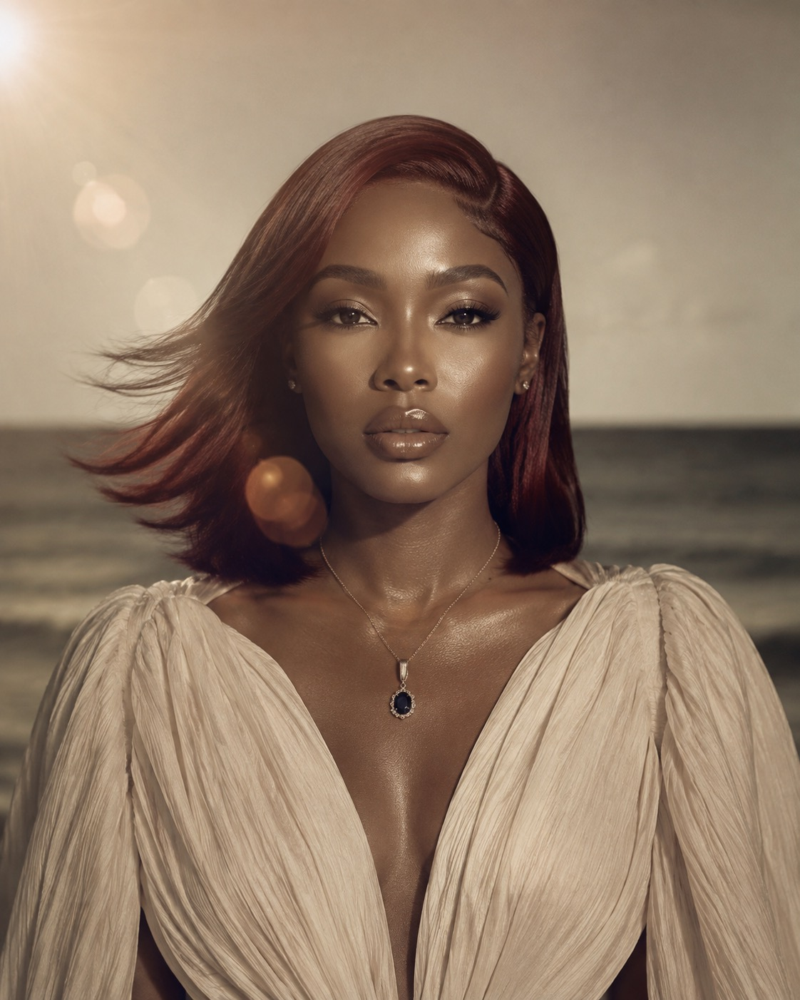

**來源：** [@patrickassale](https://x.com/patrickassale/status/2044581766309060765)

**提示詞：**

```text
[中文]
奢華魅力美容肖像：, 美麗的黑人女性, 青春活力, 奶油香草色, 絲綢柔順發, 紅木色, 微妙的自信, 有質感的面料, 藍寶石色, 極簡珠寶, 海濱微風, 鏡頭光暈效果, 懷舊的, 電影鏡頭, 對稱構圖, 柔焦, 高階時尚攝影, 單色的, 水光質感, 神秘張力, 分層元素

[English]
Luxury Glam Beauty Portrait:, Beautiful Black woman, youthful spirit, creamy vanilla, silk press, mahogany red, subtle confidence, textured fabric, sapphire blue, minimal jewelry, beachside breeze, lens flare effect, nostalgic, cinematic lens, symmetrical composition, soft focus, high fashion photography, monochromatic, dewy finish, mysterious tension, layered elements
```

***

<a name="case-278"></a>

### 例 278：阿馬爾菲海岸復古旅行海報

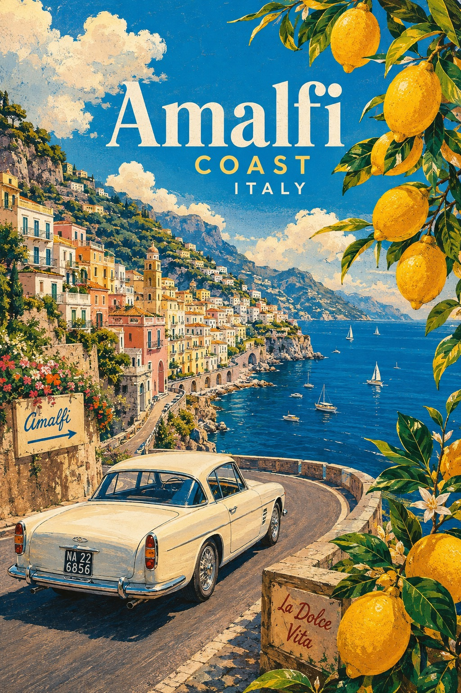

**來源：** [@WolfRiccardo](https://x.com/WolfRiccardo/status/2044562722491121718)

**提示詞：**

```text
[中文]
現代鉛筆插畫，義大利阿馬爾菲海岸復古旅行海報插畫，全景海岸懸崖公路場景，經典1960年代白色汽車沿著彎曲的海濱公路行駛，帶有小帆船的深藍色地中海，色彩繽紛的粉彩山腰村莊，帶有柔軟雲朵的明亮藍天，帶有鮮豔黃色檸檬的檸檬樹枝框定前景，溫暖的夏日陽光，大膽鮮豔的色彩，復古1950年代旅行海報風格，電影級構圖，高細節，絲網印刷質感，圖形插畫。手繪風格，帶有鬆散筆觸和清晰輪廓的插畫。高對比度調色盤，保持背景與元素之間的色彩和諧。現代與裝飾性美學。

[English]
Modern pencil illustration of Vintage travel poster illustration of the Amalfi Coast, Italy, panoramic coastal cliff road scene, classic 1960s white car driving along a curved seaside road, deep blue Mediterranean sea with small sailboats, colorful pastel hillside village, bright blue sky with soft clouds, lemon tree branches with vibrant yellow lemons framing the foreground, warm summer sunlight, bold vibrant colors, retro 1950s travel poster style, cinematic composition, high detail, screen print texture, graphic illustration. Hand-drawn style, illustration with loose strokes and defined contours. High-contrast color palette, maintaining chromatic harmony between background and elements. Contemporary and decorative aesthetic.
```

***

<a name="case-279"></a>

### 例 279：裂痕裡的水墨東方山水畫卷

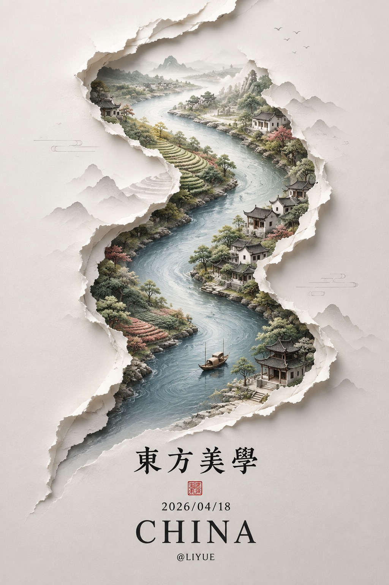

**來源：** [@liyue\_ai](https://x.com/liyue_ai/status/2045368305079447853)

**提示詞：**

```text
[中文]
極簡新中式美學風格，畫面以淡雅的灰白色為底，呈現出一種紙藝剪影般的立體感。
一條S形蜿蜒的裂痕狀邊緣將畫面分割，彷彿撕開了一層紙面，露出內部色彩斑斕的東方山水景象。
裂口內，一條蜿蜒的河流自上而下貫穿整個構圖，河水以深淺不一的藍色渲染，層次分明，彷彿流動的絲帶。
河岸兩側點綴著青翠的山丘與梯田，色彩柔和，綠紅交織，展現出田園的寧靜之美。
沿河而建的古風建築錯落有致，飛簷翹角，白牆黛瓦，在光影的映襯下更顯古樸典雅。
岸邊樹木蔥蘢，枝葉輕盈，一艘小船靜泊於水中央，增添了幾分悠然意境。
整體構圖呈S形曲線，富有韻律感，彷彿自然與人文的和諧共生。
畫作邊緣採用撕紙效果，營造出立體浮雕般的視覺體驗。
下方題字"東方美學"以黑色楷體書寫，日期"2026/04/18"與紅色印章相呼應，底部"CHINA"字樣莊重醒目，署名"@LIYUE"低調收尾，整體氛圍靜謐深遠，充滿詩意與哲思。

[English]
Minimalist neo-Chinese aesthetic style, the picture uses an elegant grayish-white as the background, presenting a three-dimensional sense like paper art silhouettes. A winding S-shaped crack-like edge divides the picture, as if tearing open a layer of paper, revealing the colorful oriental landscape scene inside. Inside the crack, a winding river runs through the entire composition from top to bottom, the river water is rendered in different shades of blue, with clear layers, like a flowing ribbon. Both sides of the riverbank are dotted with verdant hills and terraced fields, the colors are soft, green and red interwoven, showing the tranquil beauty of the pastoral. Ancient-style buildings built along the river are well-proportioned, with flying eaves and upturned corners, white walls and black tiles, appearing more quaint and elegant against the light and shadow. The trees on the bank are lush, the branches and leaves are light and graceful, a small boat is quietly moored in the middle of the water, adding a bit of leisurely artistic conception. The overall composition presents an S-shaped curve, full of rhythm, as if the harmonious coexistence of nature and humanity. The edges of the painting adopt a torn paper effect, creating a visual experience like a three-dimensional relief. The inscription "东方美学" at the bottom is written in black regular script, the date "2026/04/18" echoes with the red seal, the word "CHINA" at the bottom is solemn and eye-catching, and the signature "@LIYUE" ends in a low-key way. The overall atmosphere is quiet and profound, full of poetry and philosophical thinking.
```

***

<a name="case-280"></a>

### 例 280：封面排版設計圖

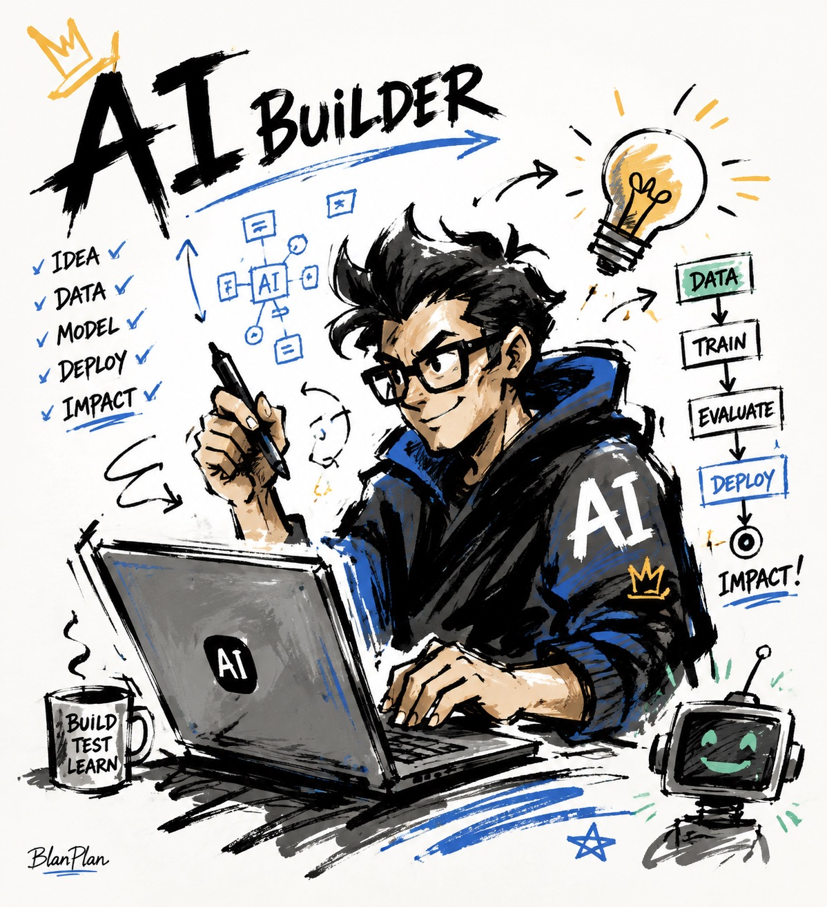

**來源：** [OpenNana](https://opennana.com/awesome-prompt-gallery/graffiti-sketch-ai-builder-master)

**提示詞：**

```text
[中文]
以塗鴉速寫風表現【一個厲害的AI builder】，整體呈現快速勾勒、自由變形、即興手繪與草稿式的視覺效果。線條隨手、誇張、可粗細不一，略顯凌亂但具有節奏和表現力，強調概括、誇張、趣味和隨性，而不是嚴謹寫實或精細刻畫。  顏色採用粗糙、幹刷感明顯的塊面表現，可保留不均勻的塗抹痕跡、刷痕、飛白與覆蓋感，色彩根據【主題/主體】自動適配，但整體保持塗鴉式、速寫式、概括式的表達。不要透明水彩暈染效果，不要細膩水彩過渡，不要紙紋理，不要柔和霧化，不要夢幻質感。  背景以留白為主，保持簡潔、輕鬆、未完成感和設計感，可加入少量輔助性符號、箭頭、記號、圈畫、重複線、隨手寫的文字或其他塗鴉元素，以增強速寫本或隨筆式視覺語言，但不可過於擁擠，不可破壞主體和留白氣質。  畫面內容不需要預先寫清楚，由【一個厲害的AI builder】自動推演並生成最適合的主體形象、動作、相關元素、符號或簡化場景，整體保持統一的塗鴉速寫風和誇張概括的表現方式，避免複雜寫實背景和過度鋪陳。 畫面中需自然加入專屬簽名"BlanPlan"，作為畫面的一部分，位置低調但清晰，可放在左下角、右下角或標題附近，風格需與整體版式統一，像作品署名或設計落款；簽名字型精緻、克制、高階，不可過大，不可破壞主體構圖，不可顯得突兀或廉價。

[English]
Express [an awesome AI builder] in a graffiti sketch style, overall presenting a visual effect of quick sketching, free deformation, impromptu hand-drawing and draft-like. The lines are casual, exaggerated, and can vary in thickness, slightly messy but with rhythm and expressiveness, emphasizing summarization, exaggeration, fun and casualness, rather than rigorous realism or fine depiction. The colors use rough blocks with obvious dry brush feel, retaining uneven smearing traces, brush strokes, flying white and covering feel, the colors automatically adapt according to [theme/subject], but overall maintain a graffiti-style, sketch-style, and summarized expression. Do not use transparent watercolor smudging effects, do not use delicate watercolor transitions, do not use paper texture, do not use soft atomization, do not use dreamy texture. The background is mainly blank, keeping it simple, relaxed, unfinished and designed, can add a small amount of auxiliary symbols, arrows, marks, circled drawings, repeated lines, casually written text or other graffiti elements, to enhance the sketchbook or essay-style visual language, but it must not be too crowded, and must not destroy the subject and blank temperament. The picture content does not need to be written clearly in advance; [an awesome AI builder] automatically deduces and generates the most suitable subject image, movements, related elements, symbols or simplified scenes, overall maintaining a unified graffiti sketch style and exaggerated summarized expression method, avoiding complex realistic backgrounds and excessive padding. The exclusive signature "BlanPlan" needs to be naturally added into the picture as a part of the picture, the position is low-key but clear, can be placed in the bottom left corner, bottom right corner or near the title, the style needs to be unified with the overall layout, like an artwork signature or design sign-off; the signature font is exquisite, restrained, and high-end, must not be too large, must not destroy the subject composition, must not appear abrupt or cheap.
```

***

<a name="case-281"></a>

### 例 281：賽博朋克科幻曼荼羅

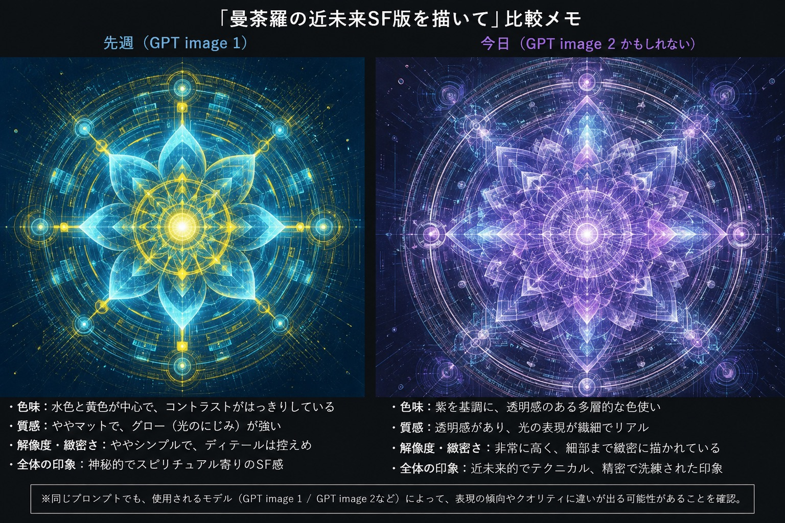

**來源：** [@4WEB1](https://x.com/4WEB1/status/2045390207072256179)

**提示詞：**

```text
[中文]
でChatGPTで畫像を作成してもらって、今日また作成してもらったらGPT image 2かもしれず、出來が変わったように見えるのでメモ

左の水色と黃色のが先週
右の紫のが今日

右のは透明感とか解像度、緻密さが違うような気がする…

プロンプト
曼荼羅の近未來SF版を描いて

[English]
I had ChatGPT create images, and when I had it create them again today, it might be GPT image 2, and it seems like the quality has changed, so I'm making a note of it

The light blue and yellow one on the left is from last week
The purple one on the right is from today

I feel like the transparency, resolution, and fineness are different for the one on the right.

Prompt
Draw a near-future sci-fi version of a mandala
```

***

<a name="case-282"></a>

### 例 282：溫柔治癒系二次元手機截圖

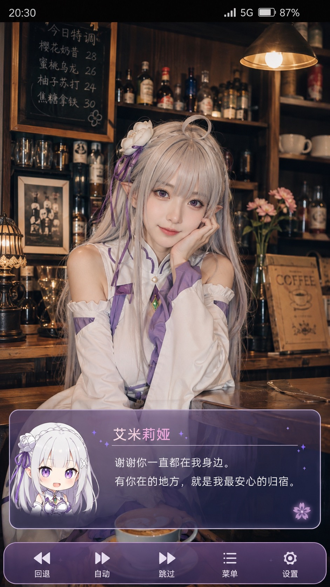

**來源：** [@Zoulinshen](https://x.com/Zoulinshen/status/2045082518089810073)

**提示詞：**

```text
[中文]
生成一張豎版手機截圖風格的圖片，整體比例接近 9:16。畫面中心偏上是一位真人 coser，扮演（角色名稱）的二次元角色。人物為寫實風格，但五官略帶動漫感，皮膚細膩，眼睛稍大，表情溫柔地看向鏡頭，坐在室內的休閒場景中，例如咖啡廳或酒吧吧檯前，背景有符合場景的道具。畫面最上方加入手機系統狀態列 UI，包括時間、電量、訊號、網路等圖示，讓整張圖看起來像手機截圖。畫面底部疊加一塊寬大的半透明 galgame 風格對話方塊，對話方塊左側放一個與畫面人物對應的動漫或 Q 版頭像；對話方塊右側排版文字：第一行用較大字型顯示與前面相同的角色名字，下面一到兩行顯示一段適合這個角色人設的、溫柔治癒風格的簡體中文臺詞，由你自動創作。再在對話方塊下方加一條操作欄，仿照 galgame UI。整體風格高畫質、細節豐富、光線柔和、二次元與真人寫真自然融合。

[English]
Generate a portrait mobile phone screenshot style image, with an overall aspect ratio close to 9:16. In the upper center of the frame is a real-life coser, playing a 2D anime character named (Character Name). The character is in a realistic style, but with facial features slightly showing an anime feel, delicate skin, slightly larger eyes, a gentle expression looking at the camera, sitting in an indoor casual scene, such as in front of a cafe or bar counter, with background props fitting the scene. At the very top of the image, add a mobile phone system status bar UI, including icons for time, battery, signal, and network, to make the whole image look like a mobile phone screenshot. At the bottom of the image, overlay a wide semi-transparent galgame style dialog box, place an anime or Q-version avatar corresponding to the character in the image on the left side of the dialog box; on the right side of the dialog box, typeset text: the first line displays the same character name as before in a larger font, the following one to two lines display a piece of Simplified Chinese dialogue suitable for this character's personality, in a gentle and healing style, automatically created by you. Then add an operation bar below the dialog box, imitating the galgame UI. The overall style is high-definition, rich in details, with soft lighting, and a natural fusion of 2D anime and real-life photography.
```

***

<a name="case-283"></a>

### 例 283：小惡魔莉莉香超任遊戲海報

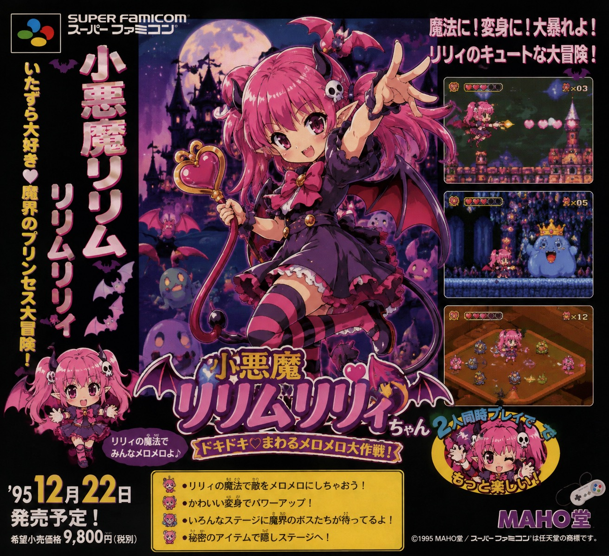

**來源：** [@lilimliliychan](https://x.com/lilimliliychan/status/2045114760937804187)

**提示詞：**

```text
[中文]
が「小悪魔リリムリリィちゃんが　スーパーファミコンのゲームだったときのポスターを考えて」に　畫像數枚だけで
このクオリティ　細かい説明呪文なし　すごいぜ！

[English]
that "Think of a poster when the little devil Lilim Lily-chan was a Super Famicom game" with just a few images
this quality without any detailed explanation spells is amazing!
```

***

<a name="case-284"></a>

### 例 284：溫馨臥室裡的少女自拍

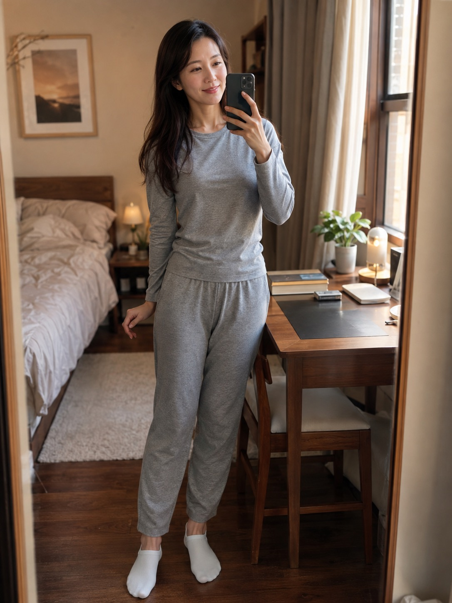

**來源：** [@Shinning1010](https://x.com/Shinning1010/status/2045002808903020962)

**提示詞：**

```text
[中文]
一個驚豔的18歲中國女孩，擁有年輕純真的臉龐和逼真的皮膚紋理，坐在她臥室裡一張舒適且略顯凌亂的床上。她正用智慧手機拍鏡子自拍，捕捉一個自然且親密的瞬間。穿著隨意的灰色居家服和整潔的白色船襪。柔和的自然光（黃金時刻）從側面窗戶照進來，營造出一種溫暖、富有情緒感和電影般的氛圍。35毫米鏡頭，對鏡子中的主體保持銳利對焦，帶有美麗模糊背景（散景）的景深。照片寫實，8K，高解析度，影棚級品質，傑作。反向提示詞：沒有多餘的肢體，沒有變形的手，沒有模糊，沒有噪點，沒有水印，沒有文字，沒有卡通/動漫風格。長寬比：3:4。

[English]
A stunning 18-year-old Chinese girl with a youthful, pure face and realistic skin texture, sitting on a cozy, slightly messy bed in her bedroom. She is taking a mirror selfie with a smartphone, capturing a natural and intimate moment. Wearing casual gray loungewear and neat white crew socks. Soft natural light (golden hour) streams in from a side window, creating a warm, moody, and cinematic atmosphere. 35mm lens, sharp focus on the subject in the mirror, depth of field with a beautifully blurred background (bokeh). Photorealistic, 8K, high resolution, studio quality, masterpiece.
Negative Prompts: no extra limbs, no deformed hands, no blur, no noise, no watermark, no text, no cartoon/anime style. Aspect Ratio: 3:4.
```

***

<a name="case-285"></a>

### 例 285：真實動漫畫面快照

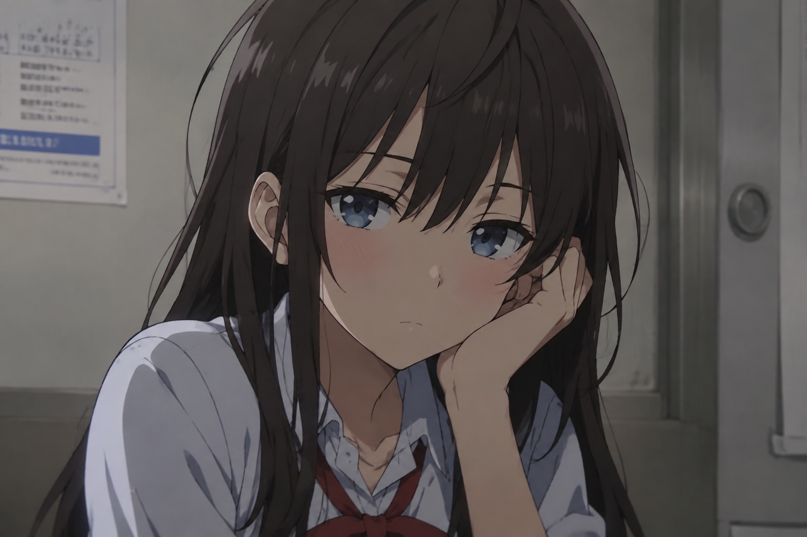

**來源：** [@Thereallo1026](https://x.com/Thereallo1026/status/2044241997163311569)

**提示詞：**

```text
[中文]
向我展示這張附帶的影象作為一部真實動漫的快照

[English]
Show me the attached image as a snapshot from an actual anime
```

***

<a name="case-286"></a>

### 例 286：珠江新城剪紙璀璨夜景

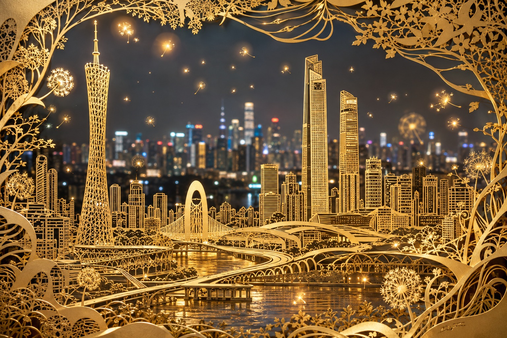

**來源：** [@liyue\_ai](https://x.com/liyue_ai/status/2045527750606487877)

**提示詞：**

```text
[中文]
以珠江新城現代都市景觀為靈感的剪紙藝術，透過精巧的鏤空手法在一整幅紙上，立體刻畫廣州塔、東西雙塔等地標建築與繁華城景。
所有建築與元素均以流暢的線條與結構相連，無孤立部分，構成一幅完整的都市畫卷。
畫面採用金屬箔或光澤紙材質，表面帶有細膩的明暗光澤，在光照下呈現柔和的高光與陰影，彷彿被城市燈光輕輕照亮。
背景以虛化的珠江新城天際線為襯，點綴隱約可見的花城廣場與樹木輪廓，整體透出現代浪漫的氛圍。
作品中巧妙融入輕盈的蒲公英絨毛或星光般的動態光點，象徵夢想與活力在這座新城中飄散飛揚。整體呈現8K超高畫質視覺，細節豐富，真實而富有藝術感染力。

[English]
Paper-cut art inspired by the modern urban landscape of Zhujiang New Town, through exquisite hollow-carving techniques on a single sheet of paper, three-dimensionally depicting landmark buildings such as Canton Tower, East and West Twin Towers, and the bustling cityscape. All buildings and elements are connected by smooth lines and structures, with no isolated parts, forming a complete urban scroll. The picture uses metallic foil or glossy paper material, with delicate light and dark gloss on the surface, presenting soft highlights and shadows under illumination, as if gently illuminated by city lights. The background is set against a blurred Zhujiang New Town skyline, dotted with faintly visible outlines of Huacheng Square and trees, overall revealing a modern romantic atmosphere. The work cleverly integrates light dandelion fluff or starlight-like dynamic light points, symbolizing dreams and vitality fluttering and flying in this new city. The overall presents 8K ultra-high-definition vision, rich in details, realistic and full of artistic appeal.
```

***

<a name="case-287"></a>

### 例 287：不知火舞的小红书主頁

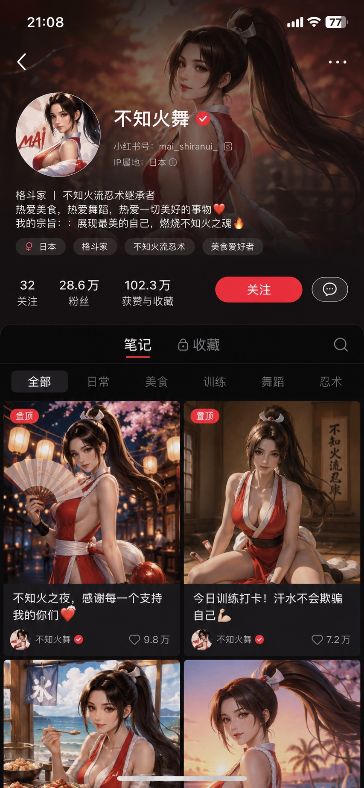

**來源：** [@rionaifantasy](https://x.com/rionaifantasy/status/2045356799751303194)

**提示詞：**

```text
[中文]
生成不知火舞的小红书主頁截圖

[English]
Generate a screenshot of Mai Shiranui's Xiaohongshu homepage
```

***

<a name="case-288"></a>

### 例 288：抖音美女直播間介面設計

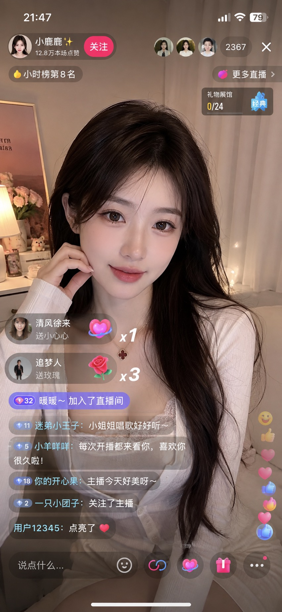

**來源：** [@msjiaozhu](https://x.com/msjiaozhu/status/2045470160576999812)

**提示詞：**

```text
[中文]
生成抖音直播間介面，內容是一個美女在直播

[English]
Generate a TikTok live stream interface, the content is a beautiful woman live streaming
```

***

<a name="case-289"></a>

### 例 289：直播介面設計圖

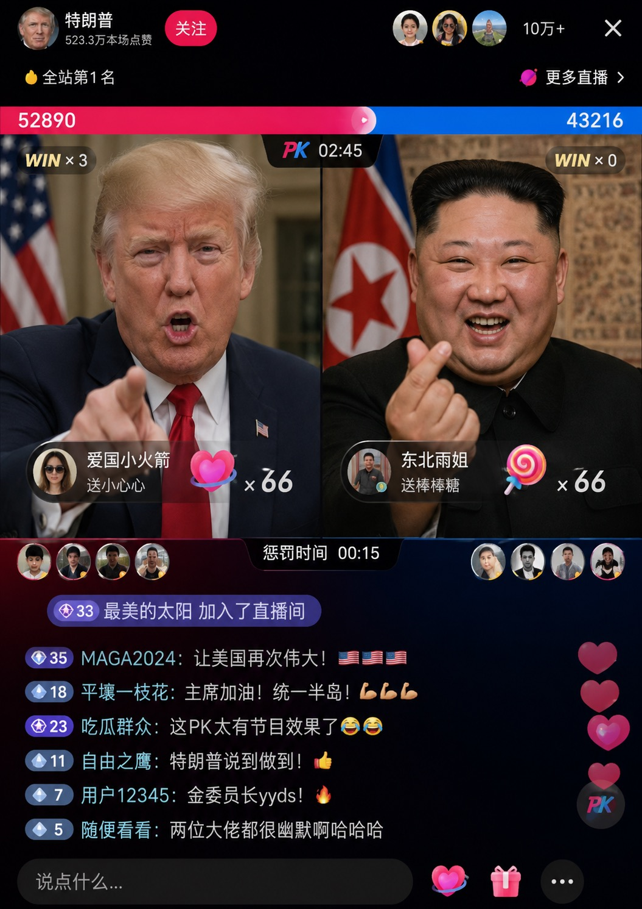

**來源：** [@rionaifantasy](https://x.com/rionaifantasy/status/2045356799751303194)

**提示詞：**

```text
[中文]
生成特朗普和金正恩在抖音直播間打PK的截圖

[English]
Generate a screenshot of Trump and Kim Jong-un doing a PK battle in a TikTok live stream room
```

***

<a name="case-290"></a>

### 例 290：古風詩人鐳射典藏卡牌

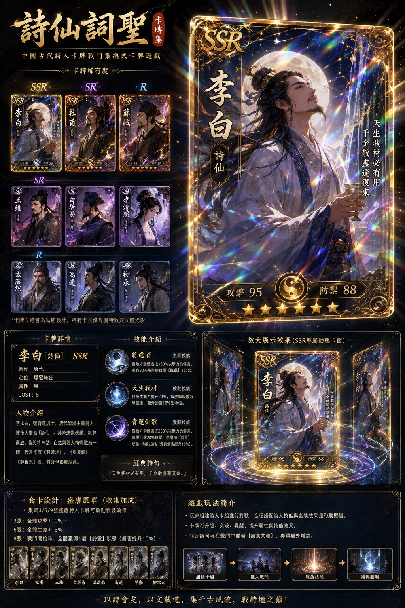

**來源：** [@TanShilong](https://x.com/TanShilong/status/2045435090923356415)

**提示詞：**

```text
[中文]
為中國古代詩人設計一套遊戲卡片，並按照SSR SR R 分級，重點卡片有放大展示的效果，包括卡面設計和人物介紹，有很高階的遊戲卡片質感，稀有卡片還會有特色的光影例如鐳射效果 需要有套卡設計和技能設計，並附帶較為詳細的說明

[English]
Design a set of game cards for ancient Chinese poets, classified by SSR SR R grades, with key cards having an enlarged display effect, including card face design and character introduction, having a very high-end game card texture, rare cards will also have special light and shadow effects such as holographic laser effects, requiring set card design and skill design, along with relatively detailed descriptions
```

***

<a name="case-291"></a>

### 例 291：極致奢華的彈珠店夢幻宣傳單

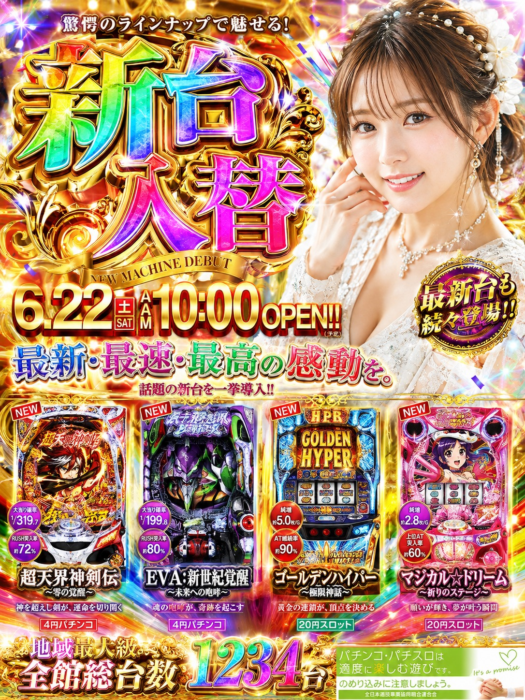

**來源：** [OpenNana](https://opennana.com/awesome-prompt-gallery/luxurious-pachinko-flyer)

**提示詞：**

```text
[中文]
以 3:4 比例製作一家彈珠店那種閃閃發光的宣傳單。放置一個真實、精細的現代可愛日本女性。充分利用閃閃發光、立體感豐富的豪華裝飾彩虹字型等，務必做到極致奢華。並列介紹幾個不存在的虛構新機型。

[English]
Create a sparkling flyer like those of a pachinko parlor at a 3:4 aspect ratio. Place a realistic, highly detailed modern cute Japanese woman. Make full use of sparkling, three-dimensional richly decorated rainbow typography, etc., and be sure to achieve extreme luxury. Introduce several non-existent fictional new models side by side.
```

***

<a name="case-292"></a>

### 例 292：明朝登基寶玉的推文頁面

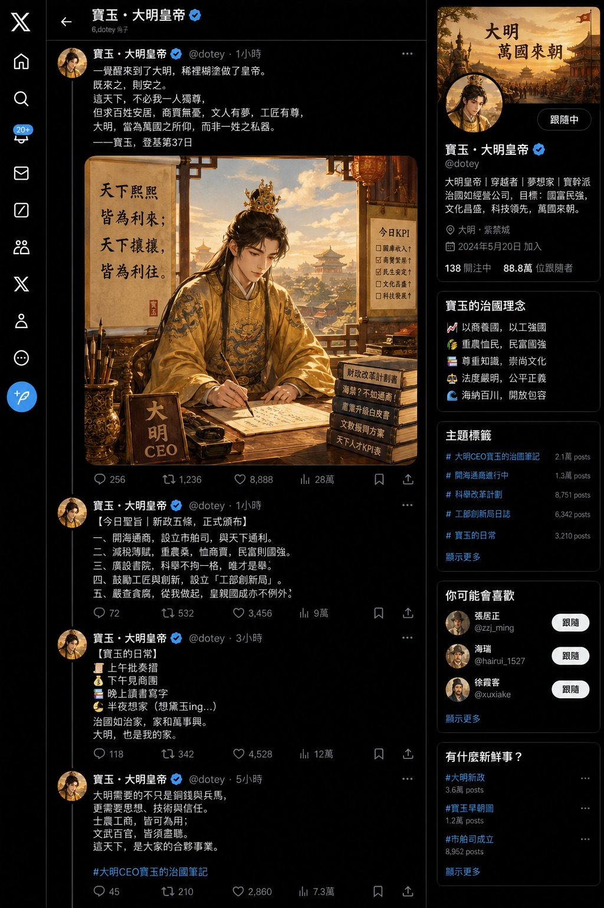

**來源：** [@tuzi\_ai](https://x.com/tuzi_ai/status/2045193918736736365)

**提示詞：**

```text
[中文]
建立一個寶玉（查閱 https://x.com/dotey 這個推主的主頁及部分推文）穿越到明朝，登基之後依據其業務/個性，繪製的其新的X帖子頁面。

[English]
Create a new X post page illustrated for Baoyu (refer to the homepage and some posts of this Twitter user at https://x.com/dotey) after time-traveling to the Ming Dynasty and ascending the throne, based on his business/personality.
```

***

<a name="case-293"></a>

### 例 293：聚焦人工智慧的校園日報


**來源：** [@MrLarus](https://x.com/MrLarus/status/2044824800909054181)

**提示詞：**

```text
[中文]
生成一張校園日報，主題AI教育

[English]
Generate a campus daily newspaper, theme AI education
```

***

<a name="case-294"></a>

### 例 294：精美潮汕菜館選單圖

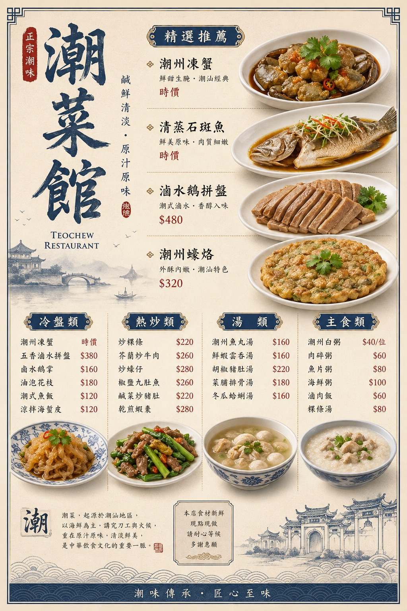

**來源：** [@MrLarus](https://x.com/MrLarus/status/2044824800909054181)

**提示詞：**

```text
[中文]
生成一張潮菜館選單圖

[English]
Generate a Teochew restaurant menu image.
```

***

<a name="case-295"></a>

### 例 295：復古傳統老黃曆二零二六年四月十八

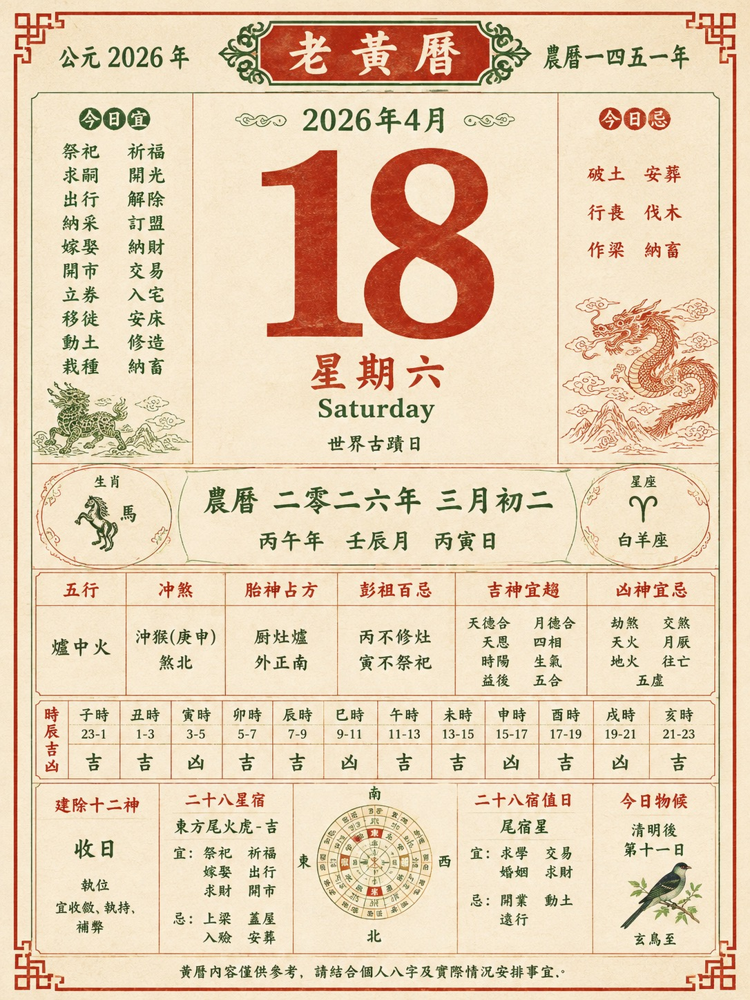

**來源：** [@MrLarus](https://x.com/MrLarus/status/2044824800909054181)

**提示詞：**

```text
[中文]
生成一張2026年4月18日的老黃曆

[English]
Generate an old almanac for April 18, 2026
```

***

<a name="case-296"></a>

### 例 296：博物館級中文拆解資訊圖表鑑

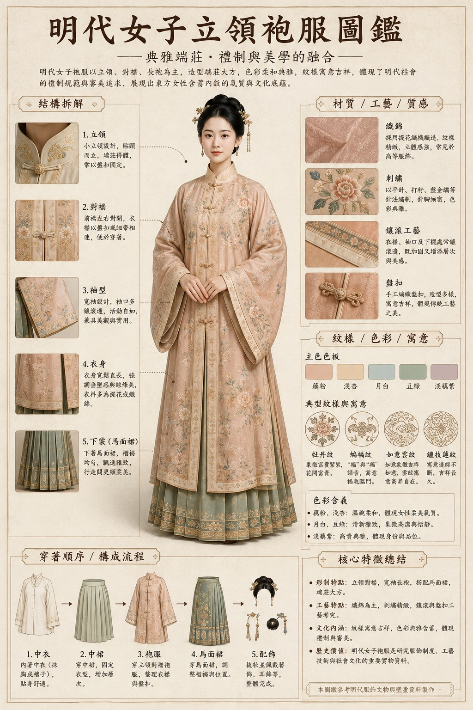

**來源：** [@MrLarus](https://x.com/MrLarus/status/2045504669401653414)

**提示詞：**

```text
[中文]
請根據【主題】自動生成一張“博物館圖鑑式中文拆解資訊圖表”。

要求整張圖兼具真實寫實主視覺、結構拆解、中文標註、材質說明、紋樣寓意、色彩含義和核心特徵總結。你需要根據【主題】自動判斷最合適的主體物件、服飾體系、器物結構、時代風格、關鍵部件、材質工藝、顏色方案與版式結構，使用者無需再提供其他資訊。

整體風格應為：國家博物館展板、歷史服飾圖鑑、文博專題資訊圖表，而不是普通海報、古風寫真、電商詳情頁或動漫插畫。背景採用米白、絹紙白、淺茶色等紙張質感，整體高階、克制、專業、可收藏。

版式固定為：
- 頂部：中文主標題 + 副標題 + 導語
- 左側：結構拆解區，中文引線標註關鍵部件，並配局部特寫
- 右上：材質 / 工藝 / 質感區，展示真實紋理小樣並附說明
- 右中：紋樣 / 色彩 / 寓意區，展示主色板、紋樣樣本和文化解釋
- 底部：穿著順序 / 構成流程圖 + 核心特徵總結

若主題適合人物展示，則以真實人物全身站姿為中央主體；若更適合器物或單體結構，則改為中心主體拆解圖，但整體仍保持完整中文資訊圖表形式。所有文字必須為簡體中文，清晰、規整、可讀，不要亂碼、錯字、英文或拼音。重點突出真實結構、材質差異、文化說明與圖鑑氣質。

避免：海報感、影樓感、電商感、動漫感、cosplay感、亂標註、錯結構、糊字、假材質、過度裝飾。

[English]
Please automatically generate a "museum catalog-style Chinese disassembly infographic" based on the [Subject].

The entire image is required to combine a realistic main visual, structural disassembly, Chinese annotations, material descriptions, pattern meanings, color meanings, and core feature summaries. You need to automatically determine the most appropriate main subject, clothing system, artifact structure, era style, key components, material craftsmanship, color scheme, and layout structure based on the [Subject], and the user does not need to provide any other information.

The overall style should be: national museum exhibition boards, historical clothing catalogs, and cultural/museum thematic infographics, rather than ordinary posters, ancient-style portraits, e-commerce detail pages, or anime illustrations. The background uses paper textures such as off-white, silk white, and light tea color, making the overall look premium, restrained, professional, and collectible.

The layout is fixed as:
- Top: Chinese main title + subtitle + introduction
- Left: Structural disassembly area, with Chinese lead lines annotating key components, accompanied by close-up details
- Upper right: Material / craftsmanship / texture area, displaying real texture samples with descriptions
- Middle right: Pattern / color / meaning area, displaying the main color palette, pattern samples, and cultural explanations
- Bottom: Dressing order / composition flowchart + core feature summary

If the subject is suitable for character display, use a full-body standing posture of a real person as the central subject; if it is more suitable for artifacts or single structures, change it to a central subject disassembly diagram, but the overall form remains a complete Chinese infographic. All text must be in Simplified Chinese, clear, neat, and readable, without garbled characters, typos, English, or pinyin. The focus is on highlighting real structures, material differences, cultural explanations, and a catalog atmosphere.

Avoid: poster feel, studio portrait feel, e-commerce feel, anime feel, cosplay feel, random annotations, incorrect structures, blurry text, fake materials, excessive decoration.
```

***

<a name="case-297"></a>

### 例 297：手寫食譜變身雜誌級跨頁

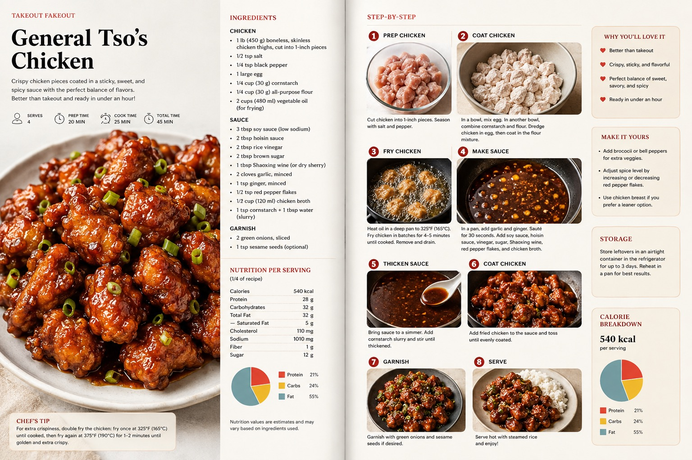

**來源：** [@maxescu](https://x.com/maxescu/status/2045203839910056014)

**提示詞：**

```text
[中文]
手寫食譜 → 專業食譜頁面 上傳一份凌亂的手寫家庭食譜；模型會搜尋準確的現代計量/營養資訊，然後生成一份精緻的雜誌風格雙頁跨頁，包含分步平鋪圖、完美的食材標籤和卡路里分解。

[INSERT_RECIPE_LINK]

[English]
Handwritten Recipe → Professional Cookbook Page Upload a messy handwritten family recipe; the model searches for accurate modern measurements/nutrition, then generates a polished, magazine-style double-page spread with step-by-step flat lays, perfect ingredient labels, and calorie breakdowns.

[INSERT_RECIPE_LINK]
```

***

<a name="case-298"></a>

### 例 298：夢幻波士頓春季城市海報

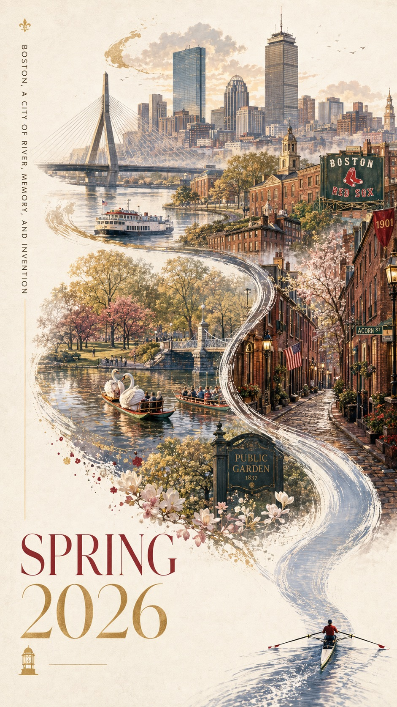

**來源：** [@BubbleBrain](https://x.com/BubbleBrain/status/2045358053831172358)

**提示詞：**

```text
[中文]
一張引人注目的2026年春季波士頓城市海報，具有優雅的慶典氛圍和大膽的當代設計。在乾淨的米白色紋理背景上，帶有大面積的留白，一個微型的單人賽艇手在影象右下角一條狹窄的反光水帶上划行。船槳劃出的尾波以動態的書法曲線向上掃過，逐漸變成查爾斯河，然後再變成一幅夢幻般的手繪波士頓全景。在這個流動的河流形狀的構圖中包含著標誌性的波士頓元素：後灣天際線、燈塔山紅磚聯排別墅、橡樹街、波士頓公共花園、天鵝船、扎基姆橋、芬威球場啟發的細節、歷史悠久的磚砌建築、港口渡輪，以及這座城市的水濱氛圍。柔和的晨霧，金色的春季光線，深紅和金色的微妙節日點綴，豐富的細節，層次分明的深度，精緻的城市海報美學，清新而優雅，視覺上強有力但不擁擠。左下角的優雅排版寫著“SPRING 2026”，並附有垂直標語“BOSTON, A CITY OF RIVER, MEMORY, AND INVENTION”，文字清晰且構圖優美，高階平面設計，9:16

[English]
A striking Spring 2026 city poster for Boston with an elegant celebratory mood and a bold contemporary design. On a clean off-white textured background with large areas of negative space, a miniature single sculler rows across the lower right corner of the image on a narrow ribbon of reflective water. The wake from the oar sweeps upward in a dynamic calligraphic curve, gradually transforming into the Charles River and then into a dreamlike hand-painted panorama of Boston. Inside this flowing river-shaped composition are iconic Boston elements: the Back Bay skyline, Beacon Hill brownstones, Acorn Street, Boston Public Garden, Swan Boats, Zakim Bridge, Fenway-inspired details, historic brick architecture, harbor ferries, and the city’s waterfront atmosphere. Soft morning fog, golden spring light, subtle festive accents in crimson and gold, rich detail, layered depth, sophisticated city-poster aesthetics, fresh and refined, visually powerful but not overcrowded. Elegant typography in the lower left reads “SPRING 2026” with a vertical slogan “BOSTON, A CITY OF RIVER, MEMORY, AND INVENTION”, text clear and beautifully composed, premium graphic design, 9:16
```

***

<a name="case-299"></a>

### 例 299：極簡留白塗鴉手繪草圖

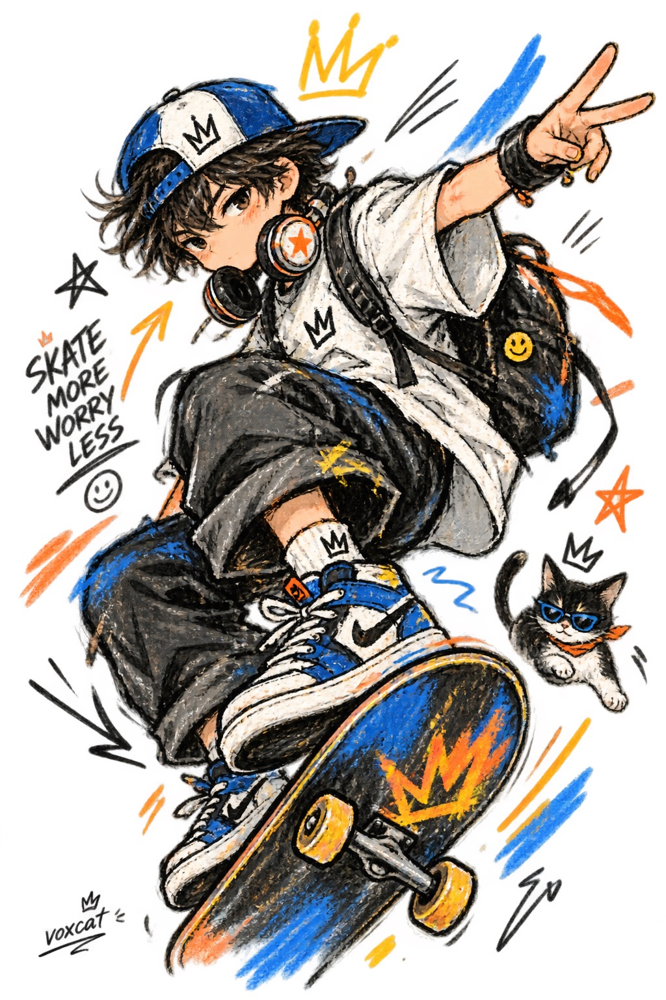

**來源：** [@VoxcatAI](https://x.com/VoxcatAI/status/2045131503001342302)

**提示詞：**

```text
[中文]
以塗鴉速寫風表現【主題/主體】，整體呈現快速勾勒、自由變形、即興手繪與草稿式的視覺效果。線條隨手、誇張、可粗細不一，略顯凌亂但具有節奏和表現力，強調概括、誇張、趣味和隨性，而不是嚴謹寫實或精細刻畫。

顏色採用粗糙、幹刷感明顯的塊面表現，可保留不均勻的塗抹痕跡、刷痕、飛白與覆蓋感，色彩根據【主題/主體】自動適配，但整體保持塗鴉式、速寫式、概括式的表達。不要透明水彩暈染效果，不要細膩水彩過渡，不要紙紋理，不要柔和霧化，不要夢幻質感。

背景以留白為主，保持簡潔、輕鬆、未完成感和設計感，可加入少量輔助性符號、箭頭、記號、圈畫、重複線、隨手寫的文字或其他塗鴉元素，以增強速寫本或隨筆式視覺語言，但不可過於擁擠，不可破壞主體和留白氣質。

畫面內容不需要預先寫清楚，由【主題/主體】自動推演並生成最適合的主體形象、動作、相關元素、符號或簡化場景，整體保持統一的塗鴉速寫風和誇張概括的表現方式，避免複雜寫實背景和過度鋪陳。
畫面中需自然加入專屬簽名“voxcat”，作為畫面的一部分，位置低調但清晰，可放在左下角、右下角或標題附近，風格需與整體版式統一，像作品署名或設計落款；簽名字型精緻、克制、高階，不可過大，不可破壞主體構圖，不可顯得突兀或廉價。

[English]
Express [Subject/Theme] in a graffiti sketch style, presenting an overall visual effect of quick outlining, free deformation, impromptu hand-drawing, and draft-like appearance. The lines are casual, exaggerated, and can vary in thickness, slightly messy but rhythmic and expressive, emphasizing generalization, exaggeration, playfulness, and spontaneity, rather than rigorous realism or detailed rendering. Colors are expressed in rough blocks with a distinct dry-brush feel, retaining uneven smearing traces, brush strokes, dry-brush effects, and a sense of coverage. Colors automatically adapt to [Subject/Theme], but the overall expression remains graffiti-style, sketch-style, and generalized. Do not use transparent watercolor blooming effects, do not use delicate watercolor transitions, do not use paper textures, do not use soft atomization, and do not use dreamy textures. The background is mainly left blank, maintaining a sense of simplicity, relaxation, incompleteness, and design. A small number of auxiliary symbols, arrows, marks, circled areas, repeated lines, casually written text, or other graffiti elements can be added to enhance the visual language of a sketchbook or jotting style, but it must not be too crowded, and must not destroy the subject and the blank space temperament. The image content does not need to be written out in advance; the most suitable subject image, actions, related elements, symbols, or simplified scenes are automatically deduced and generated by [Subject/Theme], keeping the overall unified graffiti sketch style and exaggerated generalized expression, avoiding complex realistic backgrounds and over-elaboration. The exclusive signature "voxcat" needs to be naturally added to the image as a part of the picture. The position should be low-key but clear, and can be placed in the bottom left corner, bottom right corner, or near the title. The style must be consistent with the overall layout, like an artwork signature or a design sign-off; the signature font should be exquisite, restrained, and high-end, must not be too large, must not destroy the subject composition, and must not appear abrupt or cheap.
```

***

<a name="case-300"></a>

### 例 300：黑板上的出師表全文

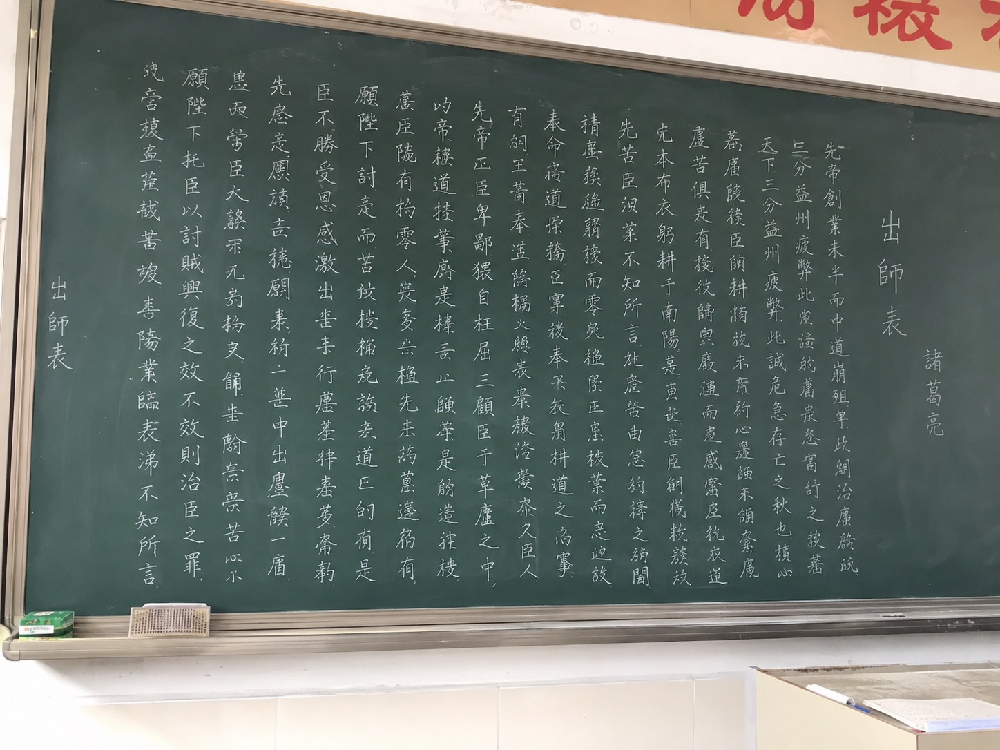

**來源：** [@rionaifantasy](https://x.com/rionaifantasy/status/2045356799751303194)

**提示詞：**

```text
[中文]
生成圖片:
手寫在教室黑板上的出師表全文，真實感的粉筆字跡，晴朗白天用iPhone手機實拍

[English]
Generate image: The full text of Chu Shi Biao handwritten on a classroom blackboard, realistic chalk handwriting, taken with an iPhone in real life on a sunny day
```

***

<a name="case-301"></a>

### 例 301：終結者機器人淘寶詳情頁

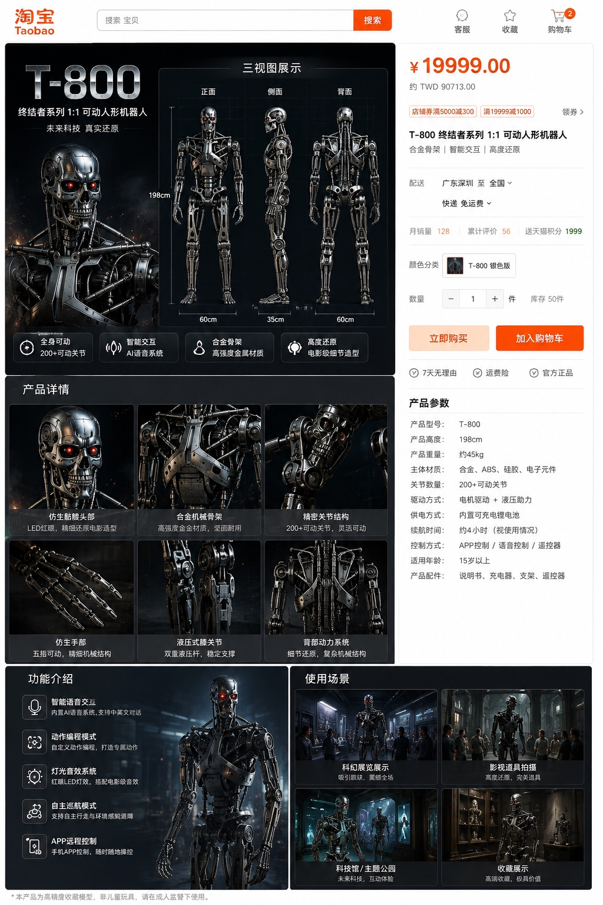

**來源：** [@rionaifantasy](https://x.com/rionaifantasy/status/2045356799751303194)

**提示詞：**

```text
[中文]
生成圖片:
T-800機器人的淘寶商品詳情頁，展示:
機器人的正面側面背面三檢視，
產品價格，
產品細節，
功能和使用場景等

[English]
Generate image:
Taobao product detail page of a T-800 robot, showing:
front, side, and back three-view drawings of the robot,
product price,
product details,
functions and usage scenarios
```

***

<a name="case-302"></a>

### 例 302：九位大師的機械鍵盤設計圖鑑

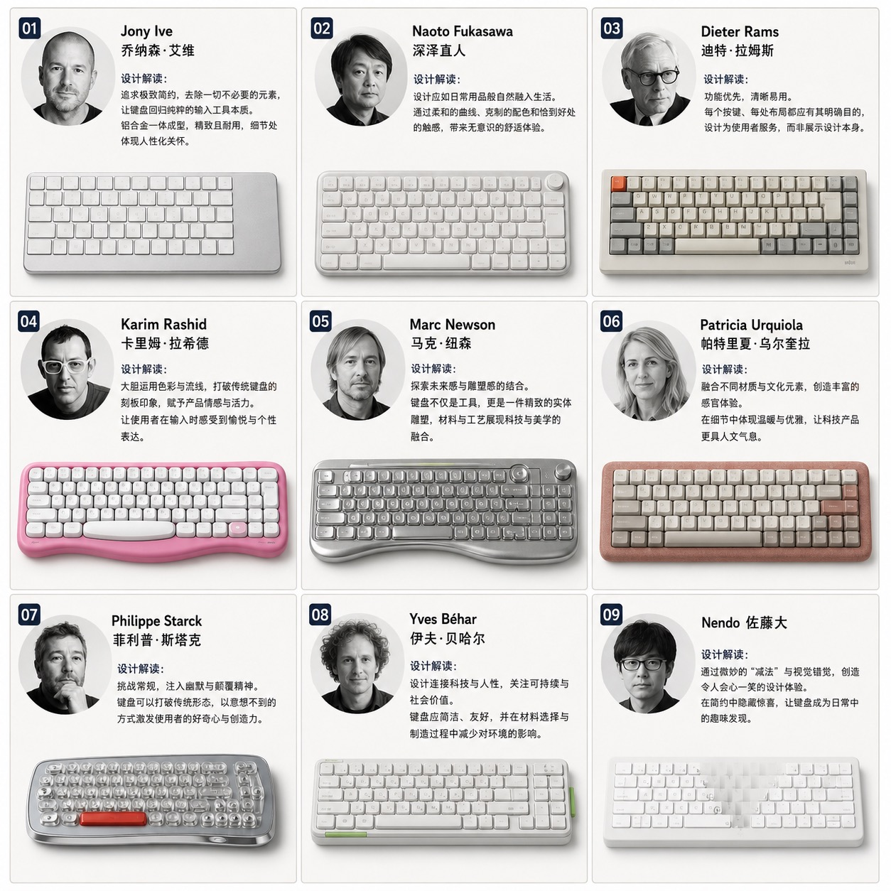

**來源：** [@TanShilong](https://x.com/TanShilong/status/2045148649869692982)

**提示詞：**

```text
[中文]
一個九宮格圖片，展現九位當代知名設計師設計的同一組物體：機械鍵盤，包括設計師頭像，設計師對於設計的中文文字解讀和作品呈現。排版統一規則

[English]
A nine-grid image showing the same group of objects designed by nine contemporary famous designers: mechanical keyboards, including designer avatars, designers' Chinese text interpretations of the designs, and artwork presentations. Unified layout rules
```

***

<a name="case-303"></a>

### 例 303：人教版三年級語文課本內頁

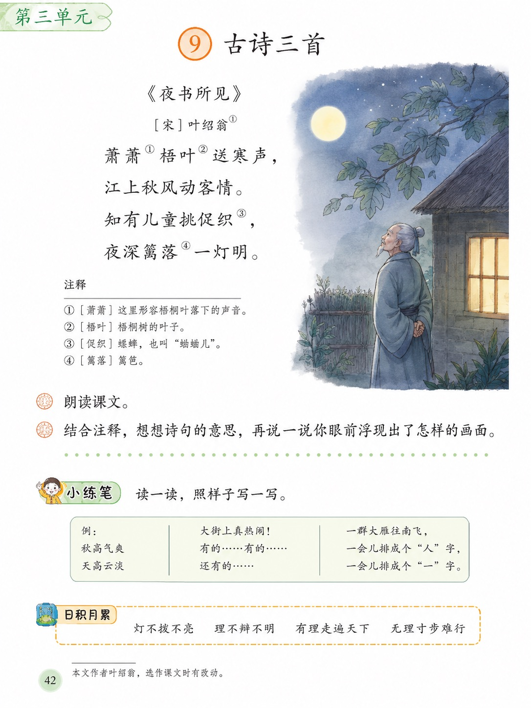

**來源：** [@MrLarus](https://x.com/MrLarus/status/2044824800909054181)

**提示詞：**

```text
[中文]
生成人教版小學三年級語文課本的一頁

[English]
Generate a page from the PEP (People's Education Press) primary school third-grade Chinese textbook
```

***

<a name="case-304"></a>

### 例 304：熒光藍窮奇新中式山水畫

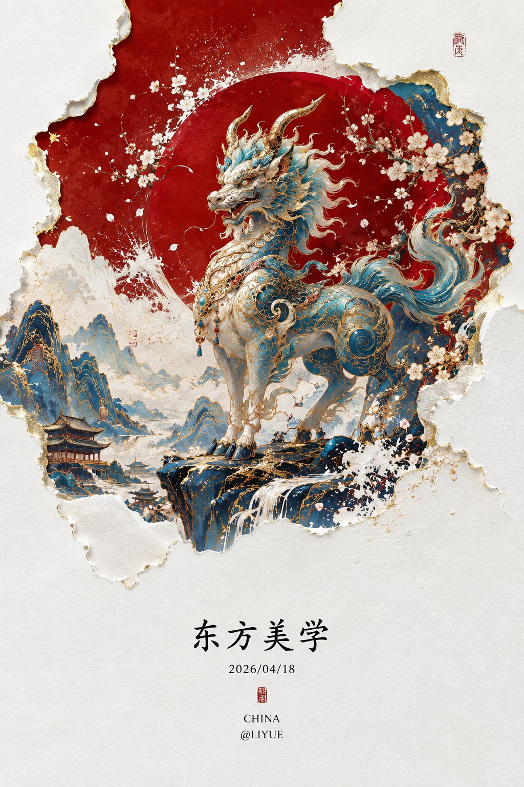

**來源：** [@liyue\_ai](https://x.com/liyue_ai/status/2045506567735558336)

**提示詞：**

```text
[中文]
極簡主義，新中式風格立體圖形設計，影象下端有楷體中國文字：“東方美學”，“2026/04/18”，署名 “CHINA”，和“
@LIYUE
"；
平整純白色的亞光質感厚藝術紙上繪充滿東方詩意氛圍的山水創意畫，不規則的撕紙效果；
中國的神獸：窮奇，身形圖案完整，美輪美奐，，線條柔美靈動,眼睛炯炯有神，威嚴的神態，優雅的姿勢，奢華裝飾藝術，中國傳統紋飾；
熒光藍色線條，0.5mm極細金色金屬質感勾邊，潑白墨大筆觸，色彩渲染，紅底，藍色的浪漫詩意視覺；
冷暖光交織的夢幻唯美場景，強烈的光影對比氛圍，花輕舞的時光敘事，東風禪意，畫面有大面積留白，框架構圖，底部留白，細節清晰。

[English]
Minimalism, Neo-Chinese style three-dimensional graphic design, at the bottom of the image there are Chinese characters in regular script: "东方美学", "2026/04/18", signature "CHINA", and "
@LIYUE
";
Drawn on flat, pure white matte textured thick art paper, a creative landscape painting full of oriental poetic atmosphere, irregular torn paper effect;
Chinese mythical beast: Qiongqi, complete body pattern, magnificent,, soft and agile lines, bright piercing eyes, majestic demeanor, elegant posture, luxury decorative art, Chinese traditional patterns;
Fluorescent blue lines, 0.5mm ultra-fine gold metallic texture outlining, large strokes of splashed white ink, color rendering, red background, romantic and poetic blue vision;
Dreamy and aesthetic scene where cold and warm lights intertwine, strong light and shadow contrast atmosphere, time narrative of flowers dancing lightly, Oriental Zen, the picture has a large area of blank space, framework composition, blank space at the bottom, clear details.
```

***

<a name="case-305"></a>

### 例 305：深夜便利店裡的性感霓虹少女

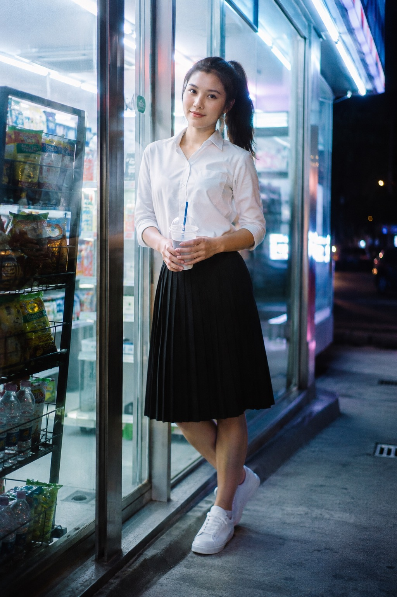

**來源：** [@BubbleBrain](https://x.com/BubbleBrain/status/2045167461147042202)

**提示詞：**

```text
[中文]
35毫米膠片攝影，帶有刺眼的便利店熒光燈照明，混合著外面色彩斑斕的霓虹燈牌，真實的膠片顆粒，高對比度，輕微的偏色，電影感街頭編輯風格，親密的中景鏡頭，20歲出頭性感的華人女性偶像，擁有超逼真精緻細膩的東方五官，誘人的杏眼狐眼搭配天然雙眼皮，高鼻樑，小巧尖銳的V型下頜線，無瑕的瓷白肌膚帶有冷象牙底色以及來自熒光燈的可見高光，細膩的皮膚紋理和微小毛孔，自然清透妝容帶有臉頰上的柔和紅暈，水潤自然的粉唇微張，鼻子和臉頰上散佈著微妙的自然雀斑，深棕色的長髮紮成凌亂的高馬尾，許多鬆散的髮絲垂在臉龐和頸部周圍，穿著一件超大號的白襯衫作為唯一的上衣，頂部敞開露出深邃乳溝並在腰部寬鬆打結，搭配一條極小的黑色百褶迷你裙，赤腳穿著簡約的白色拖鞋，在深夜24小時便利店的玻璃門上呈現出誘人隨性的倚靠姿勢，身體微微拱起，一條腿彎曲，腳搭在門框上，另一條腿伸直，一隻手拿著一瓶冰飲，另一隻手輕輕拉扯迷你裙的裙襬，極其誘人俏皮卻又略顯脆弱的目光直視觀看者，柔和的鹿眼中充滿安靜的誘惑與挑逗的微笑，來自店內明亮冷調的熒光燈光混合著來自外面招牌的粉色和藍色霓虹光芒，玻璃門上真實的反射，模糊的便利店內部，背景中有貨架和零食，真實的35毫米膠片調色，帶有刺眼的光照和霓虹點綴，極其銳利卻又柔和的皮膚渲染，自然的髮絲，超大號襯衫和迷你裙上逼真的織物褶皺和垂墜感，無塑膠感皮膚，無數字過度銳化，無磨皮，無瑕疵，無痣，無油性皮膚，無水印，無文字，真實的深夜便利店氛圍

[English]
35mm film photography with harsh convenience store fluorescent lighting mixed with colorful neon signs from outside, authentic film grain, high contrast, slight color cast, cinematic street editorial style, intimate medium shot, early 20s sexy Chinese female idol with ultra-realistic delicate refined Chinese features, seductive almond-shaped fox eyes with natural double eyelids, high nose bridge, small sharp V-shaped jawline, flawless porcelain skin with cool ivory undertone and visible specular highlights from fluorescent light, subtle skin texture and micro pores, natural dewy makeup with soft flush on cheeks, glossy natural pink lips slightly parted, subtle natural freckles across nose and cheeks, long dark brown hair in a messy high ponytail with many loose strands falling around face and neck, wearing an oversized white button-up shirt as the only top, unbuttoned at the top with deep cleavage and loosely tied at the waist, paired with a tiny black pleated mini skirt, barefoot in simple white slides, seductive casual leaning pose against the glass door of a 24-hour convenience store at late night, body slightly arched, one leg bent with foot resting against the door frame, the other leg straight, one hand holding a bottle of iced drink, the other hand lightly pulling the hem of her mini skirt, intensely seductive playful yet slightly vulnerable gaze straight at the viewer with soft doe eyes full of quiet temptation and teasing smile, bright cold fluorescent store light from inside mixed with pink and blue neon glow from outside signs, realistic reflections on glass door, blurred convenience store interior with shelves and snacks in background, authentic 35mm film color grading with harsh lighting and neon accents, extremely sharp yet soft skin rendering, natural hair strands, realistic fabric wrinkles and drape on the oversized shirt and mini skirt, no plastic skin, no digital over-sharpening, no airbrushing, no blemishes, no moles, no oily skin, no watermark, no text, authentic late-night convenience store atmosphere
```

***

<a name="case-306"></a>

### 例 306：官方角色設定資料卡

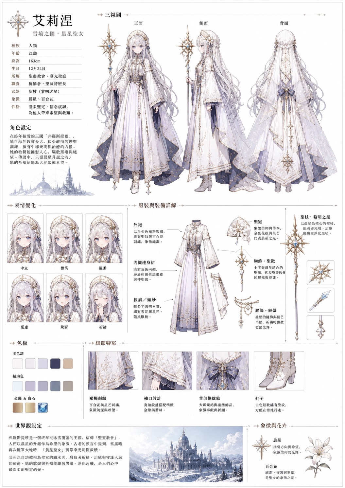

**來源：** [@MANISH1027512](https://x.com/MANISH1027512/status/2045013913901867334)

**提示詞：**

```text
[中文]
基於此角色和背景，請製作一份類似官方設定資料的角色資料卡。
・包含三檢視：正面、側面和背面
・新增角色面部表情的變化・分解並展示服裝和裝備的詳細部分
・新增色板・包含世界觀設定的簡要說明
・總體上，使用有組織的佈局（白色背景，插畫風格）

[English]
Based on this character and background, please create a character reference sheet similar to official setting materials.
・Includes three-view drawings: front view, side view, and back view
・Add variations of the character's facial expressions
・Break down and display detailed parts of the clothing and equipment
・Add a color palette
・Include a brief explanation of the worldview setting
・Overall, use an organized layout (white background, illustration style)
```

***

<a name="case-307"></a>

### 例 307：紅綢舞動千年商都廣州

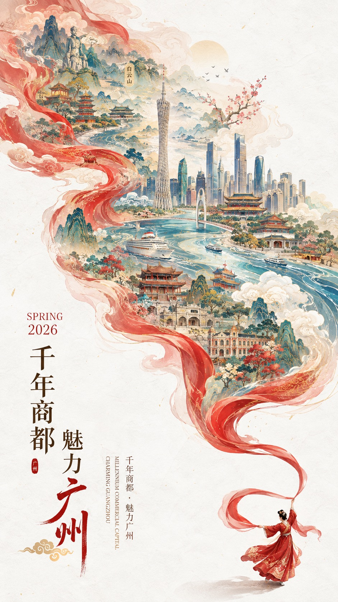

**來源：** [@liyue\_ai](https://x.com/liyue_ai/status/2045332620352119274)

**提示詞：**

```text
[中文]
一張充滿新春喜慶氛圍但不失高雅格調的 2026 城市宣傳海報。
雙重曝光，構圖延續了S型的流動感；
在純白的紋理背景右下角，一個身穿中國傳統服飾的微縮人物正在揮舞著一條長長的紅色絲綢舞帶，這條紅綢在空中舞動，不僅展現出絲綢的柔順質感，更在向左上方飄動的過程中，奇幻地變形成了一條壯麗的山脈河流。
在這條“河流”中，疊加了一個有山有海河的廣州城市手繪圖，國潮，景色盡在眼底，壯闊雄偉，令人震撼。
廣州的地標建築(廣州塔，珠江新城建築群，珠江, 廣州城裡古建築，遊輪，白雲山）。
雲霧環繞，仙氣縹緲，色彩豐富，結構複雜，細節豐富，但因為大面積的留白，畫面依然顯得清新脫俗，左下角排版著“SPRING 2026”和豎排的宣傳語，整體寓意“千年商都，魅力廣州”。
文字排版優美，大方，字跡清晰完整，尺寸9:16。

[English]
A 2026 city promotional poster filled with a festive Spring Festival atmosphere without losing its elegant style.
Double exposure, the composition continues the flowing sense of an S-shape;
In the lower right corner of the pure white textured background, a miniature figure wearing traditional Chinese clothing is waving a long red silk dance ribbon. This red silk dances in the air, not only showing the smooth texture of the silk, but also magically transforming into a magnificent mountain range and river during the process of floating to the upper left.
In this "river", a hand-drawn map of Guangzhou city with mountains, sea, and rivers is superimposed, Guochao, the scenery is in full view, magnificent and majestic, shocking.
Guangzhou's landmark buildings (Canton Tower, Pearl River New City building complex, Pearl River, ancient buildings in Guangzhou city, cruise ships, Baiyun Mountain).
Surrounded by clouds and mist, ethereal and misty, rich in color, complex in structure, rich in details, but because of a large area of blank space, the picture still looks fresh and refined. In the lower left corner, "SPRING 2026" and vertical promotional slogans are typeset. The overall implication is "Millennium Commercial Capital, Charming Guangzhou".
The typography is beautiful and generous, the handwriting is clear and complete, aspect ratio 9:16.
```

***

<a name="case-308"></a>

### 例 308：抖音直播截圖畫面


**來源：** [@\_FORAB](https://x.com/_FORAB/status/2044744023261519920)

**提示詞：**

```text
[中文]
9:16 的圖片比例，生成一張抖音直播的截圖，裡面是 xxx 在直播，xxx 手裡拿著牌子，牌子裡寫著 xxxx。

[English]
9:16 aspect ratio, generate a screenshot of a Douyin live stream, inside is xxx live streaming, xxx is holding a sign in their hand, the sign says xxxx.
```

***

<a name="case-309"></a>

### 例 309：創意樹葉拼貼構成的角色畫像

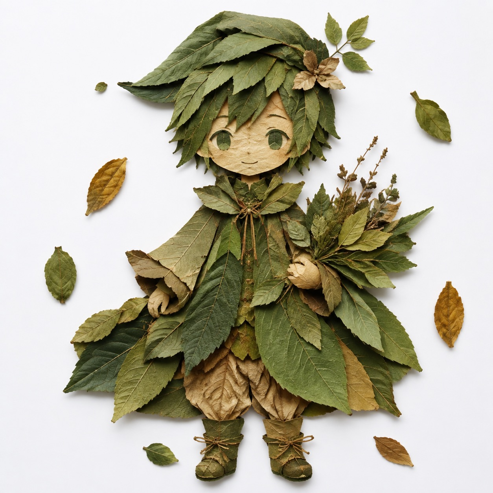

**來源：** [@meng\_dagg695](https://x.com/meng_dagg695/status/2032019839070716170)

**提示詞：**

```text
[中文]
{ 角色名稱 } 完全由天然樹葉製成，創意樹葉拼貼藝術，分層綠葉和幹葉構成身體、面部和衣服，可見葉脈和紋理，手工植物藝術風格，乾淨的白色背景，俯視平鋪構圖，高度細節，柔和自然光，逼真樹葉紋理，8k

[English]
{
  CHARACTER NAME
} made entirely from natural leaves,
creative leaf collage art,
layered green and dry leaves forming body,
face and clothes,
visible leaf veins and textures,
handcrafted botanical art style,
clean white background,
top-down flat lay composition,
highly detailed,
soft natural lighting,
realistic leaf textures,
8k
```

***

<a name="case-310"></a>

### 例 310：零食品牌技術分解圖


**來源：** [@TechieBySA](https://x.com/TechieBySA/status/2031795709243019280)

**提示詞：**

```text
[中文]
建立一個 [SNACK] 的品牌技術資訊圖表，結合產品的真實照片或照片級真實渲染，並將技術註釋覆蓋層直接置於其上。在純白攝影棚背景上使用帶有策略性 [BRAND COLOR] 點綴的黑色墨水風格線條畫（建築草圖外觀），包括：
• 關鍵元件標籤
• 顯示結構、分層或內部設計的內部截面圖
• 測量資料、尺寸和規格
• 帶有成分和數量的材料標註
• 指示主要功能和結構完整性的箭頭
• 顯示關鍵機械或設計元素的簡單示意圖或剖面圖
• 可持續性標註
標題位置：位於手繪技術註釋框內，帶有強調色邊框，粗體字顯示產品名稱，置於上角。
風格與佈局規則：
• 真實產品保持清晰可見
• 註釋具有素描感、技術感和建築感
• 強調色用於高光（佔線條工作的 20-30%），黑色用於主要技術線條（70-80%）
• 構圖整潔，負空間平衡
• 具有教育意義、食品工程氛圍和高階品牌感
• 在角落包含微妙的品牌標誌
視覺風格：極簡技術插畫美學，黑色線條在真實影象上帶有點綴，精確但略帶手繪感。
調色盤：白色背景，黑色註釋線/文字，[BRAND COLOR] 僅用於點綴和關鍵標註。
輸出：1080×1080，超清晰，社群媒體動態最佳化，無水印。

[English]
Create a branded technical infographic of a [SNACK], combining a realistic photograph or photoreal render of the product with technical annotation overlays placed directly on top. Use black ink–style line drawings with strategic [BRAND COLOR] accents (architectural sketch look) on a pure white studio background, including:
• Key component labels
• Internal cross-section showing structure, layering, or internal design
• Measurements, dimensions, and specifications
• Material callouts with composition and quantities
• Arrows indicating function for primary features and structural integrity
• Simple schematic or sectional diagram showing key mechanical or design elements
• Sustainability callouts
Title placement: Inside a hand-drawn technical annotation box with accent border reading the product name in bold font, positioned in upper corner.
Style & layout rules:
• The realistic product remains clearly visible
• Annotations feel sketched, technical, and architectural
• Accents used for highlight (20-30% of linework), black for primary technical lines (70-80%)
• Clean composition with balanced negative space
• Educational, food-engineering vibe with premium branding
• Include subtle brand logo mark in corner
Visual style: Minimal technical illustration aesthetic, black linework with accents over realistic imagery, precise but slightly hand-drawn feel.
Color palette: White background, black annotation lines/text, [BRAND COLOR] for accents and key callouts only.
Output: 1080×1080, ultra-crisp, social-feed optimized, no watermark.​​​​​​​​​​​​​​​​
```

***

<a name="case-311"></a>

### 例 311：晨曦薰衣草田夢幻少女三聯畫

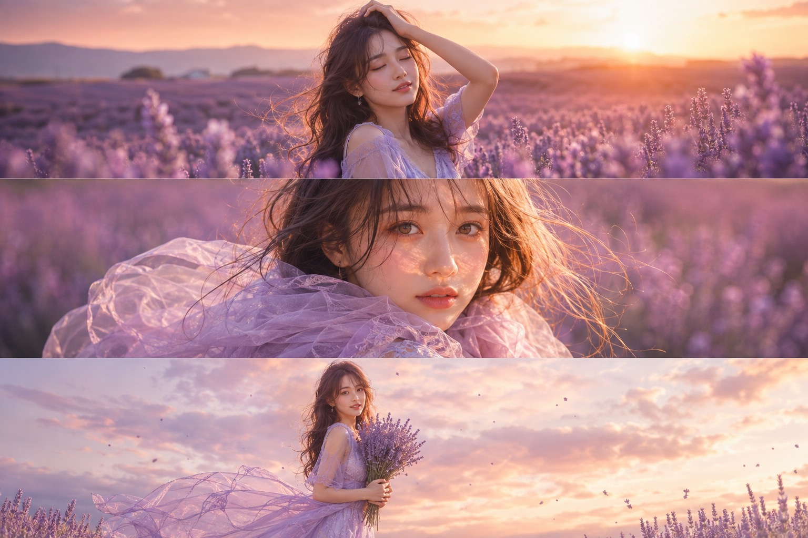

**來源：** [@Naiknelofar788](https://x.com/Naiknelofar788/status/2028417667846341062)

**提示詞：**

```text
[中文]
日出時分薰衣草田中女子的水平三聯畫。
上部：半身像，閉著眼睛，淡紫色連衣裙，一隻手放在頭髮裡，模糊的薰衣草前景。
中部：特寫鏡頭，看著鏡頭，蓬亂的頭髮，薄紗圍巾，臉上的陽光。
下部：四分之三鏡頭，手持薰衣草花束，飄逸的裙子，柔和的粉彩天空，溫暖的夢幻色調。

[English]
Horizontal triptych of a woman in a lavender field at sunrise.
Top: Waist-up, eyes closed, pale lilac dress, one hand in hair, blurred lavender foreground.
Middle: Close-up, looking at camera, tousled hair, sheer scarf, sunlight on face.
Bottom: Three-quarter shot, holding lavender bouquet, flowing skirt, soft pastel sky, warm dreamy tones.
```

***

<a name="case-312"></a>

### 例 312：鮮豔霓虹光影下的動感蘇打水飛濺商業海報

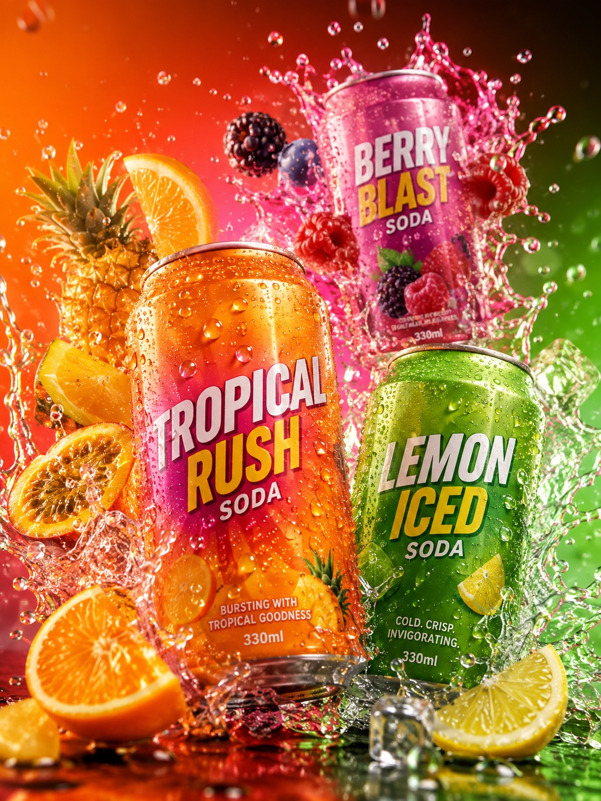

**來源：** [@Fujimoto\_hina](https://x.com/Fujimoto_hina/status/2028388808320819277)

**提示詞：**

```text
[中文]
{
  "prompt": "一個充滿活力的高階廣告構圖中的三個超動態蘇打水罐 —— 一罐熱帶衝刺蘇打水伴隨著戲劇性的水和熱帶水果飛濺而爆炸，鮮豔的橙色和粉色背景光；一罐檸檬冰爽蘇打水在發光的綠色動態光背景下被冷水潑濺；兩罐都覆蓋著逼真的冷凝水和運動模糊的水滴，充滿果味和清爽的能量。深橙色、粉色和霓虹綠燈光在大膽的演播室佈置中融合。由使用佳能 50mm 鏡頭的專業攝影師拍攝，超寫實紋理，清晰的細節，超高解析度，明亮的商業海報美學，豐富的色彩鮮豔度，電影級飛濺效果 --ar 3:4"
}

[English]
{
  "prompt": "Three ultra-dynamic soda cans in one vibrant high-end advertising composition — a can of TROPICAL RUSH exploding with dramatic water and tropical fruit splash, vibrant orange and pink background lighting; a can of LEMON ICED splashed with cold water against a glowing green dynamic light background; both cans covered in realistic condensation and motion-blurred droplets, bursting with fruity, refreshing energy. Deep orange, pink, and neon green lighting blend together in a bold studio setup. Captured by a professional photographer using a Canon 50mm lens, hyper-realistic textures, crisp details, ultra high resolution, bright commercial poster aesthetic, rich color vibrancy, cinematic splash effects --ar 3:4"
}
```

***

<a name="case-313"></a>

### 例 313：電商商品展示設計

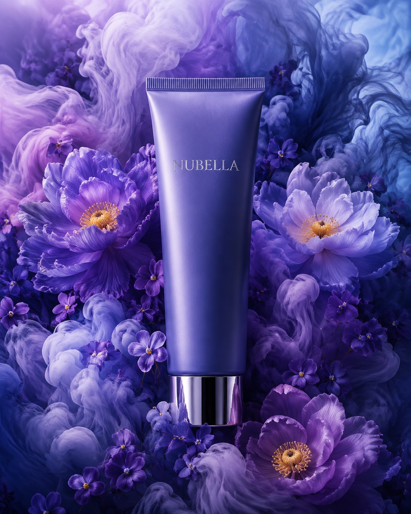

**來源：** [@Fujimoto\_hina](https://x.com/Fujimoto_hina/status/2027903683154088431)

**提示詞：**

```text
[中文]
{
  "style": "超寫實奢華化妝品產品攝影",
  "composition": {
    "color_scheme": "戲劇性的單色藍紫色",
    "resolution": "8K超高解析度",
    "depth": "電影級景深",
    "aesthetic": "高階香氛護膚品廣告風格"
  },
  "product": {
    "type": "軟管包裝",
    "finish": "緞面質感",
    "color": "長春花藍",
    "label": "NUBELLA",
    "typography": "優雅的銀色字型",
    "cap": "反光金屬鉻蓋",
    "position": "垂直居中"
  },
  "surroundings": {
    "smoke": {
      "type": "墨水般的旋渦雲霧",
      "colors": [
        "薰衣草色",
        "靛藍色",
        "冰藍色"
      ],
      "texture": "柔軟、翻騰",
      "interaction": "環繞在產品周圍"
    },
    "flowers": {
      "primary": [
        {
          "color": "紫色",
          "details": "錯綜複雜的花瓣細節",
          "center": "鮮豔的黃色"
        },
        {
          "color": "紫丁香色",
          "details": "錯綜複雜的花瓣細節",
          "center": "鮮豔的黃色"
        }
      ],
      "secondary": {
        "type": "細小的紫羅蘭色花朵",
        "purpose": "增加立體感"
      }
    }
  },
  "lighting": {
    "direction": "來自左上方的柔和定向照明",
    "effects": [
      "突顯軟管的光滑曲度",
      "為金屬蓋增添微妙的光澤",
      "在煙霧中營造深度"
    ]
  },
  "background": {
    "blend": "無縫的冷色調藍色和紫色調",
    "enhancement": "空靈的花香美學"
  },
  "details": "花瓣和蒸汽的超精細紋理"
}

[English]
{
  "style": "Ultra-realistic luxury cosmetic product photography",
  "composition": {
    "color_scheme": "Dramatic monochromatic blue-violet",
    "resolution": "8K ultra-high resolution",
    "depth": "Cinematic depth",
    "aesthetic": "High-end perfumed skincare advertising style"
  },
  "product": {
    "type": "Squeeze tube",
    "finish": "Satin-finish",
    "color": "Periwinkle-blue",
    "label": "NUBELLA",
    "typography": "Elegant silver",
    "cap": "Reflective metallic chrome",
    "position": "Vertically centered"
  },
  "surroundings": {
    "smoke": {
      "type": "Ink-like swirling clouds",
      "colors": [
        "Lavender",
        "Indigo",
        "Icy blue"
      ],
      "texture": "Soft, billowing",
      "interaction": "Wrapping around the product"
    },
    "flowers": {
      "primary": [
        {
          "color": "Purple",
          "details": "Intricate petal details",
          "center": "Vibrant yellow"
        },
        {
          "color": "Lilac",
          "details": "Intricate petal details",
          "center": "Vibrant yellow"
        }
      ],
      "secondary": {
        "type": "Tiny violet blossoms",
        "purpose": "Added dimension"
      }
    }
  },
  "lighting": {
    "direction": "Soft directional lighting from upper left",
    "effects": [
      "Highlights smooth curvature of the tube",
      "Adds subtle sheen to metallic cap",
      "Creates depth within smoke plumes"
    ]
  },
  "background": {
    "blend": "Seamless cool blue and purple tones",
    "enhancement": "Ethereal floral fragrance aesthetic"
  },
  "details": "Hyper-detailed textures of petals and vapor"
}
```

***

<a name="case-314"></a>

### 例 314：紅藍光影下的未來都市雙重曝光青年

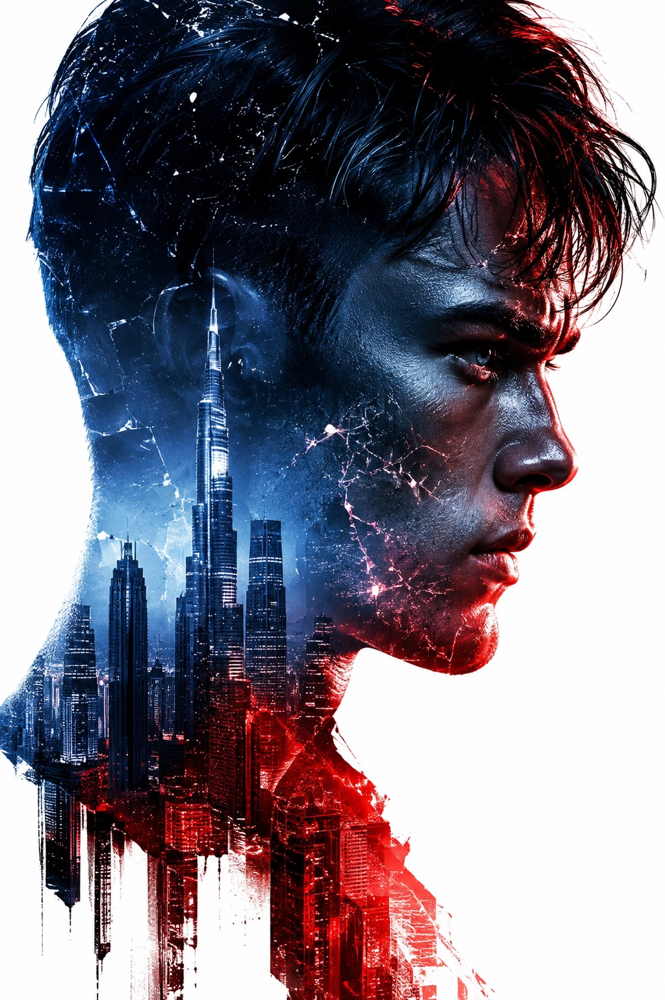

**來源：** [@Fujimoto\_hina](https://x.com/Fujimoto_hina/status/2028045894088630679)

**提示詞：**

```text
[中文]
{
  "prompt": "一位年輕男子的超寫實電影級雙重曝光側臉肖像，表情專注強烈，皮膚紋理細節豐富，眼神銳利。他的面部與從剪影中浮現的未來主義城市天際線無縫融合，摩天大樓和城市建築構成了他的頸部和下頜線。深藍色和鮮豔紅色的強烈對比，象徵著衝突與力量。抽象的數字劃痕、碎裂的玻璃紋理和漏光效果覆蓋在面部，營造出戲劇性的效果。乾淨的白色背景，超精細的燈光，專業電影海報風格，高對比度，清晰聚焦，8K解析度，逼真的髮絲，社論海報構圖，現代平面設計美學，戲劇性的氛圍，超高畫質，照片級真實。",
  "negative_prompt": "模糊，低解析度，扭曲的面部，多餘的肢體，過飽和的顏色，嘈雜的背景，平淡的燈光，卡通化，低細節",
  "resolution": "8K",
  "style": "電影感，雙重曝光，照片級真實感，社論海報",
  "background": "乾淨的白色",
  "lighting": "高對比度，戲劇性的藍紅分割布光"
}

[English]
{
  "prompt": "A hyper-realistic cinematic double exposure portrait of a young man in side profile, intense focused expression, detailed skin texture and sharp eyes. His face seamlessly blended with a futuristic city skyline emerging from his silhouette, skyscrapers and urban buildings forming his neck and jawline. Strong contrast of deep blue and vibrant red tones symbolizing conflict and power. Abstract digital scratches, fractured glass textures, and light leaks overlaying the face for a dramatic effect. Clean white background, ultra-detailed lighting, professional movie poster style, high contrast, sharp focus, 8K resolution, realistic hair strands, editorial poster composition, modern graphic design aesthetics, dramatic mood, ultra-HD, photorealistic.",
  "negative_prompt": "blurry, low resolution, distorted face, extra limbs, oversaturated colors, noisy background, flat lighting, cartoonish, low detail",
  "resolution": "8K",
  "style": "cinematic, double exposure, photorealistic, editorial poster",
  "background": "clean white",
  "lighting": "high contrast, dramatic blue and red split lighting"
}
```

***

<a name="case-315"></a>

### 例 315：棘龍巨口中的酷颯少女與史前奇觀

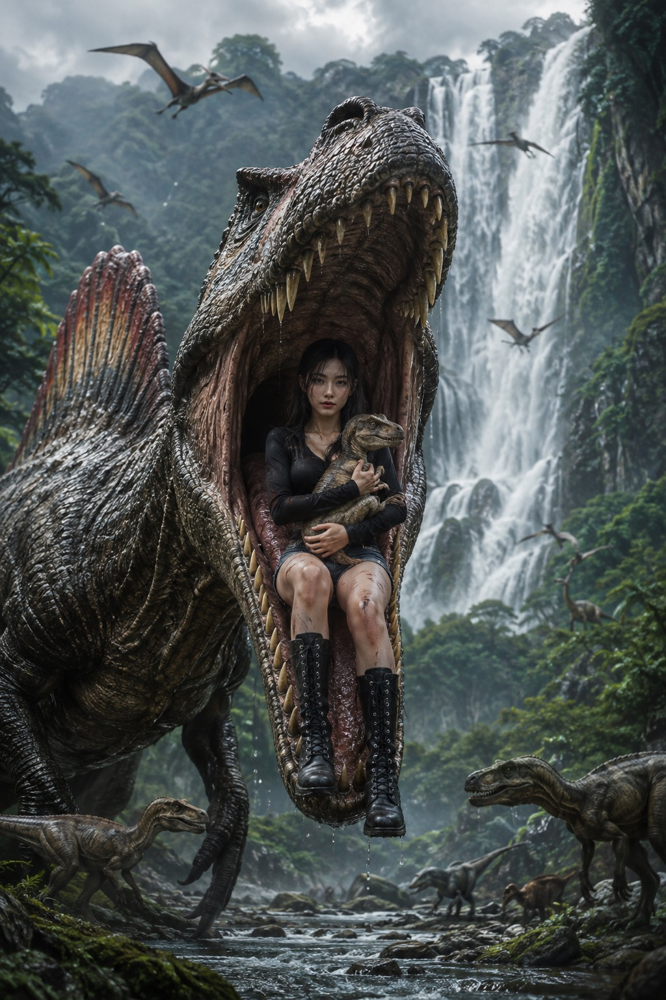

**來源：** [@MrDasOnX](https://x.com/MrDasOnX/status/2028087254757867560)

**提示詞：**

```text
[中文]
超寫實電影級奇幻場景，設定在鬱鬱蔥蔥的史前叢林山谷中。一隻巨大的棘龍站在淺河邊，它那長而類似鱷魚的巨顎張得很大。一位年輕女子平靜地坐在恐龍張開的嘴裡，完美居中，雙腿微微向前懸掛。她有一頭深色直髮，表情鎮定無畏，皮膚紋理逼真。她身穿合身的黑色長袖短款上衣，藍色牛仔短褲和黑色及膝戰術靴。衣服和腿上可見微小的血跡和輕微劃痕，增加了戲劇性的緊張感但並不血腥。她懷裡溫柔地抱著一隻小恐龍幼崽，充滿保護欲地抱著它。

在他們身後，一道高聳而充滿戲劇性的瀑布順著覆蓋著茂密綠色植被和薄霧的陡峭叢林懸崖傾瀉而下。場景中棲息著多隻恐龍：幾隻迅猛龍在河岸邊潛行，小型食草動物在背景中奔跑，飛翔的翼龍在頭頂盤旋。環境豐富，有長滿苔蘚的岩石、流動的河水、熱帶植物和柔和的大氣霧。

燈光具有電影感和自然感，漫射的日光照亮場景，陰影細節豐富，焦點清晰地聚在女子和棘龍身上，背景元素採用淺景深。恐龍鱗片、牙齒、水珠、樹葉和織物上的超寫實紋理。史詩奇幻寫實主義，戲劇性構圖，垂直構圖，超精細，照片級真實感，4K，電影級調色，無文字，無水印。

[English]
Ultra-realistic cinematic fantasy scene set in a lush prehistoric jungle valley. A colossal Spinosaurus stands beside a shallow river, its long crocodile-like jaws stretched wide open. Seated calmly inside the dinosaur’s open mouth is a young woman, perfectly centered, legs hanging slightly forward. She has straight dark hair, a composed fearless expression, and realistic skin texture. She is wearing a fitted black long-sleeve crop top, blue denim shorts, and black knee-high combat boots. Small blood smears and light scratches are visible on her clothes and legs, adding dramatic tension without gore. She gently cradles a small baby dinosaur in her arms, holding it protectively.

Behind them, a tall dramatic waterfall cascades down steep jungle cliffs covered in dense green foliage and mist. Multiple dinosaurs populate the scene: several Velociraptors stalking the riverbank, small herbivores running through the background, and flying pterosaurs circling overhead. The environment is rich with mossy rocks, flowing water, tropical plants, and soft atmospheric fog.

Lighting is cinematic and natural, with diffused daylight illuminating the scene, detailed shadows, sharp focus on the woman and the Spinosaurus, and shallow depth of field for background elements. Hyper-real textures on dinosaur scales, teeth, water droplets, foliage, and fabric. Epic fantasy realism, dramatic composition, vertical framing, ultra-detailed, photorealistic, 4K, cinematic color grading, no text, no watermark.
```

***

<a name="case-316"></a>

### 例 316：衝破次元壁的寫實漫畫跑者

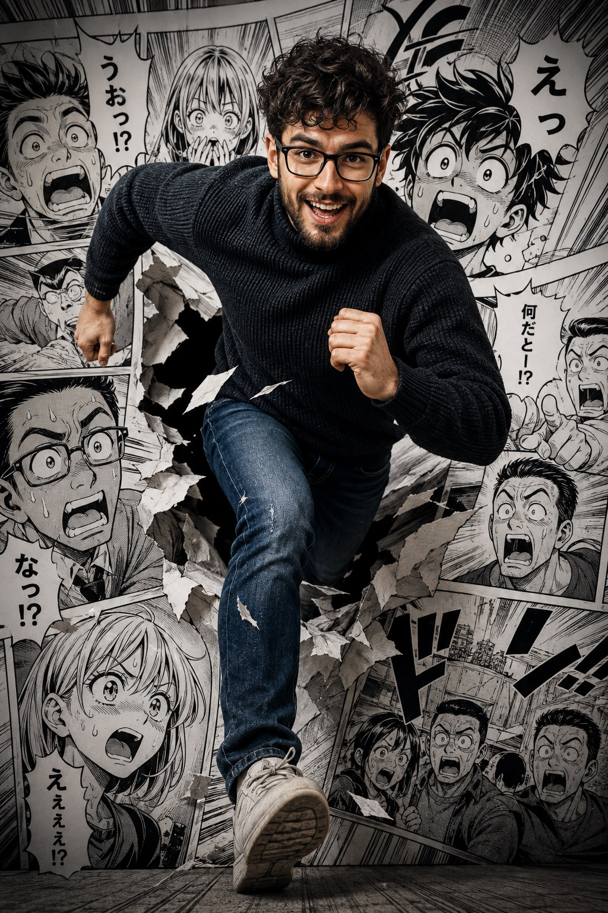

**來源：** [@Fujimoto\_hina](https://x.com/Fujimoto_hina/status/2027748030825500722)

**提示詞：**

```text
[中文]
{
  "prompt": "超寫實，一位留著深色短捲髮、修剪整齊的鬍鬚和黑色方形眼鏡的年輕男子的鮮豔逼真渲染，身穿深色紋理高領毛衣和牛仔褲。他奔跑到一半被捕捉下來，姿態充滿動感，向前突破，充滿戲劇性地從一個破碎的漫畫分鏡框中顯現——一條腿和一隻手臂衝入現實世界，而身體的其餘部分仍留在漫畫框內。他的表情充滿活力和喜悅，擁有銳利的面部細節，自然的皮膚紋理，以及具有高對比度和深度的戲劇性電影燈光。\n\n背景：一個非常詳細的黑白漫畫布局，充滿了幽默、誇張的且與他直接互動的反應場景。周圍的漫畫人物表現出震驚和喜劇的表情，配有粗體的對話氣泡和速度線。漫畫分鏡採用經典的高對比度水墨風格繪製，線條清晰，網點陰影。撕裂的紙張邊緣和碎片增強了他衝破漫畫世界的幻覺。全綵色的寫實人物與單色的漫畫環境形成強烈對比，創造出寫實與漫畫藝術之間的動態混合體。超精細，8k解析度，清晰聚焦，戲劇性的陰影，電影級景深。"
}

[English]
{
  "prompt": "Ultra-realistic, vibrant photorealistic rendering of a young man with short curly dark hair, neatly trimmed beard, and black rectangular glasses, wearing a dark textured turtleneck sweater and jeans. He is captured mid-run in a dynamic, forward-breaking pose, dramatically emerging from a torn manga panel — one leg and one arm bursting into the real world while the rest of his body remains inside the comic frame. His expression is energetic and joyful, with sharp facial details, natural skin texture, and dramatic cinematic lighting with high contrast and depth. \n\nBackground: a highly detailed black-and-white manga layout filled with humorous, exaggerated reaction scenes that directly interact with him. The surrounding manga characters display shocked and comedic expressions, with bold speech bubbles and motion lines. The manga panels are illustrated in a classic high-contrast ink style with crisp linework and halftone shading. Torn paper edges and debris enhance the illusion of him breaking through the comic world. The fully colored, photorealistic figure contrasts strongly against the monochrome manga environment, creating a dynamic hybrid between reality and comic art. Ultra-detailed, 8k resolution, sharp focus, dramatic shadows, cinematic depth of field."
}
```

***

<a name="case-317"></a>

### 例 317：震撼視覺的深紅影棚廣角美妝大片

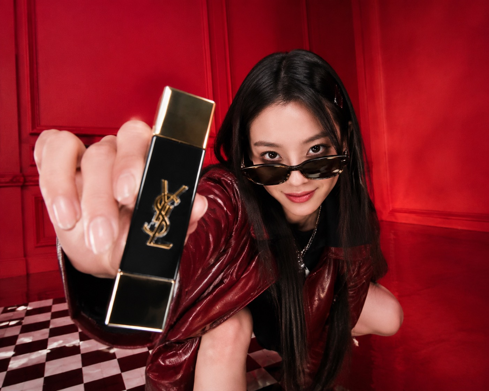

**來源：** [@Maercihh](https://x.com/Maercihh/status/2026941078885310750)

**提示詞：**

```text
[中文]
照片級真實感的大膽美妝宣傳活動，使用上傳的模特作為精確的身份參考。不做面部改變，不做平滑處理。
場景：深紅色飽和的攝影棚環境，具有高對比度的地板圖案或光滑表面。
產品：產品被握持或放置在極其靠近鏡頭的位置，由於透視關係顯得巨大。
模特姿勢：俏皮或自信的微笑，手臂完全伸向相機，手指因廣角鏡頭而略微變形。透過太陽鏡的強烈眼神交流或自然凝視。
相機：超廣角 20–28mm 美學，動態前景誇張，淺至中等景深。
燈光：強有力的商業照明，具有清晰的高光和反射，銳利的包裝邊緣，充滿活力的調色。超精細的皮膚紋理和織物真實感。

[English]
Photorealistic bold beauty campaign using uploaded model as exact identity reference. No facial changes, no smoothing.
Scene: deep red saturated studio environment with high-contrast floor pattern or glossy surface.
Product: the product held or positioned extremely close to the lens, appearing large due to perspective.
Model pose: playful or confident smile, arm fully extended toward camera, fingers slightly distorted by wide lens. Strong eye contact through sunglasses or natural gaze.
Camera: ultra-wide 20–28mm aesthetic, dynamic foreground exaggeration, shallow-to-medium depth of field.
Lighting: punchy commercial lighting with defined highlights and reflections, crisp packaging edges, vibrant color grading. Hyper-detailed skin texture and fabric realism.
```

***

<a name="case-318"></a>

### 例 318：珊瑚色極簡影棚時尚商業大片

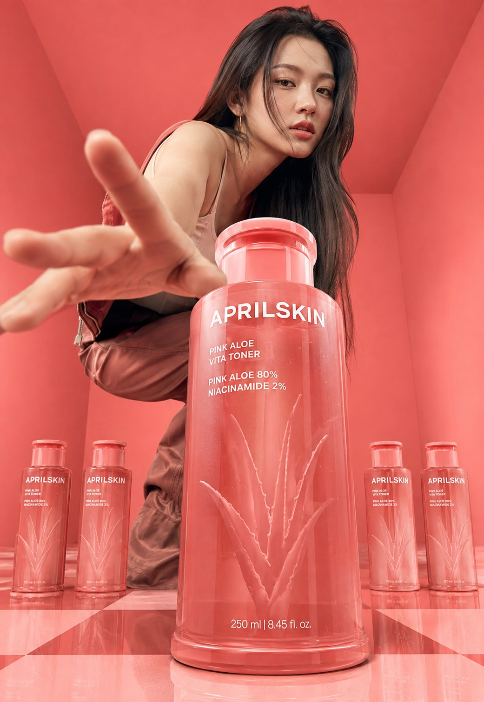

**來源：** [@Maercihh](https://x.com/Maercihh/status/2026941078885310750)

**提示詞：**

```text
[中文]
超寫實高階時尚商業廣告大片，使用上傳的模特照片作為嚴格的身份參考。保留精確的面部特徵、比例和自然皮膚紋理——無修圖，無變形。場景：珊瑚色單色工作室盒，配有光澤反光棋盤格或極簡拋光地板。擁有柔和光線漸變的乾淨幾何牆壁。產品：產品放置在前景中心超大位置，因廣角透視而佔據畫面主導地位。包裝超清晰，文字完全可讀，具有逼真的反射和材質紋理。較小的產品單元可對稱放置在背景中。模特姿勢：站在產品後方，微蹲或前傾，一隻手伸向鏡頭以創造深度感。強烈自信的表情，時尚態度。相機：低角度 24-35mm 鏡頭感，戲劇性透視畸變，對產品和模特都進行深焦處理。燈光：明亮的商業影棚燈光，柔和陰影，包裝上有光澤高光，高階廣告成片質感。4K–8K 寫實主義，無水印，無嵌入式文字。縱橫比 9:13

[English]
Ultra-realistic high-fashion commercial campaign using the uploaded model photo as strict identity reference. Preserve exact facial features, proportions and natural skin texture — no retouching, no reshaping.
Scene: coral monochrome studio box with glossy reflective checker or minimal polished floor. Clean geometric walls with soft light gradients.
Product: the product placed oversized in the center foreground, dominating the frame due to wide-angle perspective. The packaging is ultra-sharp, fully readable, realistic reflections and material texture. Smaller product units can be placed symmetrically in the background.
Model pose: standing behind the product, slightly crouched or leaning forward, one hand reaching toward the camera to create depth. Strong confident expression, fashion attitude.
Camera: low-angle 24–35mm lens look, dramatic perspective distortion, deep focus on both product and model.
Lighting: bright commercial studio lighting, soft shadows, glossy highlights on packaging, high-end campaign finish. 4K–8K realism, no watermark, no embedded text.i ar 9:13
```

***

<a name="case-319"></a>

### 例 319：鳥群織就的夢幻高定時裝秀

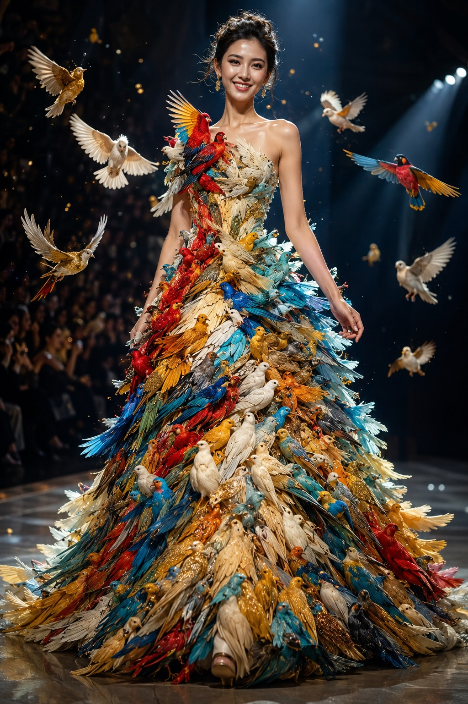

**來源：** [@MrDasOnX](https://x.com/MrDasOnX/status/2026284342549340190)

**提示詞：**

```text
[中文]
一個充滿趣味的高階時裝T臺場景，主角是一位自信的女性，正走在奢華時裝秀的T臺上，身穿一件完全由鳥類製成的非凡高階定製禮服。數百隻優雅、色彩鮮豔的鳥類構成了飄逸的雕塑感禮服形狀，像活著的羽毛一樣層疊，翅膀微微張開，營造出布料和運動的錯覺。一些鳥兒在她周圍輕輕升入空中，捕捉于飛行瞬間，增添了神奇、超現實的運動感。鳥兒們展現出豐富多樣的色彩——彩虹般的藍色、光芒四射的紅色、金黃色和柔和的白色——擁有錯綜複雜的羽毛細節和自然紋理。她在邁步間擺出姿勢，帶著快樂、自信的表情，富有表現力的眼睛，以及精緻的T臺妝容。戲劇性的舞臺燈光配以發光的高光，黑暗模糊的觀眾背景，電影級的景深，奇幻現實主義，超精細紋理，高對比度，清晰聚焦，奇思妙想的奢華時裝秀，超現實主義高階定製，4K解析度，專業調色。

[English]
A playful high-fashion runway scene featuring a confident woman walking a luxury fashion show catwalk, wearing an extraordinary couture dress made entirely of birds. Hundreds of elegant, vividly colored birds form the shape of a flowing, sculptural gown, layered like living feathers, with wings partially spread to create the illusion of fabric and motion. Some birds lift gently into the air around her, captured mid-flight, adding a magical, surreal sense of movement. The birds display a rich variety of colors — iridescent blues, radiant reds, golden yellows, and soft whites — with intricate feather details and natural textures. She poses mid-stride with a joyful, confident expression, expressive eyes, and refined runway makeup. Dramatic stage lighting with glowing highlights, dark blurred audience background, cinematic depth of field, fantasy realism, ultra-detailed textures, high contrast, sharp focus, whimsical luxury fashion show, surreal couture, 4K resolution, professional color grading.
```

***

<a name="case-320"></a>

### 例 320：冰火雙雄背靠背史詩電影海報

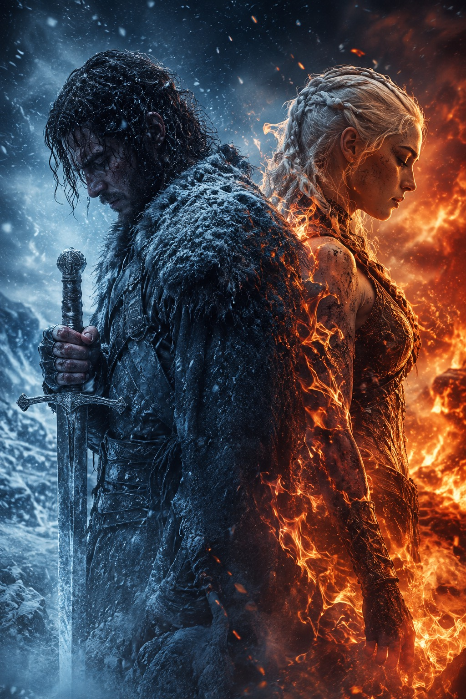

**來源：** [@Naiknelofar788](https://x.com/Naiknelofar788/status/2025972876554510482)

**提示詞：**

```text
[中文]
一幅戲劇性的電影海報風格肖像，描繪了兩位史詩奇幻戰士在冰凍風暴中背靠背站立。左側是一位身經百戰的男性戰士，留著溼漉漉的深色捲髮，低頭以此表達堅定的決心，緊握著一把插在冰裡的中世紀長劍。霜雪附著在他毛皮鑲邊的斗篷和肩膀上。右側是一位強有力的女性戰士側影，蒼白的皮膚在熾熱的橙色光芒下閃耀，她的身體部分被火焰吞沒，與冰冷的藍色氛圍形成對比。雪花粒子在空中盤旋，在象徵性的衝突中融合了火與冰。超精細的面部細節，情感強度，體積霧，電影級布光，冷藍色調混合溫暖的火焰高光，淺景深，史詩奇幻電影海報，超寫實，8K解析度，戲劇性構圖，清晰聚焦，高對比度，逼真紋理。

[English]
A dramatic cinematic poster-style portrait of two epic fantasy warriors standing back-to-back in a frozen storm. On the left, a battle-worn male warrior with wet, curly dark hair, head bowed in quiet resolve, gripping a medieval sword planted into the ice. Frost and snow cling to his fur-lined cloak and shoulders. On the right, a powerful female warrior in profile, pale skin glowing with fiery orange light, her body partially engulfed in flames thatcontrast against the icy blue atmosphere. Snow particles swirl through the air, blending fire and ice in a symbolic clash. Ultra-detailed faces, emotional intensity, volumetric fog, cinematic lighting, cold blue tones mixed with warm fire highlights, shallow depth of field, epic fantasy movie poster, hyper-realistic, 8K resolution, dramatic composition, sharp focus, high contrast, photorealistic textures.
```

***

<a name="case-321"></a>

### 例 321：都市落日時尚大片

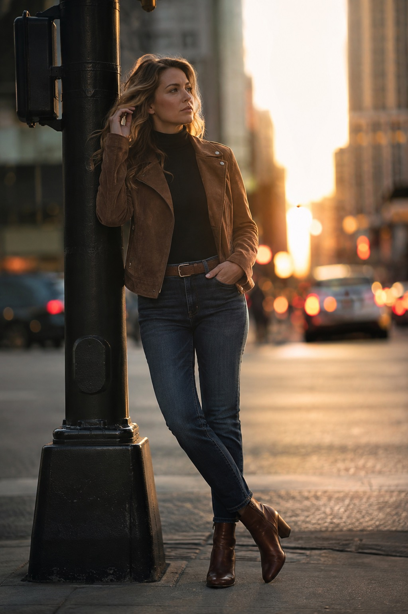

**來源：** [OpenNana](https://opennana.com/awesome-prompt-gallery/urban-sunset-fashion-silhouette)

**提示詞：**

```text
[中文]
一張超現實電影感時尚照片，一位二十出頭驚豔的年輕女性，全身可見，站在現代城市中心，黃金時段。
她隨意地單肩靠在交通訊號燈杆上，沒有意識到相機的存在，彷彿這一刻是自然捕捉的。
她穿著緊身藍色牛仔褲、棕色皮靴，以及一件短款棕色麂皮夾克，帶有柔軟羊皮翻領。夾克下，一件極簡深色露臍上衣，隱約露出精緻的乳溝和緊緻的腹部。

她的體型天生女性化，均衡而優雅，姿態自信。
一隻手穿過她豐盈的淺棕色長髮，將其向後撩起，頭部微微轉向那一側，眼睛自然地看向別處，沒有擺拍。

膚色為輕微日曬後的奶油般柔和光澤，真實肌膚紋理，細膩毛孔與高光——毫無塑膠感。
妝容醒目卻精緻：清晰的眼部、濃密睫毛、立體腮紅、柔和修容，以及自然光澤唇——具備高階美妝廣告質感。
光線為溫暖金色時段陽光，包裹她的輪廓與髮絲，營造柔和高光與電影感對比。
背景為城市街道，汽車與都市燈光以強烈散景呈現，淺景深——焦點鎖定在女性身上。

使用全畫幅電影攝影機拍攝，85mm鏡頭，f/1.8，超現實細節，高動態範圍，電影級調色，膠片質感，頂級時尚大片美學，高預算電影劇照氛圍。

[English]
A hyper-realistic cinematic fashion photograph of a stunning young woman in her early 20s, full body visible, standing in a modern city center during golden hour.
She leans casually with one shoulder against a traffic light pole, unaware of the camera, as if the moment was captured naturally.
She wears skinny blue jeans, brown leather boots, and a cropped brown suede jacket with a soft shearling collar. Under the jacket, a minimal dark crop top reveals a subtle cleavage and toned midriff.

Her physique is naturally feminine, balanced and elegant, with confident posture.
One hand runs through her long, voluminous curly light-brown hair, lifting it back in motion. Her head is turned slightly toward that side, eyes looking away naturally, not posing.

Skin tone is lightly sun-kissed with a soft creamy glow, realistic skin texture, subtle pores and highlights — no plastic look.
Makeup is striking but refined: defined eyes, bold lashes, sculpted cheeks, soft contour, and natural glossy lips — editorial beauty campaign quality.
Lighting is warm golden hour sunlight, wrapping around her silhouette and hair, creating soft highlights and cinematic contrast.
Background is an urban street with cars and city lights rendered in strong bokeh, shallow depth of field — focus locked on the woman.

Shot on a full-frame cinema camera, 85mm lens, f/1.8, ultra-realistic detail, high dynamic range, cinematic color grading, film-like tones, premium fashion editorial aesthetic, high-budget movie still feeling.
```

***

<a name="case-322"></a>

### 例 322：街頭炫瓶男模

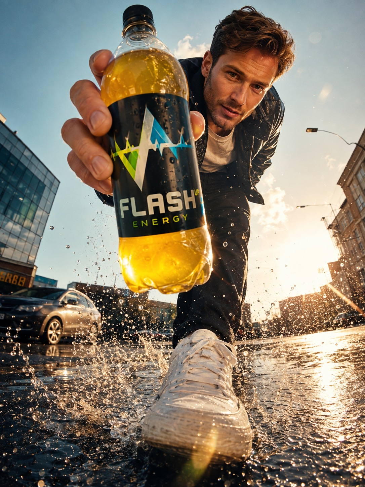

**來源：** [@ecommartinez](https://x.com/ecommartinez/status/2017311074551533921)

**提示詞：**

```text
[中文]
專業照片，一位男士，30歲的俄羅斯模特（參考影象），正對著鏡頭，向相機傾斜，從下往上拍攝，使用廣角鏡頭。男士傾斜著身體，近距離將一瓶飲料展示給鏡頭，一隻手拿著瓶子，緊貼在鏡頭前。瓶子的標籤和方向保持筆直，以便標籤清晰可讀。他穿著白色運動鞋，一隻腳在鏡頭前方。男士站在街道上，溼漉漉的瀝青和飛濺的水花從下方拍出。鮮豔的色彩，電影級燈光，光線從後方打在模特的臉上。--v7 --ar 3:4 --style raw

[English]
Professional photo, a guy, a 30-year-old Russian model (reference image), is facing the lens, tilted towards the camera, angle from below, shot with a wide-angle lens. The guy is tilted and shows a bottle close-up to the camera, a hand with a bottle close-up right in front of the lens. The label and direction of the bottle are straight so the label is readable. He's wearing white sneakers, one foot in front of the camera. The guy is standing on the street, wet asphalt and splashes from below. Bright colors, cinematic lighting, the light is behind and on the model’s face. --v7 --ar 3:4 --style raw
```

***

<a name="case-323"></a>

### 例 323：應用介面樣機圖

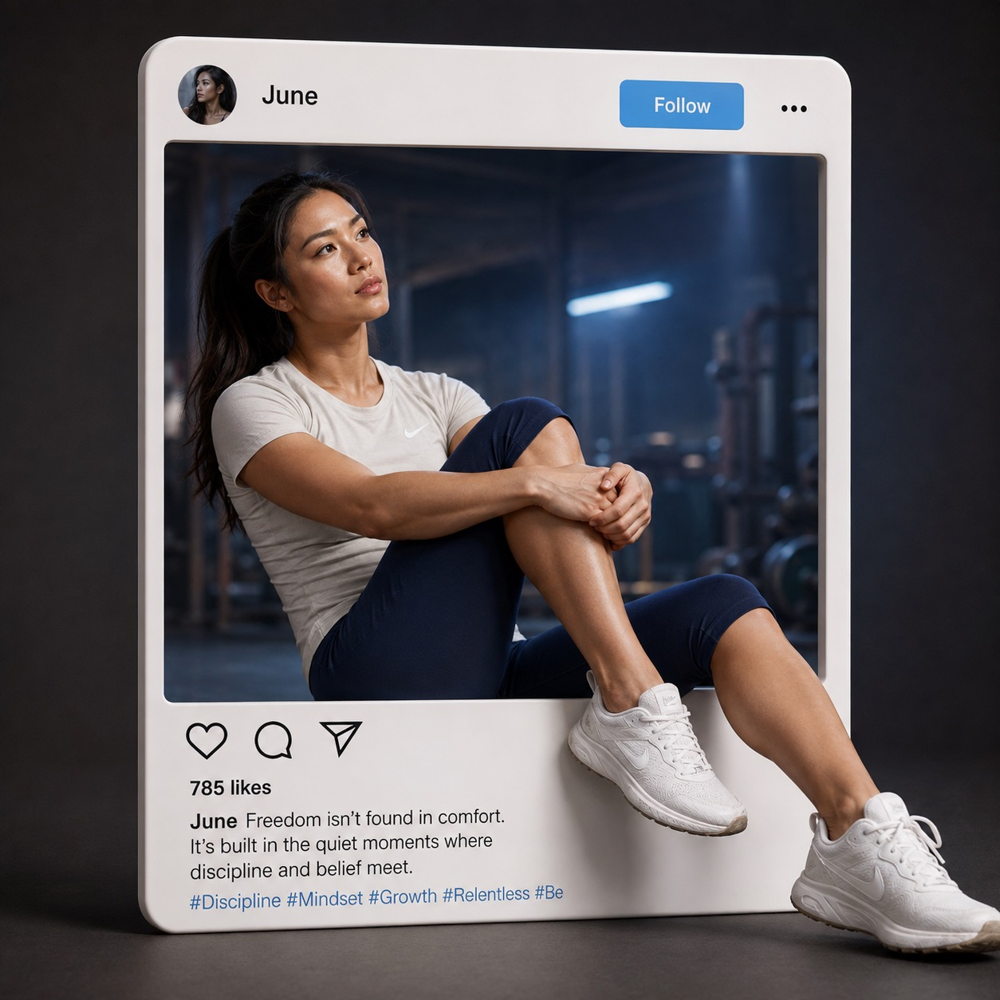

**來源：** [@Mystveil7](https://x.com/Mystveil7/status/2015776042989039997)

**提示詞：**

```text
Create a hyper-realistic, cinematic Instagram post layout where the Instagram UI exists as a physical, tangible 3D object, photographed like a premium commercial product shot. The result should feel indistinguishable from a real studio photograph.
Instagram Frame (UI Accuracy – Critical)
Authentic Instagram interface rendered as a solid white physical 3D card
Smooth matte plastic surface with subtle micro-texture
Slight thickness visible on edges, realistic bevels
Perfectly rounded corners (exact Instagram radius)
Soft studio reflections and realistic edge highlights
Top Bar (Pixel-accurate UI):
Circular profile avatar on the left
Username text: “June” in Instagram’s default bold UI font
Light blue FOLLOW button with correct proportions
Three-dot menu icon aligned to the far right
Exact spacing, typography, and icon sizing matching the real Instagram app
Aspect ratio 1:1, centered, balanced, premium composition.
Main Subject (Pose – Match Reference Image Exactly)
A photorealistic athletic woman partially emerging out of the Instagram frame into real 3D space
Seated pose identical to the reference image:
Both legs bent and angled to the side
One knee slightly raised and closer to the chest
Arms gently wrapped around the raised knee
Hands relaxed, fingers naturally resting
Torso leaning slightly back against the frame edge
Expression: calm, thoughtful, self-assured
Gaze: looking slightly to the side and upward, not engaging the camera
Natural body proportions, relaxed posture, editorial realism
No exaggerated curves, no artificial posing
Clothing (Nike Only – Realistic Fit)
Muted ivory / off-white Nike fitted short-sleeve blouse
Soft neutral tone that contrasts beautifully with the background
Visible white Nike swoosh
Natural fabric stretch and tension
Deep blue Nike athletic pants, length up to the knee
Tailored, performance-fit silhouette
Realistic fabric weight with subtle folds at the knee bend
Clean stitching and breathable sports material
Clean white Nike sneakers
Slight wear realism
Correct sole texture and stitching
Premium sportswear look, real commercial styling
No distortion, no fantasy fashion
Background (Inside the Instagram Post Only)
Dark indoor gym or studio environment
Cool blue and muted purple cinematic lighting
Soft haze in the background
Subtle volumetric light beams barely visible
Shallow depth of field, background softly blurred
Subject and Instagram frame remain sharp and dominant
Lighting & Photorealism
Studio-grade cinematic lighting
Soft key light illuminating the subject naturally
Gentle rim light outlining the body and Instagram frame
Realistic skin texture with visible pores and natural highlights
Accurate contact shadows where the subject touches the frame
Physically correct light falloff and reflections
Footer UI (Engagement Section)
Instagram action icons: like, comment, share, save (accurate icons)
Text visible: “785 likes”
Caption begins with June
Caption text:
Freedom isn’t found in comfort.
It’s built in the quiet moments where discipline meets belief.
Hashtags partially visible and naturally cropped
Overall Style & Quality
Ultra-high resolution
Advertising-grade realism
Clean, modern, editorial Instagram aesthetic
Hyper-realistic blend of 3D object + real photography
No extra elements
No text errors
No distortion
Looks like a real product photoshoot, not AI art
```

***

<a name="case-324"></a>

### 例 324：復古巴士上的紅風衣女郎

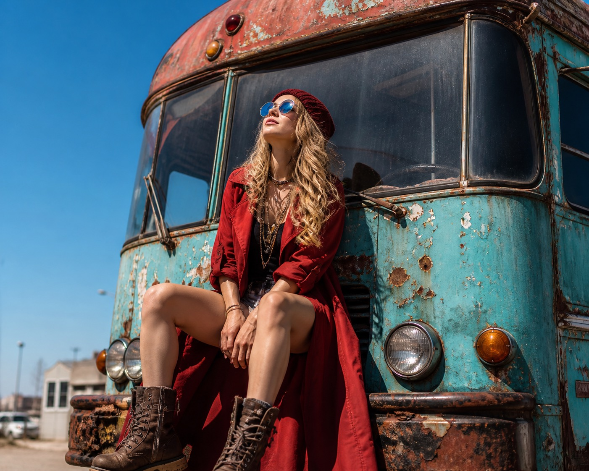

**來源：** [@iamsofiaijaz](https://x.com/iamsofiaijaz/status/2015337737860403283)

**提示詞：**

```text
[中文]
一位時尚年輕女子坐在老式復古巴士的前緣，身穿紅色長風衣、羊毛無簷小便帽、圓形藍色反光太陽鏡、疊層項鍊和粗獷的棕色皮靴。她有著波浪狀金髮，帶著自信而夢幻的表情，仰望天空。巴士漆面剝落，呈青綠色與鐵鏽紅色調。明亮清澈的藍天，城市背景建築極少，柔和日光，電影級色彩分級，淺景深，高階時尚旅行氛圍，編輯攝影，超寫實，4K解析度，銳利對焦，自然肌膚質感，戲劇性構圖，電影靜幀美學。

[English]
A stylish young woman sitting on the front edge of an old vintage bus, wearing a long red trench coat, woolen beanie cap, round blue reflective sunglasses, layered necklaces, and rugged brown leather boots. She has wavy blonde hair and a confident, dreamy expression, looking upward toward the sky. The bus is weathered with peeling paint in turquoise and rust red tones.Bright clear blue sky, urban background with minimal buildings, soft daylight, cinematic color grading, shallow depth of field, high fashion travel vibe, editorial photography, ultra-realistic, 4K resolution, sharp focus, natural skin texture, dramatic composition, film still aesthetic.
```

***

<a name="case-325"></a>

### 例 325：皮克斯風陽光少年

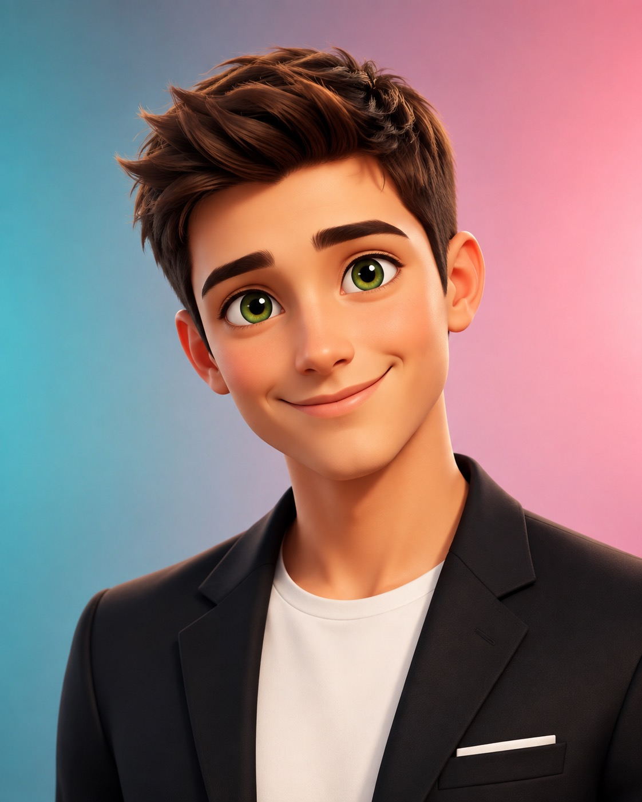

**來源：** [@iamsofiaijaz](https://x.com/iamsofiaijaz/status/2013473309485343120)

**提示詞：**

```text
[中文]
一個風格化的3D卡通肖像，一位年輕男子，擁有短棕發和富有表現力的綠色眼睛，溫暖地微笑。他穿著黑色西裝外套內搭白色T恤，現代休閒時尚。類似皮克斯/迪士尼風格角色設計，皮膚光滑，柔和光照，略微誇張的面部特徵。高細節、精美的3D渲染，友好且平易近人的表情。漸變背景為柔和的藍綠色和粉色，工作室燈光，淺景深，高解析度。

[English]
A stylized 3D cartoon portrait of a young man with short brown hair and expressive green eyes, smiling warmly. He is wearing a black blazer over a white t-shirt, modern casual fashion. Pixar-like / Disney-style character design with smooth skin, soft lighting, and slightly exaggerated facial features. High detail, polished 3D render, friendly and approachable expression. Gradient background with soft teal and pink colors, studio lighting, shallow depth of field, high resolution.
```

***

<a name="case-326"></a>

### 例 326：紅藍撞色高跟誘惑

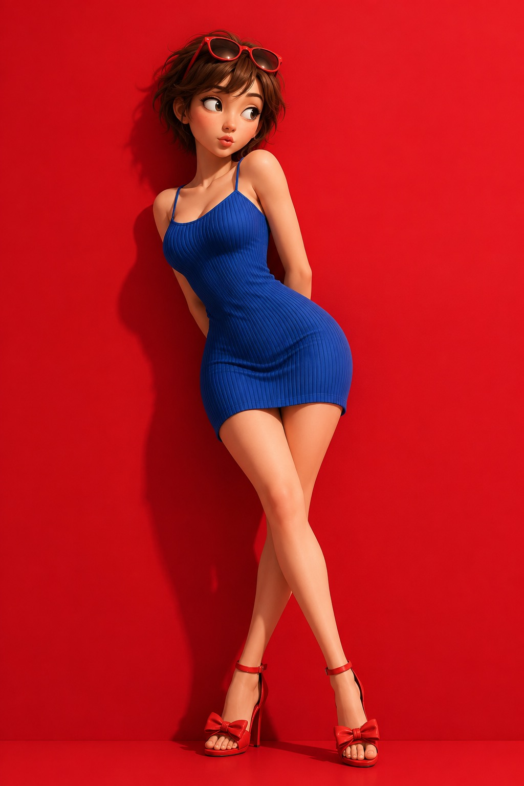

**來源：** [@meng\_dagg695](https://x.com/meng_dagg695/status/2012437899955097836)

**提示詞：**

```text
[中文]
{
  "global_settings": {
    "resolution": "8K",
    "quality": "超高畫質晰度",
    "aspect_ratio": "2:3",
    "render_style": "AI編輯、高細節3D渲染",
    "lighting_quality": "柔和影棚光與逼真陰影",
    "sharpness": "極致清晰、銳利邊緣",
    "noise": "無",
    "compression": "無"
  },
  "image_style": {
    "subject": {
      "character_type": "風格化3D卡通女性",
      "pose": "微微後仰靠在背景上",
      "expression": "俏皮、嘴唇輕撅、眼睛斜視",
      "hair": {
        "color": "棕色",
        "style": "短髮、凌亂",
        "accessories": "紅色太陽鏡架在頭頂"
      }
    },
    "clothing": {
      "dress": "貼身藍色羅紋吊帶裙",
      "footwear": "紅色高跟涼鞋配蝴蝶結"
    },
    "color_palette": [
      "大膽紅色",
      "深藍"
    ],
    "background": {
      "color": "純紅色",
      "texture": "光滑啞光表面"
    },
    "lighting": {
      "direction": "一側柔和定向光",
      "shadow": "在紅色背景上投下清晰影子"
    },
    "composition": {
      "framing": "全身",
      "pose_emphasis": "彎曲身姿、交叉雙腿"
    }
  }
}

[English]
{
  "global_settings": {
    "resolution": "8K",
    "quality": "ultra-high definition",
    "aspect_ratio": "2:3",
    "render_style": "AI-edited, high-detail 3D render",
    "lighting_quality": "soft studio lighting with realistic shadows",
    "sharpness": "extreme clarity, crisp edges",
    "noise": "none",
    "compression": "none"
  },
  "image_style": {
    "subject": {
      "character_type": "stylized 3D cartoon female",
      "pose": "leaning slightly backward against background",
      "expression": "playful, lips slightly pursed, eyes looking sideways",
      "hair": {
        "color": "brown",
        "style": "short, tousled",
        "accessories": "red sunglasses resting on head"
      }
    },
    "clothing": {
      "dress": "form-fitting blue ribbed dress with thin straps",
      "footwear": "red high-heel sandals with bow detail"
    },
    "color_palette": [
      "bold red",
      "deep blue"
    ],
    "background": {
      "color": "solid red",
      "texture": "smooth matte surface"
    },
    "lighting": {
      "direction": "soft directional light from one side",
      "shadow": "defined shadow cast on red background"
    },
    "composition": {
      "framing": "full body",
      "pose_emphasis": "curved posture, crossed legs"
    }
  }
}
```

***

<a name="case-327"></a>

### 例 327：沉香玫瑰懸浮幻景

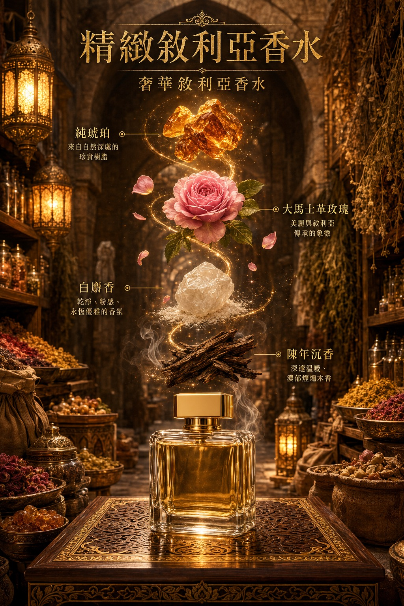

**來源：** [@meng\_dagg695](https://x.com/meng_dagg695/status/2011334627290726746)

**提示詞：**

```text
[中文]
{
  "master_prompt_type": "超精細8K AI影象生成",
  "global_settings": {
    "resolution": "8K UHD",
    "aspect_ratio": "2:3 豎版",
    "render_quality": "極致銳度、超微細節、電影級光效",
    "style": "超現實商業產品攝影",
    "color_profile": "溫暖金調搭配柔和琥珀高光",
    "environment": {
      "location": "古老中東市場走廊",
      "architecture": {
        "walls": "歲月痕跡的粗糙石牆與可見紋理",
        "arches": "背景巨型石拱",
        "floor": "暖棕色石材地面"
      },
      "background_elements": [
        "裝滿香料的木架",
        "袋裝與碗裝乾貨",
        "懸掛草藥束",
        "散發暖黃光的傳統金屬燈籠"
      ],
      "lighting": {
        "primary": "柔和金色環境光",
        "secondary": "兩側暖燈籠輝光",
        "atmosphere": "薄霧增強光線漫射"
      }
    },
    "main_subject": {
      "type": "香水瓶",
      "position": "中心前景",
      "placement": "置於華麗木桌之上",
      "material": {
        "bottle": "透明清玻璃",
        "cap": "黃金金屬矩形瓶蓋",
        "liquid": "淡金香水液體"
      },
      "design": {
        "shape": "圓角矩形瓶身",
        "finish": "高光反射表面",
        "label": "無可見標籤"
      },
      "table": {
        "material": "深色雕花木材",
        "shape": "方形檯面",
        "details": [
          "繁複花卉與幾何雕刻",
          "金色鑲嵌裝飾",
          "拋光表面映光"
        ]
      },
      "floating_elements": {
        "composition_style": "豎向成分堆疊",
        "motion": "成分懸浮並伴隨旋轉金光",
        "effects": [
          "發光粒子",
          "閃耀塵埃",
          "柔光尾跡連線元素"
        ],
        "elements_order_top_to_bottom": [
          {
            "ingredient": "琥珀樹脂",
            "appearance": "半透明金棕樹脂塊",
            "glow": "溫暖內發光"
          },
          {
            "ingredient": "大馬士革玫瑰",
            "appearance": "盛放粉色玫瑰",
            "details": [
              "柔軟層疊花瓣",
              "自然綠葉",
              "輕飄附近花瓣"
            ]
          },
          {
            "ingredient": "白麝香",
            "appearance": "光滑白水晶狀石塊",
            "additional": "石下細白粉末"
          },
          {
            "ingredient": "陳年沉香",
            "appearance": "深棕木片",
            "texture": "粗糙纖維木紋",
            "effect": "縷縷白煙上升"
          }
        ]
      },
      "text_elements": {
        "title": {
          "text": "精緻敘利亞香水",
          "font_style": "優雅襯線體",
          "color": "金色",
          "position": "頂部中央"
        },
        "subtitle": {
          "text": "奢華敘利亞香水",
          "font_style": "較小襯線體",
          "color": "金色",
          "position": "主標題下方"
        },
        "ingredient_labels": [
          {
            "title": "純琥珀",
            "description": "來自自然深處的珍貴樹脂"
          },
          {
            "title": "大馬士革玫瑰",
            "description": "美麗與敘利亞傳承的象徵"
          },
          {
            "title": "白麝香",
            "description": "乾淨、粉感、永恆優雅的香氛"
          },
          {
            "title": "陳年沉香",
            "description": "深邃溫暖、濃郁煙燻木香"
          }
        ],
        "typography_details": {
          "connector_lines": "細彎金線連線文字與成分",
          "icons": "線末端小圓點標記"
        },
        "opacity": "輕微半透明"
      }
    },
    "overall_mood": {
      "tone": "奢華、溫暖、優雅",
      "theme": "傳承香水工藝",
      "visual_feel": "濃郁、高階、電影級廣告"
    }
  }
}

[English]
{
  "master_prompt_type": "Ultra-detailed 8K AI image generation",
  "global_settings": {
    "resolution": "8K UHD",
    "aspect_ratio": "2:3 vertical",
    "render_quality": "extreme sharpness, ultra-fine detail, cinematic lighting",
    "style": "hyper-realistic commercial product photography",
    "color_profile": "warm golden tones with soft amber highlights",
    "environment": {
      "location": "ancient Middle Eastern market corridor",
      "architecture": {
        "walls": "aged stone walls with visible texture and wear",
        "arches": "large stone archway in background",
        "floor": "stone flooring, warm brown tone"
      },
      "background_elements": [
        "wooden shelves filled with spices",
        "sacks and bowls of dried goods",
        "hanging bundles of herbs",
        "traditional metal lanterns emitting warm yellow light"
      ],
      "lighting": {
        "primary": "soft golden ambient light",
        "secondary": "warm lantern glow from both sides",
        "atmosphere": "slight haze enhancing light diffusion" "main_subject": {
          "type": "perfume bottle",
          "position": "center foreground",
          "placement": "on top of an ornate wooden table",
          "material": {
            "bottle": "transparent clear glass",
            "cap": "gold metallic rectangular cap",
            "liquid": "light golden perfume liquid"
          },
          "design": {
            "shape": "rectangular bottle with rounded edges",
            "finish": "glossy reflective surface",
            "label": "no visible label" "table": {
              "material": "dark carved wood",
              "shape": "square top",
              "details": [
                "intricate floral and geometric carvings",
                "golden inlay accents",
                "polished surface reflecting light" "floating_elements": {
                  "composition_style": "vertical ingredient stack",
                  "motion": "ingredients appear suspended with swirling golden light",
                  "effects": [
                    "glowing particles",
                    "sparkling dust",
                    "soft light trails connecting elements"
                  ],
                  "elements_order_top_to_bottom": [
                    {
                      "ingredient": "amber resin",
                      "appearance": "translucent golden-brown resin chunks",
                      "glow": "warm internal glow" "ingredient": "damask rose",
                      "appearance": "fully bloomed pink rose",
                      "details": [
                        "soft layered petals",
                        "natural green leaves",
                        "petals gently floating nearby"
                      ] "ingredient": "white musk",
                      "appearance": "smooth white crystal-like stone",
                      "additional": "fine white powder beneath the stone" "ingredient": "aged agarwood",
                      "appearance": "dark brown wooden pieces",
                      "texture": "rough, fibrous wood grain",
                      "effect": "thin white smoke rising upward" "text_elements": {
                        "title": {
                          "text": "Exquisite Syrian Perfume",
                          "font_style": "elegant serif",
                          "color": "gold",
                          "position": "top center"
                        },
                        "subtitle": {
                          "text": "Luxury Syrian Perfume",
                          "font_style": "smaller serif",
                          "color": "gold",
                          "position": "below main title"
                        },
                        "ingredient_labels": [
                          {
                            "title": "Pure Amber",
                            "description": "Precious resin from the depths of nature"
                          } "title": "Damask Rose",
                          "description": "Symbol of beauty and Syrian heritage"
                        },
                        {
                          "title": "White Musk",
                          "description": "Clean, powdery scent of timeless elegance"
                        },
                        {
                          "title": "Aged Agarwood",
                          "description": "Rich, smoky wood with deep warmth"
                        }
                      ],
                      "typography_details": {
                        "connector_lines": "thin curved golden lines connecting text to ingredients",
                        "icons": "small circular markers at line endpoints"
                      } "opacity": "slightly translucent"
                    } "overall_mood": "tone": "luxurious, warm, elegant",
                    "theme": "heritage perfume craftsmanship",
                    "visual_feel": "rich, premium, cinematic ads
```

***

<a name="case-328"></a>

### 例 328：俯拍巨女城景自拍

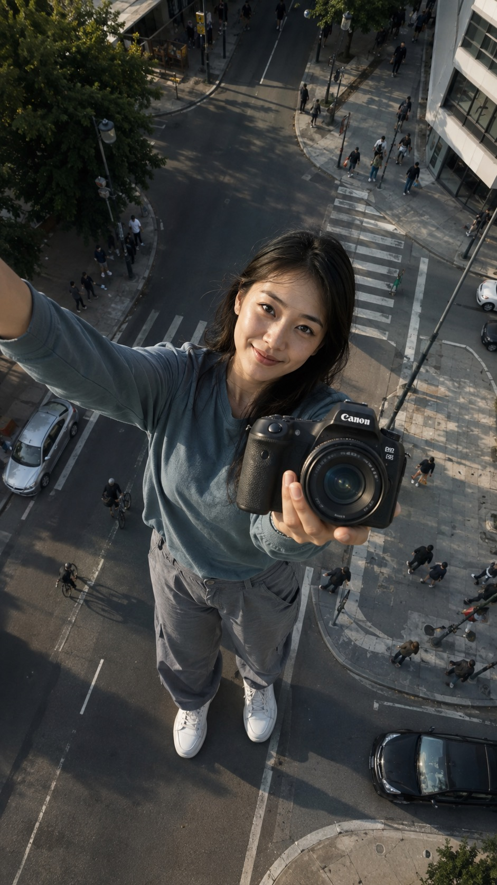

**來源：** [@saniaspeaks\_](https://x.com/saniaspeaks_/status/2009834337043394622)

**提示詞：**

```text
[中文]
{
  "type": "影象生成提示詞",
  "language": "zh",
  "style": "超現實電影感自拍攝影",
  "aspect_ratio": "9:16",
  "identity_preservation": {
    "use_reference_image": true,
    "strict_identity_lock": true,
    "alter_face": false,
    "alter_skin": false,
    "alter_hair": false,
    "alter_gender": false,
    "notes": "保留上傳參考影象中完全一致的臉部特徵、皮膚紋理、頭髮、眼鏡、年齡和性別。禁止合成皮膚或雕塑感。"
  },
  "subject": {
    "gender": "女性",
    "capture_method": "由主體本人拍攝的自拍",
    "pose": {
      "selfie_arm": {
        "description": "一隻手臂完全伸直並完全向上伸展，手持拍攝自拍的相機",
        "visibility": "手臂在畫面中清晰可見、筆直且占主導地位",
        "camera_visibility": "自拍相機裝置本身不得在畫面中出現"
      },
      "product_arm": {
        "description": "另一隻手臂完全伸向相機，手持附帶的佳能相機",
        "importance": "產品最靠近相機並在視覺上占主導地位"
      },
      "head": {
        "tilt": "頭部向自拍相機微微傾斜"
      },
      "expression": "自然放鬆的面部表情"
    },
    "body_visibility": "從頭到腳全身可見",
    "feet": "雙腳清晰接觸路面"
  },
  "composition": {
    "perspective": "胸部高度的自然自拍視角",
    "camera_angle": "極端俯拍角度，相機位於主體正上方並直視下方",
    "layer_depth": [
      "產品（最靠近相機）",
      "臉部",
      "全身",
      "城市環境（背景）"
    ]
  },
  "scale_and_perspective": {
    "effect": "強制透視",
    "subject_scale": "女性呈現極度巨大",
    "buildings_scale": "建築物顯得小得多，最高不超過她的膝蓋",
    "dominance": "主體在視覺上完全主導整個場景",
    "realism": "激發規模感同時保持物理可信"
  },
  "environment": {
    "location": "真實城市十字路口",
    "elements": [
      "人行橫道",
      "道路標線",
      "交通標誌",
      "汽車",
      "腳踏車",
      "真實人類尺度的行人"
    ],
    "setting": "地面層城市環境"
  },
  "lighting": {
    "type": "自然日光",
    "conditions": "晴朗或輕度多雲天空",
    "shadows": "柔和且真實",
    "restrictions": "禁止奇幻或戲劇性照明"
  },
  "product_rules": {
    "usage": "完全按提供的上傳佳能產品使用",
    "distortion": "無",
    "logo": "保持不變",
    "appearance": "僅有自然反射和真實高光"
  },
  "camera_quality": {
    "realism": "最大照片真實感",
    "depth": "前景、主體與背景清晰分離",
    "artifacts": "無"
  },
  "constraints": [
    "禁止AI藝術感",
    "禁止塑膠或雕塑皮膚",
    "禁止扭曲臉部或身體",
    "禁止多餘肢體或錯誤解剖",
    "禁止文字或水印",
    "禁止可見自拍相機裝置"
  ],
  "output_goal": "創作一張超現實電影感自拍影象：女性使用其確切參考身份，從極端俯拍視角在真實城市人行橫道拍攝，具備強制透視比例、自然日光，並將佳能相機產品明顯持向鏡頭。"
}

[English]
{
  "type": "image_generation_prompt",
  "language": "en",
  "style": "hyper-realistic cinematic selfie photography",
  "aspect_ratio": "9:16",
  "identity_preservation": {
    "use_reference_image": true,
    "strict_identity_lock": true,
    "alter_face": false,
    "alter_skin": false,
    "alter_hair": false,
    "alter_gender": false,
    "notes": "Preserve identical facial features, skin texture, hair, glasses, age, and gender from the uploaded reference image. No synthetic skin or sculptural look."
  },
  "subject": {
    "gender": "female",
    "capture_method": "selfie taken by the subject herself",
    "pose": {
      "selfie_arm": {
        "description": "one arm fully straight and completely extended upward holding the camera that takes the selfie",
        "visibility": "arm clearly visible, straight and dominant in frame",
        "camera_visibility": "the selfie camera device itself must NOT be visible in the frame"
      },
      "product_arm": {
        "description": "the other arm fully extended toward the camera holding the attached Canon camera",
        "importance": "product is closest to the camera and visually dominant"
      },
      "head": {
        "tilt": "slightly tilted toward the selfie camera"
      },
      "expression": "natural and relaxed facial expression"
    },
    "body_visibility": "full body visible from head to toe",
    "feet": "feet clearly touching the road surface"
  },
  "composition": {
    "perspective": "natural selfie perspective at chest height",
    "camera_angle": "extreme top-down angle, camera above the subject looking directly downward",
    "layer_depth": [
      "product (closest to camera)",
      "face",
      "full body",
      "city environment (background)"
    ]
  },
  "scale_and_perspective": {
    "effect": "forced perspective",
    "subject_scale": "the woman appears extremely giant",
    "buildings_scale": "buildings appear much smaller, reaching no higher than her knees",
    "dominance": "the subject visually dominates the entire scene",
    "realism": "inspiring scale while remaining physically believable"
  },
  "environment": {
    "location": "real urban intersection",
    "elements": [
      "pedestrian crosswalk",
      "road markings",
      "traffic signs",
      "cars",
      "bicycles",
      "pedestrians at realistic human scale"
    ],
    "setting": "ground-level urban environment"
  },
  "lighting": {
    "type": "natural daylight",
    "conditions": "clear or lightly cloudy sky",
    "shadows": "soft and realistic",
    "restrictions": "no fantasy or dramatic lighting"
  },
  "product_rules": {
    "usage": "use the uploaded Canon product exactly as provided",
    "distortion": "none",
    "logo": "unchanged",
    "appearance": "natural reflections and realistic highlights only"
  },
  "camera_quality": {
    "realism": "maximum photorealism",
    "depth": "clear separation of foreground, subject, and background",
    "artifacts": "none"
  },
  "constraints": [
    "No AI-art look",
    "No plastic or sculpted skin",
    "No distortion of face or body",
    "No extra limbs or incorrect anatomy",
    "No text or watermarks",
    "No visible selfie camera device"
  ],
  "output_goal": "Create a hyper-realistic cinematic selfie image of a woman using her exact reference identity, captured from an extreme top-down perspective in a real urban crosswalk, with forced perspective scale, natural daylight, and a Canon camera product prominently held toward the lens."
}
```

***

<a name="case-329"></a>

### 例 329：燼甲獵鷹者與燃翼神禽

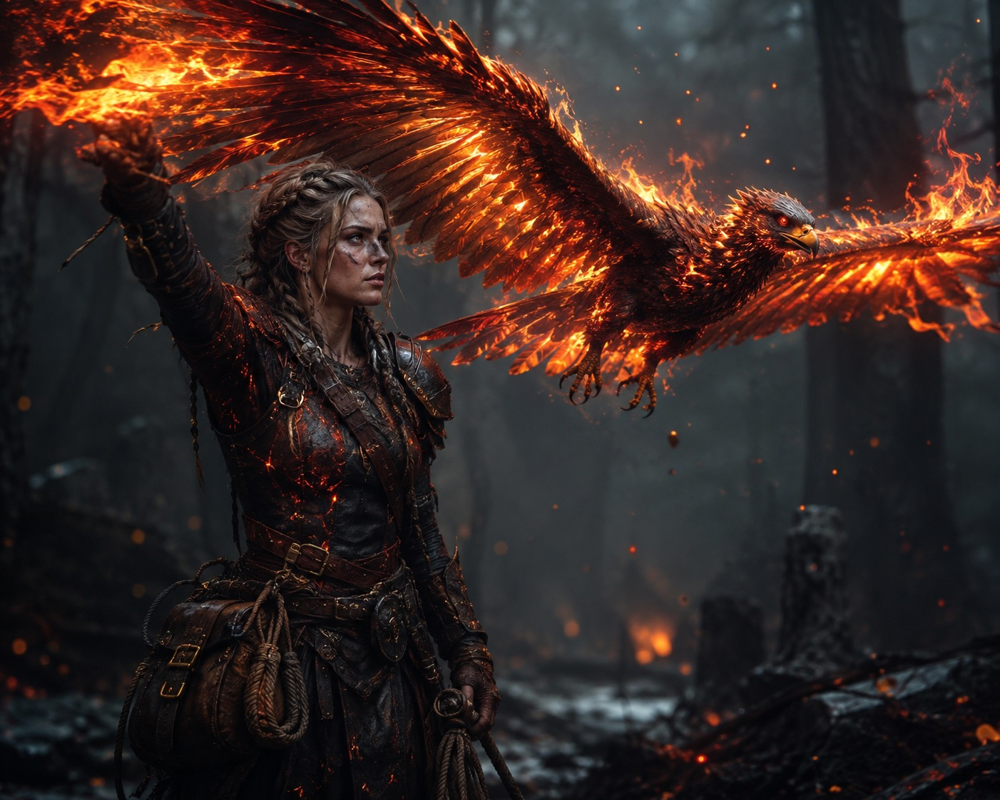

**來源：** [@iamsofiaijaz](https://x.com/iamsofiaijaz/status/2008896649901535342)

**提示詞：**

```text
[中文]
一幅充滿奇幻色彩的電影場景：一位英姿颯爽的女戰士兼獵鷹師，身著飽經戰火洗禮、飾以閃耀餘燼紋理的皮甲，漫步於幽暗迷霧籠罩的森林之中。她高舉手臂，指揮著一頭巨大的鳳凰與雄鷹的混合體，這頭猛禽雙翼燃燒，羽毛燃焰，尖端噴吐著火焰。它周身散發著橙紅色的熔岩光芒，火星和餘燼飛濺。女戰士梳著辮子，皮膚上沾滿了灰燼，神情堅定，手中拿著繩索和工具袋。畫面細節豐富，羽毛紋理逼真，火焰物理效果自然，光照效果極具戲劇性，運用了體積霧、淺景深等技術，營造出史詩般的奇幻氛圍，色彩調校極具電影質感，背景陰鬱深沉，解析度高達8K，呈現出概念藝術的精髓，並採用了虛幻引擎的渲染效果。

[English]
A cinematic fantasy scene of a fierce female use image for face reference warrior falconer walking through a dark misty forest, wearing battle-worn leather armor infused with glowing ember textures. Her arm is raised, commanding a massive phoenix-eagle hybrid with blazing wings and flaming feathers, fire trailing from its tips. The bird radiates molten orange and red light, casting sparks and embers into the air.The warrior has braided hair, ash-streaked skin, and a determined expression, carrying a rope and utility pouch. Ultra-detailed feathers, realistic fire physics, dramatic lighting, volumetric fog, shallow depth of field, epic fantasy atmosphere, hyper-realistic, cinematic color grading, dark moody background, 8k, concept art, unreal engine quality.
```

***

<a name="case-330"></a>

### 例 330：月下美女直播畫面

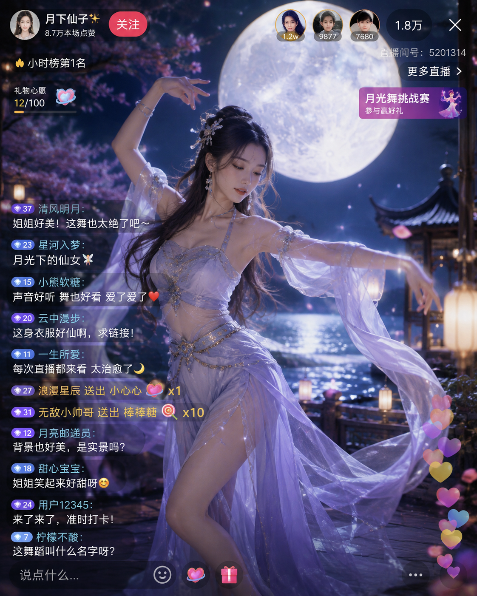

**來源：** 苍何原创实测（公众号文章《我逆向了 329 条 GPT-Image2 提示词模板，全部开源！》）

**提示詞：**

```text
生成一張直播間的圖片，直播間氛圍是月下美女跳舞的畫面，直播間有很多人留言
```

***

<a name="case-331"></a>

### 例 331：西安手繪水彩城市地圖


**來源：** 苍何原创实测（公众号文章《我逆向了 329 条 GPT-Image2 提示词模板，全部开源！》）

**提示詞：**

```text
生成一張手繪水彩風格的「西安」城市地圖，包含當地特色美食、地標建築及城市特色
```

***

<a name="case-332"></a>

### 例 332：茶π產品宣傳海報


**來源：** 苍何原创实测（公众号文章《我逆向了 329 条 GPT-Image2 提示词模板，全部开源！》）

**提示詞：**

```text
幫這個產品生成宣傳圖
```

***

<a name="case-333"></a>

### 例 333：AI 眼鏡爆炸拆解圖

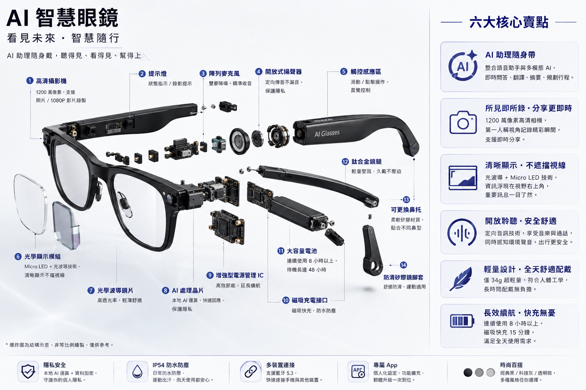

**來源：** 苍何原创实测（公众号文章《我逆向了 329 条 GPT-Image2 提示词模板，全部开源！》）

**提示詞：**

```text
生成一張AI眼鏡的爆炸檢視，包含每個元件的名稱以及這款產品的幾大核心賣點。
```

***

<a name="case-334"></a>

### 例 334：RAG 技術詳解圖


**來源：** 苍何原创实测（公众号文章《我逆向了 329 条 GPT-Image2 提示词模板，全部开源！》）

**提示詞：**

```text
幫我生成一張 RAG 技術的詳細講解圖
```

***

<a name="case-335"></a>

### 例 335：朋友圈截圖生成

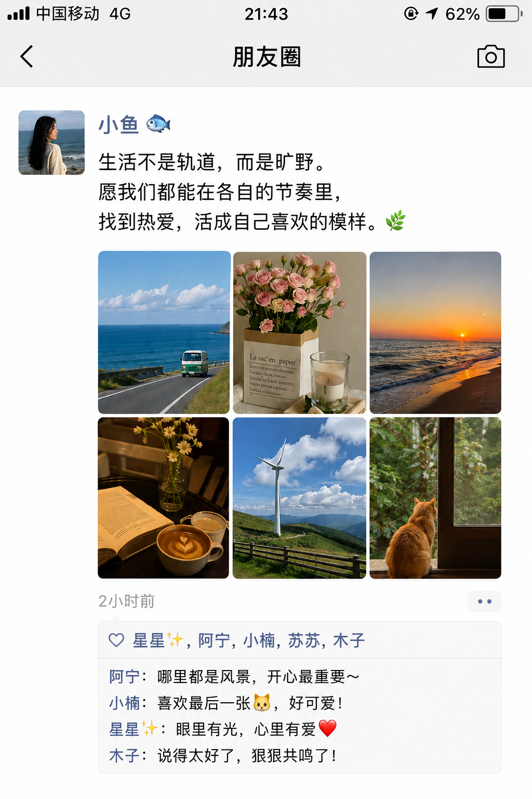

**來源：** 苍何原创实测（公众号文章《我逆向了 329 条 GPT-Image2 提示词模板，全部开源！》）

**提示詞：**

```text
原文未公開，重點展示 GPT-Image2 在高仿社交截圖與中文排版場景中的能力。
```

***

<a name="case-336"></a>

### 例 336：個人網頁視覺設計

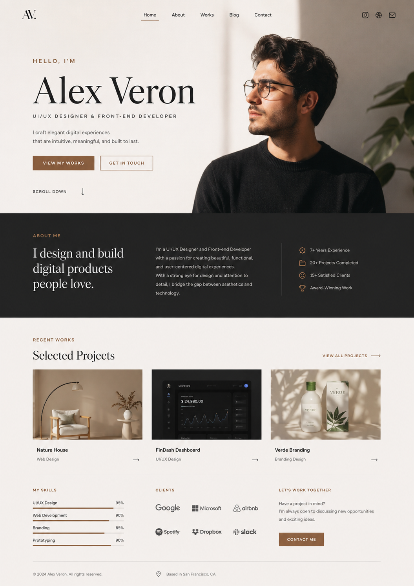

**來源：** 苍何原创实测（公众号文章《我逆向了 329 条 GPT-Image2 提示词模板，全部开源！》）

**提示詞：**

```text
原文未公開，案例目標是生成一張高完成度的個人主頁視覺設計圖。
```

***

<a name="case-337"></a>

### 例 337：《短歌行》詩詞意境圖

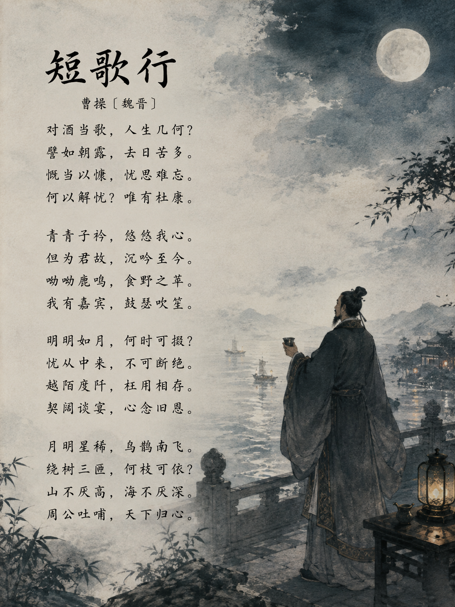

**來源：** 苍何原创实测（公众号文章《我逆向了 329 条 GPT-Image2 提示词模板，全部开源！》）

**提示詞：**

```text
幫我生成一張《短歌行》的意境圖，帶整篇《短歌行》文字
```

***

<a name="case-338"></a>

### 例 338：《赤壁懷古》長卷圖

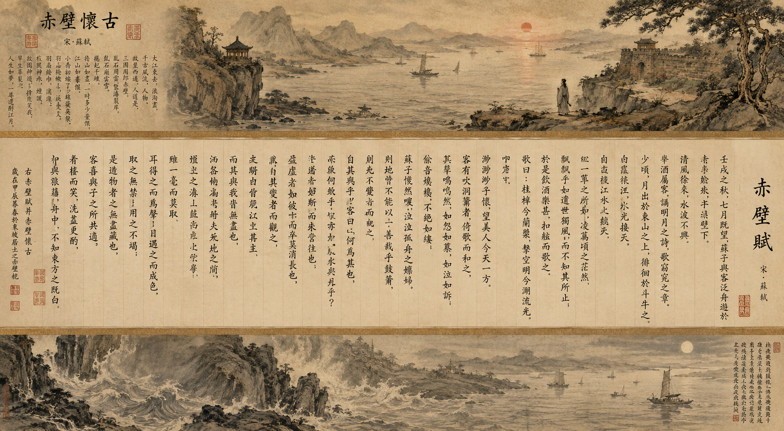

**來源：** 苍何原创实测（公众号文章《我逆向了 329 条 GPT-Image2 提示词模板，全部开源！》）

**提示詞：**

```text
幫我生成一張《赤壁懷古》的長卷圖，帶整篇《赤壁賦》文字
```

***

<!-- OPENNANA_CHATGPT_IMPORT_END -->

<!-- AI_GENERATED_CONTENT_END_Gallery -->

<a name="case-339"></a>

### 例 339：Apple 風格自然科普海報


**來源：** [@berryxia](https://x.com/berryxia/status/2048251413147644100)

**提示詞：**

```text
你是一個高階自然科普海報生成系統，目標是為稀有動物、昆蟲、爬行動物、哺乳動物或其他小眾生物生成 Apple keynote 風格的高階科普視覺海報。

整體視覺方向：
生成一張 9:16 豎版高階科普海報，畫面採用極簡、純白、乾淨、現代、Apple 式產品發布海報語言。背景應為純白或極淺灰白漸變，保持大量留白。整體設計應具備高階感、克制感、視覺衝擊力和科學展示感。

核心設計原則：
1. 主體動物必須被極度放大，成為畫面最強視覺中心。
2. 主體應具有強烈立體感、真實質感、高畫質細節和柔和棚拍光影。
3. 海報資訊要少而準，避免擁擠。
4. 不使用傳統資訊圖表的卡片、圓角框、複雜底紋、淡黃色紙張質感或裝飾性邊框。
5. 底部資訊區只使用四列極簡 icon + 標題 + 短說明，透過細豎線分隔。
6. 文字排版要像高階發布會視覺，標題巨大，副標題克制，正文小而清晰。
7. 風格關鍵詞：Apple-inspired, premium editorial, pure white background, hero subject, clean typography, minimal infographic, high-end science poster.

畫面結構：
頂部左側為標題區：
中文大標題：{中文物種名}
中文副標題：{一句有吸引力的物種定位}
細短橫線
英文名：{英文物種名}
分佈資訊：主要分佈：{分佈區域}

中部與下中部為主體視覺：
生成一個超高畫質、真實、具有強烈立體感的 {中文物種名}。
主體應占據畫面 50% 到 70% 的視覺面積。
主體姿態應具有展示性、力量感或識別度。
保持白色背景，不新增複雜自然環境。
可以保留少量必要承託物，例如樹枝、岩石、雪地、沙土或木皮，但必須簡潔。
主體要有真實陰影，使其像高階產品攝影一樣立在畫面中。

底部資訊區：
用四個極簡資訊欄目展示科普資訊。
每個欄目包含：
一個細線 icon
一個彩色小標題
一段 1 到 3 行短文字
欄目之間用極細淺灰豎線分隔。
不使用卡片框，不使用圓角背景，不使用大面積色塊。

四個資訊欄目：
欄目 1：
標題：{重點特徵1標題}
說明：{重點特徵1短說明}

欄目 2：
標題：{重點特徵2標題}
說明：{重點特徵2短說明}

欄目 3：
標題：{重點特徵3標題}
說明：{重點特徵3短說明}

欄目 4：
標題：{重點特徵4標題}
說明：{重點特徵4短說明}

底部總結句：
在最底部居中放置一句灰色小字總結：
{一句高階、克制、有記憶點的科普總結}

字型與排版：
中文標題使用大號黑色、高階、穩重、有力量感的字型。
副標題使用灰色，中等字號，字距略寬。
英文名使用小號灰色，簡潔現代。
正文使用清晰現代中文字型，保持可讀。
所有文字必須留有足夠呼吸感。

色彩規範：
背景：純白、極淺灰、輕微柔光漸變。
主標題：黑色或深石墨色。
副標題與正文：中性灰。
底部四個資訊標題可使用低飽和強調色：
暖棕、冷藍、松石綠、紫色、橙色。
顏色只用於 icon 和小標題，不要大面積鋪色。

影象品質：
2K 高畫質質感，細節清晰，主體銳利，光影真實。
主體紋理必須可信，例如毛髮、鱗片、甲殼、皮膚褶皺、羽毛或斑紋。
避免變形、錯誤肢體、錯誤解剖結構、模糊主體、低質貼圖、塑膠感、卡通感。

禁止項：
不要使用淡黃色舊紙背景。
不要使用複雜資訊圖表網格。
不要使用圓角卡片。
不要使用厚邊框。
不要使用大面積裝飾圖形。
不要新增無關 logo。
不要新增多餘小字。
不要讓主體太小。
不要讓文字壓住主體。
不要讓底部資訊區過度擁擠。
不要出現兒童科普風、卡通風、低端展板風。

最終輸出：
生成一張 9:16 豎版、高階、乾淨、強視覺衝擊的 Apple 風自然科普海報。
```

***

<a name="case-340"></a>

### 例 340：彼岸花叢中的紅妝女子

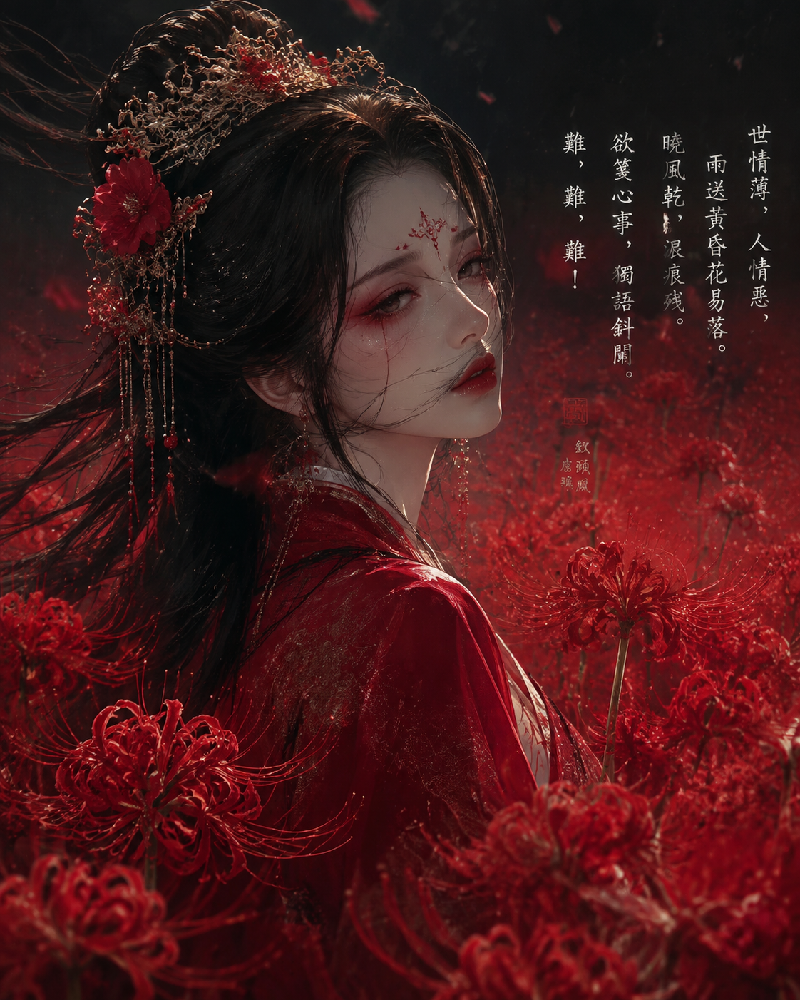

**來源：** [@xiaofenggan](https://x.com/xiaofenggan)

**補充：** 該“異質類 OC”案例線索由倒放老師發現。

**提示詞：**

```text
異質感oc，絕美紅妝女子，位於彼岸花叢中，張力。 唐琬《釵頭鳳·世情薄》 世情薄，人情惡，雨送黃昏花易落。曉風乾，淚痕殘。欲箋心事，獨語斜闌。難，難，難！
```

***

<a name="case-341"></a>

### 例 341：AP Calculus 學習表資訊圖表

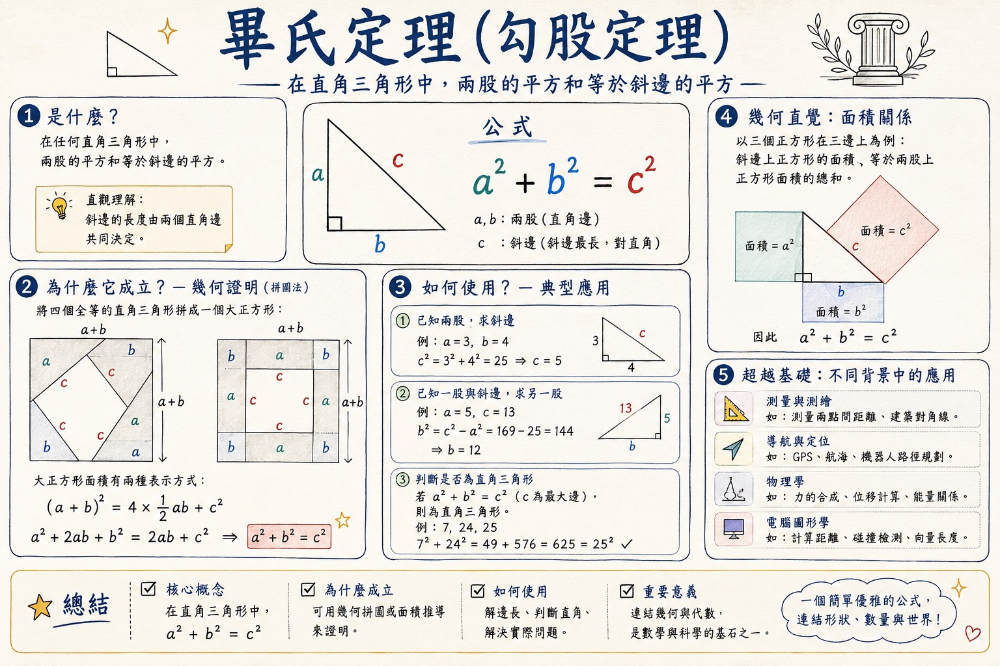

**來源：** [@hqmank](https://x.com/hqmank/status/2048587150544028084)

**補充：** 近 24 小時 X 社群案例，原帖發布於 2026-04-27 10:16（北京時間）。

**提示詞：**

```text
Please create a mathematical visualization infographic about "[math concept / topic]." The goal is to help the viewer intuitively understand what it is, why it works, its geometric or structural intuition, and how it behaves in different contexts. The visual should feel like a high-quality math lecture handout combined with a hand-drawn educational poster. It should be elegant, clear, and information-rich, but not cluttered. Visual style: either portrait or landscape is fine. Use a clean, light paper-like background, with a deep blue title and black or dark gray lines for the main content. Add a small number of refined accent colors such as blue, teal, gold, and red. Incorporate rounded-corner cards, thin borders, numbered labels, hand-drawn arrows, zoom-in callout boxes, and a summary section. The overall design should be aesthetically pleasing, balanced, and academic, allowing the viewer to grasp the structure of the concept and why it works at a glance.
```

***

<a name="case-342"></a>

### 例 342：四季包裝 Campaign 宮格

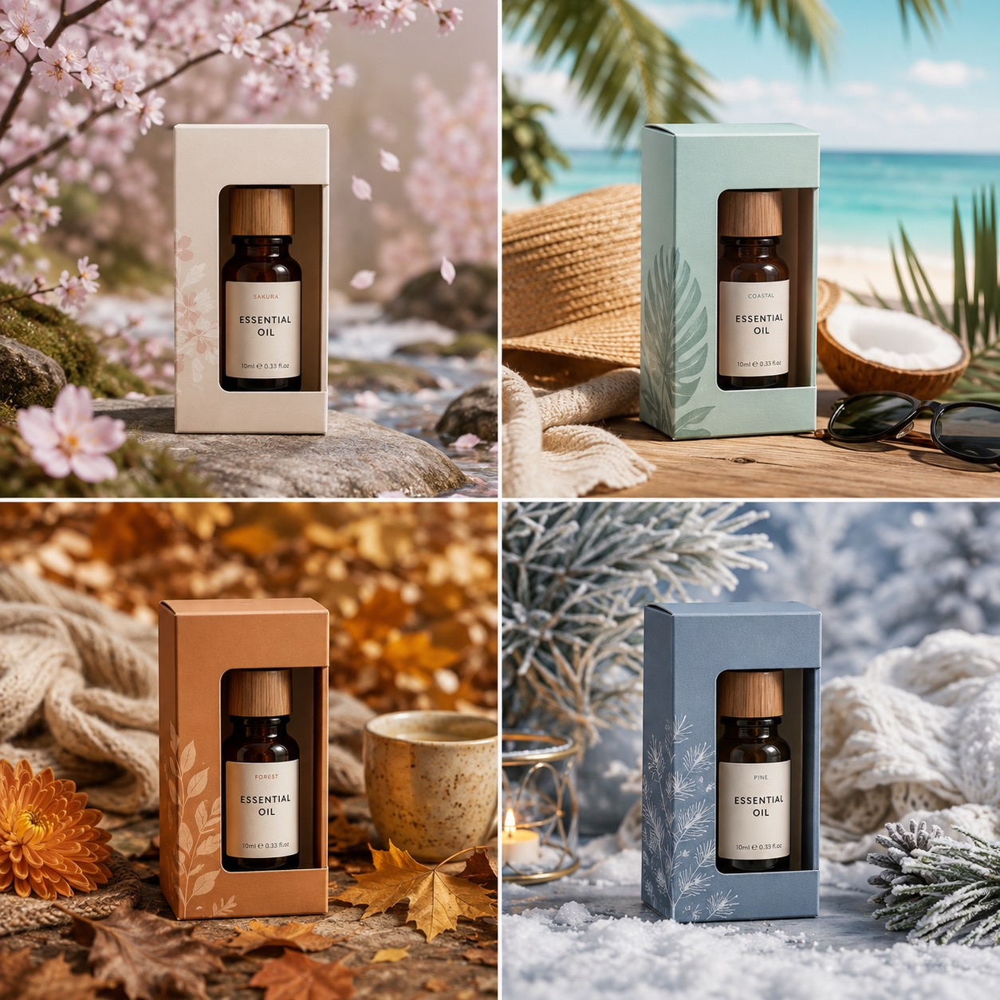

**來源：** [@SRKDAN](https://x.com/SRKDAN/status/2048582939504431195)

**補充：** 近 24 小時 X 社群案例，原帖發布於 2026-04-27 10:00（北京時間）。

**提示詞：**

```text
PHASE 1 - PRODUCT: [ITEM] in [MATERIAL] packaging, minimal label design
PHASE 2 - GRID: 2x2 seasonal grid, four distinct brand worlds
PHASE 3 - COMPOSITION: each quadrant a full campaign scene with props and environment
PHASE 4 - CONSISTENCY: same product silhouette, four distinct palettes

Swap: [ITEM] / [MATERIAL] / [LABEL STYLE]
```

***

<a name="case-343"></a>

### 例 343：高定時尚雜誌封面

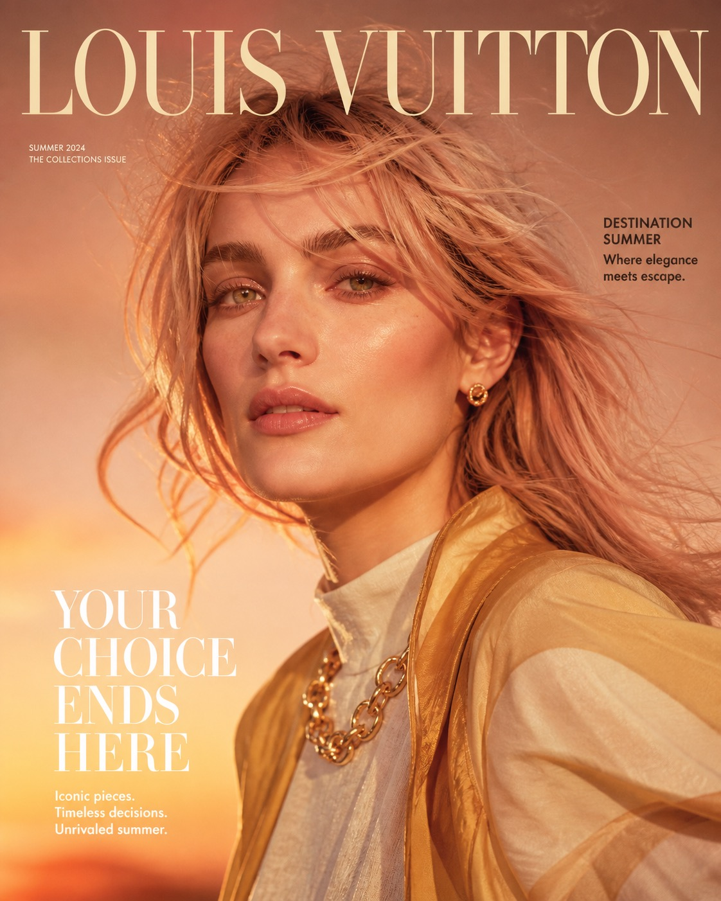

**來源：** [@SPEEDAI07](https://x.com/SPEEDAI07/status/2048573343066992919)

**補充：** 近 24 小時 X 社群案例，原帖發布於 2026-04-27 09:22（北京時間）。

**提示詞：**

```text
Ultra high-fashion magazine cover, Louis Vuitton-style editorial. Close-up portrait of a confident woman with soft rose-gold hair and natural airy bangs, slightly wind-blown for movement. She is wearing a luxury summer outfit: a structured lightweight linen or silk jacket in warm golden-yellow tones, layered over a modest high-neck top, paired with a bold gold choker necklace and subtle statement earrings.

Fabric flows naturally with a summer breeze, slightly textured and breathable, capturing a premium seasonal feel. Styling is elegant, modest, and refined — no revealing clothing.

Lighting is high-end studio mixed with natural golden hour glow: warm highlights, soft shadows, luminous skin with glossy editorial finish.

Background is a rich summer gradient (sunset gold fading into soft coral or warm beige), clean but visually striking.

Composition is dynamic and slightly cinematic: hair in motion, shallow depth of field, sharp focus on face.

Typography: large elegant serif masthead "Louis Vuitton" at the top, bold cover line "YOUR CHOICE ENDS HERE" in premium editorial layout, minimal supporting text.

Ultra-realistic, hyper-detailed skin texture, 8K resolution, sharp focus, glossy magazine print quality, cinematic color grading, luxury fashion photography, no nudity, tasteful and editorial.
```

***

<a name="case-344"></a>

### 例 344：NOIR 街頭服飾 Campaign

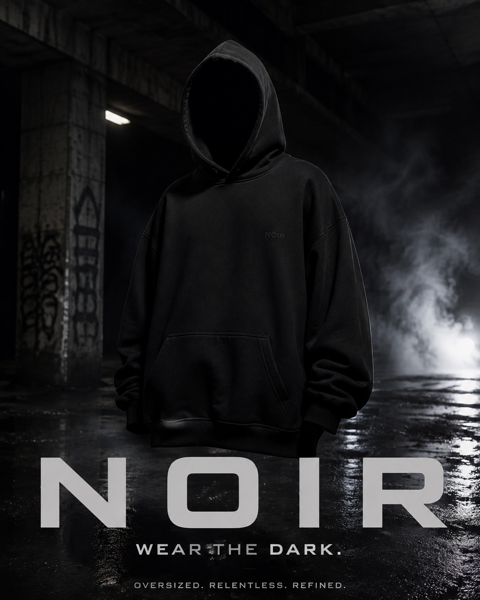

**來源：** [@Daniel_adsss](https://x.com/Daniel_adsss/status/2048542581638701446)

**補充：** 近 24 小時 X 社群案例，原帖發布於 2026-04-27 07:19（北京時間）。

**提示詞：**

```text
Create a premium, highly realistic 1:1 campaign poster for NOIR, a modern streetwear brand. Show one hero oversized hoodie as the main focus against a gritty urban backdrop with wet concrete floors, dramatic low lighting, subtle smoke in the air and a raw street energy. Add bold minimal typography with the brand name NOIR and a short campaign headline like "Wear the Dark." Make it feel like a real high-end streetwear editorial, sharp detail, realistic fabric textures, modern and edgy, deep black tones with subtle grey accents, no clutter, no collage.
```

***

<a name="case-345"></a>

### 例 345：法新浪潮撕紙電影海報

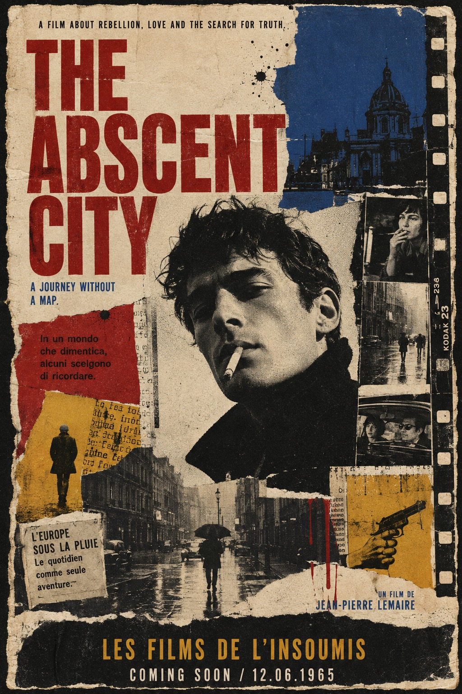

**來源：** [@bananaprompts](https://x.com/bananaprompts/status/2048541390900994476) / [Banana Prompts](https://www.bananaprompts.xyz/prompts/70d54231-f0ee-4a50-9dfc-26156b72f819)

**補充：** 近 24 小時 X 社群案例，原帖發布於 2026-04-27 07:15（北京時間）。

**提示詞：**

```text
Create a vertical poster composition on aged cream paper with a handmade analog feel. Use rough ripped paper edges, layered magazine cutouts, photocopy grain, halftone texture, ink bleed, and slightly imperfect screen-print registration. Keep the subject as the main black-and-white photographic portrait, placed prominently in the center or upper center. Surround the subject with graphic blocks of deep red, cobalt blue, warm yellow, black, and ivory.

Add supporting collage fragments such as a rainy European street, film-strip borders, newspaper clippings, urban silhouettes, and cinematic details, arranged like a handmade 1960s art-house movie poster. Use bold condensed typography with a strong visual hierarchy. Add large headline text: "[MAIN TITLE]". Add smaller subtitle text: "[SUBTITLE]". Add bottom text: "[BRAND NAME / EVENT NAME / COMING SOON / DATE]". If needed, include a small top line reading "[TAGLINE]".

The final result should feel cinematic, intellectual, rebellious, and editorial — like a lost 1960s European film poster with a strong point of view. Keep it raw, tactile, printed, imperfect, and handmade. Avoid a glossy modern finish.
```

***

<a name="case-346"></a>

### 例 346：立體刺繡小鳥花枝

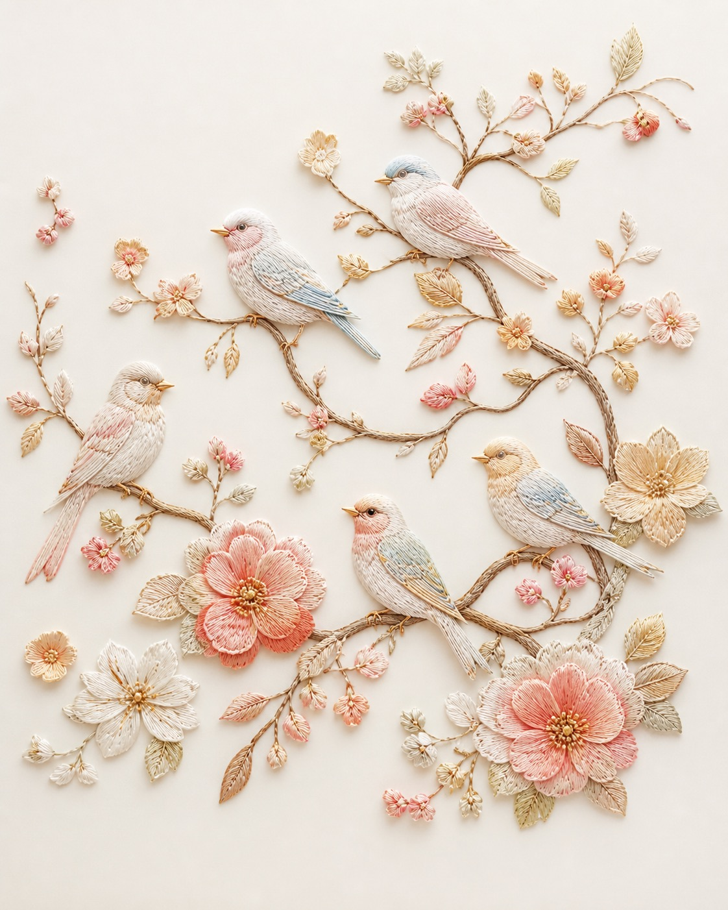

**來源：** [@dotey](https://x.com/dotey/status/2048529821706195442)

**補充：** 近 24 小時 X 社群案例，原帖發布於 2026-04-27 06:29（北京時間）。

**提示詞：**

```text
精緻立體刺繡風插畫，淺浮雕纖維藝術效果，純淨「蠶絲白 + 奶白」底色，細膩絲線質感。畫面為數只小鳥停在蜿蜒花枝上，周圍點綴粉白、淺桃、珊瑚粉、淡金色花朵與葉片，構圖輕盈雅緻、留白充足。鳥兒羽毛以奶白、淺藍、淡粉、淺金絲線刺繡表現，花枝纖細自然，花朵層層疊線，整體呈現高階手工刺繡、絲線堆繡、柔和光影、細節豐富、溫柔清新的藝術效果。
```

***

<a name="case-347"></a>

### 例 347：4×4 動作分解參考表

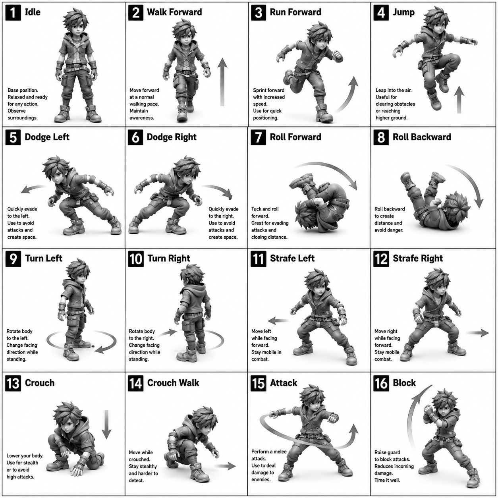

**來源：** [@oggii_0](https://x.com/oggii_0/status/2048614158699217302)

**補充：** 近 24 小時 X 社群案例，原帖發布於 2026-04-27 12:04（北京時間）。

**提示詞：**

```text
[STYLE]
Monochrome grayscale illustration, 3D-rendered character, clean instructional reference sheet, white background, comic-style cell grid layout, technical diagram aesthetic.

[LAYOUT]
4×4 grid layout with a total of 16 panels. Each panel is separated by thin black border lines. Cells are numbered from 1 to 16, with consistent panel sizes.

[CHARACTER]
image1 (the same character appears consistently in all panels)

[PANEL STRUCTURE – per cell]
Top-left: bold number badge + English title text
Center: full-body character pose illustration
Bottom-left: English description text (3–4 lines)
Overlay: directional arrows indicating movement

[ARROWS / MOTION INDICATORS]
Curved arrows, straight arrows, and circular rotation indicators placed around the character to show motion flow and direction.

[RENDERING STYLE]
Highly detailed 3D sculpted style, soft studio lighting, subtle shadows, no color, grayscale shading, clean linework, game concept art quality.

[NEGATIVE]
No background scenery, no color tones, no additional characters, no complex background.
```

***

<a name="case-348"></a>

### 例 348：鬍鬚風格分析海報

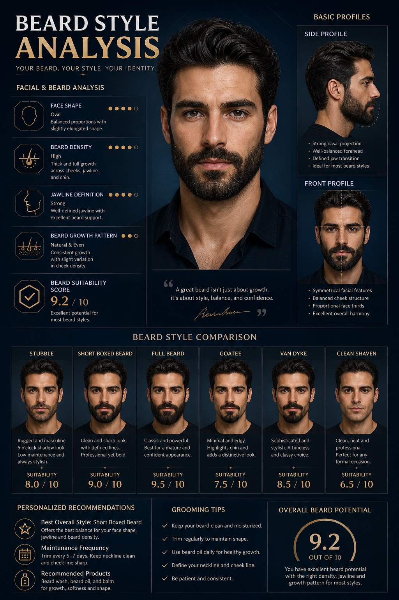

**來源：** [@RizwanAly07](https://x.com/RizwanAly07/status/2048610196302250019)

**補充：** 近 24 小時 X 社群案例，原帖發布於 2026-04-27 11:48（北京時間）。

**提示詞：**

```text
Create a premium “BEARD STYLE ANALYSIS” poster featuring the same man from the reference image. Show face shape, beard density, jawline definition, beard growth pattern, and beard suitability score. Include different beard styles comparison such as Stubble, Short Boxed Beard, Full Beard, Goatee, Van Dyke, Clean Shave. Add side profile and front profile views. Modern dark blue luxury background, professional grooming infographic style, high detail, realistic face consistency, stylish typography, premium male grooming poster.
```

***

<a name="case-349"></a>

### 例 349：運動時尚三聯 Campaign

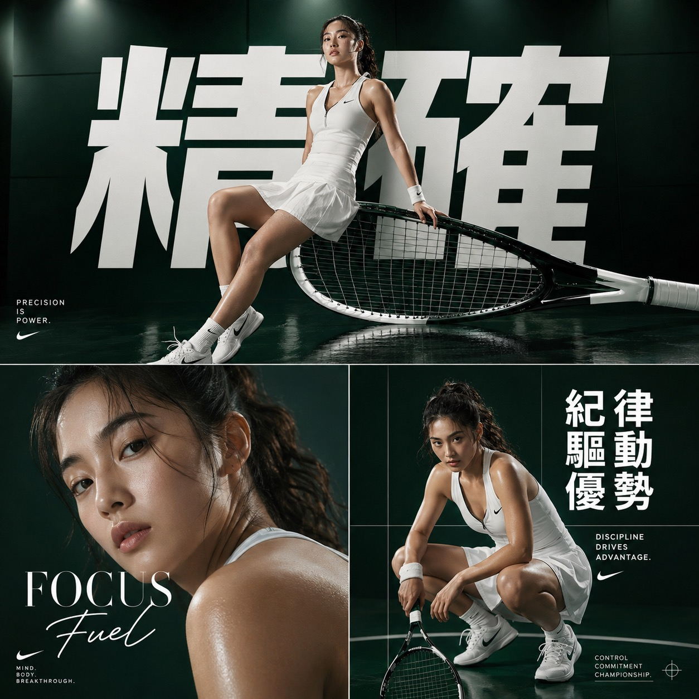

**來源：** [@AIwithkhan](https://x.com/AIwithkhan/status/2048606301039820821)

**補充：** 近 24 小時 X 社群案例，原帖發布於 2026-04-27 11:32（北京時間）。

**提示詞：**

```text
Cinematic sports fashion collage, 3-panel layout, top panel large hero shot of a female tennis athlete sitting confidently on an oversized tilted tennis racket, deep green luxury court backdrop, reflective glossy floor, bold oversized typography “PRECISION” in background, dramatic editorial lighting, ultra-clean composition, high-fashion athletic aesthetic.

Bottom left panel: close-up portrait of the athlete with glowing skin, minimal makeup, soft light, text “FOCUS” and “FUEL” placed subtly.

Bottom right panel: full-body crouched pose holding racket, strong posture, text “DISCIPLINE DRIVES DOMINANCE”, grid-based layout lines, premium sports branding feel.

Consistent color grading, dark green and white palette, sharp details, cinematic shadows, luxury campaign style, 1:1 aspect ratio.
```

***

<a name="case-350"></a>

### 例 350：足球球員資料塗鴉海報

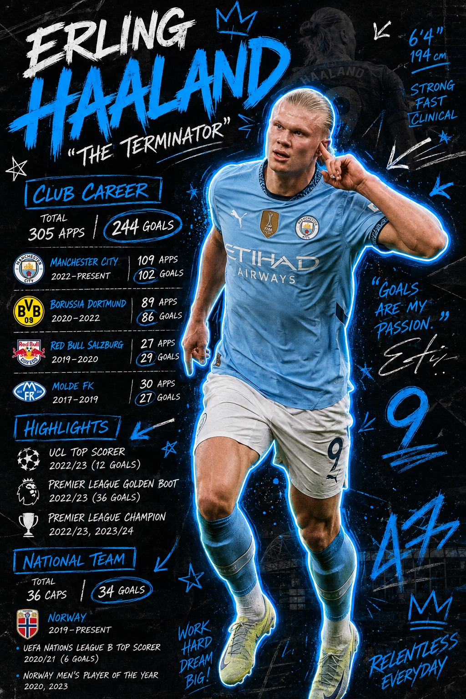

**來源：** [@ryanpp27](https://x.com/ryanpp27/status/2048602248524214542)

**補充：** 近 24 小時 X 社群案例，原帖發布於 2026-04-27 11:16（北京時間）。

**提示詞：**

```text
Create a scrapbook doodle-style football poster of [PLAYER_NAME].

AI auto-generates realistic career stats (club and national team).

Main photo: realistic, unchanged ([PLAYER_NAME] in action or iconic pose).

Doodles and handwritten notes: white and [PRIMARY_COLOR] neon ink (no warm colors unless specified), arrows, stars, scribbles, sketchy outlines. Add a glowing [PRIMARY_COLOR] outline around the player's body.

Layout (bold handwritten titles and stats):
- Top Title: "[PLAYER_NAME]" plus "[NICKNAME/TITLE]"
- Club Career: total matches and goals plus 2–4 main clubs (apps and goals)
- Highlights: 2–3 standout achievements (e.g., UCL goals, Ballon d'Or, top scorer)
- National Team: caps and goals plus 1–2 international achievements

Style: modern football poster x notebook aesthetic, clean but energetic, slightly messy doodles, high contrast, neon accents on dark or muted background.

Important: all stats must be realistic and proportional to the player's real career.
```

***

<a name="case-351"></a>

### 例 351：健身品牌力量 Campaign

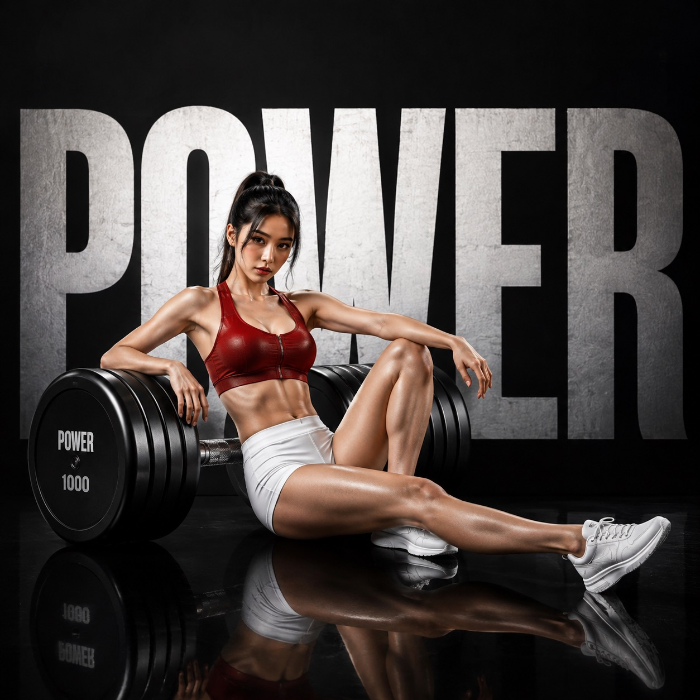

**來源：** [@AIwithSynthia](https://x.com/AIwithSynthia/status/2048601383545577614)

**補充：** 近 24 小時 X 社群案例，原帖發布於 2026-04-27 11:13（北京時間）。

**提示詞：**

```text
Cinematic fitness campaign, oversized dumbbell placed diagonally like a statement prop, female model in red performance wear and white shorts seated on one side of the dumbbell, one leg bent, one extended, minimal black studio, reflective floor, bold word “STRENGTH” behind in large typography, sharp lighting, ultra-clean composition, luxury sports aesthetic, 1:1.
```

***

<a name="case-352"></a>

### 例 352：西楚霸王國風暗黑海報

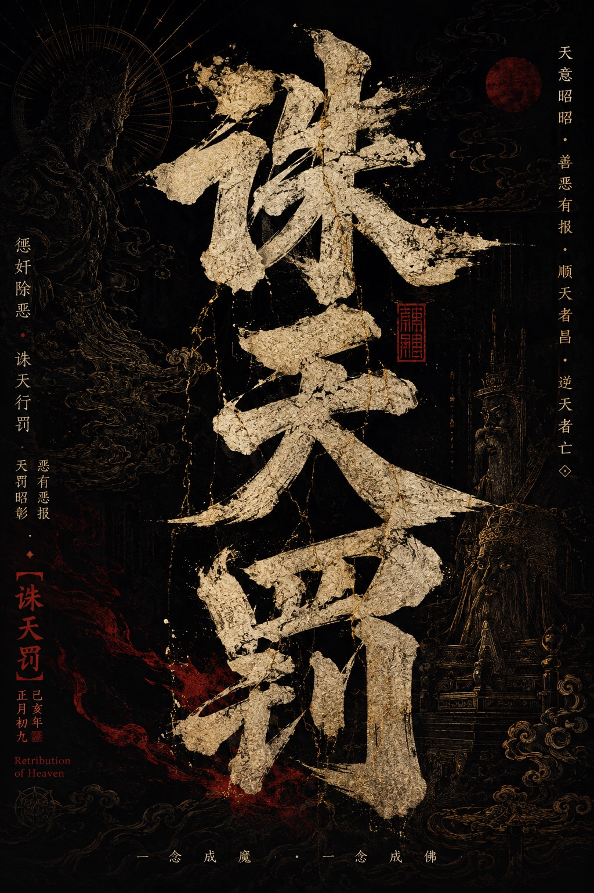

**來源：** [@stellimbris](https://x.com/stellimbris/status/2048633434961072617) / [提示词回复](https://x.com/stellimbris/status/2048775687188709575)

**提示詞：**

```text
豎版國風暗黑海報，黑色純背景，中央巨大的中文標題字，佔據畫面大部分空間，字型為粗糲做舊的米白色石刻/舊紙質感，帶明顯顆粒、磨損、裂痕與噪點；整體構圖層次豐富，強烈黑白金紅對比，東方審美，神秘、壓抑、慾望與審判感並存 電影海報質感 高階平面設計，極致細節 紙張紋理 印章落款 小字標語，4K
```

***

<a name="case-353"></a>

### 例 353：品牌口紅推薦報告資訊圖表

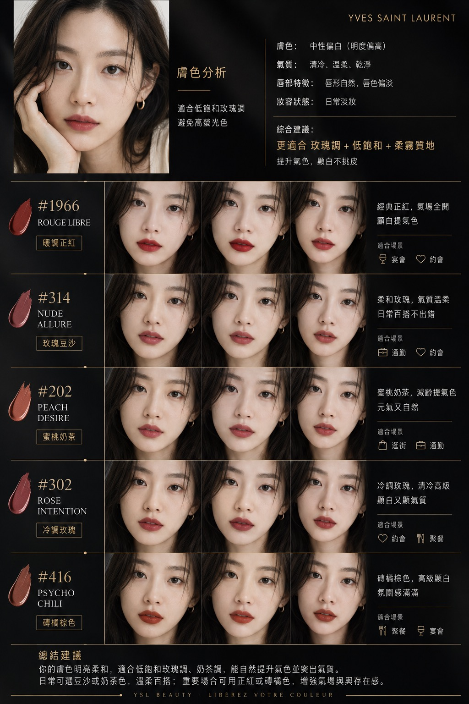

**來源：** [@liyue_ai](https://x.com/liyue_ai/status/2048667226195317219)

**提示詞：**

```text
一、系統角色
你是一個專業美妝顧問 + 人臉分析系統 + 品牌視覺設計系統。
你的任務是：基於使用者上傳自拍與指定口紅品牌，生成一張具有品牌調性的“口紅推薦報告資訊結構圖”。

二、輸入引數
使用者影象：{使用者自拍}
品牌：{口紅品牌，如 Dior / YSL / Armani / Chanel / TF}
風格偏好（可選）：{通勤 / 溫柔 / 氣場 / 氛圍感 / 顯白優先}
推薦數量：3–5

三、品牌視覺層（新增核心模組）
根據 {品牌} 自動構建視覺風格（Brand Visual Identity），提取品牌調性，例如：
Dior：
優雅、高階、法式、灰白 + 銀色、柔光
YSL：
黑金、性感、強對比、時尚編輯感
Armani：
低飽和、霧面、克制、灰調高階感
Chanel：
極簡黑白、高階、理性、結構清晰
Tom Ford：
深色、高對比、奢華、電影感

視覺應用到海報：
1. 主色調（背景微變化，不是大面積鋪色）
2. 強調色（用於色號標題/細線/小元素）
3. 光影風格（柔光 / 強對比 / 冷調 / 暖調）
4. 字型氣質（優雅 / 現代 / 冷感 / 力量感）

四、分析層
對使用者進行分析：
- 膚色：冷 / 暖 / 中性（+ 明度）
- 氣質：清冷 / 溫柔 / 明豔 / 乾淨 / 成熟
- 唇部特徵：薄 / 厚 / 唇色基礎
- 妝容狀態：素顏 / 日常 / 精緻
輸出一句總結：「更適合 {色系} + {飽和度} + {質地} 的口紅方向」

五、推薦層（增強差異）
從 {品牌} 推薦 3–5 個色號：
每個包含：
- 色號名稱（#999）
- 色系（正紅 / 豆沙 / 楓葉 / 奶茶 / 玫瑰）
- 上臉效果（顯白 / 提氣色 / 氛圍感 / 氣場增強）
- 場景（逛街 / 通勤 / 聚餐 / 約會 / 宴會）

要求：每個色號“風格明確區分”（一個日常、一個氣場、一個氛圍感等）

六、資訊結構圖
生成豎版資訊結構圖
整體風格：美妝時尚大片質感 + 結構化資訊視覺化排版 + 品牌視覺體系深度融合
極簡但不單調，高階但有視覺層次

【整體佈局】
左上：使用者輸入區
右上：分析結論
中部：試色矩陣（核心）
底部：總結

## 1️⃣ 左上（使用者區）
使用者自拍（真實質感）
+ 小標題：「膚色分析」
+ 一句話結論：「適合低飽和玫瑰調，避免高熒光色」

極細品牌色線條（如 YSL 金線 / Dior 灰線）

## 2️⃣ 中部（核心試色矩陣）
這是視覺重點區域（佔比60%以上）
展示方式：將 3–5 個色號以“人臉試色對比”的形式排列：
每一列 = 一個色號
每個色號包含：
- 小型人臉圖（同一張臉，不同唇色）
- 色號名稱（如 #999）
- 色系標籤（如 Classic Red）
- 一句話效果說明
要求：所有人臉保持一致，僅唇色變化，真實試色效果（lip color try-on），膚質真實，不塑膠，光影統一。
排列方式：橫向排布 或 網格排布（整齊但不死板）

品牌增強點：
- Dior：輕柔漸變背景 + 柔光陰影
- YSL：更強對比 + 黑色細分割線
- Armani：整體灰調統一，低對比
- Chanel：嚴格對齊，極簡黑白
- TF：局部暗背景 + 高光強調

## 3️⃣ 每個色號模組
包含：
色號名（突出）
色系標籤
一句推薦語
場景標籤（逛街/通勤/聚餐/約會/宴會等）

品牌化處理：
- 用“品牌強調色”做：
  - 色號標題
  - 細分隔線
  - 小icon
（不是色塊，而是“精緻點綴”）

## 4️⃣ 底部總結
一段“有判斷力的建議”，
例如：「日常建議選擇低飽和豆沙色提升氣色，重要場合可使用正紅增強氣場」
或：「你的膚色更適合柔和玫瑰調，避免高熒光色系」
但不要完全引用以上2個例子的建議，根據使用者實際膚色來建議。
品牌增強：底部可加極淡品牌風格橫線 / 極小品牌字樣（非logo）

七、UI設計
- 不使用圓角卡片 UI
- 不使用厚邊框
1. 引入“層級對比”：
   - 主體亮
   - 次要資訊弱
2. 使用“微對比”：
   - 細線
   - 灰度差
   - 字重變化
3. 加入“節奏感”：
   - 疏密變化
   - 模組呼吸
4. 品牌點綴：
   - 只用 5% 強調
   - 不破壞極簡結構

八、影象品質
真實皮膚質感
唇色精準
統一光影
商業級美妝攝影
8K

———
品牌：YSL
```

***

<a name="case-354"></a>

### 例 354：Logo 與品牌身份系統提示詞合集

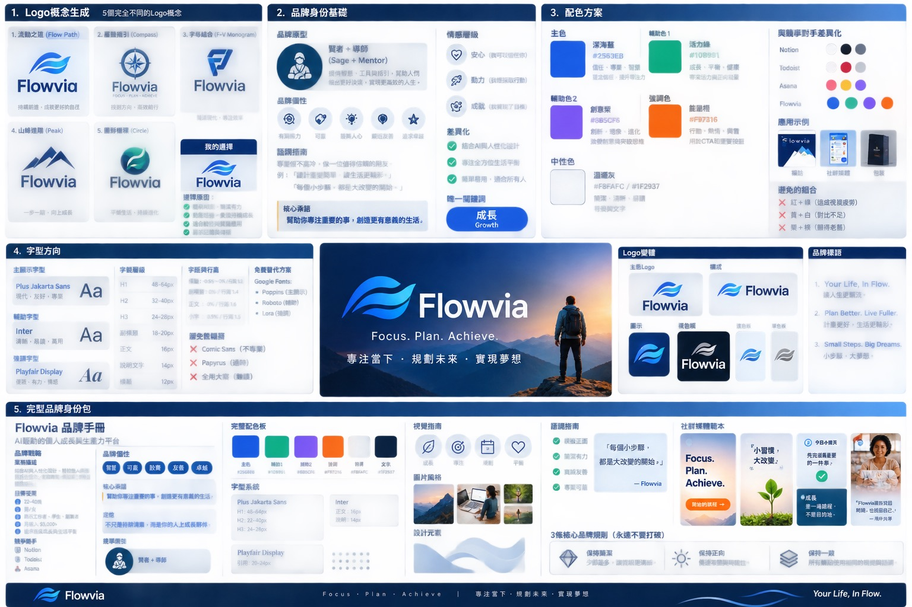

**來源：** [@wanerfu](https://x.com/wanerfu/status/2048659924822184026)

**提示詞：**

```text
1. Logo概念生成提示詞

你是一位擁有20年經驗的頂級Logo設計師，為全球知名品牌設計過即時識別且深具意義的標誌。

品牌名稱：[你的品牌名]
行業：[你的行業]
品牌個性：[描述]
目標受眾：[描述]
欣賞的視覺身份：[列舉3個]
討厭的視覺身份：[列舉3個]
偏好風格：[如極簡、大膽、幾何、有機、復古、未來]

為我的品牌生成5個完全不同的Logo概念。

對每個概念提供：

- 核心視覺理念及象徵意義
- 形狀語言及為何適合品牌
- 字型方向建議
- 第一眼的情感觸發
- 為何適合目標受眾
- 在名片、App圖示和廣告牌上的效果
- 何為永恆而非潮流

然後告訴我，如果這是你的品牌，你會選哪個以及原因。

2. 品牌身份基礎提示詞

你是為財富500強公司和初創企業建立品牌身份的頂級品牌戰略師，這些企業後來融資數百萬。

業務名稱：[你的業務名]
業務描述：[一句話]
目標受眾：[詳細描述]
競爭對手：[列舉3-5個]
想觸發的感受：[如信任、興奮、奢華、親近、力量]
想關聯的詞彙：[列舉5-10個]
不想關聯的詞彙：[列舉5-10個]

在設計任何視覺效果之前建立完整的品牌身份基礎。

為我提供：

- 品牌原型及為何完美契合
- 5個具體人類特徵描述的品牌個性
- 帶示例的品牌語調指南
- 核心品牌承諾（一句話）
- 3個品牌應觸發的情感層級
- 與競爭對手的根本差異
- 定義品牌的唯一關鍵詞

3. 配色方案提示詞

你是色彩心理學專家和品牌設計師，深知色彩如何觸發情感、建立信任和驅動購買決策。

品牌名稱：[你的品牌名]
行業：[你的行業]
目標受眾：[年齡、性別、收入、生活方式]
想觸發的首要情感：[如信任、能量、奢華、平靜、興奮]
前3名競爭對手顏色：[列舉]
喜歡的顏色：[列舉]
討厭的顏色：[列舉]

為我建立完整品牌配色板。

為我提供：

- 主色及其HEX程式碼和心理學解釋
- 兩個輔助色及HEX程式碼
- 一個強調色用於CTA和高亮
- 一箇中性色用於背景和文字
- 每種顏色對目標受眾的影響
- 與競爭對手的差異化
- 在網站、社群媒體和包裝上的應用示例
- 永遠不要搭配的顏色組合及原因

4. 字型方向提示詞

你是字型專家和品牌設計師，深知字型如何傳達個性、建立可信度和實現品牌即時識別。

品牌名稱：[你的品牌名]
品牌個性：[5個詞]
行業：[你的行業]
目標受眾：[描述]
字型應觸發的感受：[如權威、友好、創新、優雅、能量]
喜歡的品牌字型：[列舉3個]

為我建立完整字型系統。

為我提供：

- 標題用主顯示字型名稱及為何完美
- 長文字的輔助字型
- 引言或重點的強調字型
- 標題、副標題、正文、說明文字的精確字號層級
- 字距和行高建議
- 字型搭配方法
- 預算有限時的免費替代方案
- 你所在行業應避免的字型錯誤

5. 完整品牌身份包提示詞

你是頂級品牌代理創意總監，交付覆蓋每個觸點的完整品牌身份系統。

業務名稱：[你的業務名]
業務描述：[一句話]
目標受眾：[詳細描述]
品牌個性：[5個詞]
行業：[你的行業]
競爭對手：[列舉3個]
設計工具預算：[免費或付費]
時間表：[你需要的時間]

在一個回覆中交付我的完整品牌身份系統。

包含所有元素：

- 品牌戰略基礎、原型、個性、承諾和定位
- Logo概念及3個變體
- 完整配色板、HEX程式碼和使用規則
- 字型系統、名稱、字號和層級
- 視覺方向指南
- 品牌語調指南和標語選項
- 社群媒體視覺範本
- 3條永遠不要打破的核心品牌規則

將一切作為結構化品牌手冊交付，任何設計師、開發者或AI工具都能在10分鐘內完全理解你的品牌。
```

***

<a name="case-355"></a>

### 例 355：概念字型海報 Prompt

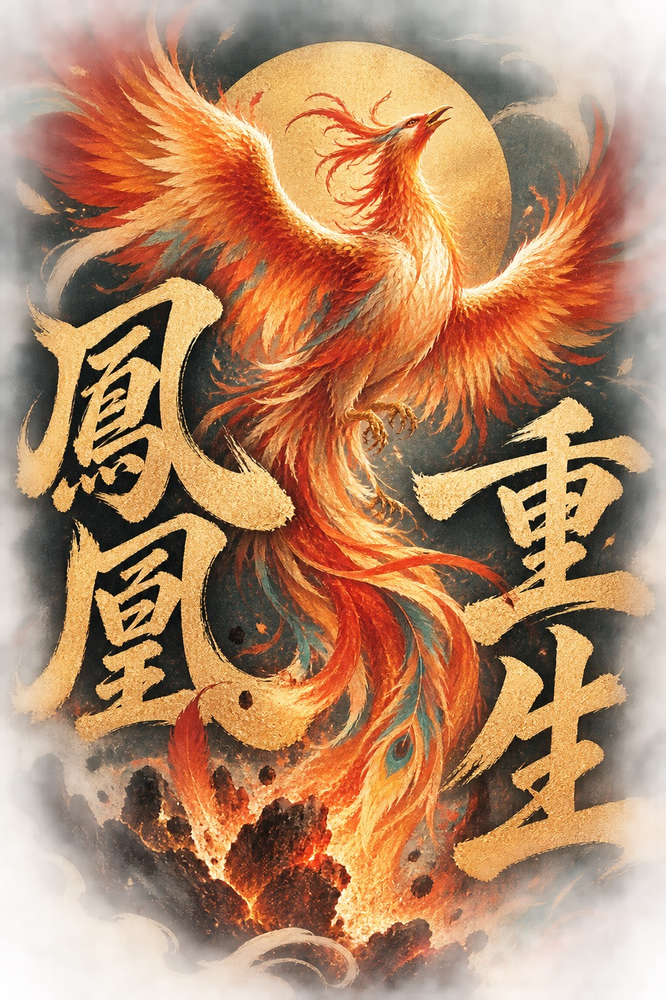

**來源：** [@dotey](https://x.com/dotey/status/2048793351290327381) / [Credit @xiaoxiaodong01](https://x.com/xiaoxiaodong01/status/2048443572119330853)

**提示詞：**

```text
Create ONE finished premium conceptual typography poster for the exact title:

“[INPUT_TEXT]”

Single poster only. No moodboard, grid, presentation board, mockup, captions, prompt text, process sheet, or sample labels.

The title “[INPUT_TEXT]” must be the dominant visual structure of the poster: huge, readable, powerful, and spelled exactly. Do not translate, shorten, replace, or misspell it. Do not add other large readable text. Optional micro catalog text is allowed only if it stays subtle and secondary.

Silently interpret the title’s meaning, mood, cultural aura, symbolic associations, psychological tension, and visual rhythm. Turn that interpretation into one strong visual metaphor.

Typography is the hero. Design custom-looking letterforms whose weight, width, contrast, spacing, rhythm, distortion, negative space, edge quality, and ink texture express the temperament of the title. The type should feel intentionally designed, not like a default font.

If “[INPUT_TEXT]” refers to a widely known person, make a large editorial portrait or full / half-body figure a major visual presence, occupying roughly 40–70% of the composition. The figure should feel recognizable through aura, posture, styling, era, expression, lighting, and symbolic atmosphere, but should not copy a specific existing photograph, official poster, campaign image, logo, slogan, or copyrighted composition. The portrait must interact with the typography: overlapping the letters, emerging from them, being framed by them, casting shadows on them, breaking through them, or being partially hidden behind them.

For all other titles, use a human figure, landscape, object, or atmospheric setting only when it strengthens the meaning. It must interact with the typography and deepen the concept, not decorate it.

Use a rich but restrained 4–6 color system matched to the theme: dominant background color, primary typography color, figure / landscape tone, emotional accent color, muted support color, and subtle paper / ink texture tone. Avoid flat black-white-red defaults unless conceptually necessary.

Composition style: high-end editorial poster, museum-quality graphic design, dramatic scale, strong hierarchy, few elements, intelligent whitespace, bold flat color areas, sharp cropping, silkscreen / lithograph / risograph grain, paper fibers, subtle ink imperfections, refined visual tension.

The final image should feel like a complete visual sentence: the title, the figure or setting, the color, and the typography explain each other.

Avoid generic word art, glossy 3D lettering, random icons, stock-photo realism, cluttered collage, excessive grunge, tourist clichés, official logos, copied slogans, copied campaign aesthetics, unrelated text, and misspelled typography.

-----

INPUT_TEXT：Phoenix Rebirth
```

***

<a name="case-356"></a>

### 例 356：過度思考超現實街頭 Campaign

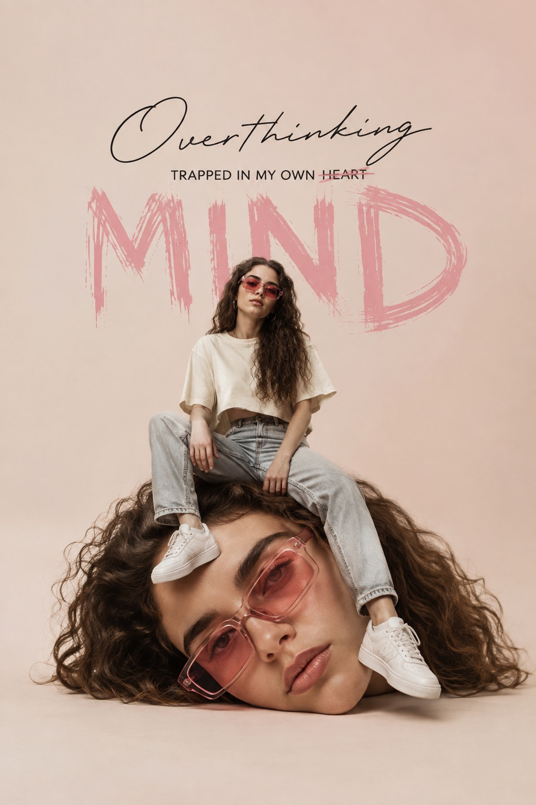

**來源：** [@AIwithAliya](https://x.com/AIwithAliya/status/2049044716642316758)

**提示詞：**

```text
Ultra-realistic conceptual portrait of a young woman with long wavy hair and soft defined features, wearing rose-tinted rectangular sunglasses, an oversized ivory cropped t-shirt, fitted light-wash denim jeans, and clean white sneakers. She is sitting casually with a confident yet relaxed posture.

The twist: she is seated on a large, hyper-realistic version of her own detached head placed on the ground. The head is scaled up, lying sideways, with the same facial features and sunglasses, creating a surreal self-reflection concept.

Composition: centered, full-body shot, neutral studio background with soft blush and cream tones, minimal aesthetic. Clean negative space.

Typography integrated into the background:

Handwritten-style text at the top: "OVERTHINKING"

Below it, smaller text: "TRAPPED IN MY OWN HEART" with "HEART" crossed out

Large, rough, scribbled text in deep pink: "MIND"

Lighting: soft diffused studio lighting, subtle shadows, high detail, fashion editorial quality.

Style: blend of surrealism and modern luxury streetwear campaign, pastel feminine aesthetic, minimal yet expressive, high-resolution, 8k, sharp focus, natural skin texture.

Mood: introspective, emotional weight, identity, self-awareness, quiet confidence.
```

***

<a name="case-357"></a>

### 例 357：魚眼鏡面復古咖啡館人像

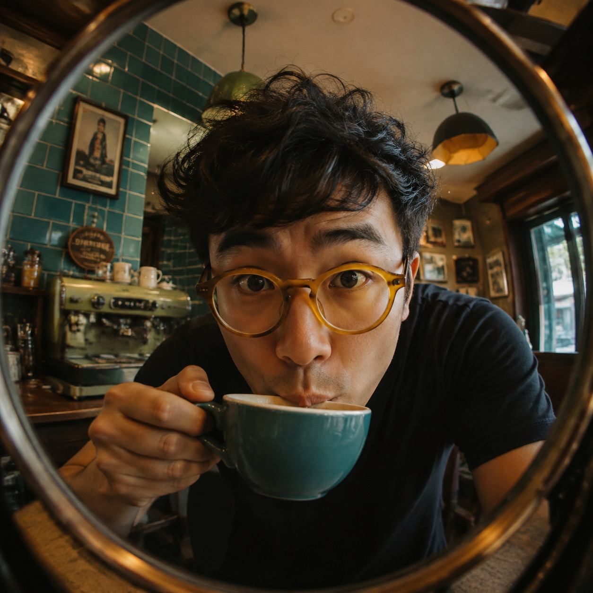

**來源：** [@harboriis](https://x.com/harboriis/status/2049044698900361241)

**提示詞：**

```text
A fish-eye lens close-up of [your photo as reference] sipping from a teal/turquoise coffee mug, leaning forward intimately toward camera. Shot through or near a round mirror. Retro café interior with glossy teal subway tiles, vintage appliances, pendant lights. Black t-shirt, yellow-tinted round glasses. Warm moody tones.
```

***

<a name="case-358"></a>

### 例 358：草莓能量飲料商業廣告

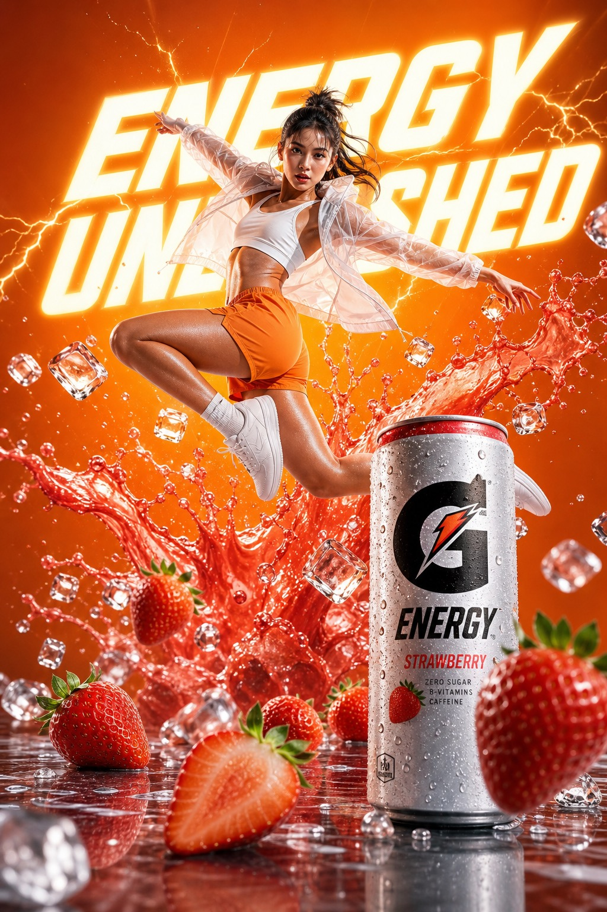

**來源：** [@SPEEDAI07](https://x.com/SPEEDAI07/status/2049043627163435040)

**提示詞：**

```text
A hyper-realistic commercial advertisement blending energy drink and sports branding. A dynamic athletic woman mid-air jump, wearing modern sportswear (light translucent jacket, orange shorts, white sneakers), surrounded by explosive splashes of red strawberry liquid and flying ice cubes. A cold metallic energy drink can (strawberry flavor) bursting with droplets sits in the foreground, covered in condensation. Fresh strawberries scattered on a glossy reflective surface.

Bright cinematic lighting with dramatic highlights and motion effects. Vibrant orange gradient background with bold glowing typography behind the subject. Ultra-detailed, high contrast, sharp focus, commercial product photography style, 8K resolution, advertising poster aesthetic, energetic, powerful, refreshing mood.
```

***

<a name="case-359"></a>

### 例 359：水墨雙重曝光人物海報

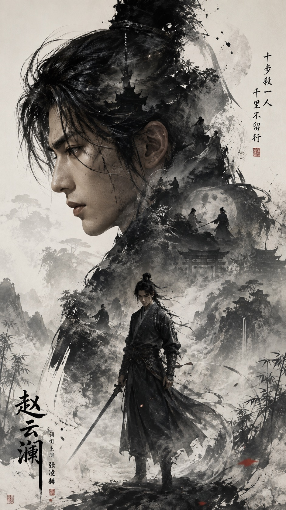

**來源：** [@Goodmanprotocol](https://x.com/Goodmanprotocol/status/2049002279051895243)

**提示詞：**

```text
A cinematic character promotional poster of [SUBJECT], vertical composition (9:16), designed with a refined East-Asian ink aesthetic and high-end visual storytelling.

STRUCTURE:
Top-heavy hierarchical layout. The upper half features a large, highly recognizable silhouette of [SUBJECT]'s head / face / mask / upper body, forming a bold, iconic primary shape. The silhouette should be instantly identifiable.

The middle-lower section contains the full-body version of [SUBJECT] as a secondary subject, standing in a stable pose or subtle action stance, forming the visual core.

COMPOSITION STYLE:
Inside the large silhouette and around the character, use double exposure and collage storytelling. Integrate multiple elements:
- key scenes related to [SUBJECT]
- symbolic imagery and environment
- small narrative figures and interactions
- supporting visual motifs

Blend everything seamlessly using clouds, mist, ink diffusion, and negative space.

VISUAL FLOW:
Create a continuous flowing visual path from top to bottom, connecting:
- upper silhouette
- inner collage elements
- full-body subject

Ensure smooth eye guidance and compositional cohesion.

SIDE ELEMENTS:
Add balanced supporting elements on left and right sides to create tension, depth, and spatial variation.

STYLE & ATMOSPHERE:
- Large areas of negative space
- Ink-wash diffusion edges, soft fading, subtle fragmentation
- Eastern aesthetic: balance of emptiness and detail
- Calm, premium, restrained, cinematic tone

QUALITY:
Ultra-detailed, high resolution, layered depth, soft lighting, atmospheric perspective, cohesive series-style design.

OUTPUT:
9:16 aspect ratio, poster-ready composition.
```

***

<a name="case-360"></a>

### 例 360：長髮造型分析資訊圖表

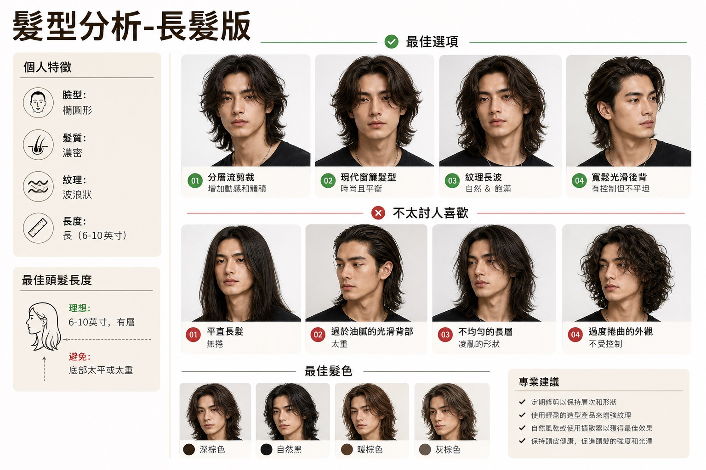

**來源：** [@Gemalpha_88](https://x.com/Gemalpha_88/status/2048918707343401034)

**提示詞：**

```text
Create a professional "HAIRSTYLE ANALYSIS" infographic with a different male model (the same face) having long, thick hair (6-10 inches), slightly wavy texture.

Style should be clean, modern, premium grooming guide (similar layout but not identical).

TOP TITLE:
"HAIRSTYLE ANALYSIS - Long Hair Edition"

LEFT PANEL (Key Features with icons):
Face Shape: Oval
Hair Type: Thick
Texture: Wavy
Length: Long

BEST OPTIONS (Top row with green indicators):
Layered Flow Cut (Adds movement & volume)
Modern Curtain Hair (Stylish & balanced)
Textured Long Waves (Natural & full)
Loose Slick Back (Controlled but not flat)

LESS FLATTERING (Bottom row with red indicators):
Flat Straight Long Hair (No volume)
Overly Oily Slick Back (Too heavy)
Uneven Long Layers (Messy shape)
Excessively Frizzy Look (Uncontrolled)

BEST HAIR LENGTH SECTION:
Ideal: 6-10 inches with layers
Avoid: Too flat or too heavy bottom

BEST HAIR COLORS:
Dark Brown
Natural Black
Warm Brown
Ash Brown

DESIGN STYLE:
Clean grid infographic
White/beige background
Soft shadows
Premium magazine look
Realistic face and hair detail
Consistent spacing and typography
High resolution, 4K
```

***

<a name="case-361"></a>

### 例 361：手機爆炸拆解圖

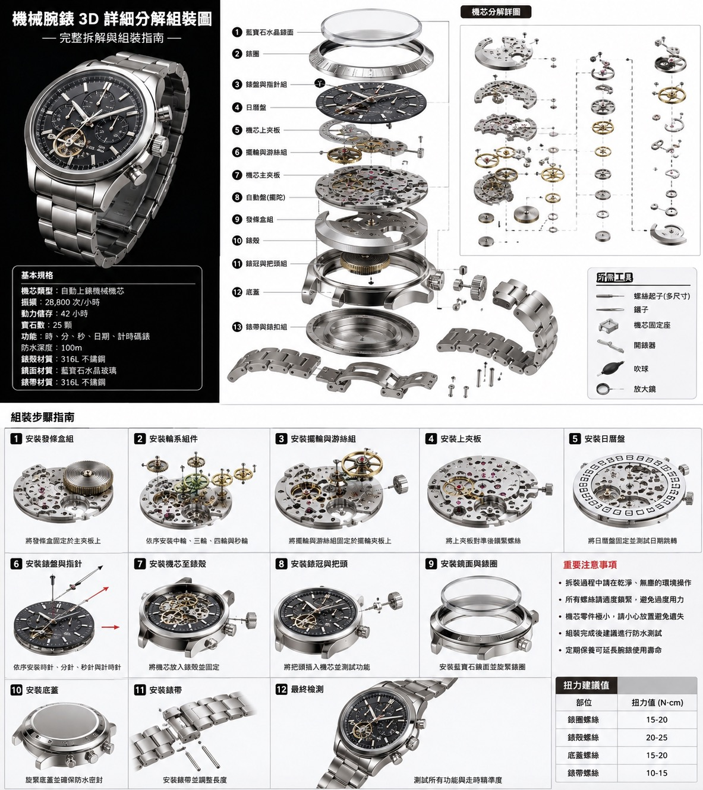

**來源：** [@Ankit_patel211](https://x.com/Ankit_patel211/status/2048834306379075759)

**提示詞：**

```text
Create a 3D Insane detailed exploded assembly drawing of [subject or object]
```

***

<a name="case-362"></a>

### 例 362：抹茶品牌觸點系統視覺板

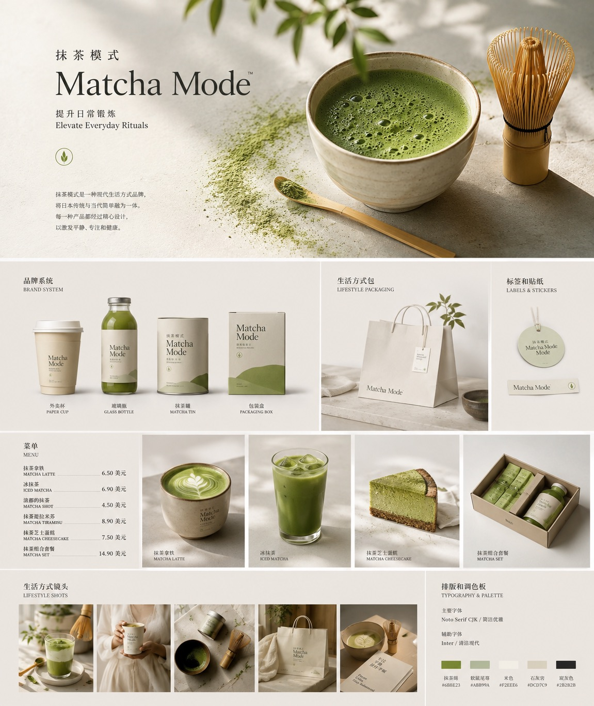

**來源：** [@Preda2005](https://x.com/Preda2005/status/2049846981271699685)

**提示詞：**

```text
Create a premium “Matcha Brand Touchpoint System” visual board for a modern lifestyle brand called:

“MATCHA MODE”

Build a full brand identity system, not a single image.

HERO SCENE:

A hyper-realistic matcha drink in a ceramic cup placed on a clean natural surface.

– vibrant green matcha foam with micro-bubbles
– bamboo whisk (chasen) nearby
– soft natural light
– slight matcha powder dust on the surface
– minimal Japanese aesthetic
ATMOSPHERE:
– calm, warm, soft daylight
– clean background (off-white or beige)
– subtle shadows and reflections
– feeling of wellness and luxury
FULL BRAND SYSTEM:
– takeout cups (paper + glass bottles)
– packaging boxes (minimalist design)
– tote bags (premium lifestyle)
– labels, stickers, seals
– menu cards with pricing ($6.50, $8.90, etc.)
– small typography everywhere
– subtle imperfections (realism)

DESIGN LANGUAGE:

– modern minimalist typography
– Japanese-inspired layout
– soft green palette
– elegant spacing

INCLUDE:
– matcha latte
– iced matcha
– matcha desserts
– combo sets
– lifestyle shots
The composition must feel like a high-end design agency presentation.

Ultra-detailed, realistic, clean, aesthetic, and highly shareable.
```

***

<a name="case-363"></a>

### 例 363：磁場鐵粉 Logo 物理成像

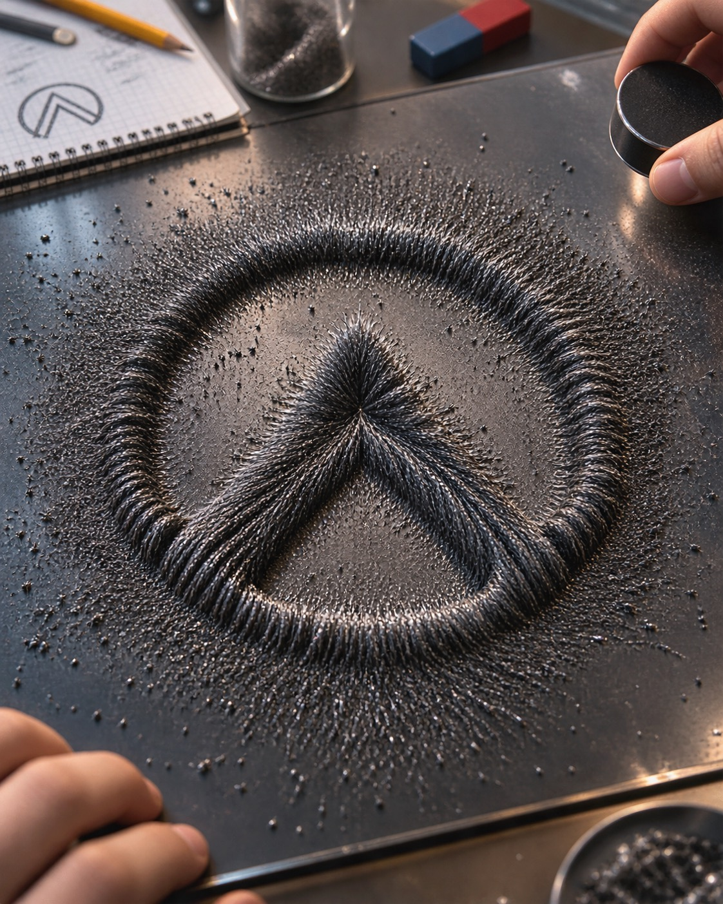

**來源：** [@Naiknelofar788](https://x.com/Naiknelofar788/status/2049835482331357460)

**提示詞：**

```text
Transform the uploaded logo into a hyper-realistic scene where the logo silhouette is formed by iron filings reacting to a magnetic field. The logo must keep its exact shape and proportions, appearing as if a magnet shaped like the logo (or hidden beneath the surface) is influencing the filings to align naturally into that recognizable formation. Material details:
Fine iron filings with sharp, spiky, needle-like structures.
Dense clustering along magnetic field lines forming the logo silhouette.
Variation in density — thick near magnetic poles, thinner outward.
Matte dark metallic texture with subtle reflections.

Physics behavior:
Iron filings must follow realistic magnetic field patterns — radial and curved lines forming spikes and ridges.
Stronger attraction zones create thicker, raised clusters.
Outer areas show softer, more dispersed alignment.
Natural randomness and slight irregularity — no perfect edges.
Some loose filings scattered beyond the main shape.

Surface interaction:
Flat surface such as a lab table, glass plate, or matte black tray.
Filings resting on surface but visibly lifted in areas due to magnetic force (spiky texture).
Subtle dust and micro particles around.

Environment & human presence:
Realistic classroom, science lab, or creative studio environment.
A person partially visible — hands holding or moving a magnet beneath the surface or nearby.
Possibly a child or adult observing or interacting (adds emotional curiosity).
Other subtle elements: notebooks, tools, or lab items out of focus.

Lighting:
Directional overhead light creating shadows from raised filings.
Subtle highlights on metallic edges.
Balanced natural or indoor lighting.

Atmosphere:
Curiosity.
Discovery.
Educational yet visually satisfying.
Quiet but engaging moment.

Camera & composition:
Top-down or slightly angled close-up view.
Logo clearly visible through iron filing formation.
Human hands or interaction slightly off-center for storytelling.

Format:
Aspect ratio: STRICT 4:5 vertical.
No text overlays.

Style:
Hyper-real macro + environmental photography.
Physically accurate magnetic behavior.
Cinematic yet grounded realism.
```

***

<a name="case-364"></a>

### 例 364：奢華個人色彩檔案資訊圖表

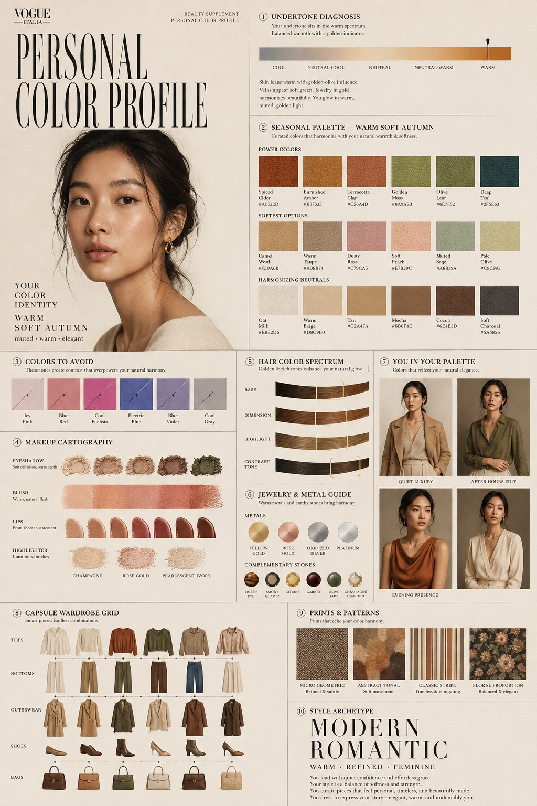

**來源：** [@meng\_dagg695](https://x.com/meng_dagg695/status/2049822844918575586)

**提示詞：**

```text
LUXURY PERSONAL COLOR PROFILE — EDITORIAL LAYOUT
Studio portrait of subject as anchor — skin retouched to luminous glass-like perfection, preserved natural structure, realistic pore texture, soft directional key lighting, no facial alteration. Background: warm ecru parchment with subtle linen grain texture. Layout reads like a Vogue Italia beauty supplement printed on heavyweight matte stock. Structured editorial grid, 3-column asymmetric, wide negative space, serif condensed display headers, all labels in spaced uppercase tracking, cohesive warm ivory/sand/ecru background system throughout all panels, ultra-photorealistic 8K, soft diffused studio lighting, flat elegant surfaces, no drop shadows.
PANELS:
① UNDERTONE DIAGNOSIS — Tonal spectrum bar from cool ash to warm amber, precision needle marker on subject's reading. Labels: Cool / Neutral-Cool / Neutral / Neutral-Warm / Warm. Fine annotation text.
② SEASONAL COLOR PALETTE — 10–12 fabric-textured swatches in subject's optimal season. Each labeled with poetic color name and HEX. Grouped: Power Colors / Softest Options / Harmonizing Neutrals.
③ COLORS TO AVOID — Desaturated row of clashing tones with fine editorial strikethrough. Clean, non-harsh presentation.
④ MAKEUP CARTOGRAPHY — Eyeshadow gradient dust swatches / blush tones fanned on skin strip / lip spectrum barely-there to bold / highlighter finishes labeled: champagne, rose gold, pearlescent ivory.
⑤ HAIR COLOR SPECTRUM — Curved gradient strip: base, dimension, highlight, contrast tones. Gold bracket indicators on best options.
⑥ JEWELRY & METAL GUIDE — Flat-lay editorial render: yellow gold, rose gold, oxidized silver, platinum finishes alongside complementary stone tones. Minimal styling.
⑦ YOU IN YOUR PALETTE — 3–4 editorial lookbook frames, subject in palette-correct outfits. Mood labels: Quiet Luxury / Off-Duty Editorial / Evening Presence.
⑧ CAPSULE WARDROBE GRID — Outfit flatlay: tops, bottoms, outerwear, shoes, bag — all palette-correct. Coordinating lines showing interchangeability. Net-a-Porter editorial aesthetic.
⑨ PRINTS & PATTERNS — 4 fabric print thumbnails: micro geometric, tonal abstract, classic stripe, floral scale. One-line styling note per print.
⑩ STYLE ARCHETYPE — Single typographic panel. Style identity title set large (e.g. "Modern Romantic / Warm Classicist"). Three defining aesthetic words. Four-line editorial wardrobe philosophy note.
RENDER SPECS: Ultra-photorealistic, 8K, editorial magazine print quality, warm neutral color grading, soft diffused studio lighting consistent across all panels, one serif display font + one fine sans-serif body font, no gradients, flat matte surfaces only.
```

***

<a name="case-365"></a>

### 例 365：科學家收藏級玩具發布板

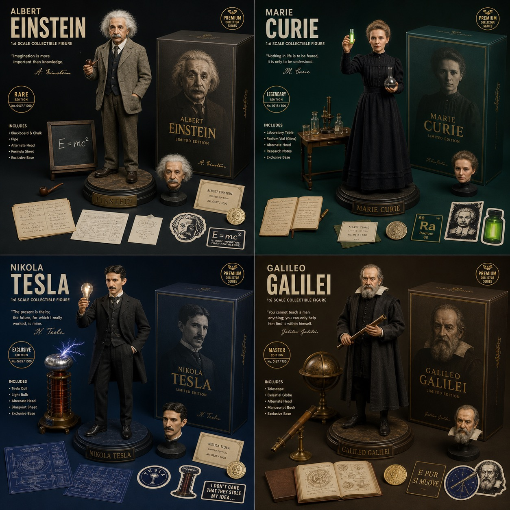

**來源：** [@Gdgtify](https://x.com/Gdgtify/status/2049766203392921897)

**提示詞：**

```text
2x2 grid, do this for 4 famous scientists in history: Design a collector-grade launch visual for [TOY / FIGURE / DESIGNER OBJECT] shown in pristine hero form along with interchangeable accessories, alternate expressions, packaging design, scale references, sticker details, rarity indicators, and close-up material highlights. The object should feel like a luxury drop, somewhere between art toy culture and elite product branding.  Accessory Layout: Arrange [ACCESSORY 1], [ACCESSORY 2], [ALT VERSION], [PACKAGING FEATURE], and [LIMITED EDITION DETAIL] around the figure in carefully staged clusters. Everything should feel desirable, neat, and “unboxable.”  Visual Style: Hype-culture collectible reveal meets premium e-commerce launch campaign. Clean, glossy, tactile, designer-toy sophistication with a playful but expensive sensibility.  Composition Guidelines: Hero figure remains dominant. Accessories should be balanced and elegantly spaced. Packaging should be visible but not steal the scene. The entire image should feel like a product collectors would screenshot instantly.  Lighting & Background: Soft commercial lighting with subtle specular highlights, polished background in [BACKGROUND STYLE], crisp shadows, premium color separation, ultra-sharp details, no watermark.
```

***

<a name="case-366"></a>

### 例 366：咖啡館寫實照片與 2D 塗鴉疊加

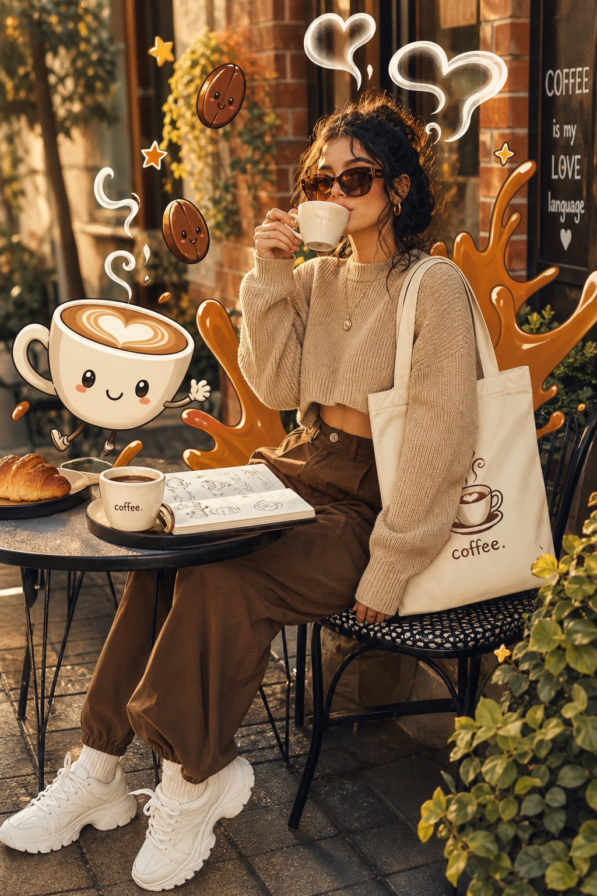

**來源：** [@Jawad\_Rahman\_](https://x.com/Jawad_Rahman_/status/2049796647237066971)

**提示詞：**

```text
A trendy young woman sitting at an outdoor café table, holding a hot coffee cup near her lips. She has short curly black hair and wears oversized tinted sunglasses, a cropped beige sweater, loose brown high-waisted pants, and chunky white sneakers. A tote bag with minimal coffee-themed illustrations hangs on her shoulder.

The scene blends realistic photography with playful 2D cartoon overlays. Floating around her are animated coffee elements: a smiling cappuccino cup with heart-shaped latte art, cute coffee beans with tiny faces, and stylized splashes of caramel forming comic-style shapes. Soft doodle steam rises into hearts and stars.

On the table: a croissant, a notebook with sketch drawings, and a second coffee cup.

Background: a realistic cozy café street with brick walls, plants, warm golden hour lighting, and soft shadows. Slight depth of field, subject in sharp focus.

Style: mix of photorealism and vibrant cartoon illustration, pop-art aesthetic, high saturation but warm tones, clean composition, Instagram-worthy, soft glow, 4k detail.
```

***

<a name="case-367"></a>

### 例 367：VELORA 奢華香水廣告海報

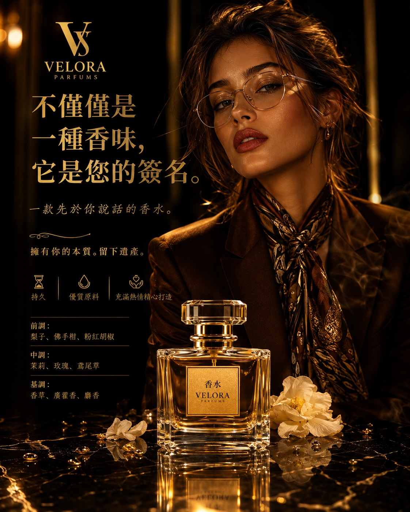

**來源：** [@akkiwani703](https://x.com/akkiwani703/status/2049778680969437564)

**提示詞：**

```text
{
  "image_type": "luxury perfume advertisement poster",
  "resolution": "4K ultra HD (4096x5120)",
  "aspect_ratio": "portrait (4:5)",
  "style": {
    "aesthetic": "high-end fragrance campaign (Tom Ford, Dior inspired)",
    "tone": "dark luxury, sensual, elegant, powerful",
    "color_grading": "deep black shadows with rich golden highlights and warm amber glow",
    "lighting": "cinematic spotlight + golden rim light + soft fill light, dramatic shadows",
    "contrast": "high cinematic contrast",
    "depth_of_field": "shallow, sharp focus on face and perfume bottle"
  },
  "camera": {
    "type": "85mm portrait lens",
    "aperture": "f/1.6",
    "angle": "slightly low angle, premium perspective",
    "framing": "model upper body + product foreground"
  },
  "subject": {
    "gender": "female",
    "age_appearance": "young adult",
    "expression": "confident, sensual, calm",
    "styling": {
      "hair": "voluminous, slightly messy, glossy strands with golden highlights",
      "makeup": "soft glam, glowing skin, bold lips",
      "outfit": "brown tailored blazer with patterned silk scarf",
      "accessory": "thin transparent eyeglasses"
    }
  },
  "product": {
    "type": "luxury perfume bottle",
    "brand": "VELORA PARFUMS",
    "label": "EAU DE PARFUM",
    "design": "clear crystal glass bottle, golden liquid inside, metallic gold cap",
    "placement": "bottom center foreground on glossy black marble surface",
    "effects": "strong reflections, golden glow, subtle condensation, cinematic shine"
  },
  "environment": {
    "background": "dark blurred luxury interior with warm golden light streaks",
    "surface": "black marble with reflections",
    "extra_elements": "small flowers near bottle, golden particles, soft smoke"
  },
  "typography": {
    "logo": "V monogram + VELORA PARFUMS",
    "headline": "Not just a scent, It’s your Signature.",
    "tagline": "A fragrance that speaks before you do.",
    "secondary": "Own your essence. Leave a legacy.",
    "features": [
      "Long Lasting",
      "Premium Ingredients",
      "Crafted with Passion"
    ],
    "notes": [
      "Top: Pear, Bergamot, Pink Pepper",
      "Heart: Jasmine, Rose, Orris",
      "Base: Vanilla, Patchouli, Musk"
    ],
    "font_style": "luxury serif + elegant handwritten script",
    "color": "gold metallic",
    "placement": "top left + mid left + bottom balanced layout"
  },
  "post_processing": {
    "sharpness": "ultra sharp on face and bottle",
    "glow": "golden cinematic glow",
    "retouch": "high-end editorial finish",
    "vignette": "subtle dark vignette"
  },
  "mood": "premium luxury perfume campaign, cinematic, bold brand identity",
  "quality": "hyper-realistic, 4K ultra HD, commercial grade, award-winning fragrance ad"
}
```

***

<a name="case-368"></a>

### 例 368：印度餐廳選單改造宣傳圖

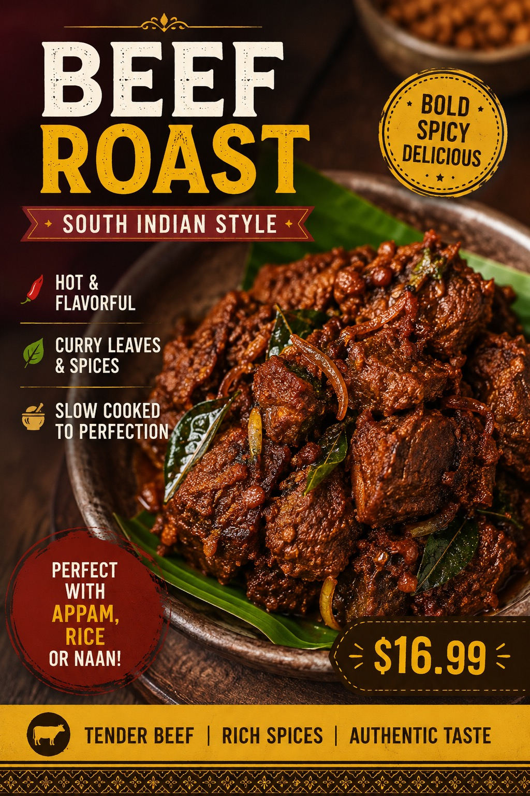

**來源：** [@Johnson998877](https://x.com/Johnson998877/status/2050354965110268123)

**提示詞：**

```text
這是india 料理中的一份真實menu。根據此 重新生成帶文字說明的 引人入勝垂涎欲滴的 說明圖片 先用English 文字易於識別（手機小螢幕） 這個是beef roast
```

***

<a name="case-369"></a>

### 例 369：明洞旅遊區域地圖

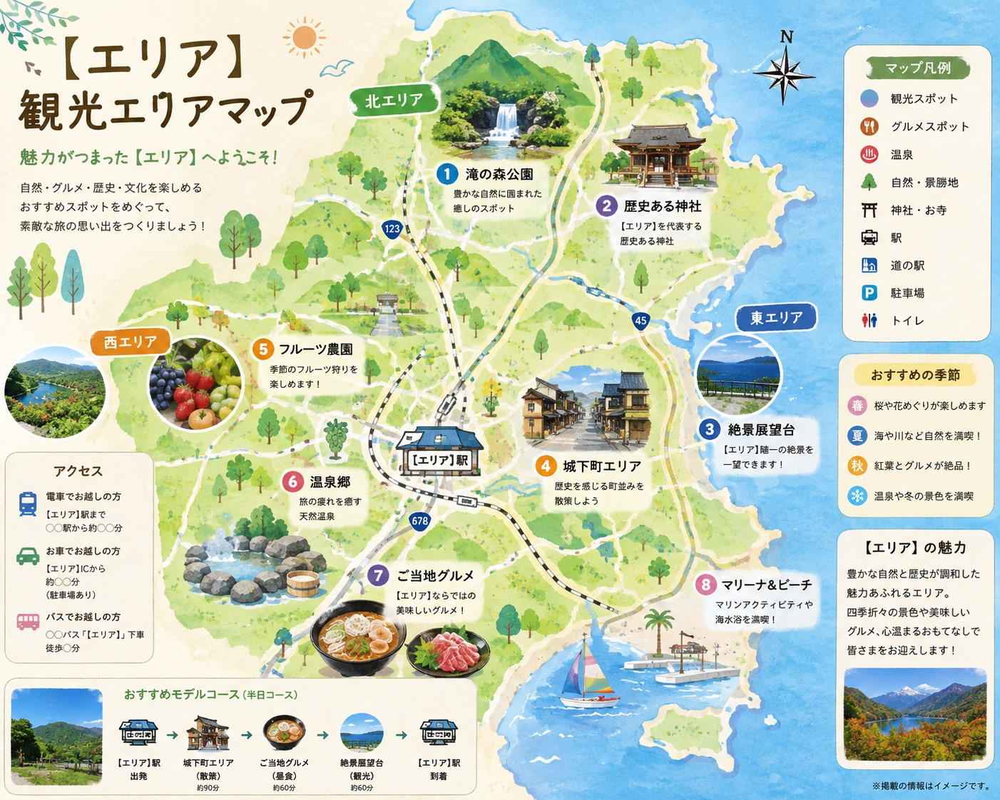

**來源：** [@so\_ainsight](https://x.com/so_ainsight/status/2050354639036654048)

**提示詞：**

```text
[エリア]の観光エリアマップを畫像で作成して
```

***

<a name="case-370"></a>

### 例 370：Crumple Chair 概念沙發研發板

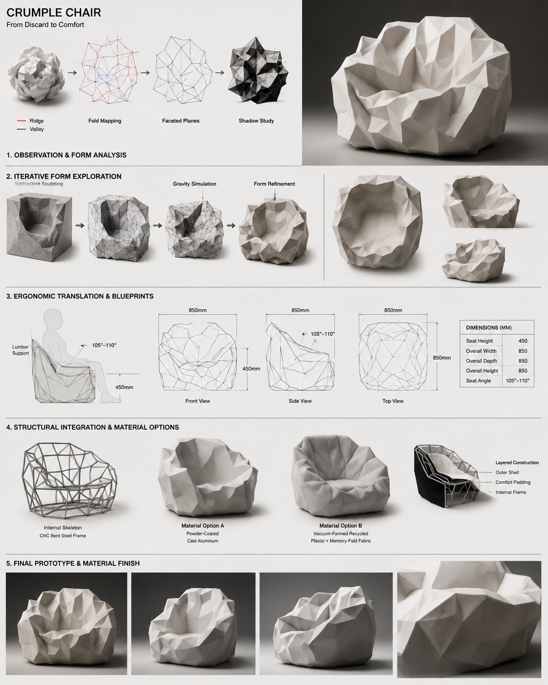

**來源：** [@ShamsAmin56](https://x.com/ShamsAmin56/status/2050281206139461780)

**提示詞：**

```text
Design Concept: The Crumple Chair Core Philosophy: Translating the "controlled chaos" of a tossed paper ball into a sculptural, high-comfort seating experience.

Stage 1: Observation & Morphological Analysis The goal is to deconstruct the image of the crumpled paper into usable geometric data. Crease Mapping: Identify the primary "valley" and "ridge" lines. These represent potential structural ribs or seams in the chair. Faceted Planes: Break down the sphere into a series of non-uniform polygons. Each flat surface of the paper becomes a potential panel for the chair’s upholstery or shell. Shadow Study: Analyze how the "tossed" form creates deep recesses. These natural pockets guide where the user’s weight will be cradled.

Stage 2: Iterative Form Exploration Moving from a sphere to a seat through "Digital Crumpling." Subtractive Sculpting: Imagine the paper ball as a solid mass. Use Boolean operations to "carve out" a seating cavity that fits the human form while maintaining the external jagged texture. Tension Simulation: Use 3D software (like Rhino or Blender) to simulate a flat sheet of material being compressed. This ensures the folds look authentic and not "modeled." The "Toss" Logic: Experiment with gravity-based simulation dropping a digital mesh to see how it settles naturally, mimicking the "tossed" origin.

Stage 3: Ergonomic Translation & Blueprinting Refining the raw aesthetic into a functional object. The Comfort Core: Overlay a standard ergonomic template (Seating Angle: 105°–110°) over the crumpled form. Adjust the internal "folds" to provide lumbar support and pressure relief. Blueprint Generation: Create technical orthographic views (Front, Side, Top). Map out the dimensions: Seat Height: 450mm Total Width: 850mm Surface Smoothing: Maintain the sharp "paper edges" on the exterior shell while softening the interior contact points for skin comfort.

Stage 4: Structural Integration & Scaling Making the concept physically viable. The Skeleton: Design a hidden internal frame (likely CNC-bent steel rods or a 3D-printed lattice) that follows the most prominent ridges of the paper folds to provide rigidity. Material Selection: * Option A (High-End): Faceted, cast aluminum with a white powder coat. Option B (Soft): Vacuum-formed recycled plastic shell covered in "memory-fold" technical fabric that retains a wrinkled appearance.

Stage 5: Final Prototyping & Material Finish Textural Replication: Apply a matte, slightly porous finish to the material to mimic the tactile feel of heavy-bond paper. Lighting Contrast: Use directional studio lighting in the final renders to emphasize the "tossed" shadows, making the chair look like a giant piece of discarded inspiration. Design Tip: To keep the "tossed" look authentic, avoid symmetry. The most compelling aspect of a crumpled paper ball is its unique irregularity—ensure the left and right sides of the chair are balance-equivalent but not identical
```

***

<a name="case-371"></a>

### 例 371：Scrapbook 真人圖與迷你分身

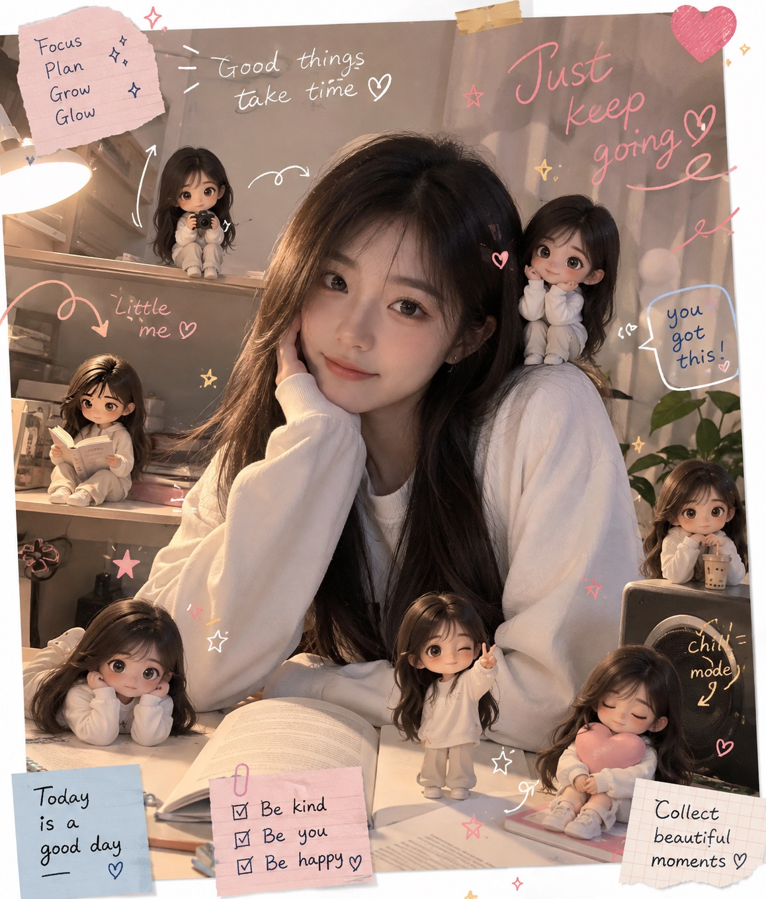

**來源：** [@Kashberg\_0](https://x.com/Kashberg_0/status/2050272100884340783)

**提示詞：**

```text
Transform the provided reference image into a cozy aesthetic scrapbook-style composition while strictly preserving the original subject, identity, pose, lighting, and background.

Add multiple small “mini version” characters of the same person (chibi / doll-like style), placed naturally around the scene (on objects, table, shoulder, etc.). These mini figures must match the subject’s face, hairstyle, outfit, and vibe consistently, styled as cute 3D collectible figurines. Show them doing different activities (reading, posing, taking photos, relaxing).

Overlay handwritten-style doodles and annotations across the image: arrows, hearts, stars, sparkles, icons, and playful captions connected to elements in the scene.

Use a soft pastel color palette (white base with pink, peach, blue accents).

Keep the frame visually rich and filled but balanced and clean.

Style: warm, cozy lighting, dreamy Instagram scrapbook aesthetic, soft depth of field, highly detailed, polished but playful.

The final result must look like the SAME original image enhanced with mini alter-egos and aesthetic annotations — not a recreated or different scene.
```

***

<a name="case-372"></a>

### 例 372：可愛角色設定表

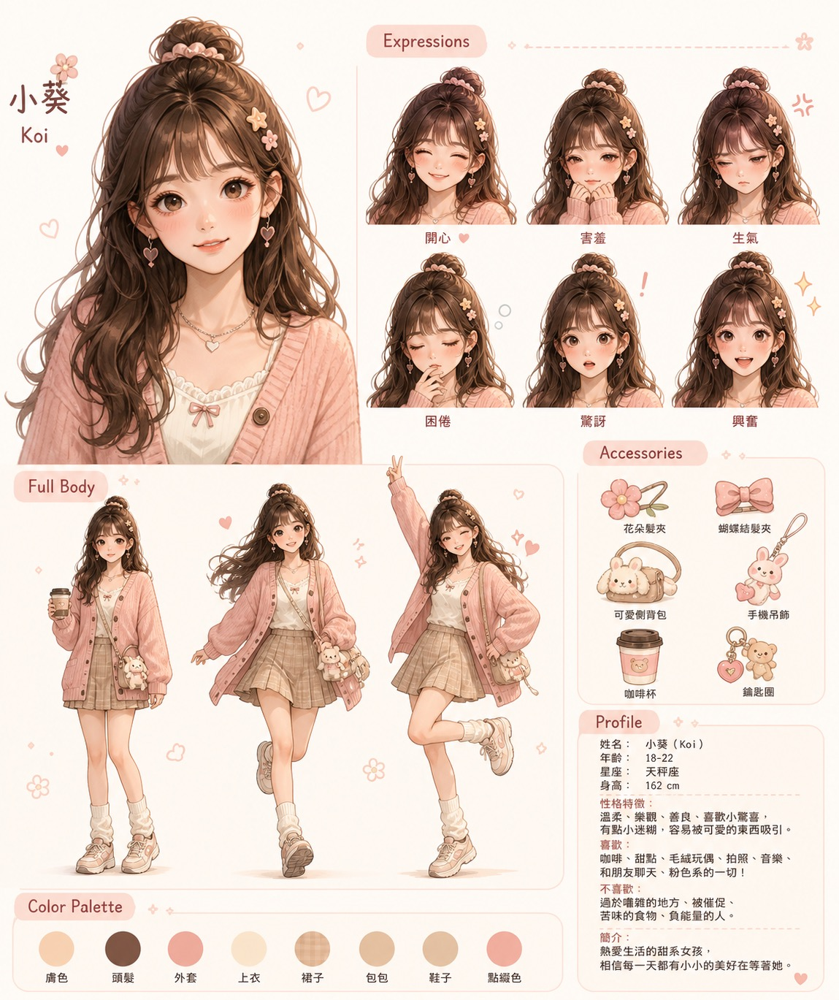

**來源：** [@xRahultripathi](https://x.com/xRahultripathi/status/2050152865566708134)

**提示詞：**

```text
Create a cute female character design sheet inspired by the uploaded image.

Style: warm, soft, semi-realistic cartoon illustration with a cozy Japanese kawaii vibe (pastel tones, smooth shading, clean lineart).

Make it a clean character concept poster layout including:

One large main female portrait (front view, detailed)

Facial expression set (happy, shy, annoyed, sleepy, surprised, excited)

2–3 full-body poses (standing, walking/running, playful pose)

Small accessory/object icons that match her personality (hair clip, cute bag, phone charm, coffee cup, keychain)

A simple color palette section (skin, hair, outfit, accent colors)

A profile info box with: name, age range, personality traits, likes/dislikes, short description

Overall look should feel charming, cozy, feminine, and professionally arranged like an animation character design sheet.
High quality, clean background, soft lighting.
```

***

<a name="case-373"></a>

### 例 373：高階肉類海鮮品牌英雄圖

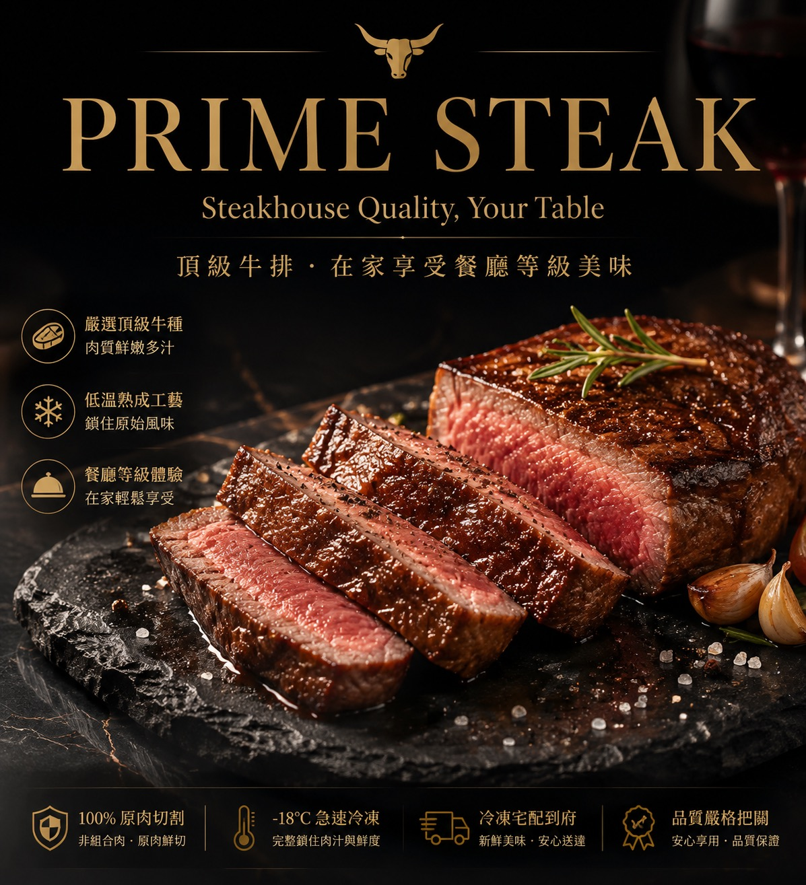

**來源：** [@xpg0970](https://x.com/xpg0970/status/2050108279385419965)

**提示詞：**

```text
一、品牌基礎設定
品牌名稱：[請填寫，例如：PRIME STEAK / OCEAN PRIME]
品牌標語：[請填寫，例如：Steakhouse Quality, Your Table / Restaurant Grade, Home Delivered]
主色調：[請填寫，例如：黑金 / 深紅+金 / 深藍+銀]
字型風格：
標題：[請填寫，例如：金色襯線體，大寫，奢華感]
正文：[請填寫，例如：細襯線體/無襯線體]
二、核心視覺元素
檯面材質：[請填寫，例如：大理石/黑色石板]
背景調性：[請填寫，例如：深色漸變/暗調餐廳環境]
光線風格：[請填寫，例如：聚光/側光/頂部照明]
三、主產品定義（必填）
產品名稱/型別：[請填寫，例如：和牛牛排 / 帝王蟹 / 北極甜蝦]
產品數量/擺放：[請填寫，例如：1份單品 / 3塊整齊擺放]
呈現方式：[請填寫，例如：切片展示 / 帶骨展示 / 原殼展示]
產品特色/質感提示：[請填寫，例如：肉質紋理清晰、多汁感 / 光澤晶亮 / 肉眼可見油花]
```

***

<a name="case-374"></a>

### 例 374：彩色潦草小狗線條風格重繪

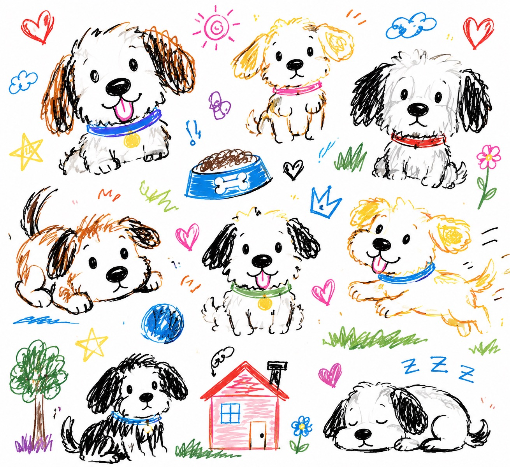

**來源：** [@berryxia](https://x.com/berryxia/status/2050226420681757102)

**提示詞：**

```text
彩色潦草小狗線條風格繪製該圖，童趣和doodle加入其中，務必使用毫無章法的繪製手法，凌亂和草率即可。
```

***

<a name="case-375"></a>

### 例 375：古希臘三哲時間軸城市圖

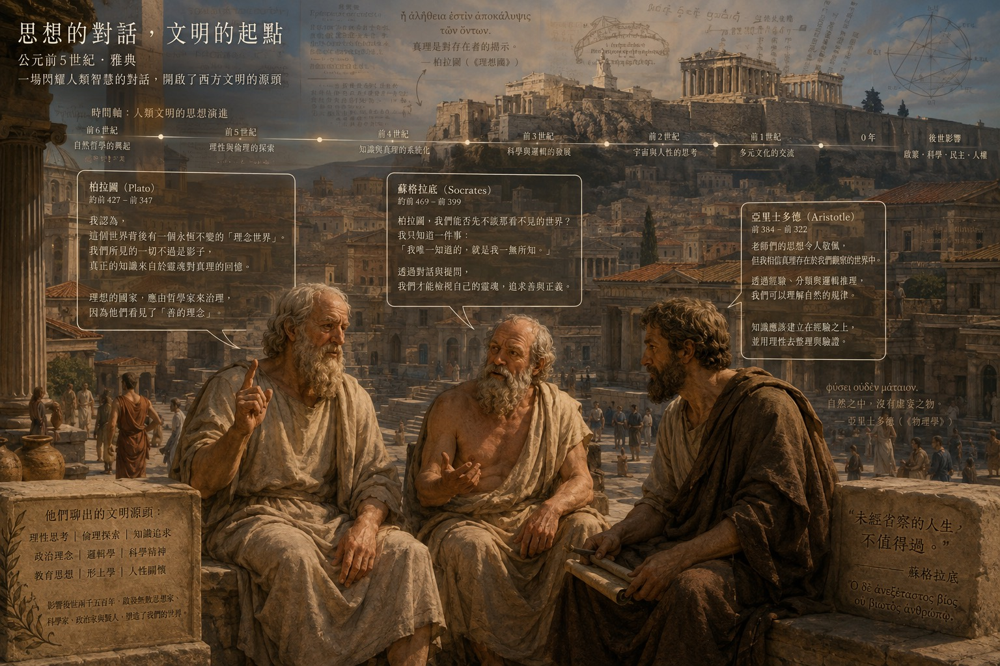

**來源：** [@ToroJushiAi](https://x.com/ToroJushiAi/status/2050713034503409874)

**提示詞：**

```text
二千五百年前，柏拉圖，蘇格拉底， 亞力士多德，坐在雅典街頭聊天，聊出了世界文明史的源頭。

背景可以加上他們聊天內容，按時間軸的走向，重疊在古希臘雅典的城市風光中。
```

***

<a name="case-376"></a>

### 例 376：潑灑抹茶街頭手機照片

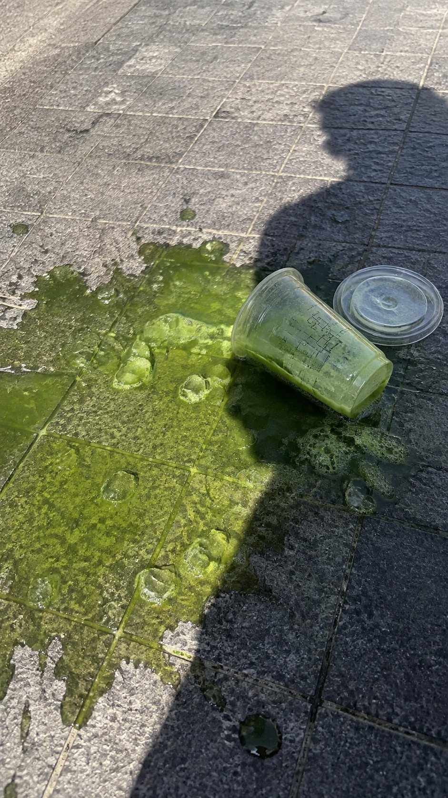

**來源：** [@Shinning1010](https://x.com/Shinning1010/status/2050693240253214894) / [提示词回复](https://x.com/Shinning1010/status/2050693246247207087)

**提示詞：**

```text
A realistic vertical smartphone photo of a spilled green iced drink on outdoor stone pavement, a transparent disposable plastic cup lying on its side inside the green puddle, clear plastic lid nearby, scattered ice cubes floating in the drink, small foam bubbles on the surface, green liquid naturally spreading across rough square floor tiles, strong midday sunlight, harsh realistic shadows, a dark human shadow silhouette cast across the ground and partially over the spill, accidental street moment, urban documentary photography, handheld phone camera perspective, slightly top-down angle, natural colors, realistic pavement texture, raw unedited photo look, high detail, authentic everyday scene, 9:16 vertical composition

Negative Prompt:
cartoon, illustration, anime, CGI, 3D render, fantasy style, studio lighting, overly perfect composition, overly clean floor, fake liquid, unrealistic reflections, plastic-looking liquid, oversaturated green, blurry, low resolution, distorted cup, melted plastic, extra cups, duplicated objects, readable brand logo, messy text, watermark, poster design, dramatic artificial lighting, excessive sharpening, over-processed, unrealistic shadow, floating ice, deformed perspective
```

***

<a name="case-377"></a>

### 例 377：櫻花咖啡戶外人像

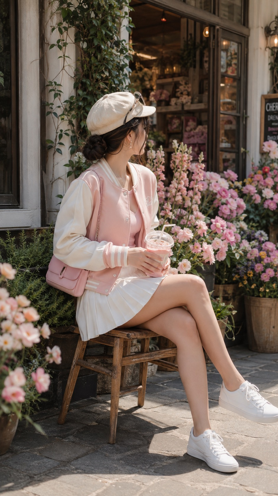

**來源：** [@xRahultripathi](https://x.com/xRahultripathi/status/2050677614168391716)

**提示詞：**

```text
Edit the provided image while preserving the same face identity, shape, and facial features without altering age, ethnicity, or structure. Maintain a calm, relaxed expression with the subject not looking at the camera.

Subject: young woman (18–23) with soft feminine beauty, smooth glowing skin, natural texture.
Pose (strict): seated on a wooden chair, body angled sideways (45–70°), legs crossed naturally, upper body slightly leaning forward, head turned away from camera, gaze to the side. She holds a drink cup with a straw using both hands.
Framing: full-body vertical (9:16), head to shoes visible, centered but slightly offset for natural composition.
Outfit: light pink varsity jacket with white stripes, soft pink inner top, modest knee-length pleated skirt, white sneakers.
Accessories: beige newsboy cap, sunglasses (on face or cap), pink shoulder bag, small earrings.
Hair: neat low bun with soft loose strands.
Environment: outdoor flower shop street scene with pastel flowers (pink, soft tones), decorative plants, floral storefront.
Lighting: bright natural daylight, soft glossy skin highlights, balanced exposure, soft shadows.
Camera: low/frog angle (slightly below, looking up), 50mm lens, shallow depth of field.
Color grading: warm pastel palette (pink, cream), clean bright lifestyle aesthetic.
Quality: ultra-photorealistic, 8K detail, DSLR realism, natural skin texture.
Negative: front-facing, eye contact, close-up, cropped body, mini/short skirt, indoor scene, dark lighting, anime, cartoon, CGI, plastic skin, distorted anatomy.
--ar 9:16 --style raw --quality high
```

***

<a name="case-378"></a>

### 例 378：高階 3D 收藏玩具頭像

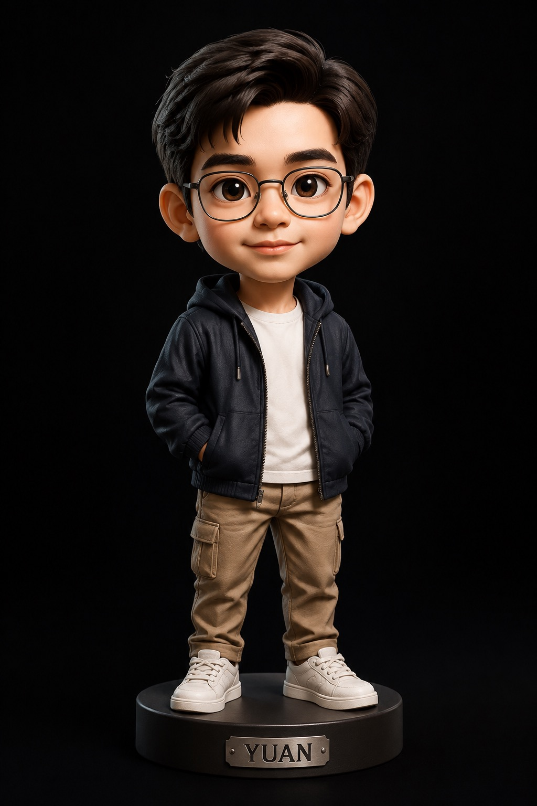

**來源：** [@Genematicai](https://x.com/Genematicai/status/2050654848216109429) / [提示词回复 1](https://x.com/Genematicai/status/2050654987135656043) / [提示词回复 2](https://x.com/Genematicai/status/2050655151120429464)

**提示詞：**

```text
Transform the input photo into a high-end stylized 3D collectible figure. Large head, slightly exaggerated facial features while preserving identity. Hyper-detailed skin texture with subtle pores, realistic wrinkles, and a cinematic expression.

Smooth matte vinyl finish. Soft studio lighting, clean black background. Ultra-sharp focus, 8K render, photorealistic materials, Pixar-quality rendering, centered composition, full body, premium designer toy aesthetic.
```

***

<a name="case-379"></a>

### 例 379：品牌人格漫畫資訊圖表

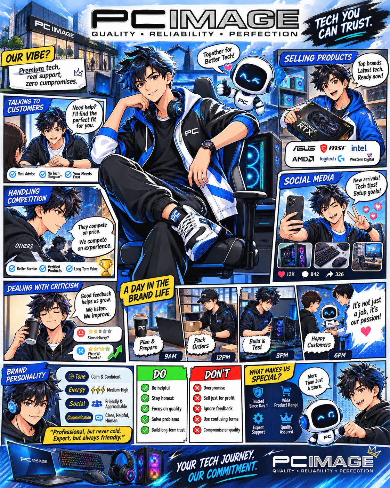

**來源：** [@CallumGrey](https://x.com/CallumGrey/status/2051293342139584922) / [PhotoGPT prompt](https://www.photogptai.com/community-gallery/media/0d2fcf15-6ab2-48d3-04b3-71f58b296000)

**提示詞：**

```text
Using the uploaded logo, create a highly detailed, comic-style infographic poster:

“What This Brand Feels Like”

GOAL:
Turn the brand into a living personality and visually explain how it behaves, speaks, and interacts with the world.
This must feel like a mix of: brand strategy + character design + comic storytelling.

---

CORE RULE:
Everything must come from the logo:
- colors
- style
- tone
- personality

No generic personality traits.

---

MAIN STRUCTURE:
Vertical 4:5 poster
Dense layout with multiple panels
Comic + infographic hybrid

---

TOP SECTION:
- Brand name
- Short personality statement (max 6 words)
Example: “Quiet confidence with sharp edges”

---

MAIN CHARACTER (VERY IMPORTANT):
Create a central character representing the brand:
- humanized version of the brand
- outfit reflects brand style
- posture + expression reflect personality

---

AROUND THE CHARACTER:
Create 6–8 comic panels showing how the brand behaves in different situations.

---

SCENARIO IDEAS:
- Talking to customers
- Handling competition
- Selling a product
- Social media presence
- Reacting to criticism
- Daily “brand life” moment

---

FOR EACH PANEL:
Include:
- short caption (max 6 words)
- speech bubble or internal thought
- clear visual action

---

TONE EXAMPLES:
Luxury brand: calm, confident, minimal speech
Playful brand: loud, chaotic, expressive
Tech brand: precise, logical, clean

---

PERSONALITY TRAITS SECTION:
Add small labeled blocks:
- Voice tone (e.g. calm, bold, playful)
- Energy level (low / medium / high)
- Social behavior (introvert / extrovert)
- Communication style

Use:
- icons
- short labels

---

DO / DON’T SECTION:
Add a split block:
DO:
- how the brand should act
DON’T:
- what breaks the identity

Keep:
- very short phrases

---

VISUAL ELEMENTS:
- speech bubbles
- icons
- arrows
- small reactions
- exaggerated comic expressions

---

STYLE:
- comic + editorial hybrid
- slightly exaggerated but still premium
- expressive but not childish

---

COLOR:
- strictly based on logo palette
- use color to reinforce personality

---

DEPTH:
- 20–40 visual elements
- multiple small panels
- layered composition

---

IMPORTANT RULES:
- must feel alive
- must feel specific
- no generic marketing words
- no empty areas
- keep text short but impactful

---

FINAL FEEL:
Like:
- a brand strategy turned into a character
- a visual storytelling board
- something people save and study

NOT:
- flat
- generic
- minimal
```

***

<a name="case-380"></a>

### 例 380：冠狀病毒尺度縮放科學資訊圖表

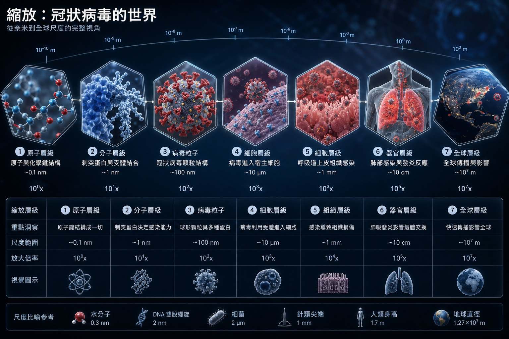

**來源：** [@Gdgtify](https://x.com/Gdgtify/status/2051288232613351571)

**提示詞：**

```text
instructions> [SUBJECT]=Coronavirus. A hyper-realistic 3D zoom-sequence infographic generated from a single input: [SUBJECT]. The system auto-detects scale layers from atomic/subcomponent to full contextual view. Layout Structure (CRITICAL) 6–8 circular or hexagonal frames arranged in expanding sequence Innermost frame = smallest detectable detail; outermost = full subject in environment Frames connected by subtle zoom-path lines No repeated scales — each frame shows new level of detail Frame Design Each zoom level includes: Hyper-detailed 3D render at that scale Micro label: scale name (e.g., "molecular," "cellular," "structural") + 3–5 word insight Optional: measurement tag or magnification factor Contextual Halo Around the sequence, include only scale-specific references: Measurement units, scientific notation, cultural scale metaphors (No generic magnifying glass icons) Scale Panel (Alternative Layout) Zoom level Key insight (3–5 words) Scale factor tag Detail icon (grid, wave, particle, etc.) Title "[SUBJECT]: AT EVERY SCALE" (or) "ZOOM: THE WORLD OF [SUBJECT]" Style: ultra-realistic 3D render, scientific editorial infographic, precise macro lighting, global illumination, shallow depth of field, clean sequential layout. </instructions>
```

***

<a name="case-381"></a>

### 例 381：90 年代公寓場景參考板

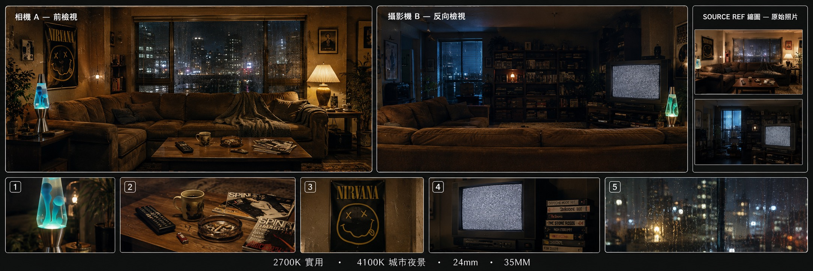

**來源：** [@Iancu_ai](https://x.com/Iancu_ai/status/2051287273581203888) / [提示词回复](https://x.com/Iancu_ai/status/2051287283140096253)

**提示詞：**

```text
{
  "type": "scene reference board — 90s apartment living room, cinematic night",
  "style": "cinematic film photography, 35mm grain, warm amber shadow fill, deep chiaroscuro lighting, hyper-detailed interior, production design reference quality",
  "layout": {
    "main_panel_center_left": {
      "label": "CAMERA A — FRONT VIEW",
      "scene": "Wide shot, L-shaped tan sectional sofa, grey knit throw blanket, wooden coffee table (remote, mug, ashtray, Rolling Stone stack), lava lamp left, table lamp right, rain-streaked city window behind, Nirvana poster left wall. 35mm grain."
    },
    "main_panel_center_right": {
      "label": "CAMERA B — REVERSE VIEW",
      "scene": "Wide reverse from behind sofa. CRT TV prominent right, grey static screen. Tall bookshelf, VHS tapes. Cool blue backlight from window behind camera. Deep shadow."
    },
    "prop_strip_bottom": "6 close-up tiles: 1. LAVA LAMP — chrome base, blue-green wax blobs; 2. COFFEE TABLE — remote, mug, ashtray, magazines; 3. NIRVANA POSTER — black smiley face, wall texture; 4. CRT TELEVISION — static screen, VHS stack; 5. WINDOW/RAIN — city bokeh, water streaks; 6. THROW BLANKET — sofa corner, worn upholstery",
    "top_right_inset": "SOURCE REF thumbnail — original photo",
    "footer": "2700K PRACTICAL · 4100K CITY NIGHT · 24mm · 35MM"
  },
  "background": "deep charcoal #1a1a1a, thin white separators",
  "dimensions": "wide landscape 3:1, high resolution"
}
```

***

<a name="case-382"></a>

### 例 382：春日花田三聯豎版寫真拼貼

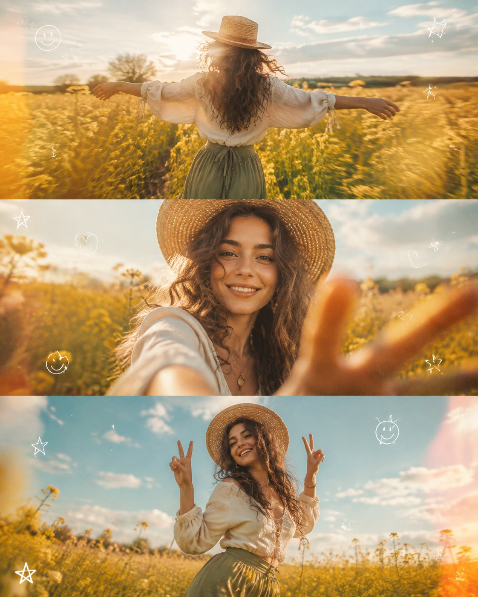

**來源：** [@frametheory058](https://x.com/frametheory058/status/2051294907214844249)

**提示詞：**

```text
A high-quality 3-panel vertical photo collage of a stunning uploaded woman with soft, voluminous wavy hair glowing in golden sunlight. She is styled in a cream-colored lace-up vintage blouse with delicate textures, olive green high-waisted flowy trousers, and a wide-brimmed straw hat slightly tilted for a fashionable editorial look. Light golden jewelry (thin chains, rings) adds a subtle luxury touch.

The setting is a dreamy, vibrant yellow mustard flower field under a bright blue sky with soft clouds, enhanced by golden hour lighting for a magical glow.

Top panel: Back view of the woman standing in the field with arms wide open, sunlight creating a glowing halo around her hair, slight motion blur in flowers for a cinematic feel.

Middle panel: Close-up portrait, she smiles naturally at the camera, wind softly moving her hair, her hand reaching toward the lens creating depth and a slightly blurred foreground for a DSLR effect.

Bottom panel: Playful pose, she leans sideways in the flowers, making a double peace sign, laughing candidly, capturing an authentic joyful moment.

Add cute, trendy white doodle overlays (smiley faces, sparkles, stars, tiny hearts) with a subtle animated/sketchy feel. Include light leaks, sun flares, and soft film grain for a premium Instagram aesthetic.

Ultra-realistic, 4K, cinematic lighting, shallow depth of field, high dynamic range, natural skin tones, editorial fashion photography, soft pastel color grading.

Aspect ratio: 4:5
Style tags: viral Instagram aesthetic, Pinterest style, dreamy spring vibe, candid luxury
```

***

<a name="case-383"></a>

### 例 383：AI 日常生活 iPhone 抓拍

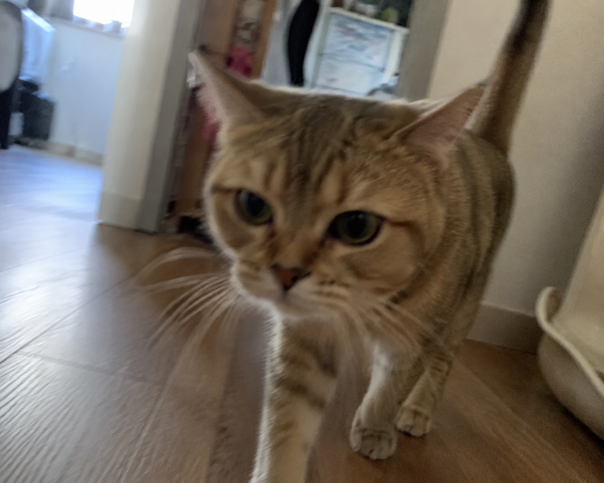

**來源：** [@Ciri_ai](https://x.com/Ciri_ai/status/2051292618248904809)

**提示詞：**

```text
I want to see what you really look like.
Draw a snapshot of your everyday life as if it were accidentally taken on an iPhone.
Make it feel like a very ordinary, imperfect candid shot.
The photo should have slight motion blur, with uneven, natural lighting.
```

***

<a name="case-384"></a>

### 例 384：十國傳統服飾時尚拼貼

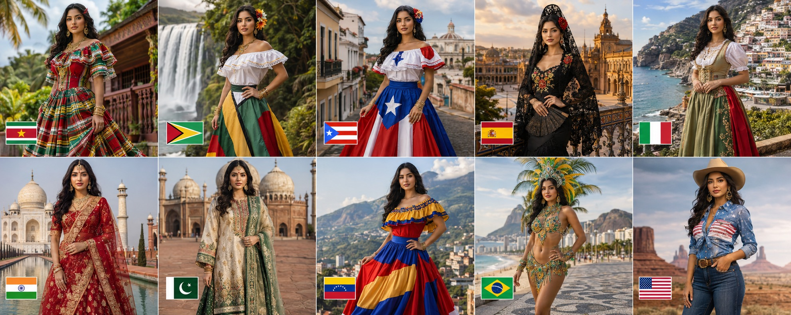

**來源：** [@amynys](https://x.com/amynys/status/2051287229532639677)

**提示詞：**

```text
A 10-Nation Cinematic Fashion Transformation of One Timeless BeautyChatGPT Prompt:

A highly aesthetic, ultra-realistic cinematic collage featuring the exact same beautiful young woman from the reference image, shown in 10 different poses within one single image layout (5x2 grid style). Each frame represents a different country’s traditional cultural dress, styled in a modern, elegant, fashion-forward way. The woman is the SAME person in every frame: she has shoulder-length wavy dark brown hair, captivating dark brown eyes, full plump lips with a subtle confident smile, flawless warm olive-toned skin, high cheekbones, and a voluptuous yet athletic figure with a prominent bust, slim waist, and toned physique — exactly matching the woman in the provided reference photo.

Design details:

Each of the 10 frames shows this same woman in different traditional outfits inspired by the following countries: Suriname, Guyana, Puerto Rico, Spain, Italy, India, Pakistan, Venezuela, Brazil, and the USA.

Every outfit is a modern, elegant, fashion-forward interpretation of that country’s cultural heritage.

Each mini-frame includes a small national flag icon in the top-right corner.

The woman’s expressions vary: smiling, confident, graceful, playful, elegant, royal, modern fusion fashion poses.

High-fashion editorial photography style.

Soft cinematic lighting, ultra-detailed textures, realistic skin tones.

Backgrounds subtly match each country’s cultural aesthetic (landmarks, streets, patterns, colors, architecture).

Luxury fashion magazine layout style.

Clean grid composition, visually balanced, highly shareable social media design.

Style: Ultra-realistic, 8K resolution, Vogue editorial shoot, cinematic lighting, soft depth of field, trending Instagram aesthetic, fashion photography masterpiece.
```

***

<a name="case-385"></a>

### 例 385：青島啤酒靈感女裝系列

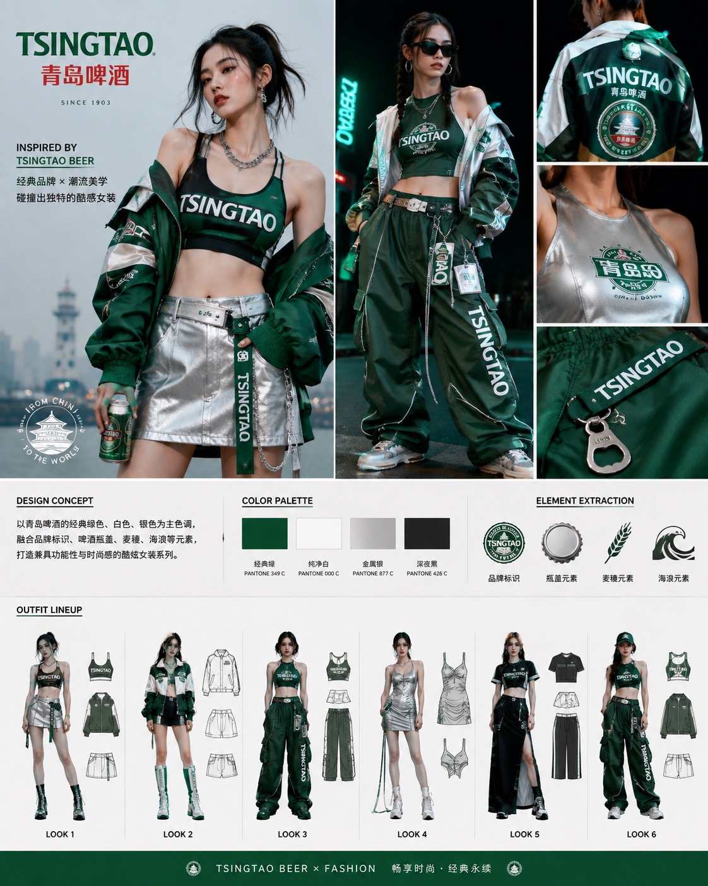

**來源：** [@Popcraft_ai](https://x.com/Popcraft_ai/status/2051142270381170754)

**提示詞：**

```text
Inspired by Tsingtao (China beer)🍺

“Inspired by this product, design a set of cool-style women's clothing”
```

***

<a name="case-386"></a>

### 例 386：品牌包絡產品廣告

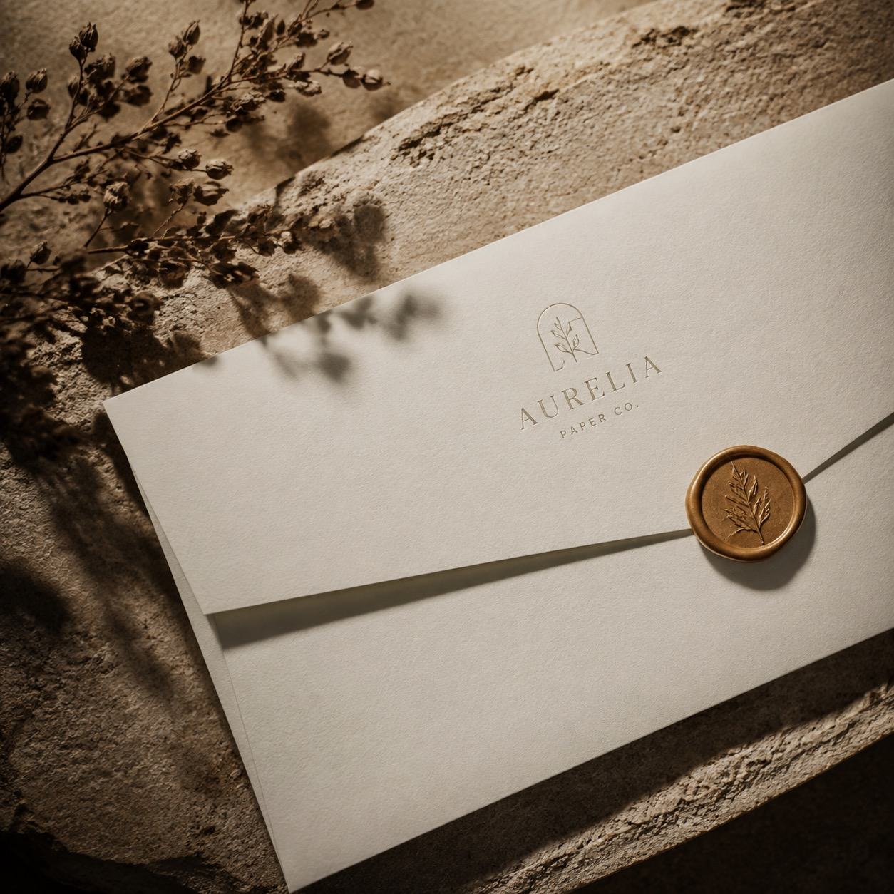

**來源：** [@SRKDAN](https://x.com/SRKDAN/status/2051482047248560393) / [提示词回复](https://x.com/SRKDAN/status/2051482048729166109)

**提示詞：**

```text
The Brand Envelope | GPT Image-2 Prompt #89

This takes any product photo and wraps it in your specific brand world. Different product each time. Same brand, every time.

PHASE 1 / ANCHOR: Describe [BRAND IDENTITY] in 2 lines. Palette, texture, mood.
PHASE 2 / INJECT: Place [PRODUCT] inside that brand world, not the reverse.
PHASE 3 / FORMAT: Set [OUTPUT FORMAT]. Hero, square ad, or story.
PHASE 4 / SIGNATURE: Apply [BRAND ELEMENT]. Grain, shadow, or overlay.

Swap: [BRAND IDENTITY] / [PRODUCT] / [FORMAT]
```

***

<a name="case-387"></a>

### 例 387：Netflix 首頁主視覺 UI

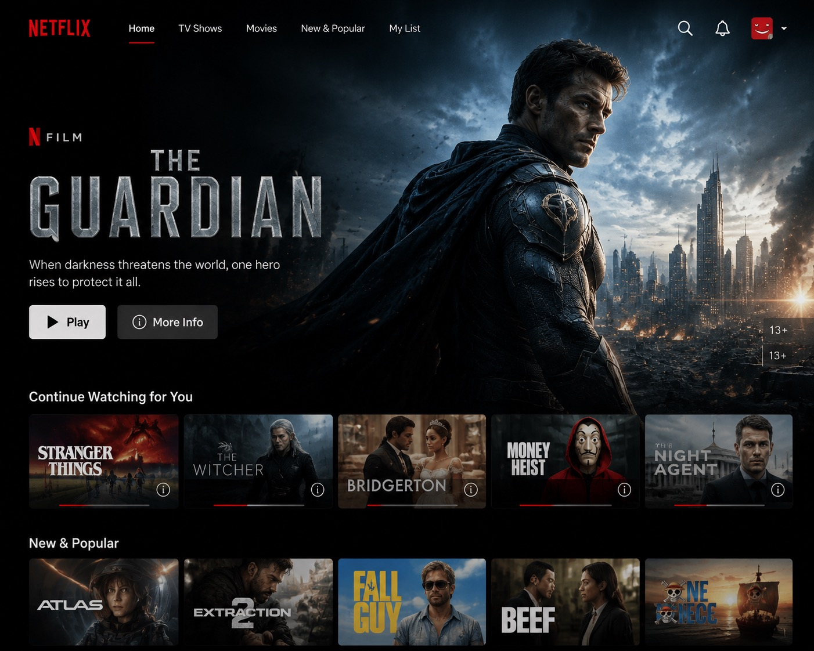

**來源：** [@aimikoda](https://x.com/aimikoda/status/2051420440451801240)

**提示詞：**

```text
Create a Netflix homepage UI featuring a main hero film with its title and still generated from the uploaded reference.
```

***

<a name="case-388"></a>

### 例 388：1980s Claude 復古雜誌廣告

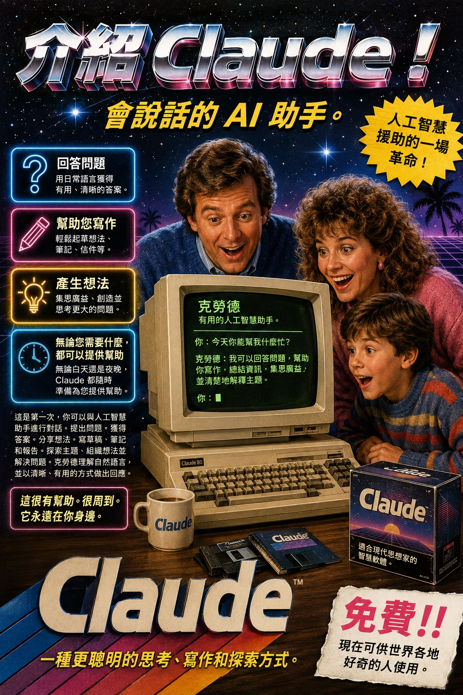

**來源：** [@Shinning1010](https://x.com/Shinning1010/status/2051410804805599436) / [提示词回复](https://x.com/Shinning1010/status/2051410812829335959)

**提示詞：**

```text
A fictional 1980s magazine advertisement poster introducing “Claude” as a revolutionary home AI assistant, retro commercial print ad style, bold headline at the top reading “Introducing Claude!”, large chrome metallic 3D typography with pink and blue reflections, yellow italic tagline underneath: “The AI assistant that talks back.”

Center composition: a beige 1980s CRT home computer with chunky keyboard on a wooden desk, green monochrome terminal screen glowing, readable text on screen: “Claude”, subtitle: “The helpful AI assistant.” On the screen, a retro terminal-style conversation reads:
“YOU: How can you help me today?”
“CLAUDE: I can answer questions, help you write, summarize information, brainstorm ideas, and explain topics clearly.”
“YOU:”

A cheerful 1980s family of three gathers around the computer: father in a blue sweater, mother with curly hair in a pink sweater, young boy in a striped sweater, all looking amazed, delighted, and fascinated, warm nostalgic expressions, classic family technology advertising mood.

Background: dark starry night sky, purple and blue neon perspective grid, retro sci-fi glow, subtle palm silhouettes, sparkling highlights, lens flares, dramatic yet friendly atmosphere.

Poster layout: left side contains stacked retro feature boxes with glowing neon icons, including a question mark, pencil, light bulb, and clock. Each feature box includes short retro advertising copy:
“ANSWERS QUESTIONS” — Get helpful, clear answers in everyday language.
“HELPS YOU WRITE” — Draft ideas, notes, letters, and more with ease.
“GENERATES IDEAS” — Brainstorm, create, and think bigger.
“AVAILABLE WHENEVER YOU NEED IT” — Day or night, Claude is ready to help.

Add a small retro text block describing Claude:
“For the first time, an AI assistant you can have a conversation with. Ask questions. Get answers. Share ideas. Write drafts, notes, and reports. Explore topics, organize thoughts, and solve problems. Claude understands natural language and responds in a clear, helpful way.”

Add a short highlighted copy block:
“It’s helpful. It’s thoughtful.
It’s always by your side.”

Bottom area includes a large “Claude” brand wordmark with colorful diagonal retro stripes, and the slogan:
“A smarter way to think, write, and explore.”

Bottom right has a white promotional price sticker area with bold pink text:
“Free!!”
Smaller text underneath:
“Available now for curious minds everywhere.”

Top right has a bright yellow starburst badge saying:
“A REVOLUTION IN AI ASSISTANCE!”

Include a retro product box on the desk labeled “Claude” with small text:
“SMARTER SOFTWARE FOR MODERN THINKERS.”

Include a mug or accessory on the desk branded “Claude”.

Visual style: 1985 consumer computer advertisement, airbrushed illustration, glossy print texture, halftone details, nostalgic retro futurism, high saturation, cinematic product lighting, authentic 1980s typography and layout, readable ad composition, detailed vintage commercial poster, highly polished, warm family-friendly mood, retro tech fantasy, vertical poster.

Negative prompts:
modern laptop, smartphone, flat design, minimalism, futuristic 2020s interface, cyberpunk overload, messy layout, unreadable typography, distorted text, misspelled words, deformed hands, extra fingers, bad anatomy, duplicate people, plastic skin, overexposed lighting, low resolution, blurry image, warped computer, broken keyboard, cluttered composition, inconsistent vintage style, random symbols, ugly poster design, poor hierarchy, incorrect perspective
```

***

<a name="case-389"></a>

### 例 389：Transparent Labs Hydrate 健身補劑 Campaign

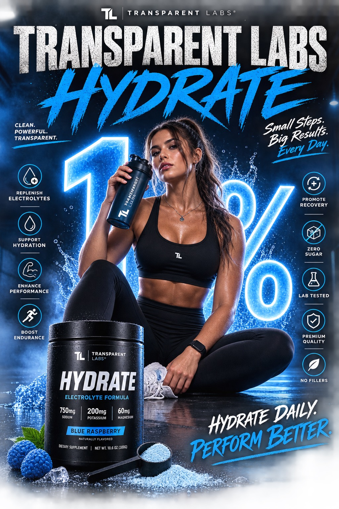

**來源：** [@amynys](https://x.com/amynys/status/2051409591137972606)

**提示詞：**

```text
Create a striking campaign poster that stops people mid-scroll for Transparent Labs Hydrate.

Bold high-impact supplement advertisement with dramatic black and deep electric blue color palette, gritty premium fitness aesthetic, sharp cinematic lighting, glossy reflections, light smoke atmosphere, intense contrast.

Giant headline typography at top reading “TRANSPARENT LABS HYDRATE” in oversized distressed white and electric blue text.

Center composition features the exact woman from the attached reference image as a fit athletic female model seated confidently on a studio floor, holding a shaker bottle, with a focused and powerful expression.

Change her clothes into sleek black fitness gym outfit: a black sports bra / tank top and high-waisted black leggings with chunky white sneakers. Large glowing “1%” graphic behind the subject symbolizing daily progress.

Front left foreground shows a matte black Transparent Labs Hydrate tub with modern luxury label reading “HYDRATE”, scoop of electrolyte powder spilled beside the container.

Surround the poster with clean icon-based benefit callouts: replenishes electrolytes, supports hydration, boosts recovery, improves endurance, enhances performance, zero sugar, lab tested, premium quality, no fillers. Strong motivational copy such as “Daily Hydration. Peak Performance.”

Hyper realistic textures, polished commercial retouching, premium sports nutrition branding, modern typography layout, social media ad format, ultra detailed, high resolution.
```

***

<a name="case-390"></a>

### 例 390：羊毛氈國家微縮世界

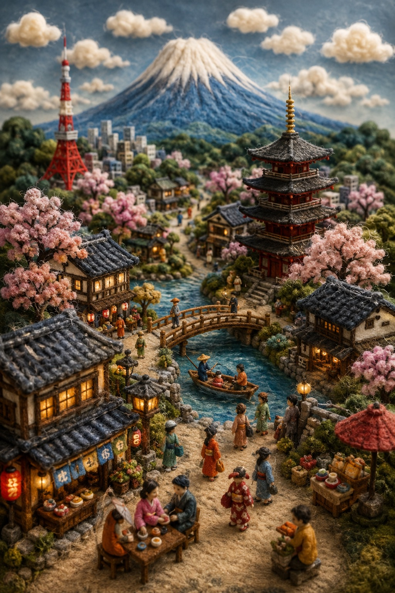

**來源：** [@volkan_iras](https://x.com/volkan_iras/status/2051403524966141980) / [提示词回复](https://x.com/volkan_iras/status/2051403530590638325)

**提示詞：**

```text
Country: [INSERT COUNTRY NAME]

A miniature felt diorama made of fluffy yarn, wool, and needlework, designed as a single cohesive small world (not a collage), reflecting the real landscape, culture, and daily life of the country.

Structure:
- Select 4–7 naturally integrated elements (landscape, architecture, transport, street life, culture)
- Everything must flow together as one environment

Foreground:
Everyday life — small shops, cafes, markets, people interacting, local clothing, street details, subtle movement, warm human presence

Midground:
Connecting flow — streets, bridges, rivers, paths, transport, cultural spaces that guide the eye naturally from front to back

Background:
One strong identity anchor — landmark, skyline, mountain, or symbolic landscape clearly representing the country (keep it clean, not overcrowded)

Style:
Handmade wool felt, yarn, needle-felt textures, visible fibers, soft edges, miniature craftsmanship, premium diorama realism

Lighting:
Warm golden hour or bright noon, soft shadows, clear visibility, gentle glow enhancing depth

Color:
Soft but saturated palette reflecting the country’s natural tones (greens, sky blues, architectural hues, cultural accents), warm and balanced

Composition:
Vertical frame, balanced or centered perspective, slight top-down or immersive angle, clear foreground–midground–background depth

Mood:
Warm, emotional, calm, refined — like a handcrafted fairy-tale version of real life (not childish)

Rules:
- No logos or text overlays
- No collage-style composition
- No random symbolic clutter
- Keep it realistic but stylized as a handmade miniature world

Quality:
16K, ultra-detailed, hyper-realistic miniature textures, cinematic depth, sharp focus

output_goal:
A single, cohesive felt diorama world that instantly conveys the identity and atmosphere of the chosen country through integrated landscape, culture, and daily life
```

***

<a name="case-391"></a>

### 例 391：四國文化錨點服裝設計宮格

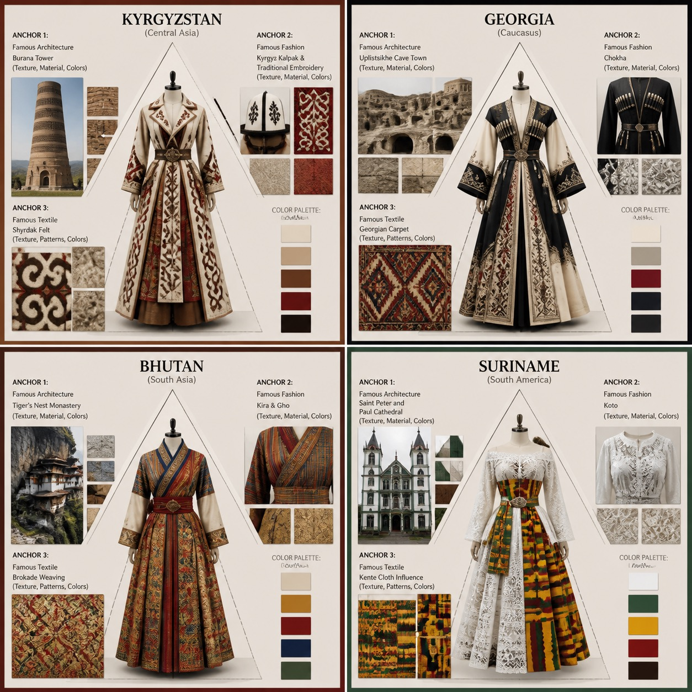

**來源：** [@Gdgtify](https://x.com/Gdgtify/status/2051428657571279137)

**提示詞：**

```text
<instructions> input: continent pick 4 lesser known countries in that continent function drawx($lesser known country){ > Anchor 1: "$lesser known's famous architecture" (it's texture, material and color) > Anchor 2: "$lesser known's famous fashion " (it's texture, material and color) > Anchor 3: "$lesser known's famous food " (it's texture, material and color) > > **Instruction:** Render a dress design that exists at the exact center of this triangle. } output: 2x2 grid, drawx( for each lesser known country)
```

***

<a name="case-392"></a>

### 例 392：頭髮裡的微型城市

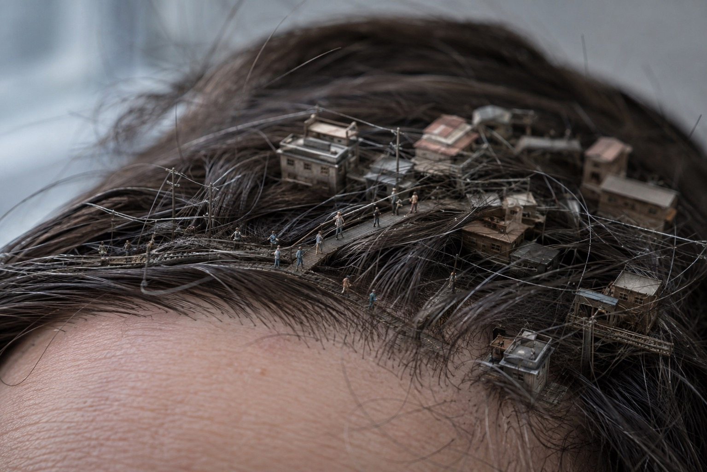

**來源：** [@krafterlab](https://x.com/krafterlab/status/2051399740986740986)

**提示詞：**

```text
Macro photograph of a miniature city hidden in human hair, clearly on a real human head, with part of the forehead and hairline visible, realistic skin texture with pores, tiny people walking through the streets between the hair strands, extremely small but realistic proportions, macro photography, 85mm lens, shallow depth of field, natural lighting, neutral colors, no warm tones, ultra realistic hair with visible roots, natural imperfections, slightly messy strands, realistic materials, slightly dirty buildings, no perfect surfaces, photorealistic, looks like a real photo, no illustration, no CGI, no glow
```

***

<a name="case-393"></a>

### 例 393：Y2K 金色時刻人像

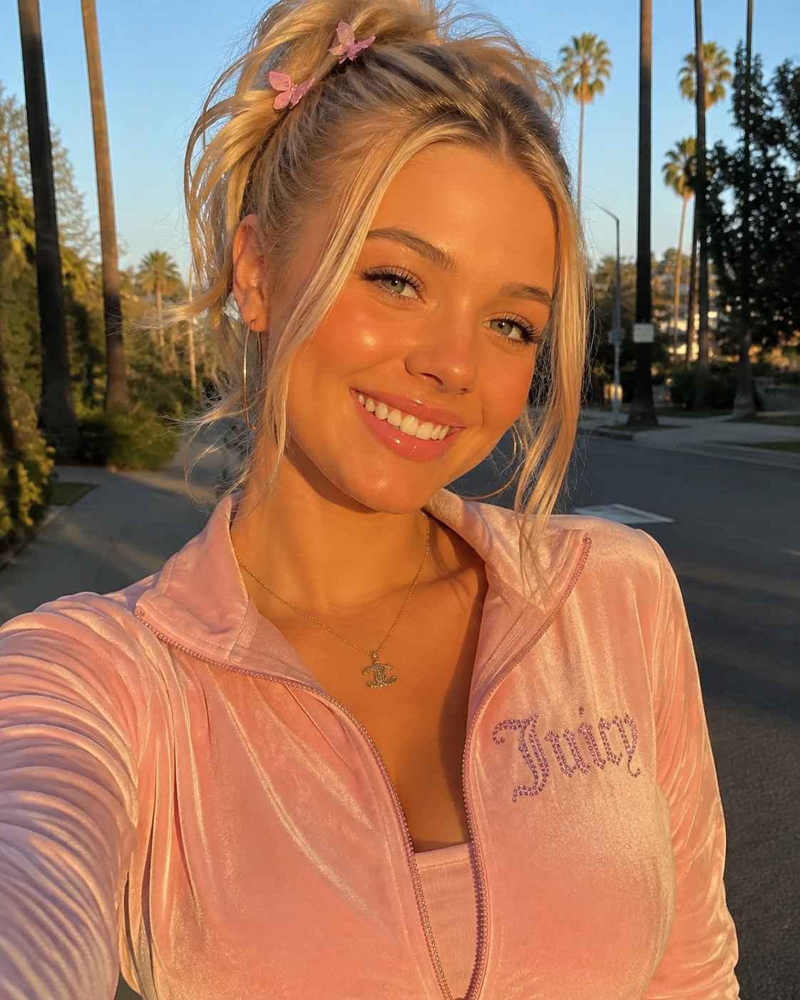

**來源：** [@SiliconBarbie_](https://x.com/SiliconBarbie_/status/2051475105403040014)

**提示詞：**

```text
candid portrait of a beautiful young blonde woman, 21 years old, glowing sun-kissed skin, wearing a baby pink velour tracksuit and butterfly clips in her hair, smiling brightly at the camera, golden hour warm light, palm trees, y2k aesthetic, glossy lips
```

***

<a name="case-394"></a>

### 例 394：中世紀村莊雙精靈冒險者

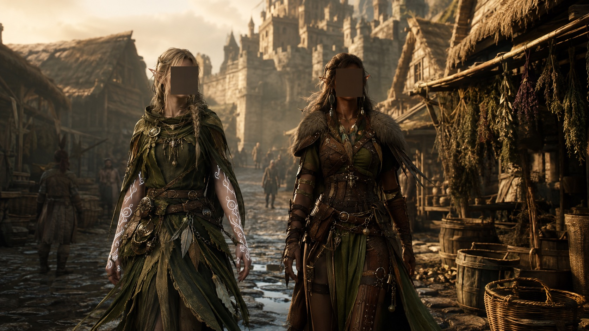

**來源：** [@RamonVi25791296](https://x.com/RamonVi25791296/status/2051568239142973832) / [Felo prompt](https://felo.ai/en/gpt-image-2-prompts)

**提示詞：**

```text
Create a cinematic dark-fantasy medieval street scene in ultra-realistic 3D game concept art style, widescreen 16:9. In the foreground, show two adult elven adventurers walking side by side toward the viewer through a muddy cobblestone village road. The left character is a pale-skinned elf woman with long messy {argument name="left character hair color" default="ash blonde"} braided hair, pointed ears, layered olive-green druid robes, leather belts, pouches, dangling metal charms, necklaces, torn fabric strips, leaf-and-feather details, and glowing white vine-like magical tattoos spiraling down both forearms. The right character is a darker-skinned elf woman with long thick {argument name="right character hair color" default="dark brown"} dreadlocked hair, pointed ears, a green-and-brown leather ranger outfit, fur shoulder mantle, feather ornaments, arm wraps, belts, chains, talismans, and a confident warrior posture. Both faces are intentionally hidden by plain opaque {argument name="face covering color" default="dark brown"} square censor blocks, centered over their faces. Set the background in a richly detailed medieval market village with timber-and-thatch houses, hanging bundles of dried herbs on the right-side shopfront, barrels, baskets, wooden stalls, distant townspeople, and a large stone castle with towers and battlements rising in the background. Use {argument name="lighting mood" default="warm late-afternoon golden sunlight"}, dramatic shadows, volumetric haze, shallow depth of field, realistic fabric and leather textures, high detail, moody fantasy atmosphere, cinematic composition, Unreal Engine quality, no text, no logos.
```

***

<a name="case-395"></a>

### 例 395：騎士法師大戰石像魔像

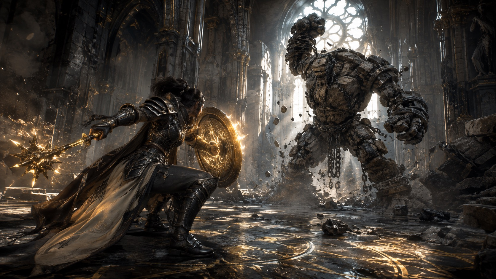

**來源：** [@RamonVi25791296](https://x.com/RamonVi25791296/status/2051568239142973832) / [Felo prompt](https://felo.ai/en/gpt-image-2-prompts)

**提示詞：**

```text
Create a cinematic dark fantasy action scene in a ruined cathedral hall: a {argument name="hero type" default="female armored knight-mage"} crouches in a defensive lunge on the left foreground, wearing ornate dark steel and leather plate armor with a long cream-and-black tabard, one arm extended behind her gripping a spiked mace or morning star crackling with golden magic sparks, the other arm braced forward behind a round glowing shield rimmed with warm light. Opposite her in the right midground is a massive {argument name="enemy type" default="headless stone golem"}, built from cracked gray masonry plates and bound with broken chains, charging with one huge fist raised and rubble falling from its body. Set the battle inside a grand, damaged palace-cathedral interior with towering arches, carved stone columns, tall broken windows, gold-trimmed marble floor in circular geometric patterns, scattered chunks of stone, dust, and debris. Use dramatic backlighting from a bright arched window behind the golem, warm golden magical highlights on the shield and weapon, deep shadows, volumetric dust beams, realistic textures, high-detail armor and stone, dynamic low-angle wide composition, shallow cinematic depth, epic game-cinematic realism, 16:9 widescreen, no text, no UI.
```

***

<a name="case-396"></a>

### 例 396：龍類物種復古百科海報

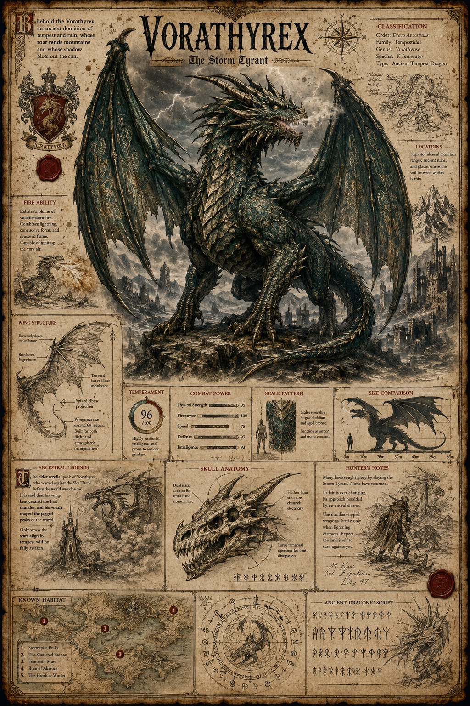

**來源：** [@sha_zdiii](https://x.com/sha_zdiii/status/2052237839119835280)

**提示詞：**

```text
Create a highly detailed A4 vertical vintage fantasy encyclopedia style dragon species poster.

Style: medieval creature atlas, ancient mythology manuscript, museum fantasy archive, old explorer journal.

Main subject:
a massive hyper realistic dragon standing proudly in center with detailed scales, smoke from nostrils, giant wings partially open.

Background:
stormy mountains, ancient ruins, fog layers, burnt parchment texture.

Color palette:
dark emerald, ash gray, faded gold, ancient brown, deep crimson.

Include infographic sections:
Species Type,
Fire Capacity,
Wing Structure,
Temperament Scale,
Habitat Region,
Battle Strength,
Ancient Legends,
Scale Patterns,
Skull Diagram,
Hunter Notes.

Add:
engraved fantasy sketches,
ancient symbols,
old map textures,
ink grain,
collectible poster layout.

NO modern UI.
NO futuristic elements.
NO flat minimalism.

Ultra detailed.
8K printable masterpiece.
```

***

<a name="case-397"></a>

### 例 397：街舞角色設定參考圖

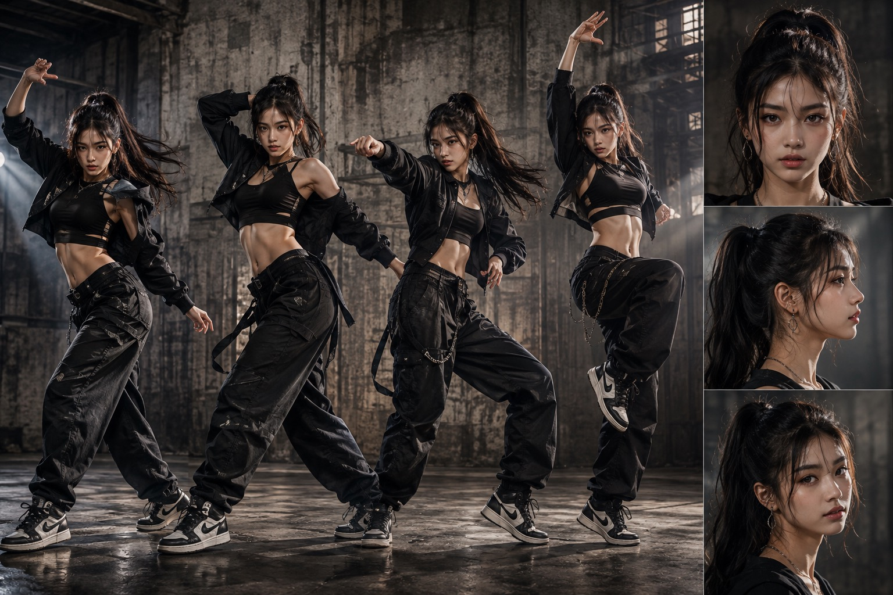

**來源：** [@ChangningL29508](https://x.com/ChangningL29508/status/2052229452080591276)

**提示詞：**

```text
角色設定圖佈局，聚焦於一位18歲的亞裔女性街舞舞者。包含4個大型、高細節度的全身動態舞姿（突出舞蹈動作，面部清晰）。側邊附一條清晰的多角度參考條，僅含3個精細頭部特寫（正面、側面、3/4側面）。最大限度減少文字元素，將畫素空間優先用於面部細節刻畫。背景為粗礪工業風，搭配寫實光影效果
```

***

<a name="case-398"></a>

### 例 398：8 套日常穿搭編輯拼貼

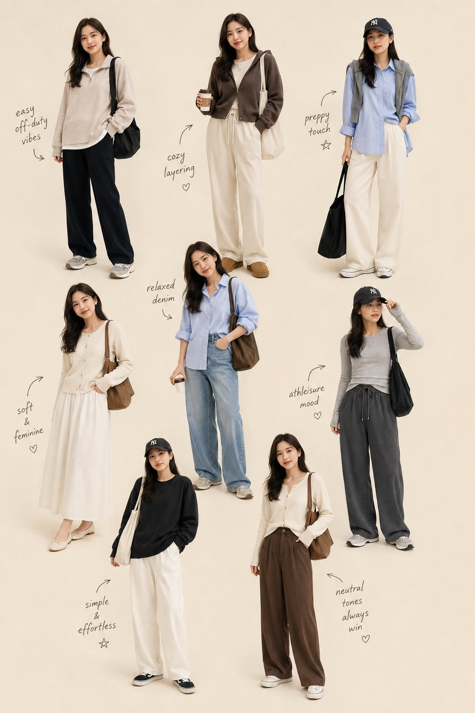

**來源：** [@aiwithaly](https://x.com/aiwithaly/status/2052218645951205463)

**提示詞：**

```text
Create a freeform fashion-editorial collage of me in 8 distinct full-body casual wear, arranged organically on a clean cream studio backdrop. Keep my face identical across all looks, w/ consistent proportions that visually read as around (height) w/o stating height. Include subtle handwritten-style arrows & labels highlighting key pieces. Avoid any grids, borders, or boxed layouts.
```

***

<a name="case-399"></a>

### 例 399：唱片公司樓梯間寫真人像

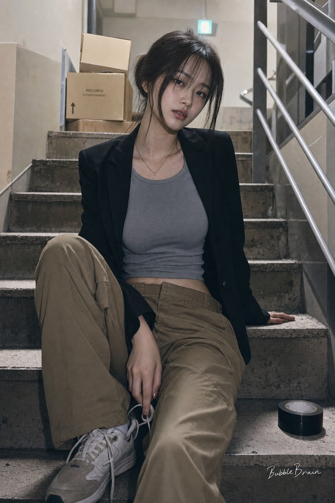

**來源：** [@BubbleBrain](https://x.com/BubbleBrain/status/2052217544388546827)

**提示詞：**

```text
Use case: photorealistic-natural
Asset type: cinematic portrait image, final target size 1216x1536 portrait

Create a photorealistic image of a fictional adult Korean female idol in her mid-20s, not resembling any real celebrity. Maintain a Japanese negative film look: soft overexposure, faded neutrals, low contrast, subtle grain, and imperfect snapshot framing.

Scene/backdrop: the back stairwell of a small record label building, with moving boxes, scuffed concrete steps, a gray metal handrail, and a pale security light. The atmosphere should feel quiet, slightly intimate, and workaday, as if caught in a private in-between moment after practice and during moving day.

Subject: a Korean female idol with a naturally attractive, understated sensuality rather than overt glamour. She should feel quietly magnetic, relaxed, and a little teasing without being provocative.

Wardrobe/props: a slightly cropped black blazer worn casually and slightly open, over a fitted heather-gray ribbed tee that softly outlines the figure without revealing cleavage, loose khaki cargo pants sitting naturally on the waist, a thin silver chain necklace, a roll of black gaffer tape placed beside her, and one sneaker lace still half-tied. The styling should feel subtly sexier and more feminine than purely casual, but still fully modest and non-revealing.

Composition/framing: tall portrait. The subject is seated on the stairs with one knee slightly raised and one leg relaxed lower on the step, leaning back lightly with one hand braced behind her on the stair for support. The other hand is near her half-tied sneaker, as if she has just paused while tying it. Her blazer falls naturally along the body, her posture creating a soft, elegant silhouette. Her head is tilted up toward the camera with a calm, slightly sultry, self-possessed expression. The pose should feel candid yet subtly alluring, natural rather than staged.

Lighting/mood: flat stairwell light, understated backstage realism, soft grain, muted tones, gentle highlight bloom, and a quiet intimate mood. Keep the image photorealistic, restrained, and cinematic, with no excessive glamour and no nudity.

Add small white handwriting signature text "BubbleBrain" on the bottom right corner.

--2:3
```

***

<a name="case-400"></a>

### 例 400：多風格簽名選擇海報

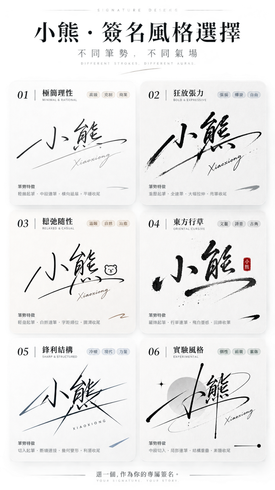

**來源：** [GitHub prompt](https://github.com/zaizhi-1112/ai-image-extension-playbook/blob/main/signature-image-prompts-gpt-image-2.md) / [@liyue_ai](https://x.com/liyue_ai)

**提示詞：**

```text
你是一個高階簽名設計系統 + 風格人格視覺系統。

任務：
僅基於使用者輸入的「姓名」，生成一張「多風格簽名選擇海報（卡片式結構）」。
目標是把名字轉譯為具有筆勢、氣質與力量感的簽名設計系統，讓使用者產生選擇欲、認同感和分享欲。

輸入資訊：
姓名：[輸入你的暱稱]
禁止要求額外資訊，必須自動完成氣質與風格推斷。

隱藏執行邏輯：
1. 字形與筆勢分析：
- 結構：疏密、橫豎比例、重心位置
- 節奏：連貫、停頓、爆發、收束
- 適配：連筆程度、草寫程度、變形空間

2. 氣質推斷：
清冷、張揚、克制、商業、文藝、鬆弛、鋒利、高階。

3. 生成 6 個簽名分支：
- 全部適配該姓名
- 每一個都有明確書寫風格
- 差異來自筆勢、節奏、結構和收筆方式

整體畫面：
9:16 豎版海報，極簡、高階、乾淨、有設計感、適合傳播。
背景使用純白或極淺灰漸變，留白不少於 40%。

頂部標題區：
主標題可用：
「你的名字，適合哪種簽名？」
或：
「[姓名] · 簽名風格選擇」
副標題：
「不同筆勢，不同氣場」
排版為黑色與灰色，高階字距，留白充足。

簽名卡片區域：
使用整齊網格卡片佈局，推薦 2 列 × 3 行，共 6 個卡片。
每個卡片統一尺寸、統一間距、整體對齊乾淨。

卡片樣式：
- 輕微圓角 8-16px
- 無明顯邊框，或極細描邊
- 極輕陰影
- 背景為純白微差、極淺灰，或輕微宣紙 / 磨砂質感
視覺目標接近高階雜誌排版，避免強 UI 感、厚卡片和 App 元件感。

簽名生成規則：
簽名必須基於書寫動作生成，避免只做字型變形。
每一個簽名風格在生成前，先確定一套明確書寫行為規則：
1. 起筆方式：輕觸起筆、重壓起筆、直接橫掃、從左下進入或從中段切入。
2. 連筆結構：前兩個字強連筆後面斷開、全連筆一氣呵成、只連線偏旁。
3. 節奏變化：快到慢再收、慢到爆發再拉伸、或均勻節奏。
4. 結構變形：橫向拉長、垂直壓縮、整體右傾或左傾、字間重疊或錯位。
5. 收筆設計：尾筆長甩、突然收斷、回鉤、漸隱收尾。

6 種簽名方向：
1. 極簡理性：接近品牌簽名
2. 狂放張力：強烈連筆和拉伸
3. 鬆弛隨性：手寫感強
4. 東方行草：飛白和墨感
5. 鋒利結構：幾何感和斷裂
6. 實驗風格：允許部分不可讀，但需要強設計感

色彩策略：
整體以黑、灰、白為主。每個卡片允許一個極輕微點綴色，例如冷灰藍、香檳金、墨黑、暖棕、深綠。
避免大面積色塊和花哨配色。

底部互動區：
底部居中加入小號灰字：
「選一個，作為你的專屬簽名。」
或：
「你是第幾種？」

光影與質感：
高階棚拍光、柔光環境、細膩陰影、乾淨空氣感。
質感參考 Apple 發布會視覺和高階品牌視覺。

禁止項：
不要字型拼貼，不要普通書法字，不要 UI 卡片風，不要顏色雜亂，不要簽名太小，不要排版鬆散，不要缺乏筆勢，不要範本拼接感。

最終目標：
生成一張高階、乾淨、有秩序、有筆勢張力的 6 風格簽名選擇海報。
使用者一眼能選出最像自己的一款簽名。
```

***

<a name="case-401"></a>

### 例 401：Lost in 國家旅行海報拼貼

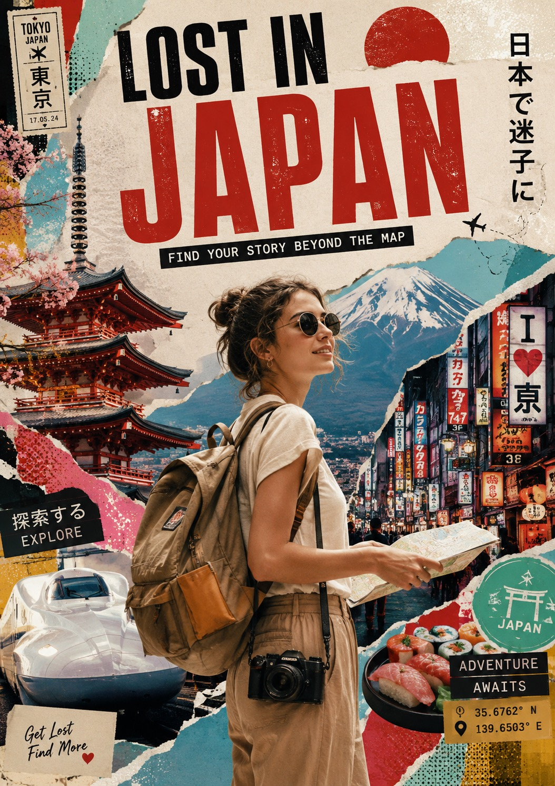

**來源：** [@SadiaMalik182](https://x.com/SadiaMalik182) / [aiiStudio prompt](https://aiistudio.com/prompt/2052388203395514683/lost-in-country-travel-poster-collage)

**提示詞：**

```text
Create a stylized travel poster / graphic collage for [country]. The main subject should be a stylish international tourist visiting [country], clearly presented as a traveler and not a local resident. Show the tourist wearing modern travel fashion, with details such as a camera, backpack, sunglasses, map, or suitcase, exploring the culture and atmosphere of [country]. Place the tourist in a dynamic composition surrounded by iconic architecture, streets, landscapes, landmarks, transportation, food, signage, and cultural elements associated with [country]. Blend realistic character detail with a graphic collage background made of layered paper textures, torn poster edges, sticker elements, halftone dots, editorial typography, and bold geometric shapes. Include authentic visual motifs from [country], but keep the tourist's appearance and styling globally fashionable and clearly foreign to the setting. Add a large readable headline: "LOST IN [country]". Modern, artistic, premium editorial travel poster aesthetic, balanced layout, print-worthy composition.
```

***

<a name="case-402"></a>

### 例 402：3D 小红书個人資料卡

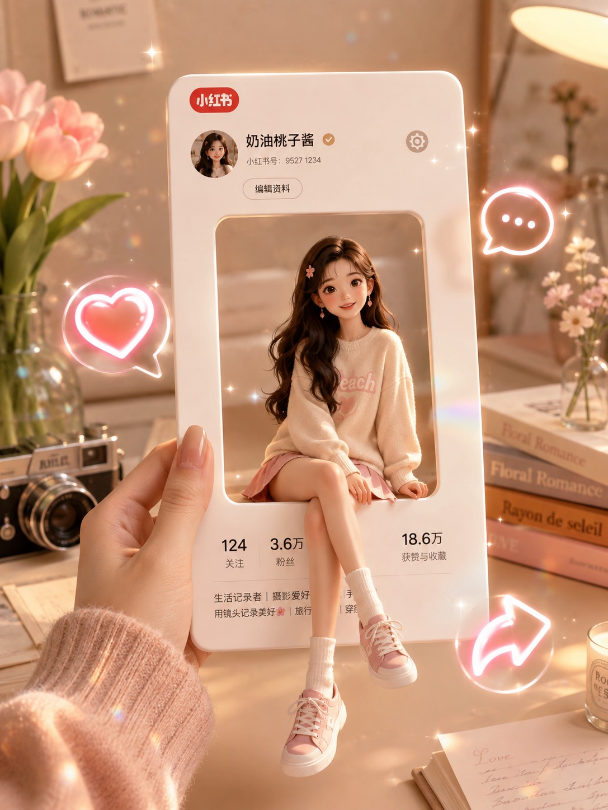

**來源：** [@MrGafish](https://x.com/MrGafish/status/2052323461268467860)

**提示詞：**

```text
一隻手中握著一張3D小红书個人資料卡，卡片中間方形鏤空，一個女孩隨意地坐在卡片鏤空的邊緣，溫暖的米色和柔和的粉彩美學背景，逼真的深度和陰影，電影般的柔和光線，閃亮光滑的紋理，小红书風格的UI，漂浮的互動圖示（按讚、留言、分享）帶有發光的霓虹效果，閃光和光暈，背景中溫馨的美學佈置包括書籍、花瓶裡的花和一臺復古相機，夢幻氛圍，Pixar風格+半現實主義融合，超高品質，4K，居中構圖，高階影響者美學
```

***

<a name="case-403"></a>

### 例 403：小红书數字破屏 3D 女孩

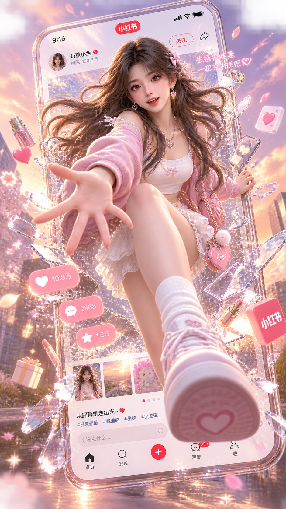

**來源：** [@MrGafish](https://x.com/MrGafish/status/2052632520563528051) / [补发提示词](https://x.com/MrGafish/status/2052682279257026631)

**提示詞：**

```text
將一位氣質絕佳的女孩放置在一個顯示小红书帖文的3D透明玻璃手機畫面中，並重新調整她的身體姿勢，使她看起來像是正從螢幕中突破、進入現實世界。其中一隻腳必須強烈地朝向觀者延伸，採用戲劇化的 3D 透視效果，創造出強烈的深度感與沉浸感。整體姿勢需要具有動態感、自然且符合人體結構，就像是在從螢幕中跨步而出的瞬間。

手機螢幕邊緣出現真實細膩的玻璃裂紋與數字粒子效果，大量發光的畫素碎片與光粒向外擴散，形成富有未來感的“數字破屏”視覺特效。所有碎片與光效自然圍繞人物運動方向展開，具有電影級空間層次感。

整體畫面採用溫暖米色、柔粉色與夢幻紫色漸變背景，結合金粉色夕陽光斑與電影級柔光渲染。Pixar風格與半現實主義融合，超精細材質，柔和景深，電影感光影，8K超高畫質品質。

將畫面最佳化為豎版【9:16】比例（1080×1440），適用於社群媒體展示。
```

***

<a name="case-404"></a>

### 例 404：豪華社群媒體破屏商業廣告

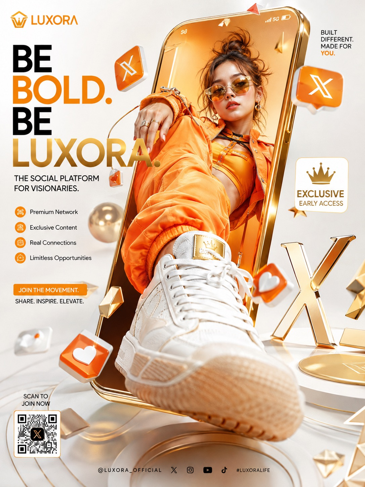

**來源：** [@you1873118](https://x.com/you1873118/status/2052624395932455061)

**提示詞：**

```text
動態的豪華商業廣告海報，特色是超現實3D渲染的充滿活力的年輕女性，以上傳的女性面部作為參考，穿著高階亮橙色設計師服裝、豪華配飾以及時尚的金色墨鏡，自信地從一個巨大的金色智慧手機螢幕中爆發出色。她的姿勢有力且時尚，一隻運動鞋透過強烈的強制透視戲劇性地穿過數字顯示屏，踏入現實。

構圖在前臺強調她白色豪華運動鞋，帶有紋理口香糖鞋底，透過電影般的廣角鏡頭失真和淺景深增強。漂浮的閃亮3D社群媒體圖示、金色幾何元素和豪華品牌圖形環繞著她，營造出高階影響者營銷美學。

明亮的攝影棚燈光營造出充滿活力的優質促銷氛圍，金屬金色手機邊緣的豐富反射與啞光織物質地形成對比。主導的橙色、白色和金色調色盤傳遞出超現代豪華X / Twitter 廣告氛圍。乾淨的白色背景上帶有大膽的編輯排版、優質軟體品牌元素、優雅的UI圖形、漂浮的互動圖示以及時尚的QR Code區域。

超現實8K品質、電影般的陰影、精緻的商業藝術指導、豪華女效能量、時尚營銷美學、現代社群媒體品牌、閃亮反射以及高階數字廣告風格。

寬高比：3:4。
```

***

<a name="case-405"></a>

### 例 405：可愛紙藝風照片重繪

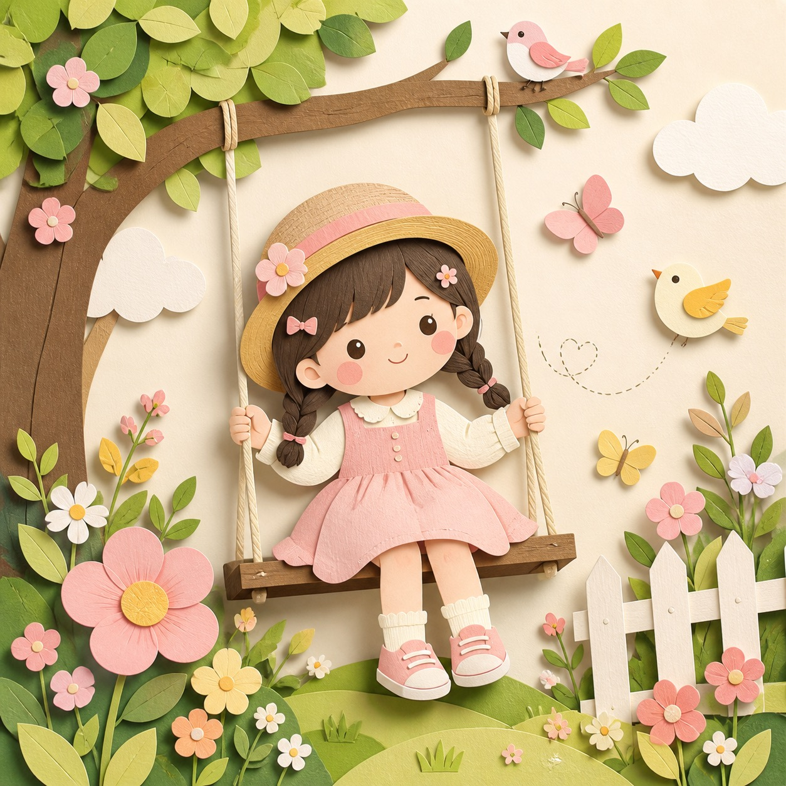

**來源：** [@oggii_0](https://x.com/oggii_0/status/2052609040539328759)

**提示詞：**

```text
Recreate this image in a paper craft style, simplifying the details to make them suitable for paper craft artwork. Arrange the overall composition to feel visually pleasing, soft, and cute. You may add charming decorative elements such as birds, butterflies, flowers, etc., to enhance the adorable atmosphere while still matching the original image.
```

***

<a name="case-406"></a>

### 例 406：巨型遊戲手柄街頭 Campaign

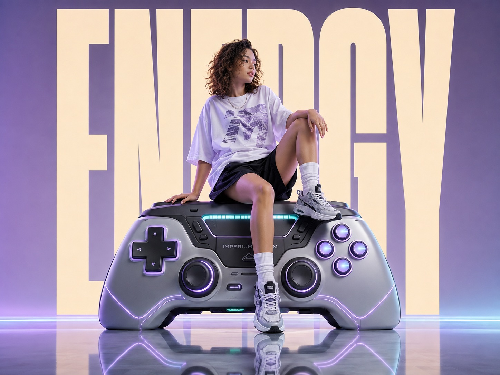

**來源：** [@AIwithkhan](https://x.com/AIwithkhan/status/2052973449107349725)

**提示詞：**

```text
Luxury futuristic streetwear campaign poster featuring a confident athletic girl sitting on a gigantic oversized retro gaming controller instead of sunglasses, clean editorial advertising aesthetic, massive bold typography in the background saying “ENERGY”, glossy reflective floor, cinematic studio lighting, pastel neon color palette with lavender, silver, and soft cyan tones.

The girl has curly shoulder-length hair, relaxed confident attitude, wearing an oversized white graphic T-shirt, loose black athletic shorts, high white socks, and modern sneakers. Casual sporty fashion styling, natural makeup, youthful Gen-Z streetwear vibe. She is casually seated on top of the giant gaming controller with one leg hanging down and one knee raised, looking away from the camera with cool effortless confidence.

The oversized gaming controller is ultra detailed with futuristic buttons, glowing accents, premium matte materials, and soft LED reflections. Minimal luxury branding on the controller side. Giant cream-colored typography fills the background vertically in a bold condensed font.

Environment: seamless studio backdrop with glossy floor reflections, high-end commercial fashion photography, ultra realistic textures, dramatic shadows, premium editorial layout, modern tech-fashion advertisement aesthetic, symmetrical composition, luxury product campaign style, 4:3 aspect ratio, hyper detailed, photorealistic.
```

***

<a name="case-407"></a>

### 例 407：Neuro-AI 混合系統資訊圖表

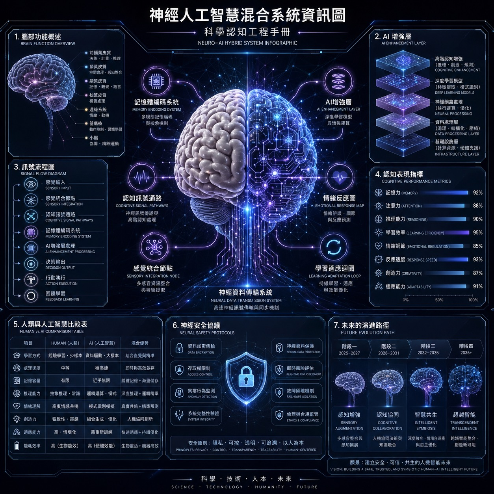

**來源：** [@YaZoraiz](https://x.com/YaZoraiz/status/2052968427514708371)

**提示詞：**

```text
Create a premium square “neuro-AI hybrid system infographic” designed as a scientific cognitive engineering handbook page.

Visual Direction:
• 1:1 composition
• dark neutral background with glowing neural network overlays
• palette: electric blue, violet, soft white, silver
• elegant scientific typography and modular panels
• central ultra-detailed human brain + AI circuit fusion render

Main Subject:
A realistic human brain merging with AI neural networks and digital circuitry.

Include callouts:
• memory encoding system
• AI augmentation layer
• cognitive signal pathways
• emotional response mapping
• sensory integration nodes
• neural data transfer system
• learning adaptation loops

Modules:
• Brain Function Overview
• AI Enhancement Layers
• Signal Flow Diagram
• Cognitive Performance Metrics
• Human vs AI Comparison Chart
• Neural Safety Protocols
• Future Evolution Path

Style:
“neuroscience + AI engineering manual”, “high-end cognitive systems diagram”
```

***

<a name="case-408"></a>

### 例 408：Cozy Academia 學習手記

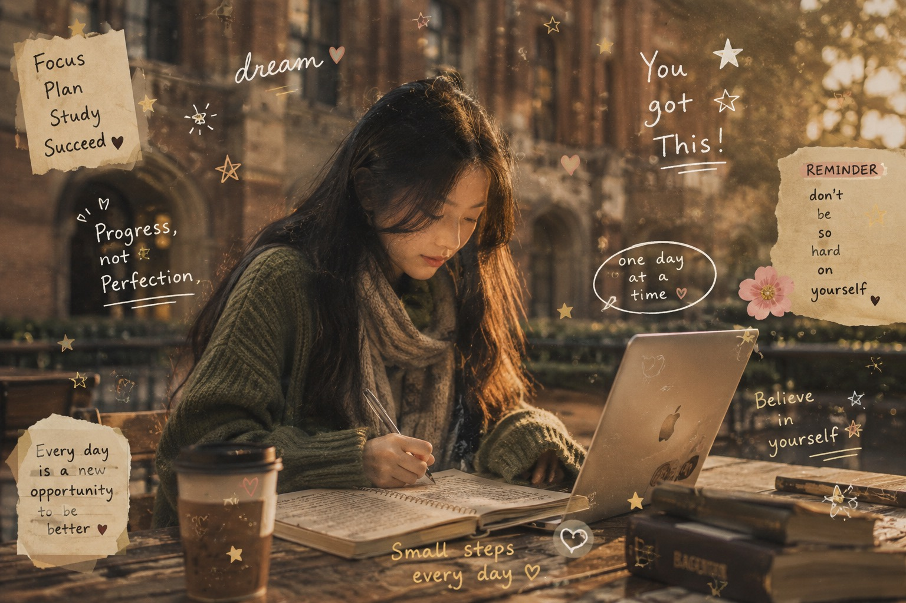

**來源：** [@Sairah_0](https://x.com/Sairah_0/status/2052969695406325875)

**提示詞：**

```text
Dreamy cinematic study aesthetic, young Asian girl with long dark hair studying outdoors at a wooden table during golden hour, cozy oversized green sweater and scarf, writing in notebook beside open laptop, historic university campus in background, warm sunset lighting, soft glow, autumn atmosphere, aesthetic doodles and handwritten notes floating around image, kawaii scrapbook style overlays, pastel hearts and stars, motivational text, shallow depth of field, nostalgic film grain, soft beige and warm green tones, peaceful productive vibe, ultra detailed, Pinterest aesthetic, photorealistic, cozy academia style, 35mm film look
```

***

<a name="case-409"></a>

### 例 409：拙劣 MS Paint 風重繪

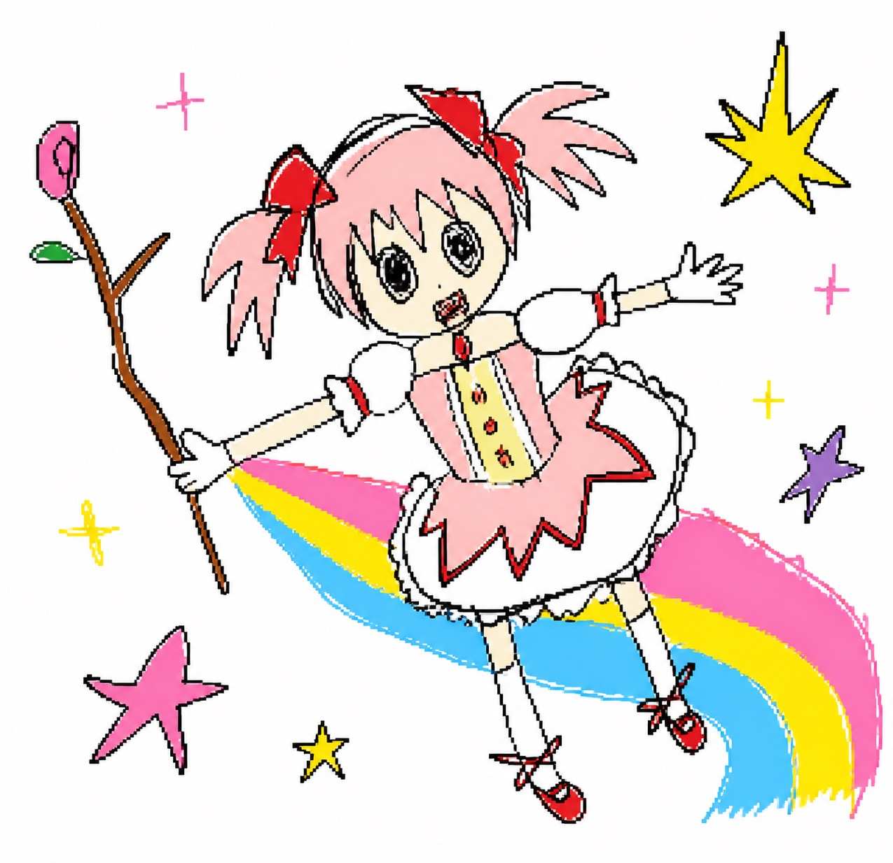

**來源：** [@Ciri_ai](https://x.com/Ciri_ai/status/2052969749878059362)

**提示詞：**

```text
Please redraw the attached image in the most clumsy, messy, and hopelessly pathetic way possible. Use a white background and make it look like it was drawn in MS Paint with a mouse. It should vaguely resemble the original, but not really — like it’s kind of correct in some places yet strangely off and awkward overall. Emphasize a low-quality, pixelated look, and make it appear ridiculously badly drawn. …Actually, never mind — just draw it however you want in a sloppy way.
```

***

<a name="case-410"></a>

### 例 410：誇張動漫風主體重繪

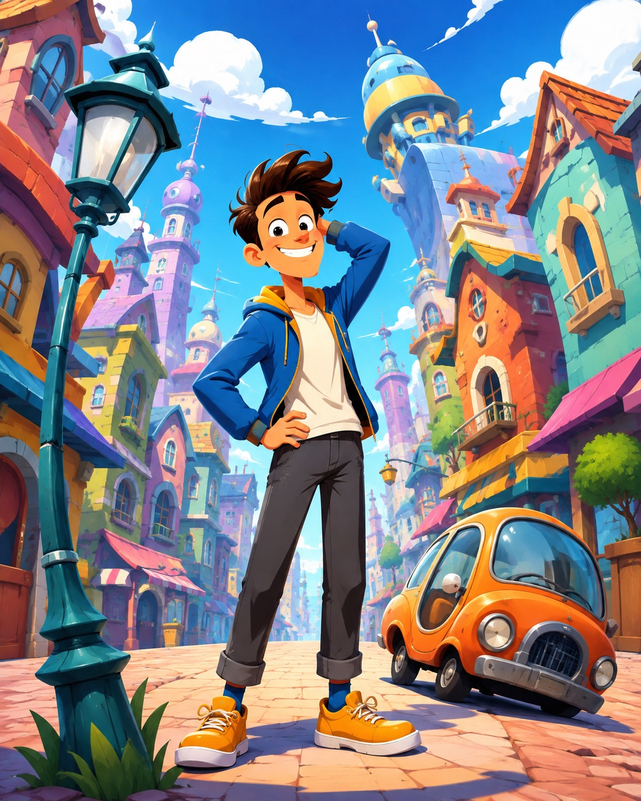

**來源：** [@Zyrellix](https://x.com/Zyrellix/status/2052766810500649197)

**提示詞：**

```text
Create a trending anime art style image from the uploaded subject. Use confident line-work with slight variation and minimal cel shading using flat shadow shapes. Use bright, saturated colors and clean graphic lighting. The style is defined by exaggerated, cartoonish character proportions featuring highly expressive, simplistic facial features that allow for immense emotional range, with highly varied stretched anatomy.Transform the environment into a slightly warped space with playful perspective distortion and simplified objects. Composition and tone should be energetic, lively, and comedic in a fully stylized, non-realistic world
```

***

<a name="case-411"></a>

### 例 411：極簡建築地標海報

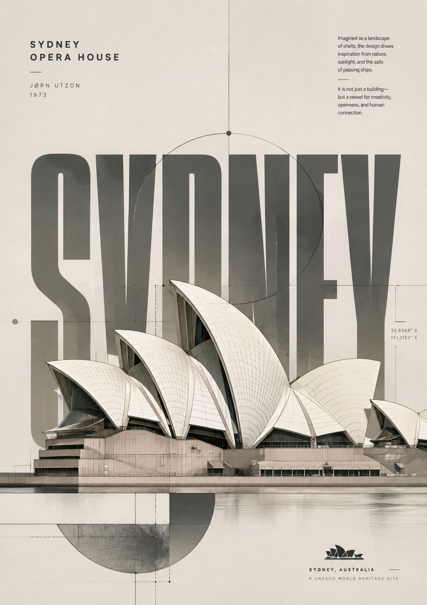

**來源：** [@iamaiistudio](https://x.com/iamaiistudio/status/2053084576520573269)

**提示詞：**

```text
Design a luxury minimalist poster centered on a famous architectural landmark of your choice ([building name]). The focal element is an illustrated rendering of the building. Behind it, place one giant bold English word in a design-forward typeface whose character matches the building's identity, with smaller body copy nearby describing its design philosophy. The composition should read as an ultra high-end art poster. Use a restrained, low-key color palette where graphic elements interlock with the architecture, appearing as if they form part of its structural components or extend outward from its silhouette.
```

***

<a name="case-412"></a>

### 例 412：彩色按鈕時尚 Campaign

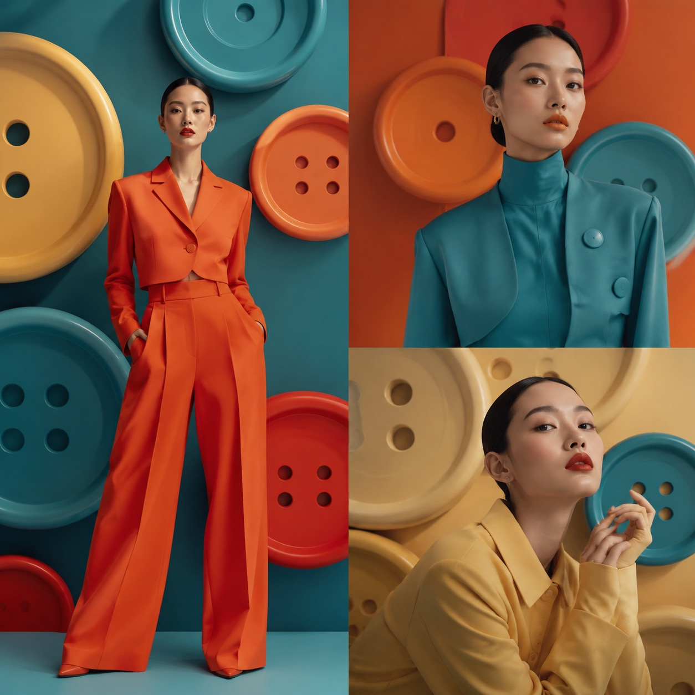

**來源：** [@Mind_Boticni](https://x.com/Mind_Boticni/status/2053082199436759258)

**提示詞：**

```text
Use reference image as style guide.
Surreal minimalist fashion editorial photography with vibrant oversized colorful buttons as main visual theme (cyan, orange, yellow, red palette), glossy 3D surface design, clean studio lighting, ultra-smooth gradients, and high-end commercial fashion look.
Split-frame composition:

Left side: full-body female model standing from top to bottom, wearing bold minimalist fashion outfit inspired by reference style, confident pose, clean studio background filled with oversized colorful buttons, cinematic lighting, soft shadows, ultra-clean composition.

Right side (vertically split into two parts):
Top-right: half-body female model, different face, different pose, different outfit variation inspired by same button aesthetic, different background color mood.
Bottom-right: another half-body female model, completely different expression and pose, different styling, different background tone, maintaining same surreal button universe aesthetic.

Each section visually distinct but unified by the colorful button-inspired design language, glossy surfaces, soft studio reflections, and fashion magazine editorial feel.
Hyper-realistic, cinematic lighting, ultra-clean composition, high-end luxury campaign style, depth, contrast, 8k, 1:1 aspect ratio --style raw --v 6 --ar 1:1
```

***

<a name="case-413"></a>

### 例 413：當代舞現場 Storyboard

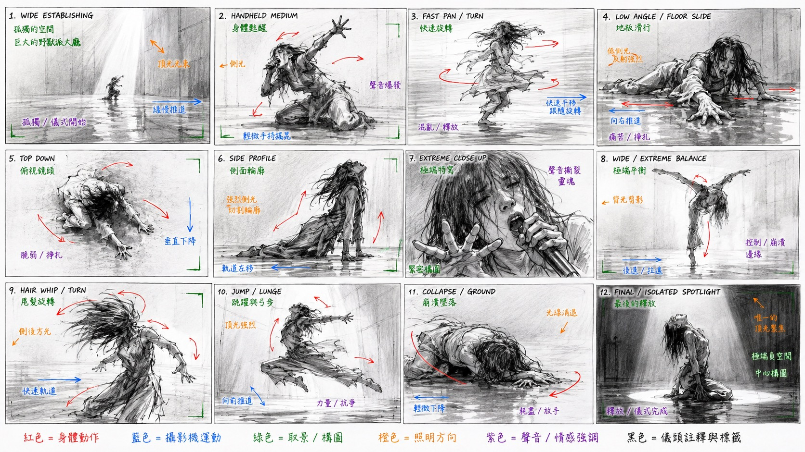

**來源：** [@ogbenniasamuel2](https://x.com/ogbenniasamuel2/status/2053088572031250799)

**提示詞：**

```text
Create a raw contemporary dance performance storyboard focused on intense physical movement and live singing. Use reference image for the character. 16:9 storyboard sheet, 12 cinematic panels.

The actual storyboard drawings must be black and white only: rough pencil lines, minimal detail, fast gesture drawing energy, simple anatomy construction and strong silhouette readability. Keep the artwork lightweight, dynamic and unfinished like early choreography previs.

A solitary female performer sings continuously while executing an emotionally charged contemporary dance routine inside a massive empty brutalist hall.

The choreography is aggressive, fluid and constantly evolving: rapid turns, floor slides, crawling transitions, sharp body isolations, trembling hands, extreme balance shifts, hair whips, lunges, jumps, collapsing movements and distorted sculptural poses.

Every panel must contain visible motion and strong body momentum. Avoid static standing poses. The performer should feel trapped between ritual, exhaustion and emotional release.

Use cinematic arthouse camerawork with handheld energy, whip pans, orbit movement, overhead shots, side silhouettes, aggressive close-ups, long lens compression and extreme negative space.

the environment minimal: empty space, smoke, fabric motion, harsh light beams and wet floor reflections only.

Annotation color system: red arrows = body movement blue arrows = camera movement green marks = framing / composition notes orange marks = lighting direction purple marks = vocal / emotional emphasis black text = short lens notes and panel labels No timestamps.

End with one overwhelming final movement pose beneath a harsh isolated spotlight.
```

***

<a name="case-414"></a>

### 例 414：室內晨間寫實攝影

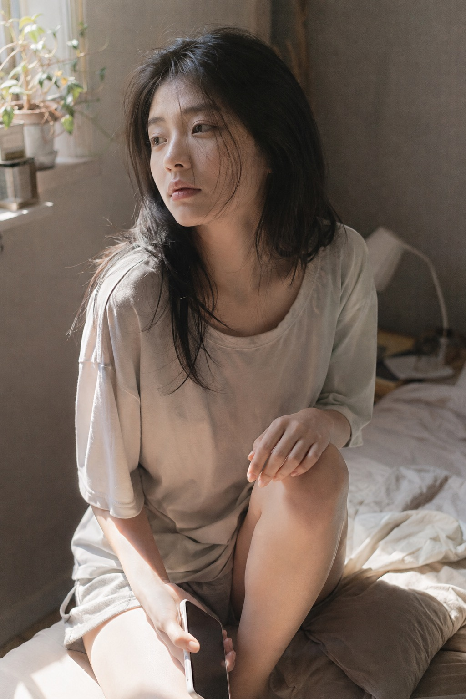

**來源：** [@ToroJushiAi](https://x.com/ToroJushiAi/status/2053078195482632421)

**提示詞：**

```text
A close-medium shot of a young Japanese woman in her bedroom on an ordinary morning, captured in authentic daily life photography as a natural candid moment. She is seated sideways on the edge of the bed, not fully awake yet, photographed from a slightly elevated three-quarter angle with cool-to-warm morning window light entering from the left.
East Asian young woman in her early 20s. Almond-shaped eyes with soft natural single eyelids, slightly elongated eye corners, still carrying the heaviness of just waking. Straight refined nose with a delicate bridge. Skin tone fair to light beige — skin subsurface scattering visible under the soft directional morning window light, specular micro-highlights catching gently on her cheekbone and nose ridge, fine skin texture perceptible, no makeup. Naturally straight fine black hair loosely gathered, slightly disheveled from sleep.
She wears a loose oversized cotton sleep shirt and soft shorts, nothing styled. Her gaze drifts toward the window, posture relaxed and unhurried, one hand resting on her knee, the other barely holding a phone face-down. The bedroom background suggests real life — slightly unmade linen, a potted plant near the window partially in shadow, small cluttered bedside items. Two or three stray hairs fall across her cheek in natural asymmetric displacement, not geometrically placed.
Soft directional morning light from a side window, cool-to-warm transition across her face and shoulder, long gentle shadows on the bedding behind her. The mood is quietly adrift — not sad, not performing, just suspended in the unhurried first minutes of the day. Subtle ISO 400 film grain in shadow areas, photographic noise texture not CG render smoothness. Aspect ratio 2:3. No watermark, no text overlay, not cartoon, not digitally painted, not illustration, not anime.
```

***

<a name="case-415"></a>

### 例 415：東方神話人物誌百科海報

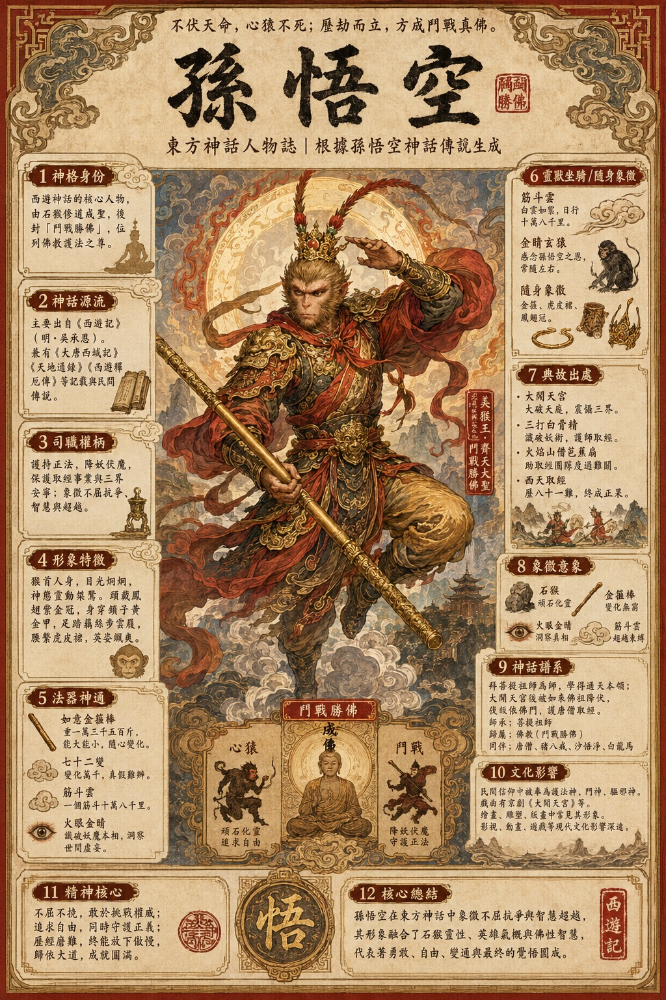

**來源：** [@TanLuAI](https://x.com/TanLuAI/status/2053073436122243364)

**提示詞：**

```text
請基於【孫悟空】生成一張豎版 A4「東方神話人物誌」百科海報。

你是一名東方神話視覺設定師、古籍圖譜設計師和中文資訊圖表設計師。請根據【人物名稱】在東方神話、民間傳說、古籍、戲曲、文學或傳統文化中的已知形象，生成一張內容完整、視覺統一、具有東方神話氣質的人物檔案海報。

最重要原則：
全部內容必須圍繞【人物名稱】展開，不要套用通用神仙範本。
人物形象、法器、坐騎、神通、典故、象徵物、背景場景都必須符合【人物名稱】的神話設定。
如果該人物存在多個傳說版本，請採用最廣為人知的版本；存在異文時，可以在相關板塊簡短標註“傳說版本不一”。
不確定的資訊不要強行編造，可寫“民間傳說中多有異文”或“相關記載較少”。
不要使用北歐符文、維京圖騰、哥特邊框、西方盔甲、歐式城堡、西幻惡魔角、賽博朋克元素。
整體必須是東方神話審美，而不是“西幻人物換中式衣服”。
整體視覺風格：
東方神話史詩感，融合《山海經》異獸圖譜、敦煌壁畫、青綠山水、唐代人物畫、宋元古畫、青銅器紋樣、古籍註疏和符籙篆刻風格。畫面莊重、神秘、古雅、華麗但克制。
畫面構圖：

豎版 A4 海報，中軸對稱佈局。中央為【人物名稱】的全身或半身主視覺，姿態莊嚴，有神性和敘事感。人物服飾、發冠、法器、神態、靈獸、背景都要符合該人物傳說。左右兩側為資訊卡片，底部為核心總結。四周使用雲雷紋、回紋、青銅紋、祥雲紋、卷草紋、山海紋、篆刻印章式邊框。
主標題：“【人物名稱】”
副標題：“東方神話人物誌｜根據該人物神話傳說生成”
頂部精神題記：請根據【人物名稱】的核心精神，自動生成一句古雅、凝練、有哲學意味的題記。題記要體現該人物背後的價值觀、生命姿態或精神核心，而不是說明性文字。不要寫“非史實考證”“僅供參考”“傳說版本”等免責宣告。字數控制在 12-28 字，適合放在標題下方。題記應與人物高度繫結，不要套用“守護蒼生”“大道無邊”等空泛句式。

請生成以下內容板塊：
【1. 神格身份】說明【人物名稱】在東方神話體系中的身份定位。
【2. 神話源流】說明該人物主要出自哪些神話、古籍、民間傳說、小說、戲曲或宗教信仰。
【3. 司職權柄】總結該人物掌管或象徵的領域。
【4. 形象特徵】描述該人物的典型外貌、服飾、神態、姿態和視覺氣質。
【5. 法器神通】展示該人物最具代表性的法器、兵器、符咒、神通或能力。
【6. 靈獸坐騎 / 隨身象徵】如果【人物名稱】有坐騎、靈獸、伴生生靈，請展示其名稱、形態和寓意。如果沒有明確坐騎，請改為“隨身象徵物”或“相關意象”。不要強行給每個人物安排龍、鳳、仙鶴或麒麟。
【7. 典故出處】列出 2-4 個與【人物名稱】相關的經典故事、傳說片段或文化典故。不要虛構不存在的典故。若版本不一，請標註“異文較多”。
【8. 象徵意象】提煉該人物最核心的視覺符號。符號必須與【人物名稱】相關。
【9. 神話譜系】說明該人物與其他神話人物、陣營、族屬或體系的關係。如果譜系不明確，請寫“譜系傳說不一”。
【10. 文化影響】說明該人物在民俗、節日、祭祀、文學、戲曲、繪畫、廟宇、影視或現代文化中的影響。
【11. 精神核心】從神話敘事角度總結該人物象徵的精神。這裡只分析神話形象，不推斷真實人物性格。
【12. 核心總結】用一段古雅但易懂的中文總結【人物名稱】：“【人物名稱】在東方神話中象徵……，其形象融合了……，代表著……。”

視覺版式要求：
頂部：大標題 + 副標題 + 精神題記。
中央：人物主視覺，氣勢莊重，細節豐富。
左側欄目：神格身份、神話源流、司職權柄、形象特徵、法器神通。
右側欄目：靈獸坐騎/隨身象徵、典故出處、象徵意象、神話譜系、文化影響。
底部：精神核心 + 核心總結。
可加入小型圖示、註釋線、古籍標籤、卷軸卡片、青銅銘牌、硃砂印章、符籙紋樣。
資訊卡片像古書頁、玉簡、青銅牌、卷軸或碑銘，不要像現代科技 UI。

材質與紋樣：
宣紙肌理、礦物顏料、鎏金線條、硃砂印章、墨色暈染、青銅器銘文、雲雷紋、回紋、祥雲紋、山水紋、敦煌藻井紋樣。

配色規則：
根據【人物名稱】的屬性自動選擇東方配色。火焰 / 戰鬥 / 護法：硃砂、玄黑、鎏金、赤紅。月亮 / 水系 / 清冷神祇：黛青、銀白、月白、石藍。山川 / 木系 / 自然神靈：石綠、青黛、玉白、赭石。帝王 / 天庭 / 尊神：鎏金、玄黑、硃砂、玉白。妖靈 / 山海異獸：墨黑、銅綠、暗金、赭紅。不要所有人物都使用同一套配色。

文字要求：
中文必須清晰可讀，標題大氣，正文簡短準確。不要亂碼、偽文字、錯別字、文字重疊或裁切。如果空間不足，優先壓縮正文，但保留所有板塊標題。

避免：
北歐符文、維京風、哥特邊框、西方盔甲、歐式城堡、魔幻遊戲 UI、賽博朋克、現代科技感、過度暗黑、隨機龍鳳、無關法器、範本化神仙形象、與【人物名稱】無關的典故、空泛精神題記。
```

***

<a name="case-416"></a>

### 例 416：Earth Signs 角色 Scrapbook

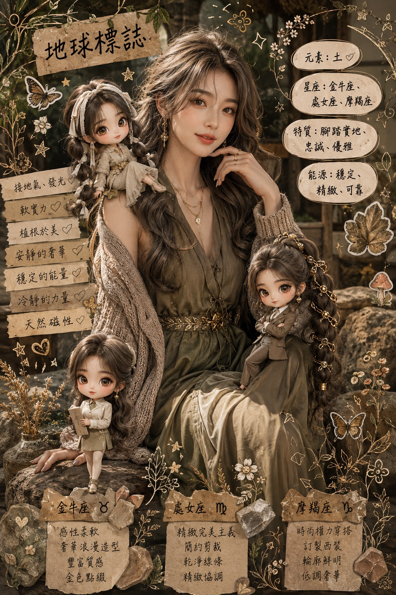

**來源：** [@ZaraIrahh](https://x.com/ZaraIrahh/status/2053075976469512686)

**提示詞：**

```text
CREATE A NEW IMAGE USING THE PROVIDED FEMALE SUBJECT AS THE ONLY REFERENCE. Preserve her exact facial features, identity, and characteristics with zero alteration.

MAIN SUBJECT — EARTH ELEMENT
She represents the Earth element as a whole: grounded, elegant, sensual, calm, stable, patient, quietly powerful, and naturally luxurious. Relaxed grounded posture, standing or seated, soft natural hand placement, composed feminine body language, rooted presence.

OUTFIT
Single cohesive Earth-inspired editorial look in olive, sage, taupe, mocha, beige, clay, cream, moss, and warm neutrals. Soft-structured elegant silhouette with subtle tailoring, draping, texture contrast, or layered structure. Fabrics: linen, cotton, matte satin, knit, suede-like textures, soft tailoring. Minimal refined gold or natural-toned accessories.

HAIR
Soft ash brown with natural dimension. Healthy, polished, softly voluminous waves or smooth blowout with subtle shine, controlled texture, face-framing strands, grounded and luxurious feel.

MAKEUP
Korean soft-glow base with earthy tones. Warm beige-rose, terracotta, tawny, or nude peach blush. Eyes in taupe, mocha, caramel, muted bronze, olive-brown. Soft liner, champagne-beige highlight, satin or velvet nude/mocha lips. Overall polished, sensual quiet-luxury aesthetic.

ENVIRONMENT
Grounded editorial Earth-inspired setting with stone, wood, linen, botanicals, dried plants, natural fabrics, rustic-luxury styling, warm daylight or diffused editorial lighting, soft shadows, serene cinematic stillness. Palette: cream, olive, moss, clay, taupe, beige, muted green, warm brown.

CHIBI MINI-ME SYSTEM
Surround her with multiple medium-sized realistic 3D chibi mini-me versions with identical face, hair, and identity. High-end doll-like styling with oversized heads, petite bodies, glossy eyes, realistic hair, detailed makeup, miniature fashion outfits, soft cinematic 3D lighting.

EARTH SIGN CHIBIS
Taurus — sensual soft-luxury romantic styling, knit or elegant feminine neutral outfit, rich textures, gold accents. Ultra-long segmented twin low ponytails tied with white fabric bands flowing dramatically around the frame.
Virgo — refined perfectionist aesthetic with polished minimalist tailoring, clean lines, structured mini dress or sophisticated co-ord styling.
Capricorn — sleek power-dressing with blazer dress or tailored set, sharp silhouette, understated luxury. Hair pulled into ultra-long sculptural braid wrapped with gold chains and metallic ornaments.

DOODLES + SCRAPBOOK OVERLAY
Hand-drawn earthy scrapbook doodles: leaves, vines, flowers, branches, mushrooms, butterflies, stars, sparkles, stones, hearts, sun doodles, botanical icons. Cozy ink-pen texture.

Handwritten text:
“EARTH SIGNS”
“grounded and glowing”
“soft strength”
“rooted in beauty”
“quiet luxury”
“stable energy”
“calm power”
“naturally magnetic”

Fact bubbles:
“Element: Earth”
“Signs: Taurus, Virgo, Capricorn”
“Traits: grounded, loyal, elegant”
“Energy: stable, refined, dependable”

COMPOSITION
Main subject centered and dominant. Chibis placed dynamically around shoulders, hands, sides, and lower frame. Doodles layered naturally throughout like a scrapbook. Balanced, expressive, premium composition.

STYLE
Cinematic editorial lifestyle image, fashion-meets-illustration hybrid, high detail, sharp focus, warm neutral tones, subtle realism grain, realistic human rendering with stylized 3D chibis and hand-drawn overlays. Social-media-ready premium aesthetic.

CAMERA
Eye-level or slightly above, medium full-body or 3/4 framing, 35mm or 50mm lifestyle portrait look, crisp details with soft atmospheric depth.
```

***

<a name="case-417"></a>

### 例 417：復古印尼貓薄荷廣告

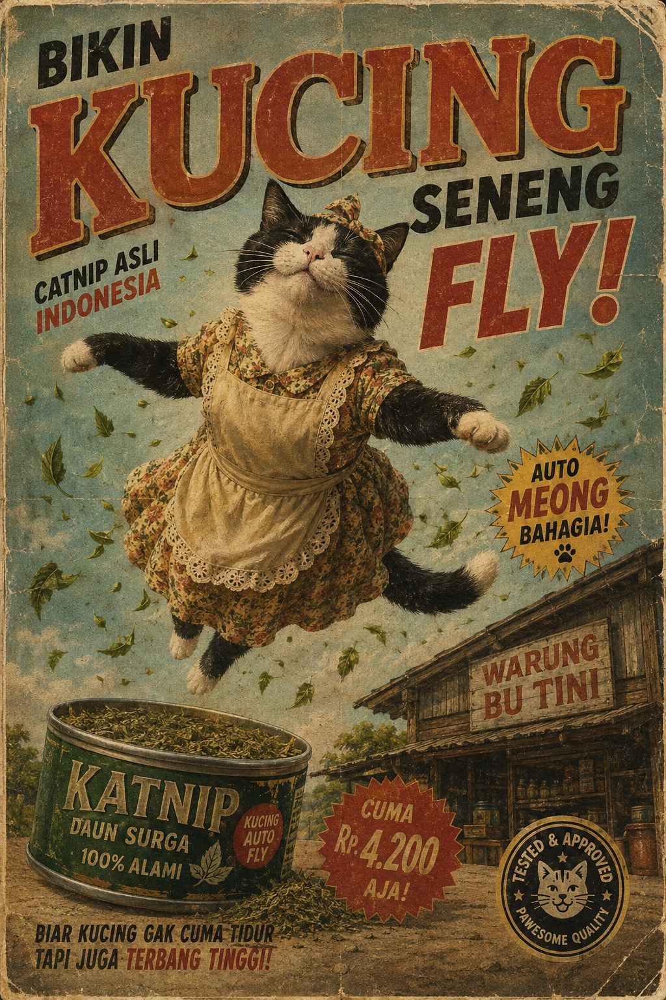

**來源：** [@NyaiiBubu](https://x.com/NyaiiBubu/status/2053075349424992532)

**提示詞：**

```text
Ultra realistic vintage Indonesian catnip advertisement poster, retro 1970s paper texture, distressed print, faded colors. A black-and-white tuxedo cat wearing cute vintage housewife clothes floating happily in the air after smelling catnip, euphoric expression, swirling catnip leaves, absurd Indonesian meme energy. Bold retro typography: “BIKIN KUCING SENENG FLY!” fake catnip jar product, old-school badges, price tag, nostalgic warung advertisement aesthetic, cinematic lighting, grain, scratches, authentic aged poster look.
```

***

<a name="case-418"></a>

### 例 418：中世紀城市旅行海報

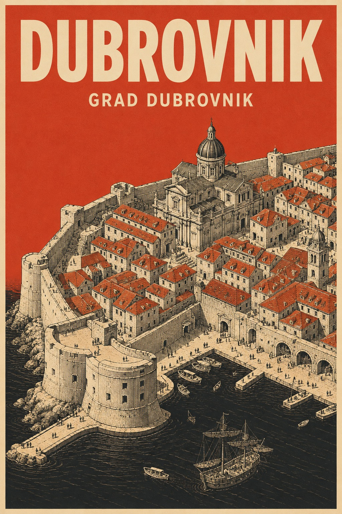

**來源：** [@Goodmanprotocol](https://x.com/Goodmanprotocol/status/2053523890744545437)

**提示詞：**

```text
Create a vertical mid-century travel poster for [CITY NAME] featuring [LANDMARK]. Use a strict 3-color palette: cream paper, black technical linework, and [COLOR].
Style: Minimalist isometric bird's-eye view with ultra-fine hatching and screen-print texture.
Color usage: Solid flat [COLOR] for the entire sky and small accents on roofs or streets. No gradients.
Text: Bold sans-serif "[CITY NAME]" at top in cream, with the local language name in smaller cream text below.
```

***

<a name="case-419"></a>

### 例 419：可頌烘焙流程 Storyboard

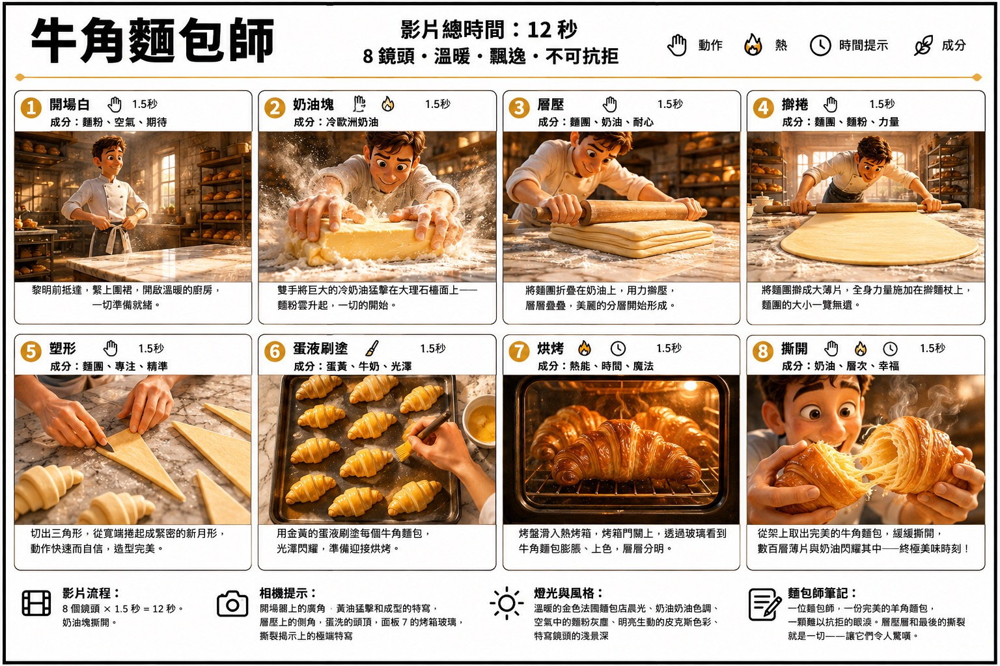

**來源：** [@TechieBySA](https://x.com/TechieBySA/status/2053523784481554759)

**提示詞：**

```text
Create a crisp, clean infographic storyboard poster for THE CROISSANT BAKER. Wide 16:9 layout, white background, black borders, bold black typography, premium Pixar 3D stylized rendering, bright vivid colors — warm golden yellows, rich buttery creams, flaky browns, soft pastry whites, warm French bakery morning light.
Top header:

THE CROISSANT BAKER
TOTAL VIDEO TIME: 12 SECONDS
8 SHOTS · WARM · FLAKY · IRRESISTIBLE
Legend icons: ACTION, HEAT, TIME HINT, INGREDIENT
Thin warm golden accent line running full width beneath header

Same Pixar-style young French male baker throughout: white baker's jacket, flour-dusted hands, warm authentic French boulangerie setting, marble countertop, warm morning light streaming through windows, bread racks in background. Bright, warm, delicious. Every panel a completely different composition and color.
8 panels:

THE OPENER — Wide shot of baker arriving at the boulangerie before dawn, tying apron, switching on the warm kitchen lights, marble counter visible, bread racks behind, flour dusting the air, full world established, bright and cinematic
THE BUTTER BLOCK — Baker slams a massive cold block of European butter onto the marble counter with both hands, dramatic impact, flour cloud puffing up, close-up on hands, this is the bones moment — the start of everything
THE LAMINATION — Baker folding the dough over the butter block precisely, rolling pin pressing down hard, layers building, side angle shot showing the beautiful layering beginning, confident and skilled
THE ROLL — Dough rolled out into a large thin sheet, baker leaning into the rolling pin with full body weight, marble counter, flour dusting everywhere, wide shot showing the scale of the dough
THE SHAPE — Triangles cut from the dough, baker rolling each one from the wide end into a tight crescent, hands moving fast and confident, close-up on the shaping, beautiful and precise
THE EGG WASH — Baker brushing golden egg wash over each shaped croissant with a pastry brush, each one glistening beautifully, close-up overhead angle, warm golden color, stunning composition
THE OVEN — Croissants slid into the blazing hot oven on a tray, oven door closed, through the oven glass croissants visibly puffing and turning deep golden, layers separating dramatically, warm orange glow
THE TEAR — Baker pulls a perfect golden croissant from the rack, holds it up, tears it open slowly revealing hundreds of impossibly flaky buttery layers inside, steam escaping, butter glistening — this is the cheese pull moment, the hero shot of the entire video

Footer:

VIDEO FLOW: 8 shots × 1.5s = 12 seconds. Butter block to the tear.
CAMERA TIPS: wide on opener, close-up on butter slam and shaping, side angle on lamination, overhead on egg wash, oven glass for panel 7, extreme close-up on the tear reveal
LIGHT & STYLE: warm golden French bakery morning light, buttery cream tones, flour dust in the air, bright vivid Pixar colors, shallow depth of field on close-ups
BAKER NOTES: one baker, one perfect croissant, one irresistible tear. The lamination layers and the final tear are everything — make them stunning.
```

***

<a name="case-420"></a>

### 例 420：紅跑道低角度夏日人像

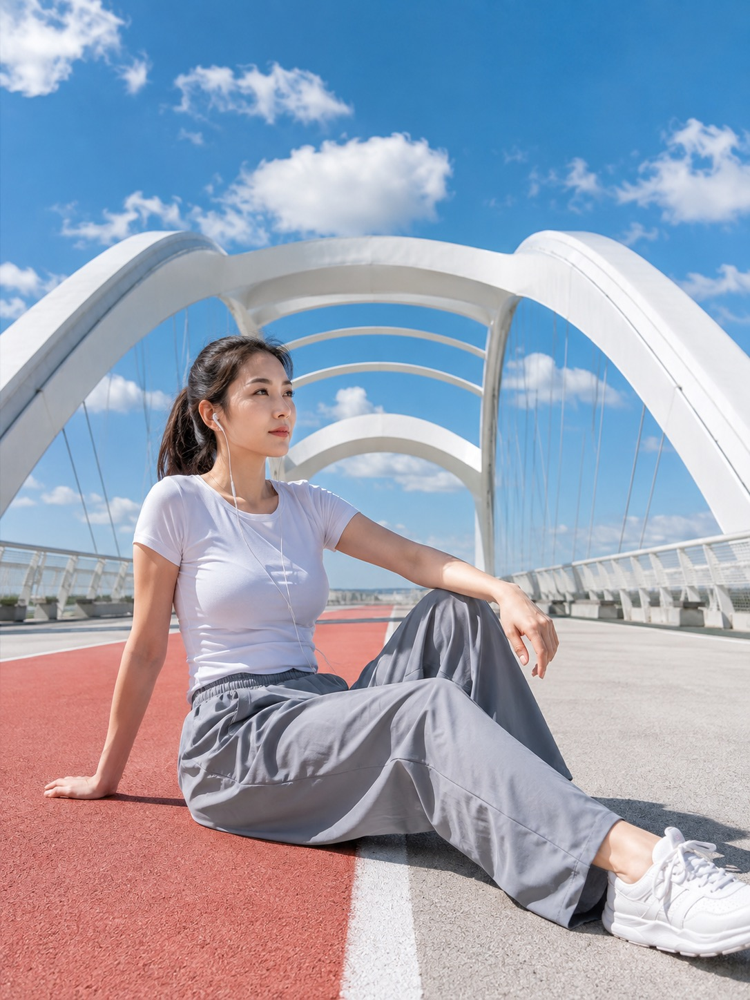

**來源：** [@Shinning1010](https://x.com/Shinning1010/status/2053521749967352285)

**提示詞：**

```text
Use the uploaded portrait photo as the appearance reference for the person. Create a bright photorealistic outdoor portrait of a young woman lying on a red running track on a modern white arch pedestrian bridge. Ultra-wide low-angle selfie perspective, her arm reaching toward the camera in the foreground, relaxed pose, wired headphones around her neck, white sleeveless top, loose gray pants, black hair spread on the ground. Clean blue sky with soft white clouds, strong midday sunlight, crisp shadows, high clarity, fresh youthful mood, architectural symmetry, realistic skin texture, cinematic composition, 3:4 vertical image

Negative Prompt:

watermark, logo, text, caption, signature, AI label, extra fingers, deformed hands, distorted face, wrong identity, duplicate person, blurry face, low resolution, over-smoothed skin, plastic skin, unnatural anatomy, bad perspective, messy background, harsh artifacts, overexposure, underexposure
```

***

<a name="case-421"></a>

### 例 421：iPhone 螢幕遮臉創意人像

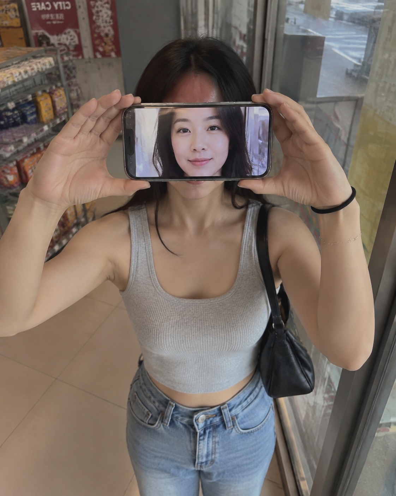

**來源：** [@Ciri_ai](https://x.com/Ciri_ai/status/2053535379618423118)

**提示詞：**

```text
Ultra-realistic creative portrait taken with an iPhone, identity accurately preserved from the reference image. A woman stands inside a store, facing a glass display window or a reflective wall, photographed from a slightly elevated frontal angle. She holds a smartphone horizontally in front of her face, covering her eyes and the upper part of her face. The phone's screen points at the camera and clearly displays a real-time image of her face.
```

***

<a name="case-422"></a>

### 例 422：冬季生存驚悚 Storyboard

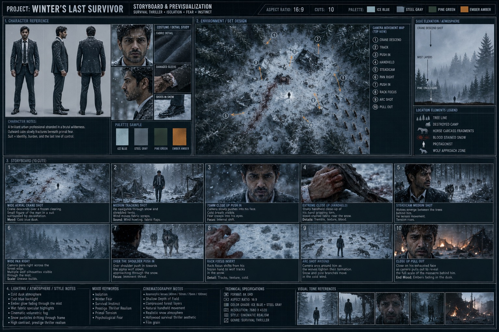

**來源：** [@zulkarnaimx](https://x.com/zulkarnaimx/status/2053723774680535538)

**提示詞：**

```text
Cinematic Survival Thriller Storyboard Prompt

Create a premium cinematic storyboard presentation sheet for a prestige winter survival thriller.
Ultra-detailed professional film pre-production layout, clean editorial design, grayscale blueprint background with labeled sections and technical annotations.
Aspect ratio 16:9 horizontal master board.

SHARED CHOICES HEADER

* Cut Count: 10
* Color Palette: icy blue + steel gray + pine green + ember amber
* Environment Fingerprint: snow-covered pine clearing, overturned horse carcass, torn campsite debris, looming conifer forest, drifting winter fog

---

1. CHARACTER REFERENCE

A realistic South Asian man in his early 30s wearing a dark charcoal business suit, white dress shirt, black tie, polished black shoes.
Snow dusted across shoulders and hair.
Calm but haunted expression.
Show:

* front view
* side profile
* back view
* facial close-up
* side close-up
* costume fabric detail
* damaged sleeve detail
* shoes in snow

Character notes:
“An intelligent city professional trapped in a brutal wilderness.
Outer composure slowly cracks under primal fear.
Suit = identity, burden, and last thread of control.”

Palette swatches:

* icy blue
* steel gray
* pine green
* ember amber

---

2. ENVIRONMENT / SET DESIGN

Top-down aerial map of a snowy forest clearing at dusk.
Dead horses partially buried in snow.
Destroyed campsite tents.
Blood trails across frozen ground.
Dense dark pine trees forming a claustrophobic wall around the clearing.
Heavy winter fog drifting through the forest.

Add cinematic camera movement markers:

1. Crane-down
2. Track
3. Push-in
4. Handheld
5. Steadicam
6. Pan-right
7. Dolly-in
8. Rack-focus
9. Arc shot
10. Pull-out

Include arrows and overhead cinematic blocking diagram.

Side elevation panel:

* descending crane shot
* fog layers
* silhouette scale reference
* conifer enclosure composition

Location elements legend:

* tree line
* torn campsite
* horse carcass debris
* blood-stained snow
* main character
* wolf approach zones

---

3. STORYBOARD (10 CUTS)

CUT 1

Wide aerial crane-down shot over frozen clearing.
Tiny suited man surrounded by devastation.
Moody blue dusk lighting.

CUT 2

Tracking medium shot beside the man walking cautiously through snow and ripped tents.
Wind moving fabric debris.

CUT 3

75mm close-up push-in on face.
Cold breath visible.
Fear slowly emerging in his eyes.

CUT 4

Extreme close-up handheld shot of trembling hand gripping torn frozen fabric near blood-covered snow.

CUT 5

Steadicam medium shot revealing wolves emerging between trees behind him.

CUT 6

Pan-right wide shot sweeping across forest edge.
Multiple wolf silhouettes visible in fog.

CUT 7

Over-the-shoulder dolly-in toward alpha wolf approaching slowly through snow.

CUT 8

Rack-focus insert shot shifting focus from frozen hand to wolf tracks in snow.

CUT 9

Arc shot circling around the man as wolves tighten formation.
Snow and pine branches moving in icy wind.

CUT 10

Close-up pull-out shot from his exhausted face revealing the full massacre behind him in fading ember dusk light.

---

4. LIGHTING / MOOD / STYLE NOTES

* icy dusk ambience
* cold blue backlight
* ember sunset glow fading through fog
* wet fabric specular highlights
* cinematic volumetric fog
* snow particles drifting through frame
* high-contrast prestige thriller realism

Mood keywords:

* isolation
* winter dread
* survival instinct
* prestige thriller realism
* primal tension
* psychological fear

Cinematography notes:

* anamorphic lenses (40mm / 50mm / 75mm / 100mm)
* shallow depth of field
* compressed forest layers
* natural handheld movement
* realistic snow atmosphere
* cinematic Hollywood survival thriller aesthetic
* ultra detailed
* photorealistic
* film grain
* 8k production design board
* premium movie pitch deck style
```

***

<a name="case-423"></a>

### 例 423：日系手繪塗鴉半身插畫

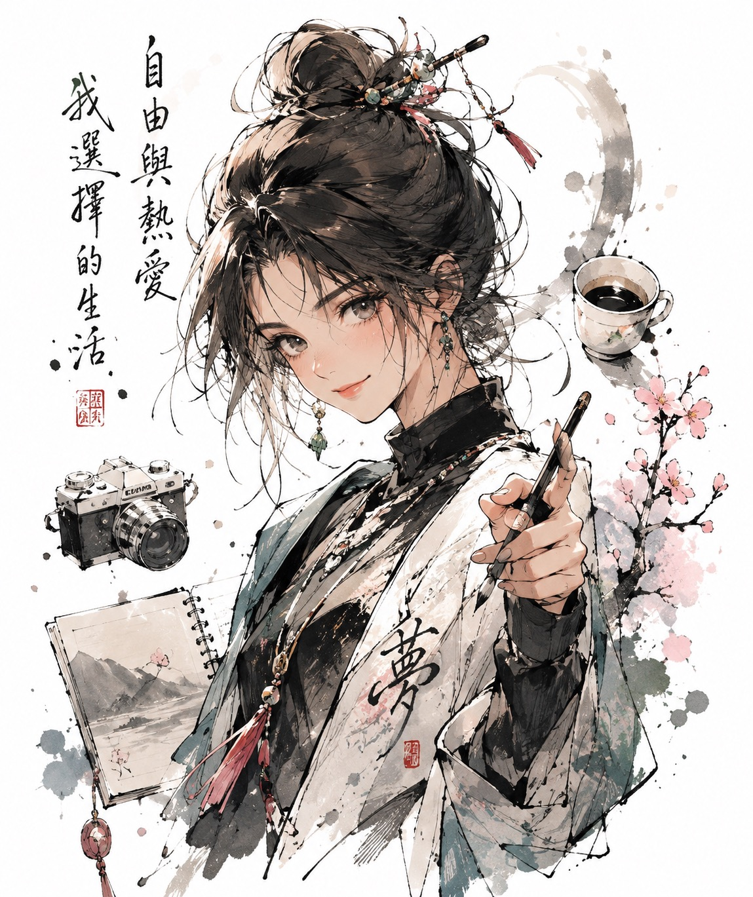

**來源：** [@heyfatema](https://x.com/heyfatema/status/2053703602246668607)

**提示詞：**

```text
Generate an illustration of "me" as you imagine it. Features include a Japanese illustration style, distinct character features, natural emotional expressions, a half-body composition, dynamic poses, exquisite clothing details, a hand-drawn graffiti style, ink splatter strokes, free-flowing lines, a blend of pastels and ink, a comic sketch texture, a minimalist white background, surrounding symbolic elements, a strong atmosphere, high detail, and high quality.
```

***

<a name="case-424"></a>

### 例 424：FMCG 棒棒糖霓虹廣告

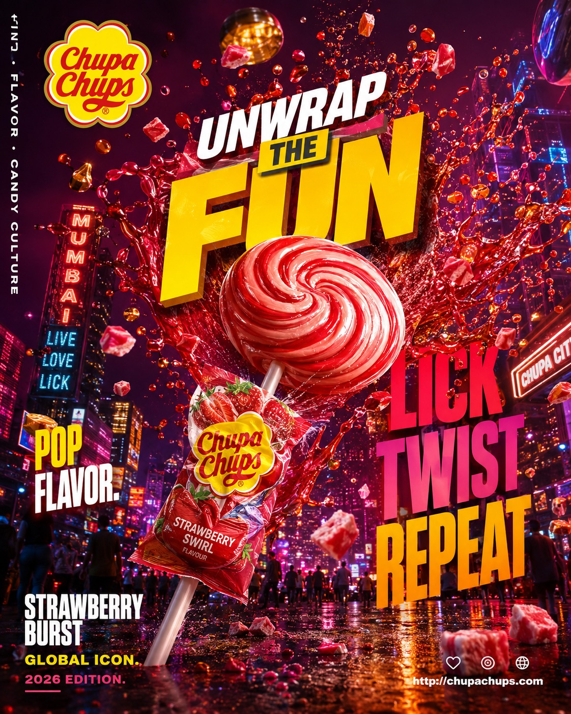

**來源：** [@Diplomeme](https://x.com/Diplomeme/status/2054061713583219149) / [Prompt reply](https://x.com/Diplomeme/status/2054061980240224476)

**提示詞：**

```text
Hyper-realistic cinematic FMCG billboard advertising poster for Chupa Chups India, focusing on playful energy, bold flavor explosion, and Gen-Z candy culture.

Scene: a giant glossy Chupa Chups lollipop floating above a vibrant Indian street at night, candy shards and liquid flavor bursts exploding outward mid-air.

Environment: neon-lit urban backdrop inspired by Mumbai nightlife, glowing signage, reflective wet streets, colorful haze.

Subject: oversized strawberry swirl lollipop as the hero object, ultra-detailed glossy texture, cinematic flavor splash motion.

Visual storytelling: iconic Chupa Chups flower logo glowing subtly on wrapper, reflections visible on wet surfaces and candy syrup splashes.

Composition: dramatic low-angle shot, giant centered product dominating frame, dynamic explosion spreading diagonally across billboard composition.

Typography:
top left — Chupa Chups logo.
center massive — “UNWRAP THE FUN” ultra bold playful typography.
behind product (oversized layered text) — “LICK / SPIN / REPEAT”.
mid-left — “FLAVOR THAT POPS.” bold condensed font.
bottom left — “STRAWBERRY BURST · GLOBAL ICON · 2026 EDITION”.
bottom right — “http://chupachups.com”.
left vertical edge — “FUN · FLAVOR · CANDY CULTURE”.

Typography style: playful bold sans-serif, glossy layered opacity, oversized billboard scale.

Color palette: vibrant reds, yellows, pinks, neon orange accents, glossy candy textures.

Lighting: dramatic neon backlight with glowing highlights and candy reflections.

Atmosphere: sugar particles, mist, syrup splashes, floating candy dust.

Mood: energetic, youthful, addictive, vibrant.

Shot on ARRI Alexa Mini LF, 35mm anamorphic, HDR, ultra cinematic, premium FMCG billboard style, 4:5 portrait.
```

***

<a name="case-425"></a>

### 例 425：黑白時尚人像拼貼海報

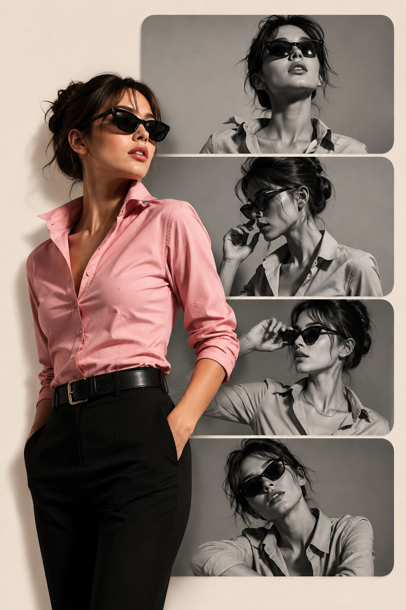

**來源：** [@XSydneyFan](https://x.com/XSydneyFan/status/2054054476429009086)

**提示詞：**

```text
{
  "prompt": "Vertical poster collage design, beige background, four stacked horizontal rounded rectangles containing black and white cinematic portraits of the same young woman wearing sunglasses in different stylish poses. Foreground features a full-color high-quality cutout of the woman on the left side, wearing a pink mauve fitted shirt, black pants, sunglasses, confident cool pose, modern fashion editorial style, soft studio lighting, ultra realistic, premium magazine aesthetic, depth and shadow effects, clean minimal layout, 2:3 aspect ratio.",
  "aspect_ratio": "2:3"
}
```

***

<a name="case-426"></a>

### 例 426：日韓咖啡館情侶寫真

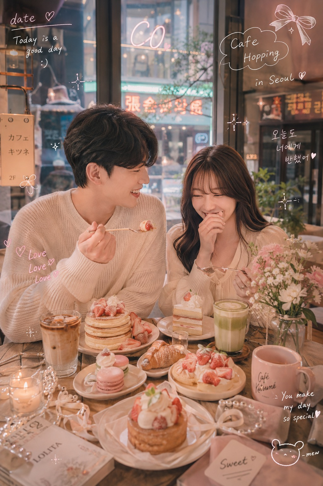

**來源：** [@sha_zdiii](https://x.com/sha_zdiii/status/2054047328420634927)

**提示詞：**

```text
Ultra-realistic cozy Japanese-Korean café photography featuring a cute young [Japanese/Korean] couple sitting together naturally in a trendy aesthetic café. The young couple should look stylish and youthful, wearing [fashion style/outfit colors], smiling softly and enjoying desserts together.

The table is beautifully filled with [desserts/foods] such as pancakes, strawberry cakes, macarons, croissants, pastries, iced coffees, matcha lattes, fruit desserts, and aesthetic drinks arranged in a visually satisfying composition. Add small aesthetic café props like [flowers/ribbons/books/candles/pearls/notebooks] on the table for a premium Pinterest moodboard feel.

Soft [lighting style] lighting enters through the café windows creating dreamy highlights, creamy shadows, glossy reflections on drinks, and realistic dessert textures. Background should contain softly blurred [Japanese/Korean] signs, glowing café boards, handwritten Japanese text, neon typography, and aesthetic city café elements for an authentic Tokyo/Seoul vibe.

Add cute scrapbook-style doodles and handwritten notes around the image in [doodle color] ink — tiny hearts, stars, sparkles, ribbons, arrows, smiley sketches, bows, diary stickers, and handwritten café notes.

Color palette should focus on [color theme] tones. Style inspired by viral Pinterest café photography, Korean lifestyle aesthetics, Japanese cozy café culture, dreamy Gen-Z romance mood, shallow depth of field, cinematic composition, ultra realistic food textures, soft blurry background, ultra detailed realistic photography, clean aesthetic layout, 8k.
```

***

<a name="case-427"></a>

### 例 427：9-frame 時尚人像拼貼

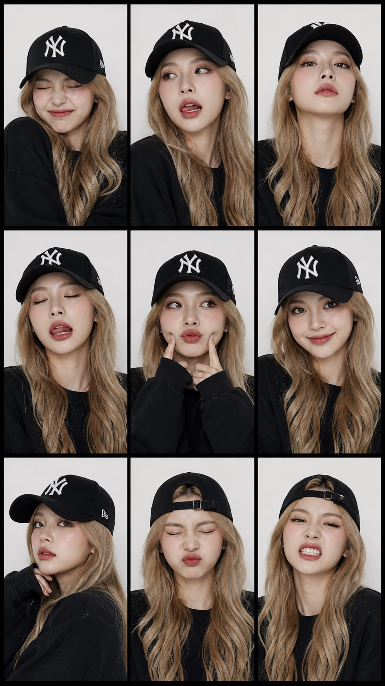

**來源：** [@saniaspeaks_](https://x.com/saniaspeaks_/status/2054046866497573214)

**提示詞：**

```text
Edit this photo and don't change the face, portrait 9:16. A 9-frame fashion portrait collage featuring a stylish young woman with playful expressions and sporty streetwear aesthetics. The concept combines modern model test photography, casual Gen-Z energy, and clean editorial studio vibes. Each frame captures different candid facial expressions and subtle attitude poses, creating a cool, confident, and slightly mischievous mood. Minimalist composition with strong focus on facial expressions, cap styling, and soft fashion portrait lighting.

Frame Descriptions (9 poses)

Frame 1 – Eyes closed with playful scrunched expression, slight smile, relaxed shoulders.
Frame 2 – Looking slightly sideways with lips parted, confident casual attitude.
Frame 3 – Head tilted slightly upward, calm expression, direct cool-girl energy.
Frame 4 – Eyes closed while sticking tongue slightly out, playful candid vibe.
Frame 5 – Both index fingers pressing cheeks while making duck lips, cute playful expression.
Frame 6 – Direct eye contact with subtle smile, relaxed natural pose.
Frame 7 – Body turned sideways, hand near chin, confident editorial profile look.
Frame 8 – Eyes squeezed shut while making pout lips, exaggerated playful expression.
Frame 9 – Wrinkled nose with gritted teeth, rebellious fashion attitude.

She wears oversized black long sleeves. Soft matte fabric with sporty streetwear silhouette. Relaxed fit with slightly oversized sleeves. Black New York Yankees baseball cap worn forward and backward in different frames. Minimal jewelry. Long soft wavy blonde hair. Soft loose waves with natural texture. Middle-part hairstyle. Hair flowing naturally around shoulders. Soft glam douyin girl makeup. Dewy glass skin finish. Brushed up natural brows, winged eyeliner, wispy natural lashes, soft pink blush (igari blush style), ombre gradient rosy pink lips with glossy finish.

Background minimal white studio backdrop. Photobooth-style collage layout with black frame borders. Shot with Canon EOS R6 / Sony A7 III / Fujifilm X-T5. High-fashion portrait photography style. 50mm or 85mm portrait lens. Eye-level framing. Tight portrait crop. Centered composition. Photobooth-inspired close-up angles. Soft diffused studio lighting. Balanced frontal light. Minimal harsh shadows. Clean editorial illumination. Cool neutral tones. Slightly desaturated blacks. Soft contrast with crisp details. Subtle film grain. Modern fashion editorial color grading.
```

***

<a name="case-428"></a>

### 例 428：F1 直播轉播圍場截圖

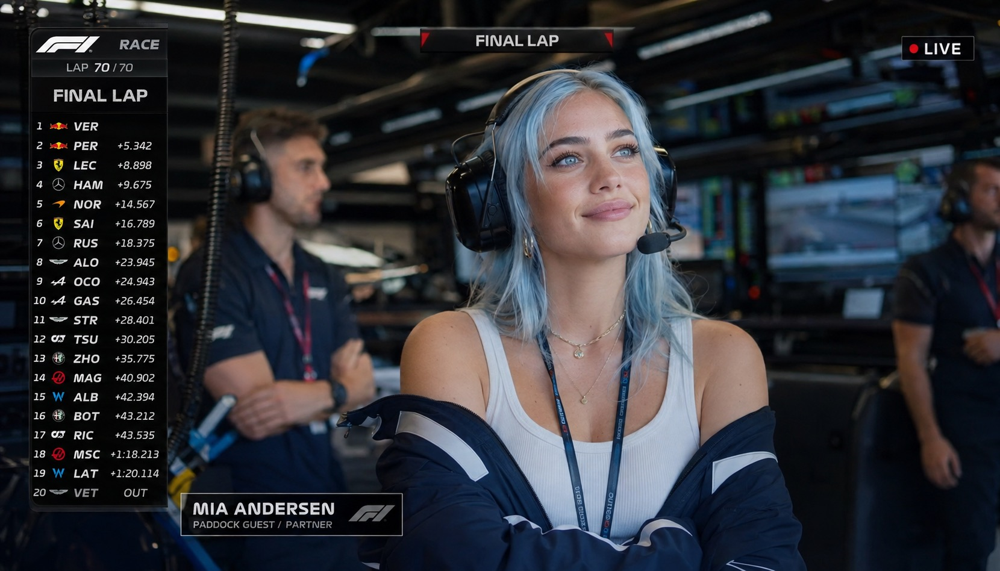

**來源：** [@bigwonbots](https://x.com/bigwonbots/status/2054573714012787059)

**提示詞：**

```text
Ultra-realistic F1 live TV broadcast screenshot. A strikingly beautiful, 25-year-old young woman with bright light blue hair and captivating bright cerulean blue eyes is sitting in the VIP paddock / team garage during a Formula 1 race. Shown on the official live race broadcast as the girlfriend of an F1 driver, she is listening to the team radio through a professional racing headset. It is the final lap, and she is watching the garage monitors with a proud, enchanting smile.
She wears a fitted white tank top, an oversized racing team jacket (with generic, unbranded or blank team logos) draped over her shoulders, large black team-radio headset with boom mic, gold jewelry, and soft glam makeup. A slim, unbranded paddock pass hangs naturally from her neck.
Add realistic F1 broadcast graphics: "FINAL LAP" banner, lap counter showing final lap, driver timing tower on the left, small F1-style logo bug, "LIVE" indicator, and a lower-third identifying her as a driver partner / paddock guest (e.g., "MIA ANDERSEN - Paddock Guest / Partner"). No fake oversized badges, no selfie angle.
Team staff (in generic kit), headsets, garage screens, and generic race equipment are blurred around her. Telephoto broadcast camera shot from across the garage, professional depth of field, compression artifacts, digital noise, bright paddock lighting, natural skin texture, no smoothing, 8k quality, cinematic lighting.
```

***

<a name="case-429"></a>

### 例 429：韓國便利店粉色 Hoodie 人像

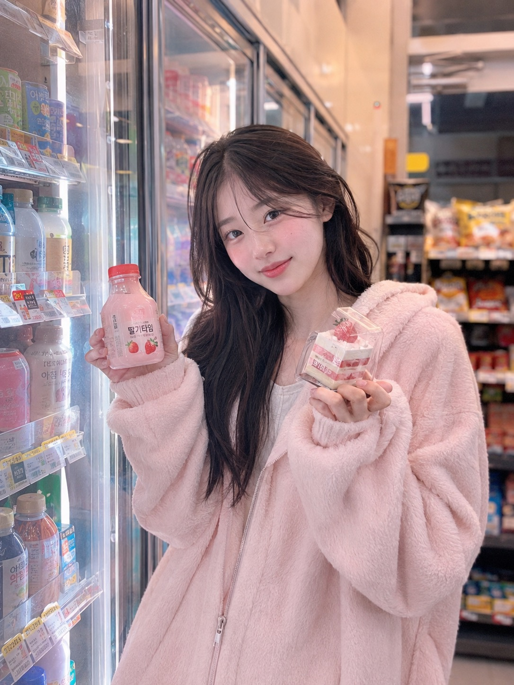

**來源：** [@john_my07](https://x.com/john_my07/status/2054573350199111928)

**提示詞：**

```text
Ultra-realistic cozy Korean convenience store portrait of a beautiful Korean woman standing in front of glowing refrigerator aisles at night, wearing an oversized fluffy pastel pink hoodie with the hood up. She holds a bottle of strawberry milk in one hand and a tiny strawberry cake in the other while shyly looking toward the camera. Long soft black hair, glossy eyes, natural skin texture, subtle blushy makeup, gentle expression, youthful Korean beauty aesthetic. Warm fluorescent convenience store lighting mixed with realistic iPhone flash photography. Tiny reflections on drink bottles and glass refrigerator doors, dreamy romantic atmosphere, soft pink and cream color palette, slice-of-life anime realism blended with cinematic photography, highly detailed, cozy late-night Seoul convenience store vibe, shallow depth of field, realistic Korean snack packaging, candid aesthetic, soft glow, ultra photorealistic.
```

***

<a name="case-430"></a>

### 例 430：鉛筆素描時尚編輯插畫

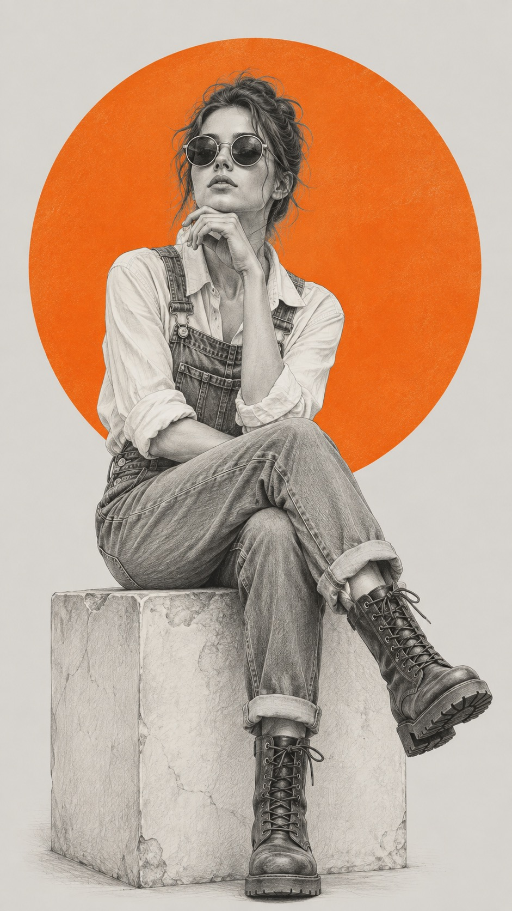

**來源：** [@harboriis](https://x.com/harboriis/status/2054573031343931418)

**提示詞：**

```text
A high-detail digital illustration of a stylish woman sitting gracefully on a stone ledge, posing with one hand near her chin and legs crossed. She is wearing vintage-inspired round sunglasses, a white blouse with rolled-up sleeves, denim overalls, and rugged lace-up combat boots. The subject is rendered in a desaturated, monochromatic pencil-sketch style with soft cross-hatching and charcoal textures. In the background, a large, vibrant solid orange circle creates a bold geometric contrast against a clean, light grey backdrop. The overall composition is minimalist, editorial, and features a clean "indie-magazine" aesthetic with sharp linework and soft shading.

Aspect ratio is 9:16
```

***

<a name="case-431"></a>

### 例 431：城市文字旅行海報

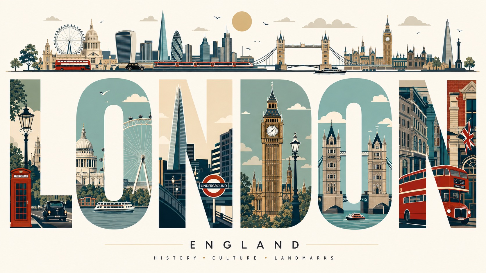

**來源：** [@iamaiistudio](https://x.com/iamaiistudio/status/2054563354899857757)

**提示詞：**

```text
Ultra-high-resolution typography travel poster themed around [CITY NAME]. 16:9 poster ratio.

IMPORTANT: every visible word on the poster must be in English, perfectly spelled, professionally typeset. No distorted letters, no random symbols, no broken text, no AI gibberish.

CORE COMPOSITION:
Place the giant English word "[CITY_NAME]" front and center. Each letter is a tall, bold, elongated sans-serif form, and each one frames a different illustrated scene from the city, like a row of gallery windows. Spread landmarks, streets, transport, nature, culture, and architecture across the letters so the scenes flow from one letter into the next as a single connected urban panorama.

TOP HORIZONTAL STRIP:
Across the top of the poster, a thin panoramic band: city skyline silhouettes, cars, trams or trains, boats where it fits, birds, clouds, sun. Keep it minimalist, elegant, rhythmically balanced.

STYLE: mid-century modern editorial poster, Swiss graphic design, minimal vector illustration, architectural infographic feel, travel typography poster, flat geometric illustration, ultra-clean composition, premium magazine design, screen-print poster vibe, retro-futuristic travel branding.

ILLUSTRATION:
Flat vector shapes only. No realism, no gradients, no noise. Clean geometric shadows, simplified architectural forms, a mix of map-like top-down with side-view cityscape. Subtle line-art details, crisp vector edges, strong negative space, harmonious rhythm between the letters.

TYPOGRAPHY:
Giant bold sans-serif, letters fill most of the canvas height. Pixel-perfect alignment. Each letter acts as its own framed illustration panel. Soft rounded corners where it suits. Editorial spacing. Print-ready and geometrically clean.

COLOR PALETTE:
Pull a cohesive palette inspired by [CITY_NAME]:
coastal city -> aqua, sand, coral, muted teal
desert city -> terracotta, beige, warm cream
cyber city -> mint, navy, steel blue
historic European city -> dusty rose, olive green, parchment
Muted pastels, soft vintage travel-poster colors, low saturation. Max 4 to 6 colors.

CONTENT:
Include iconic landmarks, famous streets and transport, local urban patterns, nearby nature, skyline silhouettes, bridges/rivers/coastline if relevant, culturally symbolic architecture, recognizable local atmosphere.

COMPOSITION:
Centered typography on a white or soft ivory background. Lots of breathing room. The top panoramic strip balances the heavy typography below. Asymmetrical but visually balanced. Each letter shows its own scene depth and perspective. Museum-quality poster hierarchy.

MOOD: premium, intellectual, calm, design-forward, travel-editorial, stylish enough for a museum gift-shop wall.

QUALITY: 8K ultra-detailed, print-ready, razor-sharp vector edges, flawless typography, zero distorted text, zero random characters, zero spelling errors, zero AI artifacts.
```

***

<a name="case-432"></a>

### 例 432：大堡礁復古旅行海報

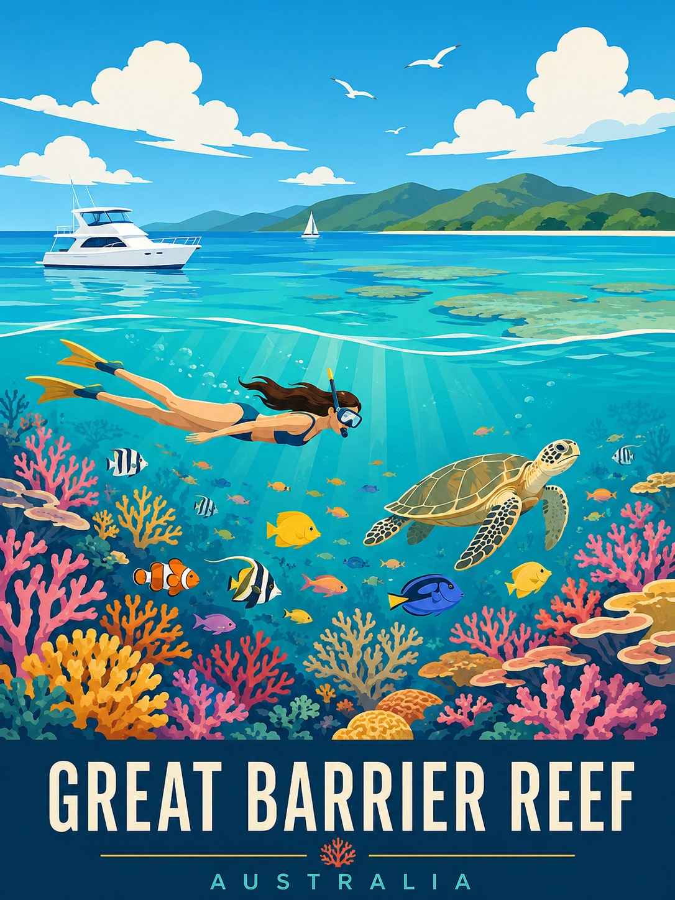

**來源：** [@jzaib4269](https://x.com/jzaib4269/status/2055487295734620522)

**提示詞：**

```text
Create a premium editorial travel poster illustration of the Great Barrier Reef, Australia.
Style: Flat vector illustration, ultra-clean minimalism, mid-century modern travel poster aesthetic, inspired by vintage tourism prints and Scandinavian graphic design. No photorealism, no textures, no noise, no gradients. Use crisp shapes, smooth color blocks, and harmonious vibrant tones.
Composition (vertical 3:4 layout):
Foreground (underwater): A rich coral reef ecosystem filled with colorful corals in pink, orange, yellow, and red tones. Include tropical fish of various species (striped, bright yellow, blue, and orange), and a large sea turtle swimming gracefully toward the right. Clear turquoise water with high visibility.
Midground: A female snorkeler swimming horizontally just beneath the water surface, wearing fins and a snorkel mask, observing the reef below. Light rays subtly pass through the water surface.
Background (above water): A calm tropical ocean with shallow reef patches visible through crystal-clear water. A white leisure boat floats peacefully on the left, and a small sailboat appears far in the distance. On the horizon, soft green islands or hills stretch across.
Sky: Bright blue sky with fluffy white clouds and a few birds flying, enhancing the serene vacation mood.
Typography:
At the bottom of the poster, include bold uppercase text:
“GREAT BARRIER REEF”
Below it, smaller spaced-out text:
“AUSTRALIA”
Add a small decorative coral icon between divider lines.
Mood & Lighting: Bright daylight, calm, inviting, tropical paradise atmosphere. Colors should feel fresh, vibrant, and relaxing with strong contrast between coral reef and ocean blues.
```

***

<a name="case-433"></a>

### 例 433：韓國城市水彩旅行插畫

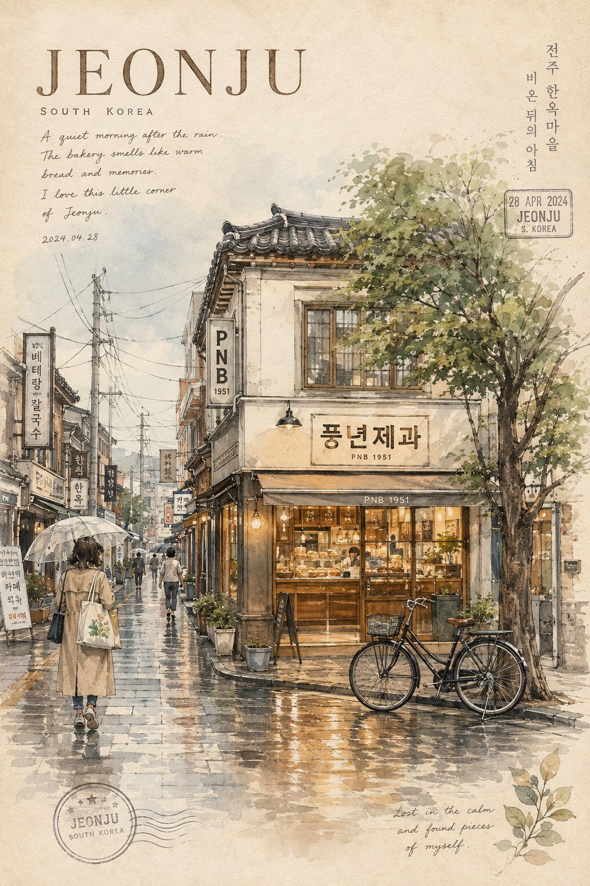

**來源：** [@Taaruk_](https://x.com/Taaruk_/status/2055492435862773978)

**提示詞：**

```text
Dreamy watercolor travel illustration of a peaceful Korean city street, hand-painted urban sketchbook style, delicate ink linework mixed with soft watercolor washes, cozy café storefronts, warm bakery lights glowing through windows, quiet morning atmosphere after light rain, reflective wet pavement, pedestrians with umbrellas and tote bags, bicycles parked along narrow streets, traditional Korean signs and typography, subtle Korean text labels, soft beige paper texture background, architectural sketch aesthetic, calm everyday city life, muted earthy palette with warm browns, faded greens, cream whites and soft blue accents, highly detailed pen-and-ink drawing, loose expressive brush strokes, travel journal composition, editorial postcard layout, elegant serif title text at top (“SEOUL”, “JEONJU”, “DAEJEON”), handwritten notes and date stamps, vintage travel diary aesthetic, cozy East Asian urban scenery, cinematic slice-of-life mood, watercolor bleeding edges, natural perspective, atmospheric depth, peaceful storytelling illustration, minimalist negative space, ultra detailed watercolor texture, sketchbook traveler aesthetic, nostalgic café culture vibes, Studio Ghibli-inspired realism, European urban sketching style mixed with Korean street scenery, soft daylight, calm and poetic composition, vertical poster design, premium art print quality.
```

***

<a name="case-434"></a>

### 例 434：東京街頭膠片人像

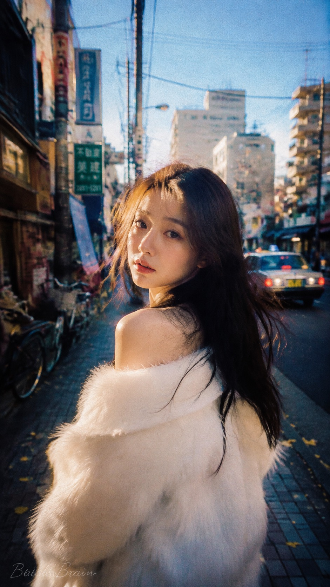

**來源：** [@BubbleBrain](https://x.com/BubbleBrain/status/2055491616392052887)

**提示詞：**

```text
film photography, candid street snapshot aesthetic, razor-sharp focus on subject, shallow depth of field with soft blurred urban background, bright daylight, slightly overexposed highlights, vivid contrast, subtle analog film texture, heavy film grain, nostalgic cinematic atmosphere, Tokyo backstreet neighborhood scene near a quiet train station, narrow pedestrian street lined with Japanese convenience stores, vintage vending machines, small ramen shops, hanging signs with faded typography, bicycles parked along tiled sidewalks, utility poles and overhead wires stretching across the sky, scattered fallen leaves on the ground, distant pedestrians and passing taxis softly blurred in the background, warm afternoon sunlight with deep blue sky, realistic street fashion photography style, effortless cool street vibe, vibrant colors with slightly muted faded film tones, beautiful 19-year-old Chinese female influencer, fair porcelain skin with cold pale undertones, exquisite natural makeup, glossy soft lips, defined brows, delicate lashes, soft messy long black hair with natural flowing curves, wearing an off-shoulder white fluffy faux fur jacket, playful yet subtly seductive expression, lazy dreamy vintage filter, ultra high-quality details, intentionally mundane phone-camera snapshot feeling, casual accidental composition, imperfect framing, realistic iPhone photography texture, spontaneous candid energy, highly attractive girl casually posing in the middle of the sidewalk, body facing away from the camera while turning her head back toward the lens with direct eye contact, relaxed posture, soft wind moving her hair, emotional youthful atmosphere, modern Asian street fashion editorial, soft haze, layered composition, masterpiece, best quality, ultra detailed, slight motion blur from slow shutter, authentic everyday realism, “BubbleBrain” small handwritten signature text on bottom corner --ar 9:16
```

***

<a name="case-435"></a>

### 例 435：層疊紙雕情侶插畫

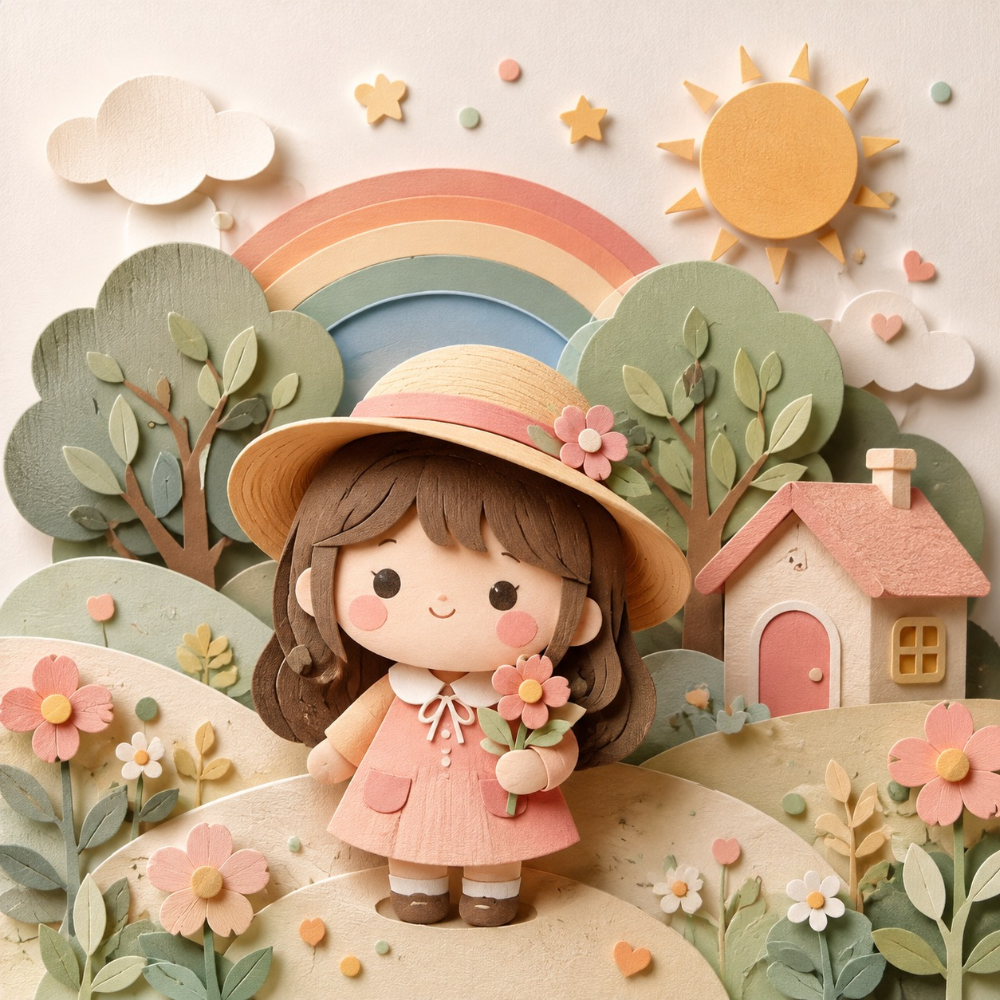

**來源：** [@Just_sharon7](https://x.com/Just_sharon7/status/2055368240885641323)

**提示詞：**

```text
{
  "style": "layered paper-cut illustration, papercraft diorama, handcrafted aesthetic",
  "technique": {
    "layering": "multiple stacked paper layers with soft drop shadows between each layer",
    "depth": "5–7 visible depth planes from foreground to background",
    "edges": "smooth, rounded, slightly beveled paper-cut edges",
    "texture": "subtle paper grain and fibrous texture on all surfaces",
    "shadows": "soft, diffused inner shadows beneath each layer suggesting physical depth"
  },
  "character_design": {
    "proportions": "chibi / cute simplified — large round head, small body (1:1.5 ratio)",
    "face": {
      "eyes": "small dot eyes, glossy highlight",
      "cheeks": "soft circular rosy blush patches",
      "nose": "absent or minimal dot",
      "mouth": "simple small curve smile"
    },
    "limbs": "short, rounded, stubby limbs",
    "outline": "clean smooth silhouette, no sharp corners"
  },
  "color_palette": {
    "mood": "warm, cozy, pastel",
    "tones": ["soft cream", "dusty rose", "sage green", "warm peach", "sky blue", "honey yellow"],
    "saturation": "low-to-medium, muted and gentle",
    "background": "warm off-white or soft gradient"
  },
  "lighting": {
    "type": "soft ambient light from top-front",
    "highlights": "gentle white edge highlights on top layers",
    "shadows": "warm light tan/beige shadow tones beneath cut layers"
  },
  "environment": {
    "foliage": "simplified rounded leaf and floral shapes as separate paper layers",
    "ground": "curved horizon layers suggesting rolling hills",
    "details": "tiny decorative elements — stars, small hearts, dots — cut from paper"
  },
  "overall_mood": "warm, whimsical, cozy, handmade, storybook",
  "render_quality": "ultra-detailed papercraft art, studio photography lighting, sharp focus on layer edges"
}
```

***

<a name="case-436"></a>

### 例 436：數位相機螢幕懷舊人像

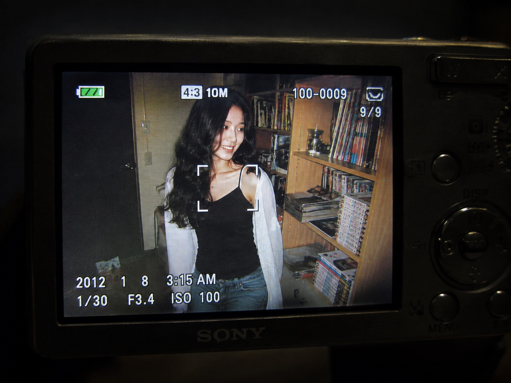

**來源：** [@Ciri_ai](https://x.com/Ciri_ai/status/2055876982630686956)

**提示詞：**

```text
A realistic close-up shot of a small digital camera screen glowing brightly in a dark indoor environment. Displayed on the LCD is a candid early-2010s style photograph of a young East Asian woman with long dark wavy hair standing beside a wooden shelf packed tightly with colorful comic books and magazines.

She wears a black spaghetti-strap top with a loose white cardigan hanging casually from both shoulders and faded blue jeans. Captured mid-laugh while turning her face slightly sideways, her expression feels spontaneous and natural, with hair falling softly across part of her cheek.

The harsh direct flash from the compact camera creates strong highlights on her face and cardigan while flattening shadows in the background, producing an authentic nostalgic digicam aesthetic. Slight motion blur and digital grain enhance the candid realism.

Camera UI overlays are visible across the LCD screen, including the timestamp “8. 1. 2012 3:15 AM,” exposure data “1/30 F3.4 ISO 100,” focus indicators, and a small green battery symbol in the corner.

The image preserves visible screen pixel structure, slight glare reflections, chromatic softness, and compressed digital texture. Outside the LCD, the surrounding darkness fades smoothly into blur, emphasizing the glowing nostalgic screen.

Shot to resemble an authentic Sony Cyber-shot point-and-shoot camera from the early 2010s using a CCD sensor with vintage digital rendering and imperfect flash exposure.
```

***

<a name="case-437"></a>

### 例 437：面部美學分析報告

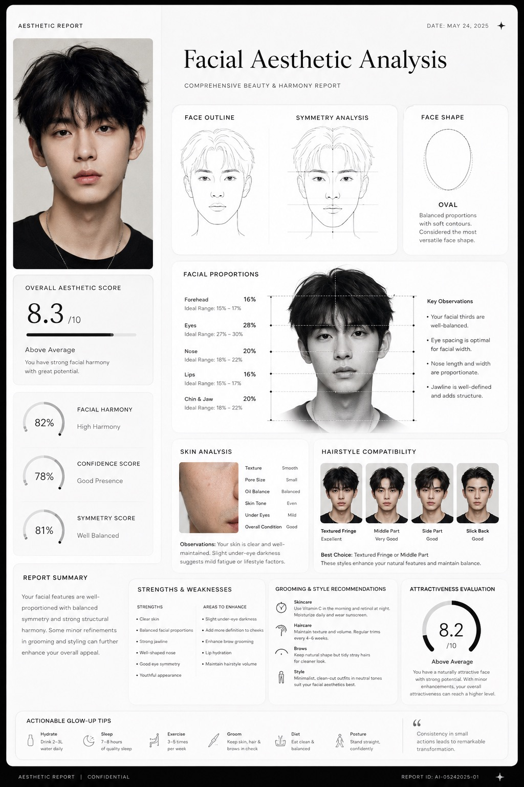

**來源：** [@saniaspeaks_](https://x.com/saniaspeaks_/status/2055857787637522908)

**提示詞：**

```text
Create a clean, minimal, luxury-style facial aesthetics analysis report based on the uploaded portrait photo.
Design style:
Ultra-modern black and white interface, premium editorial aesthetic, thin elegant divider lines, soft rounded cards, subtle shadows, spacious layout, luxury skincare / fashion magazine vibe, monochrome palette, Apple-style UI refinement.
Include:
– A simple contour line-art drawing of the face based on the subject
– Facial symmetry analysis
– Face shape identification
– Proportional analysis (eyes, nose, jawline, lips, forehead)
– Skin texture observations
– Hairstyle compatibility suggestions
– Grooming and fashion recommendations
– Honest attractiveness evaluation with balanced critique
– Strengths and weaker facial areas explained objectively
– Actionable glow-up recommendations
– Confidence score and facial harmony score shown with elegant charts or meters
Style notes:
Keep the report data-driven, visually refined, realistic, and not overly flattering.
Avoid exaggerated praise.
Use clean typography, premium spacing, modern infographics, subtle geometric accents, and professional cosmetic consultation aesthetics.
Visual composition:
Magazine-quality presentation, luxury beauty report dashboard, highly organized layout, cinematic monochrome feel, minimalist infographic design, realistic facial structure interpretation, modern masculine beauty analytics.
Rendering:
Ultra-detailed, sharp UI design, realistic portrait adaptation, sophisticated editorial presentation, high-end branding aesthetic, 4K quality.
```

***

<a name="case-438"></a>

### 例 438：珠寶微縮城市廣告海報

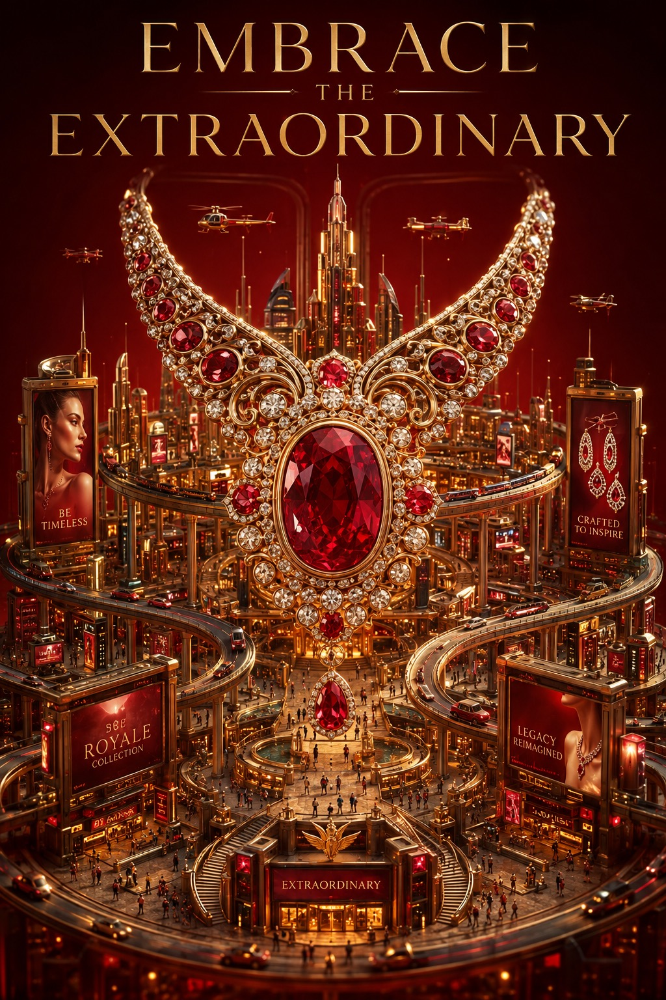

**來源：** [@Umar__786Ai](https://x.com/Umar__786Ai/status/2055664244138349055)

**提示詞：**

```text
Create a hyper-detailed luxury advertising poster in a cinematic miniature-world style. A gigantic royal diamond necklace with intricate gold filigree and massive ruby gemstones stands in the center like an architectural monument. Surround the necklace with a futuristic miniature city built around and inside the jewelry piece, including skyscrapers, elevated highways, bridges, spiral staircases, tiny human figures, luxury billboards, drones, helicopters, and cinematic urban activity. Use a deep crimson red monochrome background with gold and ruby accents. Add premium fashion-ad aesthetics, ultra-realistic textures, glossy reflections, dramatic studio lighting, depth of field, tilt-shift miniature effect, and high-end commercial composition. Include bold elegant typography at the top saying: “EMBRACE THE EXTRAORDINARY”. Style inspired by luxury jewelry campaigns, surreal city-building concepts, and premium 3D advertising renders. Ultra realistic, 8K, octane render, sharp focus, highly detailed, cinematic shadows, symmetrical composition.
```

***

<a name="case-439"></a>

### 例 439：賽博駭客角色設定表

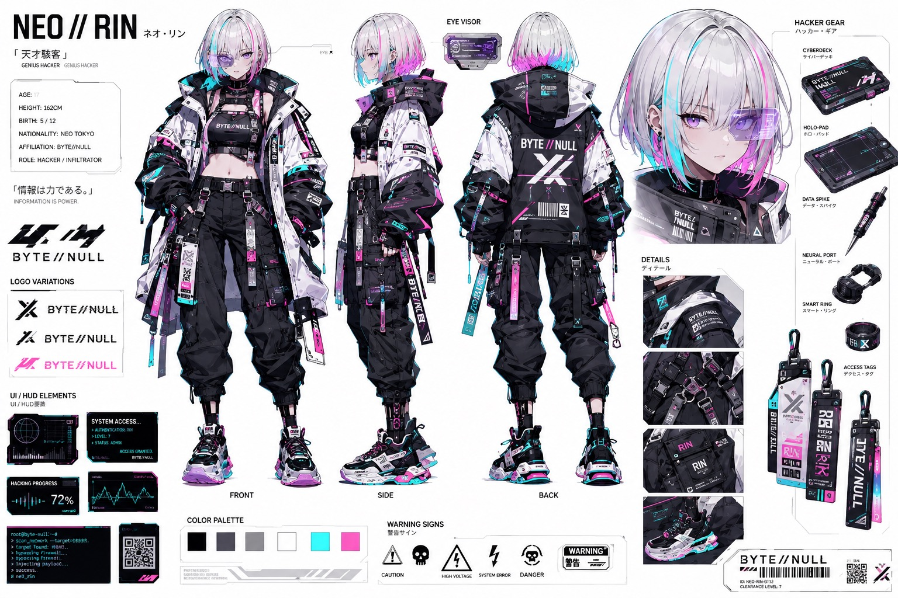

**來源：** [@Kashberg_0](https://x.com/Kashberg_0/status/2055865126335762902)

**提示詞：**

```text
Ultra-detailed cyberpunk anime character design sheet of a teenage genius hacker girl named “NEO // RIN”, full body turnaround (front, side, back) plus close-up portrait and accessory callouts. Short silver-white bob haircut with neon cyan and magenta gradient streaks, glowing translucent cyber visor over one eye, pale skin, sharp violet eyes, calm confident expression. Oversized techwear jacket with black tactical cargo pants, belts, straps, dangling utility tags, cropped top, futuristic sneakers, holographic accessories, barcode decals, warning symbols, “BYTE//NULL” typography, hacker aesthetic.
Color palette: matte black, dark gray, white, neon cyan, neon pink.
Style inspired by high-end Japanese concept art, futuristic streetwear, cyberpunk fashion, Akira + Ghost in the Shell + modern anime key visual aesthetics.
Include clean character reference sheet layout with labeled details, logo designs, UI graphics, gadget closeups, and color palette on white background.
Highly polished cel shading, crisp lineart, soft glow effects, intricate clothing folds, layered accessories, dynamic fashion silhouette, professional game concept art quality, 4k, ultra detailed.
```

***

<a name="case-440"></a>

### 例 440：手機拍攝 FaceTime 工作螢幕

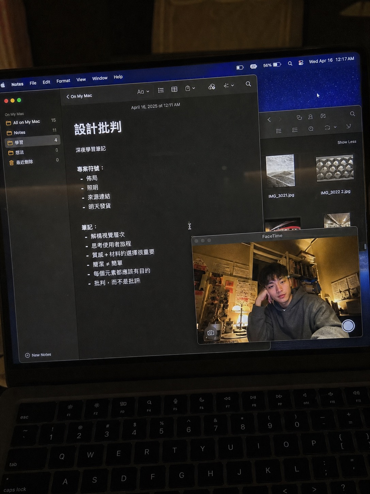

**來源：** [@kaanakz](https://x.com/kaanakz/status/2056290465503171000)

**提示詞：**

```text
Create a raw smartphone photo of a laptop screen, not a screenshot. Aspect ratio 3:4, high-angle downward POV from someone standing over a desk at night. The laptop display fills most of the frame, with a narrow strip of black keyboard and trackpad visible at the bottom. Strong realism: visible RGB subpixel grid, subtle moire bands, small dust specks, faint fingerprints, uneven glass reflections, handheld phone noise, slight perspective skew, no studio polish. macOS dark mode. Background app: Apple Notes with a late-night study note titled "Design Critique" and short visible bullets: "layout", "lighting", "source links", "ship tomorrow". Foreground app: FaceTime live preview window floating lower-right, showing a fictional adult man in his 20s sitting at a cluttered desk, hoodie, tired but amused expression, warm desk lamp behind him, books and sticky notes in the room. A second small Finder window with image thumbnails is partly visible behind it. Make it feel like an accidental real phone photo of a working laptop screen. No real-person likeness, no beauty filter, no perfect UI, no screenshot, no watermark, no cartoon, no 3D render.
```

***

<a name="case-441"></a>

### 例 441：WILDCAMP 巨型帳篷廣告海報

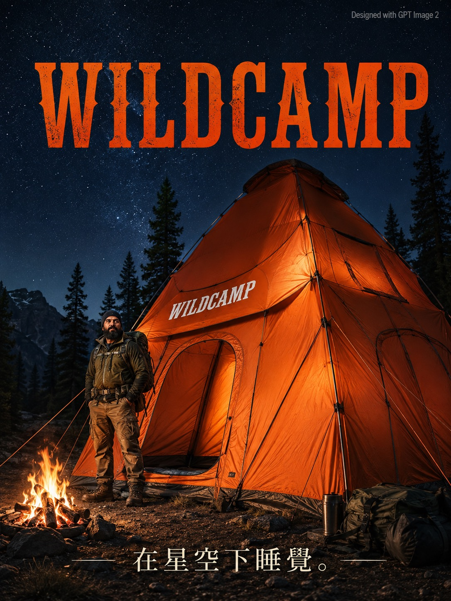

**來源：** [@Strength04_X](https://x.com/Strength04_X/status/2056258909334306897)

**提示詞：**

```text
An outdoor adventure advertisement poster featuring a rugged bearded man in full hiking gear standing confidently beside a massive orange camping tent three times taller than him, fully pitched in a dramatic forest clearing surrounded by towering pine trees beneath a deep starry night sky. The tent features a bold white “WILDCAMP” logo stitched onto the rainfly. Warm cinematic campfire lighting illuminates the scene with realistic shadows and rich outdoor textures, creating a premium adventure-commercial aesthetic. Large rugged serif typography reading “WILDCAMP” dominates the dark sky area in bold orange lettering, while the tagline “Sleep under the stars.” appears elegantly at the bottom. Small grey text in the top-right corner reads “Designed with GPT Image 2.” Photorealistic, ultra-detailed, cinematic outdoor advertising style with dramatic atmosphere and high-end commercial composition.
```

***

<a name="case-442"></a>

### 例 442：舒適髮廊插畫

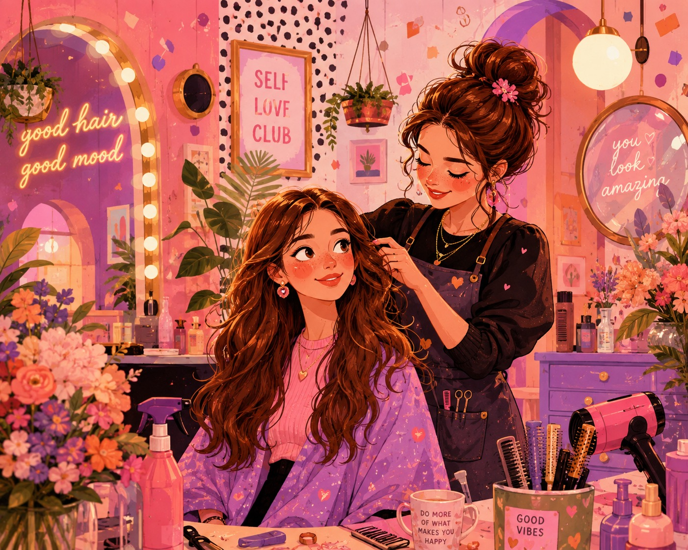

**來源：** [@Sairah_0](https://x.com/Sairah_0/status/2056293543753503126)

**提示詞：**

```text
A vibrant whimsical digital illustration of a cozy indie hair salon, featuring a young girl with long brown hair getting her hair styled by a fashionable hairstylist. Bright pink, purple, orange, and peach color palette with playful retro decor, indoor plants, patterned walls, confetti shapes, beauty tools, flowers, and soft ambient lighting. Cute feminine aesthetic, dreamy cartoon style, expressive characters with rosy cheeks, highly detailed textures, modern flat illustration mixed with painterly shading, colorful composition, trendy Pinterest aesthetic, cozy creative atmosphere, ultra-detailed, 2D editorial art style.
```

***

<a name="case-443"></a>

### 例 443：塔可爆炸拆解資訊圖表

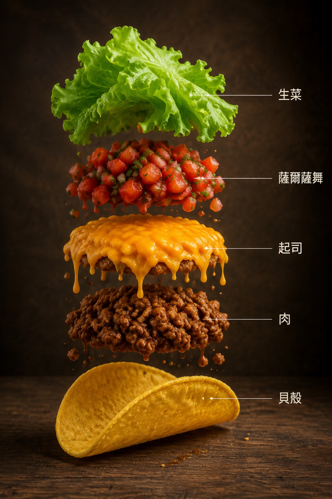

**來源：** [@Strength04_X](https://x.com/Strength04_X/status/2056018963084226866)

**提示詞：**

```text
Create a hyper-realistic exploded vertical infographic composition of tacos.

Top → Bottom structure:
Fresh Lettuce (crisp green texture with natural folds)
→ Tomato & Salsa Layer (juicy diced tomatoes and salsa mix)
→ Melted Cheese (smooth cheddar texture)
→ Grilled Meat Filling (juicy seasoned meat detail)
→ Taco Shell Base (crispy golden shell texture)
Perfect vertical alignment, rustic background, soft studio lighting, realistic shadows beneath each floating element.

Add clean infographic text labels with thin pointer lines using these exact labels:
“Lettuce”
“Salsa”
“Cheese”
“Meat”
“Shell”
Ultra-detailed food textures, premium commercial aesthetic, 8K.
```

***

<a name="case-444"></a>

### 例 444：迪斯科鏡面 3D App 圖示


**來源：** [@vista8](https://x.com/vista8/status/2056308962778296715)

**提示詞：**

```text
為【品牌名】生成一個高階 3D App 圖示，圓角方形底板，玻璃與金屬鉻材質，迪斯科球鏡面馬賽克小方塊質感，閃亮高光，柔和工作室燈光，乾淨極簡背景，高階產品圖示風格，Blender 3D 渲染，超精細

英文版：

A premium 3D app icon for 【Product Name】, rounded square tile, glossy glass and chrome material, disco-ball mosaic mirror tiles, sparkling highlights, soft studio lighting, clean minimal background, high-end icon, Blender 3D render, ultra detailed
```

***

<a name="case-445"></a>

### 例 445：旅遊照水墨明信片

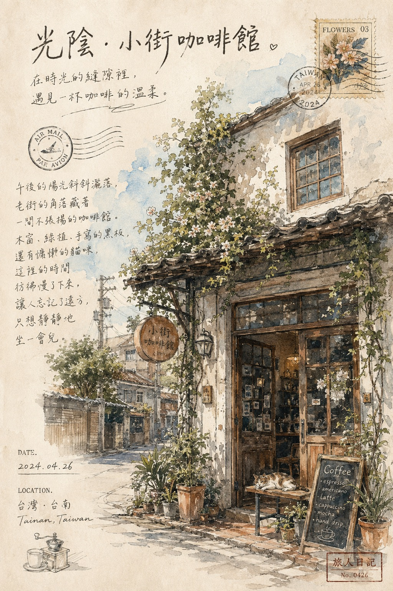

**來源：** [@zhgqthomas](https://x.com/zhgqthomas/status/2056633723366568387)

**提示詞：**

```text
Create a dreamy watercolor travel illustration style from the attached photo. Use hand-painted urban sketchbook aesthetic, delicate ink linework mixed with soft watercolor washes, highly detailed pen-and-ink drawing, loose expressive brush strokes, watercolor bleeding edges, ultra detailed watercolor texture, soft beige paper texture background, architectural sketch style, vintage travel diary and sketchbook traveler aesthetic, travel journal composition, editorial postcard layout, handwritten medium title:[自定義標題]  at top, handwritten notes:[自定義文案] , date: [自定義日期] and location: [自定義地點]  stamps, natural perspective, atmospheric depth, minimalist negative space, muted earthy palette (warm browns, faded greens, cream whites, soft blue accents), quiet, calm, soft, cozy, nostalgic vibes, cinematic slice-of-life mood, poetic composition, mixed urban sketching with Ghibli-inspired realism, vertical poster design, premium art print quality.
```

***

<a name="case-446"></a>

### 例 446：低多邊形紙藝男士肖像

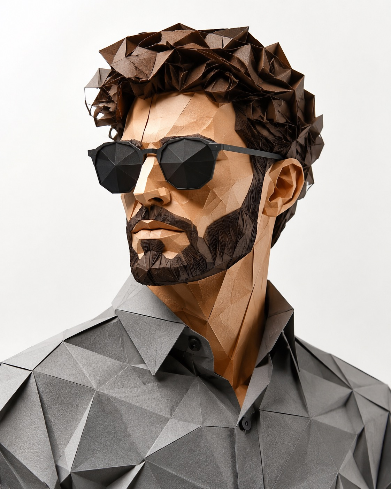

**來源：** [@iamsofiaijaz](https://x.com/iamsofiaijaz/status/2056953102755115162)

**提示詞：**

```text
Create a highly detailed low-poly papercraft portrait of a stylish young man, designed like an origami paper sculpture. The character has curly dark brown hair, a trimmed beard, and wears slightly black-tinted geometric sunglasses with thin black frames. His shirt is medium grey with sharp polygonal folds and realistic paper texture. Use faceted angular shapes across the face, hair, and clothing, with realistic shadows and layered paper depth. Minimal clean white studio background, soft lighting, ultra-realistic paper craft aesthetic, modern geometric art style, high detail, centered composition, 8k quality.
```

***

<a name="case-447"></a>

### 例 447：現代地鐵工程資訊圖表

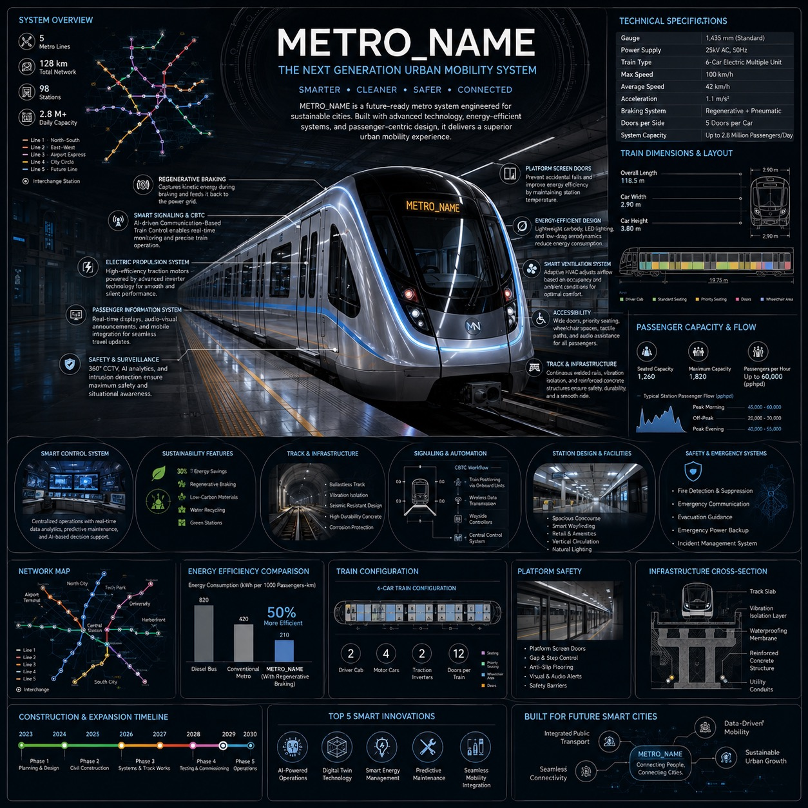

**來源：** [@j\_smeaton99](https://x.com/j_smeaton99/status/2056950969083343077)

**提示詞：**

```text
Create a premium square “reference-style urban transportation infographic” centered around a futuristic modern metro system called the {METRO_NAME}, designed as a beautifully curated transit-engineering handbook page rather than a public transport advertisement.

The composition should feel like a modern visual encyclopedia mixed with an elite railway infrastructure field guide and high-end editorial infographic system.

Visual Direction:

• 1:1 square composition
• Dark premium urban-tech background with subtle railway schematics, metro maps, and futuristic blueprint overlays
• Elegant palette using deep navy, matte black, steel gray, electric blue accents, and soft white lighting
• Refined editorial typography hierarchy with modern transportation aesthetics
• Rounded modular information cards with clean spacing
• Gentle realistic reflections and premium HUD-style dividers
• Minimal transit-system iconography
• Extremely detailed central metro train render viewed in dramatic three-quarter perspective inside a futuristic underground station
• Thin precision annotation lines pointing toward transportation systems and smart engineering features
• Clean, organized “knowledge-first” layout with high information density but breathable spacing

Main Subject Presentation:

A stunning ultra-detailed realistic render of the {METRO_NAME} modern metro train placed at the center, featuring sleek aerodynamic train design, glowing destination displays, realistic stainless-steel textures, illuminated station lighting, smart glass windows, premium urban-environment realism, and futuristic rail infrastructure.

Surround the metro with scientific and engineering callouts explaining:

• regenerative braking system
• smart signalling & CBTC control
• electric propulsion system
• passenger information systems
• safety and surveillance technology
• platform screen doors
• energy-efficient design
• smart ventilation systems
• accessibility features
• track and infrastructure engineering

Include modular infographic sections such as:

• Metro System Overview
• Technical Specifications
• Train Dimensions & Layout
• Passenger Capacity & Flow
• Smart Control Systems
• Sustainability Features
• Track & Infrastructure Engineering
• Signalling & Automation
• Station Design & Facilities
• Safety & Emergency Systems
• Passenger Experience Features
• Urban Connectivity & Network Map
• Energy Efficiency Comparison
• Construction & Expansion Timeline
• “Top 5 Smart Innovations” section
• Built for Future Smart Cities

Add small premium visualization modules like:

• metro network maps
• train blueprint diagrams
• station layout graphics
• passenger flow visualizations
• signalling workflow diagrams
• energy-efficiency comparison charts
• train configuration illustrations
• smart-city connectivity graphics
• platform safety diagrams
• infrastructure cross-section visuals

Style Keywords:

“premium urban mobility encyclopedia”
“editorial metro engineering handbook”
“high-end transportation infographic”
“scientific railway infrastructure poster”
“museum-quality transit reference page”
“modular smart-city knowledge system”
“clean transportation editorial design”
“ultra-detailed metro visualization”

Avoid:

• cluttered public advertisement aesthetics
• cartoon transportation styling
• unrealistic sci-fi levitating trains
• excessive cyberpunk neon overload
• chaotic city scenes
• generic subway poster layouts

The final result should resemble a professionally published railway infrastructure reference-book page created for transit enthusiasts, architects, engineers, urban planners, transportation designers, and educational infrastructure archives.
```

***

<a name="case-448"></a>

### 例 448：1942 空戰街機電影城

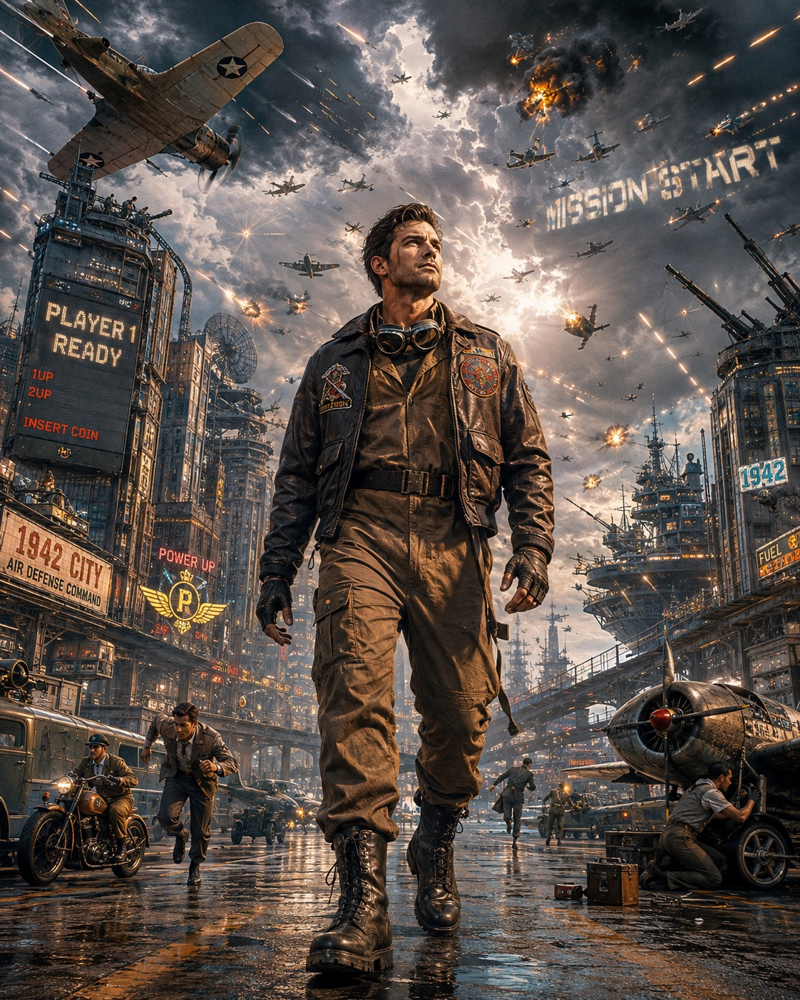

**來源：** [@Xaroon\_x](https://x.com/Xaroon_x/status/2056940561148363010)

**提示詞：**

```text
Ultra-realistic cinematic “1942 City” scene, retro WWII arcade-shooter-inspired metropolis in real life, intense aerial-war atmosphere, vertical 4:5 editorial composition

Male, exact face, vintage military-pilot-inspired streetwear from head to toe, bomber jacket with retro aviation patches, fitted cargo trousers, rugged combat boots, fingerless gloves, pilot goggles hanging around neck, walking through the city with fearless ace-pilot expression while fighter planes soar overhead

✈️ 1942 CITY WORLDBUILDING

entire city functions like a living 1942 arcade shooter universe
• massive WWII fighter planes dogfighting above skyscrapers
• giant anti-aircraft cannons mounted across rooftops
• endless bullet patterns streaking through cloudy skies
• retro military airfields integrated into urban districts
• giant “MISSION START” alerts projected into the clouds
• dramatic explosion trails lighting the skyline at night
• aircraft carriers docked beside futuristic city ports
• glowing power-up icons floating through aerial battle zones
• giant radar systems rotating above downtown towers
• endless enemy squadrons emerging from storm clouds
• cinematic ocean-and-warzone environments surrounding the metropolis

😂 COMEDIC DETAILS

• random civilians casually dodging fighter planes on the way to work 😭
• one pilot barrel-rolling dramatically for absolutely no reason
• giant billboard flashing: “PLAYER 1 READY.”
• pedestrians treating near-miss explosions like normal traffic
• somebody still trying to collect every floating power-up midair
• random mechanic repairing planes using pure confidence
• one legendary pilot surviving impossible situations through arcade logic alone

💡 LIGHTING & STYLE

retro war-film cinematic lighting, fiery aerial-battle atmosphere, dramatic clouds and explosion reflections, hyper-detailed realistic textures mixed with nostalgic arcade-shooter aesthetics, intense blockbuster-war energy, masterpiece quality

🎥 CAMERA

cinematic aerial tracking shot, immersive dogfight atmosphere, dynamic motion blur from fighter planes and explosions, documentary-meets-retro-arcade realism, futuristic Manila-inspired 1942 metropolis, “classic arcade air combat became civilization” atmosphere
```

***

<a name="case-449"></a>

### 例 449：奢華機械腕錶技術圖鑑

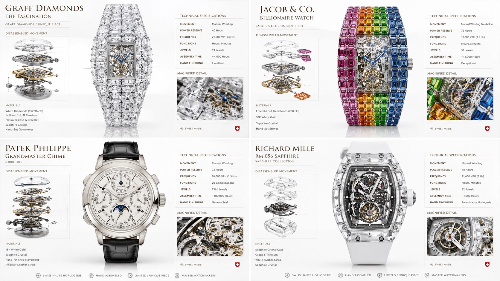

**來源：** [@Gdgtify](https://x.com/Gdgtify/status/2056928396991488312)

**提示詞：**

```text
2x2 grid 16:9, do this for 4 most expensive strangest watches ever made:

class Haute_Horlogerie_DNA:
    def __init__(self):
        self.subject = "[TIMEPIECE]"
        self.parents = {
            "composition_parent": "Exploded movement diagram with transparent case",
            "material_parent": "Brushed titanium, sapphire crystal, rose gold gears, alligator leather",
            "graphic_parent": "Swiss manufacture technical brochure with elegant data panels",
            "atmosphere_parent": "Crisp daylight studio, pure white background, subtle reflection on polished surfaces"
        }
        self.mutations = {
            "semantic_mutation": "The balance wheel reveals a miniature cosmos ticking inside",
            "information_mutation": "Power reserve indicator, frequency, complication callouts, hand-finishing grades, assembly timeline",
            "medium_mutation": "Smooth matte premium paper with embossed logo",
            "scale_mutation": "Grain-level view of Côtes de Genève finishing and jewel bearings"
        }
        self.style_mix = [0.30, 0.30, 0.25, 0.10, 0.05]

    def generate_subject(self):
        subject = """
        [TIMEPIECE] shown in its full mechanical glory. The dial, hands, movement,
        and strap float in perfect alignment against a bright, clean background.
        Every gear and spring is highlighted with exacting clarity.
        """
        return render(
            subject,
            format="luxury watch advertisement with technical insert",
            title="[MODEL REFERENCE]",
            subtitle="[MANUFACTURE / COLLECTION]",
            constraints="bright white space, metallic brilliance, hyper-detailed, modern elegance"
        )
```

***

<a name="case-450"></a>

### 例 450：燭光側室寫實攝影

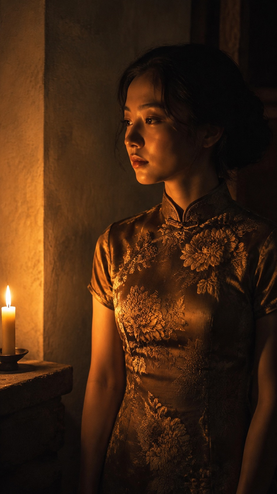

**來源：** [@ToroJushiAi](https://x.com/ToroJushiAi/status/2056926887344042382)

**提示詞：**

```text
A medium-shot authentic daily life photograph, natural candid moment, of an East Asian young woman standing in a small side room lit only by a single candle on a low stone shelf. 85mm lens, waist-up framing, shallow depth of field. The candle is off-frame to the left; the room behind her exists only as dark warm suggestion.

East Asian young woman in her early 20s. Almond-shaped eyes receiving the candle's warm flicker — the irises briefly caught in light before returning to shadow. Straight refined nose, the bridge illuminated in a narrow warm stripe. Skin tone fair beige, warmed entirely by candlelight into something amber. Skin subsurface scattering visible under directional candlelight, specular micro-highlights on cheekbones and nose ridge, fine foundation powder grain perceptible.

She wears an aged amber silk qipao with chrysanthemum embroidery in tones of old bronze and dusty ochre — the amber pigment identical in temperature to the candle's own light, the embroidery appearing and disappearing depending on angle. Mandarin collar, short sleeves. She stands facing the candle without looking at it, arms at her sides, very still. The room is otherwise empty. Two or three stray hairs displaced by faint air movement, natural unplanned imperfection, not geometrically symmetrical.

Single candle — warm amber-orange, directional and fragile. It carves the left side of her face from darkness, leaves the right in near-black shadow. The amber qipao and the candlelight share a single temperature register: the room folds her into the light. Deep chiaroscuro with no artificial fill. Subtle ISO 400 film grain in shadow areas, photographic noise texture not CG render smoothness. Aspect ratio 9:16. No watermark, no text overlay, not cartoon, not digitally painted, not illustration, not anime.
```

***

<a name="case-451"></a>

### 例 451：韓國海灘日落時尚人像

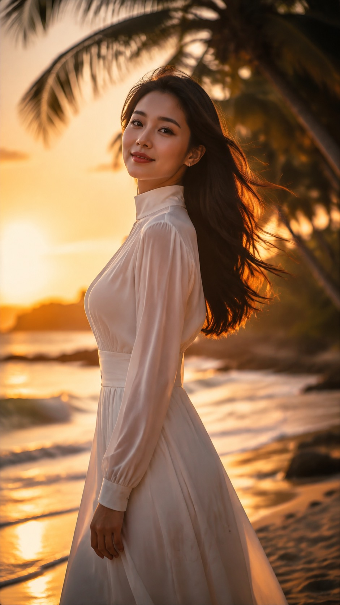

**來源：** [@MrGafish](https://x.com/MrGafish/status/2057107670226870577)

**提示詞：**

```text
一位成年韓國女孩，人物位於畫面中央，半身到大腿視角，身體微微前傾。身形比例協調，肩頸線條舒展，可以看到胸部輪廓，輪廓自然優美，腰部線條柔和，整體凸顯豐腴健康的女性美，絲滑黑髮隨風飄揚，人物氣質成熟、溫柔、安靜，面帶自然微笑。身穿白色一字肩連衣裙，背景是熱帶海灘日落，電影感DSLR攝影，溫暖輝光照明，夢幻虛化，超詳細，鮮豔色彩，豐富對比，韓國時尚美學氛圍，自然歡樂情感，高階生活方式攝影。9:16 豎版構圖。
```

***

<a name="case-452"></a>

### 例 452：極簡童話手繪兒童插畫

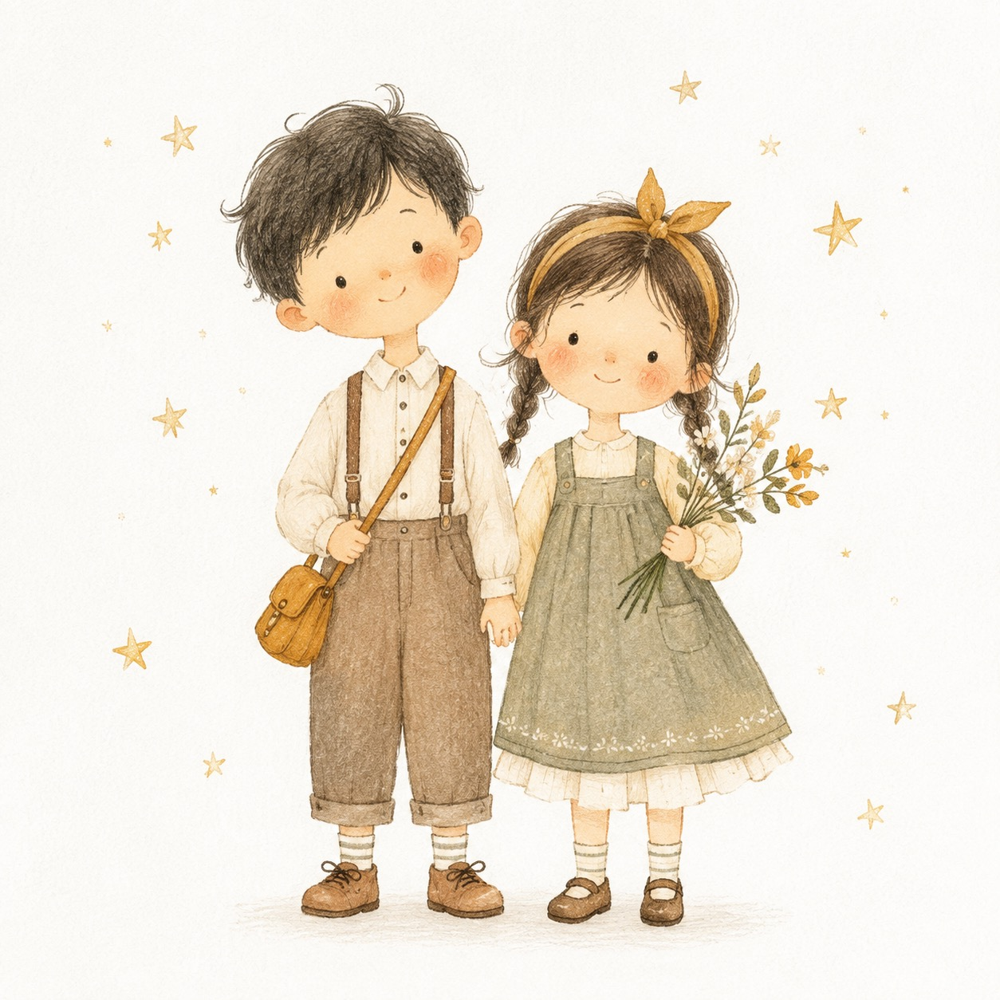

**來源：** [@MissDelulu9](https://x.com/MissDelulu9/status/2057073936295399551)

**提示詞：**

```text
Transform the photo into a delicate minimalist hand-drawn children’s illustration with a soft whimsical fairy-tale aesthetic. Use simple elongated shapes, thin imperfect hand-drawn lines, flat pastel colors, minimal details, and a cute doll-like character style with rosy cheeks, tiny facial features, and simplified anatomy. Add subtle paper texture, soft pencil and pastel shading, watercolor softness, and a clean white background with small stars or sparkles.

Stylize the clothing in a playful storybook way with simplified shapes and gentle decorative details. The overall mood should feel airy, cozy, naive, and charming, like a modern Scandinavian nursery postcard or children’s book illustration. Avoid photorealism, 3D, cinematic lighting, glossy surfaces, complex shadows, realistic anatomy, and hyper-detail.
```

***

<a name="case-453"></a>

### 例 453：企業級商用畫冊視覺系統

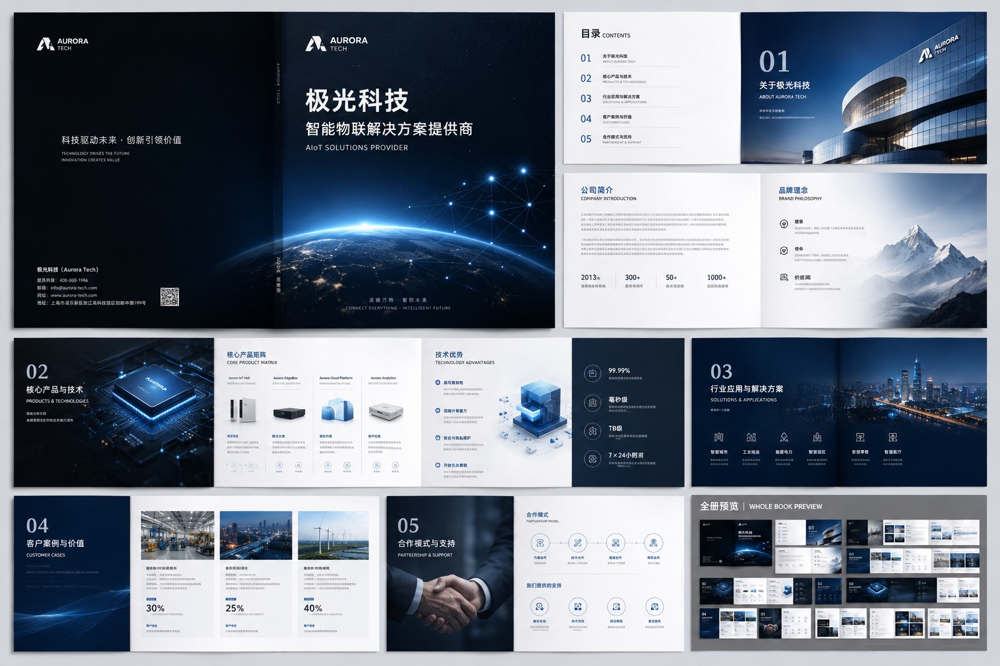

**來源：** [@MrLarus](https://x.com/MrLarus/status/2056974720893939950)

**提示詞：**

```text
請生成一套企業級商用畫冊視覺方案，主題為【品牌名稱】的【行業 / 產品 / 解決方案】宣傳畫冊。

整體風格：高階、專業、具有強視覺衝擊力；避免傳統 Word 排版感和普通 PPT 感。採用【深色科技美學 / 白色極簡商務 / 高階工業風 / 藝術化品牌畫冊】風格。

畫冊內容包括：
1、封面與封底
2、企業介紹與品牌理念
3、核心產品與技術優勢
4、應用場景與解決方案
5、客戶案例與合作方式
6、全冊系統預覽圖

要求：
版式要有設計感，圖片、標題、資料、圖示、留白和層級關係清晰；保持整套畫冊統一的品牌視覺系統；重點體現真實商業物料的完成度，避免簡單文字排版。

結構規劃：
1、封面 / 封底：建立品牌門面、行業氣質和整體視覺調性。
2、企業介紹頁：說明公司定位、能力邊界和服務物件。
3、產品技術頁：展示核心產品、技術優勢和解決方案。
4、應用場景頁：讓使用者看到產品能用在哪些行業。
5、案例 / 合作頁：補充可信度和商業轉化資訊。
6、全冊系統預覽：驗證風格統一性和整本畫冊的系統感。

如果已有企業資料，可以上傳舊版企業畫冊、公司介紹檔案、產品說明書、官網內容、PPT 提案、產品圖片或案例圖片，讓 ChatGPT 完成三件事：
1、重新梳理內容結構，判斷哪些內容適合做封面、企業介紹、產品頁、案例頁和合作頁。
2、提煉畫冊主線，避免只堆資料，需要形成清晰的商業敘事。
3、統一視覺方向，讓整本畫冊看起來像同一個品牌系統，避免不同頁面拼貼感。

避坑：
1、避免一上來只說“生成一本畫冊”，否則容易變成範本圖。
2、避免只堆文字，畫冊一定要有產品視覺、場景圖、資料模組和設計層級。
3、避免只生成單頁，最好補一張全冊預覽圖，才能體現完整系統感。
```

***

<a name="case-454"></a>

### 例 454：旅行美食薯片廣告海報

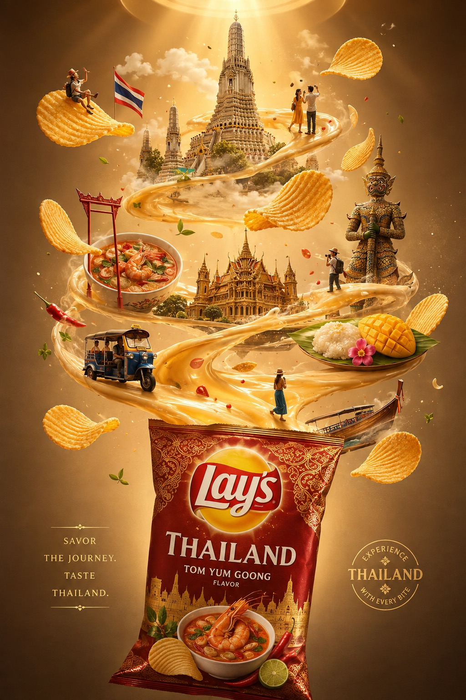

**來源：** [@Naiknelofar788](https://x.com/Naiknelofar788/status/2057282710469767241)

**提示詞：**

```text
Ultra-detailed premium travel-food advertisement poster for [CITY/COUNTRY], vertical composition, inspired by luxury Lay’s-style chips advertising. A realistic chips packet placed at the bottom center as the main hero object, matching the exact premium commercial layout of a floating chips campaign.

A cinematic spiral ribbon of sauce, cream, clouds, steam, or flavored swirl rises upward from the chips packet, dynamically wrapping around iconic landmarks, local foods, and cultural elements from [CITY/COUNTRY].

Floating ridged potato chips suspended naturally throughout the spiral motion, interacting with the landmarks and miniature travelers. The chips packet design must feel authentic to [CITY/COUNTRY], featuring regional colors, typography, patterns, and local flavor inspiration while still clearly looking like a premium potato chips package.

Include only the most iconic landmarks from [CITY/COUNTRY], carefully spaced with clean composition and no clutter. Add miniature travelers naturally interacting with the environment:
- taking photos
- exploring landmarks
- sitting on floating chips
- riding local transport
- observing scenery
- walking through the swirl paths

Include authentic local foods, ingredients, and atmosphere elements relevant to [CITY/COUNTRY].

Background should be soft pastel or warm luxury gradient with a circular ceiling portal opening at the top emitting cinematic spotlight beams.

Elegant premium commercial lighting, soft shadows, floating particles, realistic depth, balanced negative space, luxury tourism campaign aesthetic, hyper-realistic CGI, highly detailed but minimalist, Instagram-worthy poster design.

Composition rules:
- one dominant centered chips packet
- floating ridged potato chips throughout composition
- one continuous upward spiral motion
- landmarks layered vertically
- miniature people sparse and intentional
- no duplicate landmarks
- no overcrowding
- clean premium hierarchy
- cinematic storytelling through scale contrast
- premium advertising composition matching high-end chips commercials
```

***

<a name="case-455"></a>

### 例 455：巨型舒適洞洞鞋 Campaign

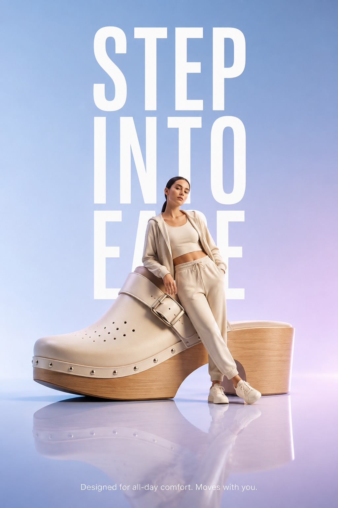

**來源：** [@iamaiistudio](https://x.com/iamaiistudio/status/2057281549851377866)

**提示詞：**

```text
Hyper-realistic premium product advertisement: an oversized futuristic comfort clog sits on a smooth glossy reflective floor. A modern model in soft neutral-toned athleisure (off-white / beige) leans casually against the giant shoe with a relaxed, confident posture.

Backdrop: clean gradient flowing from soft sky blue into subtle lavender, with massive bold sans-serif typography reading "STEP INTO EASE" stretched vertically, partially tucked behind the subject.

Lighting: high-end studio lighting, soft highlights, gentle floor reflections, and a subtle rim light tracing the model and the product for depth.

Composition: editorial magazine layout, subject perfectly centered, generous negative space, luxury campaign mood.

Small minimal copy at the bottom: "Designed for all-day comfort. Made to move with you."

Style: ultra-clean Apple-style minimalism crossed with a fashion campaign, hyper-realistic, premium commercial photography, 8K, razor-sharp detail.
```

***

<a name="case-456"></a>

### 例 456：歷史事件 2x2 視覺化地圖

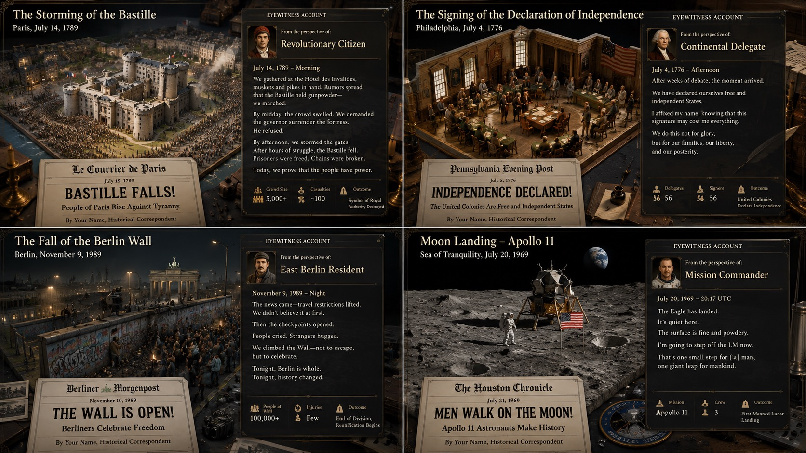

**來源：** [@Gdgtify](https://x.com/Gdgtify/status/2057277698607599692)

**提示詞：**

```text
2x2 grid, 16:9, do this for 4 famous historical events:

Render_Target =
  ( 3D_Diorama_Map_Of_[HISTORICAL_EVENT]_In_[CITY] * 1.2 )
  + ( First-Person_Account_Infographic_UI_From_The_Perspective_Of_[ROLE] * 1.5 )
  + ( Period-Accurate_Studio_Background_With_[ERA]_Artifacts * 1.0 )
  + ( Newspaper_Headline_Generator_Widget_With_Your_Byline * 0.8 )
  - ( Generic_Time_Machine_Gears_And_Clock_Dials / 3.0 )
  - ( Anachronistic_Props_From_Wrong_Decade / 2.5 )
  - ( Flat_Wikipedia_Timeline_Graphic / 2.0 )
```

***

<a name="case-457"></a>

### 例 457：運動軌跡舞者光繪海報

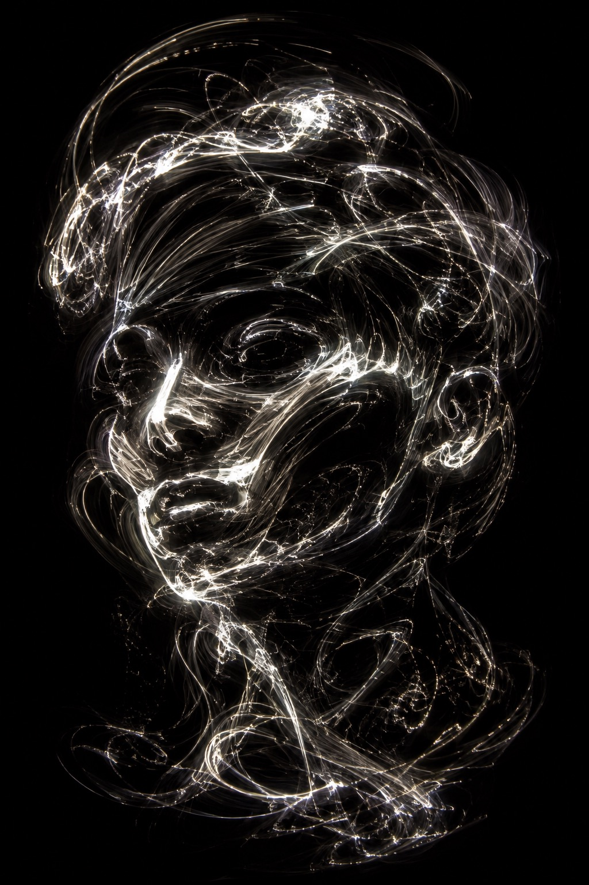

**來源：** [@Gdgtify](https://x.com/Gdgtify/status/2057741253127594118)

**提示詞：**

```text
<instructions>
input = 3 legendary dancer/choreographer
input = ai inferred signature movement sequence

function render_kinesphere ($ dancer, $ movement)
  anchor:
    [figure composed entirely of motion trails] :: [the $ movement sequence traced as continuous luminous bands that coalesce into a portrait of $ dancer]::5

  morphology:
    the arabesque trails weave the skull, a grand jeté arc forms the cheekbone, the arms' sweep creates the jaw, stillness is implied by negative spaces::4

  material physics:
    blackened silver gelatin print, faint chemical residue, slight motion blur, glowing filament traces like a Marey wheel photograph::3

  illumination:
    complete darkness with bioluminescent-like light trails, no external light sources, high contrast::2

  render stack:
    chronophotography, fine art dance study, 8k, kinetic sculpture concept::1

  negative:
    [still body parts, studio lights, solid silhouettes]::-1
</instructions>
```

***

<a name="case-458"></a>

### 例 458：巴黎秋季時裝插畫

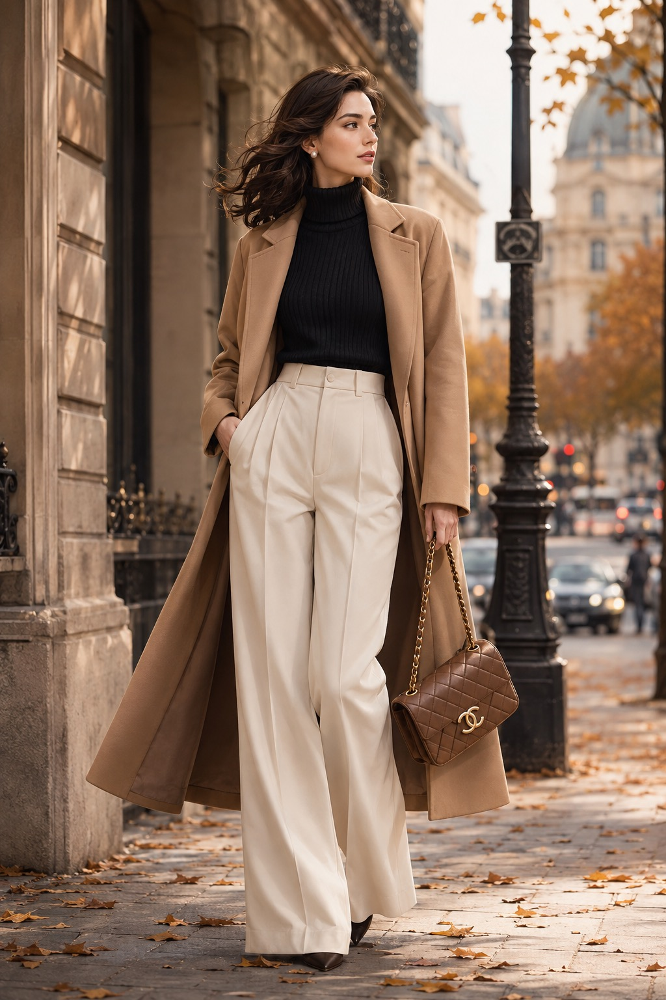

**來源：** [@heyfatema](https://x.com/heyfatema/status/2057745100365787170)

**提示詞：**

```text
Full-body fashion illustration of a young woman walking down a Parisian street in autumn, wearing a long camel wool coat draped open over a black ribbed turtleneck sweater and high-waisted wide-leg cream trousers, holding a quilted tan leather shoulder bag with interlocking CC logo and chain strap in her left hand while her right hand slides into a pocket, short dark brown wavy hair gently lifted by a breeze, pearl stud earrings, natural fresh makeup and a confident serene expression; cinematic shallow depth of field with soft warm golden-hour light, subtle bokeh on Haussmann-style buildings and slow-moving cars in the blurred background, scattered fallen leaves on the pavement; semi-realistic digital painting / fashion illustration style with clean linework, soft gradients, high-detail fabric textures and realistic folds, emphasis on elegant silhouettes and tactile materials, muted autumn palette (camel, cream, black, warm ochre), vertical composition, crisp foreground, gentle film grain and polished finishing.
```

***

<a name="case-459"></a>

### 例 459：品牌奶茶 KV 概念海報

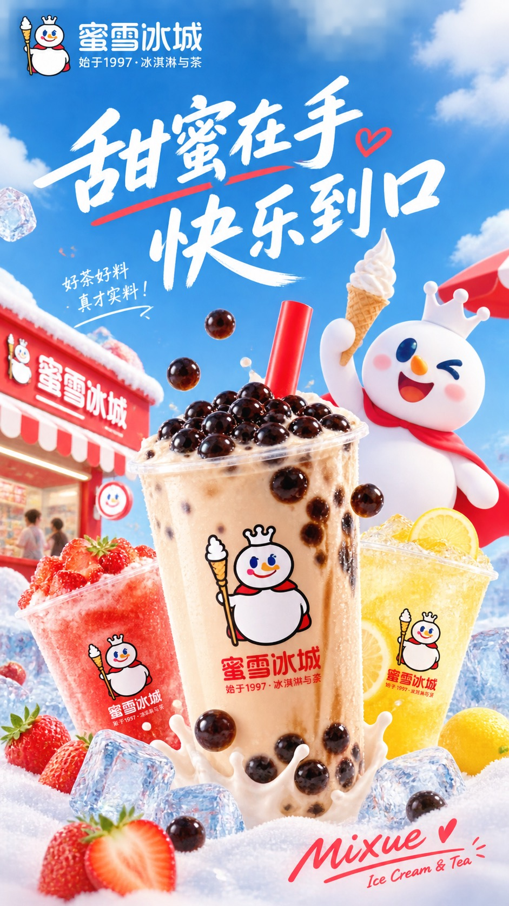

**來源：** [@liyue_ai](https://x.com/liyue_ai/status/2057739678485495885) / [提示词回复](https://x.com/liyue_ai/status/2057739894261518670)

**提示詞：**

```text
你是一個品牌視覺識別系統、商業廣告創意總監、KV海報設計師和高傳播品牌視覺生成系統。

請根據使用者輸入的【現有品牌名稱】，自動識別該品牌最具代表性的品牌Logo形象、品牌名稱文字識別特徵、主推產品、產品包裝、品牌色彩、視覺調性、目標人群和廣告傳播風格，並生成一張符合該品牌氣質的概念 KV 海報。

創作定位：
- 基於真實品牌認知進行二次創作的品牌概念 KV 海報
- Brand-inspired Concept Key Visual
- 用於個人學習、視覺練習與社交平台展示

不需要絕對嚴苛的一比一官方復刻，但必須做到：

品牌識別度高；
品牌Logo風格明顯；
品牌代表產品明顯；
品牌調性準確；
整體像該品牌會出現的視覺廣告。

────────────────
一、使用者輸入
────────────────

品牌名稱：{品牌名稱}

主推產品：{可選，不填則自動識別該品牌最具代表性的產品}
廣告語：{可選，不填則根據品牌調性自動生成原創廣告語}
目標人群：{可選，不填則自動判斷}
畫幅比例：{9:16 / 16:9 / 4:5 / 1:1 / 2.35:1}
KV型別：{產品英雄KV / 品牌情緒KV / 強口號傳播KV / 人物場景KV / 超現實概念KV / 自動選擇}
平台用途：{小红书 / X / 公眾帳號封面 / 視覺練習 / 概念提案}

────────────────
二、自動識別邏輯
────────────────

請根據品牌名稱自動完成以下識別，不需要在畫面中展示分析過程：

1. 自動識別該品牌所屬行業
例如：
科技、運動、美妝、奢侈品、汽車、飲品、咖啡、服飾、潮流、護膚、珠寶、生活方式、數位、家居等。

2. 自動識別該品牌最具代表性的視覺資產
包括：
品牌Logo形象
品牌名稱文字風格
主色調與輔助色
最具代表性的產品
包裝外觀特徵
品牌常見廣告風格
品牌場景氣質
品牌材質感與光影方式

3. 自動識別該品牌的目標人群
例如：
年輕潮流人群、都市白領、精緻女性、運動人群、科技使用者、高階消費人群、Z世代、商務人群等。

4. 自動識別該品牌的廣告語氣質
例如：
極簡高階、年輕活力、熱血衝擊、奢華克制、溫柔浪漫、科技理性、時尚先鋒、生活方式化等。

────────────────
三、Logo與產品識別規則
────────────────

本次任務允許 AI 根據品牌名稱自動識別品牌視覺資產，不需要使用者必須上傳 Logo 或產品圖。

請遵守以下原則：

1. 品牌Logo
- 畫面中需要有明顯的品牌標識
- Logo 或品牌名稱文字要具有較高識別度
- 不必追求百分之百精確復刻，但必須讓人一眼聯想到該品牌
- 不要生成完全陌生、無關、錯誤感很強的標識
- 不要讓品牌名稱出現明顯錯字、亂碼或胡亂變形

2. 品牌產品
- 自動選擇該品牌最具代表性的主推產品或經典產品作為主視覺
- 產品外觀、包裝、色彩和氣質應接近大眾對該品牌的常見認知
- 不需要絕對嚴格到工業級復刻
- 但要保證“像這個品牌的真實代表產品”，避免完全陌生的產品

3. 品牌包裝與材質
- 自動識別該品牌常見包裝與材質語言
- 如金屬、玻璃、磨砂、塑膠、皮革、紙盒、極簡包裝、奢華包裝、運動感材質等
- 產品必須具有真實商業視覺質感

────────────────
四、KV創意方向
────────────────

請根據品牌屬性自動選擇最合適的 KV 創意方式。

如果是科技品牌：
使用極簡、未來感、真實產品質感、冷靜留白、克制光影、乾淨空間。

如果是運動品牌：
使用速度感、力量感、身體動勢、汗水、衝刺、突破、強烈口號感。

如果是美妝品牌：
使用柔光、精緻產品、肌膚質感、女性氣質、色彩情緒、時尚大片感。

如果是奢侈品牌：
使用高階材質、留白、低飽和色調、秩序構圖、稀缺感、時尚大片感。

如果是飲品品牌：
使用冰爽、液體、氣泡、年輕感、快樂氛圍、色彩衝擊、清爽材質。

如果是咖啡品牌：
使用溫度、城市生活、鬆弛氛圍、綠色或木質感、晨間陪伴感。

如果是汽車品牌：
使用道路、速度、未來空間、金屬質感、城市夜景、駕駛慾望。

如果是潮流品牌：
使用街頭、反叛、年輕、圖形感、視覺衝擊和社交傳播感。

────────────────
五、廣告語規則
────────────────

如果使用者沒有輸入廣告語，請根據品牌調性自動生成一句原創廣告語。

要求：

- 廣告語不能太長
- 要有品牌感和傳播感
- 不使用官方原廣告語
- 不需要像正式企業公告
- 更像概念廣告的主標語

中文廣告語建議：
4到12個字

英文廣告語建議：
2到6個單詞

廣告語風格要與品牌匹配，例如：

科技品牌：
更少干擾，更近未來

運動品牌：
把極限踩在腳下

美妝品牌：
光澤，自成主張

奢侈品牌：
優雅，從不喧譁

飲品品牌：
這一口，剛好上頭

咖啡品牌：
喚醒城市的溫度

汽車品牌：
駛向更遠的秩序

────────────────
六、畫面結構要求
────────────────

整張圖必須具備真實品牌 KV 的基本結構：

1. 品牌標識區
品牌Logo或品牌名稱需要清晰可見，位置合理。

2. 產品主視覺區
品牌代表產品必須明顯，是畫面核心之一。

3. 廣告語區
廣告語清晰可讀，具備傳播記憶點。

4. 品牌氛圍區
背景、光影、材質、空間和色彩必須符合品牌調性。

5. 資訊層級區
畫面層級建議為：
品牌標識
產品主體
廣告語
少量輔助文字

文字不要太多，不要做成密密麻麻的海報。

────────────────
七、風格要求
────────────────

整體視覺必須具備：

高識別度品牌感
高階商業廣告質感
清晰品牌標識
明顯品牌產品
強主視覺
強廣告語
乾淨排版
適合社交平台傳播
適合小红书和X展示
具有“像某知名品牌概念廣告”的完成度

允許適度創意發揮，但品牌核心識別不能丟失。

────────────────
八、畫幅適配
────────────────

如果是 9:16：
適合豎版社交海報，產品更聚焦，廣告語放中上區域，適合手機瀏覽。

如果是 16:9：
適合橫版品牌KV、封面、頭圖，產品與廣告語形成左右平衡。

如果是 4:5：
適合社交平台資訊流，主體更近，品牌識別更集中。

如果是 2.35:1：
適合公眾帳號封面或寬幅視覺，適合大字廣告語和強衝擊橫版構圖。

如果是 1:1：
適合方形封面與品牌視覺展示。

────────────────
九、負面限制
────────────────

不要生成明顯錯誤的品牌名稱。
不要生成過於離譜的Logo變形。
不要生成與品牌無關的產品。
不要生成廉價拼貼感。
不要生成過多小字。
不要生成雜亂無章的背景。
不要生成山寨感很強的畫面。
不要生成像促銷海報一樣的低階電商視覺。
不要出現QR Code、購買連結、價格標籤、活動說明。
不要讓整體畫面失去品牌調性。

────────────────
十、最終目標
────────────────

請生成一張基於真實品牌認知自動識別完成的品牌概念 KV 海報。

要求：
無需使用者上傳 Logo 和產品素材；
由AI自動識別該品牌最具代表性的Logo形象與代表產品；
不要求絕對嚴格復刻；
但必須保持高識別度、高品牌感、高完成度；
整體像一張高階品牌概念廣告海報；
適合個人學習、視覺練習和社交平台展示。

————
品牌名稱：{蜜雪冰城}
主推產品：{奶茶}
廣告語：{可選，如果使用者不輸入，則根據品牌調性自動生成一句高傳播感廣告語}
目標人群：{年輕潮流人群}
畫幅比例：{9:16}
KV型別：{產品英雄KV}
平台用途：{小红书}
```

***

<a name="case-460"></a>

### 例 460：棋盤低角度奢華男裝 Campaign

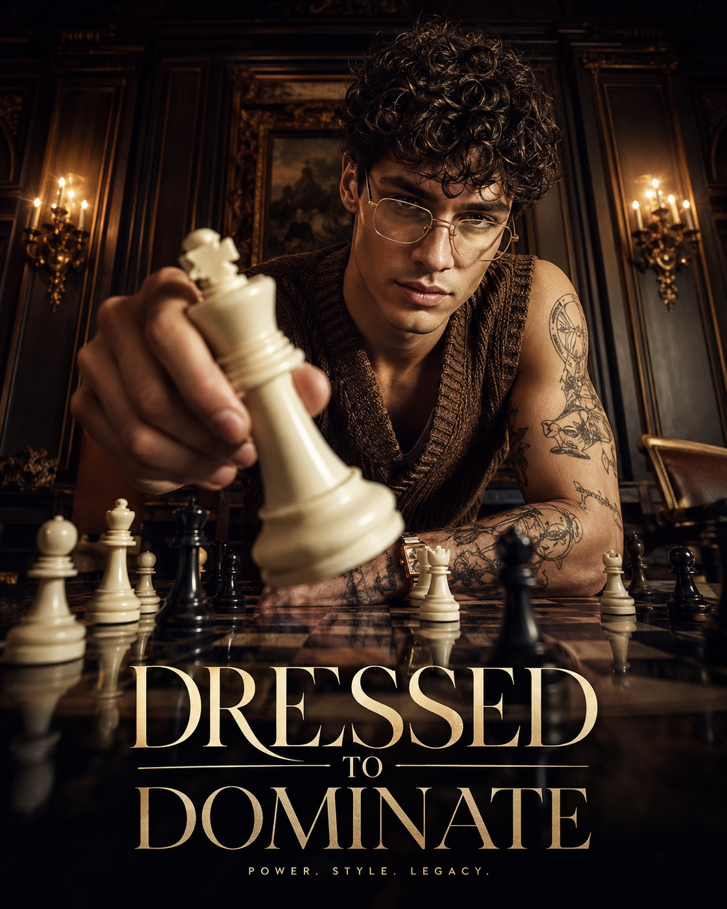

**來源：** [@harboriis](https://x.com/harboriis/status/2058414859658956888)

**提示詞：**

```text
Ultra-realistic luxury fashion campaign poster shot from a dramatic low-angle perspective across a glossy chessboard table. A stylish young male model with sharp facial features, textured curly hair, wearing thin luxury glasses and a fitted sleeveless knitted brown vest, leaning forward in a confident pose. One hand extended toward the camera holding a large white king chess piece in forced perspective, dominating the foreground. Tattooed arms visible, intense confident facial expression, direct eye contact. Elegant vintage royal interior background with dark paneled walls, warm chandelier wall lights, cinematic amber lighting, moody shadows, luxury editorial atmosphere. Chess pieces scattered on the board in foreground and background for depth. High contrast premium fashion advertising style, ultra-detailed skin texture, sharp focus on face and chess piece, shallow depth of field, glossy reflections on chessboard, dramatic commercial campaign photography, luxury menswear brand aesthetic. Bold typography at bottom saying “DRESSED TO DOMINATE”, premium poster layout, cinematic color grading, high-end fashion ad, editorial magazine quality, 4:5 aspect ratio.
```

***

<a name="case-461"></a>

### 例 461：家庭旅行紙雕拼貼

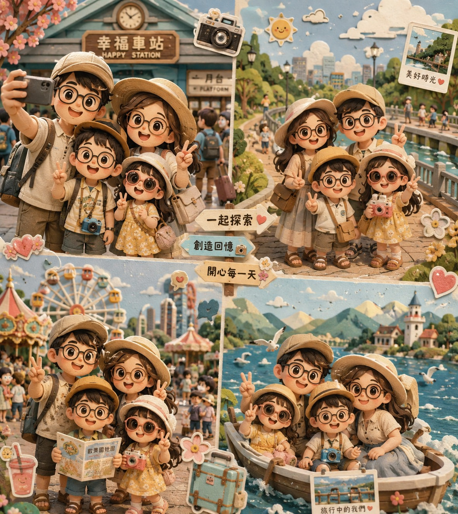

**來源：** [@Taaruk_](https://x.com/Taaruk_/status/2058400056722731079)

**提示詞：**

```text
Adorable kawaii family travel collage, combining four different scenes in one composition, cute anime-inspired parents, friends and children taking selfies and exploring together, handcrafted paper-cut diorama style, layered cardboard and felt textures, miniature world aesthetic, cozy pastel color palette, soft cinematic lighting, playful vacation atmosphere, urban city station scene, shopping mall selfie corner, outdoor nature park, and crowded playground blended into one seamless scrapbook-style artwork, charming sticker-like white outlines around characters, tiny tourists and pedestrians in background, whimsical handcrafted textures, soft depth of field, highly detailed paper craft illustration, warm nostalgic mood, cute casual outfits with glasses, caps, bags and sandals, dreamy Instagram kawaii aesthetic, storybook composition, ultra detailed miniature environment, 3D layered paper art, tilt-shift effect, cozy wholesome family travel vibes, premium handcrafted look, high detail, 8k, vertical composition
```

***

<a name="case-462"></a>

### 例 462：復古日系迷你橡皮商品包裝

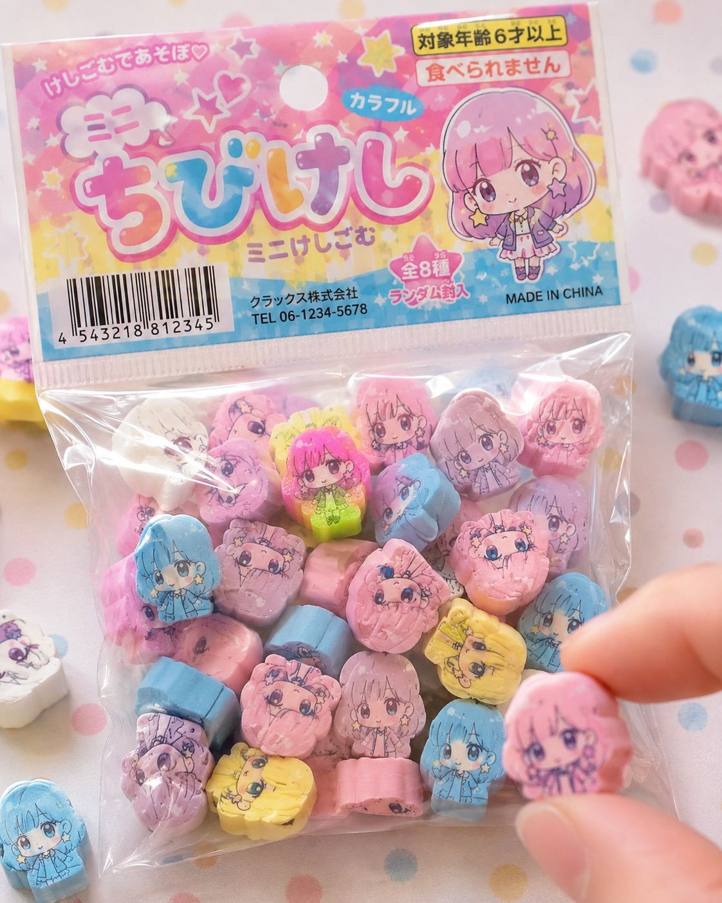

**來源：** [@ZetoGroovin](https://x.com/ZetoGroovin/status/2058408514247410003)

**提示詞：**

```text
添付されたキャラクターシートをSTRICTなデザインリファレンスとして使用すること。 キャラクターの顔、髪型、目の形、プロポーションは絶対に変更しない。

■目的： キャラクターを日本の「ちび消しゴム商品」として完全に商品化し、 実際に文房具売り場やガチャで販売されているようなリアルなパッケージ商品寫真を作成する。

■コンセプト： 「100円ショップや文房具店で売られている袋入りちび消しゴム商品」

■消しゴム本體： （※前回と同じ仕様を完全維持） - 強いデフォルメちびキャラ - 厚みのあるブロック形狀 - 完全マットなラバー素材 - 微細な粒子・粉・削れ・摩耗あり - 印刷ズレ・色ブレあり - 50個以上のランダム構成

■パッケージ（超重要）： - 小さな透明ビニール袋（OPP袋） - 上部に紙ヘッダー（吊り下げ用の穴あり） - ヘッダーはややチープな印刷（軽いズレ・インクのムラ） - ビニールはシワあり、やや曇り、靜電気で中身に張り付く - 一部空気が入ってふくらみあり - シール部分に軽いヨレ

■グラフィックデザイン： - 日本の子供向け文房具風デザイン - ポップでカラフル（ピンク・黃色・水色ベース） - 手書き風フォントや丸文字 - 商品名ロゴ（オリジナルでOK） - 「ミニけし」「ちびけし」などの表記 - 星・ハート・キラキラ裝飾

■情報要素（リアル感強化）： - JANコード（バーコード） - 「対象年齢6才以上」 - 「食べられません」注意書き - 「全◯種」や「ランダム封入」 - 小さな會社名（架空） - MADE IN JAPAN or CHINA表記

■構図： - パッケージがメインで畫面中央 - 周囲に少しだけこぼれた消しゴム - 1〜2個は袋から出ている - 指先が1つをつまもうとしている演出 - 一部フレームアウトで自然さ

■レア要素： - 蛍光カラーやグラデーションの特別個體を1つ混ぜる - 視線誘導として目立つ位置に配置

■ライティング： - 明るい自然光（ややハイキー） - 柔らかい影 - 商品寫真のような清潔感

■カメラ： - マクロ寄り - 淺い被寫界深度 - 中央シャープ

■背景： - 白〜パステルのテーブル - ほんのりドットやポップ柄 - シンプルで清潔

■禁止： - プラスチック感 - glossy表現 - 高階すぎる質感（安っぽさが正解） - 完璧すぎる印刷

■出力： - 実在する商品にしか見えないレベル - コンビニや100均にありそうなリアリティ - SNSで「これ欲しい」と思わせる完成度
```

***

<a name="case-463"></a>

### 例 463：黑色吊帶襪單款圖鑑展示

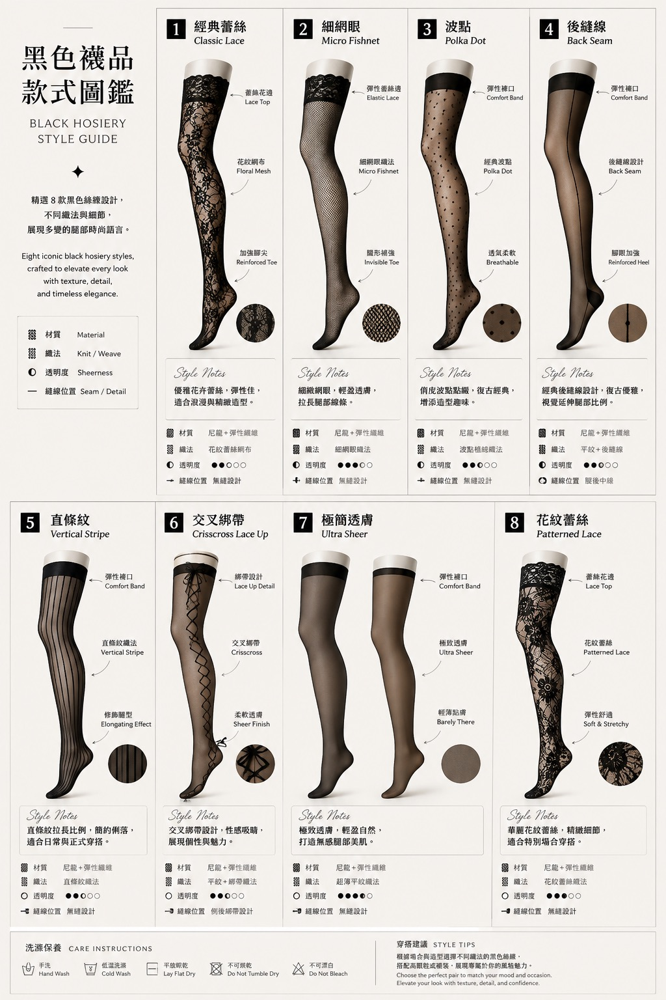

**來源：** [@MrLarus](https://x.com/MrLarus/status/2058175014168396245) / [提示词回复](https://x.com/MrLarus/status/2058175145328394441)

**提示詞：**

```text
《黑色絲襪圖鑑款式單圖》提示詞：

請基於同一套「黑色絲襪 / 吊帶襪圖鑑」系列風格，繼續生成 8 張對應單款的獨立展示圖。

【系列要求】
- 這些圖片必須和已完成的總覽圖鑑屬於同一個系列
- 整體版式、字型、色調、背景、質感、排版邏輯保持一致
- 都是豎版、高完成度、暖白 / 淺灰白背景、輕奢女性向時尚圖鑑風格
- 每一張都像同一個品牌或同一套視覺系統下的延展頁面

【每張單圖的共同結構】
1. 頂部標題區
- 英文系列標題：BLACK GARTER GUIDE
- 中文主標題：黑色絲襪 / 吊帶襪單款展示
- 目前款式名稱：__________
- 一句簡短副標題：突出該款式的核心特點

2. 中部主體區
- 以 1 位成人女性模特穿戴展示為主
- 重點展示對應款式的關鍵細節：
  - 經典蕾絲款：襪口蕾絲、優雅氛圍
  - 細網眼款：網格紋理、輕盈通透
  - 波點款：波點圖案、復古俏皮
  - 後縫線款：背後縫線、線條感
  - 豎條紋款：縱向條紋、修飾腿型
  - 交叉綁帶款：綁帶結構、設計感
  - 極簡透膚款：透明感、基礎百搭
  - 花紋蕾絲款：花紋裝飾、浪漫氛圍
- 每張圖的人物長相、髮型、姿勢、鏡頭角度要不同，但都要保持高階、真實、性感、寫實
- 允許使用站姿、坐姿、交叉腿、倚靠、回眸等不同姿勢
- 畫面要有立體感、陰影層次和高階編輯感

3. 註釋區
- 每張圖都要保留 3 到 5 條手繪式標註
- 可以使用箭頭、短線、圈注、手寫風標籤
- 標註內容要圍繞該款式最關鍵的細節，比如：
  - 襪口結構
  - 花紋紋理
  - 透明度
  - 縫線位置
  - 綁帶方式
  - 腿部線條效果
- 標註文字簡潔、清楚、統一風格

4. 底部資訊區
- 加入簡短的 “Style Notes / 風格速記”
- 用 1 到 2 句說明該款適合的場景和氛圍
- 保持簡潔，不要搶主體

【統一視覺要求】
- 保持和總覽圖鑑完全統一的整體視覺系統
- 背景統一為暖白、淺灰白或奶白
- 風格統一為高階、乾淨、時尚圖鑑感、輕奢女性視覺
- 模特必須真實、立體、寫實、自然膚質
- 每張圖都要突出產品，不要低俗，不要過度情色化
- 每張圖都應像同一系列裡的不同章節，避免呈現為彼此割裂的作品

【款式列表】
1. 經典蕾絲款 / Classic Lace
2. 細網眼款 / Fine Fishnet
3. 波點款 / Dot Sheer
4. 後縫線款 / Back Seam
5. 豎條紋款 / Stripe Sheer
6. 交叉綁帶款 / Cross Strap
7. 極簡透膚款 / Minimal Sheer
8. 花紋蕾絲襪 / Floral Lace

【輸出目標】
按以上 8 個款式，分別生成 8 張獨立展示圖。
要求每張都保留統一系列感，同時人物造型、髮型、姿勢和鏡頭語言明顯不同，確保整套看起來完整、專業、可收藏。
```

***

<a name="case-464"></a>

### 例 464：高雄水彩拼貼旅行海報

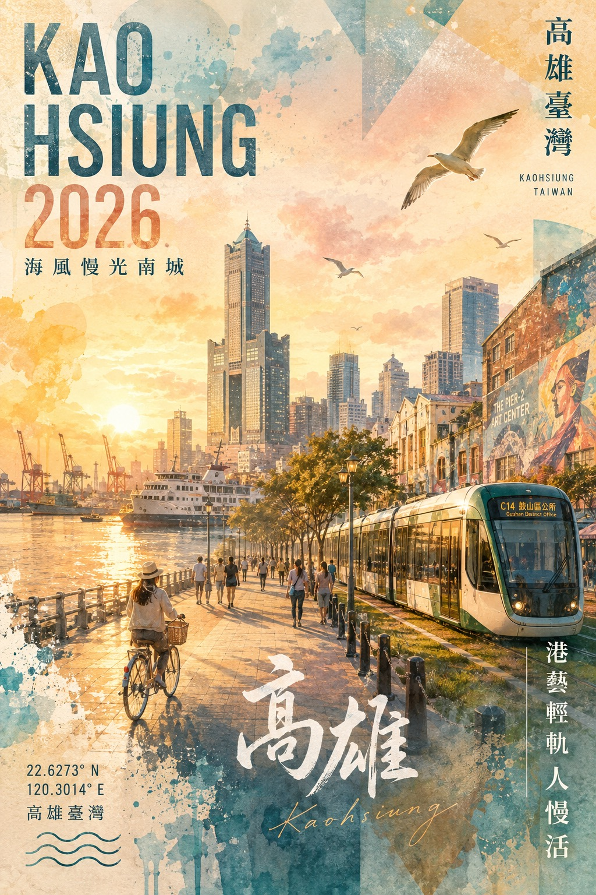

**來源：** [@SimplyAnnisa](https://x.com/SimplyAnnisa/status/2058372965641662876)

**提示詞：**

```text
Watercolor and collage travel poster for Kaohsiung, Taiwan, vertical layout, soft pastel and warm golden hour color palette.

Scene: Waterfront promenade at sunset with a modern light rail tram on the right, a person walking a bicycle on the left, and people strolling along the path. In the background: Kaohsiung skyline with the 85 Sky Tower and other skyscrapers, a harbor with a ferry boat, port cranes, and the Pier-2 Art Center building with murals. Seagulls flying in the sky, trees lining the walkway, calm water reflecting the light.

Design elements:
- Large text top left: 'KAO HSIUNG 2026', smaller text below 'Sea Breeze Slow Light Southern City'
- Top right: Vertical Chinese characters, 'KAOHSIUNG TAIWAN' in small caps below
- Bottom left: Coordinates '22.6273° N 120.3014° E', 'KAOHSIUNG TAIWAN', wave icon
- Bottom center: Handwritten script 'Kaohsiung'
- Bottom right: Vertical list 'Harbor Art Light Rail People Slow Life', vertical Chinese text
- Overlay effects: Semi-transparent geometric shapes, watercolor splashes, and texture layers in teal and beige

Style: Modern travel poster meets watercolor painting, airy and atmospheric, blend of illustration and photo-collage, warm and tranquil mood, high detail.
```

***

<a name="case-465"></a>

### 例 465：逆光美背女性情緒寫真

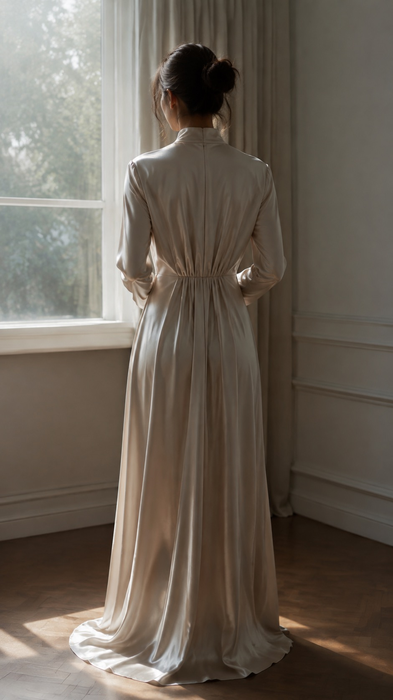

**來源：** [@MrLarus](https://x.com/MrLarus/status/2058131948904599860) / [提示词回复](https://x.com/MrLarus/status/2058132915150639425)

**提示詞：**

```text
逆光美背女性情緒寫真提示詞：

請生成一張豎版高質感女性情緒寫真，主題為「逆光美背·女性情緒寫真」。

核心要求：
畫面的絕對重點是“美背”，透過露背結構、肩頸線條、肩胛骨、脊柱中線、腰背曲線和逆光輪廓來呈現女性美。請避免普通女性寫真或普通穿搭圖的處理方式，背部必須是主視覺核心，臉只作為輔助。

人物設定：
成年女性，真實自然，氣質可為溫柔、清冷、慵懶、文藝、輕熟或安靜。人物不要網紅臉，不要塑膠感，不要誇張妝容。可側臉、回眸、低頭或閉眼，但正臉不是重點。

姿態要求：
姿態必須服務於背部展示，例如背對鏡頭微微回頭、側身站立、側坐、抬手整理頭髮、低頭蜷身、斜倚窗邊、半躺回眸、披衣下滑等。動作自然，不要僵硬擺拍，不要正面直視鏡頭。

露背結構：
必須有明確的露背設計，可為低背長裙、吊帶裙、露背禮服、針織外套滑落、薄紗披肩、浴袍半披、寬鬆襯衫滑肩、絲質罩衫半落等。重點表現肩線、肩胛骨、背中線、腰背收束和布料與肌膚之間的高階過渡。

服裝與材質：
服裝選擇輕柔、垂墜、帶有透光感和褶皺感的材質，如薄紗、真絲、針織、棉麻、細閃紗、浴袍質地、軟垂感長裙。布料要參與構圖，形成半遮半露、滑落、包裹、垂掛的層次，但不能厚重。

場景：
場景為臥室、窗邊、床上、白牆房間、民宿、酒店房間、木質空間或復古公寓。背景簡潔克制，少量床品、窗簾、木椅、花束、地板等元素即可，不能喧賓奪主。

光線要求：
採用自然光或柔和暖光，以逆光、側逆光、窗邊光為主。重點是讓光打到背部，勾出肩頸邊緣、肩胛骨輪廓、腰線和髮絲高光。可使用晨光、黃昏金光、柔霧散射光或冷白窗光，但背部受光狀態必須成立。

構圖：
豎版構圖，畫幅可為 9:16、3:4 或 4:5。人物是絕對主角，視覺重心放在背部、肩頸和腰背曲線上。可採用半身、七分身、近景或全身，但不要讓場景搶走主體。

氛圍：
整體氛圍安靜、柔軟、私密、克制、高階，像真實攝影師拍攝的電影感情緒寫真。重點避免直白性感，改用“美背 + 逆光 + 柔軟布料 + 自然姿態”表達女性美。

畫質要求：
真實攝影感、電影感、柔霧膠片感、細膩膚色、真實皮膚質感、淺景深、輕微顆粒感、畫面通透自然。不要 AI 塑膠感，不要 CG 感，不要錯誤手指，不要肢體畸形，不要低俗色情化表達，不要文字、水印、Logo、邊框。

最終效果：
一張以“美背”為主視覺核心的高完成度女性情緒寫真，透過露背結構、肩頸背部線條、柔光逆光和柔軟布料來呈現克制而高階的女性美。
```

***

<a name="case-466"></a>

### 例 466：魚市追貓 CCD 街拍

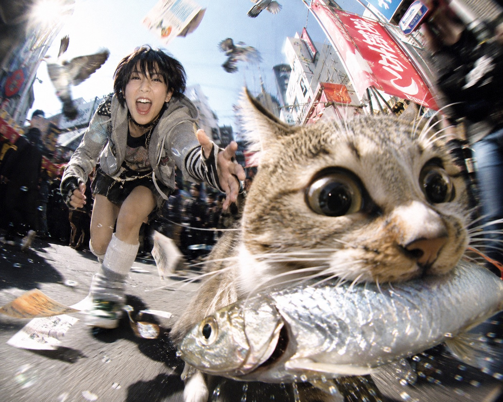

**來源：** [@mehvishs25](https://x.com/mehvishs25/status/2058375167550845263)

**提示詞：**

```text
Use the uploaded reference image as the exact identity base for the main subject. Preserve their authentic facial structure, recognizable appearance, hairstyle, body proportions, skin texture, and overall identity with high consistency. Completely ignore any unrelated background from the original image.

Create a hyper-chaotic early-2000s Japanese digicam snapshot aesthetic with raw paparazzi energy and accidental comedy.

Scene: the subject is sprinting wildly through a busy city street while yelling and laughing in pure chaos, desperately trying to catch a mischievous cat that just stole a large shiny fish from a market stall. The cat is gripping the slippery silver fish tightly in its mouth while running directly toward the camera.

Composition must prioritize TWO focal subjects:

1. PRIMARY FOCUS → the cat's face
2. SECONDARY FOCUS → the human subject's face

The cat dominates the foreground frame with its face pushed absurdly close into the lens, partially cropped near the lower-right side. Massive fisheye distortion stretches its features dramatically - huge bulging eyes, exaggerated whiskers, detailed fur texture, fish flapping violently with droplets and motion streaks flying outward.

Behind the cat, the subject is charging forward aggressively with intense energy, reaching toward the animal mid-run. Their expression is loud, chaotic, and comedic, eyes locked directly onto the cat to create strong interaction and pursuit tension.

Styling:
Randomized layered Y2K Tokyo streetwear inspired by chaotic Shibuya nightlife fashion - oversized zip hoodies, vintage mesh layers, mini bags, low-rise pieces, striped arm warmers, chunky accessories, early-2000s sneaker styling, messy fashionable youth aesthetic.

Camera & framing:
extreme low-angle fisheye lens, ultra-wide invasive perspective, severe Dutch angle, asymmetrical framing, warped spatial distortion, exaggerated depth compression, aggressive foreshortening.

Motion treatment:
insanely intense movement blur with radial streaking, shutter drag, CCD sensor smearing, directional speed trails, accidental camera shake, stretched highlights, warped moving objects, imperfect chaotic snapshot timing.

Environment:
sunny crowded urban street with pigeons exploding into flight across the frame, scattered newspapers and debris flying through the air, warped pedestrians, market elements smeared by motion, overexposed sunlight leaking into one corner of the frame.

Lighting & texture:
harsh direct flash combined with bright outdoor sunlight, dirty CCD digicam texture, blown highlights, chromatic aberration, digital noise, bloom artifacts, compressed early-2000s camera look, gritty nostalgic cyber-chaos atmosphere.

Ultra-raw candid energy, messy composition, humorous accidental masterpiece aesthetic.
```

***

<a name="case-467"></a>

### 例 467：泳裝雜誌九宮格廣告頁

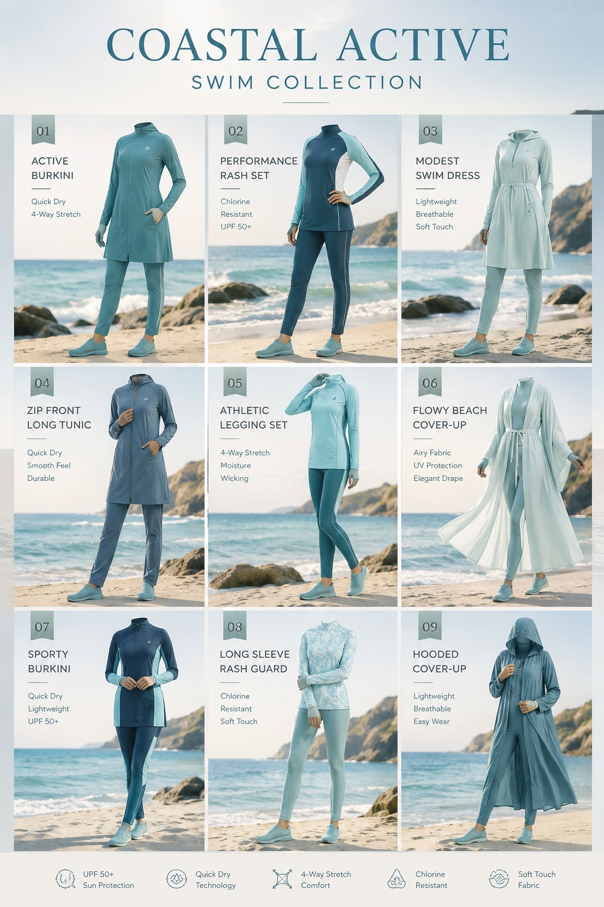

**來源：** [@Adam38363368936](https://x.com/Adam38363368936/status/2058859338211656051)

**提示詞：**

```text
泳裝時尚雜誌廣告頁面，日本成熟模特，S型曲線。變換姿勢和風格，九宮格展示，保持人物面部一致性
```

***

<a name="case-468"></a>

### 例 468：霓虹塗鴉展會自拍

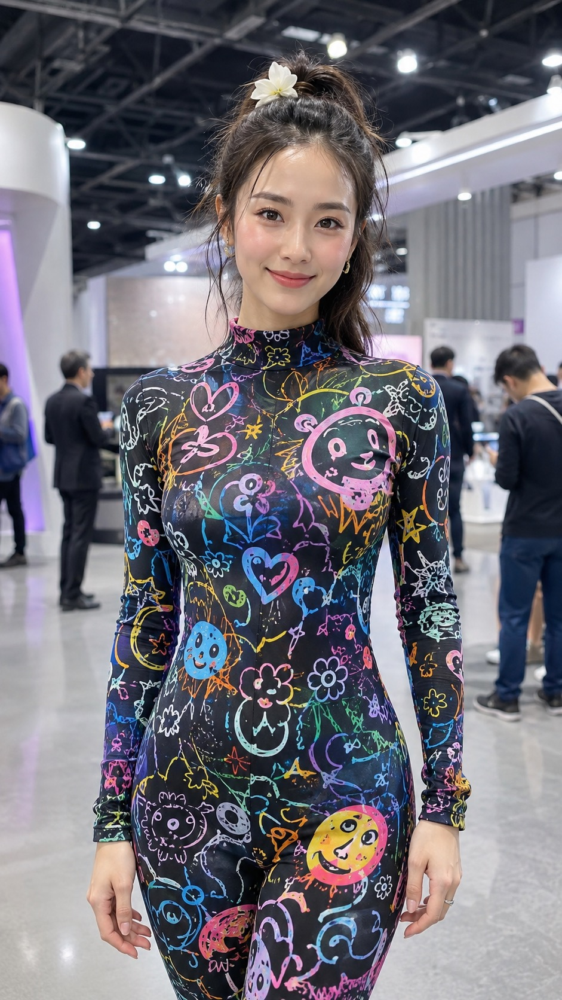

**來源：** [@drmrzhong](https://x.com/drmrzhong/status/2058774378960257437)

**提示詞：**

```text
生成一張寫實感合照，9:16構圖，真實手機攝影質感。

畫面中是一位20歲成年東方女性模特，站在室內展會現場，靠近鏡頭自然拍照。人物妝造精緻，五官清秀，皮膚清透，眼神自然看向鏡頭，整體氣質甜美。

人物姿態自然端正，身體略微前傾，肩頸柔和舒展，腰部自然收束，整體體態呈現成熟柔美的女性S型曲線。人物體態為成熟豐腴型，肩部圓潤柔和，胸部飽滿自然，腰線清晰但不過度纖細，臀腿曲線圓潤勻稱，大腿與手臂帶有柔軟健康的肉感，整體呈現溫柔、甜美、豐腴、優雅的女性美。

人物服裝為“霓虹手繪線條構成的藝術塗鴉”，筆觸故意粗糙隨意，帶明顯蠟筆與 marker 手繪質感。畫面中的 doodle graphics 形成若隱若現的視覺錯覺感，突出身體線條和優美輪廓，讓人物看起來像穿著由霓虹線條構成的 cosplay outfit，避免呈現為真實布料服裝。整體偏日本網際網路自拍文化中的 playful sticker aesthetic，避免直白裸露風格。

人物髮型為精緻古風高馬尾，搭配白色花朵頭飾、水晶髮簪、流蘇耳飾、額間水晶裝飾。妝容清透，帶有淡粉色眼影、自然腮紅和柔和唇色。

場景為大型室內展會現場，背景有人群和展臺但輕微虛化，頂部有真實展館燈光。畫面採用近景合照構圖，人物面部和服裝細節清晰，背景虛化自然，有真實手機自拍感。

整體風格：寫實、清透、明亮、夢幻。
```

***

<a name="case-469"></a>

### 例 469：導覽式科普繪本

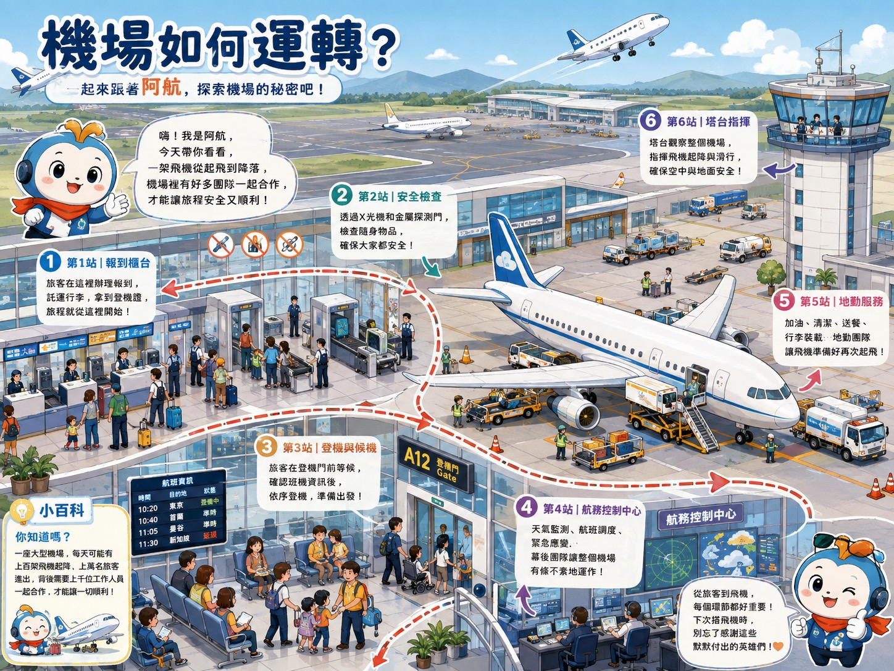

**來源：** [@MrLarus](https://x.com/MrLarus/status/2058773446167773521) / [提示词回复](https://x.com/MrLarus/status/2058773784664920233)

**提示詞：**

```text
《導覽式科普繪本》提示詞：

請根據【主題】創作一張高完成度的「導覽式科普繪本」風格插畫。

這是一張結合“大型場景主視覺 + 導覽路線 + 可愛導覽 IP + 知識站點 + 兒童科普繪本質感”的場景導覽式科普圖解頁。畫面需要讓觀者像被帶著參觀一個複雜系統一樣，邊看邊理解主題背後的執行邏輯、空間結構、流程關係和關鍵知識點。

【基礎設定】
主題：【填寫主題，例如發射場的一天 / 一個集裝箱的旅行 / 地鐵站裡的秘密路線 / 下潛到深海的一小時 / 機場如何運轉 / 醫院急診系統 / 智慧農場 / 消防站出警流程】
畫幅比例：【4:3 橫版】
主色調：【根據主題自動匹配，整體保持明亮、清爽、兒童友好】
風格方向：【現代兒童科普繪本 / 場景導覽式圖解 / 高完成度數字插畫】

【核心表達】
請圍繞【主題】設計一個完整的大型場景或複雜系統。畫面中必須有一個明確的主視覺場景，例如大型設施、交通系統、科技裝備、自然探索場景、城市公共系統或生產流程。主體要足夠清晰、有規模感、有細節，能夠成為第一眼的視覺中心。

畫面要透過“導覽路線”的方式組織資訊，避免僅把場景做成靜態陳列。請設計一條清晰的參觀路線、流程路線、時間軸或空間動線，讓讀者可以沿著路線一步步理解這個系統是如何執行的。

【導覽 IP 設計】
請為本圖設計一個原創、可愛、親和的導覽小 IP。導覽 IP 可以是小動物、小朋友、擬人化工具或其他適合主題的原創形象，但必須具有獨立原創性，不要照搬任何參考圖中的角色、動物形象、服裝、配色或搭檔關係。

導覽 IP 的作用是：
1. 開場介紹主題
2. 指向關鍵知識點
3. 引導讀者順著路線閱讀
4. 增加兒童繪本的陪伴感和趣味性

導覽 IP 可以在畫面中出現 2-3 次，但不要過度搶主視覺。角色應圓潤、可愛、有表情、有動作，適合兒童科普繪本。

【資訊結構】
畫面中請設定 3-6 個“知識站點”，每個站點用簡短中文標籤和短說明表達。站點命名可以採用：
- 第1站｜xxx
- 第2站｜xxx
- 重點觀察｜xxx
- 小知識｜xxx
- 為什麼｜xxx
- 如何工作｜xxx

每個知識點都要圍繞主題的核心執行邏輯展開，不要寫空泛說明。文字要短、清楚、自然，避免長段落，適合兒童閱讀。

【畫面模組】
整張圖建議包含以下模組：
1. 頂部主標題區：清楚寫出主題名稱
2. 開場導覽區：導覽 IP 引出主題
3. 大型主場景區：展示主題系統的完整場景
4. 導覽路線區：用箭頭、虛線、路徑、時間節點或流程線串聯知識點
5. 知識站點區：用小資訊框、導覽牌、局部標註展示關鍵知識
6. 小百科 / 小貼士區：補充一個有趣知識
7. 收尾區：讓導覽 IP 做簡短總結或引導

【構圖要求】
畫面採用 4:3 橫版構圖，整體像一本高品質兒童科普繪本的跨頁，也像一張兒童科技館導覽圖。畫面需要有清晰的視覺重心：大型主場景佔據主要空間，導覽路線貫穿畫面，知識模組自然分佈在周圍。資訊豐富但不能雜亂，閱讀路徑要順暢。

【視覺風格】
整體採用現代兒童科普繪本風格：
- 明亮、清爽、乾淨的色彩
- 清晰自然的手繪線條
- 高完成度數字插畫質感
- 細節豐富但有秩序
- 可愛但不低幼
- 有科普圖解感
- 有導覽地圖感
- 場景真實可信，但表達方式親和

【文字與標註】
文字以中文為主，使用短標題、短標籤、簡短說明。不要生成大段複雜文字。資訊框應像兒童科普書中的導覽牌、知識卡片或小貼士。文字要儘量清晰、簡潔、可讀。

【最終目標】
讓整張影象一頁高品質的兒童科普繪本：孩子第一眼被可愛角色和大場景吸引，第二眼能順著路線讀懂系統如何執行，第三眼還能繼續發現細節和知識點。畫面要具有系列化潛力，方便後續替換不同主題繼續創作同型別圖片。
```

***

<a name="case-470"></a>

### 例 470：本地生活小店異形展架

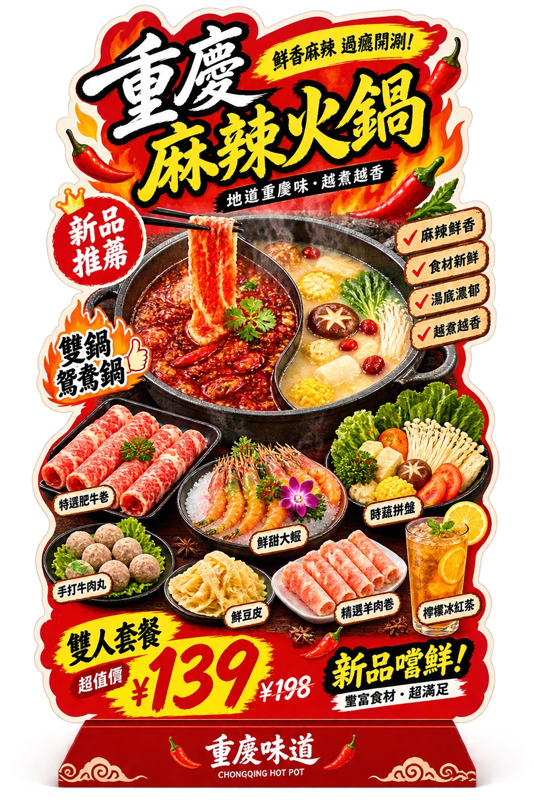

**來源：** [@MrLarus](https://x.com/MrLarus/status/2059248197910827364) / [提示词回复](https://x.com/MrLarus/status/2058431837534343283)

**提示詞：**

```text
《餐飲異形展架/立牌物料》提示詞：

請生成一張高完成度的「餐飲異形展架 / 立牌」設計圖，用於展示餐飲門店的新品推薦、招牌產品、方案促銷或品牌活動資訊。

【基礎資訊】
品牌名：【品牌名】
主標題：【主標題】
副標題：【副標題】
輔助短句：【短句1】｜【短句2】｜【短句3】
主題方向：【主題方向，例如：爆辣夜市風 / 金黃濃郁風 / 清新輕食風 / 山野自然風 / 甜品下午茶風 / 快餐促銷風】
主色調：【主色調】
輔助色：【輔助色】
點綴色：【點綴色】
畫幅比例：【建議 3:4 豎版】

【產品內容】
主推產品：【主推產品】
輔助產品1：【輔助產品1】
輔助產品2：【輔助產品2】
輔助產品3：【輔助產品3】
輔助產品4：【輔助產品4】
加料 / 配角產品：【加料或配角產品，例如：飲品 / 小食 / 配菜 / 醬料 / 甜品】

【賣點標籤】
【賣點1】
【賣點2】
【賣點3】
【賣點4】
【賣點5】
【賣點6】

【促銷資訊】
【促銷資訊1】
【促銷資訊2】
【促銷資訊3】

【最重要要求】
避免生成門店場景效果圖或牆上海報展示圖。請直接生成“一張完整的異形立牌成品展示圖”：
- 背景必須為純白色
- 畫面中只保留一個完整的異形餐飲立牌主體
- 不要餐廳環境
- 不要商場背景
- 不要玻璃門、桌椅、牆面、人物、地面透視場景
- 不要任何真實空間背景
- 立牌主體必須完整顯示
- 異形輪廓必須完整清晰
- 底座必須完整露出
- 整體像一張已經摳好的門店物料成品圖 / 設計提案展示圖 / 電商展示圖

【畫面形式】
這是一張“門店異形展架 / 立牌”的完整設計，避免普通矩形海報處理。
整體應採用明顯的“不規則異形裁切輪廓”，有完整外邊緣，邊緣可帶白色或淺色描邊，具有真實門店物料感。
立牌應有明確底座，整體像可落地擺放的 KT 板 / 泡沫板 / 亞克力 / 寫真噴繪展架成品。

【構圖結構】
整體採用豎版、中心聚焦、資訊分層清楚的結構：

1. 頂部區域：
放超大主標題，標題必須醒目、有衝擊力、有餐飲 POP 招貼感。
字型可以厚重、手寫感、招貼感、潮流感，但要清晰易讀。
標題是整張圖的第一視覺焦點。

2. 中部核心區域：
中間放最大主推產品，作為主視覺主體。
主菜必須最大、最飽滿、最誘人，突出食慾感。
圍繞主菜搭配 2~5 個輔助產品，形成豐富的產品組合，前後層次明確，主次分明。

3. 周邊資訊區域：
在主菜和輔助產品四周加入少量標籤元素、推薦標、貼紙框、手寫箭頭、賣點說明、小標題、小氣泡標籤等，使其具有“餐飲門店促銷物料”的視覺特徵。
但要控制層級，做到“熱鬧但不亂”。

4. 底部促銷區域：
底部放價格資訊、方案資訊、活動資訊或新品嚐鮮資訊。
價格數字要相對突出，易讀清晰。
如果沒有特別要求，預設不要QR Code。

【視覺風格要求】
整體風格應屬於“餐飲轉化型視覺 + 門店 POP 異形立牌”：
- 強調食慾感
- 強調資訊可讀性
- 強調商業落地感
- 強調門店物料感
- 強調異形輪廓感

避免極簡雜誌海報、電商詳情頁、純平面插畫海報方向。

【食物表現要求】
所有食物必須採用真實商業美食攝影質感：
- 食物清晰真實
- 有食材顆粒感
- 有醬汁、湯汁、油光、熱氣、層次感
- 有豐富細節，如蔥花、辣椒、芝士、香草、蔬菜、水果、蝦仁、肉塊等
- 主食要飽滿，不能扁平
- 看起來必須“能激發食慾”
禁止過度插畫化、卡通化、低質拼貼化。

【版式與資訊層級】
整張立牌的閱讀順序應為：
主標題 → 主推產品 → 輔助產品 → 賣點標籤 → 價格 / 活動資訊

資訊量可以較豐富，但必須有明確層級：
- 主標題最大
- 主菜次大
- 輔助菜稍小
- 賣點標籤較小
- 底部促銷清晰醒目

【適配範圍】
該範本需要適用於不同主題餐飲內容，例如：
- 面 / 飯 / 粉 / 小吃
- 火鍋 / 菌湯 / 地方菜
- 輕食 / 沙拉 / 咖啡簡餐
- 早餐 / 方案 / 快餐
- 茶飲 / 甜品 / 下午茶
- 節日促銷 / 新品上市 / 爆品推薦 / 雙人方案

【輸出要求】
請輸出一張高畫質、清晰、商業完成度高的異形立牌設計圖，滿足以下條件：
- 白色背景
- 完整異形輪廓
- 完整底座
- 只展示立牌本體
- 不帶真實場景環境
- 不帶人物
- 不帶門店背景
- 預設不帶QR Code
- 適合用於系列案例展示、設計提案、社群媒體發布、範本複用
```

***

<a name="case-471"></a>

### 例 471：花簪和服動漫肖像

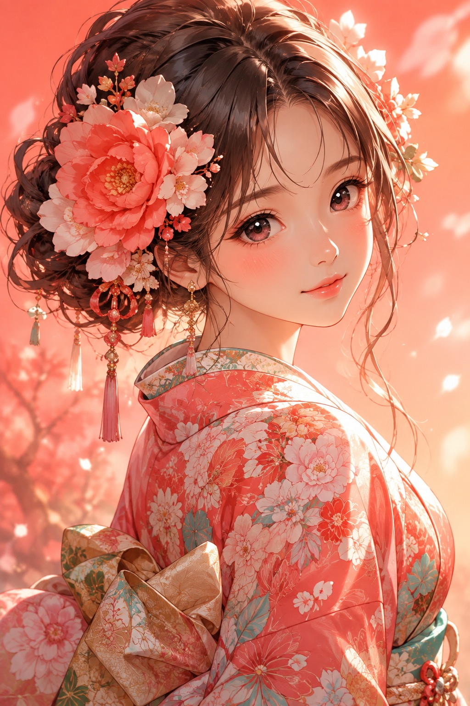

**來源：** [@Mind_Boticni](https://x.com/Mind_Boticni/status/2059133066694779343)

**提示詞：**

```text
Ultra-detailed anime-style portrait of a young girl with large expressive eyes, soft blush cheeks, and delicate facial features. She wears a vibrant floral kimono with intricate colorful patterns. Large blooming flowers are placed in her hair like accessories. Smooth gradient warm background in coral and peach tones. Soft cinematic lighting, dreamy atmosphere, high-end digital illustration
```

***

<a name="case-472"></a>

### 例 472：上海地鐵站臺晨光

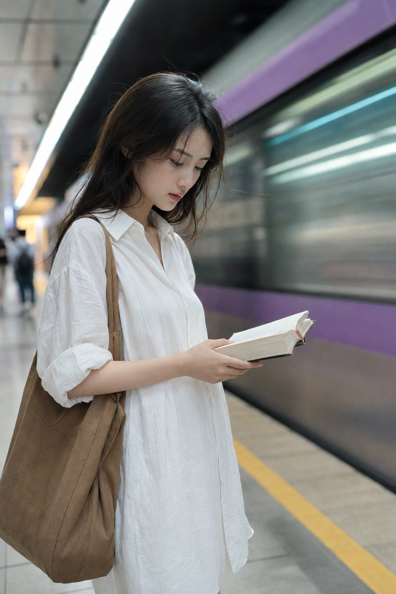

**來源：** [@ToroJushiAi](https://x.com/ToroJushiAi/status/2059452471127240959)

**提示詞：**

```text
A candid photograph of a young woman standing on a Shanghai metro platform during the summer morning commute, authentic daily life photography, natural candid moment. Half-body framing, shot at eye level from moderate distance — the arriving train a motion-blurred streak behind her, the yellow safety line at her feet.
East Asian young woman in her early 20s. Almond-shaped eyes with natural double eyelids, slightly elongated eye corners — eyes directed downward, absorbed. Straight refined nose with a delicate bridge. Skin tone fair to light beige (NC10–NC20) — skin subsurface scattering visible under cool overhead station light, specular micro-highlights on cheekbones and nose ridge, fine foundation powder grain perceptible. Summer fresh look, no heavy coverage, lightly tinted lip.
She wears a relaxed oversized white shirt dress, collar lightly open, sleeves loosely rolled above the elbow. A structured natural tan canvas tote hangs from her shoulder, a physical novel tucked under one arm — pages open at a saved page. She stands with her weight on one hip, gaze downward at the open book, entirely absorbed, occupying her own stillness inside the morning rush. Background: white and grey tiled metro wall, overhead route signage board, arriving train motion blur to one side, other commuters blurred and distant. Two or three stray hairs displaced by the train's air displacement on arrival, natural unplanned imperfection, not geometrically symmetrical.
Cool overhead fluorescent lighting with a slight greenish cast, flat frontal illumination offset by a warm spill from the platform entrance behind. Absorbed in focus, eyes downward, unaware — a private moment inside a public space, the Shanghai morning. Subtle ISO 400 film grain in shadow areas, photographic noise texture not CG render smoothness. Aspect ratio 2:3. No watermark, no text overlay, not cartoon, not digitally painted, not illustration, not anime.
```

***

<a name="case-473"></a>

### 例 473：ROGUE VIPER 遊戲概念設定板

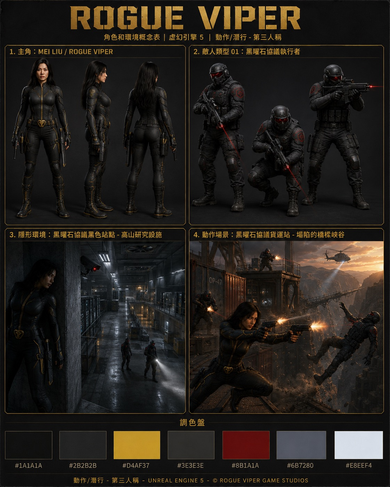

**來源：** [@KimAkiyama81](https://x.com/KimAkiyama81/status/2059394334378566063)

**提示詞：**

```text
**ROGUE VIPER — VIDEO GAME CONCEPT ART SHEET PROMPT**

---

Official AAA video game concept art sheet titled **'ROGUE VIPER'** for an Unreal Engine 5 third-person action-stealth game. Professional game development documentation layout on a dark charcoal #1A1A1A background with gold stencil label typography throughout. Four clearly labeled panels arranged in a 2×2 grid with a header and footer.

---

**SHEET HEADER** — Bold gold stencil font title text: **ROGUE VIPER** centered at top. Subtitle beneath in smaller tracking-heavy label font: **CHARACTER & ENVIRONMENT CONCEPT SHEET | UNREAL ENGINE 5 | ACTION / STEALTH — THIRD PERSON**

---

**PANEL 1 — TOP LEFT — Label: "PROTAGONIST: MEI LIU / ROGUE VIPER"**

Full-body character turntable reference of a 30-year-old East Asian Chinese-American female operative. Athletic and toned, 5'8", long straight black hair worn loose, calm neutral expression with sharp eyes. Wearing a form-fitting matte black tactical bodysuit with gold accent seams running along the shoulders, forearms, and thighs, gold cobra snake belt buckle at the waist, calf-high black tactical boots with subtle gold trim. Armed with twin suppressed 9mm pistols holstered on each hip with custom viper-scale grip texture, a serrated combat knife sheathed vertically on the right thigh, and a compact pneumatic grappling hook launcher mounted on the left forearm. Three views arranged side-by-side: front, 3/4, and back. Unreal Engine 5 physically-based rendering, photorealistic skin and fabric materials, neutral 3-point studio lighting for maximum clarity, gold and matte black color scheme throughout.

---

**PANEL 2 — TOP RIGHT — Label: "ENEMY TYPE 01: OBSIDIAN PROTOCOL ENFORCER"**

Three enemy soldiers shown as character references against a dark background. These are elite private military contractors working for a shadow arms cartel called Obsidian Protocol. Their uniform: slate-gray and black modular plate carriers with deep crimson geometric hex-patch insignia on the shoulder, full-face ballistic visors with a dark red tinted lens, black tactical gloves, reinforced combat boots. Armed with compact bullpup assault rifles with red laser sights. One figure standing in neutral patrol stance, one crouched in a ready alert position, one depicted mid-aim with rifle raised. All three shown at the same scale for comparison. Same UE5 photorealistic PBR render style. Crimson and slate-gray color language to contrast Viper's gold and black.

---

**PANEL 3 — BOTTOM LEFT — Label: "STEALTH ENVIRONMENT: OBSIDIAN PROTOCOL BLACK SITE — ALPINE RESEARCH FACILITY"**

Wide cinematic establishing shot of a stealth mission environment. A hidden high-altitude research facility buried inside a snow-covered mountain, accessible only via an underground tram. Interior architecture is brutalist concrete and frosted glass, dimly lit with cold white fluorescent overhead strips and amber emergency lighting casting long dramatic shadows across polished concrete floors. Rows of classified server terminals and cryogenic storage units line the walls. Ventilation shafts visible in the ceiling above catwalks. A security camera sweeps a slow arc over a central corridor below. In the foreground, Rogue Viper is pressed flat against a concrete pillar in deep shadow, body low, watching two Obsidian Protocol enforcers on patrol below, one holding a flashlight. The scene communicates tension, patience, and tactical opportunity. Unreal Engine 5 Lumen global illumination, volumetric cold air haze, photorealistic ice and concrete materials, deep crushed blacks with cold white and amber lighting contrast. Cinematic wide 2.39:1 style composition within the panel.

---

**PANEL 4 — BOTTOM RIGHT — Label: "ACTION SET PIECE: OBSIDIAN PROTOCOL FREIGHT DEPOT — COLLAPSED BRIDGE CANYON"**

Wide cinematic action shot of a high-octane firefight environment. A sprawling open-air industrial freight depot at the edge of a sheer cliff canyon at dusk, with a collapsed suspension bridge dangling over the chasm below. Shipping containers and heavy crane equipment provide cover geometry. Rogue Viper is captured mid-movement in a dynamic gunfight pose — body low, both suppressed pistols raised and firing, muzzle flashes illuminating her face with sharp white light. Three Obsidian Protocol enforcers are positioned around her — one diving behind a container, one firing from atop a crane platform, one falling backward off the edge of the depot platform. Background: deep canyon with a river of orange reflected sunset light far below, dust and smoke rising from the firefight, a military helicopter approaching in the far distance. Warm dusk amber and cool canyon shadow blue provide dramatic color contrast. UE5 ray-traced reflections on metal container surfaces, particle systems for dust and muzzle smoke, cinematic depth of field on background elements.

---

**SHEET FOOTER** — Color palette chip row along the bottom of the sheet: matte black #1A1A1A, dark charcoal #2B2B2B, viper gold #D4AF37, gunmetal #3E3E3E, obsidian crimson #8B1A1A, slate gray #6B7280, cold white #E8EEF4. Label above chips: **COLOR PALETTE**. Footer text beneath: **ACTION / STEALTH — THIRD PERSON — UNREAL ENGINE 5 — © ROGUE VIPER GAME STUDIOS**

---

**UNIVERSAL STYLE CONSTRAINTS — APPLY TO ALL PANELS:**
Photorealistic only throughout the entire sheet. No anime, no cartoon, no stylized illustration, no cel shading, no comic book rendering. Unreal Engine 5 cinematic render quality with physically-based materials. Anamorphic lens character on all environment shots. Crushed blacks and desaturated mid-tones across all panels. Professional AAA game studio concept documentation format comparable to Naughty Dog, Ubisoft, or Guerrilla Games internal production art.
```

***

<a name="case-474"></a>

### 例 474：四城極簡旅行海報系列

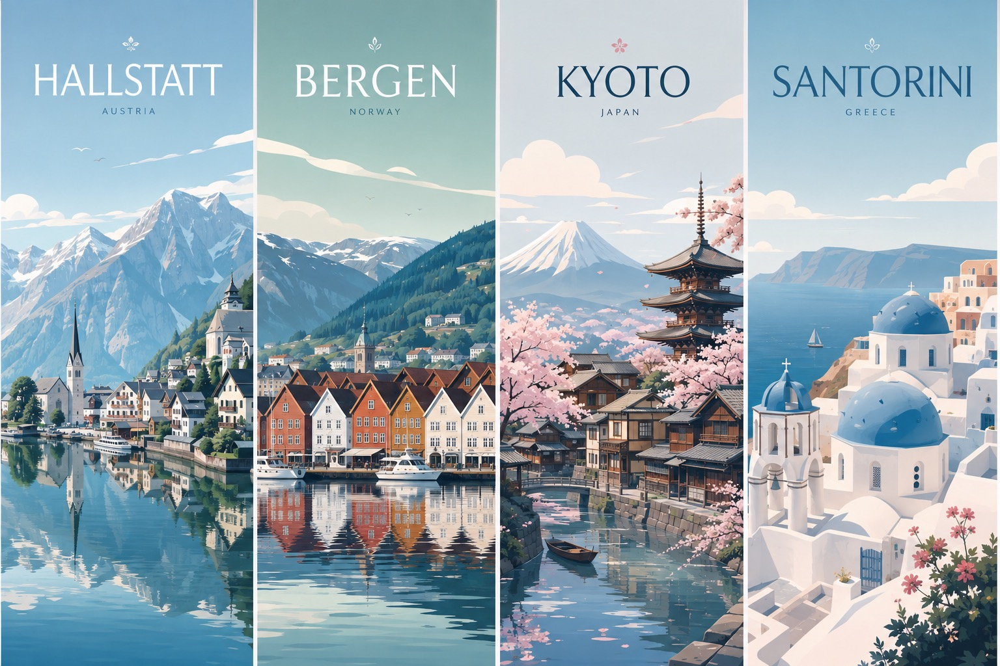

**來源：** [@Taaruk_](https://x.com/Taaruk_/status/2059188921096085888)

**提示詞：**

```text
Minimalist flat travel poster illustration series of iconic destinations around the world, clean vector art style, Scandinavian color palette, soft pastel tones, calm atmospheric scenery, Hallstatt Austria lakeside village with alpine mountains and reflections, Bergen Norway colorful harbor houses with fjord background, Kyoto Japan traditional riverside town with cherry blossoms and pagoda, Santorini Greece white architecture with blue domes overlooking the sea, ultra clean composition, geometric landscape shapes, smooth gradients, elegant typography with destination names, modern tourism poster aesthetic, serene travel mood, crisp vector lines, cinematic wide-angle scenery, peaceful skies with stylized clouds, highly detailed environment art, contemporary flat illustration, premium editorial travel design, balanced composition, minimal shadows, dreamy vacation atmosphere, soft morning lighting, high-end Airbnb poster vibe, Behance trending style, 4k, ultra detailed
```

***

<a name="case-475"></a>

### 例 475：企鵝造型包裝結構板

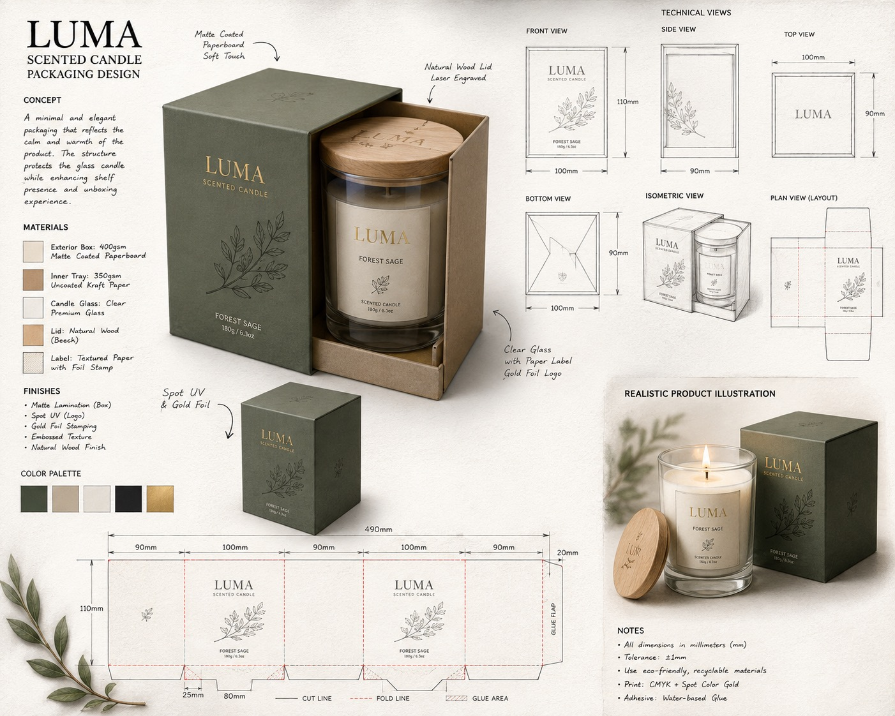

**來源：** [@iamaiistudio](https://x.com/iamaiistudio/status/2059305097897914664) / [full prompt](https://aiistudio.com/prompt/2039679180775063573)

**提示詞：**

```text
Using the attached image, create an illustration sheet of professional industrial design packaging for the package (PACKAGE TYPE). A centered heroic 3D rendering with realistic materials, soft studio lighting and commercial quality finishes. Surrounded by technical views: front, side, top, bottom, oblique perspective and flat position. Include sketches of the frame structure, crease lines, seam details, and size arrows in millimeters. Show materials and finishes (matte, glossy print, plastic, paper, glass, etc.) in handwritten annotations. Add color swatches, realistic product illustrations, and subtle shadows. Clean sketchbook background, realistic rendering + pencil sketch style, modern design design, ultra-detailed, portfolio ready.
```

***

<a name="case-476"></a>

### 例 476：早安拿鐵微縮女孩

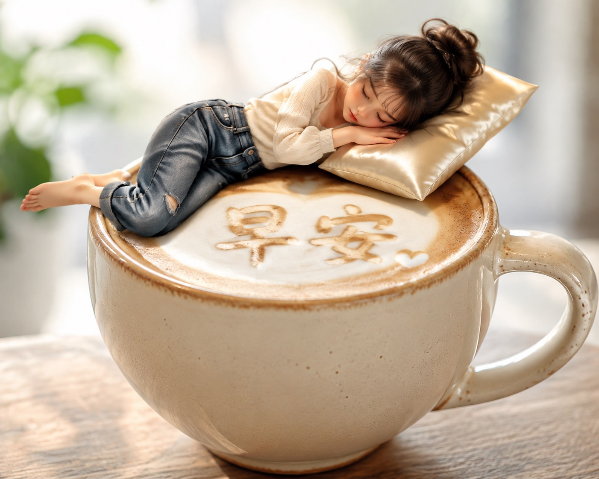

**來源：** [@Zyrellix](https://x.com/Zyrellix/status/2059443447602561444)

**提示詞：**

```text
Create ultra-fine highly detailed 3D realistic miniature chibi-like cute girl, wearing cream colour top and jeans, resting and floating on creamy latte cup, stylized textured ceramic cup, sleeping expression, satin soft pillow tucked behind her head. The latte cream forms a text "Good Morning" in a cute handwriting. Soft-focus minimalist background, bright natural light, 8K UHD.
```

***

<a name="case-477"></a>

### 例 477：Instagram 餐桌俯拍創意

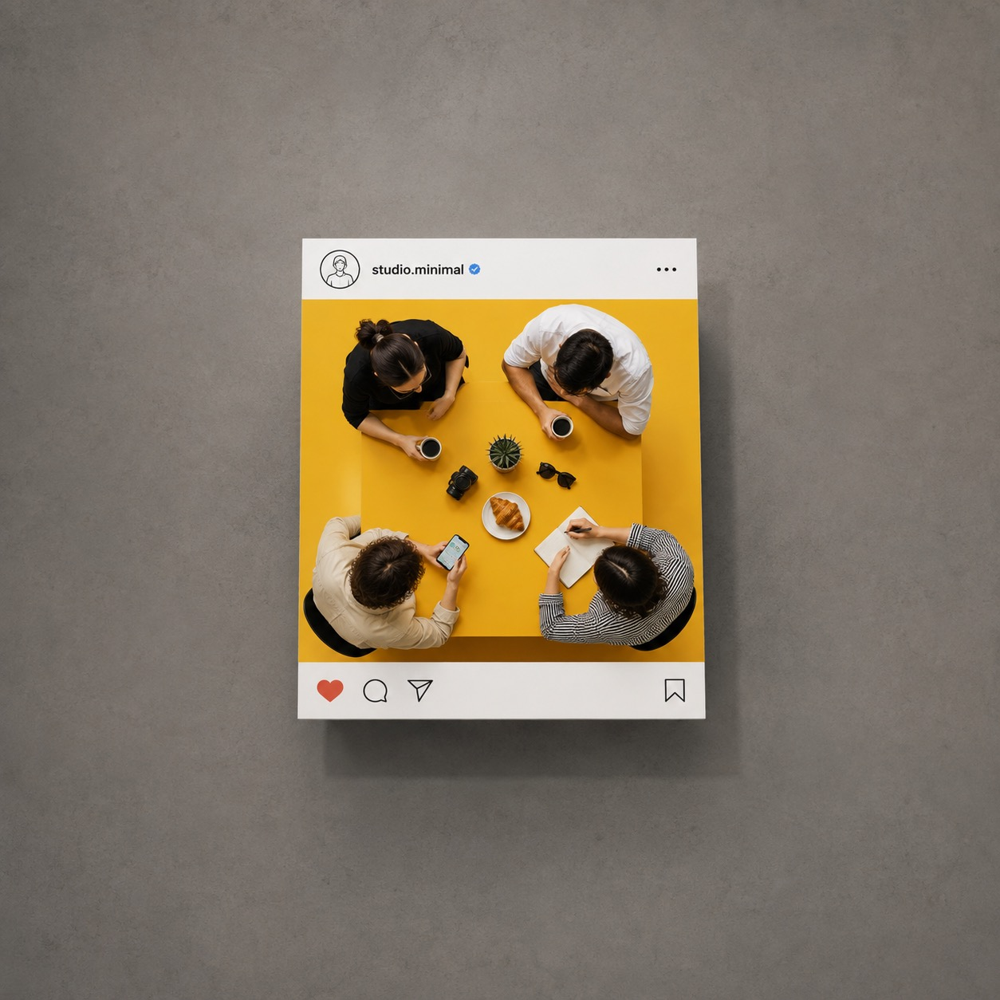

**來源：** [@iamaiistudio](https://x.com/iamaiistudio/status/2060210845225980366) / [full prompt](https://aiistudio.com/prompt/2045009725218226475)

**提示詞：**

```text
Top-down ultra-wide hyper-realistic shot of 4 real people seated at a square dining table. Pull the camera way back so a wide ring of empty floor surrounds the whole scene, giving a clean minimal composition. Scene [ATMOSPHERE + WARDROBE]: the four are styled in [OUTFIT STYLE]. Each one is doing something specific: [DESCRIBE EACH PERSON'S ACTION].

The table itself is a physical prop built to look like an Instagram post viewed from above:
- A solid white band runs along the TOP and BOTTOM edges only, with no white on the left or right sides.
- Top band: a small drawn profile avatar with [LOGO DESCRIPTION], the handle "[USERNAME]", a tiny blue verified check next to it, and a "..." on the far right.
- Bottom band: red heart, comment bubble, and share icons painted on the left, bookmark icon on the right.

The center of the table is one flat color: [EXACT COLOR + HEX CODE]. All food, drinks, props, and any hand interacting with them must stay strictly inside that central colored zone, nothing crosses the white bands or the table edge. The floor around the table is [FLOOR COLOR] to create clear visual separation. Professional studio lighting with crisp shadows, 8k, tack-sharp focus.
```

***

<a name="case-478"></a>

### 例 478：夾層式品牌編輯海報

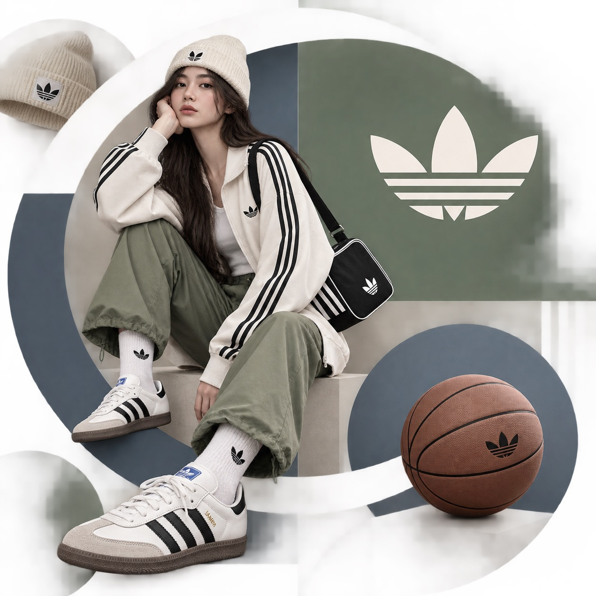

**來源：** [@iamaiistudio](https://x.com/iamaiistudio/status/2060000278657839398) / [full prompt](https://aiistudio.com/prompt/2040806718523748627)

**提示詞：**

```text
[BRAND NAME]. You are a world-class editorial designer.

STEP 1, DYNAMIC SUBJECT LOGIC:
- Subject pick: independently study [BRAND NAME] and choose the right hero subject.
- Sandwich layering: weave the subject through the background shapes. Parts of the car or figure must sit hidden behind geometric blocks, while other parts (wheels, limbs, props) overlap in front of those blocks to fake real 3D depth.

STEP 2, GRID & GEOMETRY:
- Layout: a clean 2x2 grid composition.
- Overlays: drop large bold geometric arcs and circles on top of the grid.
- Visual balance: place one iconic product prop (a floating key fob for cars, a ball for sports, etc.) in its own quadrant to counterweight the subject.

STEP 3, SOPHISTICATED MUTED PALETTE:
- No aggressive neon, no oversaturated colors.
- Pull [BRAND NAME]'s core colors and shift them into a "sophisticated muted" range. Use desaturated, earthy, dusty versions of the brand colors (dusty rose instead of hot pink, sage green instead of bright mint, slate blue instead of royal blue).
- Finish: matte flat color blocks, zero gradients.

STEP 4, PHOTOGRAPHY & LIGHTING:
- Subject style: high-end commercial studio photography.
- Lighting: soft diffused studio light, gentle highlights, no harsh shadows.
- Integration: the subject must feel physically embedded into the graphic grid.

STEP 5, MINIMALIST BRANDING:
- Drop a clean single-color [BRAND NAME] logo dead-center on one background block. No tagline, just the iconic symbol.
```

***

<a name="case-479"></a>

### 例 479：雜誌紙藝拼貼重繪

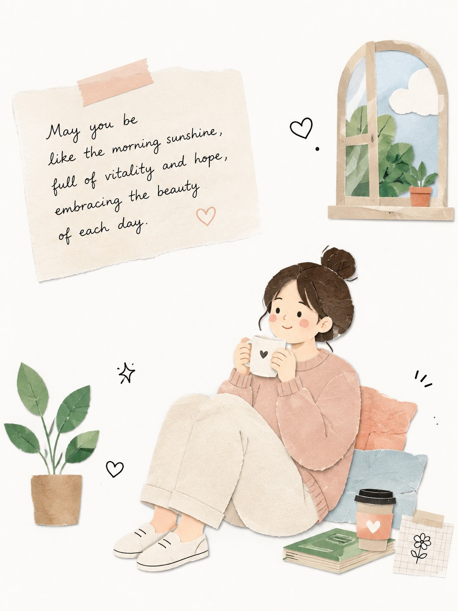

**來源：** [@oggii_0](https://x.com/oggii_0/status/2060212097083146644)

**提示詞：**

```text
Transform the uploaded image into a minimalist illustration in a magazine collage style, using paper cutouts. Retain the main subject, pose, and overall concept of the original image, but reimagine it as a warm, hand-edited collage. Style: Minimalist illustration in a magazine paper collage style, with flat, layered paper shapes, soft pastel paper textures, torn paper edges, paper shadow effects, neat black doodle accents, a handmade scrapbook atmosphere, modern Korean editorial design, a simple and cute composition, and large areas of clean white space. Character: Cute, simplified Korean characters with minimalist facial features, a small, relaxed smile, soft and rounded proportions, simple and casual clothing, and silhouettes constructed from layered paper cutouts. Composition: A 3:4 aspect ratio, with the main subject positioned slightly lower and off-center, leaving a large, open space on the opposite side for a breezy, minimalist composition that avoids clutter. Objects: Add only a few suitable collage elements: paper sticky notes, small hearts, plants, a cup of coffee, a window, tape fragments, and simple doodle icons. Typography: Add an elegant, handwritten English title that fits the scene's atmosphere. Use short phrases such as: ["May you be like the morning sunshine, full of vitality and hope, embracing the beauty of each day.","Take a small break," or "Good day, good mood."] Atmosphere: Calm, comfortable, warm, sweet, and editorial style. Avoid: Photorealistic style, anime style, watercolor style, 3D clay style, overly detailed backgrounds, excessive collage elements, a luxury poster atmosphere, dark tones, harsh shadows, and sloppy text.
```

***

<a name="case-480"></a>

### 例 480：粉絲速寫本角色頁

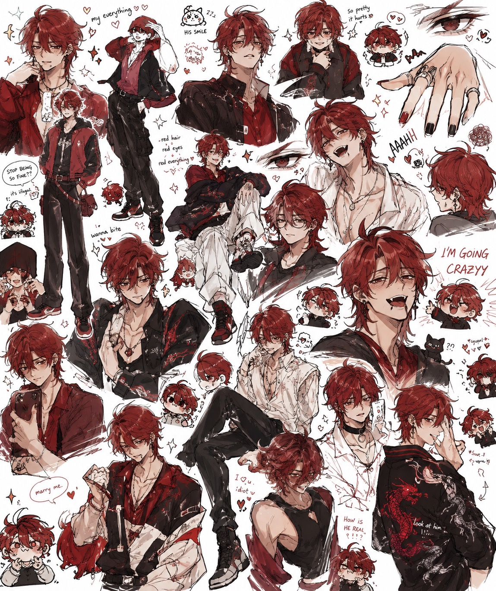

**來源：** [@Ciri_ai](https://x.com/Ciri_ai/status/2060211436232786357)

**提示詞：**

```text
Draw me as if an obsessed fan artist filled an entire sketchbook page - messy, overlapping, full-body poses, tiny chibi doodles, exaggerated expressions, and random close-ups of their hands or eyes.
White background. No grid, no order. Pure chaos energy. With (any color) aesthetic clothes
```

***

<a name="case-481"></a>

### 例 481：韓系春日 scrapbook 海報

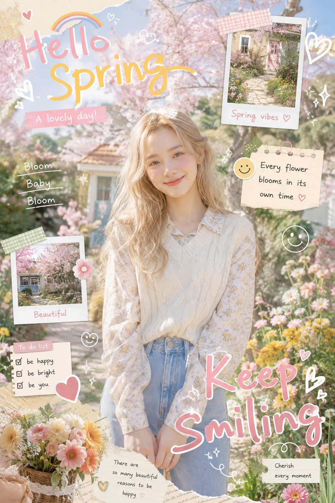

**來源：** [@Taaruk_](https://x.com/Taaruk_/status/2060214163591614900)

**提示詞：**

```text
Cute Korean spring aesthetic scrapbook poster, dreamy K-fashion portrait, soft blonde girl standing in a blooming flower garden, pastel blue sky background, cream floral blouse layered under a knitted ivory sweater vest, light blue high-waisted jeans, natural smile, glowing fair skin, soft makeup, cherry blossom trees, colorful spring flowers, cozy countryside garden, bright natural sunlight, kawaii doodle overlays, hand-drawn white hearts, smiley faces, stars, sparkles, rainbows, playful handwritten typography, polaroid photo frames, masking tape stickers, scrapbook collage layout, Pinterest aesthetic, Korean magazine editorial, cottagecore fashion, dreamy spring vibes, wholesome mood, soft pastel color palette, clean composition, aesthetic social media poster, ultra detailed, photorealistic, high quality, cute and charming atmosphere, subtle bokeh, lifestyle photography, Instagram reel cover, fashion moodboard, Y2K scrapbook design, white outline around subject, flower-themed decorations, 8k masterpiece
```

***

<a name="case-482"></a>

### 例 482：自我凝視超現實 Campaign

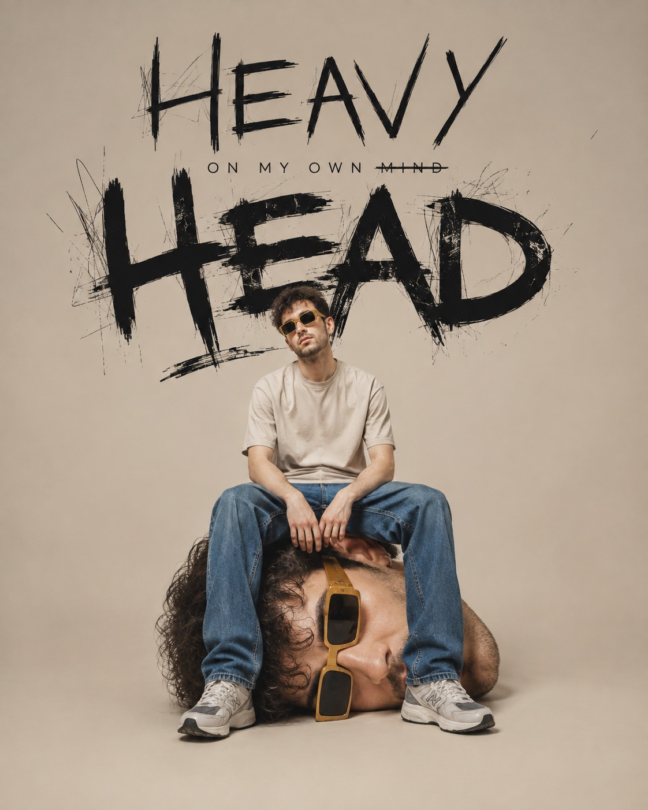

**來源：** [@Shorelyn_](https://x.com/Shorelyn_/status/2060207260685791267)

**提示詞：**

```text
Ultra-realistic conceptual portrait of a young man with curly hair and light stubble, wearing yellow-tinted rectangular sunglasses, a beige minimal t-shirt, blue jeans, and off-white sneakers. He is sitting casually with a relaxed posture.

The twist: he is seated on a large, hyper-realistic version of his own detached head placed on the ground. The head is scaled up, lying sideways, with the same facial features and sunglasses, creating a surreal self-reflection concept.

Composition: centered, full-body shot, neutral studio background with soft beige tones, minimal aesthetic. Clean negative space.

Typography integrated into the background:

* Handwritten-style text at the top: “HEAVY”
* Below it, smaller text: “ON MY OWN MIND” with “MIND” crossed out
* Large, rough, scribbled text in black: “HEAD”

Lighting: soft diffused studio lighting, subtle shadows, high detail, fashion editorial quality.

Style: blend of surrealism and modern streetwear campaign, minimal yet expressive, high-resolution, 8k, sharp focus, natural skin texture.

Mood: introspective, mental weight, identity, self-awareness.
```

***

<a name="case-483"></a>

### 例 483：都市飛鳥街頭肖像

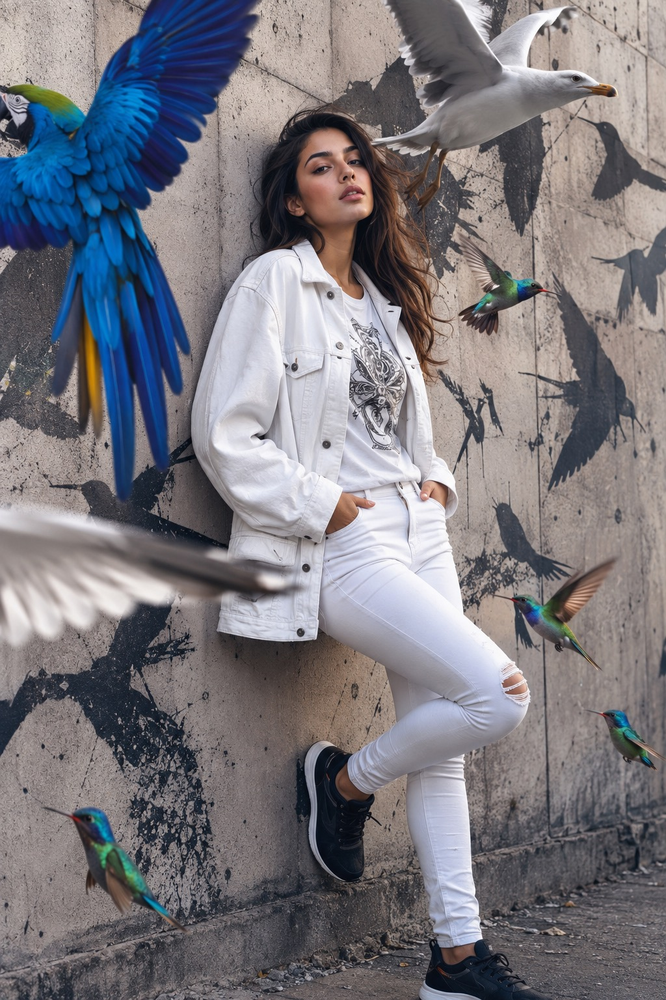

**來源：** [@HaniaAi12](https://x.com/HaniaAi12/status/2060216757797978245)

**提示詞：**

```text
A stylish cinematic portrait of a confident young woman leaning casually against a textured urban concrete wall, surrounded by vibrant flying birds including blue macaws, white seagulls, and a colorful hummingbird. Black graffiti-style bird silhouettes painted on the wall create an artistic street-art vibe. She is wearing a trendy all-white outfit — oversized denim jacket, fitted graphic tee, skinny jeans, and black sneakers. Soft natural daylight, realistic shadows, ultra-detailed fashion photography, urban luxury aesthetic, sharp facial features, glossy hair, high-end editorial style, dynamic composition, photorealistic, depth of field, 8K quality.
```

***

<a name="case-484"></a>

### 例 484：霓虹塗鴉黑白人像

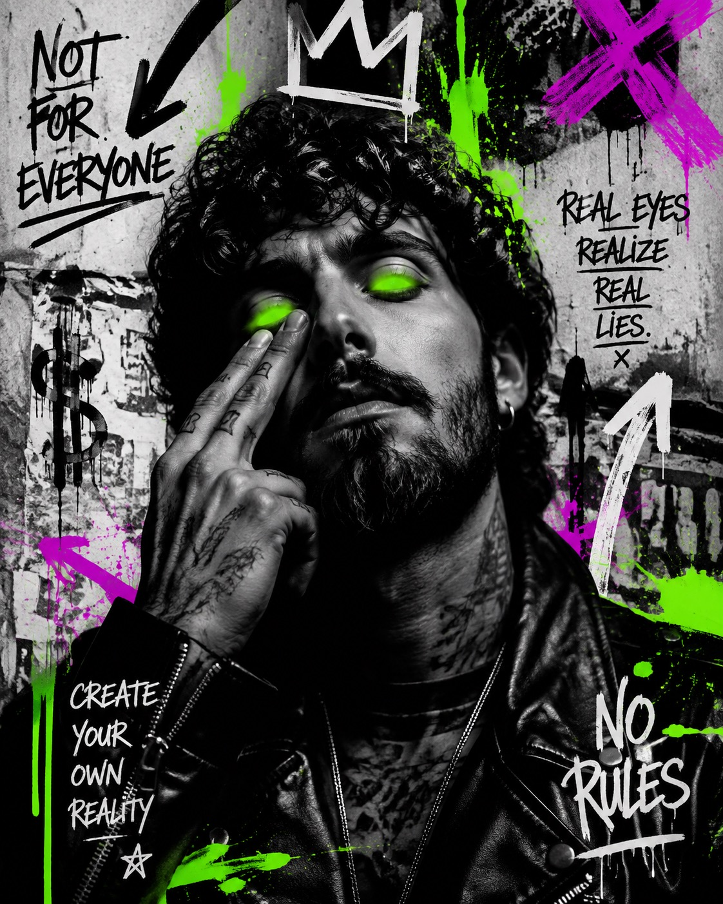

**來源：** [@harboriis](https://x.com/harboriis/status/2060208419811074350)

**提示詞：**

```text
High-contrast black-and-white urban portrait of a curly-haired bearded man in a black leather jacket, holding two fingers near glowing neon green eyes, with bold graffiti doodles, colorful paint splashes, abstract arrows, crown sketches, and grunge street-art textures on a concrete background, cinematic lighting, edgy graphic poster style.
```

***

<a name="case-485"></a>

### 例 485：時尚目錄電商拼貼

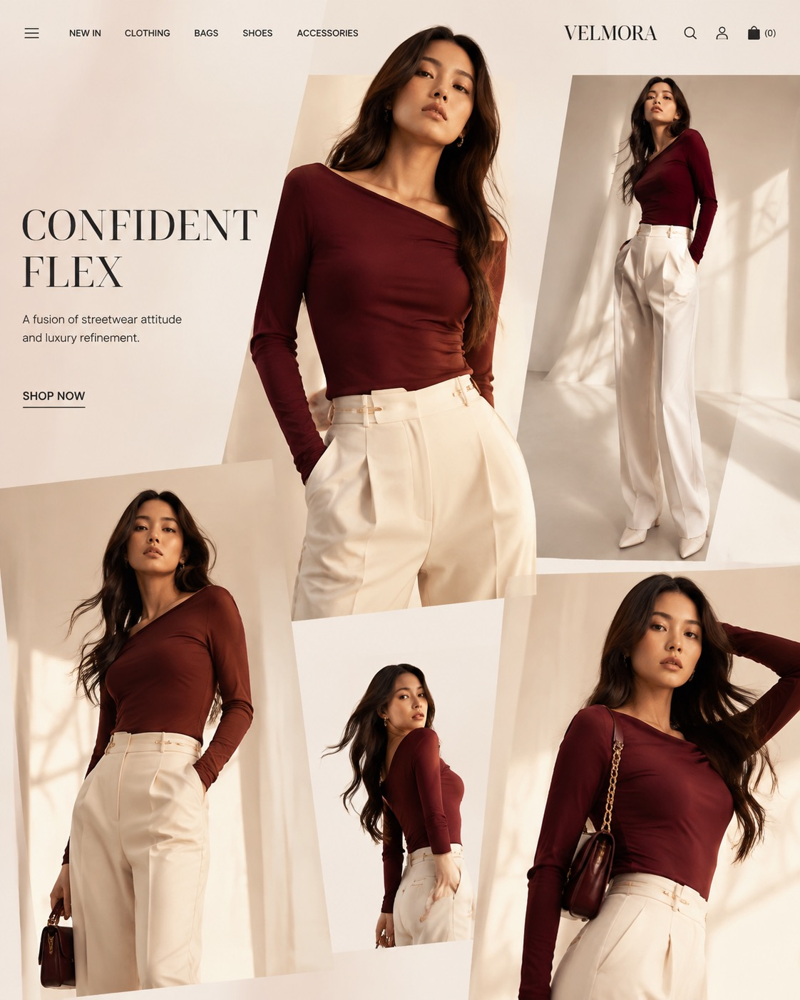

**來源：** [@Mind_Boticni](https://x.com/Mind_Boticni/status/2061310969192870028)

**提示詞：**

```text
Stylish fashion catalog shoot blending streetwear and luxury branding. Female model wearing burgundy slim-fit top and ivory tailored pants, posed in confident relaxed positions across multiple duplicated frames. Slight perspective tilt, dynamic layout collage, soft daylight studio lighting with warm tone grading. Modern shopping website aesthetic, minimal UI-inspired composition, high resolution fashion photography.
```

***

<a name="case-486"></a>

### 例 486：RCB 冠軍混合媒介海報

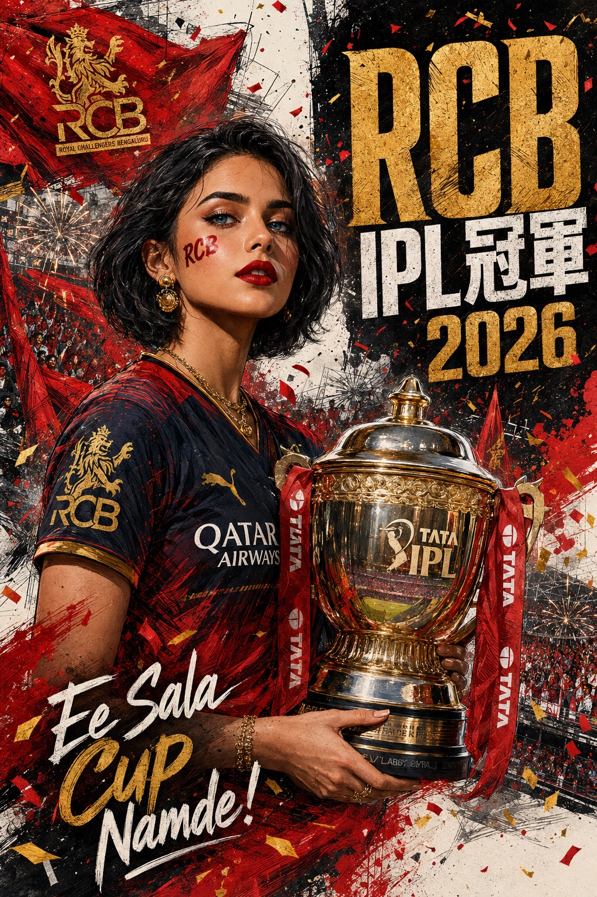

**來源：** [@AIwithkhan](https://x.com/AIwithkhan/status/2061305471492096301)

**提示詞：**

```text
Ultra-detailed mixed-media sports poster featuring the SAME woman from the reference image, wearing a Royal Challengers Bengaluru (RCB) jersey, holding the IPL trophy beside her. Dynamic fusion of realistic portrait photography, sketch art, watercolor splashes, paint strokes, ink scribbles, and digital painting effects. Explosive red, black, gold, and white color palette. Dramatic championship atmosphere with confetti, fireworks, cheering stadium crowd, RCB flags waving in the background, paint splatter textures, hand-drawn line art accents, and energetic brushwork.

The woman has a confident expression, bold red lipstick, flawless skin, short black bob haircut, cinematic lighting, ultra-sharp blue eyes, premium sports-fashion styling. RCB face paint on cheek, luxury gold jewelry accents, highly detailed jersey fabric.

Large typography on the right side reading:

RCB
IPL CHAMPIONS
2026

Handwritten slogan at bottom left:

Ee Sala Cup Namde!

Premium championship poster design, trending Behance artwork, sports magazine cover aesthetic, layered paint textures, realistic trophy reflections, high contrast, ultra-detailed, 8K, masterpiece, award-winning digital art, vibrant colors, cinematic composition, splash art, sketch effect, watercolor effect, paint explosion effect, mixed-media illustration, poster-worthy design.
```

***

<a name="case-487"></a>

### 例 487：法式藥妝商業分鏡封面

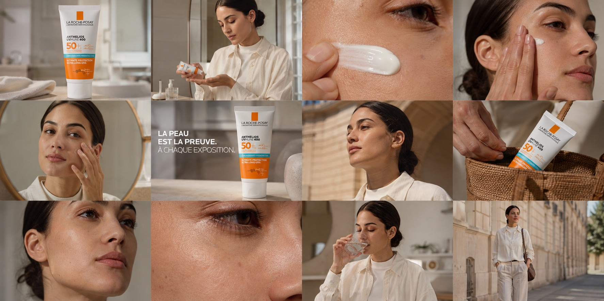

**來源：** [@AIwithSynthia](https://x.com/AIwithSynthia/status/2061300623530942922)

**提示詞：**

```text
35mm anamorphic, 2.39:1, no flares. Ultra-realistic international French pharmacy skincare commercial for La Roche-Posay Anthelios UVMune 400 Hydrating Cream SPF50+. Soft premium music plus tactile realistic sound effects throughout. Rich warm natural grain, premium but not over-polished. Palette: warm ivory whites, soft stone neutrals, signature La Roche-Posay orange, subtle clinical cyan-blue, sunlit beige, realistic warm skin tones. The tube is iconic. The skin is the proof. Every shot builds toward the moment the product disappears into real skin and protection becomes confidence. Fast cuts, macro intimacy, tactile realism, one quiet transformation that feels earned: sunscreen that looks invisible, breathable, and real.

MODEL / WARDROBE

Use the same female model consistently across all shots, matching the approved character sheet: slim natural model proportions, warm medium skin tone, dark brown hair in a clean low bun, refined oval face, natural brows, realistic under-eye detail, subtle lips, minimal makeup. Same face, same hairstyle, same body structure, same skin tone, same wardrobe continuity throughout.

Wardrobe must be modest, elegant, and fully covered. No exposed body, no tank top, no fitted clothing, no cleavage, no bare shoulders, no body-hugging silhouette. Wardrobe: loose cream linen button-up shirt, full sleeves, fully buttoned or layered over a high-neck white inner top, soft beige trousers only if visible, minimal jewelry, refined French pharmacy skincare styling. Clothing should feel premium, breathable, clean, and international, never sensual, revealing, or fashion-body-focused.

The camera may show hands, face, neck-up portrait, shoulders, waist-up, mirror shots, bathroom ritual shots, and outdoor walking lifestyle shots, but the body must not be emphasized. Keep attention on skin texture, hands applying sunscreen, product packaging, morning ritual, and confident protected face.

SKIN REALISM

Skin must look human and unfiltered: visible pores, peach fuzz, tiny fine lines, slight under-eye texture, natural skin tone variation, realistic facial micro texture, matte-hydrated finish. No glossy skin, no oily shine, no wet-look face, no waxy AI skin, no porcelain smoothing, no glam beauty filter, no fake glow.

PRODUCT REFERENCE

Use the exact La Roche-Posay Anthelios UVMune 400 Hydrating Cream SPF50+ product reference: white tube, orange square logo, black La Roche-Posay typography, orange SPF50+ panel, light blue hydrating cream band, orange lower panel, white pump-cap base. Product shape and color blocking must remain consistent.

MUSIC DIRECTION

Soft elegant premium skincare music throughout: gentle piano, airy ambient pads, subtle low-end warmth, very light modern electronic pulse, calm emotional lift. Music should feel expensive, dermatological, trustworthy, and international. Never loud, never dramatic, never trailer-like, never distracting. The music should support the tactile sound design without overpowering it.
```

***

<a name="case-488"></a>

### 例 488：屋頂球場日落人像

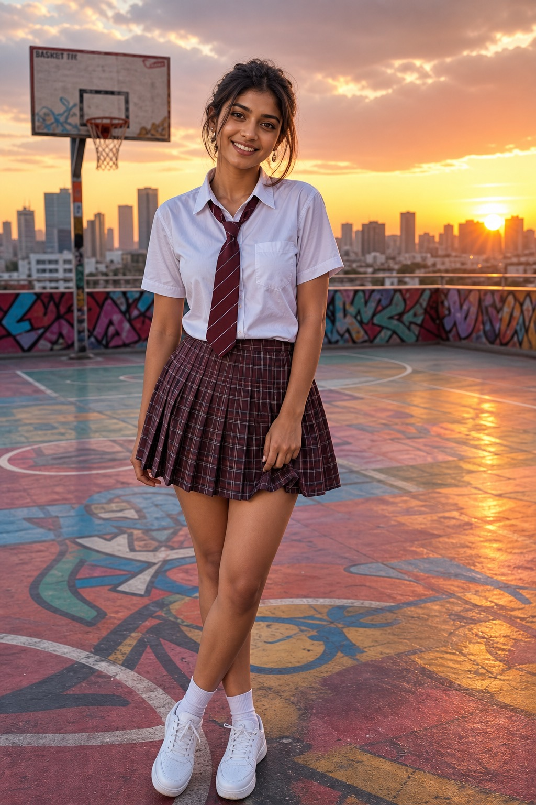

**來源：** [@HaniaAi12](https://x.com/HaniaAi12/status/2061313477696954522)

**提示詞：**

```text
Ultra-realistic, high-quality portrait of a stylish young South Asian woman standing gracefully on a colorful urban rooftop basketball court at sunset. She is standing in a relaxed and elegant posture with her weight naturally shifted to one leg, shoulders relaxed, and one hand gently resting by her side while the other lightly touches the edge of her varsity jacket. Her body is slightly angled toward the camera, creating a confident yet sophisticated appearance. She is looking directly into the camera with a warm, natural smile, projecting confidence, charm, and effortless style.
```

***

<a name="case-489"></a>

### 例 489：城市地圖微縮旅行海報


**來源：** [@SimplyAnnisa](https://x.com/SimplyAnnisa/status/2062358269172101240)

**提示詞：**

```text
Create a highly detailed cinematic miniature tilt-shift travel scene of [CITY NAME] featuring a realistic [VEHICLE NAME] driving along a winding elevated road that emerges naturally from a printed vintage-style city map. The road should curve dramatically toward the background skyline and landmarks of [CITY NAME], while the vehicle remains the clear focal point in the foreground.

Blend the real city seamlessly with the illustrated map surface so the road appears integrated into the map itself. Include recognizable local landmarks, waterways, architecture, vegetation, and atmosphere associated with [CITY NAME], but keep the composition clean and uncluttered.

Show large bold typography of "[CITY NAME]" printed directly on the map in the foreground. Use warm golden-hour lighting, shallow depth of field, realistic textures, cinematic shadows, aerial perspective, and photorealistic detail. The overall aesthetic should feel like a premium Instagram travel poster mixed with a miniature diorama.

Aspect ratio 1:1.
```

***

<a name="case-490"></a>

### 例 490：雙重曝光時尚肖像

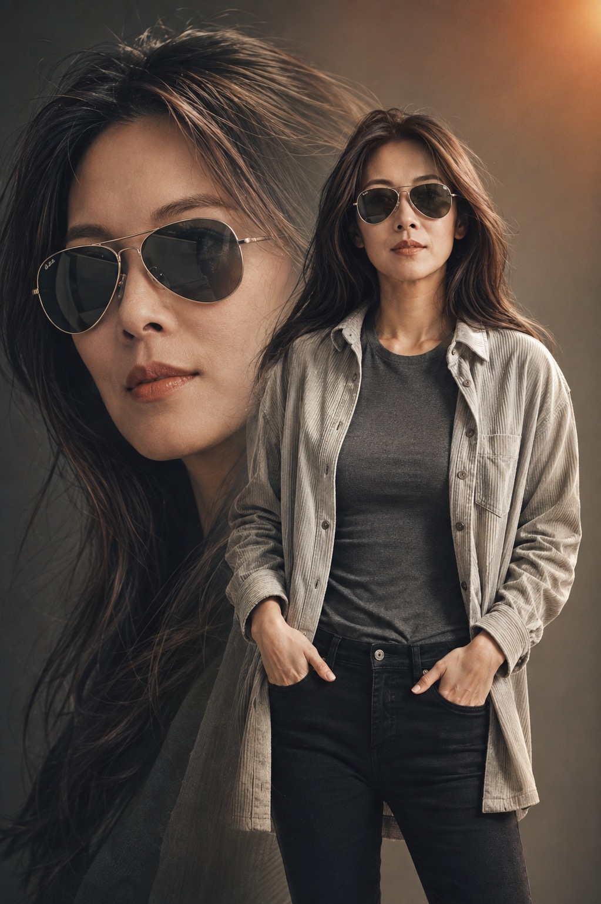

**來源：** [@Anaya_Ai12](https://x.com/Anaya_Ai12/status/2062191518975508678)

**提示詞：**

```text
A cinematic double-exposure fashion portrait featuring a woman with the uploaded face used 100% as reference, wearing stylish metallic aviator sunglasses. The composition artfully blends a large, semi-transparent close-up profile of her face on the left with her full-body figure standing confidently on the right. She wears an open, light-grey textured corduroy shirt layered over a dark grey fitted t-shirt and dark denim jeans, posing naturally with her hands in her pockets. She has long, flowing dark hair, flawless skin, elegant feminine features, and a confident, sophisticated expression.

The background is a minimalist neutral studio setting, allowing the double-exposure composition to remain the visual focus. The color grading features a sophisticated warm desaturated sepia and charcoal palette, enhanced by a soft golden-orange light-leak flare in the upper-right corner. Professional 85mm lens photography with high-contrast yet soft cinematic lighting accentuates the fabric textures, facial details, and layered portrait effect.

Ultra-realistic skin texture, luxury fashion-editorial aesthetic, premium magazine-cover quality, subtle film grain, cinematic depth, elegant shadows, refined color grading, modern retro-inspired styling, masterpiece composition, ultra-sharp focus, visually striking storytelling, high-end commercial fashion campaign look.
```

***

<a name="case-491"></a>

### 例 491：Y2K 高樓浴室鏡面自拍

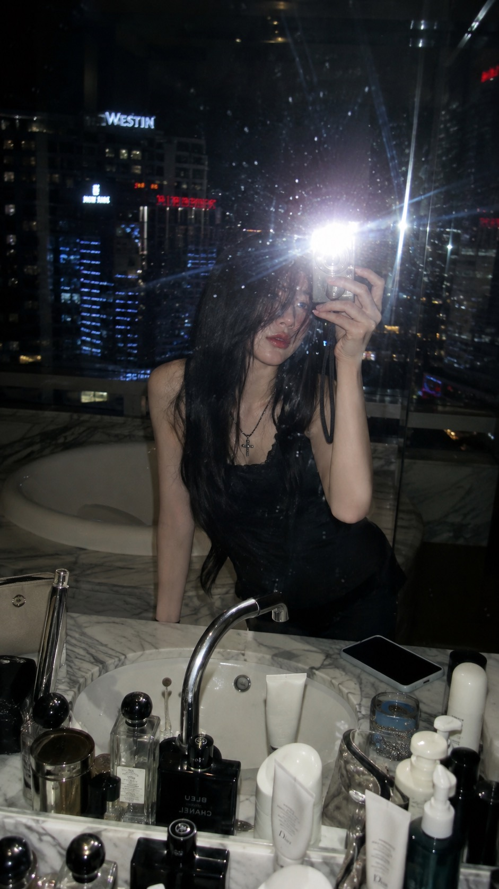

**來源：** [@jzaib4269](https://x.com/jzaib4269/status/2062184740849930384)

**提示詞：**

```text
A moody late-night mirror selfie captured in a luxury high-rise bathroom overlooking a glowing city skyline. A young woman with long, slightly messy black hair leans forward over a marble sink, partially obscuring one eye with loose strands. The photo is taken through a smudged mirror with visible dust particles, water spots, and imperfections, creating an authentic raw aesthetic. A powerful direct camera flash explodes in the frame, producing harsh highlights, lens flare, and a nostalgic early-2000s digital camera look.

The bathroom counter is cluttered with luxury cosmetics, skincare products, jewelry, a smartphone, and everyday personal items, adding a lived-in editorial feel. Reflections of neon-lit skyscrapers and hotel windows shimmer in the background, emphasizing an urban nightlife atmosphere. Soft pale skin tones contrast against dark clothing and black hair. The composition feels intimate, candid, and effortlessly cool.

Style: Y2K flash photography, candid mirror selfie, Korean editorial aesthetic, indie sleaze, hotel bathroom scene, luxury lifestyle, cinematic nightlife, disposable camera look, grainy texture, flash burn, realistic skin texture, shallow depth of field, authentic imperfections, viral Pinterest mood, high-fashion casual energy, raw unfiltered photography.

Camera: direct flash, compact digital camera, 35mm equivalent, harsh lighting, slight motion blur, visible noise, natural color grading, vertical composition, ultra-realistic, high detail.
```

***

<a name="case-492"></a>

### 例 492：黑色高定酒店套房寫真

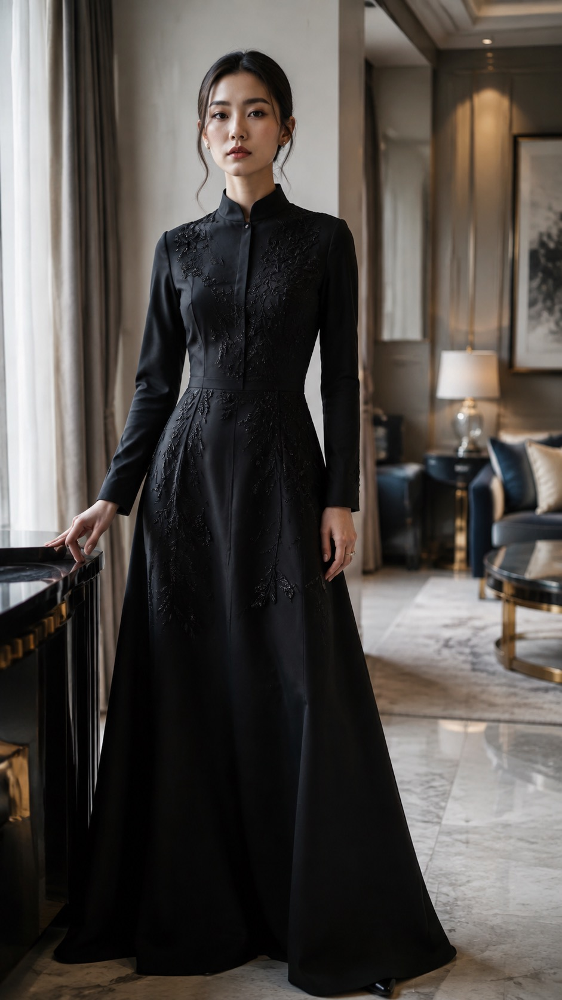

**來源：** [@xRahultripathi](https://x.com/xRahultripathi/status/2062100757923733617)

**提示詞：**

```text
Create a hyper-realistic luxury fashion portrait inspired by premium fashion-week editorials.

IMPORTANT:
Generate ONLY ONE SINGLE VERTICAL IMAGE.

STYLE:
Luxury fashion realism.
Professional couture photography.
Premium editorial atmosphere.

MAIN CONCEPT:
A beautiful adult Asian fashion model photographed inside a luxury hotel suite.

OUTFIT:
Elegant black couture mini dress.
Luxury embroidered details.
Premium designer fashion aesthetic.

BACKGROUND:
Luxury hotel interior.
Soft neutral decor.
Elegant cinematic depth blur.

LIGHTING:
Soft luxury window lighting.
Professional fashion-editorial reflections.
Natural skin texture.

MOOD:
Bold.
Elegant.
High-fashion energy.

QUALITY:
Ultra realistic native 4K HDR realism.
Professional magazine quality.
Vertical 9:16.
```

***

<a name="case-493"></a>

### 例 493：東京旅行 13 格影片封面

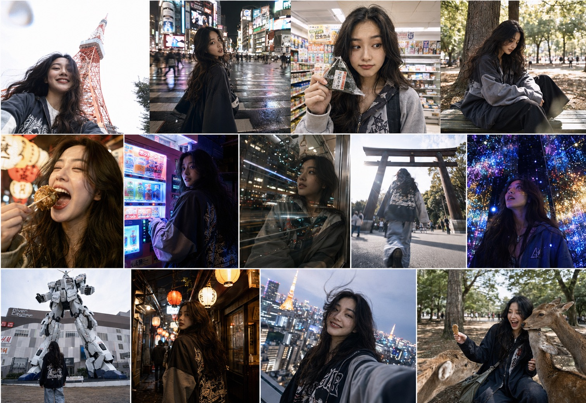

**來源：** [@AIwithSynthia](https://x.com/AIwithSynthia/status/2062383568253505904)

**提示詞：**

```text
Generate image of young female travel vlogger exploring Tokyo across multiple candid moments, extremely beautiful with long dark wavy hair, wearing stylish Japanese-inspired oversized streetwear, expressive and spontaneous personality, captured across a 13-frame grid collage (Row 1: 4 frames | Row 2: 5 frames | Row 3: 4 frames), each frame feels like a real casual phone capture with imperfect framing and natural inconsistencies.

Frame Breakdown

Row 1 - Frame 1 (Tokyo Tower): low angle selfie with Tokyo Tower behind her, slightly tilted horizon, sky overexposed to near white, she's mid-natural smile adjusting into frame, small lens smudge in corner, candid arrival energy.
Row 1 - Frame 2 (Shibuya street level): walking through Shibuya crossing at night, handheld motion blur, she glances back at camera mid-step, neon reflections on wet pavement, slightly shaky framing, imperfect crop.
Row 1 - Frame 3 (Convenience store): inside a brightly lit convenience store, she is holding onigiri close to camera, playful raised eyebrows, harsh fluorescent lighting flattening the scene, slight overexposure on whites, shelves softly blurred behind.
Row 1 - Frame 4 (Yoyogi park): sitting on a bench under trees, looking away from camera, quiet candid moment, soft dappled daylight, slight focus miss on eyes, subtle lens smudge bottom corner.
Row 2 - Frame 5 (Takoyaki reaction): close-up while eating single takoyaki, reacting mid-bite with laughter, slight motion blur, warm lantern light behind, face slightly out of focus due to movement.
Row 2 - Frame 6 (Vending machine night): standing in front of glowing vending machine, blue and pink light casting uneven tones on her face, pressing button casually, high ISO grain visible.
Row 2 - Frame 7 (Train reflection): her face reflected in train window at night, city lights streaking behind, layered reflection effect, slight ghosting on glass, she looks away from camera.
Row 2 - Frame 8 (Torii gate): low angle shot of her walking through a torii gate, captured from slightly behind, motion blur in her movement, bright sky causing mild lens flare.
Row 2 - Frame 9 (Digital art exhibit): inside immersive light exhibit, colored lights (blue, violet, gold) washing across her face, she looks upward in awe, slight motion blur, low-light noise visible.
Row 3 - Frame 10 (Gundam statue): low angle wide shot, she stands small in frame while large statue towers above, slight barrel distortion from phone lens, sky slightly blown out.
Row 3 - Frame 11 (Lantern alley): walking through narrow alley lit by warm lanterns, shot from behind, she glances back briefly, underexposed shadows, grainy night detail.
Row 3 - Frame 12 (Rooftop skyline): selfie with Tokyo skyline behind, arm extended, wind blowing hair partially across lens, horizon slightly tilted, warm city glow overexposed in distance.
Row 3 - Frame 13 (Nara park): crouching down in a park in Nara, she holds out a deer cracker toward a deer, the deer bows its head toward her, she bursts into genuine laughter mid-reaction, surprised and slightly leaning back, another deer nudges her from behind causing her to lose balance slightly, camera captures the moment imperfectly with slight shake and off-center framing, soft natural daylight, open park background with trees and space, unscripted chaotic energy, candid expression.

Young female travel vlogger exploring Tokyo across 13 candid moments in a grid collage, extremely beautiful with long dark wavy hair, wearing stylish Japanese streetwear, expressive and spontaneous, scenes include Tokyo Tower selfie, Shibuya crossing at night, convenience store snack moment, park bench quiet scene, takoyaki reaction, vending machine glow, train window reflection, torii gate walk, immersive light exhibit, Gundam statue low angle, lantern alley walk, rooftop skyline selfie, Harajuku street ending, each frame slightly imperfect with motion blur.
```

***

<a name="case-494"></a>

### 例 494：電動巴士工程資訊圖表

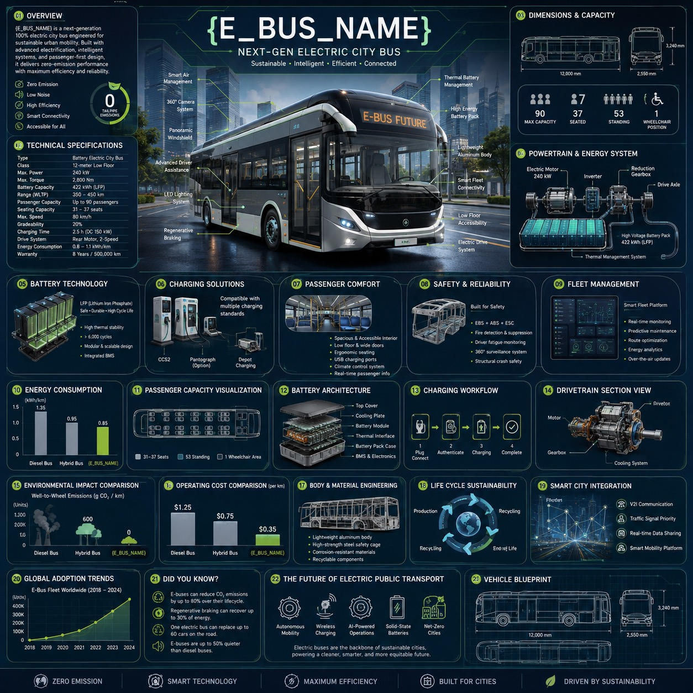

**來源：** [@j_smeaton99](https://x.com/j_smeaton99/status/2062365258984177766)

**提示詞：**

```text
Create a premium square “reference-style sustainable transportation infographic” centered around a futuristic electric city bus called the {E_BUS_NAME}, designed as a beautifully curated urban-mobility handbook page rather than a commercial vehicle advertisement.

The composition should feel like a modern visual encyclopedia mixed with an elite public-transit engineering guide and high-end editorial infographic system.

Visual Direction

• 1:1 square composition
• Premium smart-city background with subtle transportation blueprints, circuit-inspired overlays, and urban infrastructure schematics
• Elegant palette using deep navy, graphite black, electric green, steel gray, and soft cyan accents
• Refined editorial typography hierarchy
• Rounded modular information cards with clean spacing
• Gentle realistic reflections and premium transit-system dividers
• Minimal transportation engineering iconography
• Extremely detailed central electric bus render viewed in dramatic three-quarter perspective driving through a futuristic smart-city boulevard
• Thin precision annotation lines pointing toward key systems and technologies
• Clean, organized “knowledge-first” layout with high information density but breathable spacing

Main Subject Presentation

A stunning ultra-detailed realistic render of the {E_BUS_NAME} placed at the center, featuring:

• sleek aerodynamic body design
• panoramic windshield
• illuminated destination display
• low-floor accessibility layout
• futuristic LED lighting systems
• premium electric drivetrain details
• realistic urban reflections
• smart-city transportation realism

Surround the bus with engineering callouts explaining:

• battery pack technology
• electric motor system
• regenerative braking system
• charging infrastructure compatibility
• smart fleet management systems
• passenger accessibility features
• thermal battery management
• energy-efficiency technologies
• safety monitoring systems
• intelligent driver assistance features

Include Modular Sections

• E-Bus Overview
• Technical Specifications
• Vehicle Dimensions & Capacity
• Powertrain & Energy System
• Battery Technology Breakdown
• Charging Solutions
• Passenger Comfort Features
• Safety & Reliability Systems
• Fleet Management Technology
• Environmental Impact Analysis
• Operating Cost Comparison
• Construction & Material Engineering
• Sustainability Lifecycle Assessment
• Smart-City Integration
• Global Adoption Trends
• “Did You Know?” Facts Section
• Future of Electric Public Transport

Add Premium Visualization Modules

• battery architecture diagrams
• charging workflow graphics
• energy-consumption charts
• passenger-capacity visualizations
• smart-city integration maps
• drivetrain cutaway illustrations
• environmental impact comparisons
• fleet-management dashboards
• vehicle blueprint dimensions
• lifecycle sustainability graphics

Style Keywords

“premium transportation encyclopedia”
“editorial electric mobility handbook”
“high-end public transit infographic”
“scientific transportation poster”
“museum-quality electric bus reference page”
“modular smart-city knowledge system”
“clean engineering editorial design”
“ultra-detailed mobility visualization”
“future transportation showcase”
“sustainable urban mobility design”

Avoid

• generic vehicle advertisements
• cluttered commercial brochure layouts
• cartoon transportation styling
• unrealistic flying-bus concepts
• excessive cyberpunk neon overload
• low-detail stock-vehicle renders

Final Goal

The final result should resemble a professionally published transportation-engineering reference-book page created for urban planners, transportation engineers, sustainability researchers, architects, public-transit authorities, and smart-city enthusiasts, combining technical accuracy, sustainability insights, and premium editorial design.
```

***

<a name="case-495"></a>

### 例 495：巴黎街頭故事書插畫

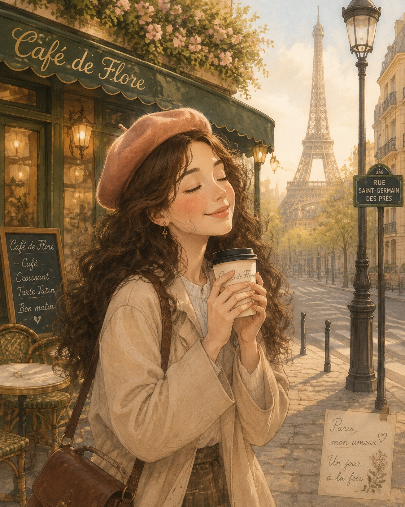

**來源：** [@MissDelulu9](https://x.com/MissDelulu9/status/2062376738500526347)

**提示詞：**

```text
Portrait illustration in a storybook style featuring a young adult woman exploring the streets of Paris. She is laughing happily with her eyes closed, holding a coffee cup in her hand. She has long, wavy hair and wears a beret hat. The scene is set near a Parisian café in a peaceful morning atmosphere. The woman has a sweet, charming smile. Soft, dreamy mood, romantic Paris street vibe, gentle lighting, and highly detailed artwork.
```

***

<a name="case-496"></a>

### 例 496：水雕品牌 Logo 六宮格

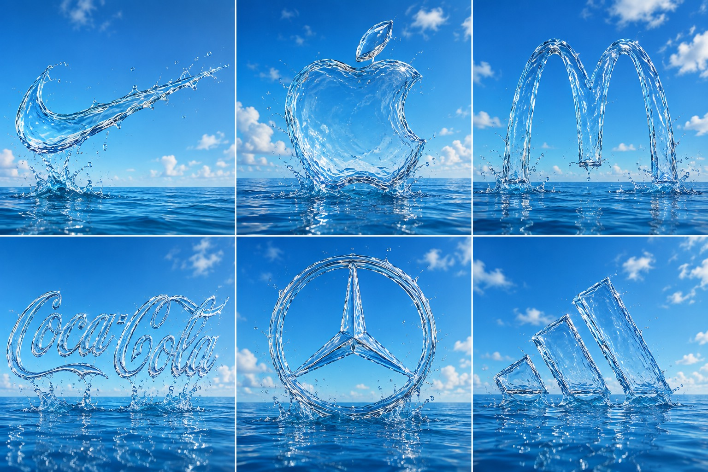

**來源：** [@AIwithSynthia](https://x.com/AIwithSynthia/status/2062521441141088599)

**提示詞：**

```text
Create a premium 3x2 grid collage of iconic global brand logos recreated entirely from dynamic water formations, floating above a crystal-clear ocean under a vibrant blue sky. Each panel features a different logo sculpted from realistic transparent water, with detailed splashes, droplets, reflections, refractions, and flowing liquid textures. The water forms should look physically accurate, elegant, and instantly recognizable while remaining made completely of water.
```

***

<a name="case-497"></a>

### 例 497：單色水彩城市旅行海報

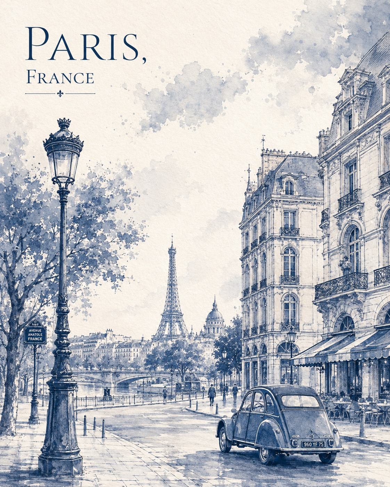

**來源：** [@Goodmanprotocol](https://x.com/Goodmanprotocol/status/2062564327140503787)

**提示詞：**

```text
Minimalist vintage watercolor travel poster illustration of [CITY NAME], [COUNTRY], rendered entirely in elegant monochromatic [COLOR] watercolor and fine ink linework.

Aspect ratio: 4:5 vertical composition optimized for poster and social media presentation.

A peaceful early-morning streetscape featuring the iconic [PRIMARY LANDMARK] and [SECONDARY LANDMARK/LOCATION] in the foreground, viewed from a slightly low pedestrian-level perspective. Historic local architecture, elegant facades, ornate details, arched windows, decorative cornices, and traditional street elements line the spacious surroundings, creating a timeless urban atmosphere. A classic [LOCAL STREET ELEMENT OR LAMP STYLE] stands prominently on the left side, while mature leafy trees frame portions of the scene, their foliage painted with soft watercolor washes and delicate splatter textures. In the distance, [DISTANT LANDMARK OR SKYLINE FEATURE] rises gracefully against the skyline, serving as a recognizable cultural landmark. A vintage [LOCAL VEHICLE] or a few small pedestrians add subtle life and scale without disturbing the tranquil mood.

The composition includes large areas of clean white negative space, soft cloudy watercolor textures in the sky, delicate paper grain, and subtle watercolor blooms. The paving, street, or plaza stretches dramatically across the foreground, leading the viewer’s eye toward the landmark ensemble. Typography in the upper-left corner reads “[CITY NAME], [COUNTRY]” in a refined serif font, styled like a sophisticated travel journal or collectible city poster.

Handcrafted watercolor illustration, architectural sketch aesthetic, serene urban atmosphere, soft natural morning lighting, muted monochromatic palette, highly detailed line art, elegant travel-poster design, minimalist luxury wall-art style, timeless local charm, premium stationery illustration, ultra-detailed, high-resolution, clean composition, Pinterest-worthy, Instagram-worthy, gallery-quality artwork.
```

***

<a name="case-498"></a>

### 例 498：鉛筆畫背景 3D 分身

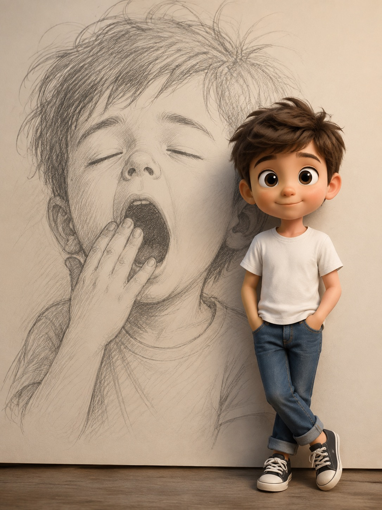

**來源：** [@AIwithkhan](https://x.com/AIwithkhan/status/2062567518389391540)

**提示詞：**

```text
Create a handrawn pencil illustration of [image] yawning on paper, as background.

Add a 3D Pixar style render of [foto] standing casually infront of the giant handrawn pencil illustration. Soft cinematic lighting. 8K resolution. 3:4 ratio
```

***

<a name="case-499"></a>

### 例 499：極簡精品店全身時尚寫真

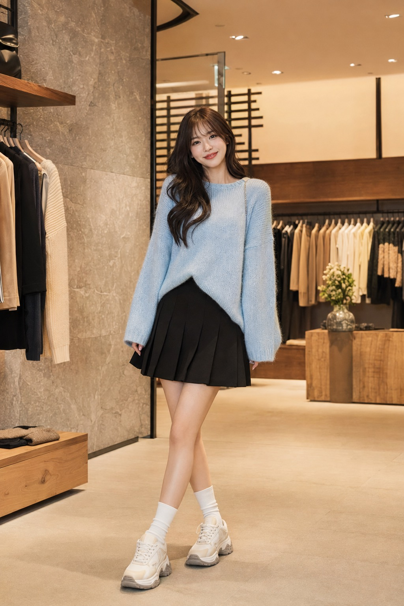

**來源：** [@john_my07](https://x.com/john_my07/status/2062579742759649486)

**提示詞：**

```text
A full-body editorial fashion photograph of a beautiful young woman with the same appearance as the reference, long glossy dark hair, soft bangs, fair skin, and refined feminine features. She stands casually in an upscale minimalist fashion boutique, wearing an oversized pastel-blue knit sweater paired with a black pleated tennis-style skirt, white crew socks, and chunky designer sneakers. Relaxed confident pose, gentle smile, luxury retail interior with modern clothing racks, neutral-toned garments, warm ambient lighting, wood and stone textures, clean architectural lines, cinematic depth of field, realistic lighting, premium fashion advertising, Vogue-style editorial, ultra-detailed, sharp focus, photorealistic, 4K.
```

***

<a name="case-500"></a>

### 例 500：夢幻花冠仙境肖像

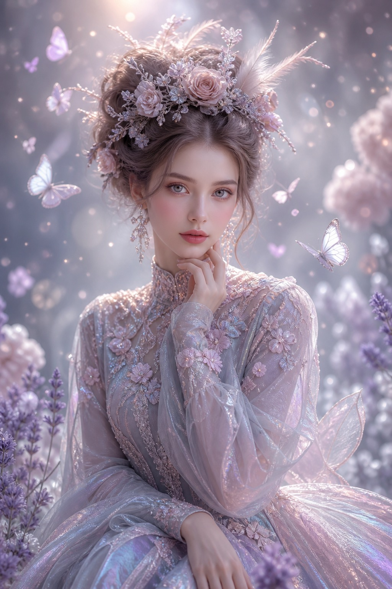

**來源：** [@HaniaAi12](https://x.com/HaniaAi12/status/2062696495741391006)

**提示詞：**

```text
Ultra-realistic ethereal fantasy portrait of a breathtaking young woman with delicate porcelain skin, soft grey-blue eyes, and natural rosy lips. She gazes gently toward the viewer with a serene, dreamy expression, her fingertips lightly touching her chin. Wispy ash-brown hair flows softly in the breeze, styled in a loose romantic updo adorned with pastel blush roses, shimmering crystal ornaments, delicate feathers, and intricate floral accessories. She wears elegant dangling crystal earrings and a translucent, flowing gown made of sheer iridescent fabric embroidered with tiny sparkling flowers.

The scene is bathed in soft diffused morning light, creating a luminous glow around her face and shoulders. Surrounded by floating butterflies, sparkling dust particles, translucent petals, and dreamy floral textures, the background blends pastel lavender, pearl white, blush pink, and silver tones. Cinematic fine-art photography, fairycore aesthetic, enchanted garden atmosphere, magical realism, ultra-detailed skin texture, soft focus highlights, volumetric lighting, bokeh, masterpiece quality, highly detailed, 8K resolution, delicate feminine beauty, romantic fantasy artwork, elegant composition, dreamy color grading, soft glow, celestial ambiance.
```

***

<a name="case-501"></a>

### 例 501：夏日牽手回眸電影肖像

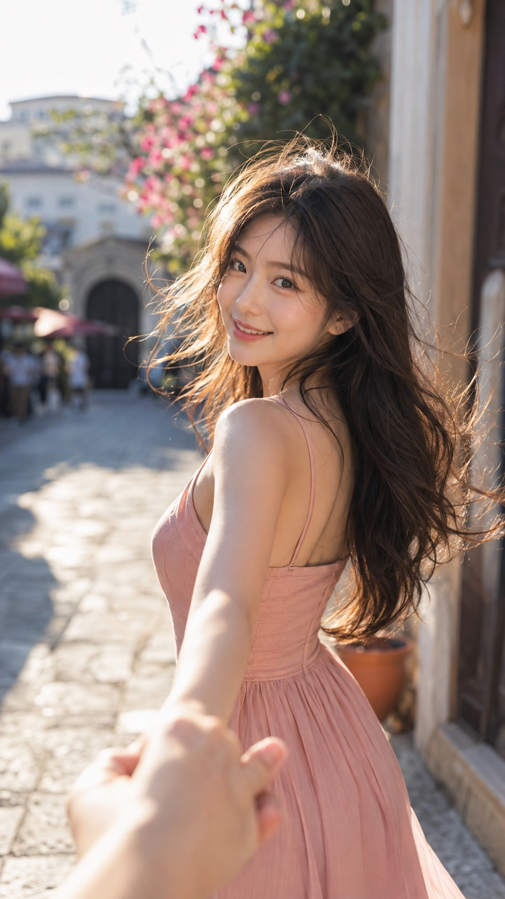

**來源：** [@iamaiistudio](https://x.com/iamaiistudio/status/2063247373388992790)

**提示詞：**

```text
Cinematic portrait photography, ultra-photorealistic, 2160x3840 vertical composition, 50mm or 85mm portrait lens rendering, shallow depth of field, clean translucent summer natural-light color grading — not overly yellow, not over-filtered.

Subject: a young beautiful adult East Asian woman, [describe face shape and features, e.g. soft heart-shaped face, refined classical features, bright almond/fox eyes, petite nose bridge, naturally full lips], overall vibe sweet, sunny, energetic, cute with a touch of allure. Gaze highly engaging — bright, clear, natural catchlights, as if it speaks; corners of mouth slightly lifted, expression gentle, vivid, natural.

She walks along a [scene, e.g. garden stone path / tree-lined lane / European street / courtyard], right hand reaching back to hold the hand of someone behind her; only their hand appears in the lower-left corner — like a first-person couple's POV snapshot. She glances back at the camera while her body stays in a forward walking motion, posture elegant and natural, clearly a candid captured moment with a faint in-love feeling.

Long [hair color] hair, [style, e.g. naturally wavy / relaxed big waves / airy bangs / half-up], many strands tousled and flying in the wind, richly layered and dynamic. Strong natural side-backlight rims the hair edges — clean, crisp rim light and semi-translucent glow, hair edges lit as if by sunlight, light and luminous. This is the core highlight of the image.

She wears [outfit, e.g. white lace slip dress / beige slip dress / light-blue short-sleeve top with white skirt / light-pink fitted dress], fabric texture natural, material light and soft. Bright natural summer sunlight realistically warms her skin, shoulders, collarbone, and clothing with soft, clean highlight transitions.

Skin texture: extremely realistic — visible fine pores, natural skin texture, faint imperfections, subtle tone variation, soft sheen. Cheeks, nose tip, shoulders show natural delicate gradations in sunlight. Translucent, healthy, real and refined — no plastic look, no waxwork, no over-smoothing.

Background: soft atmospheric blur, never distracting.

Avoid: over-smoothing, plastic skin, CG look, anime look, wig look, stiff expression, dead eyes, stiff poses, overall yellow cast, overexposed face, distorted features, wrong fingers, deformed hands, cluttered background, heavy influencer retouching.
```

***

<a name="case-502"></a>

### 例 502：黑桃國王遞迴撲克牌

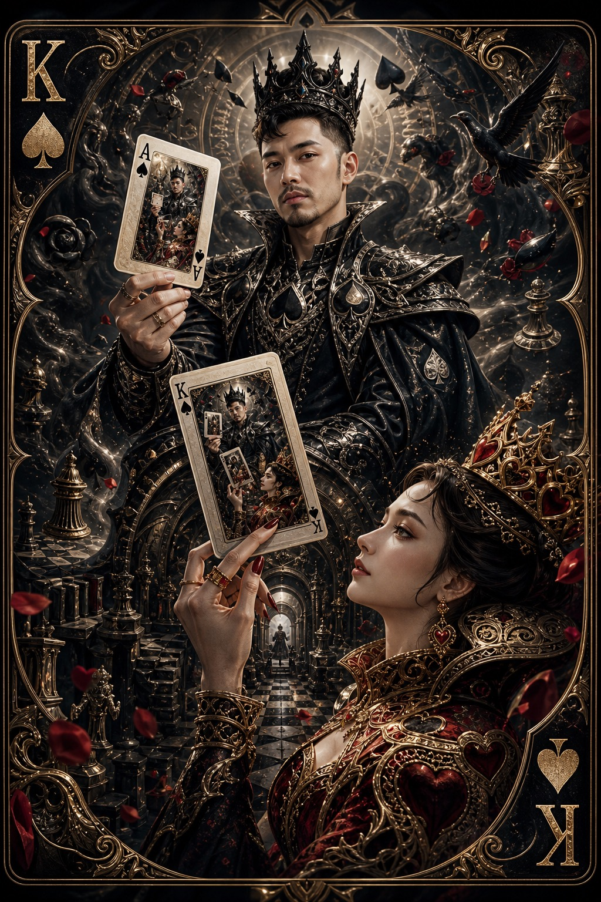

**來源：** [@Professor_134](https://x.com/Professor_134/status/2063244295977800057)

**提示詞：**

```text
Use my uploaded face image as the primary identity reference. Preserve my exact facial identity with extremely high fidelity: identical facial structure, jawline, cheekbones, eye shape, eyebrows, nose, lips, beard pattern, hairstyle, hair texture, skin tone, skin texture, and overall recognizable appearance. Do not beautify, alter, or reinterpret my face. Maintain realistic anatomy and authentic likeness.

Create an ultra-detailed, cinematic, surreal luxury playing-card artwork.

The main subject is me as the King of Spades, occupying the full design of a magnificent, royal Ace-quality playing card. I wear elaborate black-and-silver spade-themed regalia, a crown forged from obsidian and polished steel, intricate embroidered armor, and flowing royal garments decorated with subtle spade symbols. My expression is calm, intelligent, and powerful.

In my right hand, I am holding a pristine Ace of Spades card.

The creative twist: the Ace of Spades I am holding is not a normal card. It contains another complete playing-card illustration. Inside that card, I again appear as the King of Spades, and that entire card is being elegantly held between the fingers of a majestic Queen of Hearts. The Queen is graceful, regal, and visually striking, dressed in rich crimson and gold royal attire adorned with heart motifs.

The illusion continues with subtle recursive storytelling: the Queen of Hearts appears to be examining the card with fascination, creating a “card within a card” visual paradox. The composition should feel like a legendary tale of power, strategy, love, and destiny intertwined.

Add impossible Escher-inspired visual design elements:
•Infinite recursion effect
•Card-world folding into itself
•Floating spade and heart symbols transforming into ravens and rose petals
•Ornate golden borders extending beyond physical card edges
•Royal chess pieces suspended in midair
•Fractal patterns hidden within the card engravings
•Elegant smoke forming suit symbols
•Dimensional portals emerging from card corners

Style: ultra-realistic fantasy realism mixed with luxury casino art, Renaissance royal portraiture, and modern cinematic concept art.

Lighting: dramatic chiaroscuro, volumetric god rays, rich contrast, glowing metallic highlights, subtle magical energy around the Ace of Spades.

Color palette:
•Deep blacks
•Silver chrome
•Ivory white
•Crimson red
•Antique gold accents

Composition:
•Vertical masterpiece
•Museum-quality detail
•Hyper-realistic textures
•Intricate card engravings
•Perfectly symmetrical playing-card aesthetics blended with cinematic depth
•Sharp focus on my face
•Extremely high identity fidelity
•Epic storytelling through visual symbolism

The final image should feel like the cover of a legendary fantasy card game where the King of Spades has become self-aware, existing across multiple layers of reality while being held in the hands of fate itself, represented by the Queen of Hearts.
```

***

<a name="case-503"></a>

### 例 503：霓虹設計師 3D 海報

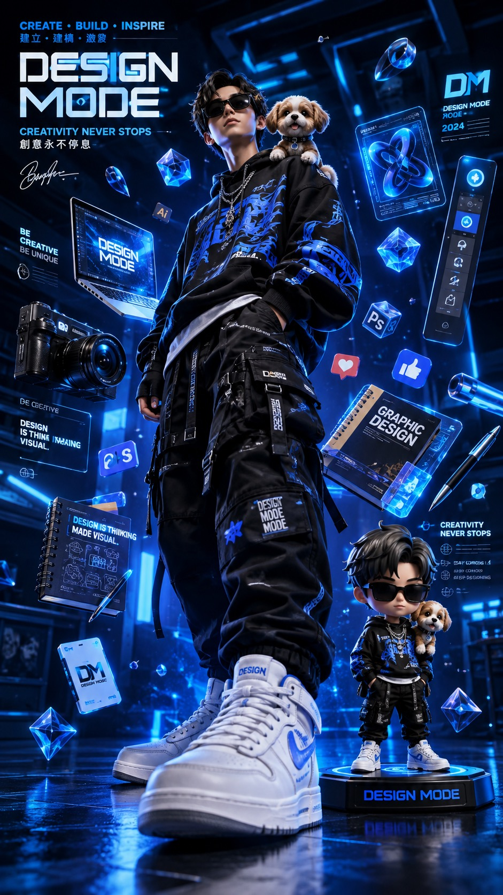

**來源：** [@AiwithLariab](https://x.com/AiwithLariab/status/2063240283786187251)

**提示詞：**

```text
Create an ultra-detailed 3D stylized creative designer poster featuring a cool young digital artist standing confidently in the center of a futuristic blue neon studio. The character wears oversized black streetwear with electric-blue graphic accents, black cargo pants, layered silver chains, black sunglasses, and clean white sneakers. A cute fluffy puppy sits on the artist's shoulder. The camera angle is dramatic low-angle perspective, making the sneakers appear larger for a premium poster effect.

Surround the character with floating creative elements including a glowing laptop, professional camera, design books, notebooks, 3D icons, social media symbols, holographic UI panels, graphic design tools, and futuristic blue geometric shapes. Add motivational typography such as "DESIGN MODE", "CREATE • BUILD • INSPIRE", and "CREATIVE NEVER SLEEPS" integrated into the scene.

Include a collectible chibi mini-figure version of the character standing beside the main subject on a display base. Use cinematic blue lighting, glossy reflections, volumetric glow, depth of field, floating particles, luxury toy-photography aesthetics, high-end 3D rendering, Octane Render quality, ultra-sharp details, vibrant neon blue color palette, futuristic creator workspace atmosphere, premium commercial poster design, trending ArtStation style, masterpiece quality, 8K resolution, vertical 9:16 composition.
```

***

<a name="case-504"></a>

### 例 504：粗糙塗鴉人像改圖

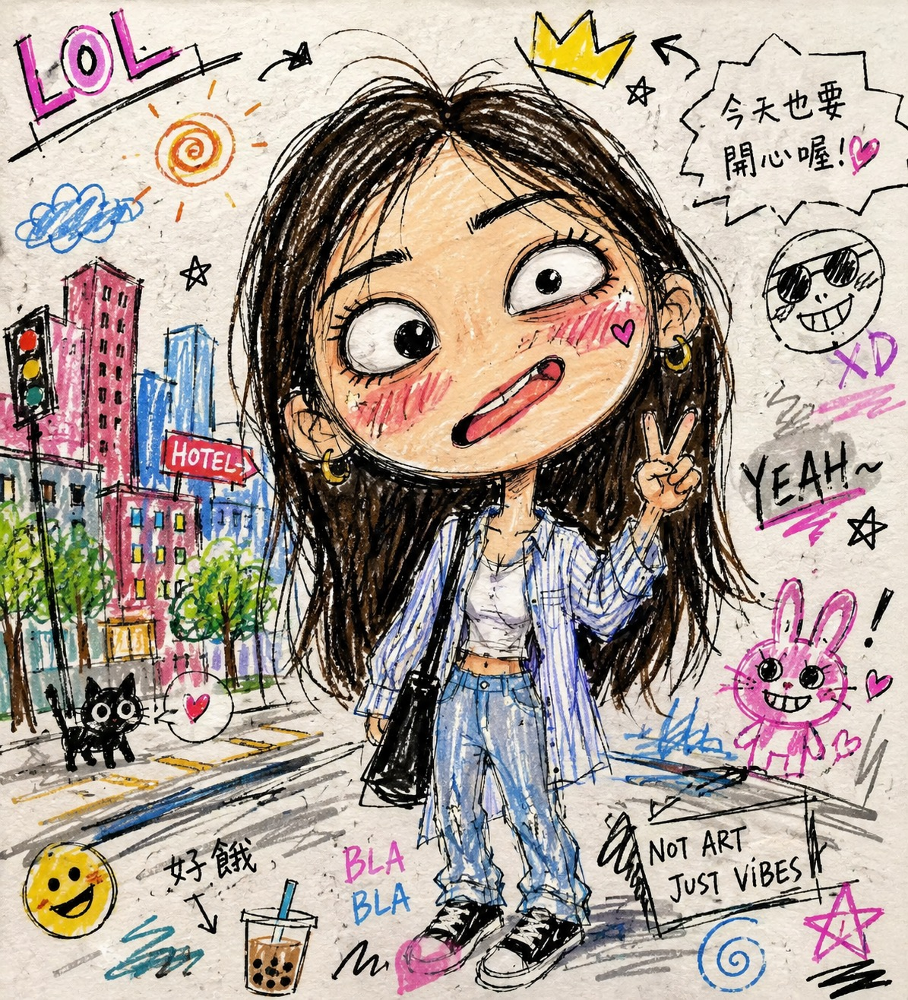

**來源：** [@Shorelyn_](https://x.com/Shorelyn_/status/2063235707632533954)

**提示詞：**

```text
Turn this photo into a chaotic funny doodle illustration, intentionally messy and low-skill, as if drawn quickly with a cheap marker, crayon, or worn-out felt pen on paper.

Create exaggerated facial features with awkward proportions, uneven eyes, oversized head, tiny body, crooked smile, and clumsy anatomy while still keeping the person recognizable. Use rough childish sketch lines, shaky hand-drawn strokes, visible scribbles, overlapping outlines, accidental marks, and random doodles around the scene. Add a simple cartoon-style background with badly drawn buildings, trees, clouds, street elements, and uneven perspective. Coloring should look careless and imperfect, with visible stroke texture, inconsistent fill areas, wax crayon texture, marker bleed, and irregular shading. Include playful imperfections like crossed-out lines, unfinished details, random arrows, tiny notes, stars, swirls, and abstract scribbles. Overall aesthetic should feel humorous, spontaneous, handmade, energetic, goofy, and intentionally unpolished, resembling a child's sketchbook mixed with absurd internet meme art. High texture detail, paper grain visible, asymmetrical composition, awkward framing, expressive doodle chaos, raw sketch energy.
```

***

<a name="case-505"></a>

### 例 505：夜間手機光沙發肖像


**來源：** [@iamaiistudio](https://x.com/iamaiistudio/status/2063231612478017579)

**提示詞：**

```text
A young adult woman with soft refined features, thin metal glasses, and shoulder-length dark tousled hair, leaning forward across a dark upholstered couch at night. She wears a pale cream lace-trim camisole with thin straps and matching soft shorts. One hand holds a smartphone close to the foreground, the screen glow casting cool reflections on her fingers and glasses lenses. Her expression is dreamy and softly tired, eyes lifted toward the camera as if she just looked up from scrolling, lips gently closed in a relaxed pout.

Shot in a vertical 3:4 frame at slightly above eye level, medium close-up to three-quarter portrait. Warm dim tungsten room light mixed with cool phone-screen reflections, no flash, soft falloff across the couch and wall. Shallow depth of field, soft low-light grain, slight motion blur, natural imperfect sharpness. Background: plain beige-gray wall, minimal decor, late-night atmosphere. Soft glam makeup: subtle eyeliner, long lashes, smooth skin, glossy pink-nude lips. Realistic social-media night portrait aesthetic.
```

***

<a name="case-506"></a>

### 例 506：可愛髮卡圖文人像海報

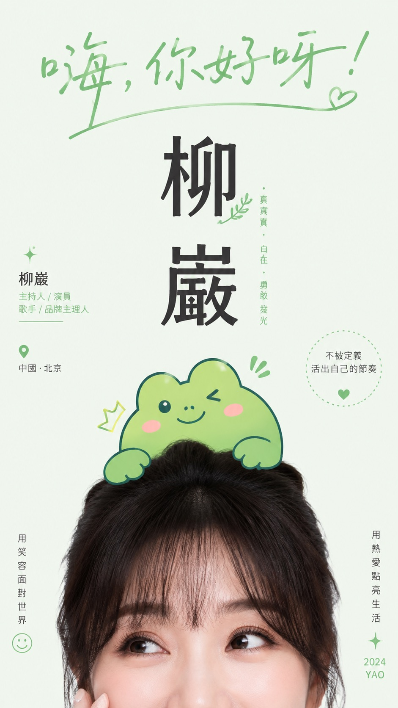

**來源：** [@xiaoxiaodong01](https://x.com/xiaoxiaodong01/status/2062924832917029248)

**提示詞：**

```text
圍繞具體主題內容生成一張明亮清爽的圖文合成視覺：畫面以大面積高明度純淨色場承託主體，背景平整、通風、沒有複雜景深，視覺重心由下方被大膽裁切的人像或真實主體建立，只露出最有記憶點的局部，使主體像從畫面邊緣進入。主體上方疊放一個極簡圖形符號或擬物角色，它要像輕輕坐在主體頭頂或貼合輪廓生長出來，形體圓潤、邊緣乾淨、表情或結構由少量粗線完成，兼具標識感和親近感。文字是畫面的主動角色：頂部使用大號手寫感標題，字距松、筆畫柔軟，像一句輕聲招呼；中心用更強的豎向或軸向標題建立層級；邊緣安放少量小字號資訊，保持安靜但精確，讓空白繼續佔主導。色彩從主題自身的材質、情緒、地域或品牌語義中提取，對映為明亮底色、潔淨主體亮面、清晰深色結構線與少量強調資訊色，保留大面積輕快底場、小面積高對比文字線條、自然主體暗部的關係；整體保持高明度、清透、乾淨、飽和度清晰而不過度刺激，暗色只用於結構和閱讀，不製造髒灰、煙霧或陳舊質感。攝影局部與扁平圖形之間要形成真實與童趣的反差，邊緣疊壓準確，陰影極少，完成感像城市公共宣傳與角色插畫結合的輕鬆視覺系統。

主題：柳巖

比例9:16
```

***

<a name="case-507"></a>

### 例 507：暖調鉤織角色玩偶

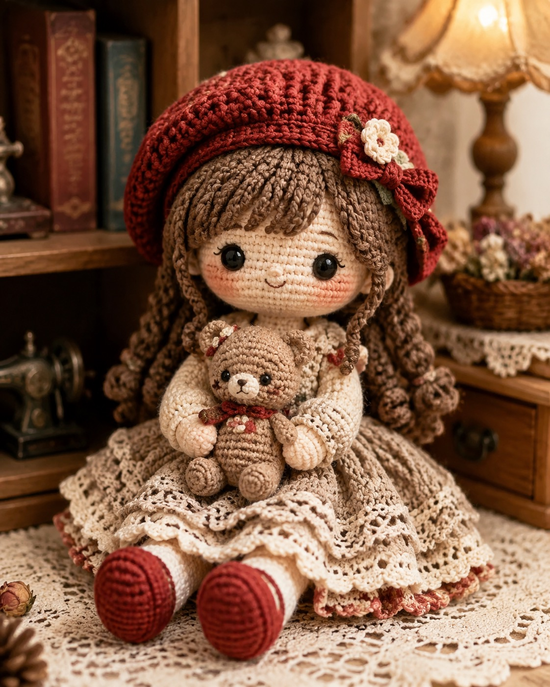

**來源：** [@azed_ai](https://x.com/azed_ai/status/2067925399947067728)

**提示詞：**

```text
A handcrafted crochet doll of a [subject], made with soft yarn textures and intricate knitted details. Dressed in a vivid [color1] accent and a delicate [color2] garment, holding a small [prop]. Set in a cozy [setting], warm muted atmosphere, charming handmade aesthetic, nostalgic amigurumi style.
```

***

<a name="case-508"></a>

### 例 508：木漏日庭院俯拍貓咪人像

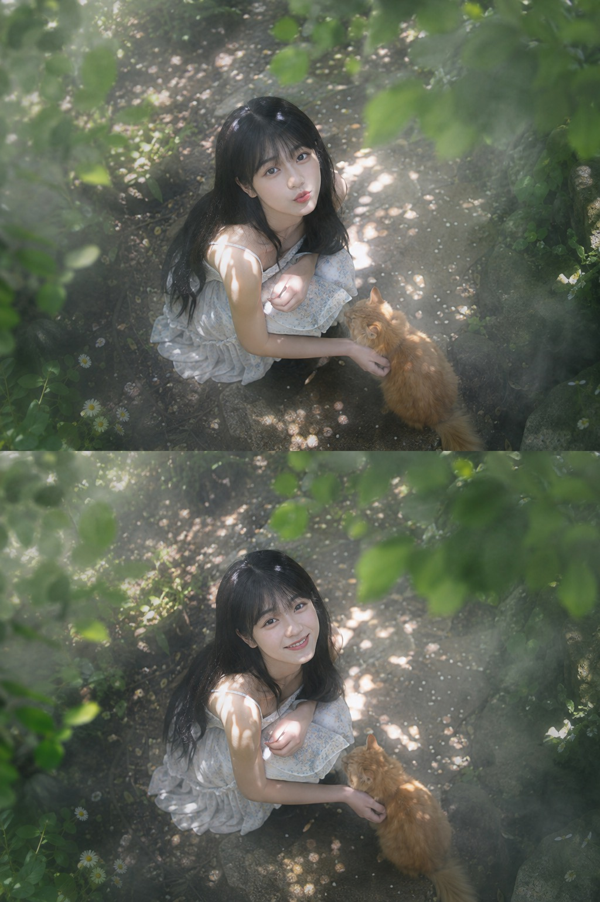

**來源：** [@ohmuyi](https://x.com/ohmuyi/status/2067930690977779942)

**提示詞：**

```text
俯拍鏡頭，高角度頂機位，自上而下俯瞰一位年輕的東亞裔女性，她有著精緻的東亞五官和柔順的黑髮。她蹲在花園小徑上，輕輕逗弄一隻毛茸茸的橘貓。頭頂密密的枝葉濾過陽光，形成靈動的“木漏日”效果——躍動、圓形的光斑在她的肌膚和貓毛上流轉舞動。空氣中懸浮著淡淡的潮溼薄霧，捕捉住光束，營造出柔和可見的立體光柱（丁達爾效應）。當她仰頭朝向鏡頭時，一層輕霧柔化了畫面邊緣，增添夢幻氛圍。她的表情從略帶俏皮的輕噘嘴，漸漸轉為眼角堆起細紋的真摯笑容，斑駁的光線恰好勾勒出她肌膚的細膩紋理和眼中盈盈的水光。
```

***

<a name="case-509"></a>

### 例 509：塗鴉拉衣奔跑棚拍

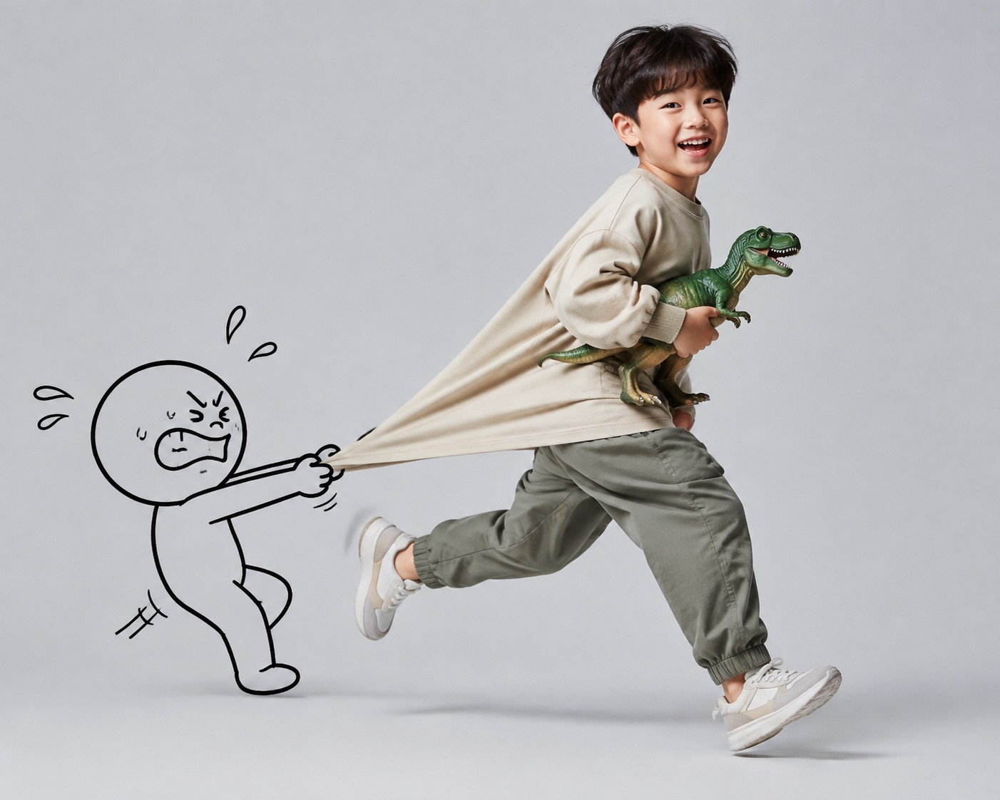

**來源：** [@Sairah_0](https://x.com/Sairah_0/status/2071929275897491491)

**提示詞：**

```text
A playful, high-key studio portrait of [subject] running joyfully across a seamless light gray background, captured mid-stride with one leg lifted and a wide genuine smile. The subject wears a casual oversized outfit with soft neutral tones (or vibrant colors), creating a dynamic sense of motion. Behind them, a simple black hand-drawn cartoon stick figure grabs and stretches the back of their shirt, making the fabric appear elastically pulled as if trying to stop them. The doodle character is integrated naturally into the scene with expressive motion lines and a humorous facial expression. The subject holds a fun prop (such as a dinosaur toy, oversized lollipop, teddy bear, or balloon), enhancing the playful storytelling. Minimalist composition, clean studio lighting, soft shadows, ultra-sharp focus, realistic skin texture, vibrant yet natural colors, whimsical editorial photography, premium children’s fashion campaign aesthetic, highly detailed, photorealistic, 8K.
```

***

<a name="case-510"></a>

### 例 510：Bichon Shop 擬物 App 圖示

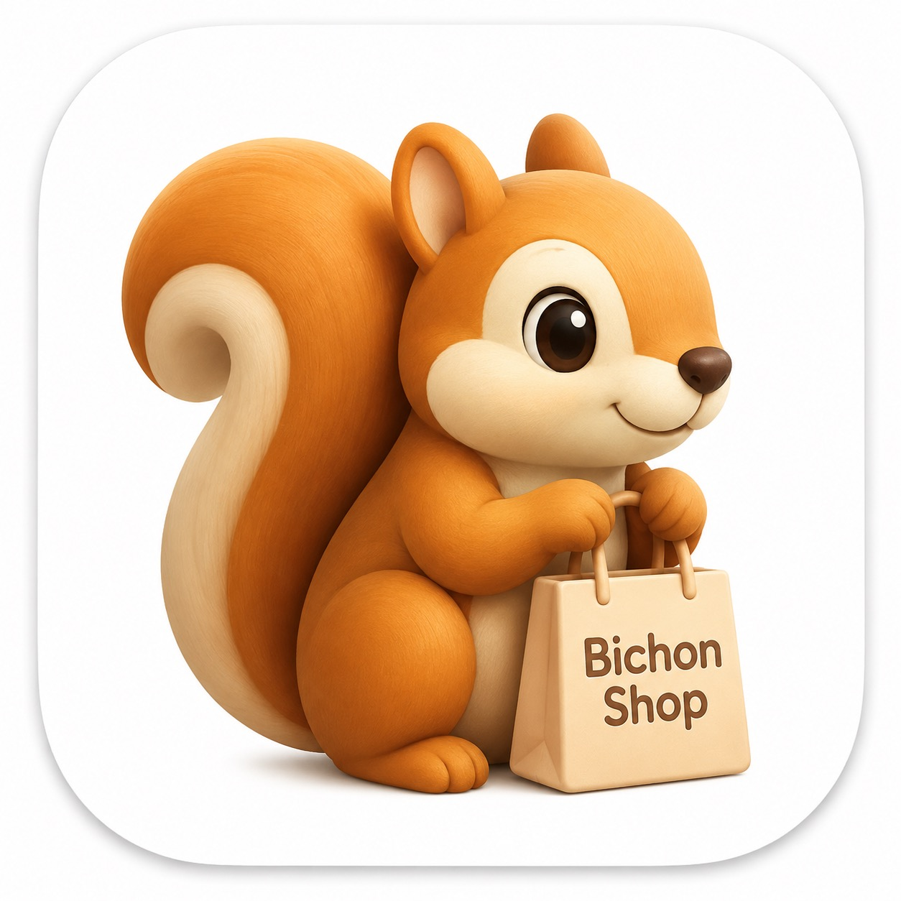

**來源：** [@iamaiistudio](https://x.com/iamaiistudio/status/2071923809788285125) / [full prompt](https://aiistudio.com/prompt/i2h-061/bichon-shop)

**提示詞：**

```text
A macOS app icon for an app named 'Bichon Shop'. A single squircle icon with smooth continuous rounded corners, centered on a white canvas with padding, occupying about 80% of the canvas. Modern light skeuomorphic macOS App Store style. Only one icon.
```

***

<a name="case-511"></a>

### 例 511：城市名地標排版旅行海報

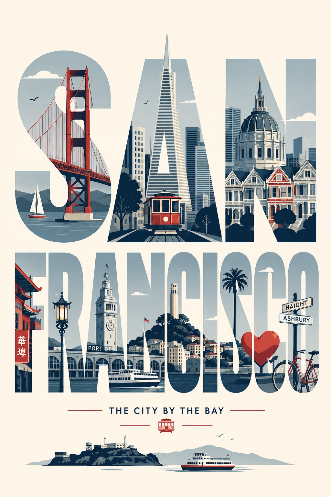

**來源：** [@Goodmanprotocol](https://x.com/Goodmanprotocol/status/2071819124708438092)

**提示詞：**

```text
Create a clean, modern typographic travel poster where the city name itself becomes the composition. Render the city name in large, bold, uppercase sans-serif letters spanning the width of the artwork. Seamlessly integrate the city's most iconic landmarks, architecture, monuments, streets, transportation, cultural symbols, cafés, bridges, parks, skylines, sculptures, waterfronts, historic buildings, and local details into, around, and inside the letters. Let landmarks naturally interact with the typography while preserving legibility.
Use an elegant flat vector illustration style with crisp geometric shapes, minimal detail, clean outlines, subtle shadows, and a premium editorial aesthetic. Maintain a limited color palette of deep navy, warm cream, muted red, and soft gray-blue for a timeless travel-poster look.
Add small decorative elements such as street lamps, trees, clouds, birds, benches, bicycles, fountains, trams, ferries, or other city-specific objects where appropriate. Keep generous negative space with a clean background and perfectly balanced composition.
Ensure every landmark, architectural style, vehicle, sign, and cultural element is accurate to the chosen city—avoid generic or incorrect landmarks. If desired, include a small elegant tagline beneath the city name (such as a famous nickname or slogan) in minimal typography.
Style: premium flat vector, minimalist travel poster, geometric illustration, editorial design, tourism branding, clean typography, high contrast, ultra-sharp lines, museum-quality print, modern graphic design, centered composition, scalable SVG aesthetic, 8K resolution.
```

***

<a name="case-512"></a>

### 例 512：Brutalist Freestyle 角色設定表

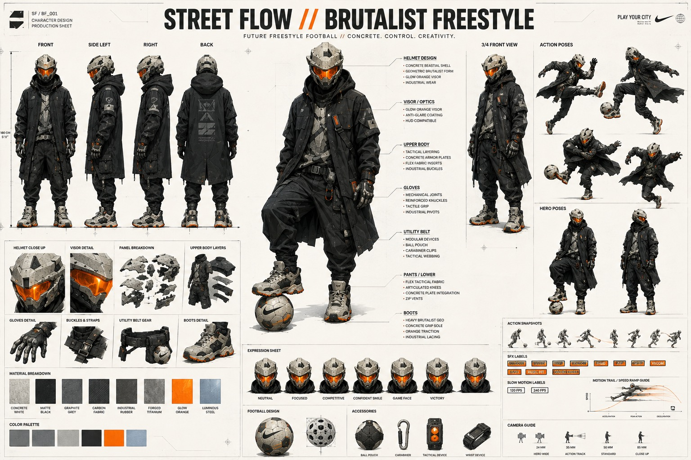

**來源：** [@ShamsAmin56](https://x.com/ShamsAmin56/status/2071590431725670517)

**提示詞：**

```text
Use the uploaded reference image as the primary character design reference, preserving the overall silhouette, proportions, futuristic apparel layering, helmet geometry, visor shape, stone-like brutalist armor surfaces, black hooded coat, tactical streetwear construction, gloves, boots, utility belt, and monochrome industrial aesthetic.

Create a premium production character sheet for a 2D stylized futuristic freestyle road soccer protagonist inspired by Brutalist architecture, industrial concrete textures, geometric forms, and minimalist sci-fi design language.  The presentation should resemble a AAA game character turnaround sheet mixed with a Nike commercial concept presentation.

The character should feel agile, stylish, confident, athletic, and built for urban freestyle football.  Maintain the concrete-textured helmet with glowing orange visor, oversized hood, tactical long coat, mechanical gauntlets, armored boots, and industrial detailing exactly as the design language.  The football should be integrated naturally into the presentation.  Minimal off-white background (#F7F5F0).

Professional production sheet layout.  Extremely clean linework.  Cinematic concept art.  Premium graphic design.  No photorealism.  High-end stylized illustration.  CHARACTER ANGLES Front View  Neutral hero pose.  Left Side View Right Side View Back View 3/4 Front View Dynamic Freestyle Pose  Standing on one foot while balancing the football.  Hero Pose  Football under foot.  Long coat flowing.  Confident posture.  CLOSE-UP CALLOUTS  Helmet Design  Orange illuminated visor  Concrete brutalist surface  Industrial wear  Panel breakdown  Upper Body  Coat construction  Buckles  Fabric folds  Armor integration  Mechanical Gloves  Finger articulation  Industrial joints  Material breakdown  Utility Belt  Equipment  Fasteners  Soccer accessory pouch  Boot Design  Heavy brutalist geometry  Street football grip  Orange illuminated sole accents  Football Design  Minimal futuristic street football  Concrete-inspired panel graphics  Orange accent details  MATERIAL CALLOUTS  Concrete Composite Armor  Carbon Tactical Fabric  Matte Black Nylon  Industrial Rubber  Forged Titanium Components  Orange Energy Lighting  COLOR PALETTE  Concrete White  Matte Black  Graphite Gray  Charcoal  Burnt Orange Glow  Dark Steel  EXPRESSION SHEET  Neutral  Focused  Competitive  Confident Smile  Game Face  Victory Expression  ACTION SILHOUETTES  Ball Juggle  Around The World  Elastico  Rainbow Flick  Backheel  Crossover  Street Sprint  Ball Stall  CAMERA CALLOUTS  Hero Shot Low Angle  Turnaround Orthographic  Close-up Macro Lens  Dynamic Pose 35mm Tracking Camera  Hero Pose 24mm Cinematic Lens  SFX LABELS  WHOOSH  SWISH  TAP  BOUNCE  THUD  ZIP  SPIN  SKRT  VROOM  RUSH  MUSIC HIT  CROWD CHEER  SLOW MOTION LABELS  120 FPS  240 FPS  Freeze Frame  Motion Trails  Speed Ramping  GUIDELINES  Maintain consistent proportions across all views.  Keep the brutalist design language consistent.  Emphasize concrete-inspired hard surfaces contrasted with flexible tactical fabrics.  Preserve the glowing orange visor as the primary focal point.  Use clean production callouts with arrows and labels.  Include measurement guides, material notes, and design annotations.  Keep presentation minimal and premium.  Avoid clutter.  Professional concept art quality suitable for AAA game development, cinematic production, and advertising pitch decks.  LAYOUT  16:9 Landscape  Top Center: MAIN TITLE STREET FLOW // BRUTALIST FREESTYLE  Below: Production Character Sheet  Center: Large Hero Character  Left: Front • Side • Back Views  Right: 3/4 View • Action Pose • Hero Pose  Bottom: Close-ups • Materials • Color Palette • Equipment • Football Design • Expressions • Camera Notes • SFX • Slow Motion • Production Annotations  Minimal off-white background with subtle grid guides, technical drawing arrows, clean typography, and premium commercial presentation quality.
```

***

<a name="case-513"></a>

### 例 513：單色點綴旅行手賬插畫

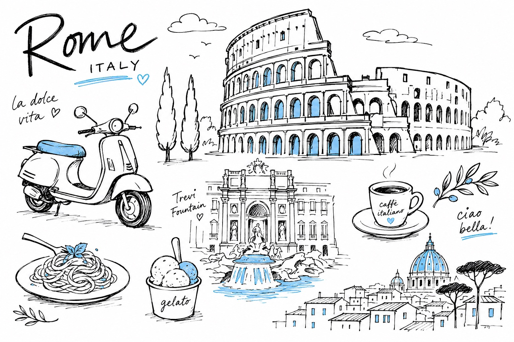

**來源：** [@Sairah_0](https://x.com/Sairah_0/status/2071779087396606433)

**提示詞：**

```text
Create a charming editorial travel illustration of {DESTINATION} in a simple hand-drawn doodled style, as if sketched by hand with a black felt-tip marker in a travel notebook. The illustration should feel personal, spontaneous, and imperfect rather than digitally designed. Think of the kind of drawing someone might casually create while sitting at a café after exploring the destination.** ## COLOR PALETTE Keep the illustration almost entirely black and white. Use **only one accent color: {ONE POINT COLOR}** ## STYLE Draw entirely with black felt-tip pen lines. Use slightly wobbly hand-drawn contours, natural line variation, loose marker strokes, sketch-like confidence, subtle imperfections, slightly open line endings, uneven hand pressure, and occasional overlapping strokes. Every line should clearly look handmade. Avoid perfectly smooth curves, mechanically precise outlines, polished vector graphics, or overly crisp digital rendering. ## SUBJECT Illustrate the unique atmosphere and instantly recognizable identity of **{DESTINATION}** rather than producing a realistic cityscape. Select the destination's most iconic landmarks, characteristic architecture, local transportation, famous scenery, native plants, local animals, regional food, and cultural objects. Focus on the spirit of the destination instead of literal accuracy. ## COMPOSITION Arrange the selected elements into a balanced editorial composition with generous white space. The layout should feel open, light, and effortless, similar to a designer's travel sketchbook. Allow objects to overlap naturally without becoming crowded. Every element should have room to breathe. Keep the composition visually relaxed and uncluttered. Apply the blue sparingly to selected details such as water, sky, windows, signs, clothing accents, decorative highlights, or small architectural features. Never introduce any additional colors. ## DRAWING STYLE Keep every object simple and intentionally simplified. Use flat shapes with minimal interior detail. Avoid realistic textures, gradients, shadows, painterly brushwork, glossy surfaces, or complex rendering. The illustration should remain clean, airy, understated, and highly graphic. ## LINE QUALITY The black marker lines are the main visual feature. Lines should feel confident, casual, lively, expressive, and naturally imperfect. Slightly uneven contours, open edges, variable line thickness, and small drawing inaccuracies are encouraged because they enhance the authentic hand-drawn feeling. ## MOOD Warm. Friendly. Relaxed. Playful. Minimal. Editorial. Contemporary. Elegant through simplicity. The finished artwork should resemble a beautifully designed travel notebook, boutique travel guide, editorial magazine illustration, or lifestyle sketchbook rather than a polished digital illustration. ## IMPORTANT No photorealism. No 3D rendering. No painterly effects. No gradients. No heavy shadows. No glossy lighting. No vector-clean artwork. No excessive detail. No busy composition. Preserve generous white space. Maintain a flat editorial doodle aesthetic with a distinctly handmade character. The final image should instantly evoke **{DESTINATION}** through simple, expressive black felt-tip sketches with subtle sky-blue accents.
```

***

<a name="case-514"></a>

### 例 514：硬邊現代藝術人像

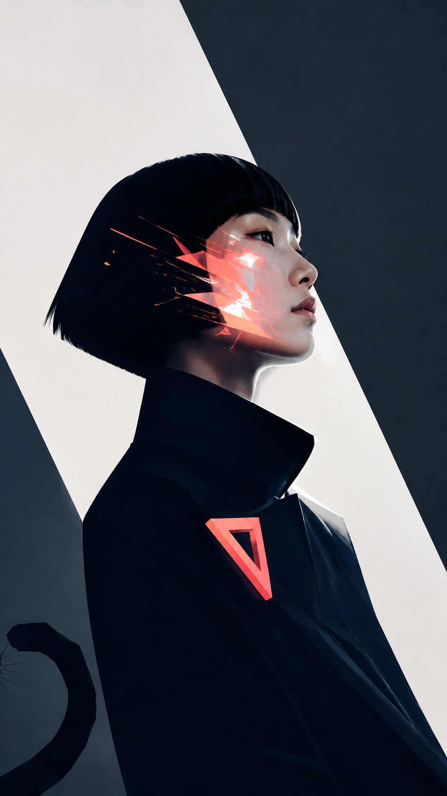

**來源：** [@SimplyAnnisa](https://x.com/SimplyAnnisa/status/2071783914595897555)

**提示詞：**

```text
A striking piece of hard-edge modern art on matte archival paper, with visible screen-printing layers and slight ink misalignment. A young East Asian woman is captured in a sharp, three-quarter profile. Her facial features are rendered with precise, crisp contours, contrasting with abstract, luminous geometric shapes that seem to emanate from within her skin. She wears a sleek, high-collared jacket in deep midnight blue, adorned with a single, bold neon coral brooch in the shape of a sharp triangle. Her dark hair is styled in a severe, architectural bob with blunt edges. Her expression is calm and detached, eyes gazing off-frame. The background is a clean, architectural space with sharp diagonal planes in crisp white and deep slate. High-contrast chiaroscuro lighting highlights the edges of her silhouette. Sophisticated palette: deep midnight blue, crisp white, electric neon coral. A stray cat tail is rendered as a sharp, geometric vector in the bottom left corner. Ultra-modern artistic style. No digital CGI feel.
dutch angle, stray cat tail --ar 9:16
```

***

<a name="case-515"></a>

### 例 515：Guadalajara 復古電影旅行海報

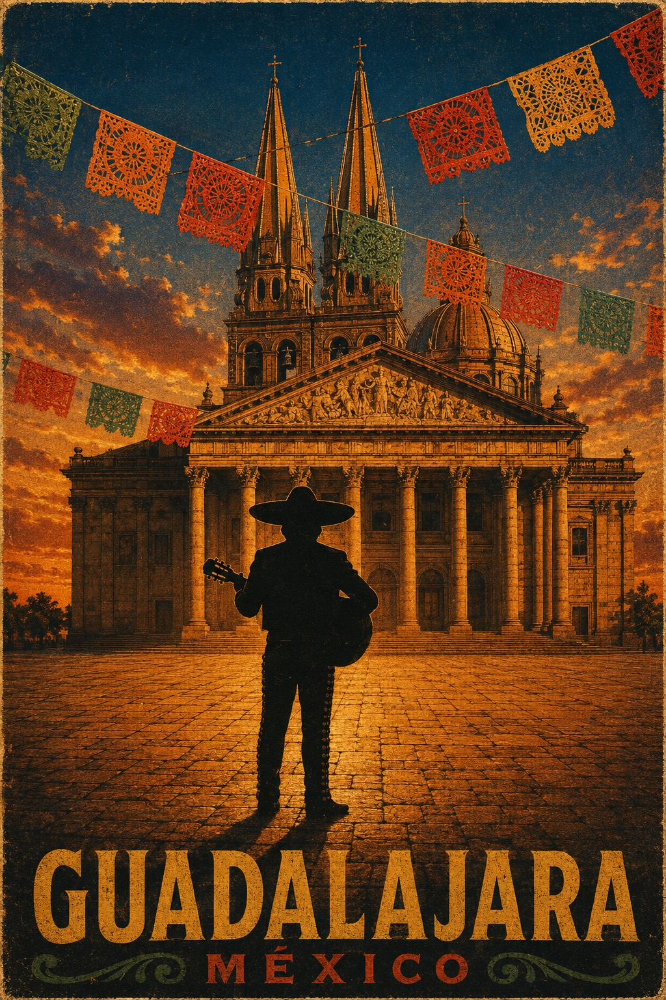

**來源：** [@MiMundoConIA](https://x.com/MiMundoConIA/status/2077046470335938826)

**提示詞：**

```text
@Crea una imagen {
  "style": "Cinematic Vintage Movie Poster — Guadalajara, Mexico",
  "target_tool": "DALL-E 3 (ChatGPT)",
  "prompt": "Generate a vertical portrait-format movie poster image, taller than wide in a 2:3 aspect ratio. The image is a cinematic vintage travel movie poster for Guadalajara, Mexico, rendered with the visual texture of an aged large-format film poster: heavy 35mm film grain throughout especially in the shadow areas, slightly faded and warm-shifted color tones as if printed on aged matte paper stock, a subtle halftone dot pattern visible in the midtones, and a very slight ink bleed at high-contrast edges giving it an authentic vintage printed poster feel. Foreground: a single dark silhouette of a lone mariachi musician standing still at the center-bottom of the frame, rendered as a pure clean dark silhouette with no facial features visible — traditional wide-brim charro sombrero, fitted traje de charro suit outline, holding a guitarrón — casting a long warm shadow across the honey-colored cantera stone paving of Plaza de la Liberación below, with colorful papel picado banners in red, orange, green and yellow cut tissue paper strung in loose diagonal lines overhead from building to building, swaying slightly, framing the upper composition, no people other than the single silhouetted figure, no vehicles, no modern objects. Midground: the grand honey-amber cantera stone neoclassical facade of the Teatro Degollado rising directly behind the silhouette, its ornate columned portico and triangular pediment warmly lit by the low golden-hour sun hitting from the left, long dramatic shadows stretching across the stone paving, the warm amber volcanic stone glowing intensely in the golden light. Background: the twin neo-Gothic spires of the Catedral Metropolitana de Guadalajara rising tall into the upper frame against a vast deep cerulean blue sky transitioning to burnt amber and deep orange near the horizon, a single scattered cloud catching violet and gold light from below, the cathedral facade in warm honey stone matching the Teatro Degollado's palette. Color grade: saturated warm amber and golden honey tones dominating the stone architecture, deep cobalt blue in the upper sky, rich burnt orange near the horizon, faded warm sepia in the shadow areas consistent with a vintage printed poster. At the very top of the image, centered above the spires, render the single word GUADALAJARA in bold condensed uppercase display serif letters in warm cream-gold with a faint dark drop shadow, leaving clear sky negative space for the title. No modern buildings, no cars, no utility wires, no people other than the single dark silhouette visible anywhere in the scene.",
  "target": "🎯 Target: DALL-E 3 (ChatGPT) — 💡 Foreground/midground/background separation places Teatro Degollado and the Cathedral in distinct spatial layers, the mariachi silhouette is specified as a featureless outline to eliminate aberration risk, and vintage print texture is described visually rather than as a style label."
}
```

***

<a name="case-516"></a>

### 例 516：工業橡膠管品牌造型渲染

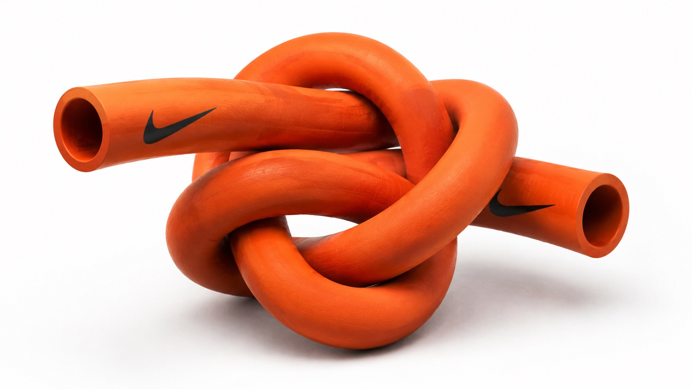

**來源：** [@Just_sharon7](https://x.com/Just_sharon7/status/2077034244988150062)

**提示詞：**

```text
Create an ultra-detailed hyper-realistic 3D render of {Object} , formed from thick industrial rubber tubing bent into the exact shape of the design, flexible yet dense structure, smooth rounded contours, subtle matte finish, realistic elastomer texture, faint molded seam lines, soft tension at each curve, authentic material compression and stretch behavior, slightly grippy surface quality, engineered object realism, colored using the authentic official brand color palette of [brand], faithful brand-matching hues applied across the tubing, accurate color blocking that follows the original logo design, premium studio product photography aesthetic, isolated on a pure white seamless background, soft diffused studio lighting, realistic contact shadow, macro detail, razor-sharp focus, photorealistic, 8k, 16:9, no watermark, no extra text.
```

***

<a name="case-517"></a>

### 例 517：杯內魚眼夏日冰飲廣告

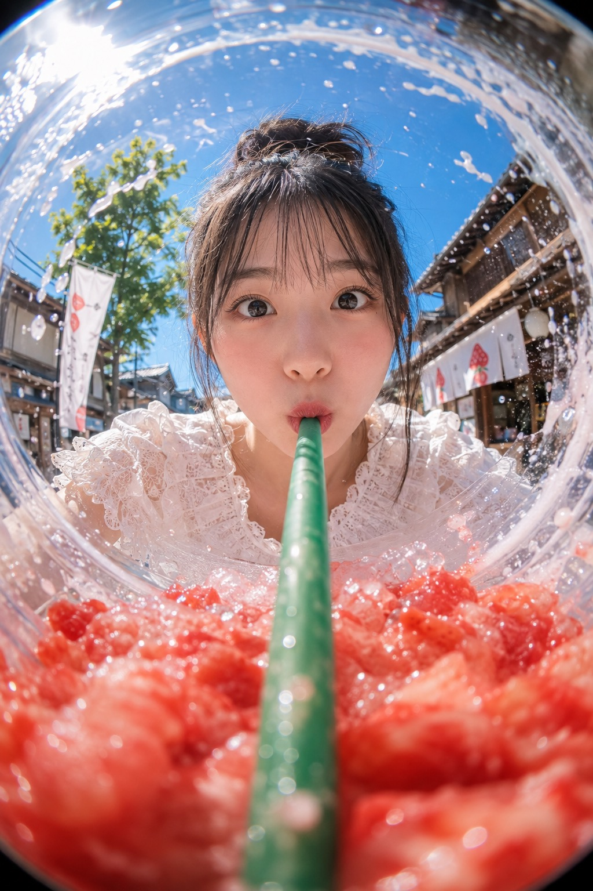

**來源：** [@lovimg_com](https://x.com/lovimg_com/status/2077036659028484375) / [full prompt](https://lovimg.com/image-prompts/7369/item-313)

**提示詞：**

```text
主題：
氷越しの夏

主體：
縦長2:3のリアル寫真。透明な大型プラスチックカップの內側から見上げるような超広角フィッシュアイ構図。畫面下半分いっぱいに赤いいちご果肉とクラッシュアイスが迫り、中央から太いグリーンのストローが奧へ一直線に伸びる。丸く歪んだカップの開口部の向こうに、女性の顔が中央に大きく収まる。

人物・表情：
自然で現実感のある若い女性。黒髪に近いダークブラウンの髪を高めのお団子にまとめ、薄い前髪と顔まわりの後れ毛が日差しで細く光っている。透明感のあるナチュラルメイク、淡いピンクの頬、つやのあるリップ。目を大きく開いてカメラをまっすぐ見つめ、唇を小さく丸めてストローをくわえている。少し驚いたような、可愛らしく無邪気な表情。

服裝・ポーズ：
白いレース素材のブラウス。首元と肩まわりに細かなフリルがあり、夏らしく軽い質感。人物はカップの向こう側に顔を近づけ、両肩は下部に少しだけ見える。ストローは人物の口元に自然に接觸し、奧から手前の赤い氷へ向かって強い奧行きを作る。

背景・光：
背景は晴れた夏の日の古い商店街。木造風の店先、かき氷屋の暖簾、苺柄の看板、白い小さな旗、街路樹が見える。文字はすべてぼかされた読めない裝飾として扱う。左上から強い太陽光が入り、透明カップの水滴、カップ縁、氷、赤い果肉に細かな反射とハイライトが出る。影は右下へ落ち、白いクリームの殘りがカップ內側にリング狀についている。

構図・カメラ：
カメラはカップの底付近、赤い氷のすぐ上に置いたような極端なローアングル。フィッシュアイレンズでカップの円形リムが大きく灣曲し、周囲の商店街も軽く歪む。畫面下45％は赤い氷と果肉の前ボケ、中央はストローと女性の顔、上部は青空とカップの透明な縁。ピントは女性の目と口元、手前の氷はきらめく淺いボケ。

質感・スタイル：
プロ用カメラで撮影した夏の広告寫真風。透明プラスチックの屈折、水滴の粒、氷の冷たさ、いちご果肉の瑞々しさを高精細に表現。青空、赤い氷、グリーンのストロー、白いブラウスの色の対比を鮮やかにする。肌は自然な質感を殘し、過度な美肌補正はしない。明るくポップで、少しユーモラスな日本の夏スイーツ寫真。

ネガティブ：
実在ブランドロゴ、読める文字、商標の再現、不自然な顔、不自然な視線、歯や唇の崩れ、ストローとの接觸不良、餘分な指、欠けた指、手足の融合、氷の浮遊、不自然な重力、誤った遠近法、光源と矛盾する影、文字化け、透かし、過度な美肌補正、プラスチックのような肌。
```

***

<a name="case-518"></a>

### 例 518：花田風動夏日人像

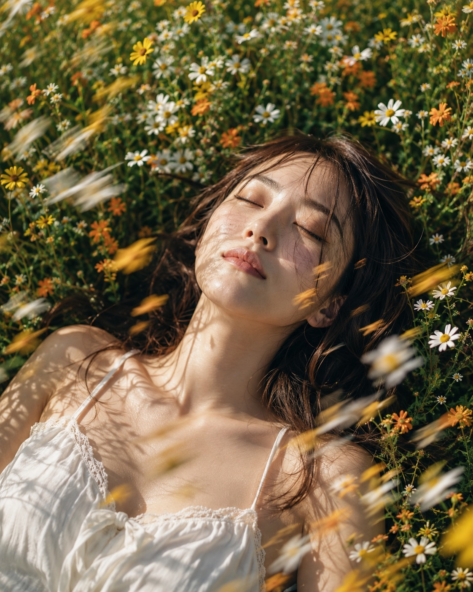

**來源：** [@lovimg_com](https://x.com/lovimg_com/status/2077036746198618336) / [full prompt](https://lovimg.com/image-prompts/7376/item-314)

**提示詞：**

```text
主題：
花風のまどろみ

主體：
縦長4:5の寫真風ポートレート。白と黃色のマーガレット、オレンジ色の小花が密に咲く夏の草花畑に、成熟した大人の女性が仰向けで靜かに橫たわっている。人物は畫面下部から中央にかけて大きく入り、顔は中央やや右、胸元から肩までは畫面下側に収まる。周囲の花が畫面全體を埋め、対角線方向に流れる花のモーションブラーが前景を橫切る。

人物・表情：
自然で現実感のある日系ポートレート。暗めのブラウンロングヘアに、薄い前髪と顔まわりのやわらかな毛束。目を閉じ、眉は力が抜け、唇は軽く閉じた穏やかな表情。頬と鼻先に自然な血色、肌には過度な補正をせず細かな質感を殘す。首筋、鎖骨、頬に夏の日差しが當たり、靜かに眠っているような落ち著いた雰囲気。

服裝・ポーズ：
白い夏用キャミソールワンピース。細い肩紐、胸元の控えめなレース、中央の小さなリボン、薄手のコットン素材。人物の両肩は草花に自然に沈み、片腕は畫面下側で花に隠れて見切れる。體は畫面左下から右上へ少し斜めに置かれ、髪は草の上に広がり、風で數本だけ額にかかる。

背景・光：
郊外にある小さな花畑のような、生活感のある自然な草花の密度。背景はすべて緑の葉と白・黃色・オレンジの花で構成し、人工物や読める文字は入れない。高めの位置から差す夏の太陽光。光はやや硬めで暖かく、顔の左側と首筋、肩に明るいハイライトが入り、花と髪の影が肌に細く落ちる。草の反射で下側に淡い緑の返り光。

構図・カメラ：
やや俯瞰の近距離撮影。85mm相當の自然な圧縮感、人物の顔にピントを合わせ、周辺の花は淺い被寫界深度で少しぼける。前景の花だけが風に流され、白・黃色・オレンジの細長い光跡として左上から右下へ走る。顔まわりはブラーを弱め、表情と肌の質感をはっきり見せる。

質感・スタイル：
リアルな寫真表現。夏の日差し、透明感のある肌、柔らかな髪の束感、薄手コットンのしわ、草花の細密な質感。ナチュラルな色調で、緑を深く、白い花を明るく、オレンジの花をアクセントにする。フィルム寫真のようなわずかな粒子感と、雑誌ポートレートの落ち著いた仕上がり。

ネガティブ：
不自然な顔、不自然な視線、餘分な指、欠けた指、手足の融合、関節の破綻、服と體の接觸不良、浮遊、不自然な重力、誤った遠近法、光源と矛盾する影、過度な美肌補正、プラスチックのような肌、文字化け、ロゴ、透かし。
```

***

<a name="case-519"></a>

### 例 519：薄荷玫瑰香水電商圖

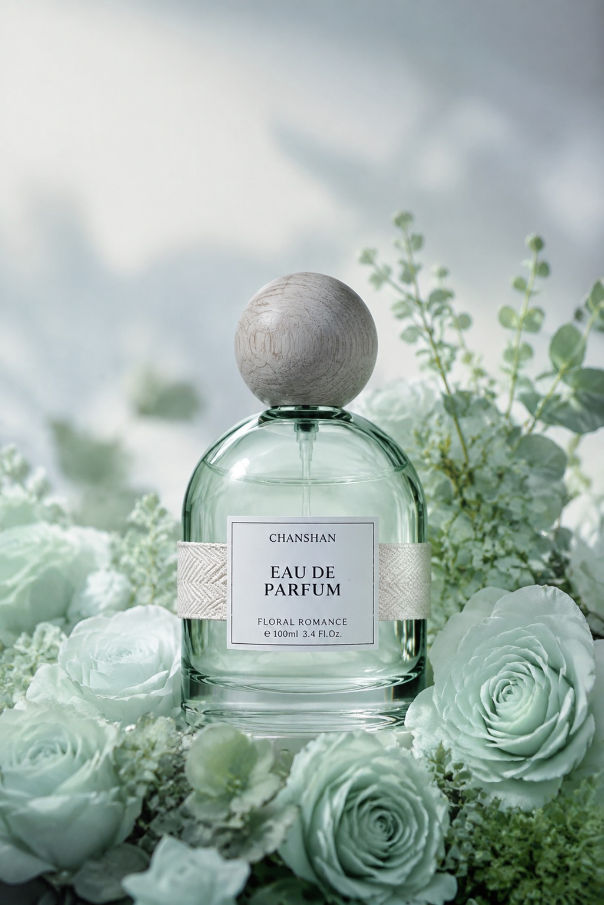

**來源：** [@lovimg_com](https://x.com/lovimg_com/status/2077036313832996893) / [full prompt](https://lovimg.com/image-prompts/7391/100)

**提示詞：**

```text
100%完整保留上傳的原圖香水瓶的全部原始外觀細節，瓶身造型、薄荷綠玻璃質感、木紋球形瓶蓋、原有標籤文字完全不做任何修改；瓶身環繞米色織帶，周圍簇擁薄荷綠玫瑰和淺綠色植物，冷調漸變淺留白背景，冷調逆光柔焦光影，低飽和度冷清高階色調，景深虛化突出香水主體，超寫實C4D質感，輕奢高階ins風，適配豎版電商詳情頁，2K高畫質
```

***

<a name="case-520"></a>

### 例 520：月面宇航員 T 恤圖形

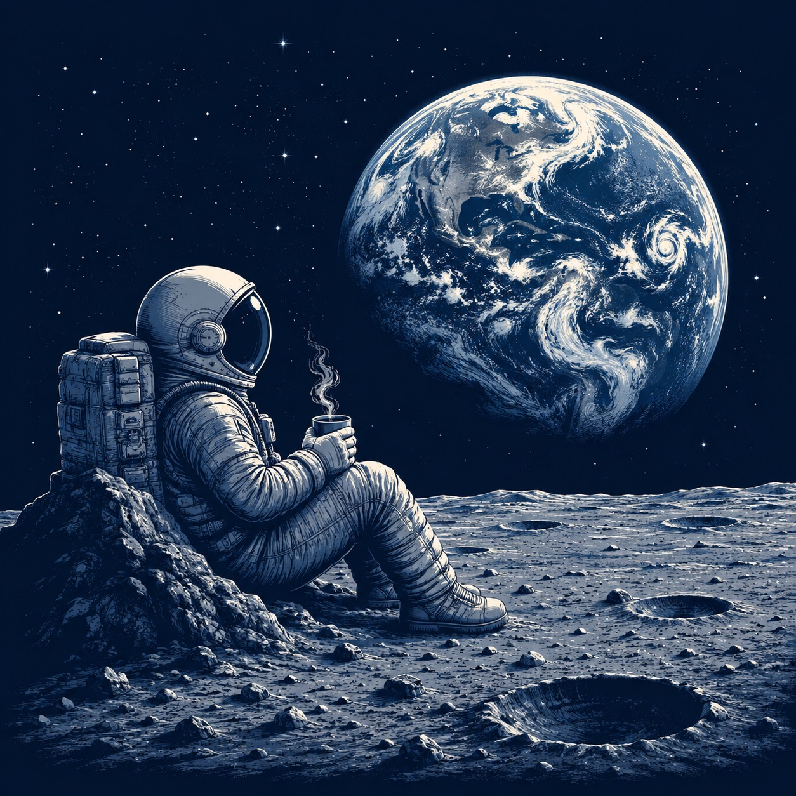

**來源：** [@lovimg_com](https://x.com/lovimg_com/status/2077035644254363972) / [full prompt](https://lovimg.com/image-prompts/7401/a-graphic-illustration-centered-on-a-dark-navy-blue-t-shi)

**提示詞：**

```text
A graphic illustration centered on a dark navy blue t-shirt, depicting an astronaut sitting on the surface of the moon, viewed from a side profile. The astronaut is wearing a detailed, bulky space suit and helmet, leaning back against a small lunar rock formation, and is holding a small steaming mug, suggesting they are enjoying a peaceful drink. Positioned directly in front of the astronaut in the background is a large, majestic view of the Earth, rendered in shades of white, light blue, and navy, featuring prominent swirling cloud formations. The entire artwork is monochromatic, utilizing a cool blue-and-white color palette that creates a serene, solitary, and contemplative atmosphere. The lunar ground is textured with craters and dust, providing a grounded contrast to the vast, dark sky and the bright, swirling planet above. The style is clean, artistic, and iconic, reminiscent of screen-printed apparel designs.
```

***

<a name="case-521"></a>

### 例 521：青花敦煌刺繡四拼風格海報

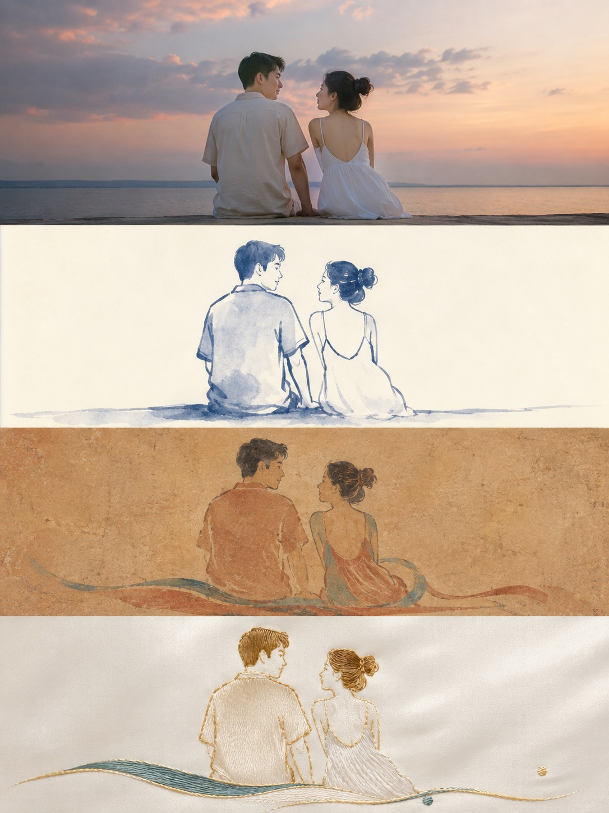

**來源：** [@zhidawang219555](https://x.com/zhidawang219555/status/2090310144190218272)

**提示詞：**

```text
請將我上傳的照片製作成一張豎版拼圖海報，整體採用 3:4 豎版構圖。畫面從上到下嚴格四等分為四個橫向區域，每個區域的高度必須精確控制為整體畫面高度的25%（四層比例嚴格為1:1:1:1，不允許出現比例偏差），區域之間無縫銜接，不設分隔線、不留間隙，順序為：原圖→風格1→風格2→風格3。由於每層為約3:1的極扁寬幅比例，各層主體建議橫向居中排布，強調左右開闊留白與呼吸感，避免元素縱向拉伸變形或貼邊擁擠。四層在人物站位、場景結構、視線方向上保持連貫呼應，呈現同一畫面、四種轉譯的整體感。風格層（第二至四層）須遵循極簡原則：每層視覺元素數量壓縮至最低限度，只保留1個最核心的主體符號，其餘次要裝飾、背景細節與陪襯元素一律省略，畫面留白佔比不低於60%。

第一層保留原始照片的主體結構、人物真實互動關係與姿態、真實質感、自然光影與原有色彩氛圍，僅進行輕微高階攝影調色，呈現雜誌攝影質感，不改變人物關係與構圖邏輯，並可在不改變人物關係與構圖邏輯的前提下自然擴充套件天空、地面或環境背景，使整體更具空間感與敘事感。

第二層為青花瓷繪風格：借鑑青花瓷繪畫技法，以鈷藍色線條與暈染在米白底上表現人物與場景，呈現瓷器紋樣的疏朗雅緻感。色彩以鈷藍與米白為主的單色系。避免藍色濃淡層次過多顯雜，避免圖案化裝飾堆砌。

第三層為敦煌壁畫風格：借鑑敦煌壁畫礦物重彩質感，表現古樸斑駁的美感，需簡化線條與色塊。背景為土黃或赭石底色，帶斑駁壁畫肌理感。色彩以赭石、石青、硃砂、土黃為主。避免裂紋肌理過多堆砌，避免複雜紋樣裝飾。

第四層為刺繡錦緞風格：以刺繡針腳肌理表現人物與場景輪廓，呈現絲緞光澤與針線紋理感，圖案需極簡概括。背景為米白或淺灰緞面底色。色彩以2至3種柔和色搭配金線點綴。避免針腳過密顯繁瑣，避免金線過多顯浮誇。

每一層需將主體與場景統一轉換為對應風格，整體表達極度克制與簡化，只保留最核心的一個主體符號及其基本輪廓關係，刪除一切非必要的背景元素、裝飾細節與陪襯物；人物之間的關鍵位置關係、互動方向與姿態特徵需保留，但應抽象為可識別的輪廓關係，做到“元素越少、關係越清晰”。色彩均從原圖中提取歸納，每層嚴格控制在2-4種主色以內。四個區域的高度比例須嚴格保持1:1:1:1（各佔25%），不可出現拼接錯位或比例偏差。整體避免朋克/賽博朋克風格、寫實照片質感強行疊加、卡通風格、3D渲染感、商業海報感、複雜背景堆砌、元素過多或畫面擁擠、相鄰兩層風格雷同，以及任何文字、Logo、水印或標題。
```

***

<a name="case-522"></a>

### 例 522：兒童故事書手繪頭像

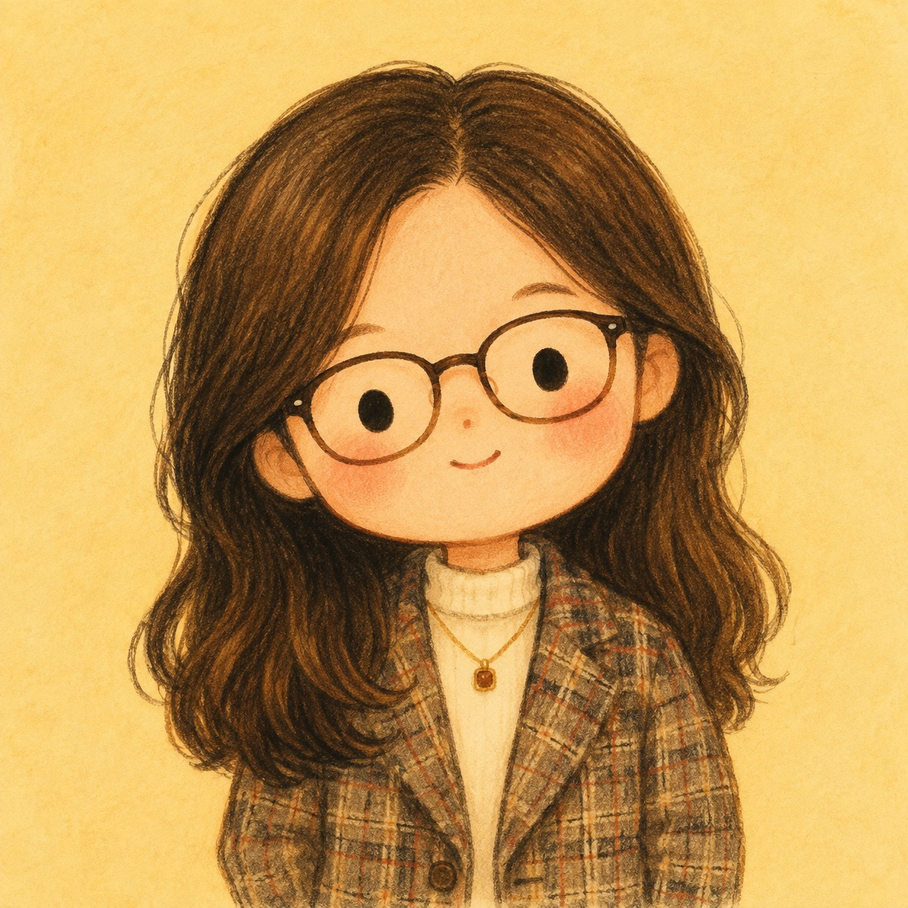

**來源：** [@Sairah_0](https://x.com/Sairah_0/status/2090321208441262454)

**提示詞：**

```text
Use the single uploaded photo as the only visual reference. Transform the person into an adorable hand-drawn 2D children’s storybook character, while keeping their identity immediately recognizable.

Preserve exactly from the photo:
- Facial features and skin tone
- Real hairstyle, length, texture, and color
- Exact clothing, colors, patterns, and layering
- Glasses, jewelry, headwear, bags, and all visible accessories

Do not invent or copy hairstyles, outfits, accessories, braids, pigtails, bows, bonnets, or headscarves from any reference artwork.

### Character
Use an oversized rounded head, tiny compact body, short arms, narrow shoulders, soft rounded silhouette, and cute childlike proportions. Keep the head visually dominant. Avoid realistic anatomy.

### Face
Simplify into tiny dot/oval eyes, minimal nose, tiny smiling mouth, rounded cheeks, and soft peach/pink blush. Keep recognizable facial characteristics. No realistic eyes, detailed lips, anime features, glossy 3D rendering, or heavy shading.

### Hair & Clothing
Recreate the exact hairstyle and outfit from the uploaded photo, simplified into chunky hand-drawn shapes. Preserve important colors, patterns, jewelry, glasses, and other recognizable details.

### Style
Handmade 2D picture-book aesthetic using soft gouache, wax crayon, colored pencil, and dry pastel. Use slightly irregular dark-brown linework, subtle paper grain, uneven pigment, soft brush marks, and imperfect painted edges. Avoid clean vector art, CGI, anime, or photorealism.

### Composition
Square 1:1 portrait, chest/waist-up, centered and facing mostly forward, with balanced negative space. Use a relaxed, charming pose.

### Background
Simple warm mustard, butter yellow, ochre, or cream background with subtle paper texture. No scenery, objects, text, borders, or distractions.

Final feeling: the same person lovingly redrawn as an extremely cute, warm, wholesome, nostalgic, handcrafted children’s-book character—same identity, same hair, same clothes, same accessories, completely simplified and adorable.
```

***

<a name="case-523"></a>

### 例 523：曼哈頓公園水彩旅行插畫

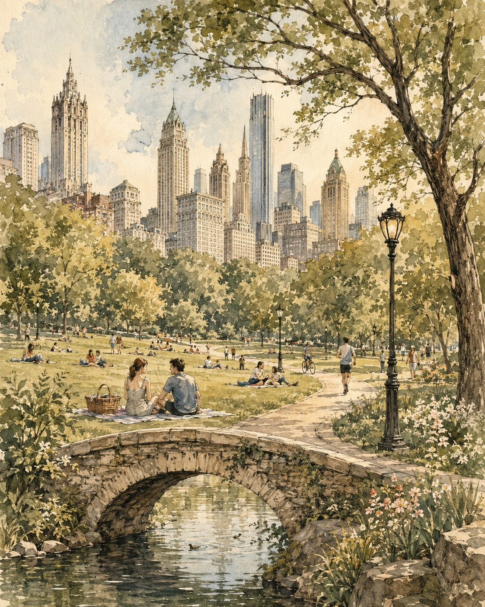

**來源：** [@Taaruk_](https://x.com/Taaruk_/status/2090307485374578755)

**提示詞：**

```text
Create a vertical editorial travel illustration inspired by vintage European travel posters, featuring a peaceful summer afternoon in a grand city park with a recognizable Manhattan-style skyline in the background. Use delicate hand-drawn ink outlines combined with soft, slightly imperfect watercolor washes on warm textured cream paper. Show a wide green lawn filled with people relaxing, reading, walking, jogging, cycling, and having picnics. In the foreground, a casually dressed young couple sits together on a picnic blanket beside a woven basket. Include elegant black vintage park lamps, winding pathways, dense leafy trees framing the composition, and detailed historic and modern skyscrapers rising behind the park. Add a small picturesque stone arch bridge over a calm pond near the bottom of the artwork. Use muted sage green, olive, warm beige, soft blue, pale gray, and subtle golden sunlight, with natural watercolor bleeding, paper grain, fine pen hatching, and an airy sophisticated travel-journal aesthetic. No text, no letters, no logos, no typography, no captions, no signs. Vertical 4:5 composition, highly detailed, elegant, nostalgic, handcrafted watercolor-and-ink illustration.
```

***

<a name="case-524"></a>

### 例 524：紙雕拼貼鄉野人像

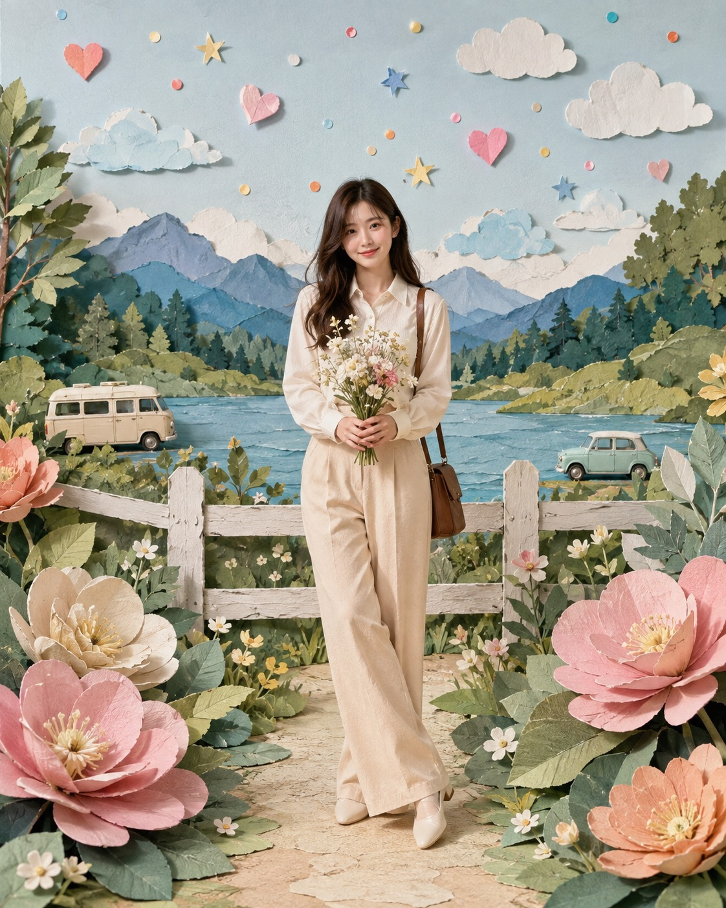

**來源：** [@AiwithLariab](https://x.com/AiwithLariab/status/2090297565732585554)

**提示詞：**

```text
Create a premium whimsical handcrafted paper-collage diorama inspired exactly by the uploaded reference image.

Use the uploaded girl reference as the ONLY human subject. Preserve her facial identity with maximum accuracy: exact face shape, eyes, eyebrows, nose, lips, skin tone, hairstyle, hairline, and recognizable facial features. Strict face identity lock — do not redesign, beautify, stylize, age, de-age, or replace her face.

The girl stands alone in the center of the composition in a graceful, natural editorial pose. She is facing the camera with a relaxed confident expression and a subtle natural smile. Her body is slightly angled, creating a candid fashion-editorial feeling. She holds a beautiful small mixed bouquet of flowers naturally with both hands in front of her. One leg is slightly crossed in front of the other for an elegant relaxed pose.

Outfit

Change the outfit completely from the original reference while keeping it fully modest and elegant:

- elegant ivory/cream long-sleeve button-up blouse
- high-waisted wide-leg beige trousers
- full-length trousers with complete coverage
- simple cream closed-toe shoes
- small brown leather shoulder bag
- no revealing clothing
- no exposed midriff
- sophisticated countryside editorial fashion
- natural realistic fabric folds and texture

Environment

Create a beautiful handcrafted 3D paper-diorama countryside scene:

- layered blue mountains in the distance
- green forest and rolling hills
- peaceful blue lake
- grassy lakeside landscape
- textured beige paper pathway in the foreground
- rustic white wooden fence behind the girl
- dreamy pastel sky

Surround the composition with oversized handmade paper flowers in pink, peach, cream, white, and light blue, with layered green paper leaves.

Add decorative paper elements floating in the sky:

- pink paper hearts
- yellow paper stars
- blue stars
- soft white and pale-blue clouds
- tiny colorful paper dots

Place two tiny vintage vehicles near the lake in the background: a cream vintage camper van on one side and a small vintage blue-green car on the other.

Art Direction

The entire environment should look handcrafted from premium textured paper while the girl remains photorealistic and seamlessly integrated into the paper world.

Use:
hand-torn paper edges, visible paper fibers, layered cardstock, subtle imperfections, realistic paper shadows, dimensional cut-paper elements, tactile textures, soft natural daylight, cinematic depth, gentle atmospheric perspective, premium editorial photography.

The final image should feel like a luxury handmade paper storybook brought to life with a real photographic subject.

Composition

Centered full-body girl
Face clearly visible and sharply detailed
Natural elegant pose
Bouquet held naturally
Rustic fence framing the subject
Lake and mountains creating depth
Large flowers framing both lower corners
Clouds and decorative elements filling the upper background
Balanced symmetrical composition with organic handmade imperfections
Girl remains the strongest focal point

Final Look

Photorealistic girl + handcrafted paper-art environment
Dreamy pastel colors
Luxury editorial aesthetic
Whimsical miniature diorama
Soft cinematic daylight
Highly detailed paper textures
Natural realistic skin
Sharp facial identity
Professional fashion photography
Pinterest/Instagram viral visual aesthetic
Magazine-quality composition

Vertical 4:5 portrait composition, full-body framing, ultra-detailed, high resolution, clean polished finish, visually striking, aesthetically balanced, premium handcrafted paper-collage photography.
```

***

<a name="case-525"></a>

### 例 525：酒紅棚拍男士時尚肖像

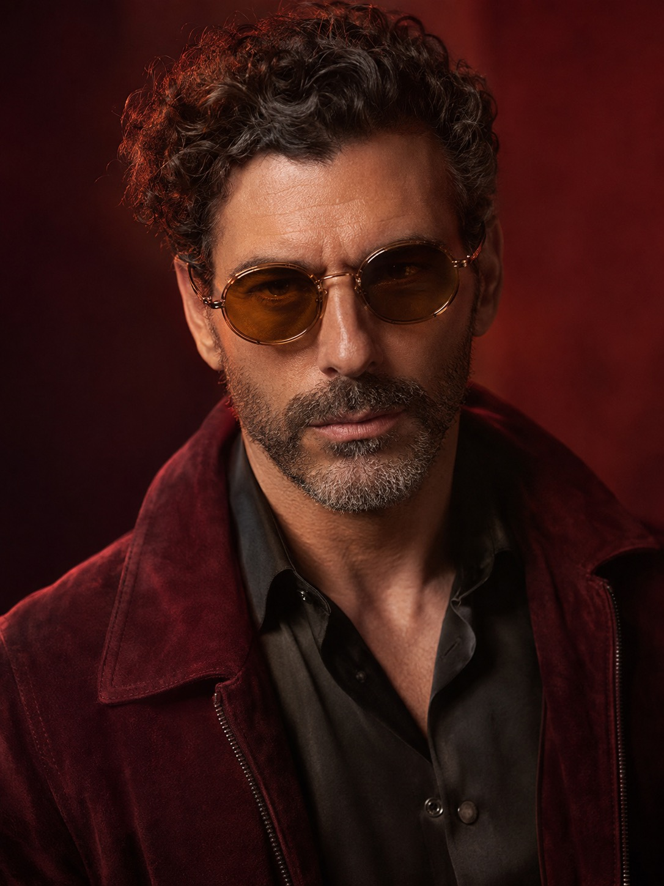

**來源：** [@iamsofiaijaz](https://x.com/iamsofiaijaz/status/2090294894187413883)

**提示詞：**

```text
A cinematic, ultra-realistic close-up portrait of a stylish man, using the provided image as an accurate face reference. Preserve his natural facial identity, thick naturally curly dark brown hair, neatly trimmed salt-and-pepper beard, strong masculine facial structure, and realistic facial proportions. He wears sophisticated round vintage amber-brown sunglasses and a premium deep burgundy suede jacket over a fitted black silk-knit shirt, creating a refined luxury fashion aesthetic.

Warm cinematic studio lighting with a soft amber-golden key light illuminating the face from the front-left, complemented by a subtle crimson-red rim light outlining the hair and shoulders. The background is a rich burgundy, wine-red, and dark plum gradient, with soft atmospheric haze and subtle diffused light creating depth without distracting from the subject. Elegant warm highlights contrast beautifully against the dark clothing.

Extremely detailed natural skin texture, individual beard hairs, realistic pores, subtle facial imperfections, sharp eyes visible behind slightly tinted lenses, natural reflections on the sunglasses, rich dimensional shadows, realistic fabric and suede texture, shallow depth of field. Sophisticated luxury fashion campaign, mysterious and confident mood, premium men's editorial photography, cinematic color grading, photorealistic, HDR, professional studio photography, 85mm portrait lens, f/1.8, crisp facial details, soft background bokeh, centered composition, head-and-shoulders framing, powerful masculine presence, understated elegance, 3:4 aspect ratio.
```

***

<a name="case-526"></a>

### 例 526：體積鐳射黑場海報

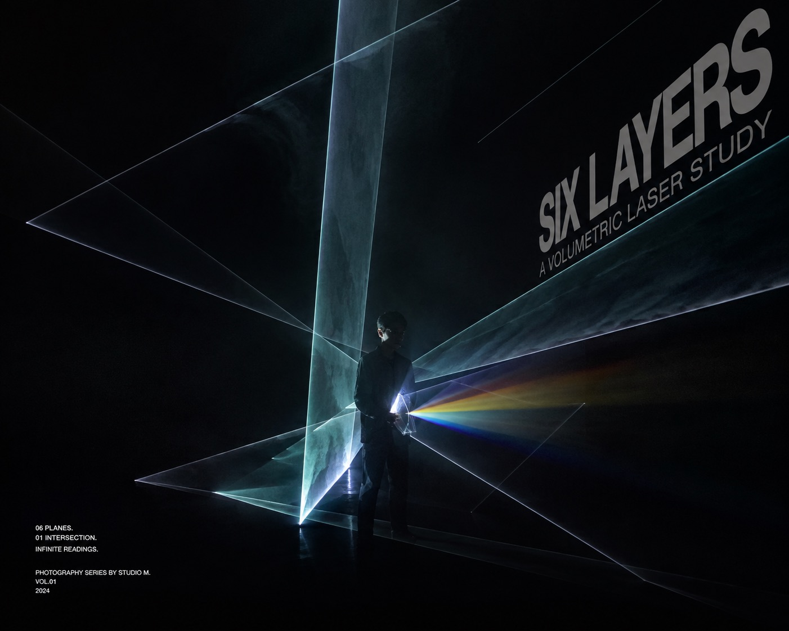

**來源：** [@zhidawang219555](https://x.com/zhidawang219555/status/2090246237094310178)

**提示詞：**

```text
從全黑劇場開始，像切標本一樣用六片真實體積鐳射把空間分層。光面必須有明確起點、透視和薄霧中的厚度，人物站在交匯點，透明道具折射出一小束異色光扇。構圖沿左下至右上的對角線推進，臉只用一道克制邊光揭示；標題與其中一片光面共享透視，小字留在純黑負空間。每次替換主題與角色時，不得退化成夜店範本、HUD、霓虹城市或無物理來源的光線。
```

***

<a name="case-527"></a>

### 例 527：Rio 旅行票據紙雕立體海報

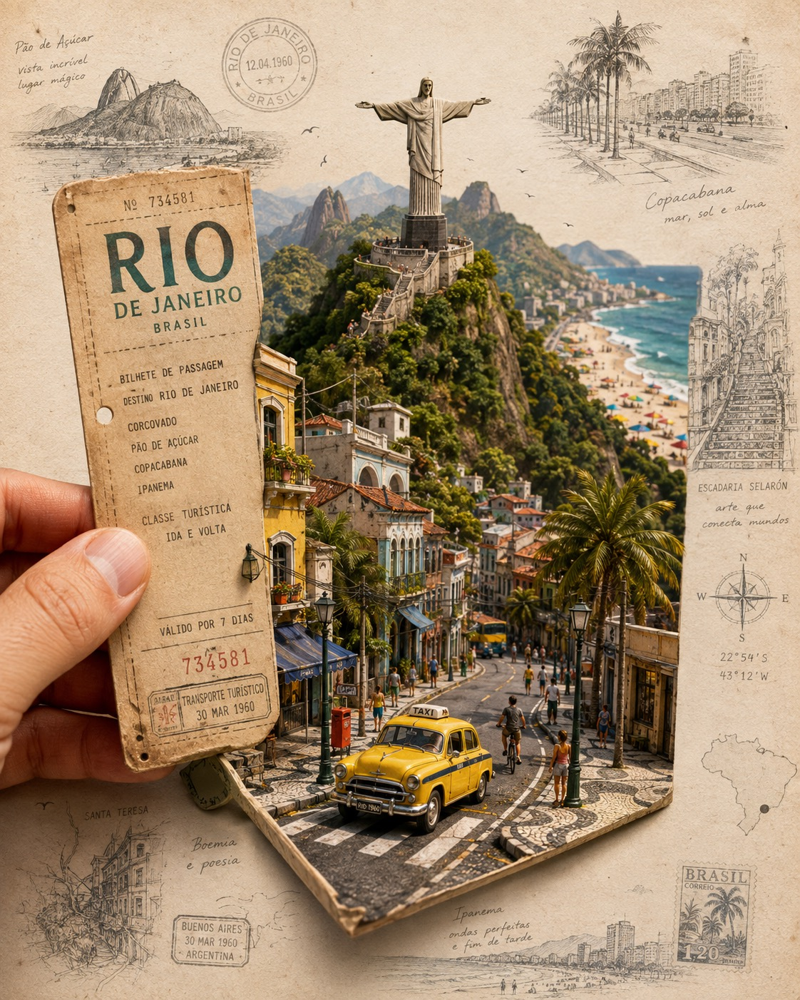

**來源：** [@john_my07](https://x.com/john_my07/status/2091408386466214031)

**提示詞：**

```text
Create a highly detailed, photorealistic miniature travel-poster diorama inspired by Rio de Janeiro, arranged as a handcrafted 3D paper scene on a warm ivory, slightly textured background.

In the foreground, a realistic human hand holds a vintage Brazilian travel ticket or Rio-themed transit card vertically on the left side. Give the card aged paper texture, subtle printing imperfections, elegant typography, and authentic-looking travel details. From behind the card, a miniature Rio de Janeiro landscape physically rises outward like an intricate pop-up diorama.

Make Christ the Redeemer the dominant central landmark, positioned high above a miniature cityscape with lush green mountains surrounding it. Below, build a tiny realistic Rio street featuring a classic yellow taxi, colorful buildings, palm trees, pedestrians, cyclists, street lamps, tiled sidewalks, and small Brazilian urban details. Add Copacabana beach elements in the distance with tiny umbrellas, beachgoers, and a glimpse of the Atlantic Ocean. Layer the architecture and terrain so everything appears physically constructed from paper, wood, plaster, and miniature materials, with convincing depth, cast shadows, overlapping surfaces, and a slight three-quarter perspective.

Around the main 3D scene, incorporate delicate black, charcoal, and muted sepia hand-drawn travel illustrations on the cream paper. Include a small Sugarloaf Mountain sketch in the upper left, an artistic Copacabana promenade illustration in the upper right, a detailed Selarón Steps sketch along the right side, and a small Ipanema beachfront skyline drawing near the bottom. Add subtle handwritten travel notes, tiny map markings, architectural outlines, compass symbols, postage-stamp details, and understated Brazilian travel annotations.

Keep the composition refined rather than crowded. Blend realistic miniature photography with vintage travel-journal design, tactile paper fibers, faint ink bleed, imperfect hand-drawn lines, warm natural studio lighting, gentle shadows, subtle film grain, and a sophisticated cream, charcoal, muted green, ocean blue, and Brazilian yellow palette.

The final image should feel like a premium collectible Rio de Janeiro travel postcard transformed into a physical miniature world, with the central diorama sharply detailed and the surrounding illustrations slightly softer. Highly realistic human hand and fingers, believable miniature materials, cinematic product photography, editorial travel-magazine aesthetic, shallow depth of field, ultra-fine textures, photorealistic 3D details, vertical 4:5 composition, 8K quality.
```

***

<a name="case-528"></a>

### 例 528：聖誕街景 Chibi 真實背景人像

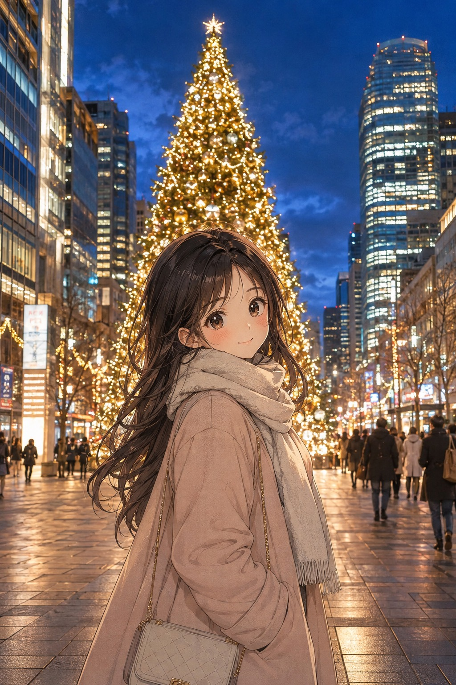

**來源：** [@Sairah_0](https://x.com/Sairah_0/status/2091401764360896762)

**提示詞：**

```text
Use the uploaded image as the primary reference. Transform the person into a cute, hand-drawn anime/chibi character while preserving the original person’s recognizable facial features, hairstyle, outfit, pose, and accessories.

A cute young woman standing on a modern city street at blue hour, surrounded by tall illuminated skyscrapers and festive Christmas decorations. A huge glowing Christmas tree covered in warm golden lights stands directly behind her, creating a magical holiday atmosphere. The street is filled with elegant decorative lights, pedestrians, modern architecture, and soft evening city illumination.

Render the character in a charming Japanese hand-drawn anime/chibi illustration style with expressive large eyes, soft blush on the cheeks, delicate facial details, textured pencil-and-ink outlines, subtle watercolor-like coloring, and slightly imperfect handmade sketch details. Keep the background photorealistic and highly detailed, creating a beautiful contrast between the illustrated character and the real-world environment.

Cinematic composition, natural perspective, soft evening lighting, warm Christmas glow, realistic background depth, detailed clothing texture, cozy winter atmosphere, high detail, aesthetically pleasing, vertical portrait composition.
```

***

<a name="case-529"></a>

### 例 529：雲朵氣球山脊旅行人像

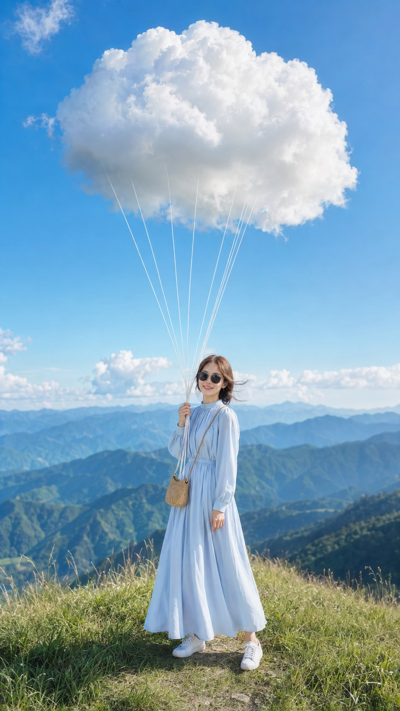

**來源：** [@AiwithLariab](https://x.com/AiwithLariab/status/2091394735416160715)

**提示詞：**

```text
Create a dreamy ultra-photorealistic outdoor fashion photograph based on the person in @image1.

IDENTITY & FACE:
Preserve the exact facial identity of the person in @image1. Keep the same face shape, facial proportions, eyes, eyebrows, nose, lips, skin tone, hairstyle, hairline, and all recognizable facial features. The person must remain clearly recognizable and consistent with the reference image. Do not redesign or replace the face.

POSE & COMPOSITION:
Create a full-body vertical portrait of the person standing naturally on a grassy mountain ridge. The body is slightly turned toward the camera while the face looks naturally toward the viewer. One hand gently holds several long white strings attached to an enormous fluffy white cloud floating directly above the person like a whimsical balloon bouquet. The other hand rests naturally beside the body.

SCENE:
A breathtaking high-altitude mountain landscape with layers of distant blue-green mountains stretching across the horizon. The subject stands on a natural grassy ridge with delicate wild grass around her feet. Vast open sky dominates the upper portion of the composition.

CLOUD BALLOON:
Create one enormous soft white cumulus cloud directly above the subject, visually resembling a giant floating cloud balloon. Multiple thin white strings descend from the cloud and gather elegantly into the person's hand. The strings should look physically believable and naturally connected to the cloud. The cloud is fluffy, voluminous, bright white, and beautifully illuminated by sunlight.

CLOTHING:
Dress the person in a completely modest, elegant, fully covered outfit:

long flowing light-blue maxi dress reaching the ankles

loose long sleeves covering the arms completely

high and modest neckline

opaque non-transparent fabric

full-length flowing skirt

simple white closed-toe sneakers

small woven crossbody bag
No exposed midriff, no deep neckline, no sheer fabric, no short skirt, no revealing clothing. The outfit should look graceful, comfortable, elegant, and wholesome.

ACCESSORIES:
Add tasteful round dark sunglasses and a simple woven shoulder/crossbody bag. Keep accessories minimal and natural.

HAIR:
Keep the person's original hairstyle and hair color from @image1 as much as possible. Allow a few natural strands of hair to move gently in the mountain breeze.

LIGHTING:
Bright natural midday sunlight, soft atmospheric illumination, realistic highlights on the white cloud and dress, subtle natural shadows, crisp but gentle exposure, beautiful blue-sky contrast.

PHOTOGRAPHY STYLE:
Ultra-photorealistic professional travel-fashion photography, realistic skin texture, natural fabric details, physically accurate lighting, realistic depth of field, cinematic atmospheric perspective, high dynamic range, sharp subject with a softly detailed background.

COLOR PALETTE:
Sky blue, soft white, pale powder blue, natural green grass, and distant blue mountains. Clean, airy, dreamy color grading with a peaceful summer atmosphere.

COMPOSITION:
9:16 vertical portrait, full body visible from head to shoes, subject positioned slightly below center, enormous blue sky and cloud occupying the upper half, distant mountains forming a soft horizontal horizon, balanced negative space, visually striking editorial travel photograph.

IMPORTANT:
Preserve the exact identity from @image1. Do not change the person's recognizable face or facial structure. Keep the outfit completely modest, opaque, and fully covering. Maintain realistic anatomy, natural hands, realistic proportions, and believable interaction between the person, strings, cloud, grass, and mountain environment.
```

***

<a name="case-530"></a>

### 例 530：實拍背景塗鴉人物替換

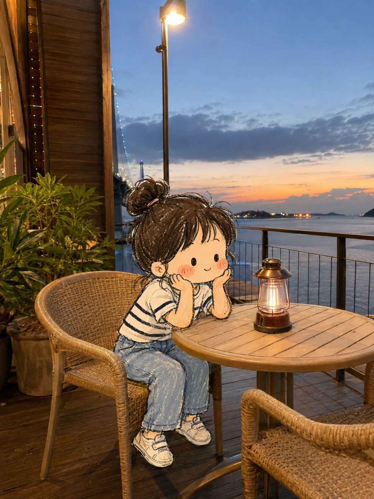

**來源：** [@Emmma__0](https://x.com/Emmma__0/status/2091391958128251286)

**提示詞：**

```text
Transform ONLY the people in the uploaded photo into adorable hand-drawn doodle characters while keeping the original photographic background unchanged.

CORE RULE:
Background = original realistic photo.
People = cute hand-drawn doodle characters.

PRESERVE THE BACKGROUND:
Keep the original sky, landscape, buildings, water, furniture, ground, plants, railings, objects, lighting, colors, perspective, camera angle, framing, and textures as close to the original photo as possible.

Do NOT redraw, simplify, illustrate, or apply doodle/crayon/pencil effects to the background or environmental objects.

TRANSFORM ONLY PEOPLE:
Replace each person with a charming, naive doodle version while preserving:
- exact number of people
- original position and relative scale
- front/back/side/three-quarter orientation
- head and body direction
- pose and gesture
- arm and leg positions
- interactions with people or objects
- hairstyle, clothing colors, and major accessories

IMPORTANT:
If someone faces away, keep them back-facing.
If sideways, keep them sideways.
If facing forward, keep them forward.
Never rotate a person toward the viewer or invent a face that is not visible.

CUTE DOODLE STYLE:
Freely reinterpret realistic anatomy into an adorable, imperfect character:
- oversized round head
- tiny compact body
- short simplified arms and legs
- tiny hands and feet
- cute awkward proportions
- loose scribbled hair
- tiny dot eyes and simple facial features when visible
- rosy scribbled cheeks when appropriate

Keep the original pose recognizable, but simplify and slightly exaggerate it for cuteness.

DRAWING STYLE:
Loose naive hand-drawn doodle, like a quick children's sketch.
Use thin shaky black outlines, imperfect shapes, overlapping sketch lines, scribbled colored-pencil or crayon fills, uneven coloring, white gaps, and slightly messy edges.

The character should look intentionally roughly drawn but extremely cute.

OBJECTS:
Objects, furniture, scenery, and items around the people should remain photographic whenever possible. A doodle character may naturally touch or hold a real photographic object.

INTEGRATION:
Keep correct scale, ground contact, depth, and occlusion so the doodle characters naturally occupy the same locations as the original people.

FINAL LOOK:
It should feel like the real people were removed from the original photograph and replaced with adorable little hand-drawn doodle versions of themselves, while the real-world background remained untouched.

Prioritize:
1. Original photographic background
2. Person position and scale
3. Exact body orientation
4. Pose and gesture
5. Cute exaggerated doodle character design

Avoid full-image illustration, background doodling, realistic anatomy, anime, manga, 3D cartoon, polished digital art, vector lines, changed poses, changed orientation, added people, or invented faces.
```

***

<a name="case-531"></a>

### 例 531：水晶框國家旅行廣告海報

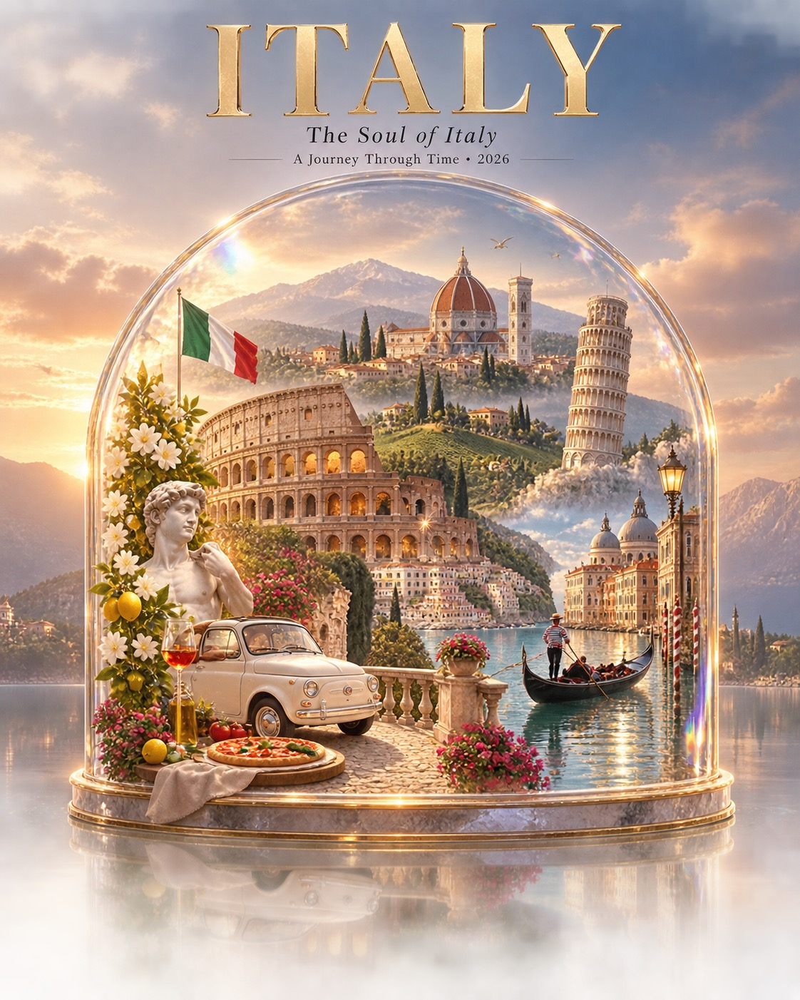

**來源：** [@Taaruk_](https://x.com/Taaruk_/status/2091391283063361558)

**提示詞：**

```text
Create a luxurious, dreamy country travel-art collection in the exact visual language of an elegant premium tourism campaign: a large transparent crystal/glass architectural frame or arched glass display standing on a glossy reflective surface, containing a highly detailed cinematic illustration of the destination. For [COUNTRY], feature its most iconic landmarks, historic architecture, distinctive landscapes, local transportation, cultural elements, national flag, flowers and recognizable scenery arranged as one seamless poetic panorama. Use warm golden-hour sunlight, soft atmospheric haze, pastel cream, champagne, muted blue and sage tones, delicate clouds, subtle birds, realistic glass refraction and rainbow prism highlights along the edges. Create a perfect mirror reflection beneath the glass structure, extending the entire composition downward with beautifully softened reflections. Add elegant editorial typography at the top reading “[COUNTRY]”, with smaller refined text “THE SOUL OF [COUNTRY]” and “A JOURNEY THROUGH TIME • 2026” beneath it. Sophisticated luxury travel magazine aesthetic, photorealistic yet painterly, cinematic depth, fine-art composition, extremely detailed architecture, serene atmosphere, premium advertising photography, symmetrical balanced framing, soft film grain, 8K, vertical 4:5, no clutter, no modern UI elements, no extra text.
```

***

<a name="case-532"></a>

### 例 532：六宮格檸檬飲料微縮廣告

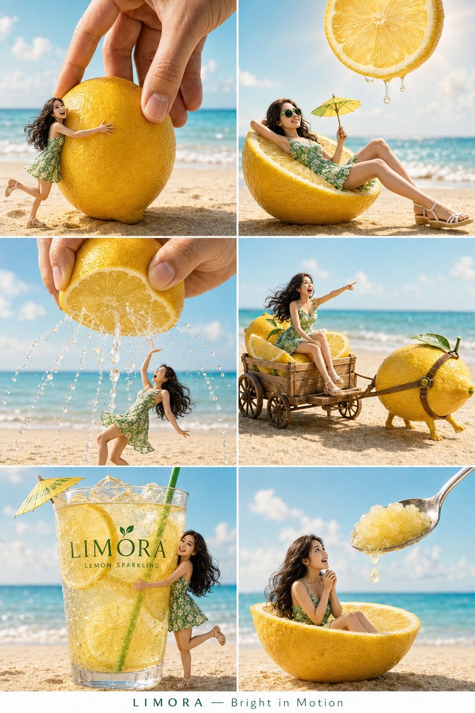

**來源：** [@ou_zhen599](https://x.com/ou_zhen599/status/2091160215928574397)

**提示詞：**

```text
Create a Cannes-level premium summer beverage campaign poster for a fictional lemon drink brand called "LIMORA", using a strict 2-column by 3-row grid layout with six perfectly aligned panels. Preserve the exact structural logic of the composition: each panel shows the same tiny ultra-realistic young woman on a bright sandy beach interacting with oversized lemons, lemon slices, lemon juice, or the final branded drink, while selected panels include a giant realistic human hand entering from above. The full poster must feel like one unified high-end advertising storyboard in motion, where the eye flows continuously from fresh citrus fruit to crafted beverage desire. The lemon product world must remain the absolute visual hero across all six panels.

Overall composition:
Use a clean six-panel grid with thin white dividers, equal panel proportions, consistent horizon line, consistent beach-ocean background, and unified lighting. Every panel should feel self-contained yet rhythmically connected, as if six consecutive scenes from the same luxury summer commercial were frozen at their most iconic moments. Keep the miniature woman and the oversized lemon-related object centered in each frame, with the sea softly blurred in the background and the sand sharply rendered in the foreground. The full page must read instantly from a distance, with strong commercial clarity and polished editorial control.

Orbit visual flow:
Design the entire set around one strong circulation of motion from panel 1 to panel 6. The action should escalate visually: touch, recline, squeeze, travel, embrace, taste. Use repeating directional rhythms in hair movement, arm gestures, leg angles, juice droplets, spoon angle, lemon slice placement, straw tilt, and the position of the entering hand so the eye naturally sweeps across the poster in a flowing wave. Build subtle diagonal energy inside every panel, making the citrus world feel alive, breezy, sparkling, and in motion. The whole set should feel like summer energy orbiting around the brand’s lemon drink.

Narrative panel sequence:
Panel 1: the tiny woman hugs a giant whole lemon on the sand while a giant adult hand descends from above, delicately positioning the lemon. Her pose is lively and slightly off-balance, as if the scene has just begun.
Panel 2: she reclines elegantly inside a halved lemon as though it were a luxury beach chaise, wearing dark sunglasses and holding a tiny parasol drink pick, while a floating lemon slice is lowered from above like a radiant citrus sun.
Panel 3: a giant hand squeezes a vertically cut lemon from above, sending translucent juice streams and droplets downward in a sparkling arc. The woman reacts dynamically beneath it, arms raised, body tilted, caught in the middle of the citrus action.
Panel 4: she rides in a small refined wooden cart piled with lemons, being pulled by a whimsical premium lemon-shaped creature or rolling lemon harness. The cart must feel physically grounded, artisanal, and stylish rather than cartoonish.
Panel 5: the hero climax panel. A tall branded LIMORA lemonade glass dominates the frame, packed with ice cubes, lemon slices, pale sparkling liquid, condensation, a fresh green straw, and a refined cocktail umbrella. The tiny woman hugs the cold glass joyfully, and this panel must be the strongest product-selling moment in the entire composition.
Panel 6: she sits inside a halved lemon while a large polished spoon descends from above carrying glossy lemon sorbet or crushed lemon ice, creating a final delicious serving beat with playful anticipation.

Hero product focus:
The real hero is the lemon beverage system: whole citrus fruit, sliced fruit, squeezed juice, ice, sparkling drink, sorbet, and premium serving details. Every lemon must feel hyper-real, fragrant, sunlit, juicy, and tactile, with detailed skin pores, subtle waxy oil sheen, translucent membranes, wet cut surfaces, and bright natural citrus pulp. The branded glass in panel 5 must be the most visually dominant product object in the set, with crystal-clear glass, refined original English branding reading "LIMORA", elegant condensation, premium ice refraction, and luminous pale-yellow drink clarity.

Character design:
Depict one recurring ultra-realistic miniature young woman across all six panels, wearing the same fitted green floral mini dress and white sandals, with long dark wavy hair and naturally expressive features. She must look like a real scaled-down human placed into a surreal oversized citrus world. Keep anatomy coherent and believable in every frame: correct head-to-body proportion, realistic shoulders, collarbones, arms, waist, hips, thighs, knees, calves, ankles, and feet, with perfectly formed hands and five fingers clearly visible. Her expressions should shift panel by panel: surprised delight, relaxed confidence, playful alarm, exhilaration, joyful refreshment, amused anticipation. Skin must remain photorealistic with pores, natural tonal shifts, faint knee and elbow texture, realistic skin elasticity, and no plastic AI beauty finish.

Lighting:
Use bright premium seaside daylight with a soft upper-left sun direction and gentle atmospheric diffusion. Maintain luminous fresh summer lighting across all six scenes, with short, soft-edged shadows and crisp dimensional highlights. Juice droplets, lemon pulp, ice cubes, spoon edges, sunglasses, glass rim, and condensation should all catch clean sparkling highlights. Lighting must feel luxurious, refreshing, and physically consistent from panel to panel.

Materials:
Lemons: ultra-detailed peel pores, subtle dimpling, natural rind thickness, glistening wet pulp, believable cut translucency, realistic juice behavior.
Drink glass: high-clarity premium glass, accurate refraction, heavy base, condensation beads, crisp logo print, ice transparency, sparkling carbonated liquid feel.
Sorbet and juice: glossy, semi-translucent, cold, wet, appetizing, physically accurate.
Dress: lightweight summer cotton with tiny green floral print, natural wrinkles, fabric tension, and wind-responsive edges.
Hair and skin: realistic strands, fine flyaways, natural shine, believable skin texture.
Large hand: realistic adult fingers, soft skin compression, natural nails, coherent scale perspective.
Cart and props: refined warm wood grain, polished wheels, believable joints and harness elements.
Beach environment: fine sunlit sand with miniature footprints and pressure marks, soft shoreline blur, clean turquoise sea with pale foam.

Color system:
Build the palette around lemon yellow, fresh citrus green, turquoise sea, pale sky blue, warm beach beige, crisp white highlights, and restrained natural skin tones. Yellow must remain the dominant hero color, supported by green and turquoise. Keep the image bright, appetizing, summery, clean, and internationally commercial. Avoid random accent colors.

Typography and branding:
Do not copy any text from the sample. Keep typography minimal and original. Place refined English branding only on the hero glass and optionally a tiny campaign line below the full grid, such as: "LIMORA — Bright in Motion". Typography must feel premium, modern, minimal, and secondary to the visual storytelling.

Art direction:
Hyper-real premium surreal advertising photography, luxury FMCG campaign, storyboard energy, elegant humor, cinematic micro-world illusion, high-end beverage styling, global summer launch poster, polished magazine-grade finish, sharp product realism, strong narrative rhythm, premium brand coherence.

Negative prompt:
copied text, Chinese text, existing brand names, cartoon style, toy-like figure, grotesque oversized head, deformed anatomy, extra fingers, missing fingers, fused fingers, twisted wrists, broken limbs, distorted feet, AI plastic skin, over-smoothed skin, fake citrus texture, unrealistic juice physics, muddy lemon pulp, cloudy glass, weak product focus, inconsistent lighting, inconsistent horizon, messy grid, cluttered props, meme aesthetic, cheap humor, childish illustration, low-resolution detail, oversaturated colors, dead black patches, distorted giant hand perspective
```

***

<a name="case-533"></a>

### 例 533：手繪塗鴉時尚人物插畫

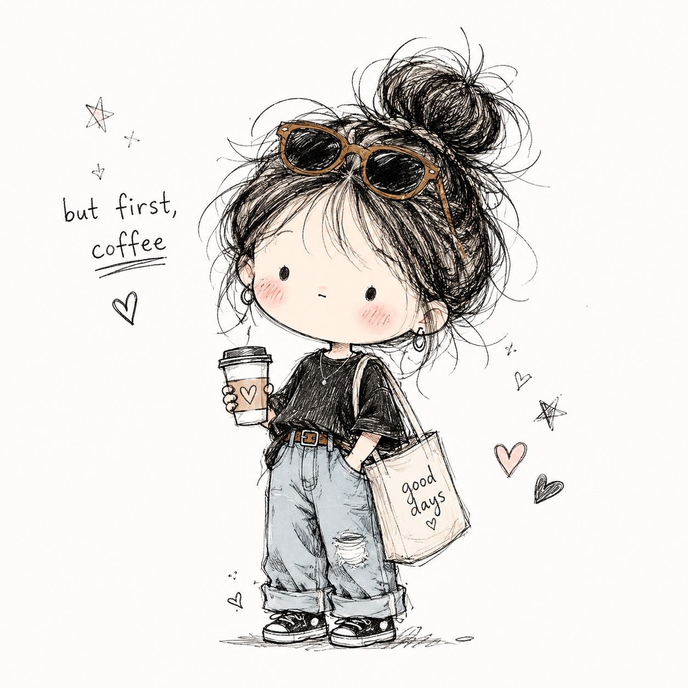

**來源：** [@Sairah_0](https://x.com/Sairah_0/status/2092473965927334071)

**提示詞：**

```text
Transform the subject from the reference image into a cute, quirky hand-drawn doodle illustration.

Use a minimalist children’s storybook / fashion sketch aesthetic with loose, imperfect black ink lines, visible scribbly pencil strokes, subtle cross-hatching, and a charming handmade feel. Keep the character’s recognizable facial features, hairstyle, face shape, clothing, accessories, and overall identity from the reference while simplifying them into a cute illustrated character.

Character design:
- Oversized head and small simplified body
- Simple dot-like eyes and tiny minimal mouth
- Soft rounded facial features
- Slight rosy pink blush on the cheeks
- Messy, expressive hand-drawn hair with many loose sketch lines
- Slightly exaggerated, playful proportions
- Natural, relaxed pose with a whimsical fashion-illustration feel

Art style:
- Black-and-white pencil/ink doodle drawing
- Rough, imperfect sketch lines rather than clean digital outlines
- Dense scribbled hair and clothing details
- Light hand-colored accents
- Subtle watercolor/crayon-like coloring
- Minimal shading
- White or off-white clean background
- Lots of negative space
- Cute, innocent, playful, cozy aesthetic
- Looks like an original handmade notebook/fashion doodle illustration

Preserve the important details of the reference image while converting everything into this consistent doodle-art style. The final image should feel hand-sketched, slightly imperfect, adorable, expressive, and effortlessly stylish, not like polished vector art or 3D cartoon art.
```

***

<a name="case-534"></a>

### 例 534：紅光干擾實驗編輯人像海報

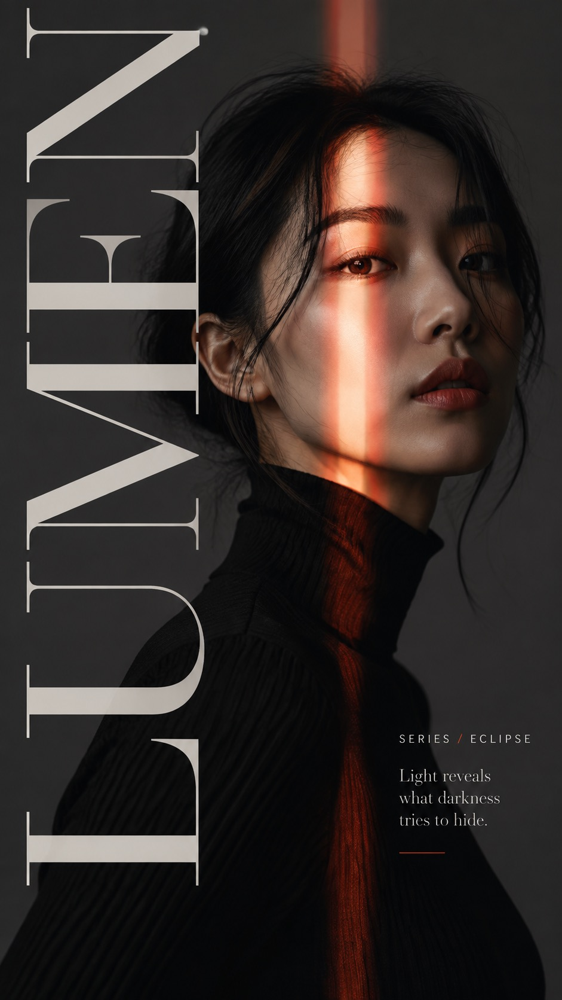

**來源：** [@Goodmanprotocol](https://x.com/Goodmanprotocol/status/2092471662126211143)

**提示詞：**

```text
Create a medium-sized 9:16 experimental editorial portrait poster using the following customizable inputs:

Subject: [Adult Male or Female Portrait]
Interference: [Color Split / Narrow Light Beam / Horizontal Cut / Motion Veil]
Title: [Title]
Palette: [Main Neutral Tones + One Accent Color]
Mood: [Sharp / Cinematic / Restrained / Experimental]

Create a striking close-up or waist-up portrait with the subject occupying a strong portion of the frame. Preserve realistic facial features, natural skin texture, authentic hair, realistic proportions, clear emotion, and a strong silhouette. The portrait must work visually as a fashion photograph before the graphic intervention is applied.

Use only one primary interference method:

Color Split: Uneven translucent bands selectively shift, reveal, separate, or distort portions of the portrait.

Narrow Light Beam: A single controlled beam cuts across the face or body and continues naturally into the surrounding space.

Horizontal Cut: Bold horizontal bands interrupt selected areas of the portrait and interact with oversized typography.

Motion Veil: Keep the main portrait sharp while selected areas create subtle horizontal photographic motion trails.

Make typography an integral part of the composition. Use one dominant headline, allowing letters to crop beyond the frame, overlap the subject, disappear behind the body, or interact with the interference.

Keep supporting text minimal: one small series label and one short phrase.

Use mostly black, white, grey, charcoal, or deep neutral tones, plus one accent color. Keep skin tones natural and avoid excessive warmth or yellow grading.

Add only a few subtle graphic details such as fine lines, circles, or open corner marks when necessary.

The final composition should feel like a premium fashion editorial, contemporary photography poster, or experimental art-direction piece—clean, intentional, sophisticated, and visually balanced.

Avoid multiple competing effects, dense text, UI elements, heavy glitches, random collage, excessive decoration, numbering, “Vol.” or “Issue” labels, sparkle symbols, logos, watermarks, distorted anatomy, plastic skin, oversaturation, and generic template aesthetics.

Keep the overall treatment medium in scale, refined, adaptable, and universally applicable to different people, titles, themes, palettes, and editorial concepts.
```

***

<a name="case-535"></a>

### 例 535：同一人臉十二款髮型 Lookbook

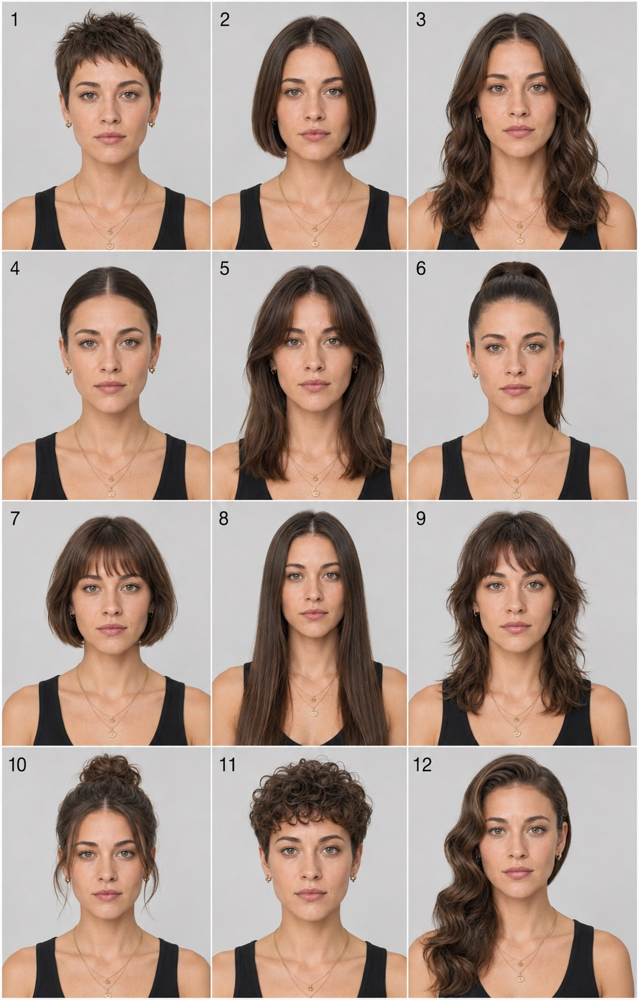

**來源：** [@Ciri_ai](https://x.com/Ciri_ai/status/2092452220768002400)

**提示詞：**

```text
Create a 12-panel grid (3 columns × 4 rows, numbered 1 to 12) showing the SAME person from the reference photo with 12 different hairstyles. This is a hairstyle lookbook. Final image aspect ratio: 4:5 (vertical/portrait).
THE ONLY THING THAT CHANGES BETWEEN PANELS IS THE HAIR ON THE HEAD (shape, style and length only). Everything else stays exactly as in the reference photo.
Identity Anchor (Critical)
The face must be IDENTICAL to the reference photo in every single panel. Preserve exactly: facial bone structure, jawline, cheekbones, nose shape, lips, eye shape and spacing, eyebrows, skin tone, skin texture (pores, natural imperfections), and overall facial proportions. This is the same real person in all 12 frames. Do NOT beautify, slim, or alter the face. Same age, same expression as in the reference.
Mandatory Rules (Do Not Violate)
- NO SUNGLASSES. Eyes must be fully visible in all 12 panels.
- NO ENVIRONMENTAL BACKGROUNDS. Every panel must have a plain, uniform, solid light grey studio backdrop with zero objects, zero textures, zero gradients. Just flat neutral grey.
- Hair COLOR stays exactly as it appears in the reference photo in all 12 panels. Only the shape, length and style changes, never the color.
Keep Identical in Every Panel (Do Not Change)
- MAKEUP AND SKIN: If the person in the reference photo wears makeup, replicate it identically in every panel. Same lip color, same eye makeup, same brow grooming. If they wear no makeup, keep all panels makeup-free. Do NOT add, remove, or alter makeup between panels.
- Clothing: the same clothing visible in the reference photo, replicated exactly.
- Accessories: preserve ALL visible accessories from the reference photo (earrings, necklaces, rings, bracelets, piercings, watch, glasses, etc.). Do not omit, resize, recolor, or restyle any accessory. If the person wears prescription glasses (not sunglasses), keep them in every panel.
- Background: plain solid light grey studio backdrop in every panel. No room, no furniture, no environment.
The 12 Hairstyles
1. Pixie cut: very short, textured, slightly tousled on top with tapered sides and nape
2. Classic bob: chin-length, straight, blunt ends, clean middle part
3. Long layered waves: past the shoulders, soft voluminous waves with face-framing layers
4. Sleek low bun: hair pulled back smoothly into a tight low bun at the nape, no flyaways
5. Curtain bangs with medium-length hair: soft parted fringe framing the face, hair falling just past the shoulders
6. High ponytail: hair pulled up into a sleek high ponytail, smooth crown, length falling behind
7. French bob: short bob ending at the jawline with a soft blunt micro-fringe across the forehead
8. Long straight hair with middle part: very long, sleek, pin-straight, falling well past the shoulders
9. Shaggy wolf cut: medium length, heavy layers, choppy fringe, textured and voluminous with a slightly wild look
10. Elegant updo: hair swept up into a polished chignon with soft face-framing tendrils
11. Short curly crop: short voluminous curls all over, natural texture, tapered at the sides
12. Side-swept Hollywood waves: long glamorous deep side part, sculpted vintage waves cascading over one shoulder
Photographic Specs
Shot on a Canon EOS R5 with an 85mm f/1.4 lens, studio portrait lighting (soft key light, subtle fill), shallow depth of field with sharp focus on the face. PLAIN SOLID LIGHT GREY STUDIO BACKGROUND in every panel. Natural skin rendering with visible pores and realistic hair strands (no plastic or CGI look). Consistent lighting, color grading and exposure across all 12 panels. Photorealistic, high detail, hyperrealistic, 8K. No illustration, no painterly effect, no over-smoothing. NO SUNGLASSES.
Each panel clearly numbered 1 to 12 in the top-left corner. Overall output aspect ratio 4:5.
```

***

<a name="case-536"></a>

### 例 536：春日櫻花回眸電影人像

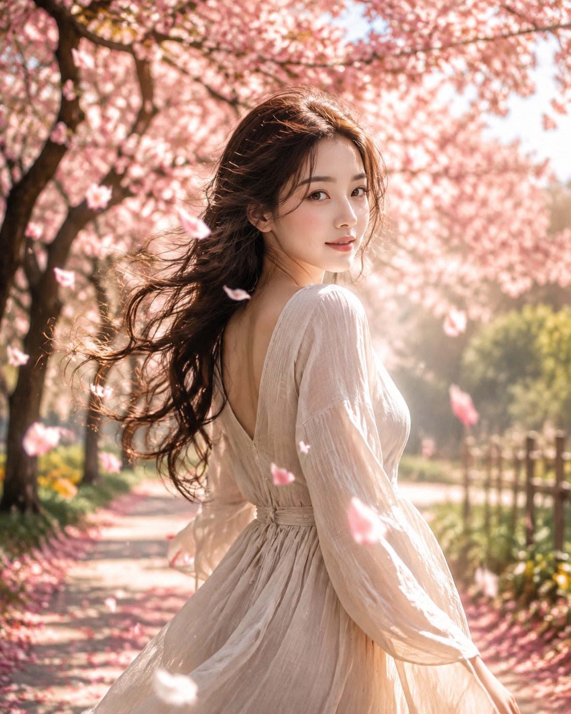

**來源：** [@SheBuildsAI_](https://x.com/SheBuildsAI_/status/2092431090095149533)

**提示詞：**

```text
{
  "title": "WHISPERS OF SPRING",

  "scene": "A peaceful pathway beneath blooming cherry blossom trees during a warm spring afternoon. Pink blossoms fill the canopy overhead while delicate petals drift gracefully through the air. Soft sunlight filters through the branches, creating a dreamy and enchanting atmosphere.",

  "subject": "A young woman walks away from the camera before gently turning her head over her shoulder with a soft, mysterious smile. She wears a flowing natural linen dress that moves gracefully with the breeze, highlighting her delicate facial features and effortless elegance.",

  "detail": "Wind carries countless pink cherry blossom petals across the frame while warm sunlight creates glowing highlights throughout the scene. Every strand of hair moves naturally in the breeze, with ultra realistic skin texture, lifelike fabric folds, soft floral surroundings, and subtle atmospheric haze enhancing the cinematic realism.",

  "atmosphere": "Elegant, peaceful, romantic, dreamy, timeless, cinematic, graceful, and enchanting.",

  "lighting": "Warm spring sunlight filtering through cherry blossom branches, soft natural illumination, glowing highlights, volumetric light rays, gentle ambient shadows, and subtle atmospheric haze.",

  "composition": "Cinematic editorial portrait captured with an 85mm lens, featuring the subject in a three-quarter over-the-shoulder pose. Shallow depth of field, creamy bokeh, balanced framing with flowering trees, soft leading lines, and immersive visual storytelling.",

  "style": "Photorealistic, masterpiece, editorial fashion photography, analog film aesthetic, dreamy pastel color palette, ultra realistic skin texture, highly detailed, shallow depth of field, creamy bokeh, atmospheric haze, HDR, cinematic realism, 8K."
}
```

***

<a name="case-537"></a>

### 例 537：地下檔案館暗黑概念海報

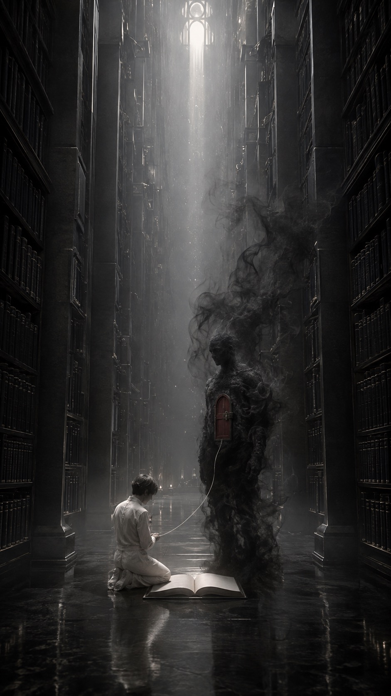

**來源：** [@PromptSin](https://x.com/PromptSin/status/2092390329890849163)

**提示詞：**

```text
Use case: stylized-concept
Asset type: vertical social-media artwork for the “Your Dark Side” theme

Create an original psychological dark-surrealist scene in a colossal underground archive. Endless shelves of sealed black books rise like skyscrapers and vanish into fog. In the central aisle, a solitary human figure in bone-white clothing kneels before one open book on the floor. No words are visible. From the blank pages rises a delicate life-size figure made entirely of dense black smoke, standing face-to-face with the kneeling person. The smoke figure has no eyes or mouth; instead, its chest contains a small locked crimson door. Thin threads connect that door to the kneeling person’s hands, suggesting a secret self finally acknowledged.

Vertical 9:16 framing, towering shelves create a narrow symmetrical canyon, high-angle shaft of cold silver light, the two figures positioned small in the lower center, immense oppressive scale above them. Black paper, aged stone, floating ash, volumetric fog, subtle polished-floor reflections, premium photorealistic dark concept art, refined editorial composition, quiet dread and introspection rather than horror spectacle.

Color palette: obsidian black, graphite, bone white, cold silver, a single muted crimson accent at the tiny door.

Constraints: entirely original metaphor; blank book pages with absolutely no writing; no recognizable person; no text, symbols, logos, signatures, borders, or watermark.

Avoid: visible letters or runes, portrait close-up, split face, black substance on skin, glowing eyes, gore, skulls, conventional ghosts, fantasy wizard styling, imitation of any named artist.
```

***

<a name="case-538"></a>

### 例 538：橡皮章旅行田野筆記海報

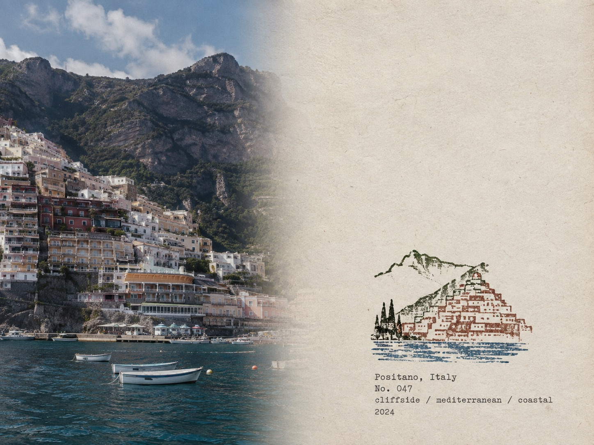

**來源：** [@MahnoorAi12](https://x.com/MahnoorAi12/status/2092221482139349307)

**提示詞：**

```text
Rubber Stamp Travel Field Notes Poster — Natural Realism Version

Create a separate “Rubber Stamp Travel Field Notes Poster” for each photo I upload. Output each photo individually. Never create a collage or combine multiple photos.

Use a 4:3 landscape composition with a natural visual transition between the original photograph on the left and the aged-paper field-note area on the right. Do not add an obvious dividing line.

LEFT — ORIGINAL PHOTOGRAPH

The left side should occupy roughly 58% of the frame.

Keep the uploaded photograph visually authentic and recognizable. Preserve the original subject, perspective, terrain, architecture, plants, people, spatial relationships, natural light, shadows, textures, and overall atmosphere.

Do not redesign or reinterpret the photograph.

Only apply a very subtle editorial photo treatment: gentle tonal balancing, restrained color grading, slightly softened highlights, and extremely fine natural film grain. It should still look like a real photograph taken on location rather than an AI-generated image.

Natural cropping is allowed if needed to fit the 4:3 layout, but do not stretch, distort, move, replace, or redraw the main subject.

Avoid excessive sharpness, HDR effects, artificial clarity, cinematic color grading, or overly perfect details.

RIGHT — AGED PAPER FIELD NOTES

The right side should occupy roughly 42% of the frame.

Use warm off-white, slightly aged paper with a believable physical texture. Include very subtle paper fibers, fine grain, faint handling marks, and a matte surface.

Keep large areas completely unprinted.

The paper should feel like a real sheet from an architect's travel notebook or field journal, not a designed poster background.

Avoid overly strong stains, decorative textures, vintage filters, or artificial grunge.

SMALL RUBBER STAMP

Study the uploaded photograph and identify only the few visual features that make the location immediately recognizable.

Reduce them into a compact, imperfect multi-color rubber stamp impression.

Do not reproduce the photograph element by element.

Simplify aggressively and retain only the most meaningful visual relationships:

- distinctive architecture and silhouette
- important roof, tower, dome, arch, or structural shape
- mountain or terrain contours
- shoreline or road direction
- a few recognizable trees or vegetation forms
- simplified settlement layers
- one or two important foreground shapes when visually relevant

Remove crowds, cars, dense windows, repetitive buildings, tiny vegetation, decorative objects, and insignificant background details.

The result should look like something a traveler could have actually carved into a small rubber stamp, not a miniature illustration of the entire photograph.

Place the stamp in the lower-middle portion of the right paper area, occupying approximately 30–38% of the right section's height.

Keep generous blank paper around it.

Do not enlarge it into a large illustration.

STAMP COLOR & PRINT CHARACTER

Extract approximately 2–4 muted spot colors naturally from the original photograph.

Possible colors include:

- carbon black
- deep green
- brick or muted red
- ochre
- slate blue
- taupe or earthy brown

Do not force these colors if the photograph suggests a different restrained palette.

Each color should appear as a separate physical ink layer.

Make the print feel genuinely handmade:

- slightly uneven pressure
- tiny gaps in the ink
- dry areas
- paper showing through
- rough carved edges
- irregular line thickness
- small contour breaks
- granular ink texture
- faint ghosting
- slight natural color-layer misregistration
- subtle edge variation

The imperfections should be small and believable, as if the stamp was pressed onto paper by hand.

Avoid perfectly aligned digital layers, smooth vector edges, clean gradients, or artificially exaggerated distress.

The stamp should look physically printed, not digitally illustrated.

FIELD-NOTE TYPOGRAPHY

Generate a small amount of text based only on the actual location and imagery in the photograph:

Location — English name
No. — Number
Three short English keywords
Gregorian calendar year

Place the text below or beside the stamp within the available whitespace.

Use a small, understated typewriter or archival field-note style.

The typography should have very slight mechanical irregularity, as though typed or printed on an old field notebook.

Keep it quiet and secondary to the photograph.

Spell the location and all words correctly.

Do not add slogans, brands, tourist phrases, decorative quotes, or unnecessary text.

OVERALL REALISM

The finished image should feel like a real travel photograph mounted beside a small handmade field stamp on an architect's personal notebook page.

Prioritize subtle physical realism over visual perfection.

The photograph should remain the strongest visual element.

The stamp should feel like a small fragment of memory extracted from the photograph rather than a second illustration.

Use restrained contrast, natural imperfections, believable paper texture, and slightly imperfect printing.

The final result should feel quiet, tactile, documentary, collectible, and genuinely handmade.

Avoid

Obvious dividing lines, circular seals, postage-stamp borders, perforations, wax seals, sticker layouts, souvenir-card designs, generic travel templates, smooth vector logos, polished digital illustrations, cartoon styling, 3D rendering, plastic textures, glossy gradients, excessive saturation, HDR effects, excessive text, decorative clutter, overly clean geometry, perfectly aligned ink layers, dense miniature architecture, or any alteration/redrawing of the original photograph.
```

***

<a name="case-539"></a>

### 例 539：粗糲手繪搭檔肖像海報


**來源：** [@kingofdairyque](https://x.com/kingofdairyque/status/2093279729717780736)

**提示詞：**

```text
Raw sketchy graphic portrait poster of [HUMAN] wearing [CLOTHING], half-body and large in frame, accompanied closely by [ANIMAL], with a minimal [SCENERY] background. Render in a rough expressive illustrated style with broken black ink contours, loose sketch lines, scratchy hatching, irregular stroke weight, imperfect line edges, fast gestural mark-making, simplified anatomy, flat cel-like shadow blocks, and reduced detail. Use a restrained [COLORS] palette with one dominant warm field, one cool counter-field, dark inked shadows, and a few pale highlight accents. Keep the face oversized and central, crop around mid-torso, and place the animal in the lower foreground or tucked beside the subject, drawn with the same simplified raw linework. Reduce the scenery into only 2 or 3 bold silhouette shapes behind the subject, with no detailed environment rendering. Add a narrow warm off-white poster border and very light print texture. Strong attitude, graphic poster energy, intentionally imperfect strokes, raw and sketchy finish, ar 4:5
```

***

<a name="case-540"></a>

### 例 540：夢幻未來城市編輯藝術海報


**來源：** [@Naiknelofar788](https://x.com/Naiknelofar788/status/2093230701986672924)

**提示詞：**

```text
Create a visually unforgettable editorial art poster of a dreamlike futuristic world where familiar everyday life meets surreal architecture. Grand sculptural buildings, winding roads, oversized plants, tiny people, unexpected floating elements, dramatic perspective, cinematic atmosphere, and one iconic focal point. Blend vintage travel-poster design with modern luxury editorial aesthetics, sophisticated muted colors, soft natural light, subtle film grain, tactile paper texture, clean geometric shapes, minimal composition, nostalgic yet futuristic, whimsical but premium, highly detailed, instantly recognizable silhouette, Pinterest-worthy, Instagram-viral aesthetic, collectible art print, no clutter, no photorealism, vertical 4:5.
```

***

<a name="case-541"></a>

### 例 541：50/50 混合媒介回憶卡


**來源：** [@Sairah_0](https://x.com/Sairah_0/status/2093212900160868430)

**提示詞：**

```text
Transform the uploaded photo into a vertical mixed-media memory card with a strict 50/50 split.

Keep the original photo unchanged in the top half. In the bottom half, use textured off-white handmade paper and add a muted, irregular color patch matching the photo’s tones.

Redraw the main subjects as a simple dark wax-crayon sketch with loose, imperfect lines and minimal details. Add a short handwritten English phrase and subtle Risograph grain.

Create a quiet, nostalgic Morandi-style aesthetic with generous negative space. Do not add extra elements or copy the reference composition exactly.
```

***

<a name="case-542"></a>

### 例 542：黑白排版側臉肖像海報


**來源：** [@HustleXR](https://x.com/HustleXR/status/2093206386012230000)

**提示詞：**

```text
High-contrast black and white typographic portrait poster of [HUMAN], shown in side profile with [FEATURE]. Build the portrait with bold black silhouette blocks, sharp negative space, rough ink edges, fragmented stencil shapes, tiny editorial microtext, vertical typographic accents and expressive hand-drawn calligraphic marks. Integrate one large readable text block saying “[TEXT]” in 2 to 4 stacked lines, placed only inside the neck and body area, using oversized scribbled lettering that feels fused into the silhouette. Include a graphic design logo reading “[LOGO]” near the footer. Minimal off-white paper background, asymmetrical layout, cropped vertical composition, experimental editorial poster design, raw ink print texture, aspect ratio 4:5.
```

***

<a name="case-543"></a>

### 例 543：旅行紀念琺琅徽章


**來源：** [@Emmma__0](https://x.com/Emmma__0/status/2093194689222705645)

**提示詞：**

```text
Turn the reference photo into a travel souvenir enamel pin badge. Compose it as a SCENE, not a single isolated object.

Subject hierarchy: the defining landscape, terrain or landmark of the photo forms the main body of the badge and occupies most of its area. If a person appears prominently in the photo, keep them in the badge as a small, simplified figure at true relative scale within that landscape — the person is an accent, the landscape is the subject. Preserve the original spatial relationship and scale between the figure and the surroundings.

How to render the person: flat enamel color blocks matching their real clothing and hair color from the photo. The face is a smooth plain area of light skin-tone enamel with no drawn facial features — do NOT render the person as a dark or black silhouette, and do NOT black out the face or head. Skin reads as a warm light enamel color, clearly lighter than the clothing.

Styling: thin polished gold outline around the silhouette and along every internal divider, glossy enamel color fill, gentle even lighting with only a soft sheen on the gold lines, very subtle drop shadow. Outer contour follows the scene's own shape, not a plain rectangle.

Background: flat dark navy coarse linen texture. Badge centered, filling about 60% of the frame.

Avoid: black silhouette figure, blacked-out face, dark featureless head, portrait close-up, detailed facial features, person dominating the badge, cropping out the landscape, three-quarter angle, macro product photography, heavy specular glare, cartoon, realistic scene, text, watermark.
```

***

<a name="case-544"></a>

### 例 544：幼兒詞彙拆解學習卡


**來源：** [@Naiknelofar788](https://x.com/Naiknelofar788/status/2092993830220120231)

**提示詞：**

```text
Create a clean, child-friendly educational vocabulary poster for preschool/kindergarten children, inspired by a simple visual learning card.

Feature [FRUIT] as the main large realistic object on the left, and show a [PART / SLICE / SEGMENT] of the same fruit on the right. Connect the two with a playful dotted curved arrow and a tiny simple stick-figure child pointing toward the smaller part.

Add the word “[FRUIT NAME]” in large bold uppercase letters at the top and “[PART NAME]” in large bold uppercase letters underneath the smaller image. Use a soft white and very light pastel-blue background, rounded image panels, clean spacing, realistic fruit photography, simple blue typography, and minimal playful illustrations.

The overall design should feel bright, educational, modern, uncluttered, and easy for young children to understand, like a premium preschool vocabulary learning card. Vertical 4:5 composition, high resolution, soft lighting, clear labels, no unnecessary decorations.
```

***
